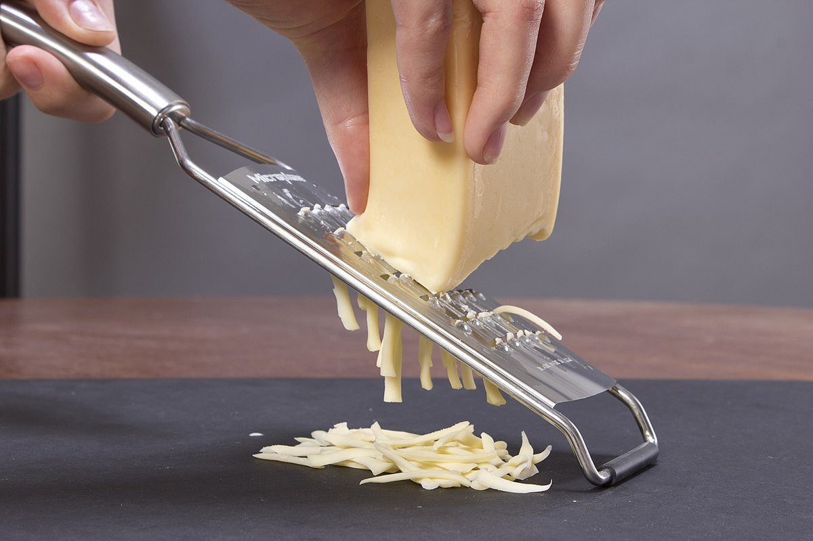

#### Common vegetables

Vegetables are available in many varieties and can be classified into biological groups or ‘families’, including:

- leafy green – lettuce, spinach and silverbeet

- cruciferous – cabbage, cauliflower, Brussels sprouts and broccoli

- marrow – pumpkin, cucumber and zucchini

- root – potato, sweet potato and yam

- edible plant stem – celery and asparagus

- allium – onion, garlic and shallot.

  

01.coriander [ˌkɒriˈændə(r)] "香菜"

02.bean sprout [biːn spraʊt] "豆芽"

##### leafy green 

03.leafy green 

"叶绿"

04.lettuce /ˈletɪs/

[n] Lettuce was grown by the Ancient Romans."生菜" 

"a plant with large green leaves that are eaten raw, especially in salad. There are many types of lettuce ."

05.spinach /ˈspɪnɪtʃ/

[n] 菠菜."a vegetable with large dark green leaves that are cooked or eaten in salads"

06.silver beet /ˈsɪlvər biːt/

[n] Silverbeet is **a good source of iron, vitamins K, A and C and calcium**. "牛皮菜"

##### cruciferous

[adj] "of or relating to or belonging to the plant family Cruciferae"

07.cabbage /ˈkæbɪdʒ/

[n] 甘蓝；卷心菜；洋白菜.

"a round vegetable with large green, purplish-red or white leaves that can be eaten raw or cooked"

08.cauliflower /ˈkɑːliflaʊər/

[n] Do you like cauliflower? "菜花"

"a vegetable with green leaves around a large hard white head of flowers"

09.Brussels sprouts /ˌbrʌslz ˈspraʊt/

[n] Eating a lot of Brussels sprouts and other cruciferous veggies **may help protect against cancers of the stomach, lungs, kidney, breast, bladder, and prostate**. 

"a small round green vegetable like a very small cabbage"

10.broccoli /ˈbrɑːkəli/

[n] 西兰花.

"a vegetable with a thick green stem and several dark green or purple flower heads"

##### marrow

11.marrow /ˈmæroʊ/

[n] 西葫芦

"a large vegetable that grows on the ground. Marrows are long and thick with dark green skin and white flesh."

12.pumpkin /ˈpʌmpkɪn/

[n] Pumpkin pie is a traditional American dish served on Thanksgiving."a large round vegetable with thick orange skin. The seeds can be dried and eaten and the soft flesh can be cooked as a vegetable or in sweet pies."

13.zucchini /zuˈkiːni/

[n] 角瓜.

"Zucchini are long thin vegetables with a dark green skin"

{NAmE :courgette}

##### root

14.yam /jæm/

[n] "the large root of a tropical plant that is cooked as a vegetable"

##### edible plant stem

15.celery /ˈseləri/

[n] a stick of celery.

 "a vegetable with long crisp light green stems that are often eaten raw"

16.asparagus /əˈspærəɡəs/

[n] 芦笋.

"a plant whose young green or white stems are cooked and eaten as a vegetable"

##### allium

17.allium /ˈæliəm/

[n] "any plant that belongs to the same group as onions and garlic"

18.shallot /ʃəˈlɑːt/

[n] 青葱;大葱."a vegetable like a small onion with a very strong taste"

#### Common fruits

Fruit is the sweet, **fleshy**, **edible** part of a plant. It generally contains seeds. Fruits are usually eaten raw, although some varieties can be cooked. They come in a wide variety of colours, shapes and flavours. Common types of fruits that are readily available include:

- apples and pears

- citrus – oranges, grapefruits, mandarins and limes

- stone fruit – nectarines, apricots, peaches and plums

- tropical and exotic – bananas and mangoes

- berries – strawberries, raspberries, blueberries, kiwifruit and passionfruit

- melons – watermelons, rockmelons and honeydew melons

- tomatoes and avocados.

  

01.avocado  [ˌævəˈkɑːdəʊ]

[noun] "a tropical fruit with hard, dark green skin, soft, light green flesh and a large seed inside. Avocados are not sweet and are sometimes eaten at the beginning of a meal."

02.fleshy /ˈfleʃi/

[adj]{of parts of the body or people} fleshy arms/lips

"having a lot of flesh"

[adj] {of plants or fruit} fleshy fruit/leaves. 

"thick and soft"

03.edible /ˈedəbl/

[adj] edible fungi/snails/flowers.

"fit or suitable to be eaten; not poisonous"

##### citrus

04.citrus /ˈsɪtrəs/

[n] A **citrus** fruit is a juicy fruit with a sharp taste such as an orange, lemon, or grapefruit.

Citrus fruits, including oranges, lemons, limes, grapefruits and clementines, are **an excellent source of vitamin C**.

"fruit belonging to the group of fruit that includes oranges, lemons, limes and grapefruit"

Mandarin and Clementine difference

The biggest difference is that **clementines are a type of mandarin**, a hybrid crossing mandarins with sweet oranges, while mandarins are a group of several different fruits that include not only clementines but satsumas, tangerines, and other varieties as well.

05.mandarin /ˈmændərɪn/

[n] "a type of small orange with loose skin that comes off easily"

06.clementine /ˈkleməntiːn/

[n] A **clementine** is a fruit that looks like a small orange."a fruit like a small orange"

07.lime /laɪm/

[n] If your soil is very acid, add lime.

"a white substance obtained by heating limestone , used in building materials and to help plants grow"

[n] lime juice. 

"a small green fruit, like a lemon, **with a lot of sour juice**, used in cooking and in drinks; the juice of this fruit"

**limes are small, round, and green, while lemons are usually larger, oval-shaped, and bright yellow**. Nutritionally, they're almost identical and share many of the same potential health benefits. Both fruits are acidic and sour, but lemons tend to be sweeter, while limes have a more bitter flavor.

08.stone fruit /stoʊn fruːt/

[n] "fleshy indehiscent fruit with a single seed: e.g. almond."

##### stone fruit

09.nectarine /ˈnektəriːn/

[n] 油桃(桃的变种，果皮光滑).

"a round red and yellow fruit, like a peach with smooth skin"

10.apricot /ˈeɪprɪkɒt/

[noun]  杏子.

"a round fruit with yellow or orange skin and a large seed inside"

11.peach /piːtʃ/

[n] a peach tree.

"a round fruit with soft red and yellow skin, yellow flesh and a large rough seed inside"

12.plum /plʌm/ 

[n] 李子"a soft round fruit with smooth red or purple skin, sweet flesh and a large flat seed inside"

##### tropical and exotic

##### melon

13.cantaloupe /ˈkæntəluːp/

[n] "a melon (= a type of fruit) with a green skin and **orange flesh**"

The **cantaloupe**, **rockmelon** (Australia and New Zealand, although cantaloupe is used in some states of Australia), **sweet melon**, or **spanspek** (Southern Africa) is a melon that is a variety of the [muskmelon](https://en.wikipedia.org/wiki/Muskmelon) species (*Cucumis melo*) from the family [Cucurbitaceae](https://en.wikipedia.org/wiki/Cucurbitaceae).

14.honeydew melon /ˌhʌnidjuː ˈmelən/

[n] You've enjoyed watermelon and honeydew melon for their sweet, succulent tastes.

"a type of melon with a pale skin and **green flesh**"

#### Common internal organs

01.internal organs  [ɪnˈtɜːnl ˈɔːgənz]

[n] "The solid *organs* include the **liver, pancreas, spleen, kidneys, and adrenal glands**."

02.plasma  [ˈplæzmə] "血浆"

[n] Keep some blood plasma back for the serious cases. 

"the clear liquid part of blood, in which the blood cells, etc. float"

03.go to work/off duty

/I'm off duty 

04.liver [ˈlɪvər]

[noun] The largest organ in the body is the liver.  

"a large organ in the body that cleans the blood and produces **bile**"

05.bile /baɪl/

[n] "the greenish brown liquid with a bitter unpleasant taste that is produced by the liver to help the body to deal with the fats we eat, and that can come into your mouth when you vomit with an empty stomach"

06.kidney [ˈkɪdni] 

[noun] a kidney infection.

"either of the two organs in the body that remove waste products from the blood and produce urine"

[noun] steak and kidney pie. "the kidneys of some animals that are cooked and eaten"

07.pancreas /ˈpæŋkriəs/

[n] **Insulin** is secreted by the pancreas.

"an organ near the stomach that produces insulin and a liquid that helps the body to digest food"

08.diabetes  [ˌdaɪəˈbiːtiːz]

[noun] "a medical condition caused by a lack of insulin[ˈɪnsəlɪn] , which makes the patient produce a lot of urine [ˈjʊərɪn] and feel very thirsty [ˈθɜːrsti]"

09.insulin  [ˈɪnsəlɪn]

[noun] No one should have to pay $1,000 a month for insulin.

"a chemical substance produced in the body that controls the amount of sugar in the blood (by influencing the rate at which it is removed); a similar artificial substance given to people whose bodies do not produce enough naturally"

10.spleen /spliːn/

[n] The spleen **controls the level of white blood cells, red blood cells and platelets** (small cells that form blood clots). 

"a small organ near the stomach that controls the quality of the blood cells" 

11.adrenal gland /əˈdriːnl ɡlænd/

[n] Adrenal glands produce **hormones** that help **regulate your metabolism**, immune system, blood pressure, response to stress and other essential functions.

"either of the two small organs above the kidneys that produce adrenalin and other hormones"

12.lung /lʌŋ/

[n] Lung cells die and are replaced about once a week. 

"either of the two organs in the chest that you use for breathing"

13.hormone /ˈhɔːrmoʊn/

[n] growth hormones.

"a chemical substance produced in the body or in a plant that encourages growth or influences how the cells and tissues function; an artificial substance that has similar effects" 

14.metabolism /məˈtæbəlɪzəm/

[n] The body's metabolism is slowed down by extreme cold.

"the chemical processes in living things that change food, etc. into energy and materials for growth"

#### How to Describe Pain in English and 

https://thinkinginenglish.blog/2021/10/22/how-to-describe-pain-in-english-essential-vocabulary-and-phrases-english-vocabulary-lesson/

https://www.vocabulary.cl/Basic/Body_Parts.htm

Sure! Here are some additional related nouns for the terms I provided earlier:

1. Headache/migraine: throbbing, pounding, tension, cluster
2. Toothache: cavity, abscess, decay, sensitive
3. Earache: infection, blockage, tinnitus, vertigo
4. Neck pain: stiffness, strain, whiplash, herniated disc
5. Back pain: sciatica, degeneration, scoliosis, spasms
6. Shoulder pain: rotator cuff, impingement, bursitis, tendinitis
7. Arm pain: tennis elbow, carpal tunnel syndrome, golfer's elbow, radial tunnel syndrome
8. Wrist pain: sprain, fracture, tendinitis, ganglion cyst
9. Hand pain: trigger finger, arthritis, De Quervain's tenosynovitis, Dupuytren's contracture
10. Chest pain: angina, heartburn, pleurisy, pericarditis
11. Abdominal pain: indigestion, constipation, hernia, appendicitis
12. Pelvic pain: menstrual cramps, endometriosis, urinary tract infection, pelvic inflammatory disease
13. Hip pain: bursitis, osteoarthritis, hip flexor strain, hip labral tear
14. Leg pain: shin splints, deep vein thrombosis, restless leg syndrome, sciatica
15. Knee pain: ACL tear, meniscus tear, patellar tendinitis, osteoarthritis
16. Ankle pain: sprain, fracture, Achilles tendinitis, plantar fasciitis
17. Foot pain: plantar fasciitis, heel spurs, metatarsalgia, Morton's neuroma
18. Heel pain: plantar fasciitis, Achilles tendinitis, bursitis, heel spur
19. Joint pain: arthritis, gout, lupus, rheumatoid arthritis
20. Muscle pain: myalgia, fibromyalgia, polymyalgia rheumatica, rhabdomyolysis.

I hope this helps!

Sure, here are some additional terms to describe pain and discomfort related to the body:

1. Bruises - discoloration and tenderness caused by an injury to the skin and underlying tissue
2. Sprains - stretching or tearing of ligaments that connect bones
3. Muscular pain - pain or discomfort in the muscles
4. Muscular fatigue - tiredness or weakness in the muscles
5. Lumbago - lower back pain, typically felt around the lumbar region of the spine
6. Stiff shoulders - pain or discomfort in the shoulders, often accompanied by limited range of motion
7. Backache - pain or discomfort in the back, often related to the muscles, joints, or bones of the spine.

These terms may be used to describe different types of pain or discomfort in the body, and may have different causes, symptoms, and treatments. It's important to consult a medical professional if you experience any persistent or severe pain or discomfort.

01.femur  /ˈfiːmər/

[n] Your **femur** is the large bone in the upper part of your leg.

"the thigh bone"

02.tibia /ˈtɪbiə/

[n] Your **tibia** is the inner bone of the two bones in the lower part of your leg.

"the shin bone"

03.calf /kɑːf/ /kæf/

[n] I've torn a calf muscle. "the back part of the leg between the ankle and the knee"

#### common animnal

01.owl  /aʊl/

[n] An owl hooted nearby.

"a bird of prey (= a bird that kills other creatures for food) with large round eyes, that hunts at night. Owls are traditionally thought to be wise."

02.beaver /ˈbiːvər/

[n] A beaver is an animals with big front teeth.  

"an animal with a wide flat tail and strong teeth. Beavers live in water and on land and can build dams (= barriers across rivers), made of pieces of wood and mud. It is an official symbol of Canada."

03.raccoon /ræˈkuːn/

[n] Little Raccoon Biscuits.

"a small N American animal with greyish-brown fur, black marks on its face and a thick tail"

04.gorilla /ɡəˈrɪlə/

[n] Google’s Photo App Still Can’t Find Gorillas. And Neither Can Apple’s.

"a very large powerful African ape (= an animal like a large monkey without a tail) covered with black or brown hair"

05.kangaroo /ˌkæŋɡəˈruː/

[n] I saw my kangaroo brother at the AK Plaza。

"a large Australian animal with a strong tail and back legs, that moves by jumping. The female carries its young in a pocket of skin (called a pouch ) on the front of its body."

#### common musical instrument 

01.cymbal /ˈsɪmbl/

[n] a clash/crash of cymbals.

"a musical instrument in the form of a round metal plate. It is hit with a stick, or two cymbals are hit against each other."

#### Vocabulary for kitchen layout and furniture 

##### kitchen layout

| **Word**                | **Example sentence**                                         | **Which preposition of place should you use?** |
| ----------------------- | ------------------------------------------------------------ | ---------------------------------------------- |
| cabinet(s)              | Tom put the glass in the kitchen cabinet.                    | in                                             |
| cupboard(s)             | I put the clean plates back in the cupboard                  | in                                             |
| shelf (plural: shelves) | I like to keep the tea bags on the middle shelf.             | on                                             |
| sink(s)                 | Can you do the dishes? I put everything in the sink.         | in                                             |
| counter (s)             | The cutting board is on the counter. Can you chop up the veggies? | on                                             |

01.cabinet /ˈkæbɪnət/

[n] a cabinet meeting. 

"a group of chosen members of a government, which is responsible for advising and deciding on government policy"

[n] kitchen cabinets. 

"a piece of furniture with doors, drawers and/or shelves, that is used for storing or showing things"

02.cupboard /ˈkʌbərd/

[n] kitchen cupboards.

"a piece of furniture with doors and shelves used for storing dishes, food, clothes, etc."

03.shelf /ʃelf/

[n] The book I wanted was on the top shelf. "a flat board, made of wood, metal, glass, etc., fixed to the wall or forming part of a cupboard/closet, bookcase , etc., for things to be placed on"

04.counter /ˈkaʊntər/

[n] I asked the woman behind the counter if they had any postcards.

"a long flat surface over which goods are sold or business is done in a shop/store, bank, etc."

##### Kitchen appliance

| **Word**                                | **Example sentence**                                         |
| --------------------------------------- | ------------------------------------------------------------ |
| fridge                                  | We use the fridge to keep some types of food fresh, like cheese and yoghurt. |
| freezer                                 | Remember to take the chicken out of the freezer so we can make it for lunch tomorrow. |
| microwave                               | You can warm up your leftovers in the microwave.             |
| blender                                 | I use my blender every day to make green smoothies.          |
| juicer                                  | My mom uses the juicer to make orange juice every morning.   |
| coffee machine                          | She poured a cup of coffee from the coffee machine.          |
| hand-mixer                              | You can make cookie dough using a hand-mixer.                |
| stand-mixer                             | A stand-mixer is necessary if you want to make chocolate brownies. |
| slow cooker (also known as *crock pot*) | Throw some ingredients in the slow cooker in the morning and you’ll have a delicious meal in the evening. |
| stove (gas or electric)                 | My mom prefers cooking on a gas stove.                       |
| cooker (British word for a stove)       | The water is boiling on the cooker.                          |
| oven                                    | Place the pizza on the middle rack of the oven.              |
| sandwich maker                          | A good sandwich toaster should be quick to heat up.          |
| toaster                                 | We use a toaster to toast bread.                             |
| waffle maker                            | I bought a waffle maker to make perfect waffles at home.     |
| dishwasher                              | I hate doing the dishes. Maybe I should get a dishwasher…    |

01.appliance /əˈplaɪəns/

[n] electrical/household appliances.

"a machine that is designed to do a particular thing in the home, such as preparing food, heating or cleaning"

02.stove  /stoʊv/

[n] stove (gas or electric). 

"= cooker"

03.oven /ˈʌvn/

[n] Take the cake out of the oven.

"the part of a cooker/stove shaped like a box with a door on the front, in which food is cooked or heated"

##### Kitchen objects 

| **Word**      | **Example sentence**                                         |
| ------------- | ------------------------------------------------------------ |
| bowl          | I use a bowl to eat cereal.                                  |
| cup           | I drink tea in a cup.                                        |
| fork          | I use a fork to eat a piece of cake.                         |
| knife         | I need a knife to cut a steak.                               |
| spoon         | I need a spoon to eat ice cream.                             |
| frying pan    | I make eggs in a frying pan.                                 |
| glass         | I drink soda in a glass.                                     |
| kettle        | The kettle is used to boil water.                            |
| kitchen scale | We use the kitchen scale to measure the weight of ingredients. |
| mug           | I drink coffee in a mug.                                     |
| plate         | We use plates to serve food.                                 |
| bin           | We throw trash in a bin.                                     |
| cutting board | I use the cutting board to chop vegetables.                  |
| pot           | I use a pot to make rice.                                    |
| ladle         | We use a ladle to serve beans, sauces, and stews.            |
| measuring cup | I use the measuring cup to measure liquids.                  |
| dish rack     | The dish rack is used to air dry the dishes.                 |

01.kettle /ˈketl/

[n] an electric kettle.

"a container with a lid, handle and a spout , used for boiling water"

02.kitchen scale 

[phrase] Porduct: Bathroom Scale, Body Fat& Water Scale, Kitchen Scale. 

03.ladle /ˈleɪdl/

[n] "a large deep spoon with a long handle, used especially for serving soup"

[v] "to place food on a plate with a large spoon or in large quantities"

04.dish rack /dɪʃ ræk/

[n] "a rack for holding dishes as dishwater drains off of them"

##### Cleaning product

01.dish soap /dɪʃ soʊp/ 

[] "Dishwashing liquid, also known as dishwashing soap, dish detergent, and dish soap is a detergent used to assist in dishwashing."

02.sponge /spʌndʒ/

[n] (figurative) His mind was like a sponge, ready to absorb anything.

"a piece of artificial or natural material that is soft and light and full of holes and can hold water easily, used for washing or cleaning"

03.microfiber towels 

04.broom /bruːm/

[n] "a brush on the end of a long handle, used for sweeping floors"

05.mop /mɑːp/

[n] a mop and bucket.

"a tool for washing floors that has a long handle with a bunch of thick strings or soft material at the end"

06.duster /ˈdʌstər/

[n] "a cloth for removing dust from furniture"

##### Cooking verbs in English

| **Verb**                               | **Example with meaning**                                     |
| -------------------------------------- | ------------------------------------------------------------ |
| melt                                   | I need to **melt** the butter before adding it to the mix.   |
| break (irregular verb: broke/broken)   | Can you **break** two eggs into the frying pan, please?      |
| spread (irregular verb: spread/spread) | I use a knife to **spread** peanut butter on my toast.       |
| fry                                    | I like to use oil to **fry** eggs.                           |
| mix                                    | Can you **mix** the flour, sugar, and butter together in a bow? |
| whip                                   | If you **whip** heavy cream you will get whipped cream.      |
| sauté                                  | Most people **saute** vegetables like mushrooms or onions in a pan on the stove with a small amount of fat. |
| taste                                  | Would you like to **taste** the sauce?                       |
| cut (irregular verb: cut/cut)          | Do you need help **cutting** the meat?                       |
| chop                                   | I need you to **chop** the spring onions.                    |
| slice                                  | Can I **slice** the onions?                                  |
| grate                                  | I will **grate** the Parmesan cheese.                        |
| boil                                   | The water needs to **boil** before you add the pasta.        |

01.whip /wɪp/

[v] Whip the egg whites up into stiff peaks.

"to stir cream, etc. very quickly until it becomes stiff"

02.saute /sɔˈteɪ/

[v] "fry briefly over high heat"

03.grate /ɡreɪt/

[v] grated apple/carrot/cheese, etc. 

"to rub food against a grater in order to cut it into small pieces"

04.grater /ˈɡreɪtə(r)/

[n] a cheese/nutmeg grater. 

"a kitchen utensil (= a tool) with a rough surface, used for grating food into very small pieces"

