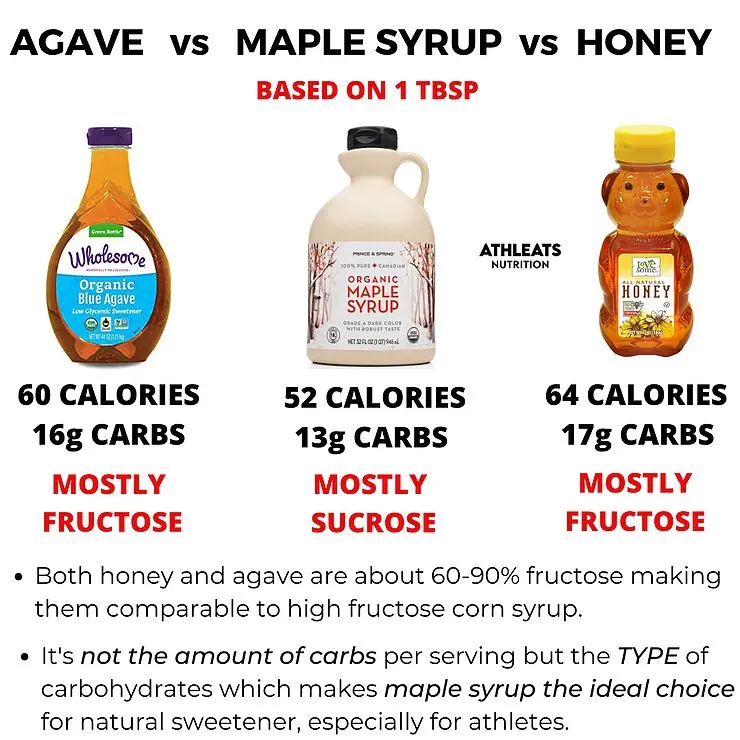

#### Previously on:0~50

01.adapt  [əˈdæpt] 
[verb] { ~ sth (for sth)} Most of these tools have been specially adapted for use by  disabled people.

"to change sth in order to make it suitable for a new use or situation [ˌsɪtʃuˈeɪʃn]"

[verb] {~ (yourself) (to sth)} We have had to adapt quickly to the new system.

"to change your behaviour in order to deal more successfully with a new situation" -modify- 

[verb] { ~ sth (for sth) (from sth)} Three of her novels have been adapted for television. 

"to change a book or play so that it can be made into a play, film/movie, television programme, etc." -adjust- "小说改编的电视剧"


02.adaptive /əˈdæptɪv/

[adj] The chameleon /kəˈmiːliən/ is highly adaptive, allowing it to change its color to blend in with different environments.

"concerned with changing; able to change when necessary in order to deal with different situations"


03.adoption  [əˈdɒpʃn]

[noun] She put the baby up for adoption. "the act of adopting a child"

[noun] the act of adopting a child. "the decision to start using sth such as an idea, a plan or a name"

[noun] his adoption as the Labour candidate. "the act of choosing sb as a candidate for an election"


04.adopt  [əˈdɒpt] [əˈdɑːpt]

[v] a **campaign** to encourage childless couples to adopt. "to take sb else's child into your family and become its legal parent(s)"

[v] All three teams adopted different approaches to the problem. "to start to use a particular method or to show a particular attitude towards sb/sth"

[v] to adopt a **resolution**. "to formally accept a suggestion or policy by voting"


05.campaign /kæmˈpeɪn/

[n] {~ (against/for sth)} a campaign against **ageism** in the workplace.

"a series of planned activities that are intended to achieve a particular social, commercial or political aim" '运动'


campaign vs activity

运动vs活动


06.intuition  [ˌɪntjuˈɪʃn]

[noun] { ~ (that…)} I had an intuition that something awful was about to happen.

"an idea or a strong feeling that sth is true although you cannot explain why"


07.intuitive /ɪnˈtjuːɪtɪv/ /ɪnˈtuːɪtɪv/

[adj] He had an intuitive sense of what the reader wanted. 

"obtained by using your feelings rather than by considering the facts"


08.counter-intuitive  [ˌkaʊntər ɪnˈtjuːɪtɪv] 

[adj] These results seem counter-intuitive. In Python, NaN is considered not equal to itself, which might seem counterintuitive

"the opposite of what you would expect or what seems to be obvious"


09.principle  [ˈprɪnsəpl] 

[noun] He has high **moral principles**.

"a moral rule or a strong belief that influences your actions"

[n] Before applying specific techniques, **grasp** the underlying principles and translate them into code.

"a law, a rule or a theory that sth is based on"


10.grasp [ɡrɑːsp]   [ɡræsp]

[verb]  He grasped my hand and shook it warmly."to take a firm hold of sb/sths" -grip-

[verb] They failed to grasp the importance of his words. "to understand **sth completely**"

[verb] I grasped the opportunity to work abroad.  "to take an opportunity without hesitating and use it"

[noun] I grabbed him, but he slipped from my grasp."a firm hold of sb/sth or control over sb/sth"

[noun] He has a good grasp of German grammar. "a person's understanding of a subject or of difficult facts"

[noun] Success was within her grasp. "the ability to get or achieve sth"


> grasp vs grab
>
> **"grasp" is more about holding something and emphasizes the hand.** **"grab" is more about taking it or moving it**, though the first step might involve grasping with one's hand. The words also have distinct mental definitions. "grab" can mean cause interest in or gain one's attention.


11.grip  [ɡrɪp]

[noun] {~ (on sb/sth)} Keep a tight grip on the rope.

"an act of holding sb/sth tightly; a particular way of doing this" -grasp-


> grasp vs grip
>
> They both mean "hold firmly", but grasp can also be used for abstract objects like 'ideas' or 'thoughts'. 
>
> ex. 
>
> O I've **grasped** the idea of grammar.        
>
> X I've **gripped** the idea of grammar. (except for poetic purposes) 
>
> Also, I believe the slight difference between grasp and grip is that grasp has a more recent, light, uncertain or unconcerned feeling, but the action is finished. Grip has a very strong affirmation in the action, and it's continuous. Therefore: 
>
> Grasp - a firm hold that just happened, and unsure whether how long the hold will last, or will need to last, but it's done. 
>
> Grip - a firm hold that's doing all it can to never let go.


12.gripping /ˈɡrɪpɪŋ/

[adj] Perhaps more gripping events close at hand.  

"exciting or interesting in a way that keeps your attention"


13.ceasefire [ˈsiːsfaɪər]

[noun] Observers have reported serious violations of the ceasefire.

"a time when enemies agree to stop fighting, usually while a way is found to end the fighting permanently"


14.cease [siːs]

[verb] {formal}  **Welfare** payments cease as soon as an individual starts a job. 

"to stop happening or existing; to stop sth from happening or existing"

[phrase] cease and desist [ˌsiːs ən dɪˈzɪst]. 


15.halt [hɔːlt] 

[noun] Work came to a halt when the machine broke down.

"an act of stopping the movement or progress of sb/sth"

[verb] China halts short-term visas in Korea, first response to COVID **curb**s.

"to stop; to make sb/sth stop"


```javascript
cease is usually followed by a noun or action and is extremely formal. You'll almost never hear it in modern conversation. A common usage for cease is a "Cease and Desist" letter which is a letter sent to an individual telling them to stop doing an illegal activity.  

Halt is also extremely formal and outdated English. It typically means to stop movement. So a guard in medieval times might stop someone from entering somewhere. It is also used in formal letters where it has the same meaning as stop.
```


16.curb  [kɜː(r)b]

[verb] He needs to learn to curb his **temper**./Biden, Xi agree to restore military dialogue, curb fentanyl in high-stakes summit.

"to control or limit sth, especially sth bad"


```javascript
抑制vs控制
The words "curb" and "control" are often used interchangeably, but they have slightly different meanings depending on the context in which they are used.

- Curb: This word refers to the act of limiting or restraining something, such as a behavior or an action. For example, one might say "The government is trying to curb illegal drug use by implementing stricter laws."
- Control: This word generally means to have power over or to regulate something, often with the intention of maintaining stability or order. For example, one might say "The police are trying to control the situation by dispersing the crowd."

While both words can be used to refer to the act of regulating or limiting something, "curb" typically implies a more **restrictive or restraining action**, while "control" may imply a more active or ongoing effort to manage a situation or behavior.
```

 

17.restrain /rɪˈstreɪn/

[verb] The **prisoner** had to be restrained by the police.

"to stop sb/sth from doing sth, especially by using physical force"

[verb] John managed to restrain his anger.

"to stop yourself from feeling an emotion or doing sth that you would like to do"


18.prisoner /ˈprɪznər/

[noun] The *number* of prisoners serving **life sentences** has *fallen*.

"a person who is kept in prison as a punishment, or while they are waiting for trial"


19.life sentence /ˈlaɪf sentəns/

[noun] Some were serving life sentences for murder.

"the punishment by which sb spends the rest of their life in prison"


20.trial [ˈtraɪəl]

[noun] if you get caught **dealing** drugs in China you have an immediate and quick trial, and by the end of the day, you are executed/ˈeksɪkjuːtɪd/.

"a formal examination of evidence in court by a judge and often a jury , to decide if sb accused of a crime is guilty or not"

[n] This year, the company introduced a new biometric identification system using the facial features of travelers, known as Smart Pass at departure and boarding gates at a trial level. 

"the process of testing the ability, quality or performance of sb/sth, especially before you make a final decision about them"


21.execute [ˈeksɪkjuːt]

[verb] He was executed for **treason**. "to kill sb, especially as a legal punishment"

[verb] They drew up and executed a plan to reduce fuel consumption. 

"to do a piece of work, perform a duty, put a plan into action, etc."


22.deal  [diːl]

[verb] Whose turn is it to deal?/He dealt me two aces. "to give cards to each player in a game of cards"

[verb] You can often see people dealing openly on the streets."to buy and sell **illegal drugs**"

[noun] {a good/great ~}  They spent **a great deal of** money. "much; a lot"

[noun] to make/sign/conclude/close a deal (with sb).

"an agreement, especially in business, on particular conditions for buying or doing sth"


23.mate  [meɪt] 

[noun] They've been best mates since school. "a friend"

[verb] { ~ (with sth)} Do foxes ever mate with dogs?

"to have sex in order to produce young"


24.Israel /ˈɪzreɪəl/ /ˈɪzriəl/

[n] Israel-Hamas war live updates: Netanyahu says Israel will not agree to a cease-fire.


25.coup [kuː]

[noun] He **seized** power in a military coup in 1997.

"a sudden, **illegal and often violent**, change of government"

[noun] Getting this contract has been quite a coup for us. 

"the **fact of achieving** sth that was **difficult** to do"


26.seize  [siːz] 

[verb] {~ sth (from sb)}  She tried to seize the gun from him.

"to take sb/sth in your hand suddenly and using force" -grab-

[verb] A large quantity of drugs was seized during the **raid**.

"to take illegal or stolen goods away from sb" "扣押"

[verb] The Taliban showed off  dozens of American-made armored vehicles and new weapons they seized.


27.raid /reɪd/

[noun] {~ (on sth)} They carried out a bombing raid on enemy bases./Gaza's al-Shifa hospital in ruins after two-week Israeli raid.

"a **short surprise** **attack** on an enemy by soldiers, ships or aircraft"

[verb] The Financial Supervisory Service (FSS) raided the office of Kakao founder Kim Beom-su, Thursday, for his alleged involvement in stock manipulation./Incheon police agency raided over death of actor Lee Sun-kyun.

"to visit a person or place without warning to look for criminals, illegal goods, drugs, etc."


28.virgin /ˈvɜːrdʒɪn/

[noun]  "a person who has never had sex"

[noun] "the Virgin Mary, mother of Jesus Christ"

[noun] a political virgin. "a person who has no experience of a particular activity"

[adj] virgin forest/land/**territory** .

"in its original pure or natural condition and not changed, touched or spoiled"

[adj] a virgin bride. "with no sexual experience"


29.embody [ɪmˈbɒdi]  [ɪmˈbɑːdi] 

[verb] a **politician** who embodied the hopes of black youth. 

"to express or **represent** an idea or a quality"-represent-

[verb] This model embodies many new features. "to **include** or contain sth"


30.politician /ˌpɒləˈtɪʃn/ /ˌpɑːləˈtɪʃn/

[noun] They have arrested a number of leading opposition politicians.

"a person whose job is concerned with politics, especially as an elected member of parliament, etc."


31.fee [fiː] 

[noun] legal fees. "an amount of money that you pay for professional advice or services"

[noun] membership fees. "an amount of money that you pay to join an organization, or to do sth"


32.feed/fiːd/ fee fee

[verb] Have you fed the cat yet?"to give food to a person or an animal"

[verb] They have a large family to feed. "to provide food for a family or group of people"


33.intruder  [ɪnˈtruːdə(r)] 

[noun] "a person who enters a building or an area illegally"

[noun] The people in the room seemed to regard her as an unwelcome intruder. "a person who is somewhere where they are not wanted" "不速之客"


34.indicator [ˈɪndɪkeɪtə(r)]

[noun] The economic indicators are better than expected. "a sign that shows you what sth is like or how a situation is changing"

[noun] a depth indicator. "a device on a machine that shows speed, pressure, etc."


35.debunk [ˌdiːˈbʌŋk]

[verb] Toss Bank, a Korean internet bank established by Viva Republica, has debunked rumors of a liquidity crisis, saying its deposit holdings remain stable.

"to show that an idea, a belief, etc. is false; to show that sth is not as good as people think it is" 

"揭穿…的真相"


36.boundary  [ˈbaʊndri] 

[noun] national boundaries. "a real or imagined line that marks the limits or edges of sth and separates it from other things or places; a dividing line"


37.territory  [ˈterətri]  [ˈterətɔːri]

[noun] enemy/**disputed**/foreign territory. "land that is under the control of a particular country or ruler" '领土'

[noun] **Mating** blackbirds will defend their territory against **intruders**.  '地盘'


##### 


```javascript
"an area that one person, group, animal, etc. considers as their own and defends against others who try to enter it"

"Region" and "territory" are related words that both refer to a specific geographic area, but they have slightly different connotations.

A "region" is a larger and more general area that is defined by certain characteristics such as geography, climate, culture, or economy. For example, a region might be defined by a common language, shared history, or similar geographic features such as mountains or coastlines. Regions can be political, cultural, or geographical in nature, and they can overlap with other regions.

A "territory," on the other hand, is a more specific area that is defined by political or legal boundaries. It usually refers to a defined area that is governed by a particular government or authority. For example, a territory might be a country, state, province, or any other political division that has a specific set of rules, regulations, and governance structures.

In summary, "region" refers to a larger and more general area that is defined by certain characteristics, while "territory" refers to a specific area that is defined by political or legal boundaries.
```


38.dispute [dɪˈspjuːt] 

[noun] The dispute ended. But now the electric vehicle market is growing and Elon Musk is also the owner of the electric manufacturer company Tesla in the world and the company claims that it is the best electric car.

"an argument or a disagreement between two people, groups or countries; discussion about a subject where there is disagreement"

[verb] "to question whether sth is true and valid"


39.debate /dɪˈbeɪt/

[n] a debate on abortion.

"a formal discussion of an issue at a public meeting or in a parliament. In a debate two or more speakers express opposing views and then there is often a vote on the issue."

[v] Politicians will be debating the bill later this week. "to discuss sth, especially formally, before making a decision or finding a solution"

[v] She debated with herself for a while, and then picked up the phone.

"to think carefully about sth before making a decision"


> 辩论vs争辩
>
> Debate - to discuss a topic usually with opposing opinions. 
>
> Dispute - to argue with strong opposing opinions. It can also mean debate but is used to specify a heated argument or disagreement.


40.crow [krəʊ]  [kroʊ] 

[noun] "a large bird, completely or mostly black, with a rough unpleasant cry"

[noun] She gave a little crow of **triumph**. "a **sound** like that of a cock/rooster crowing"

[verb] "to make repeated loud high sounds, especially early in the morning"

[verb] {~ (about/over sth)} He won't stop crowing about his victory.

"to talk too proudly about sth you have achieved, especially when sb else has been unsuccessful" -boast/gloat-


41.raven /ˈreɪvn/

[noun] "a large bird of the crow family, with shiny black feathers and a rough unpleasant cry" "渡鸦"

[verb] "obtain or seize by violence"


```javascript
Blackbirds and crows are both members of the bird family Corvidae, but they are different species with distinct physical and behavioral characteristics.

Blackbirds, also known as common blackbirds, are medium-sized birds with all-black feathers and a yellow eye-ring. They are primarily ground foragers, feeding on insects, worms, and fruits. They are also known for their melodious singing, and males often sing from treetops to attract mates.

Crows, on the other hand, are larger birds with glossy black feathers and a distinctive thick beak. They are omnivorous and will eat a variety of foods, including insects, small animals, fruits, and carrion. Crows are known for their intelligence and social behavior, and they are often observed in large groups.

In summary, the main differences between blackbirds and crows are their physical appearance, diet, and behavior. Blackbirds are smaller, have a yellow eye-ring, feed primarily on the ground, and are known for their singing, while crows are larger, have a thick beak, are omnivorous, and are known for their intelligence and social behavior.
```


42.boast /boʊst/

[v] I don't want to boast, but I can actually speak six languages.

"to talk with too much pride about sth that you have or can do" "自吹自擂"

[n] Despite his boasts that his children were brilliant, neither of them went to college. 

"something that a person talks about in a very proud way, often to seem more important or clever"


43.gloat /ɡloʊt/

[v] She was still gloating over her rival's disappointment.

"to show that you are happy about your own success or sb else's failure, in an unpleasant way" "幸灾乐祸"

[adj] a gloating look.


44.depict [dɪˈpɪkt]

[verb] a painting depicting the **Virgin and Child**. "to show an image of sb/sth in a picture"

[verb] The novel depicts French society in the 1930s. "to describe sth in words, or give an impression of sth in words or with a picture"

D[noun] They object to the movie's depiction of gay people.


45.couldn't help doing  '忍不住做某事'

[phrase] *We* *can't* *help* *intervening* *here,* *before* *you* *throw* *your* *life* *away* *on* *drugs!* 

"To have a compulsion to do something that is too strong to ignore or avoid."

[phrase] *I* *know* *it's* *silly,* *but* *I* *can't* *help* *feeling* *like* *I* *failed* *you* *somehow.*

"To have no control over or be unable to avoid some action."


47.wiggle  [ˈwɪɡl] 

[verb] Her bottom wiggled **as** she walked past. 

"to move from side to side or up and down in short quick movements; to make sth move in this way" 

[noun] "a small movement from side to side or up and down"


48.jiggle /ˈdʒɪɡl/

[verb] Stop jiggling around!

"to move or make sth move up and down or from side to side with short quick movements"


The difference between "wiggle" and "jiggle" is **the control had in the movement**. If something jiggles it is uncontrolled... how far it moves, which direction etc etc may be constrained, but are essentially random. If something wiggles then the movement is controlled.


**A wiggle is the movement that you make with your body; a jiggle is the way something (like jelly) shakes as a result of being moved**. A wiggle could cause a jiggle.


49.bottom /ˈbɒtəm//ˈbɑːtəm/

[noun] "the part of the body that you sit on" -backside,behind,ass-


50.spank /spæŋk/ 

[verb] When I used to do that when I was a kid, my mom would spank me.

"to hit sb, especially a child, several times on their bottom **as a punishment**"


#### Previously on: 50~100

51.pronounced /prəˈnaʊnst/

[adj] He walked with a pronounced limp. "very **noticeable**, obvious or strongly expressed" -definite-


"Pronounced" typically describes something that is very noticeable or prominent, often because it is emphasized or exaggerated. For example, you might say that someone has a pronounced accent, meaning that their way of speaking stands out and is very distinct. Similarly, a pronounced feature of a building might refer to a particular element that is especially prominent or noticeable.

"Obvious," on the other hand, simply means that something is easily perceived or understood, without necessarily implying that it is particularly prominent or emphasized. For instance, you might say that it's obvious that it's raining outside because you can hear the sound of the raindrops on the **roof**, even if the rain is not particularly heavy or noticeable.

In summary, "pronounced" suggests that something is very noticeable or **prominent**, often because it is emphasized, while "obvious" simply means that something is easily perceived or understood, without necessarily implying that it is particularly prominent or emphasized.


52.limp /lɪmp/

[noun] {[usually sing.]} to walk with a slight/pronounced limp. 

"a way of walking in which one leg is used **less than normal** because it is injured or **stiff**"

[verb] She had **twisted her ankle** and was limping.

"to walk slowly or with difficulty because one leg is injured"

[adj]  His hand went limp and the knife **clattered** to the ground.

"lacking strength or energy"


53.stiff /stɪf/

[adj] The windows were stiff (窗户紧)and she couldn't get them open. 

"firm and difficult to bend or move"


54.clatter /ˈklætər/

[v] He dropped the knife and it clattered on the stone floor.

"if hard objects clatter , they knock together and make a loud noise"

[v] The cart clattered over the cobbles.

"to move making a loud noise like hard objects knocking together"


55.cobble /ˈkɑːbl/

[n] **Cobblestones** are stones with a rounded upper surface which used to be used for making streets.

"**Cobbles** are the same as **cobblestones** ."


56.tropic /ˈtrɑːpɪk/

[noun] "the area between the two tropics , which is the hottest part of the world"-the torrid zone-


57.vital [ˈvaɪtl]

[adj] {~ (for/to sth)} the vitamins that are vital for health./

If Americans want to really compete in this vital industry, we’re going to have to **step up** our game.

"necessary or essential in order for sth to succeed or exist"


58.step up /step ʌp/

[pv] He urged donors to step up their efforts to send aid to Somalia...

"If you **step up** something, you **increase** it or increase its intensity."


59.essential /ɪˈsenʃl/

[adj] Money is not essential to happiness.

"completely necessary; extremely important in a particular situation or for a particular activity"

[adj] The essential difference between Sara and me is in our attitude to money.

"connected with the most important aspect or basic nature of sb/sth"

[noun] I only had time to pack the bare essentials (= the most necessary things) .

"something that is needed in a particular situation or in order to do a particular thing"

[noun] the essentials of English grammar.

"an important basic fact or piece of knowledge about a subject"


60.crucial /ˈkruːʃl/

[adj] Winning this contract is crucial to the success of the company.

"extremely important, because it will affect other things"

[adv] crucially important.


"Critical" is another word that is often used to describe something that is important, but it has a slightly different meaning compared to "crucial," "vital," and "essential." Here's a breakdown of each word:

- Crucial: Something that is crucial is essential to the success or completion of something else. It suggests that without this particular element, the entire endeavor would be jeopardized. For example, "His experience was crucial to the project's success," suggests that without his experience, the project would have failed.
- Vital: Something that is vital is necessary for the existence, well-being, or continued existence of something else. It suggests that the thing being described is absolutely necessary and cannot be replaced. For example, "Oxygen is vital to human survival," suggests that without oxygen, humans cannot survive.
- Essential: Something that is essential is necessary in order to achieve a certain result or outcome. It suggests that the thing being described is important, but may not necessarily be irreplaceable. For example, "Good communication is essential for a successful team," suggests that good communication is **necessary** for success, but there may be other ways to achieve success besides good communication.
- Critical: Something that is critical is extremely important and often urgent. It suggests that the situation is serious and requires immediate attention. For example, "The patient's condition is critical," suggests that the patient's condition is very serious and requires urgent medical attention.

So, while all four words describe something that is important, crucial implies that the thing being described is indispensable for success, vital suggests that it is necessary for existence, essential implies that it is necessary for achieving a desired outcome, and critical implies that the situation is serious and requires immediate attention.


61.survival /sərˈvaɪvl/ 

[n] His only chance of survival was a heart transplant.

'the state of continuing to live or exist, often despite difficulty or danger' 'the noun of survive'


62.specify [ˈspesɪfaɪ] 

[verb] Remember to specify your size when ordering clothes. 

"to state sth, especially by giving an **exact measurement**, time, **exact instructions**, etc."


63.specific /spəˈsɪfɪk/

[adj] ‘I'd like your help tomorrow.’ ‘Can you be more specific (= tell me exactly what you want) ?’

"**detailed and exact**" -precise-

[adj] The money was collected for a specific purpose.

"connected with one particular thing only" -particular-

[adj] a belief that is specific to this part of Africa.

"existing only in one place or limited to one thing" -peculiar-


64.philosophy [fəˈlɒsəfi]

[noun] moral philosophy.

"the study of the nature and meaning of the universe and of human life"


65.tilt  [tɪlt]

[verb]  Suddenly the boat tilted to one side. /should the high pull down be **tilt**ed back

"to move, or make sth move, into a position with one side or end higher than the other"

[noun] The table is at a slight tilt. 

"a position in which one end or side of sth is higher than the other; an act of tilting sth to one side"


66.accommodate  [əˈkɒmədeɪt]

[verb] The hotel can accommodate up to 500 guests."to provide sb with a room or place to sleep, live or sit"

[verb] Over 70 minutes of music can be accommodated on one CD."to provide enough space for sb/sth" 

[verb] Our proposal tries to accommodate the special needs of minority groups. 

"to **consider** sth, such as sb's opinion or a fact, and be influenced by it when you are deciding what to do or explaining sth"


67.trade-off [ˈtreɪd ɒf] 

[noun] There is a trade-off between the benefits of the drug and the risk of side effects. 

"the act of balancing two things that you need or want but which are opposed to each other"


68.rebel  [ˈrebl , rɪˈbel] 

[noun] rebel forces. "a person who fights against the government of their country"

[verb] {~ (against sb/sth)} He later rebelled against his strict religious upbringing. "to fight against or refuse to obey an authority, for example a government, a system, your parents, etc."


69.wrinkle /ˈrɪŋkl/

[noun] There were **fine** wrinkles around her eyes.

"a line or small fold in your skin, especially on your face, that forms as you get older"

[verb] She wrinkled up her nose **in** **distaste**.

"to make the skin on your face form into lines or folds; to form lines or folds in this way"


70.fine

[adj] You really need a magnifying glass to appreciate all the fine detail.

"difficult to see or describe" -subtle-


71.subtle  [ˈsʌtl] 

[adj] There are subtle differences between the two versions.

"not very noticeable or obvious"

[adj] I decided to try a more subtle approach.

"behaving in a clever way, and using indirect methods, in order to achieve sth"


72.distaste /dɪsˈteɪst/

[noun] a distaste for politics of any sort.

"a feeling that sb/sth is unpleasant or offensive" 


73.practical  [ˈpræktɪkl] 

[adj] to have gained practical experience of the work. "connected with real situations rather than with ideas or theories"

[adj] There are a bunch of other cashless QR code payment systems in addition to GrabPay, but most are not practical for visitors.

"right or sensible; likely to be successful"

[noun]"a lesson or an exam in science or technology in which students have to do or make things, not just read or write about them"


74.typically  [ˈtɪpɪkli]  

[adv] The factory typically produces 500 chairs a week. "used to say that sth **usually happens** in the way that you are stating"

[adv] typically American hospitality. "in a way that shows the usual qualities or features of a particular type of person, thing or group"

[adv] in the way that you expect sb/sth to behave. "Typically, she couldn't find her keys."


75.cross-validation  [krɒs ˌvælɪˈdeɪʃən] "交叉验证"


76.systematic  [ˌsɪstəˈmætɪk] 

[adj] a systematic approach to solving the problem."done according to a system or plan, in a thorough, efficient or determined way"

D[adj]  The search was carried out systematically.


77.After all 毕竟;居然;终究;

[adv] after all, she is your boss, so invite her.

"emphasizes something to be considered"

[adv] it didn't rain after all."in spite of expectations"


78.unfortunate  [ʌnˈfɔːtʃənət] 

[adj] He was unfortunate to lose in the final round. "having bad luck; caused by bad luck"

[adj] She described the decision as ‘unfortunate’. "if you say that a situation is unfortunate , you wish that it had not happened or that it had been different"

[adj] It was an unfortunate choice of words."embarrassing and/or offensive"

[noun] one of life's unfortunates "a person who does not have much luck, money, etc."


79.straddle [ˈstrædl]

[verb] He **swung** his leg over the motorcycle, straddling it easily. "to sit or stand with one of your legs on either side of sb/sth"

[verb] The mountains straddle the French-Swiss border. "to cross, or exist on both sides of, a river, a road or an area of land"

[verb] a writer who straddles two cultures. "to exist within, or include, different periods of time, activities or groups of people"


80.theoretical  [ˌθɪəˈretɪkl]

[adj] a theoretical approach. "concerned with the ideas and principles on which a particular subject is based, rather than with practice and experiment"

D[adv] theoretically sound conclusions.


81.illustrate  [ˈɪləstreɪt] 

[verb] {~ sth (with sth)} an illustrated textbook. "to use pictures, photographs, diagrams, etc. in a book, etc."

[verb] To illustrate my point , let me tell you a little story. "to make the meaning of sth clearer by using examples, pictures, etc."

[verb] The incident illustrates the need for better security measures. "to show that sth is true or that a situation exists" -demonstrate [ˈdemənstreɪt] -


81.peasant /ˈpeznt/

[n] peasant farmers.

"(especially in the past, or in poorer countries) a farmer who owns or rents a small piece of land"


82.uprising /ˈʌpraɪzɪŋ/

[n] {~ (against sth)} U.S. Denies Any Role in Russia Uprising.

"a situation in which a group of people join together in order to **fight against the people who are in power**"


83.peasant uprising 


84.criticism /ˈkrɪtɪsɪzəm/

[noun] {~ (of sb/sth) | ~ (that…)} In view of the criticisms of the reviewer(s) found at the bottom of this letter, your manuscript has not been recommended for publication in IEEE *Access*. 

"the act of expressing disapproval of sb/sth and opinions about their faults or bad qualities; a statement showing disapproval"


85.utterly [ˈʌtə(r)li] 

[adv] Everything about the country seemed utterly different from what I'd experienced before.. 

"You use **utterly** to emphasize that something is very great in extent, degree, or amount." "完全地;彻底地"


> There isn't much difference at all between them, but only in their common usages. We would most often use "totally" or "entirely". I think "utterly" is used for an ultimate intensifier mostly, "to the highest degree" with emotion than "totally" and "entirely". 
>
> I'm utterly miserable. 
>
> The whole situation was utterly ridiculous. 
>
> She was utterly unaware of her danger.  
>
> Young people want something totally different from the old ways. 
>
> I'm still not totally convinced. 
>
> I was totally unaware of his presence.


86.deserve  [dɪˈzɜː(r)v] 

[verb]  You deserve a rest after all that hard work. 

"if sb/sth deserves sth, it is right that they should have it, because of the way they have behaved or because of what they are"


87.analogue [ˈænəlɒɡ]

[adj] an analogue circuit/computer/signal. 

"using a continuously changing range of physical quantities to measure or store data"

[noun] Scientists are attempting to compare features of extinct animals with living analogues.

"a thing that is similar to another thing"


88.utmost /ˈʌtmoʊst/

[adj]This is a matter of the utmost importance. 

"greatest; most extreme"

[n] He did his utmost (= tried as hard as possible) to persuade me not to go.

"the greatest amount possible"


89.courtesy  [ˈkɜː(r)təsi]

[noun] I was treated with the utmost courtesy by the staff. "polite behaviour that shows respect for other people" -politeness-

[noun] an exchange of courtesies before the meeting. "a polite thing that you say or do when you meet people in formal situations"

[adj] A courtesy bus operates between the hotel and the town centre. "provided free, at no cost to the person using it"


90.sauce  [sɔːs] 

[noun] tomato/cranberry/chilli, etc. sauce. "a thick liquid that is eaten with food to add flavour to it"


91.cranberry /ˈkrænberi/

[n] cranberry sauce.

"a small sour red berry that grows on a small bush and is used in cooking"


> The **main difference between blueberry and cranberry** is that blueberry is blue or purple in color and has a sweet and slightly acid taste, while cranberry is red in color and has a sharp and sour taste.
>
> Although blueberry and cranberry are related and belong to the same genus, there are several differences between them. Blueberries are sweet and can be eaten raw, but cranberries have a sharp taste and are rarely eaten raw.


92.take stock of 

[verb] You have to take stock of your position.  "鉴定;估计"


93.a slight digression 

"有点离题"


94.surprising aspect "令人惊讶的方面"


95.exact projection


96.in terms of.  "在…方面"


97.vast [vɑːst]   [væst]

[adj] a vast area of forest. "extremely large in area, size, amount, etc."-huge-


98.classifier  [ˈklæsɪfaɪə(r)] 

[noun] "an affix or word which shows that a word belongs to a group of words with similar meanings. For example the prefix ‘un’ is a classifier that shows the word is negative."


99.projection  [prəˈdʒekʃn]

[noun] to make forward/backward projections of population figures. 

"an estimate or a statement of what figures, amounts, or events will be in the future, or what they were in the past, based on what is happening now"

[noun] the projection of three-dimensional images on a computer screen. 

"the act of putting an image of sth onto a surface; an image that is shown in this way"


00.dot product


#### Previously on: 100~150

01.discard   [dɪˈskɑːrd , ˈdɪskɑːrd]

[verb]  The room was littered with discarded newspapers. 

"to get rid of sth that you no longer want or need"


02.come up  [kʌm ʌp] 

Her cat came up and rubbed itself against their legs... "If someone **comes up** or **comes up to** you, they approach you until they are standing close to you."

The subject came up during a pre-dinner drink with our guests. "If something **comes up** in a conversation or meeting, it is mentioned or discussed."

Plan your activities so that you are rested and refreshed when something important is coming up... "If something **is coming up**, it is about to happen or take place."


03.come up with  /kʌm ʌp wɪð/

[pv] Several of the members have come up with suggestions of their own...

"If you **come up with** a plan or idea, you think of it and suggest it."

[pv] If Warren can come up with the $15 million, we'll go to London. 

"If you **come up with** a sum of money, you manage to produce it when it is needed."


04.operation  [ˌɒpəˈreɪʃn]  [ˌɑːpəˈreɪʃn] 

[noun] {~ (on sb) (for sth) | ~ (to do sth)} an operation on her lung to remove a tumour. "the process of cutting open a part of a person's body in order to remove or repair a damaged part"

[noun] a security operation. "an organized activity that involves several people doing different things"


05.surgery  [ˈsɜː(r)dʒəri]

[noun] major/minor surgery. "medical treatment of injuries or diseases that involves cutting open a person's body and often removing or replacing some parts; the branch of medicine connected with this treatment"


> In summary, "surgery" is a more specific term referring to a medical procedure that involves incisions and manipulation of tissues or organs, while "operation" can be a more general term used in various contexts to describe a process or procedure designed to achieve a specific goal. In the medical context, these terms are often used interchangeably when discussing surgical procedures.


D[adj] surgical  [ˈsɜː(r)dʒɪkl]

[adj] surgical procedures. "used in or connected with surgery"

D[adv] The lumps will need to be surgically removed.


06.transplant   [trænsˈplænt , ˈtrænsplænt] 

[verb] {~ sth (from sb/sth) (into sb/sth)} 

Surgeons have successfully transplanted a liver into a four-year-old boy.

"to take an organ, skin, etc. from one person, animal, part of the body, etc. and put it into or onto another"

[verb] Japanese production methods have been transplanted into some British factories. 

"to move sb/sth to a different place or environment"

D[noun]  liver transplantation.

[noun] to have a heart transplant.

"a medical operation in which a damaged organ, etc. is replaced with one from another person"

[noun] There is always a chance that the body will reject the transplant.

"an organ, etc. that is used in a transplant operation"


07.hum  [hʌm] 

[verb] She was humming softly to herself. "to sing a tune with your **lips closed**"

[idiom] **hum and haw**  [hɔː]  "to take a long time to make a decision or before you say sth" "支支吾吾;吞吞吐吐"

[noun] {~ (of sth)} the hum of bees/traffic/voices. "a low continuous sound"


08.incredibly   [ɪnˈkredəbli] 

[adv] incredibly lucky/stupid/difficult/beautiful."extremely" -unbelievably-

[adv] Incredibly, she had no idea what was going on. "in a way that is very difficult to believe"


09.Polynomial, Radial Basis Function (RBF), and Sigmoid


10.tune [tjuːn]

[noun] He was humming a familiar tune. 

"a series of musical notes that are sung or played in a particular order to form a piece of music"

[verb] to tune a guitar. "to adjust a musical instrument so that it plays at the correct pitch"

[verb] "(为乐器)调音，校音"


11.nomial /ˈnɒmɪnl/ /ˈnɑːmɪnl/

[adj] The king was only the nominal head of the state.

"being sth in name only, and not in reality"


12.polynomial /ˌpɑli'noʊmiəl/

[adj] "a mathematical function that is the sum of a number of terms"


13.recap /ˈriːkæp/

[v] Let me just recap on what we've decided so far. "= recapitulate"


14.recapitulate/ˌriːkəˈpɪtʃuleɪt/

[v] To recapitulate briefly, the three main points are these…

"to repeat or give a summary of what has already been said, decided, etc."


15.exist  [ɪɡˈzɪst] 

[verb] {not used in the progressive tenses}

Does life exist on other planets."to be real; to be present in a place or situation"

[verb] {~ (on sth)} We existed on a diet of rice. "to live, especially in a difficult situation or with very little money"


16.formula  [ˈfɔː(r)mjələ] 

[noun]  This formula is used to calculate the area of a circle. "a series of letters, numbers or symbols that represent a rule or law"


17.previous [ˈpriːviəs]

[adj] No previous experience is necessary for this job. "happening or existing before the event or object that you are talking about"-prior-

[adj] I couldn't believe it when I heard the news. I'd only seen him the previous day. "immediately before the time you are talking about"-preceding-


18.tweak  [twiːk] 

[verb]  She tweaked his ear playfully. "to pull or **twist** sth suddenly" "拧"

[verb] I think you'll have to tweak these figures a little before you show them to the boss./Android 15 is rumored to bring plenty of new features as well as improvements. Its user interface may see some changes, and you may also see some privacy and performance tweaks.

"to make **slight changes** to a machine, system, etc. to improve it"

[noun] She gave his ear a tweak. "a sharp pull or twist"

[noun] "a slight change that you make to a machine, system, etc. to improve it"


> Modify means ' make a change to something' and is formal, whereas ' tweak' means slightly improve something and is less formal.


19.twist /twɪst/

[verb] Twist the wire to form a circle.

"to bend or turn sth into a particular shape" "使弯曲(成一定形状)"


twisted ankle vs sprained ankle


> 扭一纽脚踝vs扭伤脚踝
>
> **A sprained ankle is similar to a twisted ankle but to a greater degree**. When you sprain your ankle, it means you have stretched, and possibly even torn, the ligaments of your ankle. If your ankle is swollen, bruised and painful after you twist it, then you have most likely sprained it.

> 
>
> I think tweak and yank are somewhat like slang, so I would use caution and not use them in an essay, but in common speech they are fine.   Yank is like pull, but pull can be a **gradual motion**, **yank is usually abrupt**.   Twist implies a turning of one part the object while the rest stays in place, so it gets usually deformed.  It can be done while you pull it, or you can also not pull it, just twist it where it is.  You are usually deforming it by turning.  So we say "twist words", that is to say, change their meaning, like when you partially misquote someone and make it look like they are saying something else.
>
> 
>
> Mind you, in twisting, it does not necessarily get deformed, for example you can try to pull something out of a hole by twisting (turning) and pulling to make it come out. But you can twist a straw and it becomes unusable to drink with, it is all twisted.
>
> 
>
> Tweak is used in a lot if various ways. For example " I am going to tweak this recipe by adding in more sugar". " I tweaked(could also use twisted or pulled) my back doing yard work". "I can't open the door because it is tweaked in the doorframe. I tried pulling it, I am going to have to yank it really hard"


20.ligament /ˈlɪɡəmənt/

[n] He suffered **torn** ligaments in his knee.

"a strong band of tissue in the body that connects bones and supports organs and keeps them in position"


21.yank /jæŋk/

[v] I yanked the door open.

"to pull sth/sb hard, quickly and suddenly"


22.gradual /ˈɡrædʒuəl/

[adj] a gradual change in the climate.

"happening slowly over a long period; not sudden"


23.tear /ter , tɪr/

[v] a torn ligament.

"to injure a muscle, etc. by stretching it too much"


24.enlarge  [ɪnˈlɑː(r)dʒ]

[verb]  There are plans to enlarge the recreation area. "to make sth bigger; to become bigger"

[verb]  We're going to have this picture enlarged. "to make a bigger copy of a photograph or document"


25.audible /ˈɔːdəbl/

[adj] Her voice was barely audible above the noise.

"that can be heard clearly"


26.barely [ˈbeəli]

[adv] The music was barely **audible**. "in a way that is **just possible** but only with difficulty"

[adv] She barely acknowledged his presence. "in a way that almost does **not happen** or exist"

[adv] Barely 50% of the population voted. "just; certainly not more than (a particular amount, age, time, etc.)"

[adv] I had barely started speaking when he interrupted me. "only a very short time before"


> 勉强vs很少
>
> barely vs rarely
>
> Rarely is not often.
>
> "I rarely go to the store."
>
> Barely is sort of like saying that you almost couldn't do something, but did
>
> "I could barely reach the shelf"
>
> "I barely passed the class"
>
> I almost didn't reach the shelf (but did)
>
> I almost didn't pass the class (but did)
>
> It can also be used to mean "infrequent" on occasion, like "I barely call my mom" which is like "I rarely call my mom" Those would mean the same thing, but it's usually used like the other sentences show Seldom also means "not often" You could say "I seldom call my mom" "I seldom watch TV"
>
> To summarize, rarely and seldom are very similar. Barely can be used the same way but also has more meanings.


27.rarely /ˈrerli/

[adv] She is rarely seen in public nowadays.

"not very often"


28.seldom /ˈseldəm/

[adv] He had seldom seen a child with so much talent. "not often" -rarely-

> very little difference in meaning, however rarely is used much more.. seldom can perhaps be interpreted as 'very rarely', but essentially the difference is negligible.
>
> It can be used more formally than rarely


31.cube  [kjuːb]

[noun] "a solid or hollow figure with six equal square sides"

[verb] 10 cubed is 1 000. "to multiply a number by itself twice"


32.circle  [ˈsɜː(r)kl] 

[noun] Cut out two circles of paper. "a completely round flat shape" 

[verb] {~ (around) (above/over sb/sth)} Seagulls circled around above his head.

"to move in a circle, especially in the air"

 

33.triangle [ˈtraɪæŋɡl] 

[noun] a right-angled triangle/a right triangle.

"a flat shape with three straight sides and three angles; a thing in the shape of a triangle"


34.square  [skweə(r)] 

[adj] a square room. "having four straight equal sides and four angles of 90˚"

[noun] First break the chocolate into squares. "a shape with four straight sides of equal length and four angles of 90˚; a piece of sth that has this shape"

[verb] It was like trying to square a circle . That is, it was impossible. "to make sth have straight edges and corners"

[adv] {only used after the verb} I looked her square in the face. "directly; not at an angle"


35.rectangle  [ˈrektæŋɡl] 

[noun] "a flat shape with four straight sides, two of which are longer than the other two, and four angles of 90˚"


36.trapezium /trəˈpiːziəm/

[n] **A trapezoid** (also known as a trapezium) is a flat 2D shape with four straight sides. It has one pair of parallel sides which are usually the top and bottom sides. The parallel sides are called the bases, while the non-parallel sides are called the legs.

"a flat shape with four straight sides, one pair of opposite sides being parallel and the other pair not parallel"


37.oval [ˈoʊvl] 

[adj] an oval face. 

"shaped like an egg"

[noun] an oval shape.


38.essentially  [ɪˈsenʃəli]

[adv]  There are three essentially different ways of tackling the problem./Exposed to high levels of carbon monoxide, the room erupted in chaos as explosions ensued, leaving vomit strewn everywhere, **rendering the occupants** essentially dead.

"when you think about the true, important or basic nature of sb/sth"


39.strew /struː/

[v] Clothes were strewn across the floor. "to cover a surface with things" -scatter-


40.occupant /ˈɒkjəpənt/ /ˈɑːkjəpənt/

[n] All outstanding bills will be paid by the previous occupants.

"a person who lives or works in a particular house, room, building, etc."


41.severity  [sɪ'verəti]

[noun] Most of their equipment **was inadequate(难以应付的)** for the severe weather.

"used of the degree of something undesirable e.g. pain or weather"


42.inadequate /ɪnˈædɪkwət/

[adj] {~ (for sth) | ~ (to do sth)} The system is inadequate for the tasks it has to perform.

"not enough; not good enough"

[adj] {of people} I felt totally inadequate as a parent.

"not able, or not confident enough, to deal with a situation"


43.determine [dɪˈtɜː(r)mɪn] 

[verb] An inquiry was set up to determine the cause of the accident. 

"to discover the facts about sth; to calculate sth exactly" 

-establish-

[verb] Age and experience will be determining factors in our choice of candidate. "to make sth happen in a particular way or be of a particular type"

[verb] A date for the meeting has yet to be determined. "to officially decide and/or arrange sth"

[verb] They determined to start early."to decide definitely to do sth"


44.determination  [dɪˌtɜː(r)mɪˈneɪʃn]

[noun] fierce/grim/dogged determination. 

"the quality that makes you continue trying to do sth even when this is difficult"

[noun] factors influencing the determination of future policy. 

"the process of deciding sth officially"

[noun] Both methods rely on the accurate determination of the pressure of the gas. 

"the act of finding out or calculating sth"


45.determined /dɪˈtɜːrmɪnd/

[adj] I'm determined to succeed.

"if you are determined to do sth, you have made a firm decision to do it and you will not let anyone prevent you" 

[adj] A determined person is **someone highly motivated about their goals**. They maintain a resilient mindset despite challenges and stick through until the end.

"showing a person's determination to do sth"


46.predetermined /ˌpriːdɪˈtɜːrmɪnd/

[adj] Employees may have a stake in their company through stock options, allowing them to buy shares at a predetermined price in the future. 

"set in advance"


47.ace /eɪs/

[n] the ace of spades/hearts/diamonds/clubs. 黑桃 / 红心 / 方块 / 梅花A

"a playing card with a large single symbol on it, which has either the highest or the lowest value in a particular card game"


48.prerequisite  [ˌpriːˈrekwəzɪt] 

[noun] { ~ (for/of/to sth)} A degree is an essential prerequisite for employment at this level. 

"something that must exist or happen before sth else can happen or be done" -precondition-

D[adj] prerequisite knowledge.


49.requisite /ˈrekwɪzɪt/

[adj] She lacks the requisite experience for the job.

"necessary for a particular purpose"

[noun] toilet requisites (= soap, toothpaste , etc.). /A university degree has become a requisite for entry into most professions.

"something that you need for a particular purpose" 


50.post [pəʊst] 

[noun] I'll send the original to you by post. 

"the official system used for sending and delivering letters, packages, etc."

[n] She had earlier resigned her post as President Menem's assistant... 

"A **post** in a company or organization is a job or official position in it, usually one that involves responsibility."

[verb] {~ sth (off) (to sb) | ~ sb sth}  Have you posted off your order yet? 

"to send a letter, etc. to sb by post/mail"


#### Previously on: 151~200

51.post off /poʊst ɔːf/

[v] "To send away through the postal service; to mail."


52.manner  [ˈmænə(r)] 

[noun] She answered in a businesslike manner.  

"the way that sth is done or happens"

[noun] to have an aggressive/a friendly/a relaxed manner. 

"the way that sb behaves and speaks towards other people" 

[noun] to have good/bad manners.  

"behaviour that is considered to be polite in a particular society or culture"

[noun] the social morals and manners of the seventeenth century. 

"the habits and customs of a particular group of people"


> way vs manner 
>
> way is more to "how" answer. manner is about attitude. 
>
> in the manner of speaking, he is quite gentle. 
>
> the way you spell the word is wrong.


53.welfare [ˈwelfer]

[noun] We are concerned about the child's welfare.

"the general health, happiness and safety of a person, an animal or a group" -well-being-

[noun]  The state is still the main provider of welfare.

 "**practical** or financial help that is provided, often by the government, for people or animals that need it"


54.deficit  [ˈdefɪsɪt] 

[noun] a budget/trade deficit .

"the amount by which money spent or owed is greater than money earned in a particular period of time"

[noun] There's a deficit of $3 million in the total needed to complete the project.

"the amount by which sth, especially an amount of money, is too small or smaller than sth else"


55.auction  [ˈɔːkʃn] 

[noun] an auction of paintings. 

"a public event at which things are sold to the person who offers the most money for them"

[verb] The costumes from the movie are to be auctioned for charity. "to sell sth at an auction"

{**auction sth↔off**} The Army is auctioning off a lot of **surplus** equipment.

"to sell sth at an auction , especially sth that is no longer needed or wanted"


56.surplus  [ˈsɜːpləs] [ˈsɜːrplʌs]

[noun] Germany suffers from a surplus of teachers. 

"an amount that is extra or more than you need"

[noun] a trade surplus of £400 million. /With its solid growth, the internet-only bank succeeded in posting its first monthly surplus in July. The bank CEO attributes the surplus to its quantitative growth./South Korean people's personal finances show a surplus from the age of 27 before transitioning to a 'life in deficit' at the age of 61, where income is less than consumption, data showed on Tuesday.

"the amount by which the amount of money received is greater than the amount of money spent"

[adj] {~ (to sth)} surplus cash. "more than is needed or used"

[adj]  {~ (to sth)} These items are surplus to requirements (= not needed) .


57.visual [ˈvɪʒuəl]

[adj] I have a very good visual memory. "of or connected with seeing or sight"

D[adv]  visually exciting.

[noun] He used striking visuals to get his point across. "a picture, map, piece of film, etc. used to make an article or a talk easier to understand or more interesting"


58.underlying /ˌʌndərˈlaɪɪŋ/

[adj] To stop a problem you have to understand its underlying causes...

"important in a situation but not always easily noticed or stated clearly"

[adj] If the cell dies, it leaves the underlying tissue exposed. 

"existing under the surface of sth else"


59.outlying /ˈaʊtlaɪɪŋ/

[adj] Tourists can visit outlying areas like the *Napa Valley Wine Country*...

"far away from the cities of a country or from the main part of a place"


60.act  [ækt]

[noun] an act of kindness. "a particular thing that sb does"

[verb] It is **vital** that we act to stop the destruction of the rainforests. 

"to do sth for a particular purpose or in order to deal with a situation"


61.messy/clean [ˈmesi]

[adj]The house was always messy. "dirty and/or untidy"


62.generalization   [ˌdʒenrəlaɪˈzeɪʃn] 

[noun] a speech full of broad/sweeping generalizations. "a general statement that is based on only a few facts or examples; the act of making such statements"


63.indeed  [ɪnˈdiːd] 

[adv] ‘Was he very angry?’ ‘Indeed he was. "used to emphasize a positive statement or answer"

[adv] Thank you very much indeed! "used after very and an adjective or adverb to emphasize a statement, description, etc."


64.risky  [ˈrɪski]

[adj] Life as an aid worker can be a risky business (= dangerous). "involving the possibility of sth bad happening"

D[noun] riskily

D[adv] riskiness


65.assign  [əˈsaɪn]

[verb] {~ sth (to sb) | ~ (sb) sth}  The two large classrooms have been assigned to us. "to give sb sth that they can use, or some work or responsibility"

[verb] {~ sb (to sth/as sth)} They've assigned their best man to the job. "to provide a person for a particular task or position"


66.skew [skjuː] 

[verb] So these three skewed sources of information were really hard to get away from. . 

"to change or influence sth with the result that it is not accurate, fair, normal, etc."

[verb] The ball skewed off at a right angle. "to move or lie at an angle, especially in a position that is not normal"


67.previous  [ˈpriːviəs] 

[adj] No previous experience is necessary for this job. "happening or existing before the event or object that you are talking about"-ptior-


68.no man’s land "无人区"


69.creep into [kriːp ˈɪntə]

The shadow of doubt began to creep into her mind. 


70.room  [ruːm] 

[verb] She and Nancy roomed together at college.

"to rent a room somewhere; to share a rented room or flat/apartment with sb"


71.precisely   [prɪˈsaɪsli] 

[adv] They look precisely the same to me. "exactly"

D[adj] precise [prɪˈsaɪs]

precise details/instructions/measurements. "clear and accurate" -exact-

We were just talking about her when, at that precise moment , she walked in. "used to emphasize that sth happens at a particular time or in a particular way"

a skilled and precise worker."taking care to be exact and accurate, especially about small details" 

-meticulous-


72.region  [ˈriːdʒən]

[noun] the Arctic/tropical/desert, etc. regions. "a large area of land, usually without exact limits or borders"


73.appreciate /əˈpriːʃieɪt/

[verb] {not used in the progressive tenses } His talents are not fully appreciated in that company. "赏识"

"to recognize the good qualities of sb/sth"


74.dictate  [dɪkˈteɪt , ˈdɪkteɪt]

[verb] {~ (sth) (to sb)} He dictated a letter to his **secretary**. "to say words for sb else to write down"

[verb] {~ (sth) (to sb)}  They are in no position to dictate terms (= tell other people what to do).

"to tell sb what to do, especially in an annoying way"

[verb] When we take our vacations is very much dictated by Greg's work schedule."to control or influence how sth happens"-determine-

[noun] to follow the dictates of fashion. "an order or a rule that you must obey"

{**dictate to sb**} She refused to be dictated to by anyone."to give orders to sb, often in a rude or aggressive way"


75.wrapper [ˈræpə(r)]

[noun] sweet wrappers. "a piece of paper, plastic, etc. that is wrapped around sth, especially food, when you buy it in order to protect it and keep it clean"


76.crescent  [ˈkresnt] 

[noun] a crescent moon. 

"a curved shape that is wide in the middle and pointed at each end"'月牙'


77.ellipse [ɪˈlɪps]

[noun] "a regular **oval** shape, like a circle that has been squeezed on two sides"


> **Every ellipse is an oval but not every oval is an ellipse**. The ellipse has a balanced and uniform look. Ovals do not have foci defined, whereas ellipses have two focal points, which are important in defining the shape. An ellipse is a well-defined geometric figure.


78.cuboid  [ˈkjuːbɔɪd] 

[noun] "a solid object which has six rectangular [rekˈtæŋɡjələ(r)] [adj]  sides at right angles to each other"

[adj] "shaped approximately like a cube"


79.plot [plɒt] [plɑːt]

[noun] a **conventional** plot about love and marriage. 

"the series of events which form the story of a novel, play, film/movie, etc."

[noun] { ~ (to do sth)} Security forces have uncovered a plot to overthrow the government..."a secret plan made by a group of people to do sth wrong or illegal"

[noun] Although the Ruska Roma tore up John's ticket, Winston tells him to get  it mended or to "pick a plot" in the graveyard. John asks what Winston  gets out of this and Winston tells him that he is good at getting  revenge.

"a small piece of land that is used or intended for a special purpose"

-conspiracy-

[verb] {~ (with sb) (against sb)} Military officers were suspected of plotting a coup.

"to make a secret plan to harm sb, especially a government or its leader"


80.margin[ˈmɑː(r)dʒɪn]

[noun] the left-hand/right-hand margin. "the empty space at the side of a written or printed page"

[noun] He won by a narrow margin. "the amount of time, or number of votes, etc. by which sb wins sth"


81.documentation  [ˌdɒkjumenˈteɪʃn]   [ˌdɑːkjumenˈteɪʃn] 

[noun] I couldn't enter the country because I didn't have all the necessary documentation.

"the documents that are required for sth, or that give evidence or proof of sth"

[noun] the documentation of an agreement.

"the act of recording sth in a document; the state of being recorded in a document"


82.transformation [ˌtrænsfəˈmeɪʃn] 

[noun] {~ (from sth) (to/into sth)} The way in which we work has undergone a complete transformation in the past decade. "a complete change in sb/sth"

[noun] a lack of transformation in the private sector. "used in South Africa to describe the process of making institutions and organizations more democratic"


83.cheque  [tʃek]

[noun] a cheque for £50."a printed form that you can write on and sign as a way of paying for sth instead of using money"


84.tidal [ˈtaɪdl]

[adj] tidal forces.

"connected with tides (= the regular rise and fall of the sea)"


85.venture capitals "风险投资"


86.tidal energy [ˈtaɪdl ˈenədʒi] 

[phrase] ontinuous energy flows include geothermal, solar[ˈsoʊlər] , and tidal energy. 

The tidal energy is not stable.

"Tidal energy is **a form of hydropower [ˈhaɪdrəʊ] that converts energy obtained from tides into useful forms of power**"


87.demand  [dɪˈmɑːnd] 

[noun] {~ (for sth/that…)} a very firm request for sth; sth that sb needs. "a demand for higher pay"

[noun] {~ (of sth) | ~ (on sb)} the demands of children/work. "things that sb/sth makes you do, especially things that are difficult, make you tired, worried, etc."

[noun] {~ (for sth/sb)} to meet the demand for a product. "the desire or need of customers for goods or services which they want to buy or use"

[verb] She demanded an immediate explanation. "to **ask** for sth very **firmly**"


88.command/kəˈmɑːnd/

[noun] Begin when I give the command.

"an order given to a person or an animal"

[noun] He has 1 200 men under his command.

"control and authority over a situation or a group of people"

[v] He commanded his men to retreat.

"to tell sb to do sth" -order-

[v]  The troops were commanded by General Haig.

"to be in charge of a group of people in the army, navy, etc."


89.geographical [ˌdʒiːəˈɡræfɪkl] [ˌdʒiːəˈɡræfɪkl]

[adj] Its geographical location stimulated overseas mercantile enterpris. "**Geographical** or **geographic** means concerned with or relating to geography."


90.geography  [dʒiˈɒɡrəfi]  [dʒiˈɑːɡrəfi] 

[noun] human/physical/economic/social geography. "the scientific study of the earth's surface, physical features, divisions, products, population, etc."


91.venture capitals "风险投资"


92.standardization  [ˌstændədaɪ'zeɪʃ(ə)n] 

[noun] There is a drive both to standardise components and to reduce the number of models on offer... "To **standardize** things means to change them so that they all have the same features."


93.interoperable  [ˌɪntərˈɒpərəbl]  [ˌɪntərˈɑːpərəbl]

[adj] "互相操作的" "able to exchange information" 


94.timestamps

[n] "A timestamp is **the current time of an event that a computer records**."


95.transaction/trænˈzækʃn/

[n] financial transactions between companies.

"a piece of business that is done between people, especially an act of buying or selling" -deal-

[n] {~ of sth}  the transaction of government business. "the process of doing sth"


96.reversible /rɪˈvɜːrsəbl/

[adj] {of clothes, materials} a reversible jacket.

"that can be turned inside out and worn or used with either side showing"

[adj] {(of a process, an action or a disease 步骤、行动或疾病)} 

reversible kidney failure. 

"that can be changed so that sth returns to its original state or situation"


97.balaclava [ˌbæləˈklɑːvə] 

[n] balaclava helmet. 

"a type of hat made of wool that covers most of the head, neck and face"


98.mule [mjuːl]

[noun] "an animal that has a horse and a donkey as parents, used especially for carrying loads"

[noun] "a person who is paid to take drugs illegally from one country to another"

[noun] "a slipper (= a soft shoe for wearing indoors) that is open around the heel"


99.drug mule [drʌɡ mjuːl]

We are not set up for you to go undercover as a drug mule. 


00.marine  [məˈriːn]

[adj] marine life.  "connected with the **sea and the creatures** and plants that live there"

[adj] "connected with ships or trade at sea"

[noun] "a soldier who is trained to serve on land or at sea, especially one in the US Marine Corps or the British Royal Marines"


#### Previously on: 201~250

01.domain   [dəˈmeɪn] 

[noun] The care of older people is being placed firmly within the domain of the family. "an area of knowledge or activity; especially one that sb is responsible for"

[noun] The Spice Islands were within the Spanish domains. "lands owned or ruled by a particular person, government, etc., especially in the past"


02.external  [ɪkˈstɜːnl]

[adj]  the external walls of the building. "connected with or located on the outside of sth/sb"

D[adv] The building has been restored externally and internally.

internal  [ɪnˈtɜː(r)nl] 

[adj] the internal structure of a building. "connected with the inside of sth"

D[adv] internally connected rooms.


03.internally /ɪnˈtɜrnəli/

[adv] The new posts were only advertised internally.

"on or from the inside"


04.advertise  [ˈædvə(r)taɪz] 

[verb]  If you want to attract more customers, try advertising in the local paper. 

"to tell the public about a product or a service in order to encourage people to buy or to use it"

[noun] We are currently advertising for a new sales manager. 

"to let people know that sth is going to happen, or that a job is available by giving details about it in a newspaper, on a notice in a public place, on the Internet, etc."

 [noun]  I wouldn't advertise the fact that you don't have a work permit. 

"to show or tell sth about yourself to other people"


05.arctic  [ˈɑː(r)ktɪk] 

[adj] Arctic explorers. "related to or happening in the regions around the North Pole"

[adj] TV pictures showed the arctic conditions. "extremely cold"

[noun] "the regions of the world around the North Pole"


06.tropical [ˈtrɒpɪkl] 

[adj] tropical fish. although unfortunately the collection of tropical palm trees has proved too expensive to replace up to now.

"coming from, found in or typical of the tropics" 


07.silly /ˈsɪli/

[adj] a silly idea.

"showing a lack of thought, understanding or judgement" foolish


In informal expressions "stupid" doesn't have to mean always lacking intelligence or unable to think clearly ,it could also express being bored of something or someone " your stupid stuff!!" 

When you say something " silly" or ask a silly question sometimes it is not really out of foolishness, but with an intention of being funny or making people laugh. When you tell someone "Don't act so silly" you rather sympathize with their attitude!. 

If I told you that the difference between them both is "lly and tupd" then I am being silly ,but if I told you that there is no difference at all then I am rather stupid !


08.sympathize /ˈsɪmpəθaɪz/

[v]  I find it very hard to sympathize with him.

"to feel sorry for sb; to show that you understand and feel sorry about sb's problems"


09.critical [ˈkrɪtɪkl] 

[adj] a critical comment/report.

"expressing **disapproval** of sb/sth and saying what you think is bad about them"

[adj] a critical factor in the election campaign. 

"extremely important because a future situation will be affected by it" -crucial-


10.filthy [ˈfɪlθi] 

[adj] filthy rags/streets. "**very dirty** and unpleasant"

[adj] filthy language/words.  "very rude and offensive and usually connected with sex"

[adj] {informal} He was in a filthy mood. "showing anger"

[adj] {(BrE, informal) (of the weather 天气) } Isn't it a filthy day? "cold and wet"


11.tick  [tɪk] 

[v] In the silence we could hear the clock ticking.

"to make short, light, regular repeated sounds to mark time passing"

[v] Please tick the appropriate box. 

"to put a mark (✓) next to an item on a list, an answer, etc."

"标记号;打上钩"

[n] Put a tick in the appropriate box if you would like further information about any of our products. 

"a mark (✓) put beside a sum or an item on a list, usually to show that it has been checked or done or is correct"


12.disturb [dɪˈstɜːrb]

[noun] I'm sorry to disturb you, but can I talk to you for a moment? "to interrupt sb when they are trying to work, sleep, etc."

[noun] Don't disturb the papers on my desk. "to move sth or change its position"

[noun]  The letter shocked and disturbed me. "to make sb worry"

D[noun]disturbance [dɪˈstɜːrbəns] 

[noun] "actions that make you stop what you are doing, or that upset the normal state that sth is in; the act of disturbing sb/sth or the fact of being disturbed"


13.interrupt  [ˌɪntəˈrʌpt] 

[verb] {~ (sb/sth) (with sth)} Sorry to interrupt, but there's someone to see you. 

"to say or do sth that makes sb stop what they are saying or doing"

[verb] The game was interrupted several times by rain. "to stop sth for a short time"


> Disturb and interrupt are two words that are often used interchangeably, but they do have slightly different meanings.
>
> - Disturb refers to an action that causes a disturbance or interruption in something that is already in progress. For example, if someone bursts into a quiet room and starts shouting, they are disturbing the peace and interrupting whatever was happening before they arrived.
> - Interrupt, on the other hand, refers to an action that causes an abrupt stop or pause in something that is currently in progress. For example, if someone receives a phone call while they are in the middle of a conversation, the call interrupts their conversation and causes them to pause.
>
> In general, disturb implies a more gradual or ongoing disruption, while interrupt implies a **sudden** or **immediate disruption**. However, the two words are often used interchangeably in everyday language.
>


14.interfere [ˌɪntəˈfɪə(r)]

[v] {~ (in sth)} I wish my mother would stop interfering and let me make my own decisions. 

"to get involved in and try to influence a situation that does not concern you, in a way that annoys other people"

[verb phrase] **interfere with sb**. "to illegally try to influence sb who is going to give evidence in court, for example by threatening them or offering them money"

[verb phrase]  **interfere with sth**. She never allows her personal feelings to interfere with her work.

"to prevent sth from succeeding or from being done or happening as planned"

[verb phrase]  I'd get fired if he found out I'd been interfering with his records. "to touch, use or change sth, especially a piece of equipment, so that it is damaged or no longer works correctly"


15.confuse  [kənˈfjuːz]

[verb] They confused me with conflicting accounts of what happened. "to make sb unable to think clearly or understand sth"


16.regression [rɪˈɡreʃn] 

[noun] {~ (to sth)} "the process of going back to an earlier or less advanced form or state"


17.awful   [ˈɔːfl]

[adj] {informal} That's an awful colour.  "very bad or unpleasant"

[adj] {informal} It's going to cost **an awful lot** of money.

"used to emphasize sth, especially that there is a large amount or too much of sth"

[adv] Clint is awful smart.  "very; extremely"


18.playfully [ˈpleɪfəli]

[adv] "开玩笑地;游戏地;调皮地"she loosened the half-hoop of diamonds on her left hand third finger and held it out to him playfully."in a playful manner"


19.insufficient  [ˌɪnsəˈfɪʃnt] 

[adj] insufficient time. "not large, strong or important enough for a particular purpose"

D[adv]  insufficiently.

D[noun]  insufficiency.


20.store  [stɔːr] 

[noun] a big department store. "a large shop that sells many different types of goods"

[noun] a health food store. "a shop, large or small"

[noun] a vast store of knowledge. "a quantity or supply of sth that you have and use"

[verb] animals storing up food for the winter. {~ sth (away/up)} "to put sth somewhere and keep it there to use later"


21.prominent /ˈprɑːmɪnənt/

[adj] He played a prominent part in the campaign."important or well known"

[adj] The story was given a prominent position on the front page. "easily seen"


22.prime /praɪm/

[adj] My prime concern is to protect my property.

"main; most important; basic"

[n] a young woman in her prime.

mystique"the time in your life when you are strongest or most successful"

[v] They had been primed with good advice.

"to prepare sb for a situation so that they know what to do, especially by giving them special information" -brief-


23.squeeze [skwiːz] 

[verb]  to squeeze a tube of toothpaste. 

"to press sth firmly, especially with your fingers"


24.stats [stæts]

[noun] Statistics is the study of numbers and the law between numbers. 

"statistics"


25.axis [ˈæksɪs]

[noun] Mars takes longer to revolve on its axis than the earth. "an imaginary line through the centre of an object, around which the object turns"

[noun] the vertical/horizontal axis. "a fixed line against which the positions of points are measured, especially points on a graph"


26.in addition to /ɪn əˈdɪʃn tu/

[] "除了"


27.mystique [mɪˈstiːk] 

[noun] The mystique surrounding the **monarchy** has gone for ever. 

"the quality of being **mysterious** or secret that makes sb/sth seem interesting or attractive"


28.mysterious /mɪˈstɪriəs/

[adj] He died in mysterious circumstances.

"difficult to understand or explain; strange"

[adj] {especially of people} A mysterious young woman is living **next door**.

"strange and interesting because you do not know much about them"

[adj] He was being very mysterious about where he was going.

"not saying much about sth, especially when other people want to know more"


29.monarchy /ˈmɑːnərki/

[noun] plans to abolish the monarchy.

"a system of government by a king or a queen"


30.next door /ˌnekst ˈdɔːr/

[adv]The cat is from the house next door. "in the next room, house or building"

[noun] Is that next door's dog? "the people who live in the house or flat/apartment next to yours"


31.determinant [dɪˈtɜː(r)mɪnənt] 

[noun] "a thing that decides whether or how sth happens"


32.withstand  [wɪðˈstænd]

[verb] The materials **used to** be able to withstand high temperatures. 

Samsung to focus on car chips growth to withstand a slump in demand.

"to be strong enough not to be hurt or damaged by extreme conditions, the use of force, etc."

-resist/stand up to-


33.caretaker  [ˈkeəteɪkə(r)]

[noun] "a person whose job is to take care of a building such as a school or a block of flats or an apartment building"

[noun] "a person who takes care of a house or land while the owner is away"

[adj] a caretaker manager/government . "in charge for a short time, until a new leader or government is chosen"


34.tide  [taɪd] 

[noun] the **ebb** and flow of the tide. 

"a regular rise and fall in the level of the sea, caused by the pull of the moon and sun; the flow of water that happens as the sea rises and falls"

[noun] It takes courage to speak out against the tide of opinion. 

"the direction in which the opinion of a large number of people seems to be moving"


35.tidal [ˈtaɪdl]

[adj] tidal forces.

"connected with tides (= the regular rise and fall of the sea)"


36.tidal energy [ˈtaɪdl ˈenədʒi] 

[phrase] ontinuous energy flows include geothermal, solar[ˈsoʊlər] , and tidal energy. 

The tidal energy is not stable.

"Tidal energy is **a form of hydropower [ˈhaɪdrəʊ] that converts energy obtained from tides into useful forms of power**"


37.diversity  [daɪˈvɜː(r)səti]

[noun] the biological diversity of the rainforests. 

"a range of many people or things that are very different from each other"


38.consumption [kənˈsʌmpʃn] 

[noun] Gas and oil consumption always increases in cold weather.  

"the act of using energy, food or materials"

[noun] Consumption rather than saving has become the central feature of contemporary societies.

"the act of buying and using products"

[noun] "a serious infectious disease of the lungs" -tuberculosis  [tjuːˌbɜːkjuˈləʊsɪs] -


39.integrate /ˈɪntɪɡreɪt/

[v]  These programs will integrate with your existing software.

"to **combine two or more things** so that they work together; to combine with sth else in this way"


40.abundant [əˈbʌndənt] 

[adj] Fish are abundant in the lake. 

"existing in large quantities; more than enough" -plentiful-


41.wig /wɪɡ/

[noun] I **couldn't help**  <ins>`noticing`</ins>  she was wearing a wig.

"a piece of artificial hair that is worn on the head, for example to hide the fact that a person is **bald** , to cover sb's own hair, or by a judge and some other lawyers in some courts of law"


42.hairpiece /ˈherpiːs/

[n] "a piece of false hair worn to make your own hair look longer or thicker"


> Wigs are larger and cover the entire head, providing a complete change in hairstyle. They are often used to create a dramatic transformation or to cover complete hair loss. Hairpieces, on the other hand, are smaller and designed to cover specific areas of the head, such as the top, sides, or back.


43.cryptographic [,krɪptə'ɡræfɪk]

[adj] "of or relating to cryptanalysis"


44.cryptanalysis

[n] "the science of analyzing and deciphering codes and ciphers and cryptograms"


45.revisit  [ˌriːˈvɪzɪt] 

[verb] "to visit a place again, especially after a long period of time"

[verb] It's an idea that may be worth revisiting at a later date. "to return to an idea or a subject and discuss it again"


46.linchpin /ˈlɪntʃpɪn/

[n]  In a recent interview with Maeil Business Newspaper, Miller, also the author of best-seller “Chip War,” noted that Korea is a “linchpin” in the global techno big bang and chip supply chain and that the country will be able to play a leading role moving forward.

"a person or thing that is the most important part of an organization, a plan, etc., because everything else depends on them or it"


47.barb [bɑːrb]

[noun] "the point of an arrow or a hook that is curved backwards to make it difficult to pull out"

[noun] "a remark that is meant to hurt sb's feelings"


48.ranking [ˈræŋkɪŋ] 

[noun] He has improved his ranking this season from 67th to 30th.

"the position of sb/sth on a scale that shows how good or important they are in relation to other similar people or things, especially in sport"

 [**adj**]  He was the ranking officer(= the most senior officer present at a particular time) 

"having a high or the highest rank in an organization, etc."


49.resolution  [ˌrezəˈluːʃn] 

[noun] to pass/adopt/carry a resolution. "a formal statement of an opinion agreed on by a committee or a council, especially by means of a vote"

[noun] The government is pressing for an early resolution of the dispute."the act of solving or settling a problem, disagreement, etc." -settlement-

[noun] The reforms owe a great deal to the resolution of one man."the quality of being resolute or determined" -resolve-

[noun] {~ (to do sth)}She made a resolution to visit her relatives more often. 

"a **firm decision** to do or not to do sth"

[noun]high-resolution graphics. "the power of a computer screen, printer, etc. to give a clear image, depending on the size of the dots that make up the image"


50.resolute /ˈrezəluːt/

[adj] He became even more resolute in his opposition to the plan.

"having or showing great determination" -determined-


> there's not really a difference. Historically maybe there once was, or they have different origins, but today they are exactly the same word. Use whichever sounds better to you.  Resolute is a little less common and sounds more like prose than determined.


#### 2019/12/31.21

01.quiz [kwɪz] 

[nonu] a general knowledge quiz.

"a competition or game in which people try to answer questions to test their knowledge"

[noun] a reading comprehension quiz. "an informal test given to students"

[verb] {~ sb (about sb/sth) | ~ sb (on/over sth)}

Four men are being quizzed by police about the murder. "to ask sb a lot of questions about sth in order to get information from them" -question-

[verb] You will be quizzed on chapter 6 tomorrow. "to give students an informal test"


02.trivia  [ˈtrɪviə] 

[noun] We spent the whole evening discussing **domestic trivia**. 

"unimportant matters, details or information"

[noun] a trivia quiz "facts about many subjects that are used in a game to test people's knowledge"


03.infeasible  [ɪnˈfizəbəl] 

[adj] "not capable of being carried out or put into practice"


04.arbitrary [ˈɑːbɪtrəri] 

[adj] The choice of players for the team seemed completely arbitrary. "not seeming to be based on a reason, system or plan and sometimes seeming unfair" "随心所欲的"

[adj] the arbitrary powers of officials. "using power **without restriction** and without considering other people"


05.configure  [kənˈfɪɡə(r)] 

 [verb] "to arrange sth in a particular way, especially computer equipment; to make equipment or software work in the way that the user prefers"


06.removal  [rɪˈmuːvl]

[noun]  {~ (of sb/sth)} the removal of a tumour. "the act of taking sb/sth away from a particular place"

[noun] {~ (of sth)} **stain** removal. 

"the act of getting rid of sth"

[noun] {~ (of sb)}  events leading to the removal of the president from office. 

"the act of dismissing sb from their job"

[noun] house removals. "an act of taking furniture, etc. from one house to another"


07.stain  [steɪn] 

[noun] a blood/a coffee/an ink, etc. stain. 

"a dirty mark on sth, that is difficult to remove"

[v] {~ (sth) (with sth)}I hope it doesn't stain the **carpet**.

"to leave a mark that is difficult to remove on sth; to be marked in this way"

[v] {formal} And it's safe to say the event was overall a colossal embarrassment that will stain Korea's global reputation.

" to damage the opinion that people have of sth  "


08.stainless steel /'steɪnləs/

[phrase] "Stainless steel, also known as inox, corrosion-resistant steel (CRES) and rustless steel, is *an alloy of iron that is resistant to rusting and corrosion*."


09.blanket /ˈblæŋkɪt/

[n] In the recording, people can be heard laughing and talking about a passenger who made a mistake in requesting a "carpet" instead of a “blanket”, saying, “carpet is on the floor”, and “if you cannot speak blanket, you cannot have it”.

"a large cover, often made of wool, used especially on beds to keep people warm"


10.carpet/ˈkɑːrpɪt/

[noun] a roll of carpet.

"a thick woven material made of wool, etc. for covering **floors** or stairs"

[verb] The hall was carpeted in blue.

"to cover the floor of a room with a carpet"


11.notion  [ˈnəʊʃn]

 [noun] {~ (that…) | ~ (of sth)} I have to reject the notion that **greed** can be a good thing."an idea, a belief or an understanding of sth"


12.alternative  [ɔːlˈtɜː(r)nətɪv] 

[n] You can be paid in cash weekly or by cheque monthly; those are the two alternatives.

"a thing that you can choose to do or have out of two or more possibilities"

[adj] an alternative method of doing sth."that can be used instead of sth else"

[adj] alternative comedy/lifestyles/values. "different from the usual or traditional way in which sth is done"


13.substitute /ˈsʌbstɪtuːt/

[noun] {~ (for sb/sth)}  Paul's father only saw him as a substitute for his dead brother.

"a person or thing that you use or have instead of the one you normally use or have"

[verb] {~ A (for B) | ~ B (with/by A) | ~ for sb/sth} Butter can be substituted with margarine in this recipe. "to take the place of sb/sth else; to use sb/sth instead of sb/sth else"


> 可供选择vs直接替代
>
> The terms "alternative" and "substitute" both refer to options that can be used in place of something else, but they have slightly different **connotation**s.
>
> An alternative is an option that can be used instead of the original choice, but it may not necessarily be a direct replacement. For example, if someone is considering different ways to **commute** to work, taking the train might be an alternative to driving a car. The two options are different, but they both achieve the same goal of getting the person to work.
>
> A substitute, on the other hand, **is a direct replacement for the original choice**. For example, if someone is baking a cake and they run out of butter, they might use margarine as a substitute. Margarine is a direct replacement for butter in this case, as it serves the same purpose in the recipe.
>
> In general, "alternative" suggests a broader range of options, while "substitute" suggests a more specific replacement.
>


14.subsequence  ['sʌbsɪkwəns]

[noun] "following in time"

[noun] "something that follows something else"


15.margarine /ˈmɑːrdʒərən/

[n] "a yellow substance like butter made from animal or vegetable fats, used in cooking or spread on bread, etc."


16.hanging /ˈhæŋɪŋ/

[n] to sentence sb to death by hanging.

"the practice of killing sb as a punishment by putting a rope around their neck and hanging them from a high place; an occasion when this happens"

[n] wall hangings.

"a large piece of material that is hung on a wall for decoration"


17.abbreviate  [əˈbriːvieɪt]

[verb] the Jet Propulsion Laboratory (usually abbreviated to JPL). 

"to make a word, phrase or name shorter by leaving out letters or using only the first letter of each word"

[noun] abbreviation [əˌbriːviˈeɪʃn]


18.contiguous  [kənˈtɪɡjuəs]

[adj]  The countries are contiguous. "touching or **next to** sth"

D[noun]  contiguity.


19.respectively    [rɪˈspektɪvli]   

[adv] Their sons, Ben and Jonathan, were three and six respectively.

"in the same order as the people or things already mentioned"


20.execution  [ˌeksɪˈkjuːʃn] 

[**noun**]  He faced execution by hanging for murder."the act of killing sb, especially as a legal punishment"

[noun] He had failed in the execution of his duty. "the act of doing a piece of work, performing a duty, or putting a plan into action"

[noun] Her execution of the piano piece was perfect. "skill in performing or making sth, such as a piece of music or work of art"


21.omit [əˈmɪt]

[verb]  {~ sth/sb (from sth)} If you are a student, you can omit questions 16–18. 

"to **not include** sth/sb, either deliberately or because you have forgotten it/them"

[verb] She omitted to mention that they were staying the night. "to not do or fail to do sth"


#### 2020/01/01.03

01.arsenal  [ˈɑː(r)sənl] 

[noun] Britain's nuclear arsenal. （统称）武器 

"a collection of weapons such as guns and explosives"

[n] Not just a place to store weapons, **an arsenal can be a place to make weapons or it can mean the collection of weapons themselves**: "The air force had just added two top-secret fighter planes to its arsenal." In a more general sense, the word can be a collection of anything used as a weapon, not just military weapons: "

"a building where military weapons and explosives are made or stored"


02.missile [ˈmɪsl] 

[noun] nuclear missiles.

"a weapon that is sent through the air and that explodes when it hits the thing that it is aimed at"


03.trajectory [trəˈdʒektəri]

[noun] a missile's trajectory. "the curved path of sth that has been fired, hit or thrown into the air" "轨道，弹道"


04.colossal /kəˈlɒsl/ /kəˈlɑːsl/

[adj]   The singer earns a colossal amount of money.  

" extremely large  "

#### 2020/01/02.17

01.remote-control  [rɪˌməʊt kənˈtrəʊl]

"远程控制"


03.sensor-fusion 

"传感器融合" 


04.motion  [ˈməʊʃn] 

[noun] Newton's laws of motion. 

"the act or process of moving or the way sth moves"

[noun] At a single motion of his hand, the room fell silent. 

"a particular movement made usually with your hand or your head, especially to communicate sth" -gesture-

[noun]  to table/put forward a motion. 

"a formal proposal that is discussed and voted on at a meeting"

[verb] {~ to sb (to do sth) | ~ (for) sb to do sth}  I motioned to the waiter. 

"to make a **movement**, usually with your hand or head to show sb what you want them to do"


05.accelerometer [əkˌseləˈrɒmɪtə(r)]  [əkˌseləˈrɑːmɪtər]

[noun] "an instrument for measuring acceleration"


06.gyroscope  [ˈdʒaɪrəskəʊp]  [ˈdʒaɪrəskoʊp]

[noun] "a device consisting of a wheel that spins rapidly inside a frame and does not change position when the frame is moved. Gyroscopes are often used to keep ships and aircraft steady." "陀螺仪;回转仪"


07.magnetometer  [ˌmægnɪˈtɒmɪtə]   [ˌmægnəˈtɑmətər] 

[noun] "a meter to compare strengths of magnetic fields"  "磁力计；地磁仪"


08.periodical  [ˌpɪərɪˈɒdɪkəli]  [ˌpiriˈɑdɪkəli] 

[noun] The walls would be lined with books and periodicals. 

"**Periodicals** are **magazines**, especially serious or academic ones, that are published at regular intervals."

[adj]  She made periodical visits to her dentist. "**Periodical** events or situations happen **occasionally**, at fairly regular intervals."


> periodical vs journal
>
> 期刊vs学术期刊
>
> A periodical is any publication that comes out periodically, including journals, magazines, and newspapers. An academic journal is a periodical aimed at scholars, academics, and researchers, usually written in technical language by experts on the subject.


09.dedicate  [ˈdedɪkeɪt] 

[verb] {~ yourself/sth to sth/to doing sth} She dedicates herself to her work. 

"to give a lot of your time and effort to a particular activity or purpose because you think it is important" "把…奉献给" -devote-

[verb] {~ sth to sb} This book is dedicated to my parents. 

"to say at the beginning of a book, a piece of music or a performance that you are doing it **for sb**, as a way of thanking them or showing respect"

[verb] {~ sth (to sb/sth)} The chapel was dedicated in 1880. 

"to hold an official ceremony to say that a building or an object has a special purpose or is special to the memory of a particular person"


10.resident  [ˈrezɪdənt]

[noun] a resident of the United States. 

"a person who lives in a particular place or who has their home there"

[noun] The hotel restaurant is open to non-residents. 

"a person who is staying in a hotel"

[adj] the town's resident population (= not tourists or visitors). 

"living in a particular place"


11.accommodate  [əˈkɒmədeɪt]  [əˈkɑːmədeɪt]

[verb]  The hotel can accommodate up to 500 guests. 

"to provide sb with a room or place to sleep, live or sit"

[verb]  Over 70 minutes of music can be accommodated on one CD.

"to provide enough space for sb/sth"

 [verb] Our proposal tries to accommodate the special needs of minority groups. 

"to consider sth, such as sb's opinion or a fact, and be influenced by it when you are deciding what to do or explaining sth"

 [verb]  I needed to accommodate to the new schedule. 

"to change your behaviour so that you can deal with a new situation better"


12.dig  [dɪɡ]

[verb] to dig for coal/gold/Roman remains. {~ (for sth)} "to make a hole in the ground or to move soil from one place to another using your hands, a tool or a machine"

[verb] I'll dig some potatoes for lunch. "to remove sth from the ground with a tool"

[verb] I dug around in my bag for a pen. "to search in sth in order to find an object in sth"

[noun] She gave him a dig in the ribs . "a small push with your finger or elbow"

[noun] {~ (at sb/sth)} He kept making sly little digs at me. "a remark that is intended to annoy or upset sb"


13.utilize  [ˈjuːtəlaɪz] 

[verb] The Romans were the first to utilize **concrete** as a building material.

"to use sth, especially for a practical purpose"


14.capability  [ˌkeɪpəˈbɪləti] 

[noun] Animals in the zoo have lost the capability to catch/of catching food for themselves."the ability or qualities necessary to do sth"

[noun]  Britain's nuclear/military capability."the power or weapons that a country has for war or for military action"


15.legacy [ˈleɡəsi]

[noun] They each received a legacy of $5 000. 

“money or property that is given to you by sb when they die“


16.acceleration [əkˌseləˈreɪʃn] 

[noun] an acceleration in the rate of economic growth. "an increase in how fast sth happens"

[noun] {physics} "the rate at which the velocity (= speed in a particular direction) of an object changes"


17.constant  [ˈkɒnstənt] [ˈkɑːnstənt]

[adj] constant interruptions. "happening all the time or repeatedly"

[adj] travelling at a constant speed of 50 m.p.h. "that does not change"

[noun] "a number or quantity that does not vary" -variable [ˈveəriəbl]-


#### 2020/01/03.33

01.enquire  [ɪnˈkwaɪə(r)]

[verb]{~ (about sb/sth)}  I called the station to enquire about train times."to ask sb for some information"


02.on arrival  [ɒn əˈraɪvl]

[phra] She was pronounced dead on arrival at the hospital. "到达时"


03.on earth /ɑːn ɜːrθ/

[adv] what on earth are you doing? 

"used with question words to convey surprise"


04.deposit [dɪˈpɒzɪt]   [dɪˈpɑːzɪt] 

[noun] We've put down a 5% deposit on the house. "a sum of money that is given as the first part of a larger payment"

[verb]  She deposited a pile of books on my desk. "to put or lay sb/sth down in a particular place"


05.returnable [rɪˈtɜː(r)nəbl]

[adj] A returnable deposit is payable on arrival. "that can or must be given back after a period of time"


06.insist  [ɪnˈsɪst] 

[**verb**]  I didn't really want to go but he insisted. "to demand that sth happens or that sb agrees to do sth"

[verb] He insisted on his innocence. "to say firmly that sth is true, especially when other people do not believe you"


07.innocence/ˈɪnəsns/

[noun] She **protested** her innocence. "清白;无辜;无罪" "the fact of not being guilty of a crime, etc."


08.fridge  [frɪdʒ]

[noun] This dessert can be served straight from the fridge. 

"a piece of electrical equipment in which food is kept cold so that it stays fresh"


09.straightforward  [ˌstreɪtˈfɔːrwərd]

[adj]  a straightforward process. "easy to do or to understand; not complicated"


10.sort  [sɔː(r)t] 

[noun]  This sort of problem is quite common."a group or type of people or things that are similar in a particular way"

~ sth|| (into sth)

[**verb**] sorting the mail." to separate things of one type from others"


11.aware  [əˈwer] 

`~ (of sth) | ~ (that…)`

[adj] I don't think people are really aware of just how much it costs."knowing or realizing sth"

[adj] Were you aware that something was wrong? 

`~ (of sb/sth) | ~ (that…)`

[adj] She slipped away without him being aware of it. "noticing that sth is present, or that sth is happening"


12.fiddle [ˈfɪdl]

[**verb**] He was fiddling with his keys while he talked to me. '摆弄'

"to keep touching or moving sth with your hands, especially because you are bored or nervous"

[**verb**] to fiddle the accounts.

"to **change** the details or figures of sth in order to try to get money dishonestly, or gain an advantage"

fiddle about/around

虚度光阴；瞎混;滑水

[verb] The girl fiddles well. 

"to play music on the violin"


13.violin  [ˌvaɪəˈlɪn]

[noun] Brahms' violin **concerto**. 

"a musical instrument with strings, that you hold under your chin and play with a bow"


14.concerto /kənˈtʃɜːrtoʊ/

[noun]  a piano concerto.

"a piece of music for one or more solo instruments playing with an orchestra"


15.premise  [ˈpremɪs] 

[noun] the basic premise of her argument. 

"a statement or an idea that forms the basis for a reasonable line of argument" "前提；假定"


> **A premise is a stated reason or evidence that supports the conclusion.** **An assumption is an unstated premise that supports the conclusion**. Both premise and assumption are unquestionable facts but the assumption, unlike the premise, is not explicitly stated and needs to be deciphered.


16.`inform sb(of/about sth)`

[verb]  Please inform us of any changes of address. "to tell sb about sth, especially in an official way"

`~ yourself (of/about sth)`

[verb] We need time to inform ourselves thoroughly of the problem.  "to tell sb about sth, especially in an official way"

inform on sb

告发；检举

He informed on his own brother.


17.brush [brʌʃ] 

[noun] a paintbrush. "an object made of short stiff hairs (called bristles ) or wires set in a block of wood or plastic, usually attached to a handle. Brushes are used for many different jobs, such as cleaning, painting and tidying your hair."

[noun] to give your teeth a good brush. "an act of brushing"

[verb] to brush your hair/teeth/shoes. "to clean, polish, or make smooth with a brush"


18.detergent [dɪˈtɜːdʒənt] 

[noun] The detergent comes in powder or liquid form. 

"a liquid or powder that helps remove dirt, for example from clothes or dishes"


19.sweep<wash 

扫;洗


20.tidy  [ˈtaɪdi] 

[adj] a tidy desk. "arranged neatly and with everything in order"

[adj] I'm a tidy person.  "keeping things neat and in order"

[verb] I spent all morning cleaning and tidying. "to make sth look neat by putting things in the place where they belong"


21.decoration  [ˌdekəˈreɪʃn] 

[noun]  Christmas decorations. "a thing that makes sth look more attractive on special occasions"

[noun]  a Chinese theme in the interior decoration. "the style in which sth is decorated"


22.afterward [ˈæftərwərd]

[adv] "之后;后来"


23.stack [stæk]

"一叠，一摞，一堆"


24.bundle /ˈbʌndl/

[n] a bundle of rags/papers/firewood , etc.

"a number of things tied or wrapped together; sth that is wrapped up"

[v] They bundled her into the back of a car.

"to push or send sb somewhere quickly and not carefully"


25.embed   [ɪmˈbed] 

[verb] The bullet embedded itself in the wall.  

"to fix sth firmly into a substance or solid object"


26.stage door 

"the entrance at the back of a theatre used by actors, staff, etc."


28.organzie [ˈɔːrɡənaɪz]

[verb]  to organize a meeting/party/trip. "to arrange for sth to happen or to be provided"

[verb] Modern computers can organize large amounts of data very quickly. "to arrange sth or the parts of sth into a particular order or structure"

[verb] {~ yourself/sb} I'm sure you don't need me to organize you."to plan your/sb's work and activities in an efficient way"

[verb]  the right of workers to organize themselves into unions. "to form a group of people with a shared aim, especially a union or political party"


29.nearly  [ˈnɪəli] 

[adv]  The bottle's nearly empty. "almost; not quite; not completely"


> 1. In negative sentences, it's *nearly*, not *almost*, that can be used:
>
> > I nearly didn’t make it to work on time today.
>
> Also, *nearly* is used in the "*not nearly as [adjective] as*" construction:
>
> > He’s not nearly as smart as he thinks he is.
>
> 1. *Nearly* is usually followed by numbers, e.g., *nearly 200 people.*
> 2. *Almost* may often be followed by adverbs and adjectives, e.g., *almost always, almost certainly, almost impossible*.


30.fade away /feɪd əˈweɪ/

[vp] All colour had faded from the sky.

'to become or to make sth become paler or less bright'


31.pill /pɪl/

[n] a vitamin pill.

"a small flat round piece of medicine that you swallow without chewing it"

[n] the **contraceptive** pill.

"a pill that some women take to prevent them becoming pregnant"

[v] {of a piece of clothing, especially one made of wool}

Pilling grade evaluation of fabric is an important index to assess fabric quality. 

'to become covered in very small balls of fibre'


32.fuzz /fʌz/

[n] "short soft fine hair or fur that covers sth, especially a person's face or arms" -down-


33.contraceptive /ˌkɑːntrəˈseptɪv/

[n] oral contraceptives.

"a drug, device or practice used to prevent a woman becoming pregnant"


#### 2020/01/07.25

01.sinister [ˈsɪnɪstə(r)]

[adj] There was something cold and sinister about him. 

"seeming evil or dangerous; making you think sth **bad** will happen" -有凶兆的-


02.aspect  [ˈæspekt] 

[noun] The book aims to cover all aspects of city life. "a particular part or feature of a situation, an idea, a problem, etc.; a way in which it may be considered"

[noun] Events began to take on a more sinister aspect. "the appearance of a place, a situation or a person"


03.hierarchy [ˈhaɪərɑː(r)ki]

[noun] the social/political hierarchy. 

"a system, especially in a society or an organization, in which people are organized into different levels of importance from highest to lowest"


04.virtual  [ˈvɜː(r)tʃuəl]

[adj] The country was sliding into a state of virtual civil war. 

"almost or very nearly the thing described, so that any slight difference is not important" "很接近的"

[adj] New technology has enabled development of an online ‘virtual library’./ virtual actor

"made to appear to exist by the use of computer software, for example on the Internet"


05.slip  [slɪp] "滑"

[verb] { ~ (over)} She slipped over on the ice and broke her leg. "to slide a short distance by accident so that you fall or nearly fall"

[v] The industry has slid into decline."to move gradually into a worse situation"

[noun] He recited the whole poem without making a single slip. 

"a small mistake, usually made by being careless or not paying attention"

[noun] I wrote it down on a slip of paper. "a small piece of paper, especially one for writing on or with sth printed on it"


06.potential [pəˈtenʃl] 

[adj] potential customers. "that can develop into sth or be developed in the future"

D[adj] a potentially dangerous situation.


07.collaboration [kəˌlæbəˈreɪʃn] 

[noun] { ~ (with sb) (on sth) | ~ (between A and B)} She wrote the book in collaboration with one of her students. 

"the act of working with another person or group of people to create or produce sth"


08.academic  [ˌækəˈdemɪk] 

[adj]  The students return in October for the start of the new academic year. 

"connected with education, especially studying in schools and universities"

[adj] It is a purely academic question."not connected to a real or practical situation and therefore not important"


09.academia /ˌækəˈdiːmiə/

[noun] Britain needs to **bridge the technology gap** between academia and industry.

"the world of learning, teaching, research, etc. at universities, and the people involved in it"


**10.initiative**  [ɪˈnɪʃətɪv] 

[noun] a government initiative to **combat** unemployment.

"a **new plan** for dealing with a particular problem or for achieving a particular purpose"

[noun] You won't get much help. You'll have to use your initiative . 

"the **ability to decide and act on your own** without waiting for sb to tell you what to do"

[noun] to seize/lose the initiative. 

"the power or opportunity to act and gain an advantage before other people do"


11.combat  [ˈkɒmbæt]   [ˈkɑːmbæt] 

[noun] He was killed in combat ."fighting or a fight, especially during a time of war"

[verb] measures to combat crime/inflation/unemployment/disease. 

"to stop sth unpleasant or harmful from happening or from getting worse" '抑制'


12.**alleviate**  [əˈliːvieɪt] 

[vt] The problem of training very deep networks has been alleviated with the introduction of a new neural network layer — **The Residual Block.** "to make sth less severe [sɪˈvɪə(r)]"


> "Alleviate" and "combat" are both verbs that describe actions taken to address or solve a problem, but they have different implications.
>
> "Alleviate" means to make a problem or difficulty less severe. It suggests a more temporary or immediate solution, rather than a complete resolution of the problem. For example, taking pain medication can alleviate the symptoms of a headache, but it does not address the underlying cause of the headache.
>
> "Combat" means to fight or take action against something in order to defeat it or eliminate it. It suggests a more proactive and aggressive approach to solving a problem. For example, a country might combat a disease outbreak by implementing a public health campaign to prevent its spread.
>
> In summary, "alleviate" focuses on reducing the severity of a problem, while "combat" focuses on actively fighting and defeating the problem.
>


13.mitigate /ˈmɪtɪɡeɪt/

[v] action to mitigate poverty.

"to make sth less harmful, serious, etc." -alleviate-

> word 1: alleviate:to make something bad such as pain or problems less severe: 
>
> example: The drugs did nothing to alleviate her pain/suffering. 
>
> word 2: mitigate:to make something less harmful, unpleasant, or bad: 
>
> example: It is unclear how to mitigate the effects of tourism on the island.
>
> 
>
> For other meanings you can use either word, but try to remember "Alleviate is making milder"  and "Mitigate" is making the situation lighter. 


14.retail  [ˈriːteɪl , rɪˈteɪl] 

[noun] The recommended retail price is £9.99. 

"the selling of goods to the public, usually through shops/stores"

[verb] {~ sth (to sb)} She retailed the neighbours' activities with **relish**. 

"to tell people about sth, especially about a person's behaviour or private life"


15.relish /ˈrelɪʃ/

[v]  to relish a fight/challenge/debate.

"to get great pleasure from sth; to want very much to do or have sth"

[n] She savoured the moment with obvious relish .

"great enjoyment or pleasure"


> Relish means more of a greater enjoyment, although in a conversation most people would say "Did you enjoy this?" Rather than "Did you relish this?" Enjoy is to receive pleasure or satisfaction from something while relish is to taste; to have a specified taste or flavor.


16.congestion [kənˈdʒestʃən] 

[noun] traffic congestion and pollution. "the state of being crowded and full of traffic"

[noun] congestion of the lungs. "the state of part of the **body being blocked with blood or mucus**"


17.mucus /ˈmjuːkəs/

[n] The best way to clean away this mucus is to use water. 

"a thick liquid that is produced in parts of the body, such as the nose, by a mucous membrane"


18.mucous /ˈmjukəs/

[adj] Healthy, skin, mucous membranes, and cilia are natural barriers to many viruses.

"relating to, producing, covered with, or of the nature of [mucus]"


19.membrane /ˈmembreɪn/

[n] "a very thin layer found in the structure of cells in plants" "膜"


20.plentiful [ˈplentɪfl] 

[adj] a plentiful supply of food. "available or existing in large amounts or numbers" -abundant-

D[adv] She kept them plentifully supplied with gossip [ˈɡɒsɪp]  [ˈɡɑːsɪp].


21.machine-understandable [understand.able]


22.statistic  [stəˈtɪstɪk] 

[noun] According to official statistics the disease killed over 500 people. "According to official statistics the disease killed over 500 people."


23.filter   [ˈfɪltə(r)]

[noun] an air/oil filter."a device containing paper, sand, chemicals, etc. that a liquid or gas is passed through in order to remove any materials that are not wanted"

[verb] All drinking water must be filtered. "to pass liquid, light, etc. through a special device, especially to remove sth that is not wanted"


24.capture [ˈkæptʃə(r)]

[verb] Allied troops captured over 300 enemy soldiers. "to catch a person or an animal and keep them as a prisoner or in a confined space"

[verb] The city was captured in 1941. "to take control of a place, building, etc. using force"

[verb] The company has captured 90% of the market. "to succeed in getting control of sth that other people are also trying to control"


25.sensory  [ˈsensəri]

[adj] sensory organs. "connected with your physical senses"

**What are the Sense Organs?**

- Eyes.

- Ears.

- Nose.

- Tongue.

- Skin.

  

#### 2020/01/08.43

01.capable   [ˈkeɪpəbl]   

[adj]{~ of sth/of doing sth} 

He's quite capable of lying to get out of trouble.  "having the ability or qualities necessary for doing sth"

 D[adv] capably.


02.insight [ˈɪnsaɪt]    

[noun] a writer of great insight. "the ability to see and understand the truth about people or situations"


03.enormous    [ɪˈnɔː(r)məs]  

[adj]  an enormous house/dog. 

"extremely large"-immense [ɪˈmens]  huge-


04.wisdom [ˈwɪzdəm]

[noun] a woman of great wisdom.  

"the ability to make sensible decisions and give good advice because of the experience and knowledge that you have"


05.forecast  [ˈfɔːkɑːst]  [ˈfɔːrkæst]

[noun]  sales forecasts. "a statement about what will happen in the future, based on information that is available now"

[verb] Experts  [ˈekspɜː(r)t] are forecasting a recovery in the economy. 

"to say what you think will happen in the future based on information that you have now"


> 预测vs推测
>
> Forecasting and prediction are two terms that are often used interchangeably, but they actually have different meanings.
>
> Forecasting involves using data and statistical models to estimate future trends or events based on historical patterns. Forecasting often involves quantitative methods, such as time series analysis or regression modeling, to make predictions about future outcomes. Examples of forecasting include predicting sales for a new product or estimating the number of visitors to a website.
>
> Prediction, on the other hand, can be based on a variety of methods, including statistical analysis, machine learning, or expert judgement. Prediction involves using available information to make an educated guess about what is likely to happen in the future. Predictions can be based on both quantitative and qualitative factors, such as market trends, customer behavior, or industry events. Examples of prediction include predicting the outcome of a sports game, or the likelihood of a company succeeding in a new market.
>
> In summary, forecasting is a more structured approach that relies on historical data and statistical models to estimate future outcomes, while prediction is a more flexible approach that can incorporate a wider range of inputs and methods to make an informed guess about future events.
>


06.forest/ˈfɔːrɪst/

[noun] Thousands of **hectares** of forest are destroyed each year. 

"a large area of land that is thickly covered with **trees**"


07.hectare /ˈhekter/

[n] "**a unit** for measuring an area of land; 10 000 square metres or about 2.5 acres" 


07.ensure

[verb] The book ensured his success."to make sure that sth happens or is definite"


08.elastic   [ɪˈlæstɪk]

[noun] This skirt needs some new elastic in the **waist**. 

"material made with **rubber**, that can stretch and then return to its original size"

[adj] an elastic headband. "made with elastic"

[adj] elastic materials.

"able to stretch and return to its original size and shape"

[adj] Our plans are fairly elastic.

"that can change or be changed"


09.waist [weɪst]

[noun] He put his arm around her waist.

"the area around the middle of the body between the ribs and the hips, often narrower than the areas above and below"


10.rubber /ˈrʌbər/

[noun] a ball made of rubber.

"a strong substance that can be stretched and does not allow liquids to pass through it, used for making tyres, boots, etc. It is made from the juice of a tropical plant or is produced using chemicals."


11.eraser /ɪˈreɪsər/

[n] "An **eraser** is an object, usually a piece of rubber or plastic, which is used for removing something that has been written using a pencil or a pen."


12.erase /ɪˈreɪs/

[v] She tried to erase the memory of that evening.

"to remove sth completely"


13.Integration [ˌɪntɪˈɡreɪʃn]

[noun] The aim is to promote closer economic integration. 

"the act or process of combining two or more things so that they **work together** "

[noun] racial integration in schools. "the act or process of mixing people who have previously been separated, usually because of colour, race, religion, etc."


14.contextual  [kənˈtekstʃuəl]

[adj] contextual information. "connected with a particular context"


15.and so on [放在句尾] "及诸如此类;等等"


16.scale [skeɪl] 

[noun] They entertain on a large scale.

"the size or extent of sth, especially when compared with sth else"

[noun] How much does it read on the scale? 

"a series of marks at regular intervals on an instrument that is used for measuring"

[verb] the first woman to scale the world's five highest peaks. 

"to climb to the top of sth very high and steep"


17.velocity  [vəˈlɒsəti]

[noun]  the velocity of light.  

"the speed of sth in a particular direction"


> **Speed is the time rate at which an object is moving along a path, while velocity is the rate and direction of an object's movement**.


18.flexibility  [ˌfleksə'bɪləti]

 [noun] "柔韧性；灵活性"


19.entertain [ˌentə(r)ˈteɪn]

[verb] The job involves a lot of entertaining.

"to invite people to eat or drink with you as your guests, especially in your home"

[verb] {~ (sb ) (with sth)} He entertained us for hours with his stories and jokes. 

"to interest and amuse sb in order to please them"


20.creation  [kriˈeɪʃn]

 [verb] the process of database creation. "the act or process of making sth that is new, or of causing sth to exist that did not exist before"


21.**sustain**  [səˈsteɪn]

[verb] Which planets [ˈplænɪt]  can sustain life? 

"to provide enough of what sb/sth needs in order to live or exist" "维持"

[verb] a period of sustained economic growth. 

"to make sth continue for some time without becoming less"

 to sustain damage/an injury/a defeat "to experience sth bad"

The evidence is not detailed enough to sustain his argument."to provide evidence to support an opinion, a theory, etc."

The ice will not sustain your weight. "to support a weight without breaking or falling"

The court sustained his claim that the contract was illegal. "to decide that a claim, etc. is valid"


22.ecosystem  [ˈiːkəʊsɪstəm] 

[noun] "all the plants and living creatures in a particular area considered in relation to their physical environment"


23.obstacle  [ˈɒbstəkl] [ˈɑːbstəkl]

[noun] A lack of qualifications can be a major obstacle to finding a job. "a situation, an event, etc. that makes it difficult for you to do or achieve sth"


24.hurdle /ˈhɜː(r)dl/

[n] His horse fell at the final hurdle.

"each of a series of vertical frames that a person or horse jumps over in a race"

[n] The next hurdle will be getting her parents' agreement.

"a problem or difficulty that must be solved or dealt with before you can achieve sth" -obstacle-

[v] He hurdled two barriers to avoid reporters."to jump over sth while you are running"


25.hurdler /ˈhɜːrdlər/

[n] Liu Xiang is a Chinese former 110 meter hurdler.

"a person or horse that runs in races over hurdles"


26.attic  [ˈætɪk]

[noun] furniture [ˈfɜːnɪtʃə(r)] stored in the attic. 

"a room or space just below the **roof** of a house, often used for storing things"


**27.insane** [ɪnˈseɪn]

[adj] Doctors certified him as insane.  "seriously mentally ill and unable to live in normal society"

[adj] a hospital for the insane. "people who are insane"

[adj] I must have been insane to agree to the idea. "very stupid, crazy or dangerous"

D [adv] He is insanely jealous.


28.robust  [rəʊˈbʌst] 

[adj] She was almost 90, but still very robust. "strong and healthy"

[adj] a robust piece of equipment.  "strong; able to survive being used a lot and not likely to break"

[adj] robust economic growth. "strong and not likely to fail or become weak"

[adj] It was a typically robust performance by the Foreign Secretary.  "showing that you are sure about what you are doing or saying"


29.in a variety of ways "以各种方式"

You can measure economic volatility in a variety of ways.


30.roof /ruːf/

[n] a flat/sloping roof .

"the structure that covers or forms the top of a building or vehicle" 

[v] The shopping centre is not roofed over."to cover sth with a roof; to put a roof on a building"


31.bioinformatics [,baɪəʊ,ɪnfə'mætɪks], speech recognition, spam[spæm] detection

"生物信息学，语音识别，垃圾邮件检测"


32.boarder [ˈbɔːdə(r)]  

[noun] boarders and day **pupils**. "a child who lives at school and goes home for the holidays"


33.neuroscience [ˈnjʊərəʊsaɪəns]  

[noun] "神经科学" "the science that deals with the structure and function of the brain and the nervous system"


34.essence  [ˈesns] 

[noun] {~ (of sth)} His paintings capture the essence of France. 

"the most important quality or feature of sth, that makes it what it is"

[noun] essence of **rosewood**.  

"a liquid taken from a plant, etc. that contains its smell and taste in a very strong form"


35.plant /plɑːnt/ /plænt/

[n] Samsung Electronics and SK Hynix have acquired certifications from the U.S. government for their plants in China.

"a factory or place where power is produced or an industrial process takes place"

[v] to plant and harvest rice.

"to put plants, seeds, etc. in the ground to grow"


37.consistency [kənˈsɪstənsi]

[noun] She has played with great consistency all season. 

"the quality of always behaving in the same way or of having the same opinions, standard, etc.; the quality of being consistent"


38.pattern [ˈpætn]   [ˈpætərn]

[noun] changing patterns of behaviour. "the regular way in which sth happens or is done"

[noun] This system sets the pattern for others to follow. "an excellent example to copy"

[verb] Frost patterned the window. "to form a regular arrangement of lines or shapes on sth"


39.smooth  [smuːð]

[adj] a lotion to make your skin feel soft and smooth. "completely flat and even, without any lumps, holes or rough areas"

[verb] {~ sth (back/down/out)} He smoothed his hair back. "to make sth smooth"


40.utility   [juːˈtɪləti]

[noun] the administration of public utilities. "a service provided for the public, for example an electricity, water or gas supply"

[adj] an all-round utility player (= one who can play equally well in several different positions in a sport) .

"that can be used for several different purposes"


41.shift [ʃɪft]

[noun]  a dramatic shift in public opinion."a change in position or direction"

[verb] The action of the novel shifts from Paris to London. "to move, or move sth, from one position or place to another"


42.evolve  [iˈvɒlv]  [iˈvɑːlv]

[verb] {~ (sth) (from sth) (into sth)} The idea evolved from a drawing I discovered in the attic.

"to develop gradually, especially from a simple to a more complicated form; to develop sth in this way"

[v] The three species evolved from a single ancestor.

"to develop over time, often many generations, into forms that are better adapted to survive changes in their environment"


43.evolutionary /ˌiːvəˈluːʃəneri/

[adj] evolutionary theory.

"connected with evolution ; connected with gradual development and change"


#### 2020/01/09.13

01.emerging markets [iˈmɜːdʒɪŋ ˈmɑːkɪts]

The Five Major Emerging Markets. **Brazil, Russia, India, China, and South Africa** are the biggest emerging markets in the world.


02.wary [ˈweəri] [ˈweri] 

[adj] Be wary of strangers who offer you a ride.

"**careful** when dealing with sb/sth because you think that there may be a danger or problem" -cautious-


> They are synonyms of each other! They can be used in the same context although, cautious is stronger than wary.  
>
> If you have to be cautious it would mean you must be really be careful of something dangerous. Being wary is mostly used lightly of something, like a warning.  
>
> How would you use them? 
>
> “You must be cautious around the loose railing” and “Be wary of the loose railing”  
>
> Cautious can even support wary 
>
> “Be wary of the loose railing. You must be cautious!” 


03.Belt and Road


04.at a rapid clip "迅速地"


05.peep  [piːp] 

[verb] {~ (at sth)} We caught her peeping through the keyhole. 

"to look quickly and secretly at sth, especially through a small opening"

[verb] The tower peeped above the trees. "to be just visible"

[noun] Dave took a quick peep at the last page. "a quick or secret look at sth"

[noun] We did not hear a peep out of the baby all night. "something that sb says or a sound that sb makes"


06.over time

Over time, the technology is **diffused** and adopted by other countries.


07.scientifically  [ˌsaɪənˈtɪfɪk(ə)li] 

[adv] He explained scientifically the most important questions of political economy"

**Scientific** is used to describe things that relate to science or to a particular science."


08.clarify [ˈklærəfaɪ] 

[verb]  to clarify a situation/problem/issue "to make sth clearer or easier to understand"

[verb] clarified butter. "to make sth, especially butter, pure by heating it"

D[noun] I am seeking clarification [ˌklærəfɪˈkeɪʃn] of the regulations.


09.interpret  [ɪnˈtɜː(r)prət]

[verb] The students were asked to interpret the poem. "to explain the meaning of sth"


> In summary, interpretation involves deriving meaning from something, and it can be more subjective and context-dependent. On the other hand, explanation is about making something clear or understandable to others, and it is generally more objective and focused on presenting information in a coherent and accessible manner.


10.poem /ˈpoʊəm/

[noun] He recited the whole poem without making a single **slip**.  

"A **poem** is a piece of writing in which the words are chosen for their beauty and sound and are carefully arranged, often in short lines which rhyme."


11.intervention  [ˌɪntərˈvenʃn] 

[noun] Greater government intervention in businesses would represent a step backwards./The MICCAI Society is a professional organization for scientists in the areas of Medical Image Computing and Computer Assisted Interventions.(MICCAI)

"**Intervention** is the act of intervening in a situation."


12.intervene /ˌɪntərˈviːn/

[v] {~ (in sth)} The President intervened personally in the crisis. 

"to become involved in a situation in order to improve or help it".

[v]  ‘But,’ she intervened, ‘what about the others?’

"to interrupt sb when they are speaking in order to say sth"

[v] They were planning to get married and then the war intervened.

"to happen in a way that delays sth or prevents it from happening"

[v] I saw nothing of her during the years that intervened.

"to exist between two events or places"


13.diffuse /dɪˈfjuːs , dɪˈfjuːz/

[adj] a diffuse community.

"spread over a wide area"

[v] The problem is how to diffuse power without creating anarchy.

"to spread sth or become spread widely in all directions"


#### 2020/01/11.30

01...(Cartel Incorporated)  
//ADJ (用于公司名称后)组成公司的，股份有限的
//例子:MCA Incorporated.
//MCA 股份有限公司


02.cockroach   [ˈkɒkrəʊtʃ] 

[noun] Is this a mushroom or a cockroach?

"a large brown insect with wings, that lives in houses, especially where there is dirt"


03.merger  [ˈmɜː(r)dʒər] 
[noun] He said that the deal should not be seen as a **precursor(前兆)** to a merger. 

"the act of joining two or more organizations or businesses into one"


04.onboard  ['ɒn'bɔ:d]
Ship owner: I understand. I hope that you can arrange onboard maintenance as much as possible. 


06.sock /sɒk/ /sɑːk/
[noun] a pair of socks. "a piece of clothing that is worn over the foot, ankle and lower part of the leg, especially inside a shoe"

[noun] He gave him a sock on the jaw. "a strong blow, especially with the fist"

[verb] She got angry and socked him in the mouth. "to hit sb hard"


07.nervously [ˈnɜːrvəsli] 

[adv] Fielding nervously wet his lips and tried to smile.


08.chilly  [ˈtʃɪli] 
[adj] It's chilly today. "too cold to be comfortable"

[adj] The visitors got a chilly reception. "not friendly"

chilli  [ˈtʃɪli] 

[noun] You can taste the chilli in the dish but it is a little sweet. 

"the small green or red fruit of a type of pepper plant that is used in cooking to give a hot taste to food, often dried or made into powder, also called chilli or chilli powder"

Chile /ˈtʃiliː/

[n] "智利"


09.brash  [bræʃ]

[adj] **Beneath** his brash exterior, he's still a little boy inside. 

"confident in an aggressive way"


10.beneath /bɪˈniːθ/

[prep] They found the body buried beneath a pile of leaves.

"in or to a lower position than sb/sth; under sb/sth"

[prep] He considers such jobs beneath him."not good enough for sb"


11.scorch  [skɔːrtʃ] 

[verb]  I scorched my dress when I was **ironing** it.

"to burn and slightly damage a surface by making it too hot; to be slightly burned by heat,烫坏"

[verb] scorched **grass**. 

"to become or to make sth become dry and brown, especially from the heat of the sun or from chemicals" "（使）枯黄，枯萎（尤指因曝晒或化学品的作用）"

[verb] The car scorched off down the road. "to move very fast" "疾驰；飞驰"


12.iron [ˈaɪən]

[noun] cast/wrought/corrugated iron. "a chemical element. Iron is a hard strong metal that is used to make steel and is also found in small quantities in blood and food."

[verb]  I'll need to iron that dress before I can wear it."to make clothes, etc. smooth by using an iron, 熨，烫平"

[adj] a man of iron will."very strong and determined"


13.shove  [ʃʌv]

[verb] The crowd was pushing and shoving to get a better view."to push sb/sth in a rough way, 乱挤"

[verb] She shoved the book into her bag and hurried off. "to put sth somewhere roughly or carelessly"

[noun] You have to give the door a shove or it won't close. "a strong push"

[idiom] shove it {informal} The boss wants that report now.’ ‘Yeah? Tell him he can shove it."used to say rudely that you will not accept or do sth"

[verb phrase] shove off. "used to tell sb rudely to go away"

[verb phrase] shove up  [ʃʌv ʌp] 

Why don't you shove up so that Brian can sit next to you? "to move in order to make a space for sb to sit down beside you"


> "Push" and "shove" are both verbs that describe the physical act of moving something or someone by applying force, but they have different connotations.
>
> "Push" generally implies a gentler or more controlled application of force, and is often used in situations where the goal is to move something or someone without causing harm or discomfort. For example, a person might push a shopping cart through a store, or push a door open with their hand.
>
> "Shove" generally implies a more forceful or aggressive application of force, and is often used in situations where the goal is to move something or someone quickly and forcefully, even if it causes discomfort or harm. For example, a person might shove their way through a crowded room, or shove someone out of the way to get to something they want.
>
> In summary, "push" suggests a gentler or more controlled application of force, while "shove" suggests a more **forceful and aggressive** application of force.
>


14.shave /ʃeɪv/

[v] The nurse washed and shaved him.

"to cut hair from the skin, especially the face, using a razor"

[v] The firm had shaved profit margins.

"to cut a small amount off a price, etc."

[n] I need a shave.

"an act of shaving"


15.profit margin

[phrase] A **profit margin** is the difference between the selling price of a product and the cost of producing and marketing it.


16.oblige [əˈblaɪdʒ]

[v] Parents are obliged by law to send their children to school./Additionally, businesses seeking to use outdoor autonomous driving robots are obliged to have insurance coverage.

"to force sb to do sth, by law, because it is a duty, etc."

[v] {~ sb (by doing sth) | ~ sb (with sth)} Call me if you need any help─I'd be happy to oblige .

"to help sb by doing what they ask or what you know they want"


17.illicit [ɪˈlɪsɪt]

[adj] illicit drugs  "not allowed by the law"

[adj] an illicit love affair  "not approved of by the normal rules of society" "不正当的"


> "Illicit" and "illegal" are both adjectives that describe actions that are not allowed or are prohibited, but they have slightly different connotations.
>
> "Illicit" refers to actions that are not permitted by law or are considered morally wrong, but may not necessarily be criminal. For example, having an affair with a married person is considered illicit, but it is not necessarily illegal.
>
> "Illegal" refers to actions that are specifically prohibited by law, and are punishable by law if committed. For example, stealing is illegal, and if caught, a person can be charged with a crime.
>
> In summary, "illicit" suggests actions that are prohibited by law or are considered morally wrong, but may not necessarily be criminal, while "illegal" specifically refers to actions that are prohibited by law and can result in criminal charges.
>


19.blink  [blɪŋk]

[verb] He blinked in the bright sunlight. 

"when you blink or blink your eyes or your eyes blink , you shut and open your eyes quickly"

[verb] Suddenly a warning light blinked. "to shine with an unsteady light; to flash on and off"

[noun] "the act of shutting and opening your eyes very quickly"

[idiom] **in the blink of an eye**. "very quickly; in a short time"


20.wink  [wɪŋk] 

[verb] He winked at her and she knew he was thinking the same thing that she was. 

"to close one eye and open it again quickly, especially as a private signal to sb, or to show sth is a joke"

[verb] We could see the lights of the ship winking in the distance. "to shine with an unsteady light; to flash on and off"

[verb phrase] **wink at sth**. "to pretend that you have not noticed sth, especially sth bad or illegal"

[noun]  He gave her a knowing wink. "an act of winking , especially as a signal to sb"


> Blinking and winking are both actions that involve the movement of the **eyelid**s, but they differ in their purpose and meaning.
>
> Blinking is a natural and involuntary action that occurs when the eyelids close and reopen quickly to keep the eyes moist and protected from debris. It also helps to refresh the eyes and prevent eye strain.
>
> Winking, on the other hand, is a deliberate and voluntary action that involves closing one eye briefly while leaving the other open. Winking can be used to convey a range of emotions, including playfulness, affection, or secret agreement. It can also be used to communicate a signal or message to someone without others noticing.
>
> Overall, blinking is a necessary physiological function that occurs naturally, while winking is a deliberate action used for communication and conveying emotions or messages.
>


21.eyelid /ˈaɪlɪd/ 

[n] She was so tired, her eyelids were beginning to droop. 

"either of the pieces of skin above and below the eye that cover it when you blink or close the eye"


22.patellar reflex/knee reflex

What is the physiological function of the knee-jerk reflex?

The knee-jerk reflex is also called the patellar reflex. Its main biological purpose is **to prevent the quadriceps muscle from overstretching**. In all of our skeletal muscles, there are stretch receptors.


23.quadriceps /ˈkwɒdrɪseps/

[n] {anatomy} "the large muscle at the front of the thigh""四头肌"


24.physiological /ˌfɪziə'lɑdʒɪk(ə)l/

[adj] "of or consistent with an organism's normal functioning"


25.heel  [hiːl] 

[noun] "the back part of the foot below the ankle"

[noun] "the part of a sock, etc. that covers the heel"

[noun] shoes with a low/high heel. "the raised part on the bottom of a shoe, boot, etc. that makes the shoe, etc. higher at the back"


26.thigh /θaɪ/

[n] She was wearing a white dress **slit** to the thigh. 

"the top part of the leg between the knee and the **hip**" 


27.slit /slɪt/

[n] a long skirt with a slit up the side. 

"a long narrow cut or opening"

[v]  Slit the roll(面包) with a sharp knife.

"to make a long narrow cut or opening in sth"


28.gateway [ˈɡeɪtweɪ]

[noun] They turned through the gateway on the left. 

"an opening in a wall or fence that can be closed by a gate"

[noun] Perth, the gateway to Western Australia. 

"a place through which you can go to reach another larger place"

[noun] A good education is the gateway to success. 

"a means of getting or achieving sth"

[noun] "a device that connects two computer networks that cannot be connected in any other way"


29.smuggler  [ˈsmʌɡlə(r)] 

[noun] The smuggler was finally obliged to **inform against** his boss. 

"a person who takes goods into or out of a country illegally"


30.anatomy/əˈnætəmi/

[n] "the scientific study of the structure of human or animal bodies"


#### 2020/01/14.11

01.proximity  [prɒkˈsɪməti]  [prɑːkˈsɪməti]

[noun] {~ (of sb/sth) (to sb/sth)}

The proximity of the college to London makes it very popular. 

"the state of being **near** sb/sth in distance or time"


> Proximity is a noun. Vicinity is a noun. Adjacent is an adjective.
> Proximity means "nearness".
> E.g. In the human body, the heart is in close proximity to the lungs.
> He was standing in close proximity to the victim at the time of her death.
> What is the proximity of the Fire Station to the Police Station? (means: How close/ near is the Fire Station to the Police station?)
>
> Proximity is often preceded by the adjective "close".
> "in cllose proximity to" means "very near to."
>
> Vicinity means neighborhood. It is used to describe locations that are close to the topic of conversation.
> Neighborhood is often used when talking about homes and where people live.
> Vicinity is more general and often used by police.
>
> Examples:
>
> The police found the suspect in the vicinity of the the school. (this means in the neighborhood of the school).
>
> Adjacent is an adjective that means "located next to". It can be used to describe places or things.
>
> Examples. In the human body, the heart is adjacent to the lungs.
> The school is adjacent to the playground.
> My house is adjacent to a park.
>
>
> Compare:
>
> My house is adjacent to the park (my house is next to the park)
> My house is in close proximity to the park (my house is very near the park).
> My house is in the vicinity of the park (my house is in the same neighborhood as the park)


02.nearby /ˌnɪəˈbaɪ/

[adj] Her mother lived in a nearby town."near in position; not far away"

[adv] They live nearby. "a short distance from sb/sth; not far away"


03.allegation  [ˌæləˈɡeɪʃn] 

[noun] {~ (of sth) (against sb) | ~ (that…) | ~ (about sb/sth)} 

The tennis star made the allegations on Chinese social media site Weibo./Seo Soo-jin to drop first new music in two years after bullying allegations./Son Heung-min's father, coaches face child abuse allegations.

"a public statement that is made without giving proof, accusing sb of doing sth that is wrong or illegal" 

-accusation [ˌækjuˈzeɪʃn] -


04.exaggerate  [ɪɡˈzædʒəreɪt] 

[verb] The hotel was really **filthy** and I'm not exaggerating. 

"to make sth seem larger, better, worse or more important than it really is"


05.overinflated /ˌoʊvərɪnˈfleɪtɪd/

[adj] overinflated house prices."of a price or value"

[adj] In recent weeks, public anger has been intensifying over Han's acceptance into MIT as there have been allegations that the high school senior has plagiarized and overinflated other credentials. 

"made to seem better, worse, more important, etc. than it really is" - exaggerated- "言过其实的"


06.credential  [krəˈdenʃl] 

[noun] How to Use Credential Evaluations to Further Your Education.

"to provide sb with credentials"


07.petition  [pəˈtɪʃn]

[noun] {~ (against/for sth)} a petition against experiments on animals.

*As of Friday, nearly 41,000 people have signed the petition exposing the student's alleged academic misconduct.*

"a written document signed by a large number of people that asks sb in a position of authority to do or change sth/请愿"

[verb] {~ for/against sth | ~ sb (for sth)}

Local residents have successfully petitioned against the siting of a prison in their area.

"to make a formal request to sb in authority, especially by sending them a petition"


08.as for

[phrase of as] As for food for the party, that's all being taken care of.  "with regard to"


09.as of 

[phrase of as] As of January 1st, 2023, the new law will come into effect. 

"means that the law will start operating from that specific date."

The airport operator said the total weekly flights between Gimpo and the Chinese cities of Beijing and Shanghai returned to 56 as of Sunday.

[phrasal noun] As of now, we have not received any updates on the project. "which means that up to the current time, there has been no new information about the project."


10.halfway [ˌhɑːfˈweɪ]

[adv] It's about halfway between London and Bristol. 

"at an equal distance between two points; in the middle of a period of time"


11.guard   [ɡɑːd]

[noun] a security guard. 

"a person, such as a soldier, a police officer or a prison officer, who protects a place or people, or prevents prisoners from escaping"

[verb] The dog was guarding its owner's luggage. "to protect property, places or people from attack or danger"

[verb] The prisoners were guarded by soldiers. "to prevent prisoners from escaping"

[verb phrase] **guard against sth**" to guard against accidents/disease.to take care to prevent sth or to protect yourself from sth"


#### 2020/01/15.10

01.data mining 


02.perish  [ˈperɪʃ] 

[verb] (formal or literary) (of people or animals) 

A family of four perished in the fire."to die, especially in a sudden violent way"

[verb] Early buildings were made of wood and have perished."to be lost or destroyed"


03.citation  [saɪˈteɪʃn] 

[noun] "words or lines taken from a book or a speech"


04.accurate [ˈækjərət] 

[adj] an accurate description/account/calculation. "correct and true in every detail"

[adj] a highly accurate electronic compass. 

"able to give completely correct information or to do sth in an exact way"


05.tedious  [ˈtiːdiəs]

[adj] The journey soon became tedious. /Building even a simple neural network can be a confusing task and tuning it to get the better result is an extremely tedious task.

"lasting or taking too long and not interesting" -boring-

> **Boring is more common**. "This party is dull/boring." Tedious is stronger and also implies that the situation is long and slow. "Peeling a bucket of shrimp is a tedious job."


06.manuscript [ˈmænjuskrɪpt]

[noun] an unpublished/original manuscript. 

"a copy of a book, piece of music, etc. before it has been printed"


07.venue [ˈvenjuː]

[noun] The band will be playing at 20 different venues on their UK tour.

"a place where people meet for an organized event, for example a concert, sporting event or conference"


08.plagiarism [ˈpleɪdʒərɪzəm] 

[noun] There were accusations of plagiarism. 

"an act of plagiarizing sth; sth that has been plagiarized"


09.plagiarize  [ˈpleɪdʒəraɪz] 

[verb]  He was accused of plagiarizing his colleague's results.

"to copy another person's ideas, words or work and pretend that they are your own"


10.incorporate  [ɪnˈkɔː(r)pəreɪt]

[verb] {~ sth (in/into/within sth)} Many of your suggestions have been incorporated in the plan."to include sth so that it forms a part of sth"

[verb] The company was incorporated in 2002. "to create a legally recognized company"


11.absorb /əbˈzɔːrb/

[v] Plants absorb oxygen.

"to take in a liquid, gas or other substance from the surface or space around"

[v] The surrounding small towns have been absorbed into the city."to make sth smaller become part of sth larger"

[v] It's a lot of information to absorb all at once.

"to take sth into the mind and learn or understand it" -take in - 理解；掌握

[v] This work had absorbed him for several years.

"to interest sb very much so that they pay no attention to anything else" -engross-


12.absurd /əbˈsɜː(r)d/

[adj] Of course it's not true, what an absurd idea.

"completely ridiculous; not logical and sensible" -ridiculous-


[n] It was only later that she could see the **absurdity** of the situation.

[adv] The paintings were sold for **absurdly** high prices. 


#### 2020/01/16.20

01.cubicle [ˈkjuːbɪkl] 
[noun] a shower cubicle. 

"a small room that is made **by separating off part of a larger room**"


02.pull out  

pull out the package /拿出包裹


03.gadget  [ˈɡædʒɪt] 

[noun] The gadget is used to artificially inseminate [ɪnˈsemɪneɪt]  cows. 

"a small tool or device that does sth useful" "小装置"


04.inseminate /ɪnˈsemɪneɪt/

[v] The cows are artificially inseminated. 

"to put **sperm** into a woman or female animal in order to make her pregnant"


05.sperm /spɜː(r)m/

[n] He has a low sperm count (= very few live male cells) .

"a cell that is produced by the sex organs of a male and that can combine with a female egg to produce young"


06.egg /eɡ/

[n] The male sperm **fertilizes** the female egg.

"a cell that combines with a sperm to create a baby or young animal"


07.fertilizer  [ˈfɜː(r)təlaɪzər]

[noun] artificial/chemical fertilizers.  

"a substance added to **soil** to make plants grow more successfully"


08.fertilize /ˈfɜːrtəlaɪz/

[v] Flowers are often fertilized by bees as they gather nectar.

"to put pollen into a plant so that a seed develops; to join sperm with an egg so that a baby or young animal develops"


09.emotional abuse  [ɪˈməʊʃənl əˈbjuːs] 

[adj] emotional problems/needs."connected with people's feelings (= with the emotions)"

[adj] emotional language."causing people to feel strong emotions"

D[adv] They have suffered physically and emotionally.


abuse  [əˈbjuːs , əˈbjuːz] 

[noun] He was arrested on charges of corruption [kəˈrʌpʃn] and abuse of power .

"the use of sth in a way that is wrong or harmful"

[verb] She abused her position as principal by giving jobs to her friends. 

"to use power or knowledge unfairly or wrongly"

[verb] All the children had been physically and emotionally abused.

"to treat a person or an animal in a cruel or violent way, especially sexually"


abusive [əˈbjuːsɪv] 

[adj] abusive language/remarks. 

"rude and offensive; criticizing rudely and unfairly"

[adj] an abusive relationship.

"involving violence"


10.hide-and-seek

"a children's game in which one player covers his or her eyes while the other players hide, and then tries to find them"


11.rival  [ˈraɪvl] 

[noun] {~ (to sb/sth) (for sth)} The two teams have always been rivals. 

"a person, company, or thing that competes with another in sport, business, etc."

D[adj] He was shot by a member of a rival gang.

[verb] You will find scenery [ˈsiːnəri]  to rival anything you can see in the Alps [ælps] . "to be as good, impressive, etc. as sb/sth else"

compete  [kəmˈpiːt]

[verb] {~ (with/against sb) (for sth)} Several companies are competing for the contract. "to try to be more successful or better than sb else who is trying to do the same as you"


12.hit men  [hɪt men] "职业杀手"

They also hire themselves out as hit men.


13.across  [əˈkrɒs] 

[adv] It's too wide. We can't swim across. "from one side to the other side"

[prep] I drew a line across the page. "from one side to the other side of sth"


15.roadside execution "路边行刑"


16.cinder  [ˈsɪndə(r)] 

[noun] a cinder track (= a track for runners made with finely crushed cinders ). "a small piece of **ash** or partly burnt coal, wood, etc. that is no longer burning but may still be hot"

slum  [slʌm] 

[noun] city/urban slums."an area of a city that is very poor and where the houses are dirty and in bad condition"

[verb] { usually be slumming} 

There are plenty [ˈplenti]  of ways you can cut costs on your trip without slumming.

 "to spend time in places or conditions that are much worse than those you are used to"


18.inventive [ɪnˈventɪv] 

[adj] She has a highly inventive mind. "able to think of new and interesting ideas"

It inspired me to be more inventive with my own cooking. 


imaginative  [ɪˈmædʒɪnətɪv] 

[adj] an imaginative approach/idea/child. "having or showing new and exciting ideas"


19.dismemberment  [dɪsˈmembəmənt] 

[n] I don't think we want our kids'culture defined by killing, mayhem[ˈmeɪhem] and dismemberment as entertainment.

"**Dismemberment** is the breaking up into smaller parts of a country or organization."


20.mayhem/ˈmeɪhem/

[noun] There was absolute mayhem when everyone tried to get out at once.

"confusion and fear, usually caused by violent behaviour or by some sudden shocking event"


21.suburban [səˈbɜː(r)bən] 

[adj] suburban areas.

"in or connected with a suburb"

[adj] a suburban lifestyle. 

"boring and ordinary"


22.suburb  [ˈsʌbɜː(r)b]

[noun]  a suburb of London.

"an area where people live that is **outside the centre of a city**"


#### 2020/01/17.13

01.propose [prəˈpəʊz]
[verb]  The government proposed changes to the voting system. 

"to suggest a plan, an idea, etc. for people to think about and decide on"

[verb] What do you propose to do now? "to intend to do sth"

[verb] {~ (sth) (to sb)}  He was afraid that if he proposed she might refuse. "to ask sb to marry you"


02.is about to
The plane is about to take off
set out to do = set about doing 意为：着手、开始做某事。
（1）这两个词组意思是一样的，区别在于out和about。 about 是介词，后接doing ；out 后接不定式。
（2）在英语中 out 比 about 这个词组更正式一些，所以当说 set out to do sth的时候，sb的决心稍微比set about doing sth大一些。
例如：
At five in the morning he set out to do（set about doing）his work．
清晨五点他就开始工作。


03.hybrid  [ˈhaɪbrɪd] 

[noun] A mule is a hybrid of a male donkey and a female horse. "an animal or plant that has parents of different species or varieties"-cross breed-

[noun] {~ (between/of A and B)}The music was a hybrid of Western pop and traditional folk song. "something that is the product of mixing two or more different things" -mixture-

D[adj] 


04.extendible  [ekˈstendəbl]

[adj] "capable of being lengthened"


05.candidate  **[ˈkændɪdət]**

[noun] {~ (for sth)} one of the leading candidates for the presidency. "a person who is trying to be elected or is applying for a job"

[noun] a candidate for the degree of MPhil."a person taking an exam"

[noun] {~ (for sth)} Our team is a prime candidate for relegation this year. "a person or group that is considered suitable for sth or that is likely to get sth or to be sth"


06.candle  [ˈkændl] 

[noun] The bedroom was lit by a single candle.

"a round stick of wax with a piece of string (called a wick ) through the middle which is lit to give light as it burns"


07.fierce [fɪəs] 

[adj] a fierce dog."angry and aggressive in a way that is **frightening**"

[adj] fierce loyalty./Naver, Kakao engage in fierce payment competition in China, Japan

 "showing strong feelings or a lot of activity, often in a way that is violent"

[adj] fierce wind. "very strong in a way that could cause damage" 


08.grim  [ɡrɪm]

[adj] a grim face/look/smile.  So the current trend in South Korea is more than just a grim surprise. It’s a warning about what’s possible for us.

 "looking or sounding very serious"

[adj] grim news. "unpleasant and depressing"


09.depress  [dɪˈpres] 

[verb]  Wet weather always depresses me. "to make sb sad and without enthusiasm or hope"

[verb] The recession has depressed the housing market. "to make trade, business, etc. less active"

[verb] to depress wages/prices.  "to make the value of prices or wages lower"


10.dogged [ˈdɒɡɪd]

[adj] dogged determination/persistence. 

"showing **determination**; not giving up easily"


11.tenacious  [təˈneɪʃəs] 

[adj] a tenacious grip. "that does not stop holding sth or give up sth easily; determined"

[adj] a tenacious illness. "continuing to exist, have influence, etc. for longer than you might expect" -persistent-


12.determination /dɪˌtɜːrmɪˈneɪʃn/

[n] fierce/grim/dogged determination. 

"the quality that makes you continue trying to do sth even when this is difficult"

[n] factors influencing the determination of future policy. "the process of deciding sth officially"

[n] Both methods rely on the accurate determination of the pressure of the gas. 

"the act of finding out or calculating sth"


13.grip /ɡrɪp/

[n] Keep a tight grip on the rope.

"an act of holding sb/sth tightly; a particular way of doing this"-grasp-

[n] The home team took a firm grip on the game. 

"control or power over sb/sth"

[v] ‘Please don't go,’ he said, gripping her arm. 

"to hold sth tightly"

[v] I was totally gripped by the story.

"to interest or excite sb; to hold sb's attention" 


#### 2020/01/18.07

01.novel  [ˈnɒvl] [ˈnɑːvl] 

[noun] detective/historical/romantic novels. "a story long enough to fill a complete book, in which the characters and events are usually imaginary"

[adj] Protesters found a novel way of demonstrating against steeply rising oil prices. "different from anything known before; new, interesting and often seeming slightly strange"


02.imaginary  [ɪˈmædʒɪnəri]

[adj] imaginary fears. "existing only in your mind or imagination"


03.steep [stiːp] 

[adj] a steep hill/slope[sləʊp]/bank [bæŋk] . "rising or falling quickly, not gradually" 

[adj] a steep decline in the birth rate. "sudden and very big"-sharp-

[adj] {of a price or demand} £2 for a cup of coffee seems a little steep to me. 

"too much; unreasonable"

D[adv] a steeply sloping roof.

D[noun] steepness.

[idiom] **be steeped in sth**. "to have a lot of a particular quality"

[verb phrase] **steep yourself in sth** They spent a month steeping themselves in Chinese culture./It's a drink made by steeping pineapple rind in water.

"to spend a lot of time thinking or learning about sth"


04.metal /ˈmetl/

[n] The frame is made of metal.

"a type of solid mineral substance that is usually hard and shiny and that heat and electricity can travel through, for example tin, iron, and gold"


05.metal fences [ˈmetl ˈfensɪz]

Avoid any kind of metal objects like electric wires, fences, equipment, engine, etc. 


06.gas /ɡæs/

[noun] Air is a mixture of gases.

"any substance like air that is neither a solid nor a liquid, for example hydrogen and oxygen are both gases"

[n] a gas cooker/fire/furnace/oven/ring/stove. 

"a particular type of gas or mixture of gases used as fuel for heating and cooking"


07.consultant [kənˈsʌltənt] 

{~ (on sth)}

[noun] firm of management consultants. 

"a person who knows a lot about a particular subject and is employed to give advice about it to other people"


#### 2020/01/19.08

01.nursery [ˈnɜː(r)səri]

[noun] Her youngest child is at nursery now.

[adj] nursery education. "connected with the education of children from 2 to 5 years old"


02.refine [rɪˈfaɪn]  

[verb] the process of refining oil/sugar. 

"to make a substance pure by taking other substances out of it"

[v] Surgical techniques are constantly being refined.

"If something such as a process, theory, or machine **is refined**, it is improved by having small changes made to it."


03.make use of 

Not all **nursery schools** make use of the opportunities open to them.


04.flexible interaction
a more flexible approach.


05.inform against 

[phrase] *The* [terrorists](https://dictionary.cambridge.org/dictionary/english/terrorist) *said that anyone* [caught](https://dictionary.cambridge.org/dictionary/english/caught) [informing](https://dictionary.cambridge.org/dictionary/english/inform) *on them would be* [killed](https://dictionary.cambridge.org/dictionary/english/kill)*.*

"you give the police information, usually secretly, about that person, showing that he or she has done something wrong"


06.forerunner  [ˈfɔːrʌnə(r)]

[noun] {~ (of sb/sth)} Country music was undoubtedly one of the forerunners of rock and roll. 

"a person or thing that came before and influenced sb/sth else that is similar; a sign of what is going to happen" "先驱;先行者;预兆;前兆"


07.precursor  [priˈkɜːrsər] 

[noun] {~ (of/to sth)} Real tennis, an ancient precursor of the modern game, originated in the eleventh century...

"a person or thing that comes before sb/sth similar and that leads to or influences its development"


> The terms “forerunner” and “precursor” are often used interchangeably, but they have slightly different connotations:
>
> - [A **forerunner** is typically a person or thing that precedes the coming or development of someone or something else](https://wikidiff.com/precursor/forerunner)[1](https://wikidiff.com/precursor/forerunner)[2](https://differencebee.com/precursor-and-forerunner/). [It’s often used to refer to a person who is ahead or at the front, such as in a race](https://wikidiff.com/precursor/forerunner)[1](https://wikidiff.com/precursor/forerunner)[2](https://differencebee.com/precursor-and-forerunner/). [It can also refer to a precursor or harbinger, a warning ahead](https://wikidiff.com/precursor/forerunner)[1](https://wikidiff.com/precursor/forerunner)[2](https://differencebee.com/precursor-and-forerunner/). [In philately, a forerunner is a postage stamp used in the time before a region or area issues stamps of its own](https://wikidiff.com/precursor/forerunner)[1](https://wikidiff.com/precursor/forerunner)[2](https://differencebee.com/precursor-and-forerunner/).
> - [A **precursor** is that which comes before, a forerunner, a predecessor, an indicator of approaching events](https://wikidiff.com/precursor/forerunner)[1](https://wikidiff.com/precursor/forerunner)[2](https://differencebee.com/precursor-and-forerunner/). [In chemistry, a precursor is one of the compounds that participates in the chemical reaction that produces another compound](https://wikidiff.com/precursor/forerunner)[1](https://wikidiff.com/precursor/forerunner)[2](https://differencebee.com/precursor-and-forerunner/).
>
> [In summary, while both terms refer to something that comes before another, a forerunner is often used in the context of leading the way, while a precursor is more commonly used to indicate a predecessor or an indicator of upcoming events](https://www.merriam-webster.com/dictionary/precursory)[3](https://www.merriam-webster.com/dictionary/precursory).


08.present  [ˈpreznt , prɪˈzent]

[adj] There were 200 people present at the meeting. "existing or happening now"

[noun] What can I get him for a birthday present? "a thing that you give to sb as a gift"

[verb] The local MP will start the race and present the prizes."to give sth to sb, especially formally at a ceremony"


#### 2020/01/21.21

01.crab  [kræb]

[noun] "a sea creature with a hard shell, eight legs and two pincers (= curved and pointed arms for catching and holding things). Crabs move sideways on land."

[noun] dressed crab.  "meat from a crab , used for food"


02.shrimp [ʃrɪmp]

"a small shellfish that can be eaten, like a prawn but smaller. Shrimps turn pink when cooked"

prawn [prɔːn] "a shellfish with ten legs and a long tail, that can be eaten. Prawns turn pink when cooked."


03.shell  [ʃel]

[noun] We collected shells on the beach. "the hard outer part of eggs, nuts, some seeds and some animals"

[noun] pasta shells. "any object that looks like the shell of a snail or sea creature"

[verb] They shelled the city all night. "to fire shells at sth"

[verb phrase]  **shell out (for sth)**. The band shelled out $100 000 for a mobile recording studio. "to pay a lot of money for sth"-fork out -

[verb phrase] We've forked out a small fortune on home improvements over the years. 

"to spend a lot of money on sth, especially unwillingly"

fork out **VS** shell out

Explain: You fork out for sth more unwillingly than you shell out for sth.


04.crocodile  [ˈkrɒkədaɪl]  [ˈkrɑːkədaɪl]

[noun] "a large **reptile** with a long tail, hard skin and very big jaws . Crocodiles live in rivers and lakes in hot countries"

[noun] crocodile shoes. "crocodile skin made into leather"


05.lobster  [ˈlɒbstə(r)]  [ˈlɑːbstər] 

[noun] "a sea creature with a hard shell, a long body divided into sections, eight legs and two large claws (= curved and pointed arms for catching and holding things). Its shell is black but turns bright red when it is boiled"

[noun] "meat from a lobster , used for food"


06.snail  [sneɪl] 

[noun] "a small soft creature with a hard round shell on its back, that moves very slowly and often eats garden plants. Some types of snail can be eaten."

[idiom] **at a snail's pace**     "very slowly"


07.reptile /ˈreptaɪl/

[n] **Reptiles** are a group of cold-blooded animals which have skins covered with small hard plates called scales and lay eggs. Snakes, lizards, and crocodiles are reptiles.

"any animal that has cold blood and skin covered in scales , and that lays eggs. Snakes, crocodiles and tortoises are all reptiles ."


08.lizard /ˈlɪzərd/

[n] A **chameleon** is a kind of lizard.

"a small reptile with a rough skin, four short legs and a long tail"


09.chameleon  [kəˈmiːliən]

[noun] "a small lizard (= a type of reptile ) that can change colour according to its surroundings"

[noun] "a person who changes their behaviour or opinions according to the situation"


10.exclusive  [ɪkˈskluːsɪv] 

[adj] The hotel has exclusive access to the beach.

"only to be used by one particular person or group; only given to one particular person or group"

[adj] He belongs to an exclusive club.

"not very willing to allow new people to become members, especially if they are from a lower social class"

[adj] an exclusive hotel.

"of a high quality and expensive and therefore not often bought or used by most people"

[adj] The two options are not mutually exclusive (= you can have them both) .

"not able to exist or be a true statement at the same time as sth else"

[adj] {~ of sb/sth}The price is for accommodation only, exclusive of meals. 

"not including sb/sth"

[adj] "an item of news or a story about famous people that is published in only one newspaper or magazine"


11.mutually exclusive /ˈmjuːtʃuəli ɪkˈskluːsɪv/

[adj] While dense and sparse layers have different strengths and weaknesses, they are not mutually exclusive. In fact, many neural networks use a combination of dense and sparse layers to achieve the best of both worlds. 

"unable to be both true at the same time/相互排斥的"


12.exclude [ɪkˈskluːd] -"\\\"-

[verb] {~ sth (from sth)} Microsoft will exclude hundreds of millions of PCs that run Windows10. 

"to deliberately not include sth in what you are doing or considering"


13.exclusively  [ɪkˈskluːsɪvli] 

[adv] ...an exclusively male domain...

"**Exclusively** is used to refer to situations or activities that involve only the thing or things mentioned, and nothing else."


14.mediate  [ˈmiːdieɪt] 

[verb] {~ (in sth) | ~ (between A and B)} The Secretary-General was asked to mediate in the dispute. 

"to try to end a disagreement between two or more people or groups by talking to them and trying to find things that everyone can agree on"

[verb] They mediated a settlement. "to succeed in finding a solution to a disagreement between people or groups" -negotiate-


15.mediation   [ˌmiːdiˈeɪʃn]

[n] the parties have sought mediation and it has failed.

"the act of intervening for the purpose of bringing about a **settlement**" 

"仲裁；调停，居中调停"


16.settlement  [ˈsetlmənt]

[noun] to negotiate a peace settlement.  

"an official agreement that ends an argument between two people or groups"

[noun] out-of-court settlement. "the action of reaching an agreement"


17.dispute [dɪˈspjuːt]

[noun] {~ (between A and B) | ~ (over/about sth)} 

a dispute between the two countries about the border. 

"an argument or a disagreement between two people, groups or countries; discussion about a subject where there is disagreement"

[verb] These figures have been disputed. "to question whether sth is true and valid"

[verb] disputed territory. "to argue or disagree strongly with sb about sth, especially about who owns sth"

[verb] On the last lap three runners were disputing the lead. "to fight to get control of sth or to win sth"


18.commerce  [ˈkɒmɜːs] [ˈkɑːmɜːrs] 

[noun] The music business marries art and commerce. 

"trade, especially between countries; the buying and selling of goods and services"


19.lap /læp/

[n] There's only one seat so you'll have to sit on my lap .

"the top part of your legs that forms a flat surface when you are sitting down"

[n] The Korean government and corporations, in the meantime, traveled the equivalent of 495 laps around the Earth for 509 days to appeal for one vote from each of the 182 BIE member countries. 

"one journey from the beginning to the end of a track used for running, etc."

[n] We've nearly finished. We're on the last lap ."a section of a journey, or of a piece of work, etc."

[v] {(of water 水) } The waves lapped around our feet.

"to touch sth gently and regularly, often making a soft sound"

[v] {aniamal} The cat lapped milk from a dish.

"When an animal **laps** a drink, it uses short quick movements of its tongue to take liquid up into its mouth."


20.lick [lɪk] 

[verb]   He licked his fingers. /In their shitty dinner party, your colleagues will ask you to lick the a** of your Korean boss so that you are forgiven for your mistake.

"to move your tongue over the surface of sth in order to eat it, make it wet or clean it"


21.radar /ˈreɪdɑːr/

[n] They located the ship by radar.

"a system that uses radio waves to find the position and movement of objects, for example planes and ships, when they cannot be seen"


#### 2020/02/13.10

01.holder [ˈhəʊldə(r)] 

[noun] a licence holder. "a person who has or owns the thing mentioned"


02.grabber  [ˈgræbə]

[noun] This paper introduces an implementation of Web grabber.

"an unpleasant person who grabs inconsiderately"


03.inconsiderate  [ˌɪnkənˈsɪdərət]

[adj] inconsiderate behaviour. 

"not giving enough thought to other people's feelings or needs"


04.considerate  [kənˈsɪdərət]

[adj] She is always polite and considerate towards her employees. "always thinking of other people's wishes and feelings; careful not to hurt or upset others"


05.all the people in this world haven't had the advantages that you've had.


06.polite  [pəˈlaɪt] 

[adj] Please be polite to our guests. 

"having or showing good manners and respect for the feelings of others"  -courteous-        *impolite*

[adj]  I don't know how to make polite conversation . "socially correct but not always sincere"

[adj] ‘Bum’ is not a word we use in polite company. "from a class of society that believes it is better than others"

D[adv] politely

D[noun] politeness


07.pilot  [ˈpaɪlət]

[noun] Hong Kong pilots stuck in 'perpetual quarantine' deu to strict Covid rules.

 "a person who operates the controls of an aircraft, especially as a job"

[verb] The plane was piloted by the instructor.

"to fly an aircraft or guide a ship; to act as a pilot"

[verb] She piloted a bill on the rights of part-time workers through parliament.

"to guide sb/sth somewhere, especially through a complicated place or system"

[adj] a pilot project/study/survey.

"done on a small scale in order to see if sth is successful enough to do on a large scale"

[verb] *Participating employers will run pilots aimed at closing salary gaps by publishing salaries on all job adverts.*

"to test a new product, idea, etc. with a few people or in a small area before it is introduced everywhere"


08.courteous  [ˈkɜː(r)tiəs]

[adj]  a courteous young man. "polite, especially in a way that shows respect"-discourteous-

"直译成为别人着想比较好"

D[adv] courteously.


Politeness and courtesy are both social behaviors that involve showing respect and consideration for others, but they are not exactly the same.

Politeness generally refers to using manners, etiquette, and formal language in order to show respect or deference to others. For example, saying "please" and "thank you," using appropriate titles and forms of address, and being mindful of others' personal space are all examples of polite behavior.

Courtesy, on the other hand, refers to demonstrating kindness, friendliness, and consideration towards others. <ins>It involves being aware of others' needs and feelings, and making an effort to be helpful and accommodating. For example, holding the door open for someone, offering to help someone with their bags, or smiling and making eye contact when greeting someone are all examples of courteous behavior.</ins>

In summary, politeness is more about adhering to social norms and formalities, while courtesy is more about demonstrating kindness and consideration towards others.


09.inherent  [ɪnˈhɪrənt] 

[adj] {~ (in sb/sth)} the difficulties inherent in a study of this type.

"that is a basic or permanent part of sb/sth and that cannot be removed"-intrinsic-


10.intrinsic /ɪnˈtrɪnzɪk/

[adj] the intrinsic value of education.

"belonging to or part of the real nature of sth/sb"


> While both words refer to something that is essential or inherent, “intrinsic” implies that something is an essential part of the nature of a thing, while “inherent” implies that something is a permanent or characteristic attribute of a thing1. So, if you’re talking about something that is an essential part of the nature of a thing, use “intrinsic”. If you’re talking about something that is a permanent or characteristic attribute of a thing, use "inherent".
>
> However, it’s important to note that these differences are subtle, and the two words are often used interchangeably.


11.inherit /ɪnˈherɪt/

[v] She inherited a fortune from her father.

"to receive money, property, etc. from sb when they die"

[v] He has inherited his mother's patience.

"to have qualities, physical features, etc. that are similar to those of your parents, grandparents, etc."

[v] policies inherited from the previous administration.

"if you inherit a particular situation from sb, you are now responsible for dealing with it, especially because you have replaced that person in their job"


#### 2020/02/14.08

01.timestamp [ˈtaɪmstæmp]

[noun] "After each server update is processed successfully, the client records the timestamp of the update"


02.hash  [hæʃ]

[noun] "#"

[idiom]{make a hash of sth} I made a real hash of the interview. "to do sth badly"


03.ongoing [ˈɒnɡəʊɪŋ] [ˈɑːnɡoʊɪŋ]

[adj] There is an ongoing debate on the issue."continuing to exist or develop"


04.redoing ==redo  [ˌriːˈduː]


05.proof  [pruːf] 

[noun] Can you provide any proof of identity ?"information, documents, etc. that show that sth is true"


06.on the issue"在这个问题上"


07.in-house /ˌɪn ˈhaʊs/

[adj] A lot of companies do in-house training.  

"existing or happening within a company or an organization"


08.appeal  [əˈpiːl] 

[noun] an appeal against the 3-match ban.

"**a formal request** to a court or to sb in authority for a judgement or a decision to be changed"

[noun] mass/wide/popular appeal.

"a quality that makes sb/sth attractive or interesting"

[noun] to launch a TV appeal for donations to the charity.

"an urgent and deeply felt request for money, help or information, especially one made by a charity or by the police"

[verb] {~ (to sb/sth) (against sth)} He said he would appeal after being found guilty on four counts of murder.

"to make a formal request to a court or to sb in authority for a judgement or a decision to be changed"

[verb] {to attract or interest sb} The design has to appeal to all ages and social groups. "to attract or interest sb"


09.be appealing  [əˈpiːlɪŋ]  against

[phrase] The company is appealing against the ruling. 

"If you appeal to someone in authority against a decision, you **formally ask them to change it**. In British English, you appeal against something. In American English, you appeal something. He said they would appeal against the decision. "


#### 2020/03/06.07

01.at will  [æt wɪl] 
[adv] By simply planning a route, you can explore at will and stop whenever and wherever you like.  "as one chooses or pleases"


02.gaudy [ˈɡɔːdi] 

[adj] gaudy clothes/colours. "too brightly coloured in a way that **lacks taste**"-garish-

D[adv] gaudily dressed/painted. 

D[noun] gaudiness.


03.garish /ˈɡerɪʃ/

[adj]  "very brightly coloured in an unpleasant way"


> Gaudy refers to something that is overly ornamented, excessively bright, and showy in a tasteless way. Garish refers to something that is excessively bright or showy, often in a cheap or tasteless way.


04.MP(Member of Parliament)

parliament [ˈpɑːrləmənt]

[noun] The German parliament is called the ‘Bundestag’. 

"the group of people who are elected to make and change the laws of a country"


05.observe  [əbˈzɜː(r)v] 

[verb] Have you observed any changes lately. "to see or notice sb/sth"

[verb]  I felt he was observing everything I did. "to watch sb/sth carefully, especially to learn more about them" -monitor-

[verb]  She observed that it was getting late. "to make a remark" -comment-

[verb] Will the rebels observe the ceasefire? "to obey rules, laws, etc."

[verb] Do they observe Christmas? "to celebrate festivals, birthdays, etc."


06.mansion [ˈmænʃn] 

[noun] an 18th century country mansion. "a large impressive house/公馆"


07.ornament /ˈɔːrnəmənt , ˈɔːrnəment/

[n] a china/glass ornament.

"an object that is used as decoration in a room, garden/yard, etc. rather than for a particular purpose"

[v] a room richly ornamented with carving.

"to add decoration to sth" -decorate-


> 装饰品vs装饰
>
> The tree was decorated with antique ornaments made of glass. 
>
> What style of decoration do you prefer in your home? 
>
> What kind of ornaments do you like to put on your christmas tree? 
>
> usually - decoration is used like style, ornament more likely refers to a specific object. 
>
> "The decorations" could be a collection of ornaments placed in some way.


#### 2020/03/25.06

01.inhibit  [ɪnˈhɪbɪt] 
[verb] Wine or **sugary** drinks inhibit digestion. 

"to prevent sth from happening or make it happen more slowly or less frequently than normal"

[verb] {~ sb (from sth/from doing sth)} The managing director's presence inhibited them from airing their problems. 

"to make sb nervous or embarrassed so that they are unable to do sth"


02.digestion [daɪˈdʒestʃən] 
[noun] No liquids are served with meals because they interfere with digestion.

"the process of digesting food"  *indigestion*


03.standard  [ˈstændərd]

[noun] {~ (of sth)} a fall in academic standards. "a level of quality, especially one that people think is acceptable"

[noun] You'd better lower your standards if you want to find somewhere cheap to live. "a level of quality that is normal or acceptable for a particular person or in a particular situation"

[adj] A standard letter was sent to all candidates. "average or normal rather than having special or unusual features"


04.fear  [fɪə(r)]

[noun] {~ (of sb/sth) | ~ (for sb/sth) | ~ (that…)}

 Her eyes showed no fear. "the bad feeling that you have when you are in danger, when sth bad might happen, or when a particular thing frightens you"

[verb] All his employees fear him. "to be frightened of sb/sth or frightened of doing sth"


05.deadly game [ˈdedli ɡeɪm] 


06.sugary /ˈʃʊɡəri/

[adj] sugary snacks. "containing sugar; tasting of sugar"

[adj] a sugary smile. "seeming too full of emotion in a way that is not sincere" -sentimental-


#### 2020/03/26.15

01.shutter  [ˈʃʌtə(r)]
[v] In the fall of 1993, they decided to shutter the company.
[noun] The detached shutter fell on him; he pulled his arm free and ran.
[noun2] With this type of camera, the shutter speed is fixed.


02.industry-wide  [ˈɪndəstri waɪd] 

[phrase] Is the problem one that's industry-wide?


03.liquid [ˈlɪkwɪd] /solid [ˈsɒlɪd] [ˈsɑːlɪd] /gas  [ɡæs]


04.rest  [rest]
[noun] { the ~ (of sth)}  I'm not doing this job for the rest of my life. "the remaining part of sth"

[noun] to have/take a rest from all your hard work "a period of relaxing, sleeping or doing nothing after a period of activity"

[verb] The doctor told me to rest. "to relax, sleep or do nothing after a period of activity or illness; to not use a part of your body for some time"


05.overview  [ˈəʊvəvjuː]
[n] The description mentioned here is only an overview."a general description or an outline of sth"-survey-


06.capacity  [kəˈpæsəti] 

[noun] The theatre has a seating capacity of 2 000. 

"the number of things or people that a container or space can hold"

[noun] {~ (for sth/for doing sth) | ~ (to do sth)} She has an enormous capacity for hard work. "the ability to understand or to do sth"


07.discourage [dɪsˈkʌrɪdʒ]

[verb] {~ sth | ~ sb from doing sth} a campaign to discourage smoking among teenagers.

"to try to prevent sth or to prevent sb from doing sth, especially by making it difficult to do or by showing that you do not approve of it"

[verb] {~ sb (from doing sth)} It may be difficult to do at first. Don't let this discourage you.

"to make sb feel less confident or enthusiastic about doing sth" -dishearten-  *encourage*


08.beforehand  [bɪˈfɔːhænd] 

[adv] How could she tell beforehand that I was going to go out? 

"earlier; before sth else happens or is done"


09.penalize  [ˈpiːnəlaɪz] 

[verb] {~ sb (for sth)} You will be penalized for poor spelling. "to punish sb for breaking a rule or law by making them suffer a disadvantage"

[verb] {~ sb (for sth)} He was penalized for time-wasting. "to punish sb for breaking a rule in a sport or game by giving an advantage to their opponent"

[verb] The new law appears to penalize the poorest members of society. "to put sb at a disadvantage by treating them unfairly"


10.penalty  [ˈpenəlti] 

[noun] to impose a penalty. "a punishment for breaking a law, rule or contract"


> 处罚vs惩罚
>
> Penalize implies that it is according to a specific set of rules. It's used all the time in sports, but can be used for legal matters as well.  
>
> The penalty for drunk driving is 30 days in jail, plus a 3-year suspension of your drivers license.  
>
> Punish does not have to be according to any rules at all. 
>
> It has more of the sense of making somebody pay the price for something they did wrong.


11.symbolic  [sɪmˈbɒlɪk] [sɪmˈbɑːlɪk] 
[adj] {~ (of sth)} The dove is symbolic of peace. 

"containing symbols, or being used as a symbol"


12.symbol /ˈsɪmbl/

[n]  White has always been a symbol of purity in Western cultures.

"a person, an object, an event, etc. that represents a more general quality or situation"

[n] What is the chemical symbol for copper?

"a sign, number, letter, etc. that has a fixed meaning, especially in science, mathematics and music"


13.copper  [ˈkɒpə(r)] [ˈkɑːpər]

[noun] a copper mine.

"a chemical element. Copper is a soft reddish-brown metal used for making electric wires, pipes and coins/铜"


14.mine /maɪn/

[v] The area has been mined for slate for centuries.

"to dig holes in the ground in order to find and obtain coal, diamonds, etc."

[n] a copper/diamond mine.

"a deep hole or holes under the ground where minerals such as coal, gold, etc. are dug"


15.material [məˈtɪəriəl] 

[noun] a piece of material. "cloth used for making clothes, curtains, etc"

[noun] building materials (= bricks, sand, glass, etc.)  "a substance that things can be made from"

[noun] teaching materials. "things that are needed in order to do a particular activity"

[noun] She's collecting material for her latest novel. "information or ideas used in books, etc."

[noun] The band played all new material at the gig. "items used in a performance"

[adj] material comforts. "connected with money, possessions, etc. rather than with the needs of the mind or spirit"

[adj] the material world. "connected with the physical world rather than with the mind or spirit"

[adj] {~ (to sth);formal or law }  material evidence. "important and needing to be considered"


#### 2020/03/27.05

01.coach
Do you ask your boss to coach or mentor you?[v]


02.mentor


03.camouflage /ˈkæməflɑːʒ/

[noun] a camouflage jacket (= covered with green and brown marks and worn by soldiers) 

"a way of hiding soldiers and military equipment, using paint, leaves or nets, so that they look like part of their surroundings"

[noun] Her angry words were camouflage for the way she felt.“behaviour that is deliberately meant to hide the truth”

 [verb] The soldiers camouflaged themselves with leaves."to hide sb/sth by making them or it look like the things around, or like sth else"


04.veneer /vəˈnɪr/

[n] Her veneer of politeness began to crack.

"an outer appearance of a particular quality that hides the true nature of sb/sth"


05.inquisitive [ɪnˈkwɪzətɪv]

[adj] Don't be so inquisitive. It's none of your business! 

"asking too many questions and trying to find out about what other people are doing, etc."

-curious-

[adj] an inquisitive mind.

"very interested in learning about many different things" -enquiring-

inquire[v]  inquiry[n]

enquire[v] enquiry[n]


06.nature  [ˈneɪtʃə(r)]  

[n] the beauties of nature.

"the usual way that a person or an animal behaves that is part of their character"


#### 2020/03/28.12

01.fossil  [ˈfɒsl] [ˈfɑːsl]
[noun] The fossil fuels ( coal and oil) are finite resources.

"the remains of an animal or a plant which have become hard and turned into rock"

[noun] Our literature teacher is an old fossil. "an old person, especially one who is unable to accept new ideas or adapt to changes"


02.overview  [ˈəʊvəvjuː] 
[noun] The description mentioned here is only an overview. "a general description or an outline of sth" 

-survey-


03.mention  [ˈmenʃn] 

[verb] {~ sth/sb (to sb)}  Nobody mentioned anything to me about it."to write or speak about sth/sb, especially without giving much information"

[noun] He made no mention of her work. "an act of referring to sb/sth in speech or writing"

[idiom] {don't mention it} Thanks for all your help. Don't mention it."used as a polite answer when sb has thanked you for sth"

[idiom] {not to mention} He has two big houses in this country, not to mention his villa in France."used to introduce extra information and emphasize what you are saying"


04.forbear  [fɔːˈbeə(r) , ˈfɔːbeə(r)] 

[verb] {~ (from sth/from doing sth)}

It is often difficult to forbear from expressing one's opinion.

"to **stop yourself** from saying or doing sth that you could or would like to say or do"


> 忍受 vs 节制 
>
> The words “forbear” and “bear” have different meanings:
>
> Bear: As a verb, “bear” means to support or carry the weight of something. It can also mean to endure or tolerate something.
>
> Forbear: “Forbear” means to refrain or abstain from doing something. It can also mean to have patience or tolerance towards something.
>
> These words are often used together in the phrase “bear and forbear”, which comes from a Stoicist motto “sustine et abstine”. This phrase means to accept and endure external hardships (bear) and to abstain oneself from doing instinctive and emotional things in reaction (forbear).
>
> Please note that “forbear” can also be used as a noun, where it refers to an ancestor or forebear of another person. However, this usage is less common than the verb form.


05.express  [ɪkˈspres] 

[verb] Teachers have expressed concern about the changes. 

"to show or make known a feeling, an opinion, etc. by words, looks or actions"

[adj] an express bus/coach/train. "travelling very fast; operating very quickly"

[adv] I'd like to send this express, please. "using a special fast service"

[noun] the 8.27 express to Edinburgh. "a fast train that does not stop at many places"


07.alone ,lonely


08.route [ruːt] 
[noun] Which is the best route to take? "a way that you follow to get from one place to another"

[noun] The house is not on a bus route. "a fixed way along which a bus, train, etc. regularly travels or goods are regularly sent" 

[verb] Satellites route data all over the globe. "to send sb/sth by a particular route"


> Paths There are many paths to take It's also a way to go so they are the same A route is used when talking about directions but they all mean the same.


09.explore  [ɪkˈsplɔː(r)]
[verb] {~ (sth) (for sth)} The city is best explored on foot. "to travel to or around an area or a country in order to learn about it"

[verb] These ideas will be explored in more detail in chapter 7."to examine sth completely or carefully in order to find out more about it" -analyse-

[verb] She explored the sand with her toes. "to feel sth with your hands or another part of the body"


10.escape  [ɪˈskeɪp] 
[verb] { ~ (from sb/sth)} Two prisoners have escaped. "to get away from a place where you have been kept as a prisoner or not allowed to leave"

[noun] {~ (from sth)} an escape from a prisoner of war camp. "the act or a method of escaping from a place or an unpleasant or dangerous situation"


11.expose  [ɪkˈspəʊz]

[noun] "an account of the facts of a situation, especially when these are shocking or have deliberately been kept secret"

[verb] He smiled suddenly, exposing a set of amazingly white teeth. "to show sth that is usually hidden"


12.reveal /rɪˈviːl/

[v] {~ sth (to sb)} Details of the murder were revealed by the local paper.

"to make sth known to **sb**" -disclose-

[v] He laughed, revealing a line of white teeth.

"to show sth that previously could not be seen" -display-


#### 2020/04/02.05

01.over time
Over time, those have to come back in balance.


02.discontinuity  [ˌdɪsˌkɒntɪˈnjuːəti]
[noun] discontinuity in the children's education. 

"the state of not being continuous"

[noun] Changes in government led to discontinuities in policy. 

"a break or change in a continuous process"


03.intensity  [ɪnˈtensəti]

[noun] intensity of light/sound/colour. "the state or quality of being intense"

[noun] {usually technical} varying intensities of natural light. "the strength of sth, for example light, that can be measured"


04.vary [ˈveəri]
[verb] { ~ (in sth)} I can vary the speed at will. 

"to be different from each other in size, shape, etc."

[verb] {~ (with sth) | ~ (from sth to sth) | ~ (between A and B)} The menu varies with the season. 

"to change or be different according to the situation"

[verb] The job enables me to vary the hours I work. "to make changes to sth to make it slightly different"


05.slightly [ˈslaɪtli] 

[adv] a slightly different version. "a little"

[adv] "a slightly built person is small and thin"


#### 2020/04/03.19

01.coal  [kəʊl] [koʊl] 
[noun] China is a country with more coal and less oil 

"a hard black **mineral** that is found below the ground and **burnt** to produce heat"


02.mineral /ˈmɪnərəl/

[n] mineral deposits/extraction. 

"a substance that is naturally present in the earth and is not formed from animal or vegetable matter, for example gold and salt. Some minerals are also present in food and drink and in the human body and are essential for good health./矿物质"

[n] {NAmE soda} Soft drinks and minerals sold here.

"a sweet drink in various flavours that has bubbles of gas in it and does not contain alcohol"


03.burn-burned burnt-burn burned


04.beverage [ˈbevərɪdʒ]

[noun] Beer is a beverage of the remotest time.

"any type of drink except water"


05.brew  [bruː] 

[verb]  The beer is brewed in the Czech Republic."to make beer"

[verb] freshly brewed coffee. /brewing instructions from OSULLOC. 

"to make a hot drink of tea or coffee"

[noun] I thought I'd try the local brew. "a type of beer, especially one made in a particular place"

[noun] I'll make a fresh brew. "an amount of tea made at one time"


Strictly speaking, there is difference between their meanings and application. **The word 'drink' is generally used in the sense of 'soft drink' or 'cool drink'.** **On the other hand, the word 'beverage' is used in the sense of 'brew' or 'hot drink'**. This is the main difference between the two words.


06.suffer from
[p v] Many kids suffer from acne and angst. 


07.angst /æŋst/

[n] songs full of teenage angst.

"a feeling of anxiety and worry about a situation, or about your life"


08.melancholia /ˌmelənˈkoʊliə/

[n] He **sank into** deep melancholia.

"a mental illness in which the patient is depressed and worried by unnecessary fears"


09.persecutory delusion/delusion /dɪˈluːʒn/

[N] the delusions of the mentally ill.

"a false belief or opinion about yourself or your situation"


10.acne[ˈækni] 

[noun] to suffer from/have acne. 

"a skin condition, common among young people, that produces many pimples (= spots), especially on the face and neck" "粉刺"


11.pimple [ˈpɪmpl]

[noun] "a small raised red spot on the skin"


> In summary, acne is the broader skin condition, while pimples are a specific type of acne lesion. Acne can manifest in various forms, and pimples are just one aspect of the overall condition.


12.spot  [spɒt]  [spɑːt]

[noun] Which has spots, the **leopard** or the tiger? "a small round area that has a different colour or feels different from the surface it is on"

[noun] His jacket was covered with spots of mud. "a small dirty mark on sth"

[noun] The baby's whole body was covered in small red spots. "a small mark or lump on a person's skin, sometimes with a yellow head to it"

[noun] He showed me the exact spot where he had asked her to marry him. "a particular area or place"

[verb]  I finally spotted my friend in the crowd. "to see or notice a person or thing, especially suddenly or when it is not easy to do so"

[verb] We spotted the opposing team two goals. "to give your opponent or the other team an advantage"

[idiom phrase] {be spotted with sth} His shirt was spotted with oil. "to be covered with small round marks of sth"

[adj] {business} spot prices. "connected with a system of trading where goods are delivered and paid for immediately after sale"


> Acne, pimples, and spots are all types of skin blemishes that can appear on the face, neck, chest, back, and shoulders. They are commonly caused by clogged pores due to excess oil, dead skin cells, and bacteria on the skin.
>
> Acne refers to a chronic skin condition that involves the **formation** of inflamed pimples, blackheads, and whiteheads. Pimples are a type of acne that form when pores become clogged and infected with bacteria. Spots are a more general term that can refer to any type of **blemish** on the skin, including pimples, blackheads, whiteheads, and other types of bumps.
>
> To treat acne, pimples, and spots, it is important to maintain a consistent skincare routine that includes gentle cleansing, exfoliation, and the use of non-comedogenic (non-clogging) moisturizers and sunscreens. Over-the-counter topical treatments containing benzoyl peroxide, salicylic acid, or retinoids can also be effective in reducing inflammation and unclogging pores. In severe cases, a dermatologist may recommend prescription medications or other treatments such as laser therapy or chemical peels.
>


13.leopard /ˈlepərd/

[n] You know a leopard doesn't change its spots. 

"a large animal of the cat family, that has yellowish-brown fur with black spots. Leopards live in Africa and southern Asia."


14.persecutor /ˈpɜːrsɪkjuːtər/

[n] A **persecutory delusion** is a type of [delusional](https://en.wikipedia.org/wiki/Delusion) condition in which the affected person believes that harm is going to occur to oneself by a persecutor, despite a clear lack of evidence. 

"a person who treats another person or group of people in a cruel and unfair way"


15.persecutory

[adj] "**of, relating to, or being feelings of persecution** /迫害的" 


16.persecution /ˌpɜːrsɪˈkjuːʃn/

[n] ...the persecution of minorities.

"**Persecution** is cruel and unfair treatment of a person or group, especially because of their religious or political beliefs, or their race."


17.delusion /dɪˈluːʒn/

[n] This was not optimism, it was delusion.

"**Delusion** is the state of believing things that are not true."


18.blemish /ˈblemɪʃ/

[n] make-up to cover blemishes.

"a mark on the skin or on an object that spoils it and makes it look less beautiful or perfect"


19.lesion /ˈliːʒn/

[n] skin/brain lesions.

"damage to the skin or part of the body caused by injury or by illness"


20.formation /fɔːrˈmeɪʃn/

[n] The Formation of Russia. 

"the action of forming sth; the process of being formed"


#### 2020/04/04.18

01.consecutive [kənˈsekjətɪv] 

[adj] She was absent for nine consecutive days.  

Jordan and O'Neal are the only players to win the award in three consecutive seasons (Jordan accomplished the feat on two occasions).

"following one after another in a series, without interruption"


02.continual  [kənˈtɪnjuəl] 

[adj] continual complaints/interruptions."repeated many times in a way that is annoying"

[adj] He was in a continual process of rewriting his material. "continuing without interruption" -continuous-

D[adv] {continually} They argue continually about money.


03.primary [ˈpraɪməri]

[adj] The primary aim of this course is to improve your spoken English. 

"main; most important; basic"

[adj] primary causes. "developing or happening first; earliest"

[adj] primary teachers. "connected with the education of children between the ages of about five and eleven"

[noun] the presidential primaries. "(in the US) an election in which people in a particular area vote to choose a candidate for a future important election"


04.detach  [dɪˈtætʃ] 

[verb] {~ (sth) (from sth)} Detach the coupon and return it as soon as possible. 

"to remove sth from sth **larger**;to become separated from sth"

[verb] {~ yourself (from sb/sth)} She detached herself from his embrace. 

"to leave or separate yourself from sb/sth"


05.moral  [ˈmɒrəl] [ˈmɔːrəl]

[adj] a moral issue/dilemma/question. 

"concerned with principles of right and wrong behaviour"

[adj] moral responsibility/duty. "based on your own sense of what is right and fair, not on legal rights or duties" -ethical  [ˈeθɪkl] -

[adj] He led a very moral life. "following the standards of behaviour considered acceptable and right by most people" -good/honourable-

[noun] Young people these days have no morals."standards or principles of good behaviour, especially in matters of sexual relationships"


06.maintain [meɪnˈteɪn] 

[verb] to maintain law and order/standards/a balance."to make sth continue at the same level, standard, etc." -preserve-

[verb] The house is large and difficult to maintain. "to keep a building, a machine, etc. in good condition by checking or repairing it regularly"

[verb] The men maintained (that) they were out of the country when the crime was committed.

"to keep stating that sth is true, even though other people do not agree or do not believe it" -insist-

[verb] Her income was barely enough to maintain one child, let alone three. "to support sb/sth over a long period of time by giving money, paying for food, etc." -keep-


07.sine  [saɪn] /cosine [ˈkəʊsaɪn]


08.peak  [piːk] 

[noun] Traffic reaches its peak between 8 and 9 in the morning. "the point when sb/sth is best, most successful, strongest, etc." -height-

[noun] a mountain peak."the pointed top of a mountain; a mountain with a pointed top"

[noun] Whisk the egg whites into stiff peaks. "any narrow and pointed shape, edge, etc."

[verb] Oil production peaked in the early 1980s. "to reach the highest point or value"

[adj] It was a time of peak demand for the product. "used to describe the highest level of sth, or a time when the greatest number of people are doing sth or using sth"


09.enrollment  [ɪnˈrəʊlmənt] 

[noun] The enrollment has closed. "the act of enrolling"


10.amplitude  [ˈæmplɪtjuːd]
[noun] As we fall asleep the amplitude of brain waves slowly becomes greater. 

"the greatest distance that a wave, especially a sound or radio wave, vibrates (= moves up and down)"


11.strength  [streŋθ] 

[noun] She has always been encouraged to swim to build up the strength of her muscles. "the quality of being physically strong"


12.volt  [vəʊlt]  [voʊlt]

[noun] a high-security fence with 5 000 volts passing through it. "a unit for measuring the force of an electric current"


13.repetition  [ˌrepəˈtɪʃn] 
[noun] learning by repetition."the fact of doing or saying the same thing many times"

[noun] We do not want to see a repetition of last year's tragic events. "a thing that has been done or said before"


14.confrontation  [ˌkɒnfrʌnˈteɪʃn]  [ˌkɑːnfrənˈteɪʃn] 
[noun] { ~ (with sb) | ~ (between A and B)} 

She finds the continual confrontation very wearing.

"a situation in which there is an angry disagreement between people or groups who have different opinions"


15.confront /kənˈfrʌnt/

[v] {of problems or a difficult situation } the economic problems confronting the country.

"to appear and need to be dealt with by sb"

[v]  She knew that she had to confront her fears.

"to deal with a problem or difficult situation" -face up to -

[v] This was the first time he had confronted an armed robber.

"to face sb so that they cannot avoid seeing and hearing you, especially in an unfriendly or dangerous situation"


16.correspond  [ˌkɒrəˈspɒnd]  [ˌkɔːrəˈspɑːnd]
[verb] {~ (to/with sth)} Finally, the correspond to conclusion is given by theory analysis. 

"to be the same as or match sth"

[verb] {~ (to sth)} The British job of Lecturer corresponds roughly to the US Associate Professor.

"to be similar to or the same as sth else" -equivalent  [ɪˈkwɪvələnt]-


17.feat [fiːt]

[noun]  to perform/attempt/achieve astonishing feats.

"an action or a piece of work that needs skill, strength or courage"


18.wearing  [ˈwerɪŋ] 

[adj] She finds the continual confrontation very wearing. "that makes you feel very tired mentally or physically"


#### 2020/04/05.03

01.shelter  [ˈʃeltə(r)] 

[noun] Human beings need food, clothing and shelter. 

"the fact of having a place to live or stay, considered as a basic human need"

[noun] { ~ (from sth)} to take shelter from the storm.

"protection from rain, danger or attack"

[noun] {often in compounds}  They built a rough shelter from old pieces of wood. 

"a structure built to give protection, especially from the weather or from attack"

[noun] a night shelter for the homeless. 

"a building, usually owned by a charity, that provides a place to stay for people without a home, or protection for people or animals who have been badly treated"

[verb] {~ sb/sth (from sb/sth)} Trees shelter the house from the wind. 

"to give sb/sth a place where they are protected from the weather or from danger; to protect sb/sth"

[verb] { ~ (from sth)} We sheltered from the rain in a doorway. 

"to stay in a place that protects you from the weather or from danger"


02.running errands[短程的差事]

errand  [ˈerənd] 

[noun] He often runs errands for his grandmother. 

"a job that you do for sb that involves going somewhere to take a message, to buy sth, deliver goods, etc."


03.sheltered /ˈʃeltərd/

[adj] a sheltered beach.

"protected from bad weather"

[adj] She had a very sheltered childhood. 

"protected from the more unpleasant aspects or difficulties of life"

[adj] sheltered accommodation/housing. 

"designed for people, especially old people, who can still live fairly independent lives, but with staff available to help them if necessary"


#### 2020/04/06.04

01.curriculum vitae [kəˌrɪkjələm ˈviːtaɪ] 

Have you checked his curriculum vitae? "履历"

01.1.curriculum "the subjects that are included in a course of study or taught in a school, college, etc."

{tips:curriculum vitae比resume更长}


02.curriculum [kəˈrɪkjələm]

[noun] (BrE) Spanish is on the curriculum. "the subjects that are included in a course of study or taught in a school, college, etc."

(NAmE) Spanish is in the curriculum.


03.vita/ ˈviːtə /-vitae(plural)

[n] "The curriculum vitae, also known as a CV or vita, is **a comprehensive statement of your educational background, teaching, and research experience**."


04.fundamental  [ˌfʌndəˈmentl] 

[adj] There is a fundamental difference between the two points of view.  

"serious and very important; affecting the most central and important parts of sth"

[adj]  {~ (to sth)} Hard work is fundamental to success."central; forming the necessary basis of sth"

[adj] a fundamental particle. "forming the source or base from which everything else is made; not able to be divided any further"

[noun] the fundamentals of modern physics. "a basic rule or principle; an essential part"


05.comprehensive /ˌkɑːmprɪˈhensɪv/

[adj] According to data from mobile app analytics service Wiseapp Retail Goods on Monday, the number of AliExpress users surged to 6.13 million last month, securing the third position among domestic comprehensive shopping mall apps. / On January 8, TVing announced that 'Death's Game' part 2, released worldwide on Amazon Prime Video on January 5, has risen to the 2nd place in the comprehensive global rankings for TV shows on Prime Video.

"including all, or almost all, the items, details, facts, information, etc., that may be concerned"

[n] (in Britain) I teach English at the local comprehensive..

 "(in Britain) a secondary school for young people of all levels of ability"


#### 2020/04/08.14

01.within  [wɪˈðɪn] 

[prep] You should receive a reply within seven days.[time] "before a particular period of time has passed; during a particular period of time"

[prep] a house within a mile of the station.[distance] "not further than a particular distance from sth"

[prep] That question is not within the scope of this talk.[scope] "inside the range or limits of sth"

[prep] The noise seems to be coming from within the building/There is discontent within the farming industry.[inside sth/sb]

[adv] Cleaner required. Apply within.(= on a sign) "inside"


02.discontent [ˌdɪskənˈtent]

[noun] {~ (at/over/with sth)} There are reports of widespread discontent in the capital. 

"a feeling of being unhappy because you are not satisfied with a particular situation; sth that makes you have this feeling" -dissatisfaction-


03.widespread  [ˈwaɪdspred]

[adj] There is widespread support for the new proposals.

"existing or happening over a large area or among many people"


04.Broaden one's horizon /horizontal axis/narrow


05.instant of time

The report fell in at the same instant of time. "瞬间"


06.integer [ˈɪntɪdʒə(r)]

[noun] "In mathematics, an **integer** is an exact whole number such as 1, 7, or 24 as opposed to a number with fractions or decimals."


07.scandal  [ˈskændl] 

[noun] a series of sex scandals. 

"behaviour or an event that people think is morally or legally wrong and causes public feelings of shock or anger"

[noun] to spread scandal. 

"talk or reports about the shocking or immoral things that people have done or are thought to have done"

[noun] It is a scandal that such a large town has no orchestra. "an action, attitude, etc. that you think is shocking and not at all acceptable" -disgrace-

rumour  [ˈruːmə(r)] 

[noun] {~ (of/about sth) | ~ (that …)}  to start/spread a rumour.

 "a piece of information, or a story, that people talk about, but that may not be true"

[verb]  It's widely rumoured that she's getting promoted. "to be reported as a rumour and possibly not true"

D[adj] He denied his father's rumoured love affair.


08.contain  [kənˈteɪn]

all [verb] {not used in the progressive tenses}

This drink doesn't contain any alcohol. "if sth contains sth else, it has that thing inside it or as part of it"

She was unable to contain her excitement. "to keep your feelings under control" -restrain-

to contain an epidemic. "to prevent sth harmful from spreading or getting worse"


09.distortion [dɪˈstɔː(r)ʃn] 

[n-var] I think it would be a gross distortion of reality to say that they were motivated by self-interest. 

"**Distortion** is the changing of something into something that is not true or not acceptable."

He later accused reporters of willful distortion and bias.

"**Distortion** is the changing of the appearance or sound of something in a way that makes it seem strange or unclear"


10.convey [kənˈveɪ] 

[verb] {~ sth (to sb)} Please convey my apologies to your wife.

"to make ideas, feelings, etc. known to sb"

[verb] {~ sb/sth (from…) (to…)} Pipes convey hot water from the boiler to the radiators.

"to take, carry or transport sb/sth from one place to another"


11.instant  [ˈɪnstənt]

[adj] She took an instant dislike to me. "happening immediately"

[adj] instant coffee."that can be made quickly and easily, usually by adding hot water"

[noun] I'll be back in an instant. "a very short period of time" -moment-

[noun] At that (very) instant, the door opened. "a particular point in time"


12.immediate  [ɪˈmiːdiət] 

[adj] an immediate reaction/response. "happening or done without delay" -instant-

[adj] Our immediate concern is to help the families of those who died. "existing now and needing urgent attention"

[adj] in the immediate vicinity [vəˈsɪnəti] ."next to or very close to a particular place or time"


13.decimal  [ˈdesɪml] 

[adj] the decimal system."based on or counted in tens or tenths"


14.logarithmic [ˌlɒgəˈrɪðmɪk]  [ˌlɑgəˈrɪðmɪk] 

[adj] logarithmic function. "of or relating to or using logarithms"


#### 2020/04/09.15

01.propagation  [ˌprɒpə'ɡeɪʃ(ə)n] 

[verb] If people propagate an idea or piece of information, they spread it and try to make people believe it or support it.  "宣传；传播"

[verb] If you propagate plants, you grow more of them from the original ones.“to produce new plants from a parent plant. " 繁殖，培植"

D[noun] {usually disapproving} enemy propaganda [ˌprɒpəˈɡændə]. 

"ideas or statements that may be false or exaggerated and that are used in order to gain support for a political leader, party, etc."


02.accuse  [əˈkjuːz] /excuse {向外} 

[verb] {~ sb (of sth)} He was accusing my mum of having an affair with another man.

“to say that sb has done sth wrong or is guilty of sth” "控告；控诉；谴责"

The government was accused of incompetence.


03.affair  [əˈfeə(r)] 

[noun] world/international/business affairs[公共/政治活动]

[noun] The debate was a pretty disappointing affair.[事情]

[noun] She is having an affair with her boss.[风流韵事]


04.willful [ˈwɪlfl] [adj] "有意的；任性的"

[adj] We **greatly** underestimated the willful damage inflicted on the bikes.


05.incompetence  [ɪnˈkɒmpɪtəns] 

[noun] professional incompetence.

"the lack of skill or ability to do your job or a task as it should be done"


06.atmosphere[ˈætməsfɪə(r)] "(围绕地球的)大气，大气层，大气圈"

[noun] the upper atmosphere."the mixture of gases that surrounds the earth"

[noun] The hotel offers a friendly atmosphere and personal service."a feeling between two people or in a group of people"


07.susceptible  [səˈseptəbl]/sensitive [ˈsensətɪv]/sensible [ˈsensəbl]


08.expose  [ɪkˈspəʊz] 

[verb] He smiled suddenly, exposing a set of amazingly white teeth. "to show sth that is usually hidden"

[verb] She was exposed as a liar and a fraud. "to tell the true facts about a person or a situation, and show them/it to be immoral, illegal, etc."


09.suffer from sth|for sth

He suffers **from** asthma.

He made a rash decision and now he is suffering **for** it.


10.convert /kənˈvɜːrt , ˈkɑːnvɜːrt/

[v] The hotel is going to be converted into a **nursing home**.

"to change or make sth change from one form, purpose, system, etc. to another"


11.conversion [kənˈvɜː(r)ʒn] 

[noun] {~ (from sth) (into/to sth)} the conversion of farm buildings into family homes.

"the act or process of changing sth from one form, use or system to another"

[noun] {~ (from sth) (to sth)} his conversion from Judaism to Christianity.

"the process or experience of changing your religion or beliefs"


12.nursing home/ˈnɜːrsɪŋ hoʊm/ 

[n] He died in a nursing home at the age of 87.

"a small private hospital, especially one where old people live and are cared for"


13.permit [pəˈmɪt , ˈpɜːmɪt] 

[verb] Radios are not permitted in the library."to allow sb to do sth or to allow sth to happen"

[verb] We hope to visit the cathedral, if time permits."to make sth possible"

[noun] a fishing/residence/parking, etc. permit. "an official document that gives sb the right to do sth, especially for a limited period of time"


14.tolerate≈put up with [ˈtɒləreɪt]  [ˈtɑːləreɪt] 

[verb] Their relationship was tolerated but not encouraged."to allow sb to do sth that you do not agree with or like" -put up with-

[verb] There is a limit to what one person can tolerate.“to accept sb/sth that is annoying, unpleasant, etc. without complaining” -put up with-

[verb] She tolerated the chemotherapy well.“to be able to be affected by a drug, difficult conditions, etc. without being harmed”

**They had put up with behaviour from their son which they would not have tolerated from anyone else.**


15.integrity [ɪnˈteɡrəti] "诚实正直;完整"

[noun] to behave with integrity.“the quality of being honest and having strong moral principles”

[noun] to respect the territorial integrity of the nation./Only errors introduced during production process or that directly compromise the scientific integrity of the paper may be corrected."the state of being whole and not divided"


16.pipe [paɪp] /tube  [tjuːb]


#### 2020/04/12.08

01.suspiciously [səˈspɪʃəsli] "怀疑地;有疑心地"

[adv] The man looked at her suspiciously.“in a way that shows you think sb has done sth wrong, illegal or dishonest”


02.asthma [ˈæsmə] "气喘;哮喘" “a medical condition of the chest that makes breathing difficult”


03.guilty  [ˈɡɪlti]   "感到内疚的"

I felt guilty about not visiting my parents more often.  “feeling ashamed because you have done sth that you know is wrong or have not done sth that you should have done”


04.disagreement [noun] "意见不一"

[n] {~ (about/on/over/as to sth) | ~ (among…) | ~ between A and B}

Disagreement arose about exactly how to plan the show.

"a situation where people have different opinions about sth and often argue" +agreement+

[n] The comparison shows considerable disagreement between theory and practice.

"a difference between two things that should be the same"


05.dilemma [dɪˈlemə]  "窘境"

to face a dilemma  “a situation which makes problems, often one in which you have to make a very difficult choice between things of equal importance”

06.angst  [æŋst] /anxiety  "焦虑"


07.suspicious [səˈspɪʃəs] 

[adj] {~ (of/about sb/sth)}

They became suspicious of his behaviour and contacted the police.

"feeling that sb has done sth wrong, illegal or dishonest, without having any proof"

[adj] Didn't you notice anything suspicious in his behaviour? 

"making you feel that sth is wrong, illegal or dishonest"

[adj] {~ (of sb/sth)} I was suspicious of his motives. 

"not willing or able to trust sb/sth" -sceptical-


08.sceptical  [ˈskeptɪkl]

[adj] {~ (about/of sth)} 

I am sceptical about his chances of winning.

"having doubts that a claim or statement is true or that sth will happen"


#### 2020/04/14.10

01.authority  [ɔːˈθɒrəti]

[noun] {~ (to do sth)} Only the manager has the authority to sign cheques. “the power or right to do sth”

[noun] He spoke with authority on the topic.“the power to influence people because they respect your knowledge or official position”


02.urgent  [ˈɜːrdʒənt] "紧急的;紧迫的"

[adj] an urgent appeal for information“that needs to be dealt with or happen immediately” 

-pressing  [ˈpresɪŋ]-

[adj] an urgent whisper."showing that you think that sth needs to be dealt with immediately [ɪˈmiːdiətli] "

D[noun] This is a matter of some urgency.

D[adv] New equipment is urgently needed.


03.facility [fəˈsɪləti] 

[noun] sports/leisure facilities.

"buildings, services, equipment, etc. that are provided for a particular purpose"


04.available [əˈveɪləbl] 

[adj] available resources/facilities."that you can get, buy or find"

[adj] Will she be available this afternoon?"free to see or talk to people"

Are you still available ? "单身" 


05.wonder  [ˈwʌndə(r)]

[verb] {~ (about sth)} I wonder who she is."to think about sth and try to decide what is true, what will happen, what you should do, etc."

[verb] {礼貌地提问或请人做事时说} I was wondering whether you'd like to come to a party."used as a polite way of asking a question or asking sb to do sth"

[noun] He retained a childlike sense of wonder. "a feeling of surprise and admiration that you have when you see or experience sth beautiful, unusual or unexpected" -awe-

[noun] The Grand Canyon is one of the natural wonders of the world. "something that fills you with surprise and admiration" -marvel-

[noun] Geoff, you're a wonder! I would never have thought of doing that. "a person who is very clever at doing sth; a person or thing that seems very good or effective"


06.judo [ˈdʒuːdəʊ]

[noun] He does judo.

"a sport in which two people fight and try to throw each other to the ground"


07.cheque [tʃek]   

[noun] “a printed form that you can write on and sign as a way of paying for sth instead of using money”


08.illegal  [ɪˈliːɡl]

[adj] illegal immigrants/aliens. "not allowed by the law"

[noun] "a person who lives or works in a country illegally"


09.substance [ˈsʌbstəns] 

[noun] banned/illegal substances."a type of solid, liquid or gas that has particular qualities" "物质；物品"

[noun] It was malicious gossip, completely without substance."the quality of being based on facts or the truth" "事实基础；根据"

[noun]Love and guilt form the substance of his new book."the most important or main part of sth" "主旨；要点"

D[adv] an illegally parked car.


10.concrete  [ˈkɒŋkriːt]  "混凝土制的"

[adj] a concrete floor. "made of concrete"

[adj] concrete evidence/proposals/proof.  "based on facts, not on ideas or guesses"

[noun] a slab of concrete. "building material that is made by mixing together cement , sand, small stones and water"

[verb] The garden had been concreted over. "to cover sth with concrete"


#### 2020/04/15.11

01.fortune [ˈfɔːtʃuːn]

[noun] I have had the good fortune to work with some brilliant directors."机会，运气" "chance or luck, especially in the way it affects people's lives"

[noun] He made a fortune in real estate."a large amount of money. "a large amount of money"

[noun] the changing fortunes of the film industry. "the good and bad things that happen to a person, family, country, etc."

> chance vs luck 
>
> 机遇 vs 运气
>
> **Luck is something that happens by chance.** **Fortune is something that happens by choice**. Being Lucky means chance favored you accidently. Becoming wealthy after being born to a middle class family is fortunate cause you made the right choices and made it happen.


02.**brash** [bræʃ] 

[adj] Beneath his brash exterior, he's still a little boy inside."confident in an aggressive way"


03.beneath [bɪˈniːθ]  

[prep] They found the body buried beneath a pile of leaves."in or to a lower position than sb/sth"

[prep] He considers such jobs beneath him. "not good enough for sb"

D[adv] Her careful make-up hid the signs of age beneath.


04.agressive [əˈɡresɪv] 

[adj] He gets aggressive when he's drunk. 

"angry, and behaving in a threatening way; ready to attack"

[adj] an aggressive advertising campaign. 

"acting with force and determination in order to succeed"

D[adv] ‘What do you want?’ he demanded aggressively.


05.wet [wet]  

[adj] wet clothes. "covered with or containing liquid, especially water"

[adj] a wet day."with rain"

[adj] Keep off! Wet paint. "not yet dry"

[adv] wetly.

[noun] wetness,

[idiom] all wet. "completely wrong"

[verb] Wet the brush slightly before putting it in the paint."to make sth wet"

[noun] Come in out of the wet. "wet weather; rain"

[noun] The dog shook the wet from its coat. "liquid, especially water"

dry  [draɪ] 

[adj] Is my shirt dry yet? "not wet, damp or sticky; without water or moisture"

[adj] weeks of hot dry weather. "with very little rain"

[verb]  Be careful. The paint hasn't dried yet."to become dry; to make sth dry"


06.jaw  [dʒɔː] 

[noun] the top/upper jaw . "either of the two bones at the bottom of the face that contain the teeth and move when you talk or eat"

[verb] "to talk, especially to talk a lot or for a long time"


07.precursor  [priˈkɜːsə(r)] 

[noun] {~ (of/to sth)} "a person or thing that comes before sb/sth similar and that leads to or influences its development" -forerunner-

forerunner [ˈfɔːrʌnə(r)]

[noun] {~ (of sb/sth)} Country music was undoubtedly one of the forerunners of rock and roll.

"a person or thing that came before and influenced sb/sth else that is similar; a sign of what is going to happen"


08.insect  [ˈɪnsekt]

[noun] insect species.

"any small creature with six legs and a body divided into three parts. Insects usually also have wings. Ants , bees and flies are all insects ."


09.capture  [ˈkæptʃə(r)] 

[verb] Allied troops captured over 300 enemy soldiers.

"to catch a person or an animal and keep them as a prisoner or in a confined space "


10.confine /kənˈfaɪn/

[v] The work will not be confined to the Glasgow area.

"to keep sb/sth inside the limits of a particular activity, subject, area, etc." -resrtict-

[v] Keep the dog confined in a suitable travelling cage.

"to keep a person or an animal in a small or closed space"


11.confined /kənˈfaɪnd/

[adj] It is cruel to keep animals in confined spaces.

"small and surrounded by walls or sides"


#### 2020/04/16.03

01.dean  [diːn] 


02.rash  [ræʃ] 

[noun] I come out in a rash (= a rash appears on my skin) if I eat chocolate. 

"**an area of red spots** on a person's skin, caused by an illness or a reaction to sth"

[noun] {~ (of sth)} a rash of movies about life in prison."**a lot of sth**; a series of unpleasant things that happen over a short period of time" -spate-

[adj] a rash young man."doing sth that may not be sensible without first thinking about the possible results" -impulsive/reckless-


03.spate /speɪt/

[n] {of~} The bombing was the latest in a spate of terrorist attacks.

"a large number of things, which are usually unpleasant, that happen suddenly within a short period of time"


#### 2020/04/18.11

01.involve  [ɪnˈvɒlv]

[verb] Any investment involves an element of risk.  "if a situation, an event or an activity involves sth, that thing is an important or necessary part or result of it"

[verb] There was a serious incident involving a group of youths.  "if a situation, an event or an activity involves sb, they take part in it or are affected by it"

[verb] We want to involve as many people as possible in the celebrations.  "to make sb take part in sth"


02.amuse  [əˈmjuːz] 

[verb] My funny drawings amused the kids.  "to make sb laugh or smile"


03.promote  [prəˈməʊt] 

 [verb]  policies to promote economic growth."to help sth to happen or develop"


04.racial  [ˈreɪʃl] 

[adj] racial hatred/prejudice/tension/violence. "happening or existing between people of different races"

[adj] racial minorities. "connected with a person's race"

racial equality.


05.race[reɪs] 

 [noun] a race between the two best runners of the club. "a competition between people, animals, vehicles, etc. to see which one is the faster or fastest"

[n] the race for the presidency. "a situation in which a number of people, groups, organizations, etc. are competing, especially for political power or to achieve sth first"

[noun] people of mixed race.  "one of the main groups that humans can be divided into according to their physical differences, for example the colour of their skin"

"比赛"[verb]


06.domestic  [dəˈmestɪk] /abroad  [əˈbrɔːd]

[adj]  domestic affairs/politics. "of or inside a particular country; not foreign or international"

[adj] domestic appliances. "used in the home; connected with the home or family"


07.contemporary  [kənˈtemprəri] 

[adj] We have no contemporary account of the battle.  "belonging to the same time/同一时代的"

[adj] life in contemporary Britain.  "belonging to the present time"

[n] a person who lives or lived at the same time as sb else, especially sb who is about the same age.

"She and I were contemporaries at college."


08.definite [ˈdefɪnət] 

 [adj]  Can you give me a definite answer by tomorrow?"sure or certain; unlikely to change"

[adj] The look on her face was a definite sign that something was wrong.  "easily or clearly seen or understood; obvious"


09.rainforest "(热带)雨林"


10.rubber [ˈrʌbə(r)]"橡胶;橡皮;黑板擦"[noun]

"橡胶制成的"[adj]

They had been using rubber bullets and tear gas to try to drive people away.


11.stretch [stretʃ]  "拉长；拽宽；撑大；抻松"

Is there any way of stretching shoes?


#### 2020/04/19.09

01.price is firm meaning

> When a seller states that the price is firm, it means that they are not willing to negotiate or haggle over the price of the item or service. In other words, the stated price is non-negotiable, and the seller expects the buyer to accept and pay the specified amount without attempting to bargain for a lower price. This is a common term used in various sales transactions, such as in retail, online marketplaces, or when selling goods and services.


02.till=until

We're open till 6 o'clock.


03.firmly  [ˈfɜː(r)mli] 

[adv] ‘I can manage,’ she said firmly. "in a strong or definite way"


04.fairly "相当地"  [ˈfeəli] 

[adv] a fairly easy book. "to some extent but not very"

[adv] He has always treated me very fairly. "in a fair and reasonable way" "公平合理地；公正地"


05.dentist  [ˈdentɪst]

[noun] "a person whose job is to take care of people's teeth"


06.demand [dɪˈmænd] 

[verb] She demanded an immediate explanation. "to ask for sth very firmly"

[noun] a demand for higher pay.  "sth that sb needs"


07.innocence/innocent 

[noun] She protested her innocence. "清白;无辜;无罪"


08.innocent  [ˈɪnəsnt]

[adj] {of sth} They have imprisoned an innocent man. "not guilty of a crime, etc.; not having done sth wrong"

[noun] "an innocent person, especially a young child"


09.firm  [fɜː(r)m]

[noun] an engineering firm. "a business or company"

[adj] a firm bed/mattress."fairly hard; not easy to press into a different shape"

[adj] a firm believer in socialism. "not likely to change"

[verb] Firm the soil around the plant."to make sth become stronger or harder"


#### 2020/04/23.02

01.utmost  [ˈʌtməʊst] 

[adj] This is a matter of the utmost importance. "greatest; most extreme" "最大的;极度的"

[noun] He did his utmost (= tried as hard as possible) to persuade me not to go. "the greatest amount possible" "最大量；最大限度"


02.rigour[ˈrɪɡə(r)]/rigor[NAmE]

[noun] academic/intellectual/scientific, etc. rigour. 

"the fact of being careful and paying great attention to detail/严谨"

[noun] This crime must be treated with the full rigour of the law. "the fact of being strict or severe"

[noun] The plants were unable to withstand the rigours of a harsh winter. "the difficulties and unpleasant conditions of sth"


#### 2020/04/24.12

01.plummet    [ˈplʌmɪt] [verb] 

[adj] Share prices plummeted to an all-time low. 

"to fall suddenly and quickly from a high level or position" -plunge-


02.optimistic   [ˌɒptɪˈmɪstɪk]

[adj] She's not very optimistic about the outcome of the talks. 

"expecting good things to happen or sth to be successful; showing this feeling" 

-positive- +pessimistic +


03.pessimistic  [ˌpesɪˈmɪstɪk]

[adj] {~ (about sth)}  They appeared surprisingly pessimistic about their chances of winning.

"expecting **bad things** to happen or sth not to be successful; showing this"


05.get rid of  "扔掉;丢弃;摆脱"


06.untidy  [ʌnˈtaɪdi]

 [adj] an untidy desk. 

"not neat or well arranged; in a state of confusion"

 [verb] Why do you have to be so untidy?

"not keeping things neat or well organized"


07.businesslike [ˈbɪznəslaɪk] 

 [adj] Mr. Penn sounds quite businesslike.


08.aggressive [əˈɡresɪv]  

 [adj] He gets aggressive when he's drunk. 

"angry, and behaving in a threatening way; ready to attack"

 [adj] an aggressive advertising campaign. 

"acting with force and determination in order to succeed"


09.plunge [plʌndʒ]

[noun] Despite the country`s stellar trade report, the Kospi fell 1.41 percent to 3,025.52 on Friday morning due to a plunge in U.S. peers."a sudden movement downwards or away from sth"

[verb] She lost her balance and plunged 100 feet to her death.

"to move or make sb/sth move suddenly forwards and/or downwards"

[verb] Squid Game crypto plunges to $0 after scammers steal million of dollars from investors. 

"to decrease suddenly and quickly" -plummet-


10.scammer [ˈskæmə(r)]

[noun] "a person who swindles you by means of deception or fraud"


11.scam  [skæm]

[noun] {informal}The scam, which was reported by Gizmodo, is called a "rug pull." 

"a clever and dishonest plan for making money"


12.devalue  [ˌdiːˈvæljuː]

[noun] That means the crypto's creators cash out of their coins in exchange for real money, quickly devaluing the crypto's value. 

"to give a lower value to sth, making it seem less important than it really is/贬值"


#### 2020/04/26.06

01.grapefruit [ˈɡreɪpfruːt] 

[noun] Grapefruit grows in clusters.

"a large round yellow citrus fruit with a lot of slightly sour juice"


02.disabled people/impaired people "残疾人"


03.handicap /ˈhændikæp/

[n] mental/physical/visual handicap. 

"a permanent physical or mental condition that makes it difficult or impossible to use a particular part of your body or mind"


> As traditionally used, impairment refers to a problem with a structure or organ of the body; disability is a functional limitation with regard to a particular activity; and handicap refers to a disadvantage in filling a role in life relative to a peer group.


04.press [pres]

[noun]the local/national/foreign press "报章杂志;报刊"

[verb] She pressed her face against the window. "压;按"


05.tackle [ˈtækl] /handle

[verb] The government is determined to tackle inflation. "应付，处理，解决(难题或局面);

I tackled him about the money he owed me. 与某人交涉;

He was tackled just outside the penalty area. 抢球"


> An alternate definition of "handle" can be a grip attached to an object for using or moving the object, such as a door handle. You can also "handle" objects. **"Tackling" a situation implies that you're taking care of the situation with enthusiasm /ɪnˈθuːziæzəm/ or vigor.**


06.explosive  [ɪkˈspləʊsɪv] 

[adj] an explosive device "易爆炸的;可能引起爆炸的"

[noun] plastic explosives "炸药;爆炸物"


#### 2020/05/07.12

01.sigh [saɪ]

[verb]  He sighed deeply at the thought. 

"to take and then let out a long deep breath that can be heard, to show that you are disappointed, sad, tired, etc."

[noun] to give/heave/let out a sigh. 

"an act or the sound of sighing"


02.at the thought "一想到"

He winced at the thought of dining with Camilla.


03.inflation [ɪnˈfleɪʃn] 

[noun] the fight against rising inflation. 

"a general rise in the prices of services and goods in a particular country, resulting in a fall in the value of money; the rate at which this happens"


04.deflation  [ˌdiːˈfleɪʃn]  

[noun] Deflation is beginning to take hold in the clothing industry.

"a reduction in the amount of money in a country's economy so that prices fall or remain the same"


05.trial   [ˈtraɪəl] 

[noun]  a murder trial. 

"a formal examination of evidence in court by a judge and often a jury , to decide if sb accused of a crime is guilty or not"

[noun] The new drug is undergoing clinical trials. 

"the process of testing the ability, quality or performance of sb/sth, especially before you make a final decision about them"


06.lexical [ˈleksɪkl] 

[adj] We chose a few of the **commonest** lexical items in the languages. 

"connected with the words of a language"


07.commonest  [ˈkɒmənɪst] 

[adj] Oil pollution is the commonest cause of death for seabirds. "superlative form of common"


08.execution [ˌeksɪˈkjuːʃn]

[noun] He faced execution by hanging for murder. 

"the act of killing sb, especially as a legal punishment"

[noun] {formal} The idea was good, but the execution was poor.

"the act of doing a piece of work, performing a duty, or putting a plan into action"

[noun] Her execution of the piano piece was perfect.

"skill in performing or making sth, such as a piece of music or work of art"


09.wince [wɪns]

[verb] {~ (at sth)} He winced as a sharp pain shot through his left leg.

"to suddenly make an expression with your face that shows that you are feeling pain or embarrassment"

D[noun] a wince of pain.


10.criterion/criteria [kraɪˈtɪəriən]  "标准，准则"

[noun] The main criterion is value for money. 

"a standard or principle by which sth is judged, or with the help of which a decision is made"


11.embarrassment [ɪmˈbærəsmənt]

[noun] I nearly died of embarrassment when he said that.

"shy, awkward or guilty feelings; a feeling of being embarrassed"

[noun] { ~ (to/for sb)} Her resignation will be a severe embarrassment to the party.

"a situation which causes problems for sb" 


12.ease the burden /iːz ðə ˈbɜːrdn/

[vp]   We expect our gift sets to ease the burden of inflation.


#### 2020/05/08.08

01.clinical [ˈklɪnɪkl]

[adj] clinical research."relating to the examination and treatment of patients and their illnesses"

[adj] He watched her suffering with clinical detachment. 

"cold and calm and without feeling or sympathy"


02.clinic /ˈklɪnɪk/

[noun] He **is being treated** at the London clinic.

"a building or part of a hospital where people can go for special medical treatment or advice"


03.**is being treated**  

[phrase] He is being treated using this therapy.

"Being treated generally refers to receiving medical care, therapy, or other interventions to address a physical or mental health condition or to improve overall well-being. "


04.air 

[noun] “气氛”


05.protest [ˈprəʊtest , prəˈtest] 

[noun] {~ (against sth)}

The director resigned in protest at the decision.

"the expression of strong disagreement with or opposition to sth; a statement or an action that shows this"

[verb] {~ (about/against/at sth)} Students took to the streets to protest against the decision.

"to say or do sth to show that you disagree with or disapprove of sth, especially publicly"


06.imprison [ɪmˈprɪzn] 

[verb] They were imprisoned for possession of drugs. 

"to **put sb in a prison** or another place from which they cannot escape" -jail-

D[noun] to be sentenced to life imprisonment for murder.


07.detachment  [dɪˈtætʃmənt] 

[noun]  He answered with an air of detachment. 

"the state of not being involved in sth in an emotional or personal way" //air of detachment 超脱的气氛

[noun] In judging these issues a degree of critical detachment is required. 

"the state of not being influenced by other people or by your own feelings"

[noun]a detachment of artillery. 

"a group of soldiers, ships, etc. sent away from a larger group, especially to do special duties"


08.involved /ɪnˈvɒlvd/

[adj] The operations can be quite involved, requiring many procedures.

"If a situation or activity is **involved**, it has a lot of different parts or aspects, often making it difficult to understand, explain, or do."


#### 2020/05/09.03

01.debt /det/

[n] I need to pay off all my debts before I leave the country. 

"a sum of money that sb owes"

[n] He died heavily in debt ."the situation of owing money, especially when you cannot pay"

[n] to owe a debt of gratitude to sb. 

"the fact that you should feel grateful to sb because they have helped you or been kind to you"


02.linearly separable data "线性可分数据"


03.spirit [ˈspɪrɪt]

[noun] the power of the human spirit to overcome difficulties. 

"the part of a person that includes their mind, feelings and character rather than their body"


#### 2020/05/15.01

01.accumulate  [əˈkjuːmjəleɪt] 

[verb] I seem to have accumulated a lot of books. 

"to gradually get more and more of sth over a period of time" -amass-

[verb]**Debts** began to accumulate. 

"to gradually increase in number or quantity over a period of time"  -build up-


#### 2020/05/17.08

01.thirsty   [ˈθɜːsti]

[adj] We were hungry and thirsty. "needing or wanting to drink"

[adj] {~for sth} He is thirsty for power."having a strong desire for sth"


02.asteroid [ˈæstərɔɪd]  "小行星" 

[noun] "any one of the many small planets which go around the sun"


04.wince [wɪns] 

[verb] "(因痛苦或尴尬)龇牙咧嘴，皱眉蹙额" He winced as a sharp pain shot through his left leg.


05.itch [ɪtʃ]  

[verb] I itch all over."(使)发痒" 

[verb]The crowd was itching for a fight."to want to do sth very much"{~ for sth}

[~] He's itching to get back to work."~"{to do sth}

[noun]  to get/have an itch.

[noun] She has an itch to travel."a strong desire to do sth" {to do sth}


06.crowd

[noun] "人群;观众" He pushed his way through the crowd.

[verb] "挤满;塞满" Thousands of people crowded the narrow streets.


07.appliance [əˈplaɪəns]

[noun] electrical/household appliances. 

"**a machine** that is designed to do a particular thing **in the home**, such as preparing food, heating or cleaning"


08.presidency [ˈprezɪdənsi]

[noun] the current holder of the EU presidency(主席的职位). 

"the job of **being president** of a country or an organization; the period of time sb holds this job"


#### 2020/05/18.04

01.synonym /ˈsɪnənɪm/

[n] ‘Big’ and ‘large’ are synonyms.

"a word or expression that has the same or nearly the same meaning as another in the same language"


02.itchy [ˈɪtʃi] 

[adj] I'm experiencing some skin itchiness, so I intend to visit a dermatology clinic for a thorough examination.

"having or producing an itch on the skin"


03.tidy/neat 

[adj] "整洁的;整齐的" 

[verb]"使整洁;使整齐"

neat = tidy **They are synonyms**. They are both used to mean 'in order'and 'carefully done or arranged' 'I like everything to be neat and tidy. ' 'Keep your room neat and clean. ' 'He's a neat person= he likes to keep things tidy and in order.


04.dermatology /ˌdɜːməˈtɒlədʒi/ /ˌdɜːrməˈtɑːlədʒi/

[n] The findings appear in The British Journal of Dermatology. 

"the scientific study of skin diseases"


#### 2020/05/19.01

01.take off

[ver] We eventually took off at 11 o'clock and arrived in Venice at 1.30.

"When an aeroplane **takes off**, it leaves the ground and starts flying."

[vp] He wouldn't take his hat off...

"If you **take** a garment **off**, you remove it."


#### 2020/05/20.15

01.endure [ɪnˈdjʊə(r)]

[verb] They had to endure a long wait before the case came to trial.

"to experience and deal with sth that is painful or unpleasant, especially without complaining" 

-bear-

[verb] This style has endured for centuries."to continue to exist for a long time" -last-

D[adj] I felt that life was no longer endurable. -unendurable-


02.tolerate[verb]/tolerance[noun]/tolerant[adj]


> All three words, bear, tolerate, and endure, convey a sense of dealing with something difficult, unpleasant or challenging. However, there are subtle differences in the way they are used and the degree of **hardship** implied by each one.
>
> Bear: To bear means to carry or support a weight, burden or responsibility. It can also mean to endure or tolerate something difficult or unpleasant, without necessarily implying that it is intolerable or unbearable.
>
> Example: She could barely bear the weight of her backpack on the long hike.
>
> Tolerate: To tolerate means to allow or permit something without protesting or resisting it, even if it's disagreeable or unpleasant. It implies that there is some level of discomfort involved but it is not intolerable.
>
> Example: I can tolerate spicy food, but only up to a certain level.
>
> Endure: To endure means to suffer or undergo something difficult, painful, or unpleasant without giving up or complaining. It suggests a higher degree of hardship or suffering than tolerate or bear.
>
> Example: He endured the harsh winter without heat or electricity.
>
> In summary, bear is more about carrying or supporting something, tolerate is about accepting something unpleasant, and endure is about persisting through something difficult or painful.
>


03.royalty  [ˈrɔɪəlti]

[noun] The gala evening was attended by royalty and politicians. "one or more members of a royal family"

[noun] All royalties from the album will go to charity.

"a sum of money that is paid to sb who has written a book, piece of music, etc. each time that it is sold or performed"


04.gala [ˈɡɑːlə]  

[noun] a charity gala. 

"a special public celebration or entertainment"


05.portably  [ˈpɔːtəbl]

[adj] a portable TV. "便携式的;手提的"


06.brilliant   [ˈbrɪliənt] 

[adj] What a brilliant idea!  "extremely clever or impressive"

[adj] a brilliant young scientist. "very intelligent or skilful"

[noun] "宝石;钻石"


07.real estate  [ˈriːəl əsteɪt]  "房地产"


08.exterior  [ɪkˈstɪəriə(r)] 

[noun] The exterior of the house needs painting. "the outside of sth, especially a building"

[adj] exterior walls/surfaces. "on the outside of sth; done or happening outdoors"


09.malicious gossip [məˈlɪʃəs] [ˈɡɒsɪp]  [ˈɡɑːsɪp]  恶意的流言蜚语

[noun] Don't believe all the gossip you hear.

"informal talk or stories about other people's private  [ˈpraɪvət]  [ˈpraɪvɪt]  lives, that may be unkind or not true"

[verb] I can't stand here gossiping all day. "to talk about other people's private lives, often in an unkind way"

D[adj] a gossipy letter/neighbour.


10.destination [ˌdestɪˈneɪʃn] 

[noun]popular holiday destinations like the Bahamas.

"a place to which sb/sth is going or being sent" 


11.cottage [ˈkɒtɪdʒ] [ˈkɑːtɪdʒ]

[noun] a charming country cottage with roses around the door.

"a small house, especially in the country"


12.country [ˈkʌntri] 

[noun] European countries.

"an area of land that has or used to have its own government and laws"

[sing.] to live in the country. 

"any area outside towns and cities, with fields, woods, farms, etc."


13.malicious /məˈlɪʃəs/

[adj] He took malicious pleasure(幸灾乐祸) in telling me what she had said.

"having or showing hatred and a desire to harm sb or hurt their feelings"

-malevolent,-spiteful-

 

14.malevolent /məˈlevələnt/

[adj] Her stare was malevolent, her mouth a thin line(唇紧抿).

"having or showing a desire to harm other people"


15.spiteful /ˈspaɪtfl/

[adj] He could be spiteful. 

"behaving in an unkind way in order to hurt or upset sb"


#### 2020/05/22.03

01.massive   [ˈmæsɪv] 

[adj] a massive rock."very large, heavy and solid"

[adj] The explosion made a massive hole in the ground."extremely large or serious"


02.malicious [məˈlɪʃəs] 

[adj] malicious gossip/lies/rumours.

"having or showing hatred and a desire to harm sb or hurt their feelings" "怀有恶意的；恶毒的"


03.is determined by

The size of your pores is determined by the amount of oil they produce.


04.pore /pɔːr/

[n] He was sweating through every pore.

"one of the very small holes in your skin that sweat can pass through; one of the similar small holes in the surface of a plant or a rock"


05.colloquial /kəˈloʊkwiəl/

[adj] They should learn to “eat bitterness,” Mr. Xi instructed, using a colloquial expression that means to endure hardships.

"used in conversation but not in formal speech or writing" -informal-


#### 2020/05/25.08

01.abbreviation  [əˌbriːviˈeɪʃn] 

[noun] What's the abbreviation for ‘Saint’? "a short form of a word, etc."


02.duplex print [ˈdjuːpleks]  "双面打印"


03.encounter  [ɪnˈkaʊntə(r)]

[verb] We encountered a number of difficulties in the first week.

"to experience sth, especially sth unpleasant or difficult, while you are trying to do sth else""遭遇"

[verb] She was the most remarkable woman he had ever encountered. 

"to meet sb, or discover or experience sth, especially sb/sth new, unusual or unexpected"

[noun] Three of them were killed in the subsequent encounter with the police./Amid mounting pressure for transparency after a police officer shot and killed a man last Friday, Philadelphia Police leaders provided surveillance video of the incident. Police say the man who was killed, 28-year-old Alexander Spencer, shot another officer as the fatal encounter began.

"a meeting, especially one that is sudden, unexpected or violent"


04.civilisation  civilization [ˌsɪvɪlaɪˈzeɪʃən] "文明的轨迹"

[noun] the technology of modern civilization.

"a state of human society that is very developed and organized"


05.remote [rɪˈməʊt]

{place} a remote beach.[adj]  

"far away from places where other people live"

{time} in the remote past/future.[adj] 

"far away in time"

{relatives} a remote cousin.[adj] 

"not closely related"


06.capital[ˈkæpɪtl]{3}/captain[ˈkæptn] 

[noun] Cairo is the capital of Egypt."the most important town or city of a country, usually where the central government operates from"

[noun] venture capital." a large amount of money that is invested or is used to start a business"

[adj] a capital offence. "involving punishment by death"

[adj] English is written with a capital ‘E’. "having the form and size used at the beginning of a sentence or a name" +lower case+


07.Inca  [ˈɪŋkə] empire


08.tuition  [tjuˈɪʃn] "讲授/学费"

[noun] She received private tuition in French."the act of teaching sth, especially to one person or to people in small groups"

[noun] {also tuition fees} 

Angela's $7,000 tuition at University this year will be paid for with scholarships. 

"the money that you pay to be taught, especially in a college or university"


#### 2020/05/27.03

01.offence [əˈfens]

[noun] a criminal/serious/minor/sexual, etc. offence."an illegal act"

[noun] I'm sure he meant no offence when he said that."the act of upsetting or insulting sb"


02.sabbatical [səˈbætɪkl]

[noun] to take a year's sabbatical. 

"a period of time when sb, especially a teacher at a **university**, is allowed to stop their normal work in order to study or travel"


03.rotate  [rəʊˈteɪt]

[verb] The EU presidency rotates among the members.

"if a job rotates , or if people rotate a job, they regularly change the job or regularly change who does the job"

[verb] Stay well away from the helicopter when its blades start to rotate.

"to move or turn around a central fixed point; to make sth do this"


#### 2020/06/01.21

01.flat [flæt]/apartment {都是指公寓，但是flat一般指普通的公寓，apartment更加高端}

[noun] Do you live in a flat or a house? "a set of rooms for living in, including a kitchen, usually on one floor of a building"

[adj] People used to think the earth was flat. "having a level surface, not curved or sloping"


02.offend /əˈfend/

[v] They'll be offended if you don't go to their wedding.

"to make sb feel upset because of sth you say or do that is rude or embarrassing"


03.impose [ɪmˈpəʊz] 

 [verb]  { ~ sth (on/upon sth/sb)}  A new tax was imposed on fuel. 

"to introduce a new **law, rule, tax**, etc.; to order that a rule, punishment, etc. be used"

推行,采用 vs 引入(introduce)


04.monsoon [ˌmɒnˈsuːn]  [ˌmɑːnˈsuːn]

[noun] ...the end of the monsoon. 

"a period of heavy rain in summer in S Asia; the rain that falls during this period"


05.full moon /ˌfʊl ˈmuːn/

[n] "the moon when it appears as a full circle; a time when this happens"


06.acne  [ˈækni] 

[noun] to suffer from/have acne.  

"a skin condition, common among young people, that produces many pimples (= spots), especially on the face and neck"


07.plateau  [ˈplætəʊ] 

[noun] A broad valley opened up leading to a high, flat plateau of cultivated land.

"an area of flat land that is higher than the land around it/ 高原"

[noun] The US heroin market now appears to have reached a plateau...

"If you say that an activity or process has reached a **plateau**, you mean that it has reached a stage where there is no further change or development."

[verb] Evelyn's career is accelerating, and mine is plateauing out a bit..."If something such as an activity, process, or cost **plateaus** or **plateaus out**, it reaches a stage where there is no further change or development."


09.heroin /ˈheroʊɪn/

[n] a heroin addict.

"a powerful illegal drug made from morphine , that some people take for pleasure and can become addicted to"


10.morphine /ˈmɔːrfiːn/

[n] He needs morphine to **deaden** the pain in his chest.

"a powerful drug that is made from opium and used to reduce pain"


11.opium /ˈoʊpiəm/

[n] He was forced to take opium to kill the pain. 

"a powerful drug made from the juice of a type of poppy (= a kind of flower), used in the past in medicines to reduce pain and help people sleep. Some people take opium illegally for pleasure and can become addicted to it." "鸦片/麻醉剂"


12.poppy /ˈpɑːpi/

[n] poppy fields/seeds.

"a wild or garden(野外或花园) plant, with a large delicate flower that is usually red, and small black seeds. Opium is obtained from one type of poppy ."


13.delicate /ˈdelɪkət/

[adj] delicate china teacups.

"easily damaged or broken"


15.cheetah /ˈtʃiːtə/

[n] "a wild animal of the cat family, with black spots, that runs very fast"


> **Cheetahs are tall and slender, whilst leopards are short and stocky**. Leopards are heavier and bulkier. They are powerful tree-climbing big cats with shorter legs and bigger heads. Cheetahs are slinkier, more lightweight African cats than leopards.


16.panther /ˈpænθə(r)/

[n] "a black leopard (= a large wild animal of the cat family)"


17.slender /ˈslendə(r)/

[adj] her slender figure.

"thin in an attractive or elegant way"
[adj] a glass with a slender stem.

"thin or narrow"

[adj] to win by a slender margin/majority. 

"small in amount or size and hardly enough"


18.whilst /waɪlst/

[conj./adv] "**Whilst** means the same as the conjunction **while** ."


19.stocky /ˈstɒki/ /ˈstɑːki/

[adj] "short, with a strong, solid body"


20.bulky/ˈbʌlki/  bulkier /ˈbʌlkiər/

[adj] Bulky items will be collected separately.

"large and difficult to move or carry"

[adj] The bulky figure of Inspector Jones appeared at the door."tall and heavy"


21.deaden /ˈdedn/

[v] He was given drugs to deaden the pain. 

"to make sth such as a sound, a feeling, etc. less strong" -dull-


22.participate  [pɑːˈtɪsɪpeɪt]

[verb] {~ (in sth)} 

She didn't participate in the discussion. 

"to take part in or become involved in an activity"


#### 2020/06/02.05

01.`series`

spirit			{spir≈breathe}

inspire		 inspiration[noun] {往里面打气}  "激励;鼓舞;赋予灵感"

aspire			{a:表示强调加强语气,渴望呼吸}     "渴望(成就)"

respire			{反复换气} "呼吸"

conspire			{con:共同呼吸,一起换气} "密谋;图谋"

expire				{结束换气} "(因到期而)失效，终止"


02.aspire /əˈspaɪə(r)/

[vi]  She aspired to a scientific career. 

"to have a strong desire to achieve or to become sth"


03.respire /rɪˈspaɪər/

[vi] {technical } "to breathe"


> Breathing is the **physical process** of exchanging gases whilst respiration is a chemical process that takes place at a cellular level and produces energy.


04.conspire /kənˈspaɪə(r)/

[v] They were accused of conspiring against the king.

"to secretly plan with other people to do sth illegal or harmful" 


05.luggage [ˈlʌɡɪdʒ] 

[noun] There's room for one more piece of luggage. 

"bags, cases, etc. that contain sb's clothes and things when they are travelling"


#### 2020/06/03.03

01.precede  [prɪˈsiːd]

[verb] the years preceding the war. 

"to happen before sth or come before sth/sb in order" "战前的几年"


02.en thu si asm  [ɪnˈθjuːziæzəm]

[noun] {~ (for sth/for doing sth)} 

I can't say I share your enthusiasm for the idea. "热忱"

"a strong feeling of excitement and interest in sth and a desire to become involved in it"


03.canyon [ˈkænjən] [noun]  "(周围有悬崖峭壁的)峡谷"

You could hike through the Fish River Canyon.


#### 2020/06/04.01

01.advantage over

{~ (over sb)} Being tall gave him an advantage over the other players.


#### 2020/06/05.01

01.potential  [pəˈtenʃl] {pot/pos 表示能力}

[adj] potential customers."that can develop into sth or be developed in the future"

[noun] All children should be encouraged to realize their full potential. "qualities that exist and can be developed"


#### 2020/06/06.15

01.expiry /ɪkˈspaɪəri/

[n] {(especially BrE), NAmE usually expiration} The licence can be renewed on expiry.

"an ending of the period of time when an official document can be used, or when an agreement is valid"


02.expiration date /ˌekspəˈreɪʃn deɪt/   "到期日"

[noun phrase] Check the expiration date on your passport. "expiry date"

[np] The expiration date on this yogurt was November 20.

"the date by which an item of food should be eaten"


03.concur  [kənˈkɜː(r)] 

[verb]{formal}  The coroner concurred with this assessment. "to agree"


> agree implies complete accord usually attained by discussion and adjustment of differences. concur often implies approval of someone else's statement or decision.


04.concurrent   [kənˈkʌrənt]

[adj] He was imprisoned for two concurrent terms of 30 months and 18 months. 

"existing or happening at the same time"


05.coroner /ˈkɔːrənər/

[n] The coroner recorded a **verdict** of **accidental death**.

"an official whose job is to discover the cause of any sudden, violent or suspicious death by holding an inquest"


06.verdict /ˈvɜːrdɪkt/

[n] Has the **jury** reached a verdict ?

"a decision that is made by a jury in court, stating if sb is considered guilty of a crime or not/裁决"

[n] Well, what's your verdict?

"a decision that you make or an opinion that you give about sth, after you have tested it or considered it carefully/结论"


07.jury [ˈdʒʊəri]

[noun] members of the jury.  "a group of members of the public who listen to the facts of a case in a court and decide whether or not sb is guilty of a crime"


08.accidental death /ˌæksɪˈdentl deθ/

[phrase] "An *accidental death* is an unnatural death that is caused by an accident, such as a slip and fall, traffic collision, or accidental poisoning."


09.collision  [kəˈlɪʒn]

[noun]  {~ (with sb/sth) | ~ (between/of A and B)} 

a collision between two trains.

"an accident in which two vehicles or people crash into each other"

[noun] a collision between two opposing points of view.

"a strong disagreement between two people or between opposing ideas, opinions, etc.; the meeting of two things that are very different"


10.dramatic  [drəˈmætɪk]

[adj] a dramatic increase/fall/change/improvement."sudden, very great and often surprising"

[~] a dramatic victory."exciting and impressive"


11.obtain [əbˈteɪn] 

[verb] to obtain advice/information/permission. "to get sth, especially by making an effort"


12.attain /əˈteɪn/

[v] Most of our students attained five ‘A’ grades in their exams./

 Industry officials pointed out that Korea needs to improve accessibility to regional destinations to accelerate the country's inbound tourism and attain the ambitious goal of reaching 20 million travelers this year.

"to succeed in getting sth, usually after a lot of effort"

[v] {formal} The cheetah can attain speeds of up to 97 kph.

"to reach a particular age, level or condition"


> 努力获得 vs 获得
>
> Attain means to achieve a goal or accomplish a task by **putting in effort**. Obtain means to get or take possession of something, typically without much effort being put into acquiring it.


13.metaphorical /ˌmetəˈfɔːrɪkl/

[adj] I'll leave you in Robin's capable hands─ metaphorically speaking , of course!

"connected with or containing metaphors"


14.metaphor /ˈmetəfər/

[n] the writer's striking use of metaphor

"a word or phrase used to describe sb/sth else, in a way that is different from its normal use, in order to show that the two things have the same qualities and to make the description more powerful, for example She has a heart of stone ; the use of such words and phrases"


15.striking  [ˈstraɪkɪŋ] 

[adj] a striking feature. "interesting and unusual enough to attract attention"-marked-

[adj] striking good looks. "very attractive, often in an unusual way"-stunning-

D[adv]  The two polls produced strikingly different results.


#### 2020/06/07.08

01.sour/sweet/bitter [ˈbɪtə(r)]/hot/salty


02.en tre pre neur  [ˌɒntrəprəˈnɜː(r)] {enter+pris: 进入某领域并抓取相关工作} "创业者"

e.g: state-owned enterprises

​      private enterprises


03.bland /blænd/

[adj] People here say that Japanese noodles tend to be **bland**, so many Americans have added toppings to the noodles, but Shin Ramyun is good as it is, without any additional toppings, even though it’s more expensive,

"not having a strong or interesting taste"


04.astringent /əˈstrɪndʒənt/

[n] ...an astringent lotion.

"An **astringent** is a liquid that you put on your skin to make it less oily or to make cuts stop bleeding."

[adj] Sunset Boulevard was originally conceived by Wilder as an astringent satire on Hollywood.

"**Astringent** means forceful and critical."

[noun] The fruit has a **tart** and astringent flavour.

"If something has an **astringent** taste, it is sharp or bitter."


05.stringent /ˈstrɪndʒənt/

[adj] {formal} The government is facing growing calls to curb the purchases of homes in Korea by foreign nationals, who could obtain mortgage loans from banks abroad and are subject to less stringent borrowing regulations than Koreans.

"very strict and that must be obeyed"


> "Strict" means that something (or someone) demands obedience to rules or regulations. For example, "We have strict rules against smoking." "Stringent" is similar, but a bit less common, and "strict" seems a bit more negative or sharp. The both can be used to describe things or people:  
>
> 
>
> The rules are very strict/stringent. 
>
> He is a very strict/stringent boss.


06.lie  [laɪ]

[verb] to lie on your back/side/front. "to be or put yourself in a flat or horizontal position so that you are not standing or sitting"

[verb] {~ (to sb) (about sth)} You could see from his face that he was lying. "to say or write sth that you know is not true"

[noun] to tell a lie.  "a statement made by sb knowing that it is not true"


07.elevation  [ˌelɪˈveɪʃn] 

[noun] his elevation to the presidency. 

"the process of sb getting a higher or more important rank


> In summary, while "elevation" and "promotion" have distinct meanings in certain contexts, they can be related when referring to career advancement or personal growth. "Elevation" is a **broader** term that may have **metaphorical** applications, whereas "promotion" is more specific to career progression.


08.elevate/ˈelɪveɪt/

[v] The proposed technique aims to elevate the model’s performance by expanding its ability to generalize across a spectrogram of acoustic scenarios for the instantaneous audio datasets.

"to make the level of sth increase"


09.tart /tɑːrt/

[adj] tart apples.

"having an unpleasant sour taste"


#### 2020/06/09.06

01.hike [haɪk] [noun/verb] "远足"


02.kit /kɪt/

[n] a kit for a model plane.

"a set of parts ready to be made into sth"


03.ageing /ˈeɪdʒɪŋ/

[noun] Ageing to me is not being able to do what you used to do.

"the process of growing old"

[adj] Ageing aircraft need more frequent safety inspections.  

"becoming older and usually less useful, safe, healthy, etc."


04.ageism /ˈeɪdʒɪzəm/

[n] The problem of ageism in the workplace often goes unrecognized. 

"unfair treatment of people because they are considered too old"


05.descend [dɪˈsend]

[verb] The plane began to descend.

"to come or go down from a higher to a lower level"


06.ascend  [əˈsend] 

[verb] { ~ (to sth)} The path started to ascend more steeply. 

"to rise; to go up; to climb up"


#### 2020/06/11.13

01.diagnose /ˌdaɪəɡˈnoʊs/ {dia bi}{gnos know}{"两头都知道"} "诊断(疾病);判断(问题的原因)"

[verb] The test is used to diagnose a variety of diseases."to say exactly what an illness or the cause of a problem is"


02.decency  [ˈdiːsnsi] "人味"

[noun] Her behaviour showed a total lack of common decency . 

"honest, polite behaviour that follows accepted moral standards and shows respect for others" 

[noun] the basic decencies of civilized society. 

"standards of behaviour in society that people think are acceptable"


03.gamble [ˈɡæmbl] {game;gambler;beginner's luck}

[v] {~ (sth) (on sth)} to gamble on the horses. 

"to risk money on a card game, horse race, etc."

[v] He's gambling his reputation on this deal.

"to risk losing sth in the hope of being successful"

[n] She knew she was taking a gamble but decided it was worth it. 

"an action that you take when you know there is a risk but when you hope that the result will be a success"


04.punitive /ˈpjuːnətɪv/

[adj] There are calls for more **punitive measures** against people who drink and drive. 

"intended as punishment"


05.walkout /ˈwɔːkaʊt/

[n] Gov't drops all punitive measures against trainee doctors over walkout.

"a sudden strike by workers"

[n] "the act of suddenly leaving a meeting as a protest against sth"


06.strike [straɪk]

[verb] The ship struck a rock."to hit sb/sth hard or with force"

[verb] She struck him in the face. "to hit sb/sth with your hand or a weapon"

[noun] the train drivers' strike."罢工"

strike a balance /straɪk ə ˈbæləns/

[phrase]  "choose a moderate course or compromise."


07.stroke [strəʊk] 

[noun] to have/suffer a stroke. 

"a sudden serious illness when a blood vessel (= tube) in the brain bursts or is blocked, which can cause death or the loss of the ability to move or to speak clearly"


08.heatstroke  [ˈhiːtstrəʊk] 

[noun] Ten people were taken to the hospital suffering from heatstroke. 

"an illness with fever and often loss of consciousness , caused by being in too great a heat for too long"


09.cocky  [ˈkɒki]  [ˈkɑːki] 

[adj] He was a little bit cocky when he was about 11 because he was winning everything.

"too confident about yourself in a way that annoys other people"


10.modest  [ˈmɒdɪst]  [ˈmɑːdɪst]

[adj] She's very modest about her success. 

"not talking much about your own abilities or possessions"

[adj] modest improvements/reforms. /As of July 2023, foreigners accounted for 1.4 percent of total home purchases here. While this percentage may seem modest, it has been steadily increasing from 1 percent in 2021 to 1.2 percent in 2022. 

"not very large, expensive, important, etc."

[adj] {of people, especially women, or their clothes } a modest dress. 

"shy about showing much of the body; not intended to attract attention, especially in a sexual way" -demure [dɪˈmjʊə(r)]-


11.flatter [ˈflætə(r)]  /suck up

[verb] Are you trying to flatter me?

[verb] How will you manage without me?’ ‘Don't flatter yourself."没有我看你怎么办？”“别自以为了不起。"


12.clue  [kluː]

[noun] The police think the videotape may hold some vital clues to the identity of the killer.

"an object, a piece of evidence or some information that helps the police solve a crime"


13.shrug  [ʃrʌɡ] 

[verb] Sam shrugged and said nothing. 

"to raise your shoulders and then drop them to show that you do not know or care about sth"


#### 2020/06/12.10

01.**qua**rter [ˈkwɔːtə(r)]  **qua**rterly report 

[noun] a quarter of a mile. "one of four equal parts of sth"

[verb] She peeled and quartered an apple."to cut or divide sth into four parts"

[verb] The soldiers were quartered in the town. "to provide sb with a place to eat and sleep"


02.double/**tri**ple [ˈtrɪpl] /**qua**druple [kwɑːˈdruːpl]/quintuple [ˈkwɪntjʊpl]


03.qua-->quadrangle /quadrant/quarantine


04.quarantine  [ˈkwɒrəntiːn] 

[noun] The dog was kept in quarantine for six months."隔离"


05.tribute  [ˈtrɪbjuːt]

[noun] At her funeral her oldest friend paid tribute to her life and work. 

"an act, a statement or a gift that is intended to show your respect or admiration, especially for a dead person" "致敬"

[noun] His recovery is a tribute to the doctors' skill. "showing the good effects or influence of sth/sb"  { ~ to sth/sb} "体现，显示"


06.cancer"癌症"[ˈkænsə(r)]


07.Cancer "属巨蟹座的人" {"因为古时候有人发现癌症的样子像巨蟹"}


08.crab [kræb]

[n] Wow, she thought, this crab is really special. I can ’ t let him get away.

"a sea creature with a hard shell, eight legs and two pincers (= curved and pointed arms for catching and holding things). Crabs move sideways on land."

[n] dressed crab.

"meat from a crab , used for food"


09.dressed /drest/

[adj] dressed crab.

 "(of food, especially poultry or [shellfish](https://www.google.com/search?newwindow=1&sxsrf=APwXEdcSVk2n0pT0clZ9H9WTCXebY73NtQ:1683180047268&q=shellfish&si=AMnBZoFEI0LGJdD1jElhAGFwRnmogWEPbKl6Ym6Seii48RXT5nR2JAwoVbVGcgjidUU8OElD4zhTPBg7N5ySxHhYGduRNC_tVA%3D%3D&expnd=1)) cleaned and prepared for cooking or eating."

[n] Go downstairs and wait for me! I'm not dressed!

"(of a person) wearing clothes; not naked or in underwear, sleepwear, etc."


10.poultry /ˈpoʊltri/

[n] to keep poultry. 

"chickens, ducks and geese , kept for their meat or eggs"

[n] Eat plenty of fish and poultry.

"meat from chickens, ducks and geese"


#### 2020/06/14.02

01.apparent   [əˈpærənt]  {ap:加强 par:出现;看见 ent 具有…性质的}

[adj] {~ (from sth) (that…) | ~ (to sb) (that…)} It was apparent from her face that she was really upset."easy to see or understand"

[adj] My parents were concerned at my apparent lack of enthusiasm for school.

"that seems to be real or true but may not be" -seeming-


02.appoint [əˈpɔɪnt]

[verb] They have appointed a new head teacher at my son's school. 

"to choose sb for a job or position of responsibility"

[verb] A date for the meeting is still to be appointed. 

"to arrange or decide on a **time** or **place** for doing sth"


#### 2020/06/16.02

01.preparation  [ˌprepəˈreɪʃn] 

[noun] Preparation for the party started early.

"the act or process of getting ready for sth or making sth ready"


02.regret  [rɪˈɡret]

[verb]  If you don't do it now, you'll only regret it.  

"to feel sorry about sth you have done or about sth that you have not been able to do"

[verb] The airline regrets any inconvenience.

"used to say in a polite or formal way that you are sorry or sad about a situation"

[noun] It is with great regret that I accept your resignation..

"a feeling of sadness or disappointment that you have because of sth that has happened or sth that you have done or not done"


#### 2020/06/18.12

01.dissertation [ˌdɪsəˈteɪʃn] 

[noun] "a long piece of writing on a particular subject, especially one written for a university degree"


03.patient  [ˈpeɪʃnt]

[noun] cancer patients."a person who is receiving medical treatment, especially in a hospital"

[adj] She's very patient with young children."able to wait for a long time or accept annoying behaviour or difficulties without becoming angry"


04.passion  [ˈpæʃn] 

[noun]"强烈情感；激情"


05.passive  [ˈpæsɪv] 

[adj]"消极的"

[noun] "被动语态"


06.compromise  [ˈkɑːmprəmaɪz]  {come+promise :双方一起做出承诺}

[noun/verb] "妥协"


07.urge [ɜːrdʒ]

[verb]  She urged him to stay."to advise or try hard to persuade sb to do sth" "敦促；催促；力劝"

[noun] sexual urges."a strong desire to do sth""强烈的欲望；冲动"


08.willingness [ˈwɪlɪŋnəs]

 [noun] "乐意；心甘情愿"


09.airline/flight


10.enthusiasm  [ɪnˈθjuːziæzəm] "热忱"

I can't say I share your enthusiasm for the idea."a strong feeling of excitement and interest in sth and a desire to become involved in it"


11.peel [piːl]

[verb] to peel an orange/a banana."to take the skin off fruit, vegetables, etc."

[noun] orange/lemon peel."the thick skin of some fruits and vegetables"


12.bump{拟声词} bumper "保险杠"

The traffic is bumper to bumper.


13.peeler /ˈpiːlər/

[n] a potato peeler.

"a special type of knife for taking the skin off fruit and vegetables"


#### 2020/06/19.04

01.multiple [ˈmʌltɪpl] [adj/noun]


02.multiply [ˈmʌltɪplaɪ]  /minus [ˈmaɪnəs]"减"/division/plus


03.positive  [ˈpɒzətɪv]

[adj]a positive attitude/outlook. "thinking about what is good in a situation; feeling confident and sure that sth good will happen"

[noun]a positive pregnancy test. "showing clear evidence that a particular substance or medical condition is present"


04.pregnancy  [ˈpreɡnənsi]

[noun] Many women experience sickness during pregnancy . "the state of being pregnant"


#### 2020/06/21.06

01.enquire [ɪnˈkwaɪə(r)] 

{~ (about sb/sth)}"to ask sb for some information" I called the station to enquire about train times.

**enquire sth of sb**


02.chopsticks{chop:砍，剁 +stick:棍子}


03.spoon [spuːn] 

a soup spoon.


04.deposit   {de:向下+posit:位置}[dɪˈpɒzɪt] britain  [dɪˈpɑːzɪt] amer

[verb] {~ sth (in sth)|| ~ sth (with sb/sth)} Millions were deposited in Swiss bank accounts.

Visitor must put parcel and umbrella to deposit the place.

"订金" You deposit 20 percent now and pay the rest when the car is delivered.

 [noun]


05.leaflet [ˈliːflət]

[n] a leaflet on local places of interest."传单"

"a printed sheet of paper or a few printed pages that are given free to advertise or give information about sth"


06.discipline  [ˈdɪsəplɪn]

[noun] The school has a reputation for high standards of discipline.

"the practice of training people to obey rules and orders and punishing them if they do not; the controlled behaviour or situation that results from this training"

[noun] Yoga is a good discipline for learning to relax.

"a method of training your mind or body or of controlling your behaviour; an area of activity where this is necessary"

[noun] He'll never get anywhere working for himself─he's got no discipline.

"the ability to control your behaviour or the way you live, work, etc."

[noun] You've got to make sure that people work together across disciplines. 

"an area of knowledge; a subject that people study or are taught, especially in a university"

[verb]  {~ sb (for sth)} The officers were disciplined for using racist language.

"to punish sb for sth they have done"

[verb] {~ yourself} He disciplined himself to exercise at least three times a week.

"to control the way you behave and make yourself do things that you believe you should do"


#### 2020/06/23.10

01.angle  [ˈæŋɡl]

[n] a 45˚ angle. "the space between two lines or surfaces that join, measured in degrees"


02.angel  [ˈeɪndʒl] [天使] 


04.treat  [triːt] 

to treat people with respect/consideration/suspicion, etc. 

"to behave in a particular way towards sb/sth"{~ sb/sth (with/as/like sth)}

I decided to treat his remark as a joke. "to consider sth in a particular way" {~ sth as sth}


05.treatment  [ˈtriːtmənt]

He is receiving treatment for shock. "something that is done to cure an illness or injury, or to make sb look and feel good"


06.illness  [ˈɪlnəs] 

[n] mental illness."the state of being physically or mentally ill"


07.psycho [ˈsaɪkəʊ] 


08.violent  [ˈvaɪələnt] 

[adj] violent crime. "involving or caused by physical force that is intended to hurt or kill sb"


09.suspicion  [səˈspɪʃn] 

[noun] They drove away slowly to avoid **arousing** suspicion.

"a feeling that sb has done sth wrong, illegal or dishonest, even though you have no proof"

[n] I have a horrible suspicion that we've come to the wrong station.

"a feeling or belief that sth is true, even though you have no proof"


10.suspect /səˈspekt , ˈsʌspekt/

[verb] If you suspect a gas leak, do not **strike a match** or even turn on an electric light.

"to have an idea that sth is probably true or likely to happen, especially sth bad, but without having definite proof"

[n] a murder suspect.

"a person who is suspected of a crime or of having done sth wrong"

[adj] that may be false and that cannot be relied on.

"Some of the evidence they produced was highly suspect." -questionable-


11.consideration  [kənˌsɪdəˈreɪʃn]

Careful consideration should be given to issues of health and safety. "the act of thinking carefully about sth"


12.arouse /əˈraʊz/

[v] to arouse sb's interest/curiosity/anger 

"to make sb have a particular feeling or attitude"


#### 2020/06/24.05

01.Strict [strɪkt]

[adj] strict rules/regulations/discipline. "that must be obeyed exactly"


02.belly [ˈbeli] 배/abdomen  [ˈæbdəmən]  복근

[n] She laid her hands on her swollen belly...

"the part of the body below the chest"


03.go belly up 

[slang] Last year the business went belly up after one of the partners resigned.

"to fail completely"


04.abdomen /ˈæbdəmən/

[n] "the part of the body below the chest that contains the stomach, bowels , etc."

> All three words can refer to the part of the body between the chest and the pelvis. Which is used depends on the context and the level of formality desired.
>
> The word "abdomen" is used in medicine to refer to this part of the body. It is also used in discussions of the training of the abdominal muscles.


05.jealousy [ˈdʒeləsi]  질투 /envy [ˈenvi]  질투하다


#### 2020/06/25.06

01.avocado  [ˌævəˈkɑːdəʊ] "牛油果"


02.renovation  [ˌrenə'veɪʃ(ə)n]  

[noun] While the KFC **franchise** was temporarily closed for renovation, fans of the famous fried chicken eagerly awaited the grand reopening.

"If someone **renovates** an old building, they repair and improve it and get it back into good condition."


03.renovate [ˈrenəveɪt] 

[verb] The couple spent thousands renovating the house...

"to repair and paint an old building, a piece of furniture, etc. so that it is in good condition again"


04.franchise [ˈfræntʃaɪz]

[noun] Food **franchises** in Korea up 24% in pandemic year of 2021 on high delivery demand.

/...fast-food franchises...

"A **franchise** is an **authority** that is given by an organization to someone, allowing them to sell its goods or services or to take part in an activity which the organization controls."


05.franchisee /ˌfræntʃaɪˈziː/

[n] Burger King meets friction with franchisees over price discount event.

"a **person or company** that has been given a franchise"


06.friction  [ˈfrɪkʃn] 

[noun] Friction between moving parts had caused the engine to overheat. "the action of one object or surface moving against another"

[noun] The force of friction slows the spacecraft down as it re-enters the earth's atmosphere.

"the resistance (= the force that stops sth moving) of one surface to another surface or substance moving over or through it"

[noun] { ~ (between A and B)} conflicts and frictions that have still to be resolved. 

"disagreement or a lack of friendship among people who have different opinions about sth"

-tension  [ˈtenʃn]-


#### 2020/06/26.03

01.atomic bomb  [əˈtɒmɪk bɒm]


02.bachelor  [ˈbætʃələ(r)] "学士;未婚男子"

bachelorette [ˌbætʃələˈret] "没有结婚的女孩子"


03.cruel  [ˈkruːəl] 

[adj] I can't stand people who are cruel to animals.{~ (to sb/sth)}

[adj] a cruel punishment/joke."causing pain or suffering"


#### 2020/06/28.09

01.about a vibe [vaɪb] 


02.Indeed I do {主要是indeed用法}


03.no bother mate


04.compensate [ˈkɒmpenseɪt]  [ˈkɑːmpenseɪt]

[verb] {~ (for sth)} Nothing can compensate for the loss of a loved one. -make up for-

"to provide sth good to balance or reduce the bad effects of damage, loss, etc."


05.compensation [ˌkɒmpenˈseɪʃn]

[noun]  to claim/award/receive compensation. 

"something, especially money, that sb gives you because they have hurt you, or damaged sth that you own; the act of giving this to sb"

[noun] I wish I were young again, but getting older has its compensations. 

"things that make a bad situation better"


06.make up /ˈmeɪk ʌp/

[vp] North Africans make up the largest and poorest immigrant group in the country...

"The people or things that **make up** something are the members or parts that form that thing."

[vp] I think it's very unkind of you to make up stories about him...

"If you **make up** something such as a story or excuse, you invent it, sometimes in order to deceive people."

[vp] They'll have to make up time lost during the strike.

"If you **make up** time or hours, you work some extra hours because you have previously taken some time off work."


07.pension [ˈpenʃn]

[noun] to receive an old-age/a retirement pension. 

"an amount of money paid regularly by a government or company to sb who is considered to be too old or too ill/sick to work"

[noun] {from French} 

"a small, usually cheap, hotel in some European countries, especially France"


08.Among the foreigners I have met


09.via [ˈvaɪə]


#### 2020/06/30.05

01.small fry  [fraɪ] 

[noun] It's the small fry who are usually the last to get paid. 

"people or things that are considered unimportant compared to sb/sth else"


02.commitment [kəˈmɪtmənt] 

[noun] She doesn't want to make a big emotional commitment to Steve at the moment."a promise to do sth or to behave in a particular way"

big emotional commitment:巨大感情承诺

[noun] A career as an actor requires one hundred percent commitment.

"the willingness to work hard and give your energy and time to a job or an activity"


03.disgrace [dɪsˈɡreɪs] 

[noun] Her behaviour has brought disgrace on her family.

"the loss of other people's respect and approval because of the bad way sb has behaved"

[verb]  I disgraced myself by drinking far too much.

"to behave badly in a way that makes you or other people feel ashamed"


04.cinch  [sɪntʃ] 

[noun] The first question is a cinch.

"something that is very easy" -doddle[ˈdɒdl] [ˈdɑːdl]-

[noun] He's a cinch to win the race. 

"a thing that is certain to happen; a person who is certain to do sth"


05.doddle[ˈdɒdl] [ˈdɑːdl] 

[noun] The first year of the course was an absolute doddle. 

"a task or an activity that is **very easy**" 

-cinch-


#### 2020/07/01.02

01.narrow  [ˈnærəʊ]   좁다

narrow streets.

a narrow victory  [ˈvɪktəri] "险胜"

narrow interests "目光短浅的利益"


02.spacious [ˈspeɪʃəs]  넓다

[adj] White walls can create a spacious atmosphere. /It's a small car, yet it's surprisingly spacious.

"large and with plenty of space for people to move around in" -roomy /ˈruːmi/-


03.spaciousness / ˈspeɪʃəsnəs /

[n] White walls can give a feeling of spaciousness.
"spatial largeness and extensiveness (especially inside a building)"


#### 2020/07/03.06

01.tinker [ˈtɪŋkə(r)]

[verb] { ~ (with sth)} Instead of the Government admitting its error, it just tinkered with the problem.

you will *tinker* **with** your models

"If you **tinker with** something, you make some small changes to it, in an attempt to improve it or repair it."（尤指不起作用地）小修补，小修理"

[noun] "（旧时走街串巷的）小炉匠，补锅匠，白铁匠"

[noun]Tinker Taylor drank off his glass and departed. "补锅匠泰勒把他那杯酒喝完了就起身走了"


02.willingness "乐意；心甘情愿"


03.subsidy  [ˈsʌbsədi] 

[noun] agricultural subsidies. 

"money that is paid by a government or an organization to reduce the costs of services or of producing goods so that their prices can be kept low"


04.depart [dɪˈpɑːt] 

[verb] Flights for Rome **depart from** Terminal 3. 

"to leave a place, especially to start a trip"

[verb] {NAmE} She departed her job from SKKU."to leave your job"


05.depart this life

[slang] he departed this life with a putrid liver.

"to die. People say depart this life to avoid saying die ."


06.putrid /ˈpjuːtrɪd/

[adj]the putrid smell of rotten meat. 

"decaying and therefore smelling very bad" -foul-


#### 2020/07/06.02

01.thick  [θɪk]

"having a larger distance between opposite sides or surfaces than other similar objects or than normal"

a thick slice of bread.

sliced meat.


02.terminate  [ˈtɜːmɪneɪt] 

"to end; to make sth end"


#### 2020/07/07.04

01.sign up  /saɪn ʌp/

[vp] He signed up as a steward with P&O Lines...

"If you **sign up** for an organization or if an organization **signs** you **up**, you sign a contract officially agreeing to do a job or course of study. 注册/（和…）签约" 


02.steward /ˈstjuːəd/ /ˈstuːərd/

[n] "a man whose job is to take care of passengers on a ship, an aircraft or a train and who brings them meals, etc."


03.stewardess /ˌstjuːəˈdes/ /ˈstuːərdəs/

[n] Stewardess: Please put it under your seat.  

"a female flight attendant"


04.pepper  [ˈpepə(r)] 

[noun]"胡椒粉"

[verb]"(在食物上)撒胡椒粉"


05.Chinese people have a strong sense of family.


06.Original family


#### 2020/07/09.02

01.recite [rɪˈsaɪt]

[verb] {~ (sth) (to sb)}  Each child had to recite a poem to the class. 

"to say a poem, piece of literature, etc. that you have learned, especially to an audience"

[verb] {~ sth (to sb)}  They recited all their grievances to me. "to say a list or series of things"


02.pipeline [ˈpaɪplaɪn] "to say a list or series of things"

[noun] "输油管道，输气管道"

[vt] "（通过管道）运输;传递"


03.grievance  [ˈɡriːvəns] 

[noun] {~ (against sb)} Parents were invited to air their grievances (= express them) at the meeting. 

"something that you think is unfair and that you complain or protest about"


04.air  [eə(r)]

[verb]  Air the sheets well.  "to put clothing, etc. in a place that is warm or has plenty of air so that it dries completely and smells fresh; to be left to dry somewhere"

[verb] The weekly meeting enables employees to **air their grievances** . "to express your opinions publicly"


#### 2020/07/10.01

01.virus  [ˈvaɪrəs]

[noun] the flu virus. "a living thing, too small to be seen without a microscope , that causes infectious disease in people, animals and plants"

[noun] There's a virus going around the office. "a disease caused by a virus"


02.microscope /ˈmaɪkrəskəʊp/

[n] a microscope slide.

"an instrument used in scientific study for making very small things look larger so that you can examine them carefully"


03.magnifier /ˈmæɡnɪfaɪər/

[n] "a piece of equipment that is used to make things look larger"


#### 2020/07/14.10

01.pirate  [ˈpaɪrət]

[noun] a pirate ship. 

"(especially in the past) a person on a ship who attacks other ships at sea in order to steal from them" "海盗"

[n] a pirate edition. "盗版"

"a person who makes illegal copies of video tapes, computer programs, books, etc., in order to sell them"

[noun] a pirate radio station. 

"a person or an organization that broadcasts illegally"

[adj] piratical.

[verb] pirated computer games.

"to copy and use or sell sb's work or a product without permission and without having the right to do so"


02.cuminum/cumin [ˈkjuːmɪn]


03.mechanical [məˈkænɪkl] "机械"


04.electronic [ɪˌlekˈtrɒnɪk]  

[adj] an electronic calculator.

"having or using many small parts, such as microchips , that control and direct a small electric current"

[adj] an electronic engineer.

"concerned with electronic equipment"


05.mechatronics


06.electrical  [ɪˈlektrɪkl] 

[adj] electrical equipment/appliances. 

"connected with electricity; using or producing **electricity**"


07.once 

[adv] I once met your mother.


08.alcohol [ˈælkəhɒl] "drinks such as beer, wine, etc. that can make people drunk"


09.progress [ˈprəʊɡres]


10.Political [pəˈlɪtɪkl] [adj] "政治的" / policy [ˈpɒləsi] "[ˈpɒləsi]" / politician  [ˌpɒləˈtɪʃn]  "从政者;政治家;政客"{贬义词}/ statesman [ˈsteɪtsmən] [政治家]


#### 2020/07/16.04

01.decent [ˈdiːsnt] 

[adj]  a decent meal/job/place to live."of a good enough standard or quality"

[adj] ordinary, decent, hard-working people."honest and fair; treating people with respect"

[adj] a decent burial."acceptable to people in a particular situation"


02.renowned  [rɪˈnaʊnd] 

[adj] {~ (as/for sth)} a renowned author. "famous and respected" -celebrated,noted-


03.burial  [ˈberiəl] 

[noun] a burial place/mound/site."the act or ceremony of burying a dead body"


04.mound [maʊnd] 

[noun] a Bronze Age burial mound. "a large pile of earth or stones; a small hill"

[noun] a small mound of rice/sand. "a pile [paɪl] "

[noun] {~ of sth} I've got a mound of paperwork to do."a large amount of sth"


05.ordinary  [ˈɔːdnri]   [ˈɔːrdneri]

[adj] an ordinary sort of day. "not unusual or different in any way"

[adj] The meal was very ordinary."having no unusual or interesting features"


#### 2020/07/17.04

01.primary school [ˈpraɪməri skuːl]  


02.junior middle school

"A **middle school** (also known as **intermediate school**, **junior high school**, **junior secondary school**, or **lower secondary school**) is an [educational stage](https://en.wikipedia.org/wiki/Educational_stage) which exists in some countries, providing education between [primary school](https://en.wikipedia.org/wiki/Primary_school) and [secondary school](https://en.wikipedia.org/wiki/Secondary_school)."


03.arrogant  [ˈærəɡənt]

[adj] He was so arrogant... 

"behaving in a proud, unpleasant way, showing little thought for other people"


04.idiom  [ˈɪdiəm] 

[noun] ‘Let the cat out of the bag’ is an idiom meaning to tell a secret by mistake.

"a group of words whose meaning is different from the meanings of the individual words"


05.idiomatic /ˌɪdiəˈmætɪk/

[adj] She speaks fluent and idiomatic English.

"containing expressions that are natural to a native speaker of a language"

[adj] an idiomatic expression.

"containing an idiom"

#### 2020/07/24.03

01.vowel [ˈvaʊəl] 

[noun] vowel sounds.

"a speech sound in which the mouth is open and the tongue is not touching the top of the mouth, the teeth, etc., for example /ɑː, e, ɔː/"


02.consonant  [ˈkɒnsənənt]

[noun] "a speech sound made by completely or partly stopping the flow of air being breathed out through the mouth"

[adj] I found their work very much consonant with this way of thinking.

"Something that is **consonant with** something else fits or agrees with it very well."


03.phonetic [fəˈnetɪk]

[adj] the International Phonetic Alphabet. 

"using special symbols to represent each different speech sound"


#### 2020/07/25.02

01.miscellaneous  [ˌmɪsəˈleɪniəs] 

[adj] a sale of miscellaneous household items. 

"consisting of many different kinds of things that are not connected and do not easily form a group" -diverse/various-


02.household [ˈhaʊshəʊld]

[noun] Most households now own at least one car.  

"all the people living together in a house"


03.sale /seɪl/

[n] The sale starts next week.

"an occasion when a shop/store sells its goods at a lower price than usual"


#### 2020/07/26.12

01.declarative [dɪˈklærətɪv] 

[adj] "in the form of a simple statement"


 interrogative  [ˌɪntəˈrɒɡətɪv] [ˌɪntəˈrɑːɡətɪv] 

[adj] an interrogative gesture/remark/sentence. "asking a question; in the form of a question"

[adj] used in questions. "interrogative pronouns/determiners/adverbs (= for example, who, which and why )"


02.macro [ˈmækrəʊ]/micro  [ˈmaɪkrəʊ] 


03.deaf  [def] 

[adj] to become/go deaf. "unable to hear anything or unable to hear very well"

[adj] television subtitles for the deaf and hard of hearing. "people who cannot hear"


04.blind  [blaɪnd]

[adj] Doctors think he will go blind. "not able to see"

[adj] recorded books for the blind. "people who are blind"

[adj] {~ (to sth)} She is blind to her husband's faults. 

"not noticing or realizing sth"

D[noun] total/temporary/partial blindness.

[verb] She was blinded in the explosion. 

"to permanently destroy sb's ability to see"

[verb] When she went outside she was temporarily blinded by the sun. 

"to make it difficult for sb to see for a short time"


07.wrist  [rɪst] 

[noun] She's broken her wrist. "the joint between the hand and the arm  [ɑː(r)m]"


08.ankle  [ˈæŋkl]

[noun] to sprain/break your ankle. "the joint connecting the foot to the leg"


09.sprain  [spreɪn] 

[verb] I stumbled and sprained my ankle. 

"to injure a joint in your body, especially your wrist or ankle, by suddenly twisting it"


10.stumble [ˈstʌmbl] 

[verb] {~ (over/on sth)} The child stumbled and fell. 

"to hit your foot against sth while you are walking or running and almost fall" -trip-


11.tumble [ˈtʌmbl]

[verb] He slipped and tumbled down the stairs.

"to fall downwards, often hitting the ground several times, but usually without serious injury; to make sb/sth fall in this way"

[noun] The jockey took a nasty tumble at the third fence. "a sudden fall"


12.tumble  [ˈtʌmbl] 

[verb] He slipped and tumbled down the stairs.

"to fall downwards, often hitting the ground several times, but usually without serious injury; to make sb/sth fall in this way"

[verb] Korea’s Sept. auto exports tumble 20%, snapping 8-month growth streak. 

"to fall rapidly in value or amount"

[noun] a sudden fall. 

"The jockey took a nasty tumble at the third fence."


#### 2020/07/27.02


01.coriander [ˌkɒriˈændə(r)] "香菜"


02.bean sprout [biːn spraʊt] "豆芽"


03.avocado  [ˌævəˈkɑːdəʊ]

[noun] "a tropical fruit with hard, dark green skin, soft, light green flesh and a large seed inside. Avocados are not sweet and are sometimes eaten at the beginning of a meal."


#### 2020/07/29.03

01.residual  [rɪˈzɪdjuəl] 

[adj] There are still a few residual problems with the computer program."remaining at the end of a process" -outstanding-


02.outstanding [aʊtˈstændɪŋ]

[adj] an outstanding player/achievement/success. "extremely good; excellent"

[adj] the outstanding features of the landscape. "very obvious or important" 

-prominent-

[adj] She has outstanding debts of over £500. "not yet paid, done, solved, etc."


03.prominent  [ˈprɒmɪnənt]  [ˈprɑːmɪnənt] 

[adj] a prominent politician. "important or well known"

[adj] The church tower was a prominent feature in the landscape. "easily seen" 

-noticeable-

[adj] a prominent nose. "sticking out from sth"


#### 2020/07/30.03

01.affect [əˈfekt] 

[v] Tiredness is affecting my work. "to produce a change in sb/sth"

/effect [ɪˈfekt] 

[n] The effect of not eating breakfast is to feel really hungry. "a change that sb/sth causes in sb/sth else; a result"

[v] {vert formal} The management effected a new policy."to make sth happen"

/impact [ˈɪmpækt]


02.tiredness [ˈtaɪədnəs]

[n] Tiredness while driving can kill. "疲劳驾驶会出人命的"


03.fillet  [ˈfɪlɪt] 

[noun]  fillet steak.

"a piece of meat or fish that has no bones in it" "boneless" "순살"

[verb]  Don't be afraid to ask your fishmonger to fillet flat fish.

"to remove the bones from a piece of fish or meat; to cut fish or meat into fillets."


#### 2020/07/31.14

01.internal organs  [ɪnˈtɜːnl ˈɔːgənz]

[n] "The solid *organs* include the **liver, pancreas, spleen, kidneys, and adrenal glands**."


02.plasma  [ˈplæzmə] "血浆"

[n] Keep some blood plasma back for the serious cases. 

"the clear liquid part of blood, in which the blood cells, etc. float"


03.go to work/off duty

/I'm off duty 


04.liver [ˈlɪvər]

[noun] The largest organ in the body is the liver.  

"a large organ in the body that cleans the blood and produces **bile**"


05.bile /baɪl/

[n] "the greenish brown liquid with a bitter unpleasant taste that is produced by the liver to help the body to deal with the fats we eat, and that can come into your mouth when you vomit with an empty stomach"


06.kidney [ˈkɪdni] 

[noun] a kidney infection.

"either of the two organs in the body that remove waste products from the blood and produce urine"

[noun] steak and kidney pie. "the kidneys of some animals that are cooked and eaten"


07.pancreas /ˈpæŋkriəs/

[n] **Insulin** is secreted by the pancreas.

"an organ near the stomach that produces insulin and a liquid that helps the body to digest food"


08.diabetes  [ˌdaɪəˈbiːtiːz]

[noun] "a medical condition caused by a lack of insulin[ˈɪnsəlɪn] , which makes the patient produce a lot of urine [ˈjʊərɪn] and feel very thirsty [ˈθɜːrsti]"


09.insulin  [ˈɪnsəlɪn]

[noun] No one should have to pay $1,000 a month for insulin.

"a chemical substance produced in the body that controls the amount of sugar in the blood (by influencing the rate at which it is removed); a similar artificial substance given to people whose bodies do not produce enough naturally"


10.spleen /spliːn/

[n] The spleen **controls the level of white blood cells, red blood cells and platelets** (small cells that form blood clots). 

"a small organ near the stomach that controls the quality of the blood cells" 


11.adrenal gland /əˈdriːnl ɡlænd/

[n] Adrenal glands produce **hormones** that help **regulate your metabolism**, immune system, blood pressure, response to stress and other essential functions.

"either of the two small organs above the kidneys that produce adrenalin and other hormones"


12.lung /lʌŋ/

[n] Lung cells die and are replaced about once a week. 

"either of the two organs in the chest that you use for breathing"


13.hormone /ˈhɔːrmoʊn/

[n] growth hormones.

"a chemical substance produced in the body or in a plant that encourages growth or influences how the cells and tissues function; an artificial substance that has similar effects" 


14.metabolism /məˈtæbəlɪzəm/

[n] The body's metabolism is slowed down by extreme cold."新陈代谢"

"the chemical processes in living things that change food, etc. into energy and materials for growth"


#### 2020/08/04.08

01.counsel [ˈkaʊnsl]

[noun]  Listen to the counsel of your elders."advice, especially given by older people or experts; a piece of advice"

[verb] Therapists were brought in to counsel the bereaved."to listen to and give support or professional advice to sb who needs help"


03.mosquito  [məˈskiːtəʊ]

[noun] "a flying insect that bites humans and animals and sucks their blood. One type of mosquito can spread the disease malaria"


04.guardian  [ˈɡɑːdiən] 

[noun] Farmers should be guardians of the countryside. "a person who protects sth"


05.stomach  [ˈstʌmək] 

[noun] stomach pains.

[noun] an upset stomach.

[verb] I can't stomach violent films."to approve of sth and be able to enjoy it"


06.tragedy [ˈtrædʒədi]

[n] It's a tragedy that she died so young. "a very sad event or situation, especially one that involves death"


07.inevitable [ɪnˈevɪtəbl] 

[adj] It was an inevitable consequence of the decision."that you cannot avoid or prevent"


08.avoidable   [əˈvɔɪdəbl]

[adj] Many deaths from heart disease are actually avoidable. "that can be prevented"


#### 2020/08/05.05

01.wound  [waʊnd]

[noun] a leg/head, etc. wound. "an injury to part of the body, especially one in which a hole is made in the skin using a weapon"


02.uprise "get up and out of bed"


03.permanent [ˈpɜːmənənt] 

[adj] Heavy drinking can cause permanent damage to the brain. 

"Something that is **permanent** lasts for ever."


04.enrich [ɪnˈrɪtʃ]

[verb] The study of science has enriched all our lives. "to improve the quality of sth, often by adding sth to it"


05.despair  [dɪˈspeə(r)]

[verb] {~ (of sth/sb) | ~ (of doing sth)}

Don't despair! We'll think of a way out of this."to stop having any hope that a situation will change or improve"


#### 2020/08/07.02

01.secretary [ˈsekrətri]

[noun] a legal/medical secretary.

"a person who works in an office, working for another person, dealing with letters and telephone calls, typing, keeping records, arranging meetings with people, etc"


02.check out


#### 2020/08/09.05

01.drain [dreɪn]

[verb] The **marshes** have been drained. 

"to make sth empty or dry by removing all the liquid from it; to become empty or dry in this way"

[noun]  We had to call in a plumber to unblock the drain.

"a pipe that carries away dirty water or other liquid waste"


02.ingredient  [ɪnˈɡriːdiənt] 

[noun] Coconut is a basic ingredient for many curries. 

"one of the things from which sth is made, especially one of the foods that are used together to make a particular dish"

[noun]the essential ingredients for success. 

"one of the things or qualities that are necessary to make sth successful"


03.embassy  [ˈembəsi] 

[n] to inform the embassy of the situation.

"a group of officials led by an ambassador who represent their government in a foreign country"

[n] a demonstration outside the Russian Embassy.

"the building in which an embassy works"


04.consulate  [ˈkɒnsjələt] 

[n]  They managed to make contact with the British consulate in Lyons.

"the building where a consul works"


> You can think of **the embassy as the head office, whereas the consulate is the regional office**. Embassies are the main representatives of their home country, whereas consulates are additional diplomatic offices.


05.registration  [ˌredʒɪˈstreɪʃn]

[noun]  the registration of letters and parcels."the act of making an official record of sth/sb"


06.restriction  [rɪˈstrɪkʃn] 

[noun] Unvaccinated people to face more COVID-19 restrictions.  

"a rule or law that limits what you can do or what can happen"


07.reservation  [ˌrezəˈ(r)veɪʃn]

[noun]  I'll call the restaurant and make a reservation .

"an arrangement for a seat on a plane or train, a room in a hotel, etc. to be kept for you"


08.marsh /mɑːrʃ/

[n] Cows were grazing on the marshes.

"an area of low land that is always soft and wet because there is nowhere for the water to flow away to"


#### 2020/08/10.05

01.pity [ˈpɪti]

[noun] I could only feel pity for what they were enduring. 

"a feeling of sympathy and sadness caused by the suffering and troubles of others"

[verb] He pitied people who were stuck in dead-end jobs.

"to feel sorry for sb because of their situation"


> 同情vs可怜
>
> In general, **sympathy implies a deeper, more personal level of concern than pity**. Pity is really just a simple expression of **sorrow**. However, sympathy does not imply that someone's feelings for another person are based on shared experiences or emotions. That is **empathy**.


02.pitiful /ˈpɪtɪfl/

[adj] The horse was a pitiful sight (= because it was very thin or sick) ."deserving or causing you to feel pity"


03.sorrow /ˈsɒrəʊ/ /ˈsɑːroʊ/

[n]  He expressed his sorrow at the news of her death.

"a feeling of great sadness because sth very bad has happened"

[v] We sorrow over the death of his son. "to feel or express great sadness"


04.empathy /ˈempəθi/

[n] the writer's imaginative empathy with his subject. 

"the ability to understand another person's feelings, experience, etc."


05.proficiency   [prəˈfɪʃnsi]

[noun] Evidence of basic proficiency in English is part of the admission requirement../More than one out of five naturalized Koreans have experienced discrimination here due to where they originally came from, their lack of proficiency in the Korean language, how they look, for not being rich and other reasons, according to a report, Tuesday.

"If you show **proficiency in** something, you show ability or skill at it.精通"


06.stingy  [ˈstɪndʒi] 

[adj] Don't be so stingy with the **cream**!

" not generous, especially with money" -mean- 


> They mean the same thing, but stingy is more common. Mean can be rather ambiguous


07.generous  [ˈdʒenərəs] 

[adj] to be generous with your time. "giving or willing to give freely"

[adj] a generous helping of meat."more than is necessary"


#### 2020/08/13.02

 01.wage [weɪdʒ]

[noun] wages of £200 a week."a regular amount of money that you earn, usually every week, for work or services"


02.faculty [ˈfæklti] 

[noun] faculty members. "all the teachers of a particular university or college"


#### 2020/08/14.01


01.cucumber  [ˈkjuːkʌmbə(r)] 

[noun] "a long vegetable with dark green skin and light green flesh, that is usually eaten raw"


#### 2020/08/17.05

01.celebrity [səˈlebrəti] 

[noun] TV celebrities "a famous person"

[noun] Does he find his new celebrity intruding on his private life? 

"the state of being famous"


02.dignity [ˈdɪɡnəti]

[noun] She accepted the criticism with quiet dignity.

"a calm and serious manner that deserves respect"


03.habituate [hə'bɪtʃʊeɪt]

[verb] She became habituated to the background music.

"make psychologically or physically used (to something)"


04.etiquette [ˈetɪkət] 

[noun] advice on etiquette. 

"the formal rules of correct or polite behaviour in society or among members of a particular profession"


05.netiquette [ˈnetɪkət]

[noun] {informal, humorous}  

"the rules of correct or polite behaviour among people using the Internet"


#### 2020/08/18.10

01.toady  [ˈtəʊdi] [ˈtoʊdi]

[verb] {disapproving} {~to sb} He is the only one that gets the bonus because he is always toadying to his boss.

"to treat sb more important with special kindness or respect in order to gain their favour or help"

[noun] {disapproving} "a person who treats sb more important with special kindness or respect in order to gain their favour or help"


02.justification  [ˌdʒʌstɪfɪˈkeɪʃn]

[noun] I can see no possible justification for any further tax increases.

"a good reason why sth exists or is done"


03.precaution  [prɪˈkɔːʃn]

[noun] You must take all reasonable precautions to protect yourself and your family. 

"something that is done in advance in order to prevent problems or to avoid danger"

{~ against sth}


04.scissors [ˈsɪzə(r)] 

[noun] a pair of scissors.

"a tool for cutting paper or cloth, that has two sharp blades with handles, joined together in the middle"


05.knife [naɪf]

[noun]  knives and forks. "a sharp blade with a handle, used for cutting or as a weapon"

[verb] stab. "to injure or kill sb with a knife"


06.stab  [stæb] 

[verb] He was stabbed to death in a racist attack./I stabbed him **with** a knife.

"to push a sharp, pointed object, especially a knife, into sb, killing or injuring them"

[verb] {~ (sth) (at sb) | ~ sb/sth (with sth) | ~ (sth) (at/into/through sth)}  

He stabbed his finger angrily at my chest.

"to make a short, aggressive or violent movement with a finger or pointed object" -jab/prob-

[noun] He received several stabs in the chest.

"an act of stabbing or trying to stab sb/sth; a wound caused by stabbing"


06.screwdriver  [ˈskruːdraɪvər] 

[noun] "a tool with a narrow blade that is specially shaped at the end, used for turning screws"


07.axe[æks]

[noun] "a tool with a wooden handle and a heavy metal blade, used for chopping wood, cutting down trees, etc."

[noun] {the axe,informal} 

Patients are delighted their local hospital has been saved from the axe.

"if sb gets the axe , they lose their job; if an institution or a project gets the axe , it is closed or stopped, usually because of a lack of money"

[verb] Other less profitable services are to be axed[ækst]  later this year."to get rid of a service, system, etc. or to reduce the money spent on it by a large amount"

[verb] Jones has been axed from the team. "to remove sb from their job"


08.screw  [skruː] 

[noun] One of the screws is loose.

"a thin pointed piece of metal like a nail with a raised spiral line (called a thread ) along it and a line or cross cut into its head. Screws are turned and pressed into wood, metal, etc. with a screwdriver in order to fasten two things together."

[v] If someone **screws** someone else or if two people **screw**, they have sex together.

"to have sex with sb"

[v] You need to screw all the parts together.

"to fasten one thing to another or make sth tight with a screw or screws"


09.hammer [ˈhæmə(r)]

[noun] (figurative) The decision is a hammer blow for the steel industry.

"a tool with a handle and a heavy metal head, used for breaking things or hitting nails"


10.nail  [neɪl] 

[noun] Stop **biting** your nails! "a thin hard layer covering the outer tip of the fingers or toes"

[noun] She hammered the nail in. "a small thin pointed piece of metal with a flat head, used for hanging things on a wall or for joining pieces of wood together"

[verb] I nailed the sign to a tree. "to fasten sth to sth with a nail or nails"

[verb] {informal} The police haven't been able to nail the killer. "to catch sb and prove they are guilty of a crime or of doing sth bad"


11.bite /baɪt/

[v]  She was bitten by the family dog. 

"to use your teeth to cut into or through sth"

[v] We were badly bitten by mosquitoes.

"to wound sb by making a small hole or mark in their skin"


#### 2020/08/20.01

01.suspect [səˈspekt , ˈsʌspekt] 

[verb] to have an idea that sth is probably true or likely to happen, especially sth bad, but without having definite proof. 

"to have an idea that sth is probably true or likely to happen, especially sth bad, but without having definite proof"

[noun] a murder suspect."a person who is suspected of a crime or of having done sth wrong"

[adj] Some of the evidence they produced was highly suspect."that may be false and that cannot be relied on"


#### 2020/08/23.05

01.name-calling

[noun] Name-calling is no way to fight. "the act of using rude or insulting words about sb"


02.crime  [kraɪm] 

[noun]  Stores spend more and more on crime prevention every year."activities that involve breaking the law"


03.in advance

Everything has been fixed in advance. "ahead of time"


04.criticism [ˈkrɪtɪsɪzəm]

[noun] The plan has attracted criticism from consumer groups. "the act of expressing disapproval of sb/sth and opinions about their faults or bad qualities; a statement showing disapproval"


05.parcel /ˈpɑːrsl/

[noun] There's a parcel and some letters for you. "something that is wrapped in paper or put into a thick envelope so that it can be sent by mail, carried easily, or given as a present"

[verb] { ~ sth (up)} She parcelled up the books to send."to wrap sth up and make it into a parcel"


#### 2020/08/24.09

01.recently [ˈriːsntli]

[adv] We received a letter from him recently.. "not long ago"


02.headstream ['hedstriːm]

The history of aesthetics education is long, whether West or China has its development headstream.


03.spread [spred]

[verb] to spread a cloth on a table."to open sth that has been folded so that it covers a larger area than before"

Within weeks, his confidence had spread throughout the team. "to affect or make sth affect, be known by, or used by more and more people"


04.manipulate  [məˈnɪpjuleɪt]

[verb] She uses her charm to manipulate people. 

"to control or influence sb/sth, often in a dishonest way so that they do not realize it"

[verb]  to manipulate the gears and levers of a machine./Computers are very efficient at manipulating information.

"to control or use sth in a skilful way"


06.cope [kəʊp]

[verb] {[V]~ (with sth)} I got to the stage where I wasn't coping any more. "to deal successfully with sth difficult"


07.resolution  [ˌrezəˈluːʃn]

[noun] to pass/adopt/carry a resolution. "a formal statement of an opinion agreed on by a committee or a council, especially by means of a vote"


08.occlusion  [əˈkluːʒn] 

[noun] "the act of blocking"


09.aesthetic  [iːsˈθetɪk]  [esˈθetɪk] 

[noun] The students debated the aesthetic of the poems.

"the aesthetic qualities and ideas of sth"

[adj] an aesthetic appreciation of the landscape.

"concerned with beauty and art and the understanding of beautiful things"


#### 2020/08/26.12

01.pop up  [ˈpɒp ʌp]

You solved one problem and another would immediately pop up."If someone or something **pops up**, they appear in a place or situation unexpectedly."


02.strip [strɪp]

[verb]  I stripped and washed myself all over. 

"to take off all or most of your clothes or another person's clothes"

[verb] {~ sb of sth} Kim says Chinese permanent residents should be stripped of right to vote in Korea.

"to take away property or honours from sb, as a punishment"

[noun] a strip of material. "a long narrow piece of paper, metal, cloth, etc."


03.texture  [ˈtekstʃə(r)]


04.implement [ˈɪmplɪmənt]

[verb]  to implement changes/decisions/policies/reforms."to make sth that has been officially decided start to happen or be used"

[noun] agricultural implements."a tool or an instrument, often one that is quite simple and that is used outdoors"


05.steel  [stiːl]

[noun] the iron and steel industry. "a strong hard metal that is made of a mixture of iron and carbon"

[verb] He steeled himself to tell them the truth. "to prepare yourself to deal with sth unpleasant"


> The difference between iron and steel is simply that **iron is an element and steel, in its most basic form, is an alloy of iron and carbon**.


06.alloy /ˈælɔɪ , əˈlɔɪ/

[n] Brass is an alloy of copper and zinc.

"a metal that is formed by mixing two types of metal together, or by mixing metal with another substance" 


07.perceive  [pəˈsiːv] 

[verb] I perceived a change in his behaviour. "to notice or become aware of sth"

{~ sb/sth (as sth)} This discovery was perceived as a major breakthrough. "to understand or think of sb/sth in a particular way"


08.optionally [ˈɑːpʃənəlɪ] 'american'

[adv]  this rule is applied optionally. "in an optional manner"


09.segment [ˈseɡmənt]

[noun] She cleaned a small segment of the painting. "a part of sth that is separate from the other parts or can be considered separately"

[verb] Market researchers often segment the population on the basis of age and social class. "to divide sth into different parts"


10.rough [rʌf] 

[adj] The skin on her hands was hard and rough. "having a surface that is not even or regular"


11.occasional [əˈkeɪʒənl]

[adj] He works for us on an occasional basis. "happening or done sometimes but not often"


12.means of a vote

"表决方式"


#### 2020/08/27.04

01.resurgent [rɪˈsɜːdʒənt]  [rɪˈsɜːrdʒənt] 

[adj] "becoming stronger or more popular again"


02.exempt [ɪɡˈzempt]

[adv] The interest on the money is exempt from tax. "if sb/sth is exempt from sth, they are not affected by it, do not have to do it, pay it, etc."

[verb] His bad eyesight exempted him from military service. 

/Korea to exempt visa fees, increase flights for Chinese tourists.

"to give or get sb's official permission not to do sth or not to pay sth they would normally have to do or pay"

D[noun] exemption  [ɪɡˈzempʃn]

[noun] She was given exemption from the final examination. "official permission not to do sth or pay sth that you would normally have to do or pay"

[noun] a tax exemption on money donated to charity. "a part of your income that you do not have to pay tax on"


03.opacity  [əʊˈpæsəti]

[noun] "the fact of being difficult to see through; the fact of being opaque"

[noun] "the fact of being difficult to understand; the fact of being opaque" +transparency+


04.eliminate  [ɪˈlɪmɪneɪt]

[verb] {~ sth/sb (from sth) } Credit cards eliminate the need to carry a lot of cash. "to remove or get rid of sth/sb"

[verb] All the English teams were eliminated in the early stages of the competition. "to defeat a person or a team so that they no longer take part in a competition, etc." 

-knock out-

[verb] Most of the regime's left-wing opponents were eliminated. "to kill sb, especially an enemy or opponent"

D[noun]  the elimination of disease/poverty/crime.


#### 2020/08/28.05

01.slang [slæŋ]

teenage slang.

"very informal words and expressions that are more common in spoken language, especially used by a particular group of people, for example, children, criminals, soldiers, etc."


02.torso [ˈtɔːsəʊ] 

[noun] "the main part of the body, not including the head, arms or legs"


03.crew [kruː]

[noun] None of the passengers and crew were injured. "all the people working on a ship, plane, etc."

[verb] Normally the boat is crewed by five people."to be part of a crew , especially on a ship"


04.versus  [ˈvɜːsəs] most people

"与大多数人相比"


05.screw [skruː] 

[noun] One of the screws is loose. 

"a thin pointed piece of metal like a nail with a raised spiral line (called a thread ) along it and a line or cross cut into its head. Screws are turned and pressed into wood, metal, etc. with a screwdriver in order to fasten two things together."

[verb] The bookcase is screwed to the wall. "to fasten one thing to another or make sth tight with a screw or screws"


#### 2020/08/29.10

01.alert [əˈlɜːt]

[adj] Suddenly he found himself awake and fully alert.

"able to think quickly; quick to notice things"

[adj] We must be alert to the possibility of danger.

"aware of sth, especially a problem or danger"

[v] Neighbours quickly alerted the emergency services.

"to warn sb about a dangerous or urgent situation"

[v] They had been alerted to the possibility of further price rises.

"to make sb aware of sth"

[n] Police are warning the public to be on the alert for suspicious packages.

"a situation in which people are watching for danger and ready to deal with it"

[n] a bomb/fire alert.

"a warning of danger or of a problem"


02.letter  [ˈletə(r)] 

[noun] a letter of complaint.

"a message that is written down or printed on paper and usually put in an envelope and sent to sb"

[noun]

‘B’ is the second letter of the alphabet.

"a written or printed sign representing a sound used in speech"


03.cure  [kjʊə(r)]

[verb] {~ sb (of sth)}

Will you be able to cure him, Doctor? 

"to make a person or an animal healthy again after an illness"

[noun] {~ (for sth)}

the search for a cure for cancer.

"a medicine or medical treatment that cures an illness"


04.curve [kɜːv] 

[noun]  the **delicate** curve of her ear. "a line or surface that bends gradually; a smooth bend"


05.erupt [ɪˈrʌpt] 

[verb] The volcano could erupt at any time.

 "when a volcano erupts or burning rocks, smoke, etc. erupt or are erupted , the burning rocks, etc. are thrown out from the volcano"

D[noun] an eruption of violent protest.


06.calendar   [ˈkælɪndə(r)]

[noun] a calendar for 2006. 

"a page or series of pages showing the days, weeks and months of a particular year, especially one that you hang on a wall"


07.allot  [əˈlɒt]

[verb] {~ sth (to sb/sth) | ~ (sb/sth) sth}   I completed the test within the time allotted .

"to give time, money, tasks, etc. to sb/sth as a share of what is available"


08.oily  [ˈɔɪli] 

[adj] oily fish. "containing or covered with oil"


09.format [ˈfɔːrmæt]

[noun] They've brought out the magazine in a new format.

 "the shape and size of a book, magazine, etc."

[verb] "to prepare a computer disk so that data can be recorded on it"


10.volcano  [vɒlˈkeɪnəʊ] 

[noun] 

a dormant volcano (= one that is not active at present) 

休眠火山

an extinct volcano (= one that is no longer active) 

死火山

"a mountain with a large opening at the top through which gases and lava (= hot liquid rock) are forced out into the air, or have been in the past"


#### 2020/09/01.08

01.phrase [freɪz]

[verb] {~ sth (as sth)} I agree with what he says, but I'd have phrased it differently."to say or write sth in a particular way" 

"（以某种方式）表达，措辞"

[noun] a memorable phrase."a group of words which have a particular meaning when used together"


02.idiom [ˈɪdiəm] 

C [noun] ‘Let the cat out of the bag’ is an idiom meaning to tell a secret by mistake.

"a group of words whose meaning is different from the meanings of the individual words"


03.suck [sʌk]

[verb] She was noisily sucking up milk through a straw. "to take liquid, air, etc. into your mouth by using the muscles of your lips"

[verb] She sucked on a mint."to keep sth in your mouth and pull on it with your lips and tongue"

[noun] "an act of sucking"


04.straw /strɔː/

[n] ...a bottle of lemonade with a straw in it.

"a thin tube of plastic or paper that you suck a drink through"


05.Hence [hens] 

[adv] {formal} We suspect they are trying to hide something, hence the need for an independent inquiry. "for this reason"


06.irritate  [ˈɪrɪteɪt] 

[verb] The way she puts on that accent really irritates me.

"to annoy sb, especially by sth you continuously do or by sth that continuously happens"

[verb] Some drugs can irritate the lining of the stomach. 

"to make your skin or a part of your body sore or painful" 

D[adj] I found her extremely irritating.

D[adv] irritaingly.

D[noun] a skin irritation.


07.irk /ɜːrk/

[v] {formal or literary} Squid Game: The Challenge viewers “irked” by finale scene.

"to annoy or irritate sb"


08.finale /fɪˈnæli/

[n] The festival ended with a grand finale in Hyde Park.

"the last part of a show or a piece of music"

[n] a fitting finale to the day's events.

"an ending to sth of the type mentioned"


#### 2020/09/02.12

01.ministry [ˈmɪnɪstri]

[noun] the Ministry of Defence/a ministry spokesperson 

"a government department that has a particular area of responsibility"


02.restriction  [rɪˈstrɪkʃn]

[noun] import/speed/travel, etc. restrictions . 

"a rule or law that limits what you can do or what can happen"


03.mutual  [ˈmjuːtʃuəl]

[adj] mutual respect/understanding. 

"used to describe feelings that two or more people have for each other equally, or actions that affect two or more people equally"

mutually.

[adv] Can we find a mutually convenient time to meet? "felt or done equally by two or more people"


04.correction  [kəˈrekʃn] 

[noun] I've made a few small corrections to your report."a change that makes sth more accurate than it was before"


05.circumstance  [ˈsɜːkəmstəns] 

[noun] The company **reserves** the right to cancel this **agreement** in certain circumstances.

"the conditions and facts that are connected with and affect a situation, an event or an action"


06.scope [skəʊp] 

[noun] There's still plenty of scope for improvement. "the opportunity or ability to do or achieve sth"

[verb] His eyes scoped the room, trying to spot her in the crowd. "to look at or examine sth thoroughly"


07.countermeasure  [ˈkaʊntəmeʒə(r)]

[noun] Because the threat never developed, we didn't need to take any real countermeasures.

"A **counter-measure** is an action that you take in order to weaken the effect of another action or a situation, or to make it harmless"


08.supplementary  [ˌsʌplɪˈmentri] 

[adj] supplementary information. "provided in addition to sth else in order to improve or complete it"


09.ethical  [ˈeθɪkl] 

[adj] ethical issues/standards/questions.

"connected with beliefs and principles about what is right and wrong"


10.reserve /rɪˈzɜː(r)v/

[v] {~ sth (for sb/sth)} I'd like to reserve a table for three for eight o'clock.

"to ask for a seat, table, room, etc. to be available for you or sb else at a future time" -book-

[v] These seats are reserved for special guests.

"to keep sth for sb/sth, so that it cannot be used by any other person or for any other reason"

[n] large oil and gas reserves.

"a supply of sth that is available to be used in the future or when it is needed"


11.agreement /əˈɡriːmənt/

[noun] The agreement (= the document recording the agreement) was signed during a meeting at the UN.

"an arrangement, a promise or a contract made with sb"

[n] Are we in agreement about the price?

"the state of sharing the same opinion or feeling"


12.disagreement /ˌdɪsəˈɡriːmənt/

[n] Disagreement arose about exactly how to plan the show. /They have had several disagreements with their neighbours.

"a situation where people have different opinions about sth and often argue"

[n] The comparison shows considerable disagreement between theory and practice. 

"a difference between two things that should be the same"


#### 2020/09/03.10

01.alienate [ˈeɪliəneɪt]

[verb] His comments have alienated a lot of young voters. 

"to make sb less friendly or **sympathetic** towards you"

[verb] {~ sb (from sth/sb)} Very talented children may feel alienated from the others in their class."

to make sb feel that they do not belong in a particular group"


02.sympathetic [ˌsɪmpəˈθetɪk]

[adj] {~ (to/towards sb)} I did not feel at all sympathetic towards Kate. "kind to sb who is hurt or sad; showing that you understand and care about their problems"

[adj] {~ (to/towards sb/sth)} Russian newspapers are largely sympathetic to the president.

"showing that you approve of sb/sth or that you share their views and are willing to support them"


03.prestigious [preˈstɪdʒəs]

[adj] a prestigious award/a prestigious university./

The revision is expected to allow prestigious foreign research institutions, such as Germany’s Max Planck Institute, to take a lead role in government-funded research projects in Korea.

The Ernst von Siemens Music Foundation and the Bavarian Academy of Fine Arts announced that the 62-year-old musician was chosen as the winner of the prestigious award for this year.

"espected and admired as very important or of very high quality" "有声望的"


04.plenty  [ˈplenti]

{~ (of sth) }

 [pron] plenty of eggs/money/time."a large amount; as much or as many as you need"

{~ more (of) (sth)} 

[adv] We have plenty more of them in the warehouse."a lot"

[noun] Everyone is happier in times of plenty. "a situation in which there is a large supply of food, money, etc."


05.budget [ˈbʌdʒɪt]

[noun] a monthly/an annual/a family budget.

"the money that is available to a person or an organization and a plan of how it will be spent over a period of time"

[verb]  {~ (sth) (for sth) | ~ sth (at sth)} 

If we budget carefully we'll be able to afford the trip.

"to be careful about the amount of money you spend; to plan to spend an amount of money for a particular purpose"

[adj] a budget flight/hotel."low in price"


06.taboo [təˈbuː]

[noun] {~ (against/on sth)} a taboo on working on a Sunday.

 "a cultural or religious custom that does not allow people to do, use or talk about a particular thing as people find it offensive or embarrassing"


07.vice versa  [ˌvaɪs ˈvɜːsə] 

[adv] You can cruise from Cairo to Aswan or vice versa (= also from Aswan to Cairo) . 

"used to say that the opposite of what you have just said is also true"


08.cruise  [kruːz]

[noun] S. Korean cruise travel to resume after Covid led to temporary suspensions.

"a journey by sea, visiting different places, especially as a holiday/vacation"

[verb] We spent two weeks cruising the Bahamas.

"to travel in a ship or boat visiting different places, especially as a holiday/vacation"

[verb-adj] a cruising speed of 50 miles an hour. "to travel at a steady speed"

[verb] She cruised around the block looking for a parking space. 

"to drive along slowly, especially when you are looking at or for sth"

[verb] The home team cruised to victory."to win or achieve sth easily"


09.ferry /ˈferi/

[n] Korea’s Ministry of Culture, Sports, and Tourism is gearing up to reintroduce passenger ferry services from China to Korea.

"a boat that carries people, vehicles and goods across a river or across a narrow part of the sea"


10.offensive [əˈfensɪv] 

[adj] {~ (to sb)}offensive remarks.

"rude in a way that causes you to feel upset, insulted or annoyed"

[noun] an air offensive.

"a military operation in which large numbers of soldiers, etc. attack another country"


#### 2020/09/04.10

01.extra [ˈekstrə]

[adj]  Breakfast is provided at no extra charge.

"more than is usual, expected, or than exists already"

[noun]  The monthly fee is fixed and there are no hidden extras (= unexpected costs) . 

"a thing that is added to sth that is not usual, standard or necessary and that costs more"

[adv]  to charge/pay/cost extra. "in addition; more than is usual, expected or exists already"


02.extend [ɪkˈstend]

[verb] to extend a fence/road/house. 

"to make sth longer or larger"


03.exhibitor [ɪɡˈzɪbɪtə(r)]

[noun] Schedules will be sent out to all exhibitors. 

"An **exhibitor** is a person whose work is being shown in an exhibition."


04.exhaustive  [ɪɡˈzɔːstɪv]

[adj] exhaustive research/tests. "including everything possible; very thorough or complete"


05.cauliflower  [ˈkɒliflaʊə(r)]

[U, C] 花椰菜；菜花  "a vegetable with green leaves around a large hard white head of flowers"


06.broccoli [ˈbrɒkəli]

[U] He polished off a large steak, salad, broccoli swimming in thick sauce, and half a litre of wine. "a vegetable with a thick green stem and several dark green or purple flower heads"


07.vegetarian [ˌvedʒəˈteəriən]

[noun] Is she a vegetarian? "a person who does not eat meat or fish"

[adj] Yasmin sticks to a strict vegetarian diet... "Someone who is **vegetarian** never eats meat or fish."


08.vegan  [ˈviːɡən] 

[noun] "a person who does not eat any animal products such as meat, milk or eggs. Some vegans do not use animal products such as silk or leather."


09.eggplant  [ˈeɡplænt]

[noun] "An **eggplant** is a vegetable with a smooth, dark purple skin."


10.exhibit  [ɪɡˈzɪbɪt] 

[verb] They will be exhibiting their new designs at the trade fairs.

"to show sth in a public place for people to enjoy or to give them information"


#### 2020/09/05.18

01.arbitrary  [ˈɑːrbɪtrəri] 

[adj] The choice of players for the team seemed completely arbitrary.

"not seeming to be based on a reason, system or plan and sometimes seeming unfair."

[adj] the arbitrary powers of officials."using power without restriction and without considering other people"


02.brute   [bruːt] 

[noun] His father was a drunken brute. "a man who treats people in an unkind, cruel way"

[adj] brute force/strength. "involving physical strength only and not thought or intelligence"


03.mega  [ˈmeɡə] 

[adj] The song was a mega hit last year."very large or impressive"

[adv] They're mega rich.


04.container  [kənˈteɪnə(r)]

[noun] Food will **last** longer if kept in an **airtight** container.

"a box, bottle, etc. in which sth can be stored or transported"


05.airtight /ˈertaɪt/

[adj] Store the cake in an airtight container.

"not allowing air to get in or out"


06.mature  [məˈtʃʊə(r)] 

[adj]  Jane is very mature for her age. "behaving in a **sensible** way, like an **adult**"

[verb] This particular **breed** of **cattle** matures early. "to become fully grown or developed"


07.sensible /ˈsensəbl/

[adj] I think that's a very sensible idea.

"able to make good judgements based on reason and experience rather than emotion; practical"

[adj] sensible shoes.

"useful rather than fashionable"

[adj] I am sensible of the fact that mathematics is not a popular subject. 

"aware of sth"


08.breed /briːd/

[v] Many animals breed only at certain times of the year.

"to have sex and produce young"

[v] The rabbits are bred for their long coats.

"to keep animals or plants in order to produce young ones in a controlled way"

[noun] a breed of cattle/sheep , etc.

"a particular type of animal that has been developed by people in a controlled way, especially a type of dog, cat or farm animal"


09.airtight  [ˈeətaɪt]

[adj] Store the cake in an airtight container. "not allowing air to get in or out"


10.tight  [taɪt] 

[adj] She was wearing a tight pair of jeans."fitting closely to your body and sometimes uncomfortable"

[adv] My suitcase "(旅行用的)手提箱" was packed tight. "closely and firmly; tightly"


10.tightly  [ˈtaɪtli] 

[adv] If you are using Pytorch, it has a companion library called torchaudio that is tightly integrated with Pytorch."closely and firmly; in a tight manner"


11.raw [rɔː]  /cooked

[adj] raw meat. "not cooked"

[noun] He spent a couple of months on the streets to experience life **in the raw**. "in a way that does not hide the unpleasant aspects of sth"


12.shortcut  [ˈʃɔːtkʌt]

[nonu] "近路;捷径;(做某事的)快捷办法"


13.thorough  [ˈθɜːroʊ]

[adj] a thorough knowledge of the subject.

"done completely; with great attention to detail"

derivative [noun]  "I admire his thoroughness"


14.charge [tʃɑːrdʒ] 

[noun] We have to make a small charge for refreshments. 

"the amount of money that sb asks for goods and services"

[noun] criminal charges."an official claim made by the police that sb has committed a crime"

[noun]  She rejected the charge that the story was untrue..

"a statement accusing sb of doing sth wrong or bad"

[verb] {~ (sb/sth) for sth | ~ (sb) sth (for sth)} What did they charge for the repairs? 

"to ask an amount of money for goods or a service"


15.refreshment  /rɪˈfreʃmənt/

[noun] Light refreshments will be served during the break.

 "**Refreshments** are drinks and small amounts of food that are provided, for example, during a meeting or a journey."


16.remark  [rɪˈmɑːk]

[noun] to make a remark. "something that you say or write which expresses an opinion, a thought, etc. about sb/sth"  -\comment\

[verb] {~ (on/upon sth/sb) | ~ (how…))}

"to say or write a comment about sth/sb"

The judges remarked on the high standard of entries for the competition.

She remarked how tired I was looking.


17.joint  [dʒɔɪnt] 

[adj] a joint account (= a bank account in the name of more than one person, for example a husband and wife). "involving two or more people together"

D[adv] The event was organized jointly by students and staff.

[noun] inflammation of the knee joint. "a place where two bones are joined together in the body in a way that enables them to bend and move"


18.bored  [bɔːrd] 

[adj] {~ (with sb/sth) | ~ (with doing sth)} 

The children quickly got bored with staying indoors.

"feeling tired and impatient because you have lost interest in sb/sth or because you have nothing to do"


19.obsolete [ˌɑːbsəˈliːt] 

[adj] obsolete technology.

"no longer used because sth new has been invented"


20.drunken [ˈdrʌŋkən] 

[adj]  a drunken driver. 

"drunk or often getting drunk"


#### 2020/09/06.11

01.derivative [dɪˈrɪvətɪv] 

[noun] ‘Happiness’ is a derivative of ‘happy. "a word or thing that has been developed or produced from another word or thing"

[adj] a derivative design/style. "copied from sth else; not having new or original ideas"


02.foam [fəʊm] 

[noun] a foam **mattress**. 

"a soft light rubber material, full of small holes, that is used for seats, mattresses , etc."

[noun] a glass of beer with a good head of foam. "a mass of very small air bubbles on the surface of a liquid"


03.mattress /ˈmætrəs/

[noun] a soft/hard mattress. 

"the soft part of a bed, that you lie on"


04.sneeze  [sniːz]

[noun]  coughs and sneezes."the act of sneezing or the noise you make when you sneeze"

[verb]  I've been sneezing all morning. "to have air come suddenly and noisily out through your nose and mouth in a way that you cannot control, for example because you have a cold"


05.coffin  [ˈkɒfɪn]

[n] Two reporters had to help lower the coffin into the grave. 

"a box in which a dead body is buried or cremated"


06.grave [ɡreɪv , ɡrɑːv] 

[noun] We visited Grandma's grave.

"a place in the ground where a dead person is buried"

[adj] The police have expressed grave concern about the missing child's safety.

"very serious and important; giving you a reason to feel worried"


07.cremate [krəˈmeɪt] 

[verb] So the temple can't receive any dead bodies to cremate for almost two months now. 

"to burn a dead body, especially as part of a **funeral** ceremony"


08.funeral [ˈfjuːnərəl] 

[noun] Hundreds of people attended the funeral. 

"a ceremony, usually a religious one, for burying or cremating (= burning) a dead person"

 it's your funeral

[slang] "used to tell sb that they, and nobody else, will have to deal with the unpleasant results of their own actions/这是你自作自受"


09.premature [ˈpremətʃə(r)] [ˌpriːməˈtʃʊr] 

[adj] his premature death at the age of 37."happening before the normal or expected time"

[adj] World's most premature baby celebrates first birthday after beating 0% odds of surviving.

{From BBC}"happening or being born before the normal length of pregnancy has been completed"

[adj] a premature conclusion/decision/judgement."happening or made too soon"


10.odds  [ɒdz]  [ɑːdz] 

[noun] The odds are very much in our favour (= we are likely to succeed) .

"the degree to which sth is likely to happen"

[noun] They secured a victory in the face of overwhelming odds.

"something that makes it seem impossible to do or achieve sth"

[noun] odds of ten to one (= ten times the amount of money that has been bet by sb will be paid to them if they win). 

"the connection between two numbers that shows how much money sb will receive if they win a bet"


11.thick  [θɪk]

[adj] a thick slice of bread.

"having a larger distance between opposite sides or surfaces than other similar objects or than normal"

[noun] {**in the thick of sth**}  I enjoy being in the thick of things. "involved in the busiest or most active part of sth"


#### 2020/09/07.08

01.indigenous  [ɪnˈdɪdʒənəs] 

[adj] the indigenous peoples/languages of the area. 

"belonging to a **particular place** rather than coming to it from somewhere else" -native/ˈneɪtɪv/-


02.savage  [ˈsævɪdʒ]  

[adj] She had been badly hurt in what police described as ‘a savage attack’.

"aggressive and violent; causing great harm" -brutal-

[adj] The article was a savage attack on the government's record.

"involving very strong criticism"

[n] He described the attack as the work of savages.

"a cruel and violent person"

[verb] She was savaged to death by a bear.

"to attack sb violently, causing serious injury"


03.cabaret /ˌkæbəˈreɪ/

[n] Weibo account of Lisa was blocked after *her Paris cabaret show*.

"entertainment with singing and dancing that is performed in restaurants or clubs in the evenings"


04.satire  [ˈsætaɪər] 

[noun] political/social satire. 

"a way of criticizing a person, an idea or an institution in which you use humour to show their faults or weaknesses"


05.satirical  [səˈtɪrɪkl]

[adj] a satirical magazine. "using satire to criticize sb/sth"


06.dilemma  [dɪˈlemə]

[noun] to be in a dilemma.

"a situation which makes problems, often one in which you have to **make a very difficult choice** between things of equal importance"


07.attribute [əˈtrɪbjuːt ]

[verb] {~ sth to sth}  She attributes her success to hard work and a little luck. 

"to say or believe that sth is the result of a particular thing"

[verb] {~ sth (to sb)}  This play is usually attributed to Shakespeare. 

"to say or believe that sb is responsible for doing sth, especially for saying, writing or painting sth"

[noun] Patience is one of the most important attributes in a teacher. "a quality or feature of sb/sth"


#### 2020/09/09.09

01.feast  [fiːst] 

[noun] a wedding feast. "a large or special meal, especially for a lot of people and to celebrate sth"

[noun] the feast of Christmas."a day or period of time when there is a religious festival"

[verb] **feast your eyes (on sb/sth)**"to eat a large amount of food, with great enjoyment"


02.swell  [swel]

[verb] Her arm was beginning to swell up where the bee had stung her. 

"to become bigger or rounder"


03.swollen [ˈswəʊlən] 

[adj] swollen glands [glændz] . "larger than normal, especially as a result of a disease or an injury"


04.starve [stɑːrv] 

[verb] The animals were left to starve to death. "to suffer or die because you do not have enough food to eat; to make sb suffer or die in this way"


05.blender  [ˈblendə(r)] 

[noun] "an electric machine for mixing soft food or liquid"


06.detox [ˈdiːtɒks] 

[noun]  It might be an idea to detox after the indulgences of Christmas.

"the process of removing harmful substances from your body by only eating and drinking particular things"


07.indulgence /ɪnˈdʌldʒəns/

[n] Avoid **excessive** indulgence in sweets and canned drinks.

"the state or act of having or doing whatever you want; the state of allowing sb to have or do whatever they want" 


08.flock [flɒk]  [flɑːk]

[noun] a flock of children/reporters. "a large group of people, especially of the same type"

[verb] Thousands of people flocked to the beach this weekend. 

"to go or gather together somewhere in large numbers"


09.excessive /ɪkˈsesɪv/

[adj] They complained about the excessive noise coming from the upstairs flat.

"greater than what seems reasonable or appropriate"


#### 2020/09/10.13

01.stipend [ˈstaɪpend]

[noun]  a monthly stipend. "an amount of money that is paid regularly to sb, **especially a priest**, as wages or money to live on, For example, **interns in a bank, trainees in a logistics firm, apprentices to an artist, research assistants in a lab**, etc., receive such compensation." 

|     BASIS FOR COMPARISON     |                            SALARY                            |                           STIPEND                            |
| :--------------------------: | :----------------------------------------------------------: | :----------------------------------------------------------: |
|           Meaning            | Salary is the compensation given to employees for the services provided by them to the company. | Stipend is the amount paid to the trainees, so as to the cover cost of living. |
|           Paid to            |                          Employees                           |                  Interns or **Apprentices**                  |
| Relationship between parties |            Employer-employee relationship exists             |             Student-mentor relationship exists.              |
|          Taxability          |                           Taxable                            |                  May or may not be taxable                   |
|          Increment           |         It may increase on the basis of performance.         |   It remains fixed irrespective of the performance level.    |
|          Objective           |                        Earning money                         |                Increasing the knowledge base                 |


02.apprentice /əˈprentɪs/

[n] an apprentice electrician/chef.

"a young person who works for an employer for a fixed period of time in order to learn the particular skills needed in their job"


03.irrespective /ɪrɪˈspektɪv/

[adj] Everyone is treated equally, irrespective of race.

"If you say that something happens or should happen **irrespective of** a particular thing, you mean that it is not affected or should not be affected by that thing."

 

04.rob [rɒb] [rɑːb] 

[verb] {~ sb/sth (of sth)}  to rob a bank. "to steal money or property from a person or place"


05.robbery  [ˈrɒbəri] [ˈrɑːbəri] 

[noun] armed robbery (= using a gun, knife, etc.) . "the crime of stealing money or goods from a bank, shop/store, person, etc., especially using violence or threats"


06.kidnap /ˈkɪdnæp/

[v] Two businessmen have been kidnapped by terrorists. Shani Louk, 23-year-old kidnapped by Hamas from music festival, declared dead, Israel says

"to take sb away illegally and keep them as a prisoner, especially in order to get money or sth else for returning them" -abduct, seize- 


> abduct vs kidnap
>
> 诱拐 vs 绑架 
>
> Kidnapping is usually accompanied with a **ransom** for money or other gains. However, a crime of abduction is considered to be when a person has been taken away from his or her original location by persuading him or her, by some act of fraud or with a forceful way that may include violence.


07.kidnapper 

[n] The kidnappers are demanding a ransom of $1 million. 


08.ransom/ˈrænsəm/

[n] The kidnappers demanded a ransom of £50 000 from his family.

"money that is paid to sb so that they will set free a person who is being kept as a prisoner by them"


09.priest [priːst]

[noun]  "a person who is qualified to perform religious duties and ceremonies in the Roman Catholic, Anglican and Orthodox Churches"


10.refugee [ˌrefjuˈdʒiː]

[noun] a steady flow of refugees from the war zone. "a person who has been forced to leave their country or home, because there is a war or for political, religious or social reasons"


11.sandal  [ˈsændl]

[noun] "a type of light open shoe that is worn in warm weather. The top part consists of leather bands that attach the sole to your foot"


12.statue [ˈstætʃuː]

[noun] It's one of the eight statues outside of the Staples Center, which includes Magic Johnson 'sand Jerry West's.

"a figure of a person or an animal in stone, metal, etc., usually the same size as in real life or larger"


13.leather [ˈleðə(r)]

[noun] a leather jacket. "material made by removing the hair or fur from animal skins and preserving the skins using special processes"

#### 2020/09/11.16

01.ceremony [ˈserəməni] [ˈserəmoʊni]

[noun]  an awards/opening ceremony. "a public or religious occasion that includes a series of formal or traditional actions"


02.occasion  [əˈkeɪʒn] 

[noun] on this/that occasion. "a particular time when sth happens"

[noun] They have been seen together on two separate occasions.

[verb] The decision occasioned us much anxiety. "to cause sth"


03.anxiety  [æŋˈzaɪəti] 

[noun] {[U] ~ (about/over sth)} Despite her extensive preparation, a wave of anxiety washed over her as she stepped onto the stage to deliver her speech.

"the state of feeling nervous or worried that sth bad is going to happen"

[noun]  the candidate's anxiety to win the vote."a strong feeling of wanting to do sth or of wanting sth to happen"

[n]  {~ to do sth | ~ for sth} the candidate's anxiety to win the vote.

"a strong feeling of wanting to do sth or of wanting sth to happen"


04.separate [ˈsepəreɪt]

[adj] {~ (from sth/sb)}  Raw meat must be kept separate from cooked meat. 

"forming a unit by itself; not joined to sth else"

[verb] "Stir the sauce constantly so that it does not separate."


05.form  [fɔːrm]

[noun] forms of transport/government/energy. "a type or variety of sth"

[noun] The disease can take several different forms.."the particular way sth is, seems, looks or is presented"

[verb]  Flowers appeared, but fruits failed to form. "to begin to exist and gradually develop into a particular shape; to make sth begin to exist in a particular shape"


06.stir  [stɜː(r)] 

[verb] She stirred her tea. 

"to move a liquid or substance around, using a spoon or sth similar, in order to mix it thoroughly"

[noun]  Her resignation caused quite a stir. 

"excitement, anger or shock that is felt by a number of people"


07.organ [ˈɔːrɡən]

[noun] the internal organs. "a part of the body that has a particular purpose, such as the heart or the brain; part of a plant with a particular purpose"


08.gland  [ɡlænd]

[noun] a snake's poison glands. 

"an organ in a person's or an animal's body that produces a substance for the body to use. There are many different glands in the body."


09.organic [ɔːrˈɡænɪk]

[adj] organic cheese/vegetables/wine, etc. "produced or practised without using artificial chemicals"


10.journalist [ˈdʒɜː(r)nəlɪst]

[noun] When things got too hot most journalists left the area. 

"a person whose job is to collect and write news stories for newspapers, magazines, radio or television"


11.frog  [frɒɡ]  [frɑːɡ] 

[noun] the croaking of frogs.

"a small animal with smooth skin, that lives both on land and in water (= is an amphibian ). Frogs have very long back legs for jumping, and no tail."


12.fog  [fɒɡ]  [fɑːɡ] 

[noun] Dense/thick fog is affecting roads in the north and visibility is poor. 

"a thick cloud of very small drops of water in the air close to the land or sea, that is very difficult to see through"

[noun] He went through the day with his mind in a fog. "a state of confusion, in which things are not clear"

[verb] I tried to clear the confusion that was fogging my brain. "to make sb/sth confused or less clear"

[verb] The windows fogged immediately... {~ (sth) (up)} "if a glass surface fogs or is fogged up, it becomes covered in steam or small drops of water so that you cannot see through"


13.criticize [ˈkrɪtɪsaɪz]

[noun] The decision was criticized by environmental groups. "to say that you disapprove of sb/sth; to say what you do not like or think is wrong about sb/sth"


14.complement [ˈkɒmplɪmənt]

[verb] The excellent menu is complemented by a good wine list. "to add to sth in a way that improves it or makes it more attractive"


15.approve   [əˈpruːv]

[verb] {~ (of sb/sth)} I told my mother I wanted to leave school but she didn't approve. "to think that sb/sth is good, acceptable or suitable"


16.grassland [ˈɡrɑːslænd]

[noun] "a large area of open land covered with wild grass"


17.lie on  [laɪ ɒn]

We would have a lazy lunch and then lie on the beach in the sun.


#### 2020/09/12.11

01.phonetic symbol  [fəˈnetɪk ˈsɪmbl]

"The pronunciation teaching is the foundation of the primary English education, and the phonetic symbol is the key point of pronunciation teaching"


02.preserve  [prɪˈzɜːrv] 

[verb] He was anxious to preserve his reputation.  "to keep a particular quality, feature, etc.; to make sure that sth is kept"

[verb] a perfectly preserved 14th century house. "to keep sth in its original state in good condition"

[verb] olives preserved in brine. "to prevent sth, especially food, from decaying by treating it in a particular way"

[noun] Football is no longer the preserve of men.  "an activity, a job, an interest, etc. that is thought to be suitable for one particular person or group of people"


03.mirror  [ˈmɪrə(r)]

[noun] He looked at himself in the mirror."a piece of special flat glass that reflects images, so that you can see yourself when you look in it"

[noun] {a ~ of sth} The face is the mirror of the soul."something that shows what sth else is like.

[verb] -reflect- The music of the time mirrored the feeling of optimism in the country. "to have features that are similar to sth else and which show what it is like"


04.nominal [ˈnɒmɪnl]   [ˈnɑːmɪnl] 

[adj] the nominal leader of the party. "being sth in name only, and not in reality"

[adj] We only pay a nominal rent. "very small and much less than the normal cost or change"


05.atheism [ˈeɪθiɪzəm]

[noun] He believes in atheism **as though it** were a new religion. 

"the belief that God does not exist"


06.Christianity [ˌkrɪstiˈænəti] 

[noun] He converted from Christianity to Islam.  

"the religion that is based on the teachings of Jesus Christ and the belief that he was the son of God"


07.Islam [ˈɪzlɑːm]

[noun] "the Muslim religion, based on belief in one God and revealed through Muhammad as the Prophet of Allah"


08.Hinduism [ˈhɪnduːɪzəm] 

[noun] "the main religion of India and Nepal which includes the worship of one or more gods and belief in reincarnation"


09.Buddhism [ˈbʊdɪzəm]

[noun] "an Asian religion based on the teaching of Siddhartha Gautama (or Buddha)"


10.Christian  [ˈkrɪstʃən]

[adj] the Christian Church/faith/religion. 


"based on or believing the teachings of Jesus Christ"

[noun] Only 10% of the population are now practising Christians.

"a person who believes in the teachings of Jesus Christ or has been baptized in a Christian church"


11.Muslim /ˈmʊzlɪm/

[n] A Muslim is someone who believes in Islam and lives according to its rules.

"a person whose religion is Islam"


#### 2020/09/13.03

01.anniversary  [ˌænɪˈvɜːsəri]

[noun] on the anniversary of his wife's death "a date that is an exact number of years after the date of an important or special event"


02.mandatory  [ˈmændətəri] [ˈmændətɔːri] 

[adj] ~ (for sb) (to do sth)

It is mandatory for blood banks to test all donated blood for the virus. "required by law"


03.retain [rɪˈteɪn] 

[verb] to retain your independence. "to keep sth; to continue to have sth"


#### 2020/09/14.03

01.rip [rɪp]

[verb]  I ripped my jeans on the fence.

"to tear sth or to become torn, often suddenly or violently"


02.pull   [pʊl]

[verb] You push and I'll pull.


03.plug  [plʌɡ]

[noun] "a small plastic object with two or three metal pins, that connects a piece of electrical equipment to the main supply of electricity"

[verb] {~ sth (up)} He plugged the hole in the pipe with an old rag. "to fill a hole with a substance or piece of material that fits tightly into it"


#### 2020/09/15.10

01.thigh  [θaɪ]

[noun]  "the top part of the leg between the knee and the hip"


09.aisle  [aɪl] 

[noun] an aisle seat (= in a plane) . 

"a passage between rows of seats in a church, theatre, train, etc., or between rows of shelves in a supermarket"

[idiom phrase] **walks down the aisle**. "get married"


03.sight /saɪt/

[n] to lose your sight (= to become blind).

the ability to see"

[n] After ten days at sea, we had our first sight of land.

"the act of seeing sb/sth"

[verb] After twelve days at sea, they sighted land.

"to suddenly see sth, especially sth you have been looking for"


04.diary [ˈdaɪəri]

[noun]  I'll make a note of our next meeting in my diary.

"a book with spaces for each day of the year in which you can write down things you have to do in the future"


05.frighten  [ˈfraɪtn]

[verb] She's not easily frightened. /I'm frightened of walking home alone in the dark.

"to make sb suddenly feel afraid"


> scare or frighten? **Frighten is slightly more formal than scare**. alarm to make someone anxious or afraid:I am alarmed at how quickly this decision was made. Alarm is used when someone has a feeling that something unpleasant or dangerous might happen in the future; the feeling is often more one of worry than actual fear.


06.bright  [braɪt]

[adj]  bright light/sunshine. "full of light; shining strongly"

[adj]  I like bright colours. "strong and easy to see"

[adj]  His eyes were bright and excited. "cheerful and lively"

[adj]  Do you have any bright ideas. "intelligent; quick to learn"

D[adv] a brightly lit room

[noun] brightness


07.manual  [ˈmænjuəl]

[adj] manual labour/jobs/skills."involving using the hands or physical strength"

[adj] a manual gearbox."operated or controlled by hand rather than automatically or using electricity, etc."

[noun] a computer/car/instruction manual.

"a book that tells you how to do or operate sth, especially one that comes with a machine, etc. when you buy it"


08.gearbox /ˈɡɪəbɒks/ /ˈɡɪrbɑːks/

[noun] Its engine is coupled to a semiautomatic gearbox.

"the part containing the gears of a vehicle"


09.zombie  [ˈzɒmbi]   [ˈzɑːmbi] 

[noun] "a person who seems only partly alive, without any feeling or interest in what is happening"

[noun] "(in some African and Caribbean religions and in horror stories) a dead body that has been made alive again by magic"


10.alarm /əˈlɑː(r)m/

[n] ‘What have you done?’ Ellie cried in alarm .

"fear and anxiety that sb feels when sth dangerous or unpleasant might happen"

alarm clock.

[n] She decided to sound the alarm (= warn people that the situation was dangerous) .

"a loud noise or a signal that warns people of danger or of a problem"

[v]  The captain knew there was an engine fault but didn't want to alarm the passengers.

"to make sb anxious or afraid" -worry-


#### 2020/09/16.12

01.mayhem  [ˈmeɪhem]

[noun] There was absolute mayhem when everyone tried to get out at once. 

"confusion [kənˈfjuːʒn] and fear, usually caused by violent behaviour or by some sudden shocking event"


02.grave  [ɡreɪv , ɡrɑːv]

[noun] We visited Grandma's grave."a place in the ground where a dead person is buried"

[adj] The police have expressed grave concern about the missing child's safety."very serious and important; giving you a reason to feel worried"

D[adv] She is gravely ill.


03.graveyard [ˈɡreɪvjɑːd] 

[noun] "an area of land, often near a church, where people are buried"


```
In summary, a "grave" refers to an individual burial site, while a "graveyard" refers to a larger area or designated plot of land where multiple graves are located.
```


04.burial  /ˈberiəl/

[adj/noun] a burial place/mound/site.

"the act or ceremony of burying a dead body" 


05.bury [ˈberi] "埋"

[verb]He was buried in Highgate Cemetery. "to place a dead body in a grave"


06.mass graves [mæs greɪvz] 

These are freshly dug mass graves.


07.cemetery [ˈsemətri] 

[noun] His remains have been exhumed from a cemetery in Queens, New York City. 

"an area of land used for burying dead people, **especially one that is not beside a church**"


08.ceremony /ˈserəməni/

[n] an awards/opening ceremony.

"a public or religious occasion that includes a series of formal or traditional actions"


10.aerobic  [eəˈrəʊbɪk]

[adj] aerobic bacteria.

"needing oxygen"


11.anaerobic  [ˌænəˈrəʊbɪk] 

[adj] anaerobic bacteria.

"not needing oxygen"


12.oxygen  [ˈɒksɪdʒən]  [ˈɑːksɪdʒən]

[noun] "a chemical[ˈkemɪkl]  element. Oxygen is a gas that is present in air and water and is necessary for people, animals and plants to live."


13.Stats "统计"

=statistics  [stəˈtɪstɪks] 

[noun] Official statistics show real wages declining by 24%. 

"**Statistics** are facts which are obtained from analysing information expressed in numbers, for example information about the number of times that something happens."


#### 2020/09/17.10

01.mercantile [ˈmɜːkəntaɪl]  [ˈmɜːrkəntiːl] 

[adj] ...the emergence of a new mercantile class.

"Mercantile means relating to or involved in trade."


02.commercial  [kəˈmɜː(r)ʃl] 

[adj] the commercial heart of the city. 

"connected with the buying and selling of goods and services"

[noun] -ad [æd]-


03.qualification  [ˌkwɒlɪfɪˈkeɪʃn]  [ˌkwɑːlɪfɪˈkeɪʃn]

[noun] He left school with no formal qualifications. "an exam that you have passed or a course of study that you have successfully completed"


04.diffuse [dɪˈfjuːs , dɪˈfjuːz]

[adj] diffuse light./a diffuse community [kəˈmjuːnəti]. "spread over a wide area"

[adj] a diffuse style of writing."not clear or easy to understand; using a lot of words"

[verb] The problem is how to diffuse power without creating anarchy. 

"to spread sth or become spread widely in all directions"


06.furniture [ˈfɜːnɪtʃə(r)] 

[noun] a piece of furniture . 

"objects that can be moved, such as tables, chairs and beds, that are put into a house or an office to make it suitable for living or working in"


07.rosewood /ˈroʊzwʊd/

[n] **The pattern on rosewood has always been considered beautiful**, and that's why Chineses were (and are) obsessed with rosewood furnitures, from wardrobe to jewelry box.  

"**Rosewood** is a hard dark-coloured wood that is used for making furniture. Rosewood comes from a species of tropical tree."


08.wardrobe /ˈwɔːrdroʊb/

[n] a fitted wardrobe.

"a large cupboard for hanging clothes in which is either a piece of furniture or (in British English) built into the wall"


09.yolk [jəʊk]

[noun] Separate[ˈseprət , ˈsepəreɪt] the whites from the yolks.

"the round yellow part in the middle of an egg"


10.tear  [ter , tɪr] tore torn

[verb]  I tore my jeans on the fence. 

"to damage sth by pulling it apart or into pieces or by cutting it on sth sharp; to become damaged in this way"

[noun]  This sheet has a tear in it.

"a hole that has been made in sth by tearing"

[noun] A tear rolled down his face. 

"a drop of liquid that comes out of your eye when you cry"


11.proposition   [ˌprɒpəˈzɪʃn]  [ˌprɑːpəˈzɪʃn]

[noun] I'd like to put a business proposition to you. 

"an idea or a plan of action that is suggested, especially in business"

[noun] Getting a work permit in the UK is not always a simple proposition.

"a thing that you intend to do; a problem or task to be dealt with"

[verb] She was propositioned by a strange man in the bar. 

"to say in a direct way to sb that you would like to have sex with them"

#### 2020/09/18.11

01.enemy  [ˈenəmi] 

[noun] He has a lot of enemies in the company. "a person who hates sb or who acts or speaks against sb/sth"

[noun] The enemy was/were forced to retreat. "a country that you are fighting a war against; the soldiers, etc. of this country"

[noun] {~ (of sth)} Poverty and ignorance are the enemies of progress."anything that harms sth or prevents it from being successful"


02.retreat  [rɪˈtriːt]

[verb] The army was forced to retreat after suffering heavy losses. 

"to move away from a place or an enemy because you are in danger or because you have been defeated"

[verb] He watched her retreating figure. "to move away or back" -recede-

[noun] to sound the retreat (= to give a loud signal for an army to move away).

"a movement away from a place or an enemy because of danger or defeat"


03.opponent  [əˈpəʊnənt]

[noun] a political opponent. "a person that you are playing or fighting against in a game, competition, argument, etc."

[noun] {~ (of sth)} opponents of abortion. "a person who is against sth and tries to change or stop it"


04.abortion  [əˈbɔː(r)ʃn]

[noun] to support/oppose abortion. "the deliberate ending of a pregnancy at an early stage"

[noun] She decided to have an abortion. "a medical operation to end a pregnancy at an early stage"


05.poverty  [ˈpɒvə(r)ti]

[noun] conditions of abject/extreme poverty. "the state of being poor"

[noun] There is a poverty of colour in her work. "a lack of sth; poor quality"


06.indigent  [ˈɪndɪdʒənt]

[adj] The nonprofit organization provides assistance to indigent families by offering food, shelter, and medical care.

"very poor"


07.needy  [ˈniːdi] 

[adj] It's a charity that provides help for **needy** children. 

"not having enough money, food, clothes, etc."


08.deliberate [dɪˈlɪbərət , dɪˈlɪbəreɪt] 

[adj] a deliberate act of **vandalism**. "done on purpose rather than by accident"

[verb]  The jury deliberated for five days before finding him guilty.

"to think very carefully about sth, usually before making a decision"


09.accident [ˈæksɪdənt]

[noun] a car/road/traffic accident. 

"an unpleasant event, especially in a vehicle, that happens unexpectedly and causes injury or damage"

[noun] Their early arrival was just an accident. "something that happens unexpectedly and is not planned in advance"


> What is the difference between accidents and incidents? An accident is an event that has **unintentionally happened**, that results in damage, injury or harm. An incident is an event that has unintentionally happened, but this may **not result in damage, harm or injury.**


10.liberate  [ˈlɪbəreɪt]

[verb] {~ sb/sth (from sb/sth)} The city was liberated by the advancing army.

"to free a country or a person from the control of sb else"

[verb] {~ sb (from sth)}Writing poetry liberated her from the routine of everyday life. 

"to free sb from sth that restricts their enjoyment of life"


11.vandalism /ˈvændəlɪzəm/

[n] an act of vandalism.

"the crime of destroying or damaging sth, especially public property, deliberately and for no good reason"


#### 2020/09/19.18

01.cricket  [ˈkrɪkɪt]

[noun] a cricket match/team/club/ball.

"a game played on grass by two teams of 11 players. Players score points (called runs ) by hitting the ball with a wooden bat and running between two sets of vertical wooden sticks, called stumps ."

[noun] the chirping of crickets. "a small brown jumping insect that makes a loud high sound by rubbing its wings together"

[idiom] **not cricket**. "unfair; not honourable"


02.cluster  [ˈklʌstə(r)]

[noun] a cluster of stars. "a group of things of the same type that grow or appear close together"

[noun] a cluster of spectators. "a group of people, animals or things close together"

[verb] The children clustered together in the corner of the room. "to come together in a small group or groups"


03.confrontation  [ˌkɒnfrʌnˈteɪʃn]  [ˌkɑːnfrənˈteɪʃn] 

[noun] {~ (with sb) | ~ (between A and B)}

She wanted to avoid **another confrontation** with her father. 

"a situation in which there is an **angry disagreement** between people or groups who have different opinions"


04.obey [əˈbeɪ] 

[verb]  to obey a command/an order/rules/the law. "to do what you are told or expected to do"


05.dismissal [dɪsˈmɪsl] 

[noun] He still hopes to win his claim against unfair dismissal. 

"the act of dismissing sb from their job; an example of this"


06.dismiss [dɪsˈmɪs] 

[verb] {~ sb/sth (as sth)}

I think we can safely dismiss their objections. 

"to decide that sb/sth is not important and not worth thinking or talking about" -wave aside-

[verb] {~ sth (from sth)} Dismissing her fears, she climbed higher. "to put thoughts or feelings out of your mind"

[verb] {~ sb (from sth)} She claims she was unfairly dismissed from her post. "to officially remove sb from their job"


07.tumour  [ˈtjuːmə(r)] 

[noun] a brain tumour. "a mass of cells growing in or on a part of the body where they should not, usually causing medical problems"


09.sector [ˈsektə(r)] 

[noun] the manufacturing sector. "a part of an area of activity, especially of a country's economy"


10.democratic  [ˌdeməˈkrætɪk] 

[adj] a democratic country. 

"controlled by representatives who are elected by the people of a country; connected with this system"


11.dictator  [ˈdɪkteɪtər] 

[noun] The dictator refuses to relax his **grip** on power. 

"a ruler who has complete power over a country, especially one who has gained it using military force"


12.debt  [det]

[noun] I need to pay off all my debts before I leave the country. 

"a sum of money that sb owes"


13.loan  [ləʊn]

[n] It took three years to repay my student loan (= money lent to a student) .

"money that an organization such as a bank lends and sb borrows"

[n] I even gave her the loan of my car.

"the act of lending sth; the state of being lent"

[verb]{~ sth (to sb) | ~ (sb) sth} The bank is happy to loan money to small businesses.

"to lend sth to sb, especially money"

[verb] He loaned the museum his entire collection. 

"to lend a valuable object to a museum, etc."


14.lend /lend/

[v] {~ (out) sth (to sb) | ~ (sb) sth} I've lent the car to a friend.

"to give sth to sb or allow them to use sth that belongs to you, which they have to return to you later"

[v] The bank refused to lend the money to us.

"to give money to sb on condition that they pay it back over a period of time and pay interest on it" -loan-

[v] The setting sun lent an air of melancholy to the scene.

"to give a particular quality to a person or a situation"

[v] I was more than happy to lend my support to such a good cause.

"to give or provide help, support, etc."


```
When we use “borrow” in a sentence, we use the preposition “from.” Andy borrowed a car from her friend Judy. When we use “lend,” we use the preposition “to.” Mario lent the computer to me.
```


15.institute  [ˈɪnstɪtjuːt] 

[noun] a research institute. 

"an organization that has a particular purpose, especially one that is connected with education or a particular profession; the building used by this organization"

[verb] to institute criminal proceedings against sb. "to introduce a system, policy, etc. or start a process"


16.dialect  [ˈdaɪəlekt] 

[noun] the Yorkshire dialect. 

"the form of a language that is spoken in one area with grammar, words and pronunciation that may be different from other forms of the same language"


17.Cantonese  [ˌkæntəˈniːz] 

[noun] "a person whose first language is Cantonese"

[adj] Cantonese cooking."of or relating to people who speak Cantonese, or their language or culture"


18.costume [ˈkɒstjuːm]  [ˈkɑːstuːm]

[noun] This is a real dog or dog costume. "戏服"

"the clothes worn by actors in a play or film/movie, or worn by sb to make them look like sth else"


19.incredible  [ɪnˈkredəbl]

[adj] an incredible story. "impossible or very difficult to believe"

[adj] The hotel was incredible."extremely good or extremely large"


#### 2020/09/21.20

01.monopolistic [məˌnɒpəˈlɪstɪk]  [məˌnɑːpəˈlɪstɪk]"

[adj] In China, the power industry is a traditional monopolistic industry.

"controlling or trying to get complete control over sth, especially an industry or a company"


02.soy sauce  [ˌsɔɪ ˈsɔːs]

"a thin dark brown sauce that is made from soya beans and has a salty taste, used in Chinese and Japanese cooking"


03.vinegar  [ˈvɪnɪɡə(r)]

[noun] 

malt/wine vinegar.

onions pickled in vinegar.

"a liquid with a bitter taste made from malt (= a type of grain) or wine, used to add flavour to food or to preserve it"


04.dressing  [ˈdresɪŋ] 

[noun] Drizzle the remaining dressing over the duck and salad. 

"a thin sauce used to add flavour to salads, usually made from oil, vinegar , salt, pepper, etc."


05.dish [dɪʃ]

[noun] a glass dish."a flat shallow container for cooking food in or serving it from"

[noun] a vegetarian/fish dish."food prepared in a particular way as part of a meal"

[Verb phrase] 

**{dish the dirt (on sb)}**. "to tell people unkind or unpleasant things about sb, especially about their private life"

**{dish it out}**. He enjoys dishing it out, but he really can't take it (= cannot accept criticism from other people)."to criticize other people"

{**dish sth↔out**} She's always dishing out advice, even when you don't want it. "to give sth, often to a lot of people or in large amounts"


06.stressful  [ˈstresfl]

[adj] It was a stressful time for all of us."causing a lot of anxiety and worry"


07.enquiry [ɪnˈkwaɪəri] 

[noun] {~ (into sth)}  to hold/order an enquiry into the affair. "an official process to find out the cause of sth or to find out information about sth"

[noun] { ~ (from sb) (about sb/sth)} We received over 300 enquiries about the job. "a request for information about sb/sth; a question about sb/sth"

[noun] scientific enquiry. "the act of asking questions or collecting information about sb/sth"

[noun] Ask at enquiries to see if your bag has been handed in. "a place where you can get information"


08.instructor  [ɪnˈstrʌktə(r)] 

[noun] My instructor and I had a brief disagreement. 

"a person whose job is to teach sb a practical skill or sport"


09.occupy  [ˈɒkjupaɪ] [ˈɑːkjupaɪ] 

[verb] The bed seemed to occupy most of the room. "to fill or use a space, an area or an amount of time"

[verb] He occupies an office on the 12th floor. "to live or work in a room, house or building"

[verb] The capital has been occupied by the rebel army. "to enter a place in a large group and take control of it, especially by military force"

[verb] {~ sb/sth/yourself (in doing sth/with sb/sth)} She occupied herself with routine office tasks."to fill your time or keep you busy doing sth"

[verb] The president occupies the position for four years. "to have an official job or position"


10.occupuied /ˈɒkjupaɪd/ /ˈɑːkjupaɪd/

[adj] Only half of the rooms are occupied at the moment. "being used by sb"

[adj] {~ (doing sth/in doing sth/in sth) | ~ (with sth/with doing sth)} He's fully occupied looking after three small children."busy"

[adj] He spent his childhood in occupied Europe. "controlled by people from another country, etc., using military force"


11.colony  [ˈkɒləni]   [ˈkɑːləni] 

[noun] former British colonies. 

"a country or an area that is governed by people from another, more powerful, country"


12.colonial [kəˈləʊniəl]

[adj] Tunisia achieved independence from French colonial rule in 1956. 

"connected with or belonging to a country that controls another country"


13.colonialism /kəˈloʊniəlɪzəm/

[n] It is interesting to reflect why European colonialism ended.

"the practice by which a powerful country controls another country or other countries"


14.tournament  [ˈtʊənəmənt] 

[noun] a golf/**squash**/tennis, etc. tournament. 

"a sports competition involving a number of teams or players who take part in different games and must leave the competition if they lose. The competition continues until there is only the winner left."


15.capture [ˈkæptʃə(r)]

[verb]  Allied troops captured over 300 enemy soldiers. 

"to catch a person or an animal and keep them as a prisoner or in a confined space"

[verb] The city was captured in 1941. "to take control of a place, building, etc. using force"

[noun] the capture of enemy territory. "the act of capturing sb/sth or of being captured"


16.upbringing  [ˈʌpbrɪŋɪŋ]

[noun] to have had a **sheltered** upbringing. 

"Your **upbringing** is the way that your parents treat you and the things that they teach you when you are growing up."


17.dove  [dəʊv]

[noun] A dove cooed softly. "a bird of the pigeon family. The white dove is often used as a symbol of peace."


18.pigeon [ˈpɪdʒɪn] 

[noun] the sound of pigeons cooing. "a fat grey and white bird with short legs. Pigeons are common in cities and also live in woods and fields where people shoot them for sport or food."

```
doves are generally of a smaller stature while pigeons are often larger and stubbier.
```


19.sever [ˈsevə(r)] 

[verb] {~ sth (from sth)} to sever a **rope**. "To sever something means to cut completely through it or to **cut it completely off**."

[verb] The two countries have severed all diplomatic links. "to completely end a relationship or all communication with sb" -**break off**-

```
Sever means to completely cut off, like a severed head for example would mean the head is completely cut off from the body, while cut can mean slicing something but not all the way.
```


20.strict  [strɪkt]

[adj] strict rules/regulations/discipline. "that must be obeyed exactly"

[adj] a strict teacher/parent/disciplinarian. "demanding that rules, especially rules about behaviour, should be obeyed"

[adj] a strict Muslim. "obeying the rules of a particular religion, belief, etc. exactly"

[adj] It wasn't illegal in the strict sense (of the word). "very exact and clearly defined"


#### 2020/09/22.07

01.accent  [ˈæksent , ækˈsent] 

[noun] a northern/Dublin/Indian/Scottish accent."a way of pronouncing the words of a language that shows which country, area or social class a person comes from"

[noun] In all our products the accent is on quality. "a special importance that is given to sth"

[noun] In ‘today’ the accent is on the second syllable."the emphasis that you should give to part of a word when saying it"

[verb] "to emphasize a part of sth"


02.syllable  [ˈsɪləbl] 

[noun] a word with two syllables. 

"A **syllable** is a  part of a word that contains a single vowel sound and that is pronounced as a unit. So, for example, 'book' has one syllable, and 'reading' has  two syllables."


04.squash /skwɑːʃ/

[v] The tomatoes at the bottom of the bag had been squashed.

"to press sth so that it becomes soft, damaged or flat, or changes shape"

[v] We all squashed into the back of the car.

"to push sb/sth or yourself into a space that is too small"

[v]   to squash a plan/an idea/a revolt 

"to stop sth from continuing; to destroy sth because it is a problem for you" -quash-

[n]   a squash court.  

"a game for two players, played in a court surrounded by four walls, using rackets and a small rubber ball  "

[n]  a glass of orange/lemon squash  

"a drink made with fruit juice, sugar and water"


05.quash /kwɑːʃ/

[v]  His conviction was later quashed by the Court of Appeal.

"to officially say that a decision made by a court is no longer valid or correct  "

[v] The rumours were quickly quashed.  

"to take action to stop sth from continuing" -suppress-


06.harsh  [hɑː(r)ʃ]

[adj]  The punishment was harsh and unfair. "cruel, severe and unkind"

[adj] a harsh winter/wind/climate. "very difficult and unpleasant to live in"

[adj] harsh colours. "too strong and bright; ugly or unpleasant to look at"

[adj] a harsh voice. "unpleasant to listen to"

[adj] harsh detergents. "too strong and rough and likely to damage sth"


```
'hard' is used more to describe how something feels or the difficulty of something.
'the rock is hard.' 'the test is hard'


harsh is hard to explain. I'll give examples. You can say the weather in the desert is harsh because it's too hot. You can say people in poverty live in harsh conditions. When a mother calls her daughter fat, her words are harsh. Harsh words are probably true but shouldn't be said out loud because it's hurtful. It basically means when something (conditions/situations) or someone is really unpleasant, mean, unbearable, too much. You wouldn't say "this rock is harsh"

Tough is used for people or objects. It describes how well something can handle something else.
"my jeans are made of tough material, they won't tear." "He's a tough guy, he can handle working 10 hours in the heat."
it can also be used the same way as hard in telling difficulty.
"Cleaning all day is a tough job" tough has a little more of a physcial meaning than hard when talking about difficulty but they can be used the same way.
```


07.pin down 

[v] It has taken until now to pin down its exact location...

"If you try to **pin** something **down**, you try to discover exactly what, where, or when it is."

[v] She couldn't pin him down to a date...

"If you **pin** someone **down**, you force them to make a decision or to tell you what their decision is, when they have been trying to avoid doing this."


#### 2020/09/23.05

01.temporary [ˈtemprəri]

[adj] temporary relief from pain. 

"lasting or intended to last or be used only for a short time; not permanent" ~permanent~

D[adv] We regret this service is temporarily unavailable.


02.relief  [rɪˈliːf] 

[noun] a sense of relief. "the feeling of happiness that you have when sth unpleasant stops or does not happen"

[noun] {~ (from/of sth)} modern methods of pain relief.  "the act of removing or reducing pain, anxiety, etc."


03.temple  [ˈtempl] {}

[noun] a Buddhist/Hindu/Sikh temple. 

"a building used for the **worship** of a god or gods, especially in religions other than Christianity"

[noun]He had black hair, greying at the temples. 

"each of the flat parts at the sides of the head, at the same level as the eyes and higher"


04.worship **[ˈwɜːrʃɪp]** 

[noun]    an act/a place of worship.

" the practice of showing respect for God or a god, by saying prayers, singing with others, etc.; a ceremony for this  "


05.notify [ˈnəʊtɪfaɪ] 

[verb] {~ sb (of sth) | ~ sth to sb} 

 Competition winners will be notified by post. 

"to formally or officially tell sb about sth"


06.spiritual  [ˈspɪrɪtʃuəl] 

[adj] a spiritual experience.

"connected with the human spirit, rather than the body or physical things"


07.temporal  [ˈtempərəl]

[adj] Although spiritual leader of millions of people, the Pope has no temporal power.

"connected with the real physical world, not spiritual matters"

[adj] a universe which has spatial and temporal dimensions."connected with or limited by time"


08.spatial /ˈspeɪʃl/

[adj] changes taking place in the spatial distribution of the population.

" relating to space and the position, size, shape, etc. of things in it  "


09.take place /teɪk pleɪs/

[v] A total solar eclipse **is due to** take place some time tomorrow. "come to pass"

"The phrase "is due to" suggests that there is an inherent expectation or prediction that the event **will occur** based on astronomical calculations and observations."


10.rural  [ˈrʊərəl]

[adj] rural areas. "connected with or like the countryside"


11.solar eclipse /ˈsoʊlər ɪˈklɪps/

[n] please do not take medical advise from a man who looked directly at a solar eclipse. 

"the moon interrupts light from the sun"


#### 2020/09/25.17

01.receipt [rɪˈsiːt] 

[noun] Can I have a receipt, please? 

"a piece of paper that shows that goods or services have been paid for"

[noun] {~ (of sth)}  to acknowledge receipt of a letter. "the act of receiving sth"

[noun] net/gross receipts . "money that a business, bank or government receives"


02.recipe [ˈresəpi]

[noun] {~ (for sth)} a recipe for chicken soup. "a set of instructions that tells you how to cook sth and the ingredients (= items of food) you need for it"

[noun] {~ for sth} His plans are a recipe for disaster."a method or an idea that seems likely to have a particular result"

-formula-


03.insipid  [ɪnˈsɪpɪd] 

[adj] a cup of insipid coffee. "having almost no taste or flavour" - flavourless-

[adj] After an hour of insipid conversation, I left. "not interesting or exciting. -dull/dʌl/-


04.flavour  [ˈfleɪvə(r)] 

[noun] The tomatoes give extra flavour to the sauce."how food or drink tastes" -taste-

[noun] This yogurt comes in ten different flavours. "a particular type of taste"

[noun] the distinctive flavour of South Florida. "a particular quality or atmosphere" 

-ambience-

[verb] {~ sth (with sth)} "to add sth to food or drink to give it more flavour or a particular flavour"


05.infer [ɪnˈfɜː(r)]

[verb] {~ sth (from sth)}  Much of the meaning must be inferred from the context. 

"to reach an opinion or decide that sth is true on the basis of information that is available"-deduce-

[verb] Are you inferring (that) I'm not capable of doing the job? ACCV reviewing is double blind, in that authors do not know the names of the area chair/reviewers of their papers, and the area chairs/reviewers cannot, beyond reasonable doubt, **infer** the names of the authors from the submission and the additional material. 

"to suggest indirectly that sth is true"


> "Infer" is usually used to describe a thought process that makes you believe something based on **some evidence**, even though that belief can not logically be concluded for certain from that evidence. You could say it was an "**educated guess**".
>
> "Deduce" means to apply logic to a set of known facts and come to a solid conclusion based on those **facts**. If the facts are true, the conclusion must also be true because of logic.
>
> "Derive" is mostly used in math or other technical situations. It is also an application of logic to start with one set of facts and systematically reshape them into a different form, equally true. I haven't heard people use the word "derive" in casual conversation though, except with a meaning unrelated to this subject/question. (E.g.: "Vanilla extract is derived from a tropical orchid.") I don't think "derive" would normally be applicable when discussing everyday thought processes.
>
> "Deduct" is commonly used to mean "to subtract". It doesn't normally fit into the group of words you are asking about. Even though the **nouns** derived from the two words "deduce" and "deduct" are the same (namely "deduction"), the verbs themselves don't mean the same thing at all, at least in the dictionaries I checked.


06.educated guess /ˈedʒukeɪtɪt ɡes/

[n] Estimating the right cooking time will always be an educated guess.

"An **educated guess** is a guess which is based on a certain amount of knowledge and is therefore likely to be correct."


07.induce /ɪnˈduːs/

[vt] Nothing would induce me to take the job."to persuade or influence sb to do sth"

[vt]drugs which induce sleep. "to cause sth"


08.wacky  [ˈwæki]

[adj] wacky face for the camera.  "funny or amusing in a slightly crazy way" 

-zany/wack job [wæk dʒəʊb] -


09.loony  [ˈluːni] 

[adj] What's she up to? She's as loony as her brother! "**crazy** or strange"


10.monk [mʌŋk]

[noun] Benedictine/Buddhist monks. 

"a member of a religious group of men who often live apart from other people in a monastery and who do not marry or have personal possessions"


12.distinctive  [dɪˈstɪŋktɪv]

[adj] clothes with a distinctive style.  /state what is distinctive and new about the current manuscript relative to these previously published works. -characteristic[ˌkærəktəˈrɪstɪk]-

"having a quality or **characteristic** that makes sth **different** and easily noticed"

D[adv] a distinctively nutty flavour.

```
distinct means something that makes it different from others. It doesn’t mean it’s necessarily good or bad. But special means something that stands out in a good way 
```


13.deteriorate  [dɪˈtɪəriəreɪt] 

[verb] Her health deteriorated rapidly, and she died shortly afterwards. 

/Korea's hydrogen charging infrastructure deteriorates in past 3 yrs.

"to become worse"

D[noun] a serious deterioration in relations between the two countries.


14.deduce  [dɪˈdjuːs] 

[verb] {~ (sth) (from sth)}  Can we deduce from your silence that you do **not approve**? 

"to form an opinion about sth based on the information or evidence that is available"


15.christianity [ˌkrɪstiˈænəti]

[] "the religion that is based on the teachings of Jesus Christ and the belief that he was the son of God" 


16.buddhism [ˈbʊdɪzəm]

[noun] "an Asian religion based on the teaching of Siddhartha Gautama (or Buddha)"


17.nutty [ˈnʌti] 

[adj] a nutty taste. "tasting of or containing nuts"

[adj] She's got some nutty friends.  "slightly crazy"


#### 2020/09/26.04

01.tortilla [tɔːrˈtiːə] 

"a thin Mexican pancake made with corn ( maize ) flour or wheat flour, usually eaten hot and filled with meat, cheese, etc." 墨西哥薄馅饼


02.wrap  [ræp] 

[verb] {~ sth (up) (in sth)} He spent the evening wrapping up the Christmas presents. 

"to cover sth completely in paper or other material, for example when you are giving it as a present"

[noun] We stock a wide range of cards and gift wrap. "paper, plastic, etc. that is used for wrapping things in"


03.stock  [stɒk]   [stɑːk] 

[noun] Lemon and lime juice were both **temporarily ['temprərəlɪ] out of stock**. "a supply of goods that is available for sale in a shop/store"

[noun] {~ (of sth)} She's built up a good stock of teaching materials over the years. 

"a supply of sth that is available for use"

[noun] "the value of the shares in a company that have been sold"

[noun] stock prices."a share that sb has bought in a company or business"

[verb] Do you stock green tea? "to keep a supply of a particular type of goods to sell"

[verb]{ ~ sth (with sth)} The pond was well stocked with fish."to fill sth with food, books, etc."

[adj]‘No comment,’ was the actor's stock response. 

"a stock excuse, answer, etc. is one that is often used because it is easy and convenient, but that is not very original [əˈrɪdʒənl] "new and interesting in a way that is different from anything that has existed before; able to produce new and interesting ideas" "

[adj] stock sizes.

"usually available for sale in a shop/store"


04.coma /ˈkoʊmə/

[n] to go into/be in a coma.

"a deep unconscious state, usually lasting a long time and caused by serious illness or injury"

#### 2020/09/27.01

01.paralysis [pəˈræləsɪs]

[noun] paralysis of both legs. "a loss of control of, and sometimes feeling in, part or most of the body, caused by disease or an injury to the nerves"

[noun] The strike caused total paralysis in the city. "a total inability to move, act, function, etc."


02.beyond control /bɪˈjɒnd kənˈtrəʊl/

[adv] Something are beyond control, but you can learn much from them.  "out of control"


03.out of hand /aʊt əv hænd/

[adv] Samsung's One UI is getting out of hand. Don’t make me come over there and straighten things out (again). Yes, the phone has lots of features. Too many features. But I’m not asking Samsung to take away features. I’m asking for some easy decisions on behalf of the users. "out of control"


#### 2020/09/28.08

01.hospitality  [ˌhɒspɪˈtæləti] [ˌhɑːspɪˈtæləti] 

[noun] Thank you for your kind hospitality. "friendly and generous behaviour towards guests"


02.monarchy [ˈmɒnəki]  [ˈmɑːnərki] 

[noun] plans to abolish the monarchy. "a system of government by a king or a queen"

[noun] There are several constitutional monarchies in Europe. "a country that is ruled by a king or a queen"


03.constitution /ˌkɒnstɪˈtjuːʃn/ /ˌkɑːnstɪˈtuːʃn/

[n] your right to vote under the constitution.

"the system of laws and basic principles that a state, a country or an organization is governed by"

[n] to have a healthy/strong/weak constitution. 

"the condition of a person's body and how healthy it is"

[n] {formal} the genetic constitution of cells. "the way sth is formed or organized"


04.constitutional [ˌkɒnstɪˈtjuːʃənl] [ˌkɑːnstɪˈtuːʃənl] 

[adj] constitutional government/reform. 

"connected with the **constitution** of a country or an organization"

[adj] They can't pass this law. It's not constitutional. "allowed or limited by the constitution of a country or an organization"


05.gene /dʒiːn/

[n] a dominant/recessive gene. 

"a unit inside a cell which controls a particular quality in a living thing that has been passed on from its parents"


06.genetic /dʒəˈnetɪk/

[adj] genetic and environmental factors. **adj and adj noun**

"connected with genes (= the units in the cells of a living thing that control its physical characteristics) or genetics (= the study of genes )"


07.dominant  [ˈdɒmɪnənt]   [ˈdɑːmɪnənt] 

[adj] The firm has achieved a dominant position in the world market. 

"more important, powerful or noticeable than other things"

[adj] {biology} Blue eyes are recessive and brown eyes are dominant. 

"a dominant gene causes a person to have a particular physical characteristic, for example brown eyes, even if only one of their parents has passed on this gene"

D[noun] to achieve/assert dominance over sb.

D[noun] political/economic dominance.

dominant hand vs non-dominant hand

[phrase] Maybe we can try to eat the popcorn with our non-dominant hand.


08.recessive /rɪˈsesɪv/

[adj] {biology} Sickle-cell anaemia is passed on through a recessive gene.

"a recessive physical characteristic only appears in a child if it has two genes for this characteristic, one from each parent. It does not appear if a dominant gene is also present."


09.anemia /əˈnimiə/

[n] I was put on iron tablets for my anemia. "a deficiency of red blood cells"


10.anemic /əˈnimɪk/

[adj] anemic patients. 


#### 2020/09/29.08

01.rare [reə(r)]

[adj] {~ (for sb/sth to do sth) | ~ (to do sth)} a rare disease/occurrence/sight. 

"**not** done, seen, happening, etc. very often"

[adj] a rare book/coin/stamp. "existing only in small numbers and therefore valuable or interesting"

[adj] "cooked for only a short time so that the inside is still red" -half cooked-


02.chapel [ˈtʃæpl] 

[noun] a college chapel. 

"a small building or room used for Christian **worship** in a school, prison, large private house, etc."


03.straight  [streɪt] 

[adv] Keep straight on for two miles. "not in a curve or at an angle; in a straight line"

[adv] Come straight home after school. "by a direct route; immediately"

[adj] a straight line. "without a bend or curve; going in one direction only"

[adj] a straight skirt. "not fitting close to the body and not curving away from the body"

[noun] gays and straights. "a person who has sexual relationships with people of the opposite sex, rather than the same sex"


04.serve  [sɜː(r)v]

[verb] {~ sth (with sth) | ~ sth (to sb) | ~ sb sth}  Breakfast is served between 7 and 10 a.m.

"to give sb food or drink, for example at a restaurant or during a meal"

[verb] This dish will serve four hungry people. "to be enough for sb/sth"


05.seize  [siːz]

[verb] {~ sth (from sb)} She tried to seize the gun from him. "to take sb/sth in your hand suddenly and using force" -grab-

[verb] {~ sth (from sb)} They seized the airport in a surprise attack. "to take control of a place or situation, often suddenly and violently"


06.recipient  [rɪˈsɪpiənt] 

[noun] recipients of awards./ He is a recipient of the Siebel Scholarship. 

"a person who receives sth"


07.worchip /ˈwɜːrʃɪp/

[n] morning worship (= a church service in the morning) .

"the practice of showing respect for God or a god, by saying prayers, singing with others, etc.; a ceremony for this"

[v] He worshipped at the local mosque./Freedom to worship as you wish.

"to go to a service in a religious building"

[v] She worships her children.

"to love and admire sb very much, especially so much that you cannot see their faults"


08.occurrence /əˈkʌrəns/ /əˈkɜːrəns/

[n] a common/everyday/frequent/regular occurrence. 

"something that happens or exists"

[n] a link between the occurrence of skin cancer and the use of computer monitors.

"the fact of sth happening or existing"


#### 2020/10/01.09

01.pretend  [prɪˈtend] 

[verb] {~ (to sb) (that…)} I'm tired of having to pretend all the time. 

"to behave in a particular way, in order to make other people believe sth that is not true"

[verb] {especially of children}  Let's pretend (that) we're astronauts. "to imagine that sth is true as part of a game"

[verb] {~ (to sth); usually used in negative sentences and questions} I can't pretend to any great musical talent.  "to claim to be, do or have sth, especially when this is not true"

[adj] {usually before noun;informal;often used by children} pretend cakes. "not real, imaginary"


02.wool  [wʊl] 

[noun] "the soft fine hair that covers the body of sheep, goats and some other animals"

[noun] a ball of wool. "long thick thread made from animal's wool , used for knitting"

[noun] This scarf is 100% wool. "cloth made from animal's wool , used for making clothes, etc."

[idiom] pull the wool over sb's eyes. "to try to trick sb; to hide your real actions or intentions from sb"


03.eel  [iːl]

[noun] jellied eels. 

"a long thin sea or freshwater fish that looks like a snake. There are several types of eel , some of which are used for food."


04.jelly  [ˈdʒeli]

[noun] jelly and ice cream. "a cold sweet transparent food made from gelatin , sugar and fruit juice, that shakes when it is moved"

[noun] chicken in jelly. "a substance like jelly made from gelatin and meat juices, served around meat, fish, etc." -aspic-

[noun] blackcurrant jelly. "a type of jam that does not contain any pieces of fruit"


05.jellied /ˈdʒelid/

[adj] "prepared or cooked in jelly"


06.dress [dres] 

[noun] a long white dress."a piece of women's clothing that is made in one piece and covers the body down to the legs, sometimes reaching to below the knees, or to the ankles"

[noun] to wear casual/formal dress. "clothes for either men or women"

[verb] {~ (sb) (in sth)}  I dressed quickly. "to put clothes on yourself/sb"


07.distinct [dɪˈstɪŋkt]

[adj] There was a distinct smell of gas. "easily or clearly heard, seen, felt, etc."

[adj] {~ (from sth)} The results of the survey fell into two distinct groups."clearly different or of a different kind"

[adj] Being tall gave Tony a distinct advantage. "used to emphasize that you think an idea or situation definitely exists and is important"-definite-

D[adv] I distinctly heard someone calling me.


08.scarf  [skɑː(r)f]

[noun] a woollen/silk scarf. 

"a piece of cloth that is worn around the neck, for example for warmth or decoration. Women also wear scarves over their shoulders or hair."


09.thread  [θred] 

[noun] a needle and thread. "a thin string of cotton, wool, silk, etc. used for sewing or making cloth"

[noun] A common thread runs through these discussions. "an idea or a feature that is part of sth greater; an idea that connects the different parts of sth"

[noun] {~ (of sth)} A thread of light emerged from the keyhole. "a long thin line of sth"

[verb] to thread cotton through a needle. "to pass sth long and thin, especially thread, through a narrow opening or hole"

[verb] The waiters threaded between the crowded tables. "to move or make sth move through a narrow space, avoiding things that are in the way" -pick your way-


#### 2020/10/02.05

01.stubborn  [ˈstʌbən] 

[adj]  {often disapproving} He was too stubborn to admit that he was wrong. 

"determined not to change your opinion or attitude" -obstinate-

[adj] a stubborn cough/stain.  "difficult to get rid of or deal with" -persistent-

D[adv] stubbornly

D[noun] stubbornness


02.cheek  [tʃiːk] 

[noun]  chubby/rosy/pink cheeks."either side of the face below the eyes"

[verb] "to speak to sb in a rude way that shows a lack[læk] of respect"


03.persistent  [pəˈsɪstənt] 

[adj] How do you deal with persistent salesmen who won't take no for an answer?

 "determined to do sth despite difficulties, especially when other people are against you and think that you are being annoying or unreasonable"

[adj] persistent rain. 

"continuing for a long period of time without interruption, or repeated frequently, especially in a way that is annoying and cannot be stopped" 

-unrelenting-


04.obstinate  [ˈɒbstɪnət] [ˈɑːbstɪnət] 

[adj] He can be very obstinate when he wants to be! 

"refusing to change your opinions, way of behaving, etc. when other people try to persuade you to; showing this" -stubborn-

[adj] the obstinate problem of unemployment. "difficult to get rid of or deal with"


05.unrelenting /ˌʌnrɪˈlentɪŋ/

[adj] unrelenting pressure. "not stopping or becoming less severe" -relentless[adj]-


#### 2020/10/03.11

01.fabulous  [ˈfæbjələs]

[adj] a fabulous performance. "extremely good"

[adj] fabulous wealth/riches/beauty.  "very great"

[adj] fabulous beasts. "appearing in fables"


02.fable  [ˈfeɪbl] 

[noun] Aesop's/ˈiːsɒp/ Fables. "a traditional short story that teaches a **moral** lesson, especially one with animals as characters; these stories considered as a group"

[noun] "a statement, or an account of sth, that is not true"


03.financial  [faɪˈnænʃl] 

[adj] financial services. "connected with money and finance"


03.economic  [ˌiːkəˈnɒmɪk]

[adj] social, economic and political issues. "connected with the trade, industry and development of wealth of a country, an area or a society"

[adj] "producing enough profit to continue"


04.grocery [ˈɡrəʊsəri] [ˈɡroʊsəri] 

[noun] "a shop/store that sells food and other things used in the home. 

In American English ‘grocery store’ is often used to mean ‘supermarket’."


05.literature [ˈlɪtrətʃə(r)]

[noun] French literature. 

"pieces of writing that are valued as works of art, especially novels, plays and poems (in contrast to technical books and newspapers, magazines, etc.)"

[noun] {~ (on sth)}

I've read all the available literature on keeping rabbits. "pieces of writing or printed information on a particular subject"


07.toe  [təʊ] [toʊ]

[noun] the big/little toe (= the largest/smallest toe) "one of the five small parts that stick out from the foot"

[idiom] {toe the line} to toe the party line. "to say or do what sb in authority tells you to say or do, even if you do not share the same opinions, etc."

[idiom] {keep sb on their toes} Surprise visits help to keep the staff on their toes. "to make sure that sb is ready to deal with anything that might happen by doing things that they are not expecting"


08.reveal  [rɪˈviːl] 

[verb] {~ sth (to sb)} Details of the murder were revealed by the local paper. "to make sth known to sb"

-disclose-

[verb] He laughed, revealing a line of white teeth. "to show sth that previously could not be seen"

-display-


 09.satin [ˈsætɪn]

[noun]  a white satin **ribbon**. "a type of cloth with a smooth shiny surface"

[adj]  The paint has a satin finish. "having the smooth shiny appearance of satin"


10.derive  [dɪˈraɪv] 

[verb phrase]  **{derive from sth**/**be derived from sth}** The word ‘politics’ [ˈpɒlətɪks] is derived from a Greek word meaning ‘city’. "to come or develop from sth"

[verb phrase] {derive sth from sth}  He derived great pleasure from painting. "to get sth from sth"

[verb phrase] The new drug is derived from fish oil. "to obtain a substance from sth"


11.disclose [dɪsˈkləʊz] 

[vt] Financial terms were not officially disclosed.

"to give sb information about sth, especially sth that was previously secret" -reveal [rɪˈviːl]-


#### 2020/10/05.04

01.ribbon  [ˈrɪbən] 

[noun]  a present tied with yellow ribbon. "a narrow strip of material, used to tie things or for decoration"

[noun] The road was a ribbon of moonlight. "something that is long and narrow in shape"


02.strap [stræp]

[n] a watch with a leather strap.

"a strip of leather, cloth or other material that is used to fasten sth, keep sth in place, carry sth or hold onto sth"

```
In summary, while both straps and ribbons are long, narrow strips, the key difference lies in their primary purposes. Straps are generally functional and used for support or fastening, while ribbons are more decorative and used for enhancing the visual appeal of items.
```


03.terror  [ˈterə(r)]

[noun] a feeling of sheer/pure terror. "a feeling of extreme fear"

[noun] These street gangs have become the terror of the neighbourhood. "a person, situation or thing that makes you very afraid"

[noun] a campaign of terror. "violent action or the threat of violent action that is intended to cause fear, usually for political purposes" -terrorism  [ˈterərɪzəm]-

[noun] Their kids are real little terrors. "a person (usually a child) or an animal that causes you trouble or is difficult to control"

 

04.satellite [ˈsætəlaɪt]

[noun] a weather/communications satellite . 

"an electronic device that is sent into space and moves around the earth or another planet. It is used for communicating by radio, television, etc. and for providing information."


05.deny [dɪˈnaɪ] 

[verb] to deny a claim/a charge/an accusation."to say that sth is not true"

[verb] She denied all knowledge of the incident."to refuse to admit or accept sth"

[verb] {~ sth (to sb) | ~ (sb) (sth)} They were denied access to the information. "to refuse to allow sb to have sth that they want or ask for"

[verb] {~ yourself (sth)} "to refuse to let yourself have sth that you would like to have, especially for moral or religious reasons"

deny,denial [dɪˈnaɪəl],undeniable [ˌʌndɪˈnaɪəbl]


#### 2020/10/06.06

01.phenomenal  [fəˈnɒmɪnl]   [fəˈnɑːmɪnl]

[adj] The product has been a phenomenal success. "very great or impressive" 

-extraordinary  [ɪkˈstrɔːdnri]  [ɪkˈstrɔːrdəneri]-

[adj] It's extraordinary that he managed to sleep through the party."unexpected, surprising or strange" -incredible-

[adj] an extraordinary achievement. "not normal or ordinary; greater or better than usual"

[adj] {of a meeting, etc. } An extraordinary meeting was held to discuss the problem.

"arranged for a special purpose and happening in addition to what normally or regularly happens"


02.proper [ˈprɒpə(r)] [ˈprɑːpər]

[adj] We should have had a proper discussion before voting."right, appropriate or correct; according to the rules"

[adj] Eat some proper food, not just toast and jam! "that you consider to be real and of a good enough standard"

[adj] It is right and proper that parents take responsibility for their children's attendance at school. "socially and morally acceptable"  *improper*

[adj] The celebrations proper always begin on the last stroke of midnight. "according to the most exact meaning of the word"

[adj] We're in a proper mess now. "complete"

[adj] They should be treated with the dignity proper to all individuals created by God. "belonging to a particular type of thing; natural in a particular situation or place"

[idiom] {good and proper}  That's messed things up good and proper. "completely; thoroughly"


03.torrent  [ˈtɒrənt] 

[noun] After the winter rains, the stream becomes a **raging** torrent.

"a large amount of water moving very quickly"

[noun] a torrent of abuse/criticism/words. 

"a large amount of sth that comes suddenly and violently" 

-deluge-


04.streamline  [ˈstriːmlaɪn] 

[verb]The cars all have a new streamlined design. 

"to give sth a smooth even shape so that it can move quickly and easily through air or water"

[verb] The production process is to be streamlined./Toss Bank said it has streamlined the whole process, dispensing with the need to visit a bank branch.

"to make a system, an organization, etc. work better, especially in a way that saves money"


05.raging /ˈreɪdʒɪŋ/

[adj] a raging appetite/thirst.

"very strong"

[adj] a raging storm.

"very powerful"


06.deluge /ˈdeljuːdʒ/

[n] "a sudden very heavy fall of rain" -flood-

[n] a deluge of calls/complaints/letters. 

"a large number of things that happen or arrive at the same time"

[v] We have been deluged with applications for the job.

"to send or give sb/sth a large number of things at the same time"

[v] {[often passive] (formal) }The campsite was deluged by a flash flood."to flood a place with water"


#### 2020/10/07.03

01.


02.tea polyphenols[ pol-ee-**fee**-nawl, -nol ] /caffeine  [ˈkæfiːn] 

‘茶多酚’


03.gel  [dʒel] 

[noun] hair/shower gel. "a thick substance like jelly, especially one used in products for the hair or skin"

[verb] We just didn't gel as a group."to work well together; to form a successful group"

[verb] Ideas were beginning to gel in my mind. "to become clearer and more definite; to work well"


#### 2020/10/08.15

01.profit  [ˈprɒfɪt]  [ˈprɑːfɪt] 

[noun] { ~ on sth | ~ from sth} a rise/an increase/a drop/a fall in profits."the money that you make in business or by selling things, especially after paying the costs involved" 

*loss*

[noun] Future lawyers could study this text with profit. "the advantage that you get from doing sth"

[verb] "to get sth useful from a situation; to be useful to sb or give them an advantage"


02.propagate  [ˈprɒpəɡeɪt]  [ˈprɑːpəɡeɪt] 

[verb] Television advertising propagates a false image of the ideal family. "to spread an idea, a belief or a piece of information among many people"

[verb] The plant can be propagated from seed. "to produce new plants from a parent plant"


03.private [ˈpraɪvət]   [ˈpraɪvɪt] 

[adj] The sign said, ‘Private property. Keep out."belonging to or for the use of a particular person or group; not for public use"

[adj] a private conversation. "intended for or involving a particular person or group of people, not for people in general or for others to know about"

[adj] her private thoughts and feelings."that you do not want other people to know about"


04.net  [net] 

[noun] net curtains. "a type of material that is made of string, thread or wire twisted or tied together, with small spaces in between"

[adj] a net profit of £500 "a net amount of money is the amount that remains when nothing more is to be taken away"

[adj] 450gms net weight. "the net weight of sth is the weight without its container or the material it is wrapped in"

[adj] The net result is that small shopkeepers are being forced out of business. "final, after all the important facts have been included"

[verb] The sale of paintings netted £17 000. "to earn an amount of money as a profit after you have paid tax on it"


05.unicorn  [ˈjuːnɪkɔː(r)n]

[noun] "(in stories) an animal like a white horse with a long straight horn on its head"


06.presence  [ˈprezns]

[noun] He hardly seemed to notice my presence. "the fact of being in a particular place"

-absence [ˈæbsəns]-

[noun] The test can identify the presence of abnormalities in the unborn child. "the fact of being in a particular place or thing"


07.general [ˈdʒenrəl] 

[adj] The general opinion is that the conference was a success. "affecting all or most people, places or things"

[adj] There is one exception to this general principle. "normal; usual"

[adj] I check the bookings to get a general idea of what activities to plan. "including the most important aspects of sth; not exact or detailed" -overall-

[idiom] In general, Japanese cars are very reliable and breakdowns are rare."usually; mainly"

[idiom] This is a crucial year for your relationships in general and your love life in particular. "as a whole"

[noun] a four-star general. "an officer of very high rank in the army and the US air force ; the officer with the highest rank in the marines"


08.reliable  [rɪˈlaɪəbl] 

[adj] We are looking for someone who is reliable and hard-working. "that can be trusted to do sth well; that you can rely on" -dependable-

[adj] Our information comes from a reliable source. "that is likely to be correct or true"

-unreliable-

D[noun] reliability [U] The incident cast doubt on her motives and reliability.

D[adv] reliably. I am reliably informed (= told by sb who knows the facts) that the company is being sold.


09.be geared [ɡɪəd] to 

{~ to/towards sth | ~ to do sth} The programme is geared to preparing students for the world of work. 

"designed or organized to achieve a particular purpose, or to be suitable for a particular group of people"

{~ up (for sth) | ~ up (to do sth)} We have people on board geared up to help with any problems. "prepared and ready for sth"


10.defect  [ˈdiːfekt , dɪˈfekt] 

[noun] a speech defect. "a fault in sth or in the way it has been made which means that it is not perfect"

[verb] { ~ (from sth) (to sth)} "to leave a political party, country, etc. to join another that is considered to be an enemy"


11.anomaly  [əˈnɒməli] [əˈnɑːməli]

[noun] {~ (in sth)} the many anomalies in the tax system./ the apparent anomaly that those who produced the wealth, the workers, were the poorest.

"a thing, situation, etc. that is **different** from what is normal or expected"


12.vertical  [ˈvɜː(r)tɪkl]

[adj] the vertical axis of the graph."going straight up or down from a level surface or from top to bottom in a picture, etc." -perpendicular  [ˌpɜːpənˈdɪkjələ(r)] -

[noun] The wall is several degrees off the vertical. "a vertical line or position" -perpendicular  [ˌpɜːpənˈdɪkjələ(r)] -


13.horizontal  [ˌhɒrɪˈzɒntl] [ˌhɔːrɪˈzɑːntl]

[adj] horizontal lines. "flat and level; going across and parallel to the ground rather than going up and down"


14.furniture  [ˈfɜːnɪtʃə(r)] 

[noun] a piece of furniture. 

"objects that can be moved, such as tables, chairs and beds, that are put into a house or an office to make it suitable for living or working in"


15.parallel  [ˈpærəlel] 

[adj] parallel lines. 

"two or more lines that are parallel to each other are the same distance apart at every point"

[noun] This is an achievement without parallel in modern times. 

"a person, a situation, an event, etc. that is very similar to another, especially one in a different place or time"

[verb] Their legal system parallels our own.

"to be similar to sth; to happen at the same time as sth"


#### 2020/10/09.16

01.dense [dens] 

[adj] a dense crowd/forest. "containing a lot of people, things, plants, etc. with little space between them"

[adj] dense fog/smoke/fumes. "difficult to see through" -thick-

[adj] {informal} How can you be so dense? "stupid"

[adj] a dense piece of writing."difficult to understand because it contains a lot of information"

D[adv] a densely populated area.


02.density /ˈdensəti/

[n] population density.

"the quality of being dense ; the degree to which sth is dense"


03.formulate [ˈfɔːmjuleɪt] 

[verb] to formulate a policy/theory/plan/proposal. "to **create** or prepare sth carefully, giving particular attention to the details"

[verb] She has lots of good ideas, but she has difficulty formulating them. "to **express your ideas in carefully** chosen words"

D[noun]  the formulation of new policies.


04.up to down/up and down


05.annotation  [ˌænəˈteɪʃn] 

[noun] She retained a number of copies for further annotation."**Annotation** is the activity of annotating something"

[nuon] He supplied annotations to nearly 15,000 musical works. "An **annotation** is a note that is added to a text or diagram, often in order to explain it."


06.static [ˈstætɪk]

[adj] Prices on the stock market, which have been static, are now rising again."not moving, changing or developing" -dynamic-


07.homogeneous [ˌhɒməˈdʒiːniəs]

[adj] a homogeneous group/mixture/population/sexual.

"consisting of things or people that are all the same or all of the same type"


08.heterogeneous /ˌhetərəˈdʒiːniəs/

[adj] the heterogeneous population of the United States. 

"consisting of many different kinds of people or things"

[noun] heterogeneity.


09.tension  [ˈtenʃn] 

[noun] {~ (between A and B)} There is mounting tension along the border.

"a situation in which people do not trust each other, or feel unfriendly towards each other, and which may cause them to attack each other"

[noun] {~ (between A and B)} There is often a tension between the aims of the company and the wishes of the employees.

"a situation in which the fact that there are different needs or interests causes difficulties"

[noun] nervous tension."a feeling of anxiety and stress that makes it impossible to relax"


10.strive  [straɪv] 

[verb] {~ (for/against sth)}  We encourage all members to strive for the highest standards.

"to try very hard to achieve sth"

[verb] strive to do.

[noun]  our striving for perfection.


11.aspic  [ˈæspɪk] 

[noun] chicken breast in aspic . "clear jelly [ˈdʒeli]  which food can be put into when it is being served cold"


Chest is that part of our body which contains muscles, fat and along with **bones**. But Breasts are boneless :p. And perhaps, since the part which is called Chicken Breast is boneless, it's called “Chicken Breast” and not “Chicken Chest” as you imagine.:-P.


12.alphabet  [ˈælfəbet] 

[noun] "a set of letters or symbols in a fixed order used for writing a language"


13.sheer [ʃɪə(r)]

[adj] The area is under threat from the sheer number of tourists using it. "used to emphasize the size, degree or amount of sth"

[adj] The concert was sheer delight. "**complete** and not mixed with anything else" -utter-

[adj] sheer cliffs/slopes. "very steep"

[adj] sheer nylon. "thin, light and almost transparent"

[adv]  The cliffs rise sheer from the beach. "**straight up or down**"


14.delight [dɪˈlaɪt]

[noun] a feeling of sheer/pure delight.  "a feeling of great pleasure" -joy-

[noun] This guitar is a delight to play. "something that gives you great pleasure" -joy-

[verb] This news will delight his fans all over the world. "to give sb a lot of pleasure and enjoyment"


15.transparent  [trænsˈpærənt] 

[adj] The insect's wings are almost transparent."allowing you to see through it" __opaque__

[adj] a man of transparent honesty.  "allowing you to see the truth easily" -obvious-

[adj] a campaign to make official documents more transparent. "easy to understand"


16.notation [nəʊˈteɪʃn] 

[noun] "a system of signs or symbols used to represent information, especially in mathematics, science and music"


#### 2020/10/10.17

01.sexual  [ˈsekʃuəl] 

[adj] sexual behaviour. "connected with the physical activity of sex"

[adj] the sexual organs (= the penis , vagina , etc.). "connected with the process of producing young"

[adj] sexual characteristics."connected with the state of being male or female"

D[adv] sexually abused children.


02.chubby  [ˈtʃʌbi] 

[adj] chubby cheeks/fingers/hands. "slightly fat in a way that people usually find attractive"

-丰满的-


03.opaque  [əʊˈpeɪk]  [oʊˈpeɪk] 

[adj] opaque glass. "not clear enough to see through or allow light through"

[adj] The jargon in his talk was opaque to me. "difficult to understand; not clear" +impenetrable+


04.jargon [ˈdʒɑːɡən]

[noun] medical/legal/computer, etc. jargon. 

"words or expressions that are used by a particular profession or group of people, and are difficult for others to understand"


05.impenetrable /ɪmˈpenɪtrəbl/

[adj] an impenetrable jungle.

"that cannot be entered, passed through or seen through"

[adj] Their jargon is impenetrable to an outsider.

"impossible to understand"


06.outsider /ˌaʊtˈsaɪdər/

[n] Here she felt she would always be an outsider.

"a person who is not accepted as a member of a society, group, etc."

[n] They have decided to hire outsiders for some of the key positions.

"a person who is not part of a particular organization or profession"

[n] The race was won by a 20–1 outsider.

"a person or an animal taking part in a race or competition that is not expected to win"


07.layman /ˈleɪmən/

[n] a book written for professionals and laymen alike.

"a person who **does not have expert knowledge** of a particular subject"


08.emphatic /ɪmˈfætɪk/

[adj] an emphatic denial/rejection. 

"an emphatic statement, answer, etc. is given with force to show that it is important"

[adj] He was emphatic that he could not work with her.

"making it very clear what you mean by speaking with force"

[adj] One of their most emphatic concerns was job displacement: Who will assume responsibility to protect workers whose jobs might be transformed, or even eliminated, by generative A.I.?

"an emphatic victory, win, or defeat is one in which one team or player wins by a large amount"


09.cliff [klɪf]

[noun] the cliff edge/top. 

"a high area of rock with a very steep side, often at the edge of the sea or ocean"


10.slope  [sləʊp] [sloʊp]

[noun] a **grassy** slope. 

"a surface or piece of land that slopes (= is higher at one end than the other)" -incline-

[noun] the eastern slopes of the Andes. "an area of land that is part of a mountain or hill"

[noun] a gentle/steep slope. "the amount by which sth slopes"

[verb] The garden slopes away towards the river. "to be at an angle so that it is higher at one end than the other"


11.owl  [aʊl]

[noun] An owl hooted nearby. "a bird of prey (= a bird that kills other creatures for food) with large round eyes, that hunts at night. Owls are traditionally thought to be wise."


12.cock [kɒk] [kɑːk]

[noun] The cock crowed. "an adult male chicken"

[verb] He cocked an inquisitive eyebrow at her. "to raise a part of your body so that it is vertical or at an angle"


13.hen  [hen]

[noun] a small flock of laying hens. 

"a female chicken, often kept for its eggs or meat"


14.transport  [ˈtrænspɔːt , trænˈspɔːt]

[noun] air/freight/road transport.  "a system for carrying people or goods from one place to another using vehicles, roads, etc."

[noun] Applicants must have their own transport. "a vehicle or method of travel"

[verb] to transport goods/passengers. "to take sth/sb from one place to another in a vehicle"

[verb] The seeds are transported by the wind. "to move sth somewhere by means of a natural process" -carry-


15.journey  [ˈdʒɜː(r)ni]

 [noun] They went on a long train journey across India. "an act of travelling from one place to another, especially when they are far apart"

[verb]  They journeyed for seven long months. "to travel, especially a long distance"


16.inclined  [ɪnˈklaɪnd]

[adj] {~ (to do sth)} She was inclined to trust him. "wanting to do sth"

[adj] {~ to do sth} He's inclined to be lazy."tending to do sth; likely to do sth"

[adj] I'm inclined to agree with you.

"used when you are expressing an opinion but do not want to express it very strongly"

[adj] musically/academically inclined children.

"having a natural ability for sth; preferring to do sth"


17.nonsense  [ˈnɒnsns] [ˈnɑːnsens]

[noun]  Reports that he has resigned are nonsense. "ideas, statements or beliefs that you think are ridiculous or not true"

[noun] The new teacher won't stand for any nonsense. "silly or unacceptable behaviour"


#### 2020/10/11.12

01.duck [dʌk] 

[noun] wild ducks.

"a common bird that lives on or near water and has short legs, **webbed** feet (= feet with thin pieces of skin between the toes) and a wide beak. There are many types of duck , some of which are kept for their meat or eggs."

[verb] {~ (down) | ~ (behind/under sth)}  He had to duck as he came through the door.

"to move your head or body downwards to avoid being hit or seen" "低下头，弯下身"

[verb] He ducked the first few blows then started to fight back. "to avoid sth by moving your head or body out of the way" -dodge-

[verb] {~ (out of) sth}  It's his turn to cook dinner, but I bet he'll try to duck out of it. "逃避，回避"

"to avoid a difficult or unpleasant duty or responsibility"


02.web /web/

[n] A spider had spun a perfect web outside the window. 

"spider's web"

[n] a web of streets.

"a complicated pattern of things that are closely connected to each other"

[n/v] Because it often swims in water so it has webs on its feet. 

"a piece of skin that joins the toes of some birds and animals that swim, for example ducks and frogs"


03.dodge /dɒdʒ/  /dɑːdʒ/

[v] He ran across the road, dodging the traffic.

"to move quickly and suddenly to one side in order to avoid sb/sth"

[v] He dodged his military service."to avoid doing sth, especially in a **dishonest way**" "诡避"


04.rage [reɪdʒ]

[noun] His face was dark with rage. 

"a feeling of violent anger that is difficult to control"

[noun] a case of trolley rage in the supermarket.

"anger and violent behaviour caused by a particular situation"

[idiom phrase] be all the rage. "to be very popular and fashionable"

[verb] {~ (at/against/about sb/sth)}  He raged against the injustice of it all. "to show that you are very angry about sth or with sb, especially by shouting" -rail-

[verb] {of a storm, a battle, an argument, etc. }  The riots raged for three days. "to continue in a violent way"


05.accusation [ˌækjuˈzeɪʃn]

[noun] {~ (of sth) (against sb) | ~ (that…)} accusations of corruption/cruelty/racism.

"a statement saying that you think a person is guilty of doing sth wrong, especially of committing a crime; the fact of accusing sb"


06.acquisition [ˌækwɪˈzɪʃn] 

[noun] theories of child language acquisition. 

"the act of getting sth, especially knowledge, a skill, etc."

[noun] His latest acquisition is a racehorse. 

"something that sb buys to add to what they already own, usually sth valuable"

[noun] They have made acquisitions in several EU countries. 

"a company, piece of land, etc. bought by sb, especially another company; the act of buying it"


07.incentive  [ɪnˈsentɪv] 

[noun] {~ (for/to sb/sth) (to do sth)} 

There is no incentive for people to save fuel [ˈfjuːəl].

"something that encourages you to do sth" =disincentive=


08.approach [əˈprəʊtʃ]

[verb] We heard the sound of an approaching car/a car approaching.

"to come near to sb/sth in distance or time"

[verb] {~ sb (about/for sth) | ~ sb (about doing sth)} "to speak to sb about sth, especially to ask them for sth or to offer to do sth"

[verb] profits approaching 30 million dollars."to come close to sth in amount, level or quality"

[verb] What's the best way of approaching this problem? "to start dealing with a problem, task, etc. in a particular way"

[noun] {~ (to sth)} The school has decided to adopt a different approach to discipline. 

"a way of dealing with sb/sth; a way of doing or thinking about sth such as a problem or a task"

[noun] She hadn't heard his approach and jumped as the door opened. "movement nearer to sb/sth in distance or time"

[noun] The club has made an approach to a local company for sponsorship. "the act of speaking to sb about sth, especially when making an offer or a request"


09.shiny [ˈʃaɪni] 

[adj] shiny black hair. "smooth and bright; reflecting the light"


10.utter  [ˈʌtə(r)]

[adj] That's complete and utter nonsense! "used to emphasize how complete sth is"

D[adv] We're so utterly different from each other.

[verb] to utter a cry. "to make a sound with your voice; to say sth"

**To utter means to make a sound; to speak means to make an intelligible sound**.

```
Complete expresses wholeness and is used to describe many things.
Ex: “His project was complete.” “I was in complete shock.”

Utter expresses **wholeness** but usually **only in regards to an emotion**. It means that you are filled with that emotion.
Ex: “I felt utter happiness when my dad came home.”

But it isn’t limited to emotions. You can use it to describe other adjectives as well.
Ex: “The house was in utter disarray.”
Utter can also be used as a verb meaning making a sound with your voice.
Ex: “he uttered an insult at me.”
```


```
An utter is not necessarily vocalised words.. "Utter" can also mean crying out, shouting or making a noise..

Speak is more commonly used when it's normal talking being considered.

1)He uttered a prayer.
2)He uttered a scream.
3)-------
4)He uttered nonsense

1)-----
2)-----
3)He will speak with his superior.
4) he spoke nonsense
```


11.emphasize [ˈemfəsaɪz]

[verb] His speech emphasized the importance of attracting industry to the town. "to give special importance to sth" -stress-

[verb] She swept her hair back from her face to emphasize her high cheekbones. "to make sth more noticeable"


12.disarray /ˌdɪsəˈreɪ/

[n] The peace talks broke up in disarray./ Our plans were thrown into disarray by her arrival.

"a state of confusion and lack of organization in a situation or a place"


13.throw into 

"phrasal verb. throw yourself/something into something. **to begin to do something with energy and enthusiasm**."


14.inquisitive  [ɪnˈkwɪzətɪv] 

[adj]{disapproving} Don't be so inquisitive. It's none of your business! 

"asking too many questions and trying to find out about what other people are doing, etc." -curious-

[adj] an inquisitive mind. "very interested in learning about many different things" -enquiring-


15.fume  [fjuːm]

[verb] {~ (at/over/about sb/sth)} She sat in the car, **silently** fuming at the traffic jam. "to be very angry about sth"

[N-PLURAL] ...car exhaust fumes... "**Fumes** are the unpleasant and often unhealthy smoke and gases that are produced by fires or by things such as chemicals, fuel, or cooking."


16.silently /ˈsaɪləntli/

[adv] They marched silently through the streets."without speaking"

[adv] She crept silently out of the room."without making any or much sound" -quietly-


17.carrot  [ˈkærət] 

[noun] grated carrot. "a long pointed orange root **vegetable**"

[noun] They are holding out a carrot of $120 million in economic aid. 

"a reward promised to sb in order to persuade them to do sth" -incentive-

[idiom phrase] the carrot and (the) stick (approach). 

"if you use the carrot and stick approach , you persuade sb to try harder by offering them a reward if they do, or a punishment if they do not"


#### 2020/10/12.15

01.humidity [hjuːˈmɪdəti]

[noun] high/low humidity. /According to the Environmental Protection Agency, the best indoor relative humidity falls **between 30% and 50%**, and it should never exceed 60%. Other studies suggest 40% to 60% is a better range. Regardless, 60% seems to be the agreed-upon threshold for indoor humidity.

"the amount of water in the air"

[noun] These [ðiːz] plants need heat and humidity to grow well. "conditions in which the air is very warm and damp"


02.humid /ˈhjuːmɪd/

[adj] These ferns will grow best in a humid atmosphere. 

"warm and damp"


03.discriminate  [dɪˈskrɪmɪneɪt] 

[verb] "~ (between A and B) | ~ A from B" The computer program was unable to discriminate between letters and numbers. -differentiate/distinguish-

"to recognize that there is a difference between people or things; to show a difference between people or things"

[verb] { ~ (against sb) | ~ (in favour of sb)} 

It is illegal to discriminate on grounds of race, sex or religion.

"to treat one person or group worse/better than another in an unfair way"


04.expend [ɪkˈspend]

[verb] { ~ sth (in/on sb) | ~ sth (in/on/doing sth)} (formal) 

She expended all her efforts on the care of home and children. "to use or spend a lot of time, money, energy, etc."

```
'Spend' and 'expend' are both verbs that relate to the use of resources, particularly money, time, or energy. Their main difference is that 'expend' implies that a lot of resources were spend on a particular item or task, while 'spend' has a more general and neutral meaning.
```


05.contract  [ˈkɒntrækt , kənˈtrækt] 

[noun] {~ (with sb) | ~ (between A and B) | ~ (for sth/to do sth)} to enter into/make/sign a contract with the supplier

"an official written agreement"

[verb] Glass contracts as it cools."to become less or smaller; to make sth become less or smaller" +expand+


06.swallow  [ˈswɒləʊ]  [ˈswɑːloʊ] 

[verb] Always **chew** food well before swallowing it. 

"to make food, drink, etc. go down your throat into your stomach"

[noun] "a small bird with long pointed wings and a tail with two points, that spends the winter in Africa but flies to northern countries for the summer"


07.beard  [bɪəd] 

[noun] He has decided to grow a beard and a moustache [məˈstɑːʃ]. 

"hair that grows on the chin and cheeks of a man's face; similar hair that grows on some animals"


08.chew  [tʃuː]

[verb] {~ (at/on/through sth) | ~ sth (up)}  

After the operation you may find it difficult to chew and swallow.

"to bite food into small pieces in your mouth with your teeth to make it easier to swallow"


09.dissolve  [dɪˈzɒlv]   [dɪˈzɑːlv]

[verb] {~ (in sth)} Salt dissolves in water. "to mix with a liquid and become part of it"

[verb] {~ sth (in sth)} Dissolve the tablet in water. "to make a solid become part of a liquid" 

[verb] Their marriage was dissolved in 1999. 

"to officially end a marriage, business agreement or parliament"

[verb]  When the ambulance had gone, the crowd dissolved. "to disappear; to make sth disappear"


> "Dissolve" and "melt" are two different processes that involve the transformation of substances from one state to another, typically involving a change from a solid state to a liquid state. However, they are distinct processes with different implications:
>
> **Melt**:
>
> - **Definition**: Melting is the process of a solid substance changing into a liquid state due to an increase in temperature. When a solid melts, its molecules or atoms gain enough kinetic energy to break free from their fixed positions and move more freely, transitioning into a liquid state.
> - **Example**: Ice melts into water when heated above its melting point (0°C or 32°F at standard atmospheric pressure).
>
> **Dissolve**:
>
> - **Definition**: Dissolving refers to the process in which a solid substance (solute) becomes incorporated into a liquid (solvent) at the molecular or ion level. It typically involves the breaking of chemical bonds in the solid as it mixes with the solvent. Dissolving can also occur with gases in liquids or solids in other solids.
> - **Example**: When you add table salt (sodium chloride, NaCl) to water, the salt crystals break apart into sodium ions (Na+) and chloride ions (Cl-) as they become dispersed in the water. This is an example of dissolution.
>
> In summary, melting is a phase change from solid to liquid due to an increase in temperature, while dissolving involves the incorporation of solid (or gas) particles into a liquid at the **molecular** or ion level, often without a change in temperature. They are related processes but have distinct mechanisms and implications.
>


10.melt  [melt]

[verb]  The snow showed no sign of melting.

"to become or make sth become liquid as a result of heating"

[verb]  The tension in the room began to melt.

"to become or to make a feeling, an emotion, etc. become gentler and less strong"


11.moustache  [məˈstɑːʃ]  [ˈmʌstæʃ] 

[noun] "a line of hair that a man allows to grow on his upper lip [lɪp]"


12.molecular /məˈlekjələr/

[adj] "**Molecular** means relating to or involving molecules."


13.molecule /ˈmɒlɪkjuːl/ /ˈmɑːlɪkjuːl/

[n] A molecule of water consists of two atoms of hydrogen and one atom of oxygen.

"the smallest unit, consisting of a group of atoms, into which a substance can be divided without a change in its chemical nature"


14.atom /ˈætəm/

[n] Two atoms of hydrogen combine with one atom of oxygen to form a molecule of water.

"the smallest part of a chemical element that can take part in a chemical reaction"


15.atomic /əˈtɒmɪk/ /əˈtɑːmɪk/

[adj] atomic structure.

"connected with atoms or an atom"

[adj] atomic energy/power. 

"related to the energy that is produced when atoms are split; related to weapons that use this energy"


#### 2020/10/13.11

01.light-hearted  [ˌlaɪt ˈhɑːtɪd] [ˌlaɪt ˈhɑːrtɪd] 

[adj] a light-hearted speech. "intended to be amusing or easily enjoyable rather than too serious" 

[adj] She felt light-hearted and optimistic. "cheerful and without problems"


02.amused [əˈmjuːzd] 

[adj] {~ (at/by sth)} There was an amused look on the President's face.

"thinking that sb/sth is funny, so that you smile or laugh"


03.amuse [əˈmjuːz] 

[verb]  My funny drawings amused the kids. "to make sb laugh or smile"

[verb] She suggested several ideas to help Laura amuse the twins. "to make time pass pleasantly for sb/yourself"


04.cheerful  [ˈtʃɪəfl] 

[adj] You're not your usual cheerful self today. "happy, and showing it by the way that you behave"

[adj] a bright, cheerful restaurant. "giving you a feeling of happiness"


05.distinguish  [dɪˈstɪŋɡwɪʃ] 

[verb] {~ (between) A and B | ~ A from B}

 At what age are children able to distinguish between right and wrong?

"to recognize the difference between two people or things" -differentiate  [ˌdɪfəˈrenʃieɪt]-

[verb] (not used in the progressive tenses) {~ A (from B)} 

What was it that distinguished her from her classmates?

"to be a characteristic that makes two people, animals or things different"


06.corruption  [kəˈrʌpʃn]

[noun] allegations of bribery and corruption. "dishonest or illegal behaviour, especially of people in authority"

[noun] He claimed that sex and violence on TV led to the corruption of young people. "the act or effect of making sb change from moral to immoral standards of behaviour" -堕落-

[noun] The word ‘holiday’ is a corruption of ‘holy day’. "the form of a word or phrase that has become changed from its original form in some way"


07.anger [ˈæŋɡə(r)]

[noun] { ~ (at sb/sth)} He was filled with anger at the way he had been treated.

 "the strong feeling that you have when sth has happened that you think is bad and unfair"

[verb] The question clearly angered him. "to make sb angry"


08.sympathy  [ˈsɪmpəθi]

[noun] to express/feel sympathy for sb.

"the feeling of being sorry for sb; showing that you understand and care about sb's problems"

[noun] The seamen went on strike in sympathy with (= to show their support for) the dockers. 

"the act of showing support for or approval of an idea, a cause, an organization, etc."

[noun] There was no personal sympathy between them.

"friendship and understanding between people who have similar opinions or interests"


09.character  [ˈkærəktə(r)] 

[noun] to have a strong/weak character.

"all the qualities and features that make a person, groups of people, and places different from others"

[noun] the delicate character of the light in the evening. "the way that sth is, or a particular quality or feature that a thing, an event or a place has" -nature-

[noun] Everyone admires her strength of character and determination. "strong personal qualities such as the ability to deal with difficult or dangerous situations"

[noun] The modern hotels here have no real character. "the interesting or unusual quality that a place or a person has"


10.rectify  [ˈrektɪfaɪ] 

[verb] to rectify a fault. "to put right sth that is wrong" -correct-

D[adj] The damage will be easily rectifiable.

```
rectify vs correct (纠正vs改正)
correct implies taking action to remove errors, faults, deviations, defects. rectify implies a more essential changing to make something right, just, or properly controlled or directed.
```


11.distinguished  [dɪˈstɪŋɡwɪʃt] 

[adj] a distinguished career in medicine. /[BLACKPINK](https://www.allkpop.com/artisttag/black-pink)'s [Lisa](https://www.allkpop.com/artisttag/lisa) holds the distinguished title of being the global ambassador for luxury labels **Bvlgari** and **Celine**.

"very successful and admired by other people"

[adj] I think grey hair makes you look very distinguished.

"having an appearance that makes sb look important or that makes people admire or respect them"


12.corrupt  [kəˈrʌpt] 

[adj] {of people}a corrupt regime. 

"willing to use their power to do dishonest or illegal things in return for money or to get an advantage"

[verb] He was corrupted by power and ambition. 

"to have a bad effect on sb and make them behave in an immoral or dishonest way"


#### 2020/10/14.29

01.allergy [ˈælə(r)dʒi] 

[noun] {~ (to sth)}I have an allergy to animal hair. 

"a medical condition that causes you to react badly or feel ill/sick when you eat or touch a particular substance"


02.at hand

The examination is near at hand.


03.hand over 

[pv] He also handed over a letter of apology from the Prime Minister...

"If you **hand** something **over** to someone, you pass it to them."

[pv] They would just catch the robbers and hand them over to the police...

"When you **hand over** someone such as a prisoner to someone else, you give the control of and responsibility for them to that other person."

[pv] The present leaders have to decide whether to stand down and hand over to a younger generation..."If you **hand over to** someone or **hand** something **over to** them, you give them the responsibility for dealing with a particular situation or problem."


04.scallion [ˈskæliən]

[noun] {in BRIT, use 英国英语用 spring onion} "A **scallion** is a small onion with long green leaves."


05.onion  [ˈʌnjən]

[noun] Chop the onions finely. "a round vegetable with many layers inside each other and a brown, red or white skin. Onions have a strong smell and flavour."


06.garlic [ˈɡɑː(r)lɪk]

[noun]a clove [kləʊv]  of garlic (= one section of it). 

"a vegetable of the onion family with a very strong taste and smell, used in cooking to give flavour to food"


07.implant [ɪmˈplɑːnt , ˈɪmplɑːnt]

[verb] {~ (sth) (in/into sth)} **Prejudices** can easily become implanted in the mind. "to fix an idea, attitude, etc. firmly in sb's mind"

[verb] an electrode implanted into the brain."to put sth (usually sth artificial) into a part of the body for medical purposes, usually by means of an operation"

[noun] silicone breast implants./Until the 1980s, Korean dentists paid high tuition fees for implant training in Europe, mainly in Germany. But this year, some 180 European dentists are coming to Korea to receive the training.

"something that is put into a person's body in a medical operation"


08.prejudice [ˈpredʒudɪs] 

[noun] {~ (against sb/sth)} a victim of racial prejudice./Seoul's stand-up comedians to tackle prejudice with pride.

"an unreasonable dislike of or preference for a person, group, custom, etc., especially when it is based on their race, religion, sex, etc."

[verb] {~ sb (against sb/sth)} The prosecution lawyers have been trying to prejudice the jury against her.

"to influence sb so that they have an unfair or unreasonable opinion about sb/sth"

[verb] Any delay will prejudice the child's welfare. "to have a harmful effect on sth"


> In summary, prejudice is a specific type of bias that involves **negative judgments** or attitudes toward individuals or groups based on their characteristics, while bias is a more general term that encompasses any form of unfair or unbalanced judgment, whether it is **positive or negative** and whether it pertains to social categories or other aspects of decision-making. Both prejudice and bias can have significant social and individual consequences and are important concepts to understand in the study of human behavior and social dynamics.


09.victim  [ˈvɪktɪm] 

[noun] murder/rape, etc. victims. 

"a person who has been attacked, injured or killed as the result of a crime, a disease, an accident, etc."

[noun] They were the victims of a cruel hoax. "a person who has been tricked" -target-


10.victimize /ˈvɪktɪmaɪz/

[v] For years the family had been victimized by racist neighbours.

"to make sb suffer unfairly because you do not like them, their opinions, or sth that they have done"


11.victimizer 

[v] I thought we were partners, not victim and victimizer.

"a person who victimizes others"


12.spice [spaɪs] 

[noun] common spices such as **ginger** and **cinnamon**.

"one of the various types of powder or seed that come from plants and are used in cooking. Spices have a strong taste and smell."

[verb] He exaggerated the details to spice up the story. 

"to add interest or excitement to sth"


13.ginger /ˈdʒɪndʒə(r)/

[n] a teaspoon of **ground** ginger.

"the root of the ginger plant used in cooking as a spice"

[adj] ginger hair.

"light brownish-orange in colour" 


14.cinnamon /ˈsɪnəmən/

[n] Mix the cinnamon with the rest of the sugar.

"the inner bark of a SE Asian tree, used in cooking as a spice, especially to give flavour to sweet foods"/肉桂皮


15.mood[muːd]

[C] [noun] She's in a good mood today (= happy and friendly)."the way you are feeling at a particular time"

[C] [noun] I wonder why he's in such a mood today. "a period of being angry or impatient"

[sing.] [noun] The mood of the meeting was distinctly pessimistic. "the way a group of people feel about sth; the atmosphere in a place or among a group of people"


16.interdiscipline [intə'disiplin] /inter-discipline  [ɪnˈtɜː(r) ˈdɪsəplɪn] 

[noun] "The term interdiscipline or inter-discipline means an organizational unit that involves two or more academic disciplines, but which have the formal criteria of disciplines such as dedicated research journals, conferences and university departments. It is related to interdisciplinarity, but it is a noun used for a certain kind of unit (academic discipline)."


17.density  [ˈdensəti]

[noun] population density. "the quality of being dense ; the degree to which sth is dense"

[noun] {physics} the density of a gas. "the thickness of a solid, liquid or gas measured by its mass per unit of volume"


18.powder[ˈpaʊdə(r)] 

[noun] chilli powder. "a dry mass of very small fine pieces or grains"

[verb] She powdered her face and put on her lipstick. "to put powder on sth"


19.lipstick [ˈlɪpstɪk] 

[noun] She was wearing bright red lipstick. /S. Korea's exports of lipsticks set to hit new record in 2023

"a substance made into a small stick, used for colouring the lips; a small stick of this substance"


20.latent  [ˈleɪtnt] 

[noun] latent disease/These children have a huge reserve of latent talent.

"existing, but not yet very noticeable, active or well developed" ''深藏不露''


> "Latent" means it's already there, but hidden. A latent talent for darts means you're good at it, but you've **never tried.** "Potential" means if could be developed, but hasn't yet. Having potential for **darts** means that if you put in the practice time, you could become good at it.


21.thumb [θʌm]

[noun] She still sucks her thumb when she's worried. "the short thick finger at the side of the hand, slightly apart from the other four"

[verb] He had thumbed all across Europe. "to make a signal with your thumb to passing drivers to ask them to stop and take you somewhere"


22.rag [ræɡ]

[noun] He was wiping his hands on an oily rag.

"a piece of old, often torn, cloth used especially for cleaning things"


23.glad rags [ˈɡlæd ræɡz]

[noun] {old-fashioned, informal} Let's put our glad rags on and go to town for a meal.

"a person's best clothes, worn on a special occasion"


24.italic  [ɪˈtælɪk]

[adj] The example sentences in this dictionary are printed in italic type. "leaning to the right"


25.onion  [ˈʌnjən]

[noun] Chop the onions finely. "a round vegetable with many layers inside each other and a brown, red or white skin. Onions have a strong smell and flavour."


26.witnesse [ˈwɪtnəs] 

[v] Police have appealed for anyone who witnessed the incident to contact them.“to see sth happen (typically a crime or an accident)”

[noun] Police have appealed for witnesses to the accident.“a person who sees sth happen and is able to describe it to other people”

[noun] a defence/prosecution witness."a person who gives evidence in court"

[noun] He was one of the witnesses at our wedding."a person who is present when an official document is signed and who also signs it to prove that they saw this happen"


27.hoax /həʊks/ [hoʊks]

[noun] The rumor about a ghost haunting the old abandoned house turned out to be a hoax, but it still frightened the neighborhood children.

"an act intended to make sb believe sth that is not true, especially sth unpleasant"


#### 2020/10/16.19

01.cinnamon [ˈsɪnəmən]

[noun] "the inner bark of a SE Asian tree, used in cooking as a spice, especially to give flavour to sweet foods"


02.unemployment [ˌʌnɪmˈplɔɪmənt]

[noun] an area of high/low unemployment. "the fact of a number of people not having a job; the number of people without a job"

[noun] Thousands of young people are facing long-term unemployment. "the state of not having a job" 


03.childless [ˈtʃaɪldləs] 

[adj]  a childless couple/marriage. "having no children"


04.grate [ɡreɪt]

[verb] grated apple/carrot/cheese, etc.

"to **rub** food against a grater in order to cut it into small pieces"

[verb] {~ (on/with sb)} Her voice really grates on me. "to irritate or annoy sb"

[verb] He grated his knife across the plate. 

"when two hard surfaces grate as they rub together, they make a sharp unpleasant sound; sb can also make one thing grate against another"


05.plate  [pleɪt] 

[noun] sandwiches on a plate. "a flat, usually round, dish that you put food on"

[verb] a silver ring plated with gold."to cover a metal with a thin layer of another metal, especially gold or silver"


06.silver [ˈsɪlvə(r)] 

[noun] a silver chain. 

"a chemical element. Silver is a greyish-white precious metal used for making coins, jewellery, decorative objects, etc."

[adj] a silver car. "shiny greyish-white in colour"


08.mine  [maɪn]

[pron] He's a friend of mine (= one of my friends). "of or belonging to the person writing or speaking"

[noun] a copper/diamond mine. "a deep hole or holes under the ground where minerals such as coal, gold, etc. are dug"

[verb] The area has been mined for slate for centuries. "to dig holes in the ground in order to find and obtain coal, diamonds, etc."

[idiom phrase] a mine of information (about/on sb/sth). 

"a person, book, etc. that can give you a lot of information on a particular subject"


09.hold out 

[PHRASAL VERB] 

'I'm Nancy Drew,' she said, holding out her hand...

'If you **hold out** your hand or something you have in your hand, you move your hand away from your body, for example to shake hands with someone."

[PHRASAL VERB]

I should have held out for a better deal...

"If you **hold out for** something, you refuse to accept something which you do not think is good enough or large enough, and you continue to demand more."


10.stay up

[PHRASAL VERB]

I used to stay up late with my mom and watch movies.

"If you **stay up**, you remain out of bed at a time when most people have gone to bed or at a time when you are normally in bed yourself."


11.plague [pleɪɡ]

[noun] the plague of AIDS. "any infectious disease that kills a lot of people" -epidemic-

[verb] ~ sb/sth (with sth) to be plagued by doubt. 

"to cause pain or trouble to sb/sth over a period of time"

[verb] Rock stars have to get used to being plagued by autograph hunters.

"to annoy sb or create problems, especially by asking for sth, demanding attention, etc."

-hound-


12.epidemic /ˌepɪˈdemɪk/

[n] the outbreak of a flu epidemic.

"a large number of cases of a particular disease happening at the same time in a particular community"

[n] an epidemic of crime in the inner cities.

"a sudden rapid increase in how often sth bad happens"

[d_adj]  Car theft is now reaching **epidemic** proportions .


13.folks  [fəʊks] 

'It's a question of money, folks,' I announced...


14.brawl  [brɔːl , bɔːl]

[noun] a drunken brawl. "a noisy and violent fight involving a group of people, usually in a public place" "喧闹；斗殴；闹事"

[verb] They were arrested for brawling in the street. "to take part in a noisy and violent fight, usually in a public place"


15.clown [klaʊn]

[noun] (figurative) Robert was always the class clown (= he did silly things to make the other students laugh).

"an entertainer who wears funny clothes and a large red nose and does silly things to make people laugh"

[noun] What do those clowns in the government think they are doing?

"a person that you disapprove of because they act in a stupid way"

[verb] {often disapproving} "to behave in a silly way, especially in order to make other people laugh"


16.all-out  [ˌɔːl ˈaʊt] 

[adj] all-out war. "using or involving every possible effort [ˈefə(r)t]  and done in a very determined way"


17.assault /əˈsɔːlt/

[noun]{~ (on/upon sb)} Both men were charged with assault. "the **crime of attacking** sb physically"

[noun] An assault on the capital was launched in the early hours of the morning.

 "the act of attacking a building, an area, etc. in order to take control of it"

[verb] He has been charged with assaulting a police officer. "to attack sb violently, especially when this is a crime"


19.relative  [ˈrelətɪv] 

[adj] the relative merits of the two plans.

"considered and judged by being compared with sth else"

[noun] a close/distant relative. "a person who is in the same family as sb else" -relation [rɪˈleɪʃn]-

D[adv] relatively  [ˈrelətɪvli] 


> "Relatively," "comparatively," and "correspondingly" are all adverbs that are used to establish a relationship or make a comparison between different elements. While they share some similarities, there are slight differences in their meanings and usage:
>
> Relatively: This adverb is used to indicate a comparison between two or more things in relation to each other. It suggests that something is considered or evaluated in relation to something else. It highlights the degree or extent of a quality or characteristic in comparison to others. For example:
> - "The rent in this city is relatively high compared to neighboring towns."
> - "She is relatively young compared to her colleagues." "相对de"
>
> Comparatively: This adverb is used to draw a comparison between two or more things, highlighting similarities or differences. It indicates that something is being considered in relation to a standard or benchmark. It is often used to express a relative degree or extent. For example:
> - "The car is comparatively cheaper than other models in its class."
> - "The company's profits increased comparatively more this year." "相比较de"
>
> Correspondingly: This adverb is used to indicate a relationship or connection between two or more things, suggesting that one thing corresponds or matches with another. It emphasizes that there is a parallel or corresponding aspect in relation to something else. For example:
> - "As the demand for the product increased, the price correspondingly rose."
> - "The company's sales went up, and correspondingly, its market share increased." "相对应de"
>
> In summary, "relatively" emphasizes the comparison in relation to others, "comparatively" emphasizes a comparison to a standard or benchmark, and "correspondingly" highlights a **parallel or matching relationship** between elements.
>
> 
>
> another explanation:
>
> What is the difference between comparatively and relatively?
>
> They are very similar. Comparatively is simply good for when you are making a comparison between two or more things. Like "Japan is comparatively safer than other countries."  Relatively can be used for comparison but also as "basically". For example, you can say "This is relatively easy!". A comparison is implied, but it doesn't feel as direct as "comparatively". I use "relatively" often in conversation. I never use comparatively though. It's more academic.
>


#### 2020/10/17.31

01.military  [ˈmɪlətri]

[adj] military training/intelligence."connected with soldiers or the armed forces"

D[adv] militarily a militarily superior[suːˈpɪəriə(r)] country.

[noun] The military was/were called in to deal with the riot. "soldiers; the armed forces"


02.security [sɪˈkjʊərəti] [sɪˈkjʊrəti] 

[noun] national security (= the defence of a country)

"the activities involved in protecting a country, building or person against attack, danger, etc"

[noun] Security was/were called to the incident. 

"the department of a large company or organization that deals with the protection of its buildings, equipment and staff"

[noun] financial security. "protection against sth bad that might happen in the future"


02.heaven [ˈhevn] 

[noun]{used without the 不与the连用} the kingdom of heaven. "the place believed to be the home of God where good people go when they die"

[noun] This isn't exactly my idea of heaven! "a place or situation in which you are very happy"

[noun] {literary[ˈlɪtərəri]}Four tall trees stretched[stretʃt] up to the heavens. "the sky"


03.hell  [hel] 

[noun] {used without a or the 不与a或the连用} "in some religions, the place believed to be the home of devils and where bad people go after death"


04.accept [əkˈsept]

[verb] He asked me to marry him and I accepted. "to take willingly sth that is offered; to say ‘yes’ to an offer, invitation, etc." +refuse+

[verb] My article has been accepted for publication. "to receive sth as suitable or good enough"

[verb] They accepted the court's decision. "to agree to or approve of sth"


05.ambiguous  [æmˈbɪɡjuəs] 

[adj] an ambiguous word/term/statement. "that can be understood in more than one way; having different meanings" "不明确的"

[adj] His role has always been ambiguous. "not clearly stated or defined"


06.sea urchin [ˈsiː ɜːrtʃɪn] 

[noun] "a small sea creature with a round shell which is covered with spikes"


07.isolate  [ˈaɪsəleɪt] 

[verb]{~ sb/yourself/sth (from sb/sth)} **Patients** with the disease should be isolated.

"to separate sb/sth physically or socially from other people or things"

[verb] {~ sth (from sth)} It is possible to isolate a number of factors that contributed to her downfall.

"to separate a part of a situation, problem, idea, etc. so that you can see what it is and deal with it separately"

[verb] {~ sth (from sth)} Researchers are still trying to isolate the gene that causes this abnormality.

"to separate a single substance, cell, etc. from others so that you can study it"


> 分开 vs 隔离
>
> Separate: When you separate two people, you remove them from each other’s company. Separate is to place into different groups.
>
> isolate: when someone is placed under quarantine, they should be isolated. They’re not allowed getting into contact with anyone. Isolate is to set apart from others or completely cut off from others.


> Split implies a forceful separation of something that was one thing.
>
> - to split wood with an axe
> - to split the atom
>
> 
> Separate means to take two things that were already different, further apart.
>
> - to separate the boys and the girls
> - to separate a fool from his money
>
> 
> It gets confusing sometimes
>
> - to separate the milk from the cream. It's not "split" because no force is used, and we assume that the milk and cream are different things, even though they start out being mixed together.


08.devil [ˈdevl]

[noun] They believed she was possessed by devils. "an evil spirit--邪恶的灵魂"


09.murky  [ˈmɜː(r)ki]

[adj] She **gazed** into the murky depths of the water. "not clear; dark or dirty with mud or another substance" -cloudy-

[adj] a murky night. "dark and unpleasant because of smoke, fog , etc."

[adj] {of people's actions or character} He had a somewhat murky past."not clearly known and suspected of not being honest"


10.assure  [əˈʃʊə(r)]

[verb] {~ sb (of sth)} You think I did it deliberately, but I assure you (that) I did not. 

"to tell sb that sth is definitely true or is definitely going to happen, especially when they have doubts about it"

[verb] {~ yourself (of sth)} He assured himself of her safety. "to make yourself certain about sth"

[verb] Victory would assure a place in the finals. "to make sth certain to happen" 

-guarantee-

rest assured.

[slang] Rest assured, all midterm exam question sheets have been gathered. No need to fret about your attendance score in the midterm exam.  "used to emphasize that what you say is true or will definitely happen"


11.custody  [ˈkʌstədi]

[noun] Who will have custody of the children? "the legal right or duty to take care of or keep sb/sth; the act of taking care of sth/sb"

[noun] After the riot, 32 people were taken into police custody . "the state of being in prison, especially while waiting for trial"


12.guardianship /ˈɡɑːrdiənʃɪp/

[noun] {formal} When my parents divorced, my father was granted guardianship of me.

"the state or position of being responsible for sb/sth"


> Legal guardianship means a court grants someone other than a biological parent the right to care for a minor. Custody (most often) generally describes a parent caring for his or her own child. Guardianship does not always grant custody or definitively mean a biological parent's custody is revoked.


13.minor  [ˈmaɪnə(r)]

[adj] a minor road. "not very large, important or serious"

[adj] the key of C minor. "based on a scale in which the third note is a semitone/half tone higher than the second note"

[noun] {law} It is an offence to serve alcohol to minors."a person who is under the age at which you legally become an adult and are responsible for your actions"

[verb phrase] **minor in sth.** "to study sth at college, but not as your main subject"


14.stuck [stʌk] 

[adj] The wheels were stuck in the mud. "unable to move or to be moved"

[adj] We were stuck in traffic for over an hour. "in an unpleasant situation or place that you cannot escape from"

stuck in "陷入"


15.puncture [ˈpʌŋktʃə(r)]

[noun] I had a puncture on the way and arrived late. 

"a small hole in a tyre[ˈtaɪə(r)] made by a sharp point"

[verb] to puncture a tyre. "to make a small hole in sth; to get a small hole"

[verb] to puncture sb's confidence. "to suddenly make sb feel **less confident**, proud, etc."


16.tyre /ˈtaɪə(r)/

[n] a flat/burst/punctured tyre.

"a thick rubber ring that fits around the edge of a wheel of a car, bicycle, etc."


17.surgery [ˈsɜː(r)dʒəri] 

[noun] major/minor surgery.

"medical treatment of injuries or diseases that involves cutting open a person's body and often removing or replacing some parts; the branch of medicine connected with this treatment"

[noun] morning/afternoon/evening surgery.

"the time during which a doctor, dentist or vet is available to see patients"

[noun] a doctor's/dentist's surgery.  "a place where a doctor, dentist or vet sees patients"


18.vet [vet] veterinarian

[noun] "a person who has been trained in the science of animal medicine, whose job is to treat animals who are sick or injured"

[verb] All candidates are carefully vetted for security reasons. "to find out about a person's past life and career in order to decide if they are suitable for a particular job"

-screen-

[verb] All reports are vetted before publication."to check the contents, quality, etc. of sth carefully" -screen-


19.gaze /ɡeɪz/

[v] She gazed at him in amazement.

"to look steadily at sb/sth for a long time, either because you are very interested or surprised, or because you are thinking of sth else"

[n] He met her gaze (= looked at her while she looked at him) .

"a long steady look at sb/sth"


20.stare [steə(r)]

[verb] {~ (at sb/sth)} I screamed and everyone stared. "to look at sb/sth for a long time"

[noun] She gave him a blank stare. "an act of looking at sb/sth for a long time, especially in a way that is unfriendly or that shows surprise"


> 瞅vs注视或者凝视
>
> "Both stare and gaze means to fix both eyes upon an object, intently, earnestly with wonder. **Staring implies looking with wonder and impudence; gazing with respect**." A rude fellow will stare one in the face but a lover gazes upon his girlfriend with affection and admiration.


21.amazement /əˈmeɪzmənt/

[n] To my amazement , he remembered me.

"a feeling of great surprise"


22.impudence / ˈɪmpjədəns /

[n] "the quality of being **impudent**"


23.impudent /ˈɪmpjədənt/

[adj] an impudent young fellow.

"rude; not showing respect for other people" -impertinent-


24.impertinent /ɪmˈpɜːtɪnənt/

[adj] an impertinent question/child.

"rude and not showing respect for sb who is older or more important"


> In summary, while all of these words refer to behavior that is disrespectful or lacks proper manners, they differ in their degree and focus. "Impolite" is a general term for behavior that is not polite. "Impudent" suggests bold disrespect or defiance. "Impertinent" emphasizes inappropriateness in a specific context. "Rude" is a broad term for behavior that is discourteous or offensive.


25.irrational [ɪˈræʃənl]

[adj]  an irrational fear."not based on, or not using, clear logical thought" -unreasonable-


26.terrify  [ˈterɪfaɪ]

[verb] Flying terrifies her. "to make sb feel **extremely** **frightened**"

D[adj]  It was a terrifying experience.


27.leap  [liːp] 

[verb] A dolphin leapt out of the water. "to jump high or a long way"

[verb] She leapt out of bed. "to move or do sth suddenly and quickly"

[verb] Shares leapt in value from 476p to close at 536p. "to increase suddenly and by a large amount" -shoot up-

[noun] a leap of six metres. "a long or high jump"

[noun] {~ (in sth)} a leap in profits. "a sudden large change or increase in sth"


> 'Jump', 'leap' and 'hop' all mean to move off the ground by pushing on your legs. However, while 'jump' is the general term for the act, **'leap' means to move longer distances, and 'hop' means to move a shorter distance on one foot**.


28.nightmare  [ˈnaɪtmeə(r)] 

[noun] He still has nightmares about the accident. "a dream that is very frightening or unpleasant"

[noun] The trip turned into a nightmare when they both got sick. "an experience that is very frightening and unpleasant, or very difficult to deal with"


29.frame  [freɪm]

[noun] a picture frame. "a strong border or structure of wood, metal, etc. that holds a picture, door, piece of glass, etc. in position"

[noun] the frame of an aircraft/a car/a bicycle. "the supporting structure of a piece of furniture, a building, a vehicle, etc. that gives it its shape"

[verb] The photograph had been framed. "to put or make a frame or border around sth"

[verb] He says he was framed. "to produce false evidence against an innocent person so that people think he or she is guilty" -fit up-


30. guilty [ˈɡɪlti]

[adj] {~ (about sth)} I felt guilty about not visiting my parents more often.

"feeling ashamed because you have done sth that you know is wrong or have not done sth that you should have done"

[adj] {~ (of sth)} The jury found the defendant not guilty of the offence.

"having done sth illegal; being responsible for sth bad that has happened"


31.ashamed  [əˈʃeɪmd] 

[adj]{~ (of sth/sb/yourself) | ~ (that…) | ~ (to be sth)} 

She was deeply ashamed of her behaviour at the party.

"feeling shame or embarrassment about sb/sth or because of sth you have done"

[adj] {~ to do sth} I'm ashamed to say that I lied to her.

"unwilling to do sth because of shame or embarrassment"


> Both shame and ashamed refer to the same idea of guilt or humiliation because of sub-standard behavior, **shame is a noun or sometimes a verb, ashamed is an adjective**.


#### 2020/10/18.13

01.pocket money/tip money/table money/cash money


02.jab  [dʒæb]

[verb] {~ (sth) (in sb/sth) | ~ (at sth) | ~ sb/sth (with sth)}

She jabbed him in the ribs with her **finger**. 

"to push a pointed object into sb/sth, or in the direction of sb/sth, with a sudden strong movement" -prod-

[noun] She gave him a jab in the stomach with her elbow.

"a sudden strong hit with sth pointed or with a fist (= a tightly closed hand)"

[noun] {BrE, informal} a flu jab. "an injection to help prevent you from catching a disease"


03.flu [fluː]

[noun] The whole family has the flu. "an infectious disease like a very bad cold, that causes fever, pains and weakness"


04.infectious [ɪnˈfekʃəs]

[adj] Flu is highly infectious.

"an infectious disease can be passed easily from one person to another, especially through the air they breathe"

[adj] {not usually before noun} I'm still infectious. "if a person or an animal is infectious , they have a disease that can be spread to others"

D[adv] to laugh infectiously.

D[noun] infectiousness.


05.Silicon Valley [ˌsɪlɪkən ˈvæli]


06.footage [ˈfʊtɪdʒ] 

[noun] old film footage of the moon landing. "part of a film showing a particular event"


07.unite  [juˈnaɪt]

[verb] {~ (in sth/in doing sth) | ~ (behind/against sb/sth)} 

Local resident groups have united in opposition to the plan.

"to join together with other people in order to do sth as a group"

[verb] {~ (sb/sth) (with sb/sth)}

A special bond unites our two countries.

"to make people or things join together to form a unit; to join together"


08.united  [juˈnaɪtɪd]

[adj] {of countries 国家} the United States of America. 

"joined together as a political unit or by shared aims"

[adj] {of people or groups 人或群体}  We need to become a more united team.

"in agreement and working together"


09.ultimate  [ˈʌltɪmət] 

[adj] our ultimate goal/aim/objective/target. "happening at the end of a long process" 

-final-

[adj] This race will be the ultimate test of your skill. "most extreme; best, worst, greatest, most important, etc."

[adj] the ultimate truths of philosophy and science. "from which sth originally comes"

-basic [ˈbeɪsɪk] /fundamental-


10.rib  [rɪb]

[noun] a broken/bruised/cracked rib. "any of the curved bones that are connected to the spine and surround the chest"

[verb] { ~ sb (about/over sth)} 

"to laugh at sb and make jokes about them, but in a friendly way" -tease [tiːz] -


11.spiny  [ˈspaɪni] 

[adj] Stay away from a spiny cactus.

"having sharp points like needles"


12.rational [ˈræʃnəl]

[adj] a rational argument/choice/decision. "based on reason rather than emotions"

[adj] "able to think clearly and make decisions based on reason rather than emotions"

[adj] No rational person would ever behave like that.

"able to think clearly and make decisions based on reason rather than emotions"

-reasonable-

> Rational individuals displayed more abstract characteristics like logic, emotional suppression, methodical behavior, and analytical thinking. Whereas, reasonable individuals displayed socially conscious characteristics like kindness, honesty, fairness, and interpersonal sensitivity.


13.cactus  [ˈkæktəs]

[noun] Cactus plants are desert plants, meaning they grow in arid conditions. 

"a plant that grows in hot dry regions, especially one with thick stems covered in spines but without leaves. There are many different types of cactus ."


#### 2020/10/19.12

01.tease  [tiːz] 

[verb]  Don't get upset─I was only teasing. 

"to laugh at sb and make jokes about them, either in a friendly way or in order to annoy or embarrass them"

[n] "a person who likes to play tricks and jokes on other people, especially by telling them sth that is not true or by not telling them sth that they want to know"


02.tease out /tiːz aʊt/

[pv]  The intention of this blog is to provide a detailed and comprehensive break down and also tease out the foundational intuition behind the math and provide a detailed narrative of why Mamba works.

"If you **tease out** information or a solution, you succeed in obtaining it even though this is difficult."


03.tease apart [tiːz əˈpɑːt]

[verb phrasal] We can tease apart the prediction function "**disentangle and raise the fibers of**"


04.wheel  [wiːl] 

[noun] He braked suddenly, causing the front wheels to skid. "one of the round objects under a car, bicycle, bus, etc. that turns when it moves"

[noun] Do you want to take the wheel (= drive) now? "the round object used to steer a car, etc. or ship"

[verb] She wheeled her bicycle across the road. "to push or pull sth that has wheels"


05.steer /stɪə(r)/ /stɪr/

[v] The company envisions HyperCLOVA X as not just a new growth engine but also the flagship business that will steer its future endeavors.

"to take control of a situation and influence the way in which it develops"

[v] He steered the boat into the harbour.

"to control the direction in which a boat, car, etc. moves"

[v] The ship steered a course between the islands.

"to move in a particular direction"


06.steering wheel /ˈstɪrɪŋ wiːl/

[n] I had the steering wheel on **full lock**.

"the wheel that the driver turns to control the direction that a vehicle goes in"

 

07.full lock

[phrase] {of a vehicle.} 

"**with the wheels turned as far as possible**. a car on full lock."


08.grenade  [ɡrəˈneɪd] 

[noun] A hand grenade was thrown at an army patrol.

"a small bomb that can be thrown by hand or fired from a gun"


09.needle  [ˈniːdl] 

[noun] a needle and thread. "a small thin piece of steel that you use for sewing, with a point at one end and a hole for the thread at the other"

[verb] Don't let her needle you. "to deliberately annoy sb, especially by criticizing them continuously" 

-antagonize [ænˈtæɡənaɪz]-


10.mud  [mʌd]

[noun] The car wheels got stuck in the mud. "wet earth that is soft and sticky"


11.sanity  [ˈsænəti] 

[noun] His behaviour was so strange that I began to doubt his sanity. 

"the state of having a normal healthy mind" "理智"

[noun] After a series of road accidents the police pleaded for sanity among drivers. 

"the state of being sensible and reasonable" -insanity  [ɪnˈsænəti]-


12.plead [pliːd] 

[verb] {~ (with sb) (for sth)} She pleaded with him not to go. "to ask sb for sth in a very strong and serious way" -beg-

[verb] to plead guilty/not guilty. "to state in court that you are guilty or not guilty of a crime"

[verb] They hired a top lawyer to plead their case. "to present a case to a court"

> **plead generally is used in negative situations, such as legal matters where you are defending your self or beliefs.** **beg is more of a favor for your benefit in a positive setting**. However in general usage probably both would come up.
>
> Traditionally begging is in regards to money. Homeless people beg for things. Pleading is more like making your case for something. You plead to God or the courts sort of thing.


#### 2020/10/21.05

01.compel [kəmˈpel] 

[verb] The law can compel fathers to make regular payments for their children. 

"to force sb to do sth; to make sth necessary"


> 迫使vs劝使
>
> force is the general term and implies the overcoming of resistance by the exertion of strength, power, or duress. compel typically suggests overcoming of resistance or unwillingness by an irresistible force.


02.compulsory  [kəmˈpʌlsəri]

[adj] It is compulsory for all motorcyclists to wear helmets. 

"that must be done because of a law or a rule" -mandatory-


03.mandatory [ˈmændətɔːri] 

[adj] {~ (for sb) (to do sth)} 

It is mandatory for blood banks to test all donated blood for the virus.

"required by law"


> They share a lot of meaning ("something that must be done") and can often be used interchangeably. Here's how I think about the nuances:
>
> -Compulsory is the strongest and most formal of the three and suggests that whatever is being described is required by law or some external rule. For example, some countries have compulsory military service or secondary education.
>
> -Mandatory is the broadest word and can share the same definition as compulsory (wearing seat belts is mandatory) but is a) a bit less formal than compulsory and b) used in a wider range of contexts. For example, I'd probably say I have a mandatory work training to attend, even though compulsory could work there too.
>
> -Obligatory is a bit distinct from the other two and can mean that the thing being described is required either a) because I deem it necessary ("On Sundays I make my obligatory visit to my grandfather's") or b) because some norm or value compels me to do it ("In my community, attending church is obligatory").


04.deem /diːm/

[v] {not usually used in the progressive tenses }The evening was deemed a great success.

/Papers with more than 14 pages (excluding references) will be rejected without review. This includes papers where the margins and formatting including the font are deemed to have been significantly altered from those laid down by this style guide.

"to have a particular opinion about sth" -consider/视为-


05.reluctant [rɪˈlʌktənt]

[adj] {~ (to do sth)} reluctant agreement.

I visited Korea before COVID-19 and so many restaurants here have increased food prices in three years. I remember fried chicken normally cost around 15,000 won back then and now it costs well over 20,000 won. I feel more reluctant to spend now.

She said she would take any offer, including sales, which she was reluctant to consider previously.

"hesitating before doing sth because you do not want to do it or because you are not sure that it is the right thing to do"

D[noun]  {[U, sing.] ~ (to do sth)} 

There is still some reluctance on the part of employers to become involved in this project.

D[adv] We reluctantly agreed to go with her.


> "Unwilling" is stronger. "Be unwilling" = "refuse".  "Reluctant" means you don't want to, but you can still be persuaded. 表示不情愿但是还可以做


06.phobia [ˈfəʊbiə] 

[noun] He has a phobia about flying. "a strong unreasonable fear of sth"


#### 2020/10/22.07

01.flood [flʌd]

[noun] The heavy rain has caused floods in many parts of the country. "a large amount of water covering an area that is usually dry"

[noun] {~ (of sth)} a flood of complaints. "a very large number of things or people that appear at the same time"

[verb] When the Ganges floods, it causes considerable damage."to become so full that it spreads out onto the land around it"


02.submerge [səbˈmɜː(r)dʒ] 

[verb] The submarine had had time to submerge before the warship could approach. 

"to go under the **surface of water** or liquid; to put sth or make sth go under the surface of water or liquid"

[verb] Doubts that had been submerged in her mind suddenly resurfaced. 

"to hide ideas, feelings, opinions, etc. completely"

D[adj] Her submerged car was discovered in the river by police divers.


03.submarine  [ˌsʌbməˈriːn] 

[noun] a nuclear submarine. "a ship that can travel underwater"

[adj] submarine plant life/submarine cables. "existing or located under the sea"


04.upper half "上半部分"  lower half  "下半部分" 


05.it's fair [feə(r)] to say


06.etcetera  [et'setərə] 

"etc"


07.resurface /ˌriːˈsɜːrfɪs/

[v] The submarine resurfaced.

"to come to the surface again after being underwater or under the ground"

[v] To **resurface** something such as a road means to put a new surface on it.

"Meanwhile the race is on to resurface the road before next Wednesday."


#### 2020/10/23.30

01.eliminate  [ɪˈlɪmɪneɪt]

[verb] {~ sth/sb (from sth)} Credit cards eliminate the need to carry a lot of cash."to remove or get rid of sth/sb"

[verb] {~ sb (from sth)} All the English teams were eliminated in the early stages of the competition.

 "to defeat a person or a team so that they no longer take part in a competition, etc."

-knock out-

[verb]Most of the regime's left-wing opponents were eliminated. "to kill sb, especially an enemy or opponent"

D[noun] "elimination"


02.bracket [ˈbrækɪt] 

[noun] Publication dates are given in brackets after each title.

"either of a pair of marks, ( ), placed around extra information in a piece of writing or part of a problem in mathematics"


03.octopus [ˈɒktəpəs] [ˈɑːktəpʊs] 

[noun] "a sea creature with a soft round body and eight long tentacles (= long thin parts like arms), that is sometimes used for food"


04.round [raʊnd] 

[adj] a round plate. "shaped like a circle or a ball"


05.tentacle [ˈtentəkl] 

[noun] (figurative) Tentacles of fear closed around her body.

"a long thin part of the body of some creatures, such as an octopus , used for feeling or holding things, for moving or for getting food"

[noun] The tentacles of satellite television are spreading even wider. 

"the influence that a large place, organization or system has and that is hard to avoid"


06.ammunition  [ˌæmjuˈnɪʃn]

[noun] He had only seven rounds of ammunition for the revolver.

"a supply of bullets, etc. to be fired from guns"

[noun] The letter gave her all the ammunition she needed. 

"information that can be used against another person in an argument"


07.biography  [baɪˈɒɡrəfi] [baɪˈɑːɡrəfi] 

[noun] Boswell's biography of Johnson. "the story of a person's life written by sb else; this type of writing"


08.figurative [ˈfɪɡərətɪv]  [ˈfɪɡjərətɪv] 

[adj] "used in a way that is different from the usual meaning, in order to create a particular mental picture. For example, ‘He exploded with rage’ shows a figurative use of the verb ‘explode’."


09.liter  [ˈliːtə(r)]

(NAmE)  " litre"


10.plant  [plɑːnt] 

[noun] All plants need light and water. "a living thing that grows in the earth and usually has a stem , leaves and roots, especially one that is smaller than a tree or bush"

[verb] to plant and harvest rice. "to put plants, seeds, etc. in the ground to grow"


11.harvest [ˈhɑːvɪst]  [ˈhɑːrvɪst] 

[noun] harvest time. "the time of year when the crops are gathered in on a farm, etc.; the act of cutting and gathering crops"

[noun]the grain harvest. "the crops, or the amount of crops, cut and gathered"

[verb] "to cut and gather a crop; to catch a number of animals or fish to eat"

[verb] She had her eggs harvested and frozen for her own future use. 

"to collect cells or tissue from sb's body for use in medical experiments or operations"


12.rib [rɪb] 

[noun] a broken/bruised/cracked rib. "any of the curved bones that are connected to the spine and surround the chest"

[verb] {~ sb (about/over sth)} "to laugh at sb and make jokes about them, but in a friendly way" -tease-


13.vandalism [ˈvændəlɪzəm] 

[noun] an act of vandalism. "the crime of destroying or damaging sth, especially public property, **deliberately** and for no good reason"


14.myth [mɪθ] 

[noun] ancient Greek myths. "a story from ancient times, especially one that was told to explain natural events or to describe the early history of a people; this type of story"

-legend-

[noun] It is time to dispel the myth of a classless society (= to show that it does not exist).

"something that many people believe but that does not exist or is false"

-fallacy [ˈfæləsi]- 


15.lime [laɪm]

[noun] lime juice. "a small green fruit, like a lemon, with a lot of sour juice, used in cooking and in drinks; the juice of this fruit"


16.refrigerator  [rɪˈfrɪdʒəreɪtə(r)] 

[noun] This dessert can be served straight from the refrigerator. " fridge"


17.firearm  [ˈfaɪərɑːrm]

[noun]The police were issued with firearms. "a gun that can be carried"


18.ladder [ˈlædə(r)]

[noun] to climb up/fall off a ladder. 

"a piece of equipment for climbing up and down a wall, the side of a building, etc., consisting of two lengths of wood or metal that are joined together by steps or rungs"

[noun] the career ladder."a series of stages by which you can make progress in a career or an organization"


19.ingredient [ɪnˈɡriːdiənt] 

 [noun] {~ (of/in/for sth)} Coconut is a basic ingredient for many curries.

"one of the things from which sth is made, especially one of the foods that are used together to make a particular dish"

[noun] the essential ingredients for success. 

"one of the things or qualities that are necessary to make sth successful"


>
> As nouns the difference between component and ingredient is that component is a smaller, self-contained part of a larger entity often refers to a manufactured object that is part of a larger device while ingredient is one of the substances present in a mixture.
>
> As an adjective component is making up a larger whole; as a component word.

20.latter [ˈlætər]

[adj] The latter point is the most important."being the second of two things, people or groups that have just been mentioned, or the last in a list"

[noun]He presented two solutions. The latter seems much better. "the second of two things, people or groups that have just been mentioned, or the last in a list"


21.former

[adj] He had to choose between giving up his job and giving up his principles. He chose the former.

"the first of two things or people mentioned"


22.syrup  [ˈsɪrəp] 

[noun] pears in syrup. "a sweet liquid made from sugar and water, often used in cans of fruit"

[noun] "any thick sweet liquid made with sugar, used especially as a sauce"




> syrup vs honey
>
> **Honey contains more calories than maple syrup**. One tablespoon of honey contains 64 calories while one tablespoon of maple syrup contains 52 calories. While this isn't huge when comparing tablespoons, the difference adds up when you're using greater amounts, such as in baked goods.
>
> 
>
> Honey does contain more vitamins than Real Maple Syrup. Honey is a great source of Vitamin C and also contains Vitamin B6, niacin and folate, and Vitamin B5 which helps convert food carbohydrates in glucose.


23.glucose /ˈɡluːkoʊs/

[n] Diabetics cannot metabolise glucose properly.

"a type of sugar that is found in fruit and is easily changed into energy by the human body"


24.fructose /ˈfrʌktoʊs/

[n] "a type of sugar found in fruit juice and honey"


> **Glucose, fructose and galactose are the three monosaccharides important in nutrition**. These single sugar molecules contain 6 carbon atoms, 12 hydrogen atoms and 6 oxygen atoms (i.e. chemical formula as C6H12O6).
>
> A disaccharide (also called a double sugar or biose) is the sugar formed when two monosaccharides are joined by glycosidic linkage. Like monosaccharides, disaccharides are simple sugars soluble in water. **Three common examples are sucrose, lactose, and maltose**.
>
> Polysaccharides– **Starch, glycogen, and cellulose are examples of polysaccharides**.


25.starch /stɑːrtʃ/

[n] There's too much starch in your diet.

"a white carbohydrate food substance found in potatoes, flour, rice, etc.; food containing this"


26.glycogen /ˈglaɪkədʒɪn/

[n] "one form in which body fuel is stored"


27.cellulose /ˈseljuloʊs/

[n] "a natural substance that forms the cell walls of all plants and trees and is used in making plastics, paper, etc."


28.galactose /gəˈlæktoʊs/

[n] "a simple sugar found in lactose"

29.maple /ˈmeɪpl/

[n] "a tall tree with leaves that have five points and turn bright red or yellow in the autumn/fall. Maples grow in northern countries."


30.tea leaf /ˈtiː liːf/

[n] This product shortens the cold brew process, which typically takes an average of 18 to 24 hours, to just 20 minutes, allowing users to make iced tea by steeping tea leaves. 

"a small piece of a dried leaf of the tea bush ; used especially in the plural to describe what is left at the bottom of a cup or pot after the tea has been made"


#### 2020/10/25.05

01.companion [kəmˈpæniən] 

[noun] travelling companions."a person or an animal that travels with you or spends a lot of time with you"

[noun] She was a charming dinner companion. "a person who has similar tastes, interests, etc. to your own and whose company you enjoy"


> Company is plural, companion is singular  
>
> Company: "Please clean your room, I'm expecting company (=friends)" 
>
> Also, it is used to talk about a business (=会社) 
>
> "The company I work for is great! They (=the company) pay really well."  
>
> Companion (=仲間) 
>
> At school I practice English with a companion.


02.column [ˈkɒləm]  [ˈkɑːləm] 

[noun] The temple is supported by marble columns. 

"a tall, solid, vertical post, usually round and made of stone, which supports or decorates a building or stands alone as a monument"

[noun] a column of smoke (= smoke rising straight up)."a thing shaped like a column"


03.partial  [ˈpɑːʃl] 

[adj] It was only a partial solution to the problem. "not complete or whole"

[adj] (old-fashioned) {~ to sb/sth} I'm not partial to mushrooms. "liking sb/sth very much"


04.boon [buːn] 

[noun] {~ (to/for sb)} The new software will **prove a boon** to Internet users."something that is very helpful and makes life easier for you"


05.marble /ˈmɑː(r)bl/

[n] a marble floor/sculpture. 

"a type of hard stone that is usually white and often has coloured lines in it. It can be polished and is used in building and for making statues, etc." 


#### 2020/10/26.05

01.numerator  [ˈnjuːməreɪtə(r)] 

[noun] "the number above the line in a fraction , for example 3 in the fraction ¾"


02.denominator [dɪˈnɒmɪneɪtə(r)]

[noun] "the number below the line in a fraction showing how many parts the whole is divided into, for example 4 in ¾"


03.polynomial [ˌpɒli'nəʊmiəl]  [ˌpɑli'noʊmiəl] 

[noun] "a mathematical function that is the sum of a number of terms"

[adj] "having the character of a polynomial"


04.fraction  [ˈfrækʃn] 

[noun] "a division of a number, for example ⅝"

[noun] Only a small fraction of a bank's total deposits will be withdrawn at any one time.

"a small part or amount of sth"


05.dice [daɪs] 

[noun] a pair of dice. "a small cube of wood, plastic, etc., with a different number of spots on each of its sides, used in games of chance"

[verb] diced carrots. "to cut meat, vegetables, etc. into small square pieces" "切丁"


#### 2020/10/27.02

01.altitude  [ˈæltɪtjuːd]

[noun]  We are flying at an altitude of 6 000 metres. "the height above sea level"

[noun] Snow leopards live at high altitudes. "a place that is high above sea level"


> Elevation refers to the height of a point on Earth’s surface above mean sea level. Altitude is the vertical distance of a point or object above a reference level, which can be mean sea level or ground level, depending on the context.


02.flare [fleə(r)]

[verb]The match flared and went out. "to burn brightly, but usually for only a short time or not steadily"

[verb]{~ (up)} Violence flared when the police moved in. "to suddenly start or become much stronger" -erupt-

[noun] The flare of the match lit up his face. "a bright but unsteady light or flame that does not last long"

flare up.


#### 2020/10/28.03

01.pursuit  [pə(r)ˈsjuːt] 

[noun] { ~ of sth}  the pursuit of happiness/knowledge/profit. "the act of looking for or trying to find sth"

[noun] We drove away with two police cars in pursuit (= following) . "the act of following or chasing sb"

[noun] outdoor/leisure/artistic pursuits."something that you give your time and energy to, that you do as a hobby" -hobby/pastime-


02.configuration [kənˌfɪɡəˈreɪʃn]

[noun] ...Stonehenge, in south-western England, an ancient configuration of giant stones.

"A **configuration** is an arrangement of a group of things."

[noun] "The **configuration** of a computer system is way in which all its parts, such as the hardware and software, are connected together in order for the computer to work."


03.Stonehenge /ˌstoʊn'hendʒ/

[n] "a circle of stones built on Salisbury Plain, England, by people during the Stone Age . When the sun rises on Midsummer's Day , the light forms a straight line through the centre"


#### 2020/10/29.16

01.tricky  [ˈtrɪki]

[adj] a tricky situation. "difficult to do or deal with"

[adj] (of people 人) No one likes to deal with a tricky person. 

"clever but likely to trick you" -crafy-


02.crafty [ˈkrɑːfti]  [ˈkræfti] 

[adj] He's a crafty old devil. "clever at getting what you want, especially by indirect or dishonest methods" -cunning/wily-

D[noun] traditional crafts like basket-weaving."an activity involving a special skill at making things with your hands"

[noun] chefs who learned their craft in top hotels. "all the skills needed for a particular activity"

[noun] He knew how to win by craft and diplomacy what he could not gain by force. "skill in making people believe what you want them to believe"


03.wily [ˈwaɪli]

[adj] The boss is a wily old fox. "clever at getting what you want, and willing to trick people" -cunning-


04.cunning  [ˈkʌnɪŋ] 

[adj] a cunning liar. "able to get what you want in a clever way, especially by tricking or cheating sb" -crafty/wily-

[adj] It was a cunning piece of detective work."clever and skilful"


> The differences are indeed very subtle. I would say *cunning* usually denotes uncommon intelligence; *crafty* usually denotes uncommon creativity; and *wily* usually denotes uncommon skill.
>
> Of the three, *crafty* has the weakest, most lightweight connotation. Someone who is *cunning* might also be described as brilliant. Someone who is *wily* may not be particularly smart or ingenious in a conventional sense; they may have developed their skill through sheer experience, or they may have strong "street sense".


05.ingenious [ɪnˈdʒiːniəs]

[adj] {of an object, a plan, an idea, etc. 物体、计划、思想等} 

an ingenious device

"very suitable for a particular purpose and resulting from clever new ideas"

[adj] {of a person 人} "having a lot of clever new ideas and good at inventing things"

[adv] {ingeniously} ingeniously designed.


06.accept [əkˈsept] 

[verb]  He asked me to marry him and I accepted.

"to take willingly sth that is offered; to say ‘yes’ to an offer, invitation, etc."

[verb] My article has been accepted for publication. "to receive sth as suitable or good enough"

[verb] They accepted the court's decision. "to agree to or approve of sth"


07.access [ˈækses]

[noun] {~ (to sth)} The only access to the farmhouse is across the fields.

"a way of entering or reaching a place"


08.strictly [ˈstrɪktli] 

[adv] She was brought up very strictly. 

"with a lot of control and rules that must be obeyed"

[adv] Smoking is strictly forbidden. 

"used to emphasize that sth happens or must happen in all circumstances"

-absolutely-

[adv] This is not strictly true. "in all details; exactly"


09.cult  [kʌlt] 

[noun] {~ (of sth)} the cult of physical fitness.

"a way of life, an attitude, an idea, etc. that has become very popular" "狂热"

[noun] Their son ran away from home and joined a cult. "a small group of people who have extreme religious beliefs and who are not part of any established religion"

[noun] the Chinese cult of ancestor worship."a system of religious beliefs and practices"

[adj] a cult movie/book. "very popular with a particular group of people; treating sb/sth as a cult figure, etc."


10.established  [ɪˈstæblɪʃt]

[adj] They are an established company with a good reputation. "respected or given official status because it has existed or been used for a long time"

[adj] an established actor. "well known and respected in a job, etc. that they have been doing for a long time"


11.sentence [ˈsentəns]

[noun] "a set of words expressing a statement, a question or an order, usually containing a subject and a verb. In written English sentences begin with a capital letter and end with a full stop/period (.), a question mark (?) or an exclamation mark/exclamation point (!)."

[noun] a jail/prison sentence. "the punishment given by a court" 

[verb] {~ sb (to sth)} to be sentenced to death/life imprisonment/three years in prison

"to say officially in court that sb is to receive a particular punishment"


12.racketeering  [ˌrækəˈtɪərɪŋ]

[noun] Edwards was indicted on racketeering charges but never convicted.

"**Racketeering** is making money from illegal activities such as threatening people or selling worthless, immoral, or illegal goods or services."


13.racket  [ˈrækɪt] 

[noun] Stop making that terrible racket!  "a loud unpleasant noise" -din-

[noun] a protection/extortion[ɪkˈstɔːʃn]/drugs, etc. racket. "a dishonest or illegal way of getting money"

[n] Tennis rackets and balls are provided.

"a piece of sports equipment used for hitting the ball, etc. in the games of tennis , squash or badminton . It has an oval frame, with strings stretched across and down it."


14.imaginary  [ɪˈmædʒɪnəri] 

[adj] imaginary fears. "existing only in your mind or imagination"


15.revenue [ˈrevənjuː]

[noun] a shortfall in tax revenue.

"the money that a government receives from taxes or that an organization, etc. receives from its business" 

-receipts [rɪˈsiːts]-


16.in contrast  [ˈkɒntrɑːst , kənˈtrɑːst]


#### 2020/10/30.04

01.polarize  [ˈpəʊləraɪz]

[verb]Public opinion has polarized on this issue. 

"to separate or make people separate into two groups with completely opposite opinions"


03.initiative [ɪˈnɪʃətɪv]

[noun] a United Nations peace initiative. 

"a new plan for dealing with a particular problem or for achieving a particular purpose"

[noun] You won't get much help. You'll have to use your initiative. 

"the ability to decide and act on your own without waiting for sb to tell you what to do"


04.generate [ˈdʒenəreɪt]

[verb] to generate electricity/heat/power. "to produce or create sth"


#### 2020/11/01.01

01.bandage [ˈbændɪdʒ]

[noun] "a strip of cloth used for tying around a part of the body that has been hurt in order to protect or support it"

[verb] {~ sth (up)} "to wrap a bandage around a part of the body in order to protect it because it is injured"


#### 2020/11/02.20

01.shelf  [ʃelf] 

[noun]I helped him put up some shelves in his bedroom.

"a flat board, made of wood, metal, glass, etc., fixed to the wall or forming part of a cupboard/closet, bookcase , etc., for things to be placed on"


02.off the shelf /ˌɔːf ðə ˈʃelf/

[phrase] off-the-shelf software packages.  

"that can be bought immediately and does not have to be specially designed or ordered"


03.existence  [ɪɡˈzɪstəns] 

[noun] I was unaware of his existence until today. 

"the state or fact of being real or living or of being present"

[noun] The family endured a **miserable** existence in a **cramped** apartment.

"a way of living especially when this is difficult or boring"


04.consequence [ˈkɒnsɪkwəns] 

[noun] {~ (for sb/sth)} This decision could have serious consequences for the industry.

"a result of sth that has happened"

[noun] Don't worry. It's of no consequence . "importance"


05.repercussion  [ˌriːpərˈkʌʃn] 

[noun] The collapse of the company will have repercussions for the whole industry. "an indirect and usually bad result of an action or event that may happen some time afterwards" -consequence-

> 影响vs恶果
>
> **A consequence can be positive or negative, but a repercussion is always negative**. A repercussion is also a reflection of light or sound or a rebounding force after an impact.


06.consequential /ˌkänsəˈkwen(t)SHəl/

[adj] retirement and the consequential reduction in income.

"happening as a result or an effect of sth"

[adj] The report discusses a number of consequential matters that are yet to be decided.

"important; that will have important results"


07.sequence /ˈsiːkwəns/

[n] He described the sequence of events leading up to the robbery.

"a set of events, actions, numbers, etc. which have a particular order and which lead to a particular result"

[n] The tasks had to be performed in a particular sequence.

"the order that events, actions, etc. happen in or should happen in"

[v] The human genome has now been sequenced. "to identify the order in which a set of genes or parts of molecules are arranged"


08.sequential  /səˈkwen(t)SH(ə)l/

[adj] sequential data processing."following in order of time or place"


09.genome/ˈdʒiːnoʊm/

[n] the human genome.

"the complete set of genes in a cell or living thing"


10.genomics /dʒiˈnɒmɪks/ /dʒiˈnɑːmɪks/

[n] So, in summary, genomics data encompasses both discrete elements (like nucleotides or genetic variants) and continuous measurements (like gene expression levels), making it a mix of both discrete and continuous data types.

"**Genomics** is the study of genomes."


11.literally  [ˈlɪtərəli]

[adv] The word ‘planet’ literally means ‘wandering body’. 

"in a literal way" -exactly-

[adv] There are literally hundreds of prizes to win./It is literally happening right now. 

"used to emphasize the truth of sth that may seem surprising"

[adv] I literally jumped out of my skin.

"used to emphasize a word or phrase, even if it is not literally true"


12cupboard  **[ˈkʌbə(r)d]**

[noun] kitchen cupboards. 

"a piece of furniture with doors and shelves used for storing dishes, food, clothes, etc."


13.miserable /ˈmɪzrəbl/

[adj] We were cold, wet and thoroughly miserable.

"very unhappy or uncomfortable"

[adj] miserable housing conditions. 

"making you feel very unhappy or uncomfortable" -depressing-


14.cramped /kræmpt/

[adj] working in cramped conditions.

"a cramped room, etc. does not have enough space for the people in it"


> Cramped means there are either too many people in one space or too much stuff crammed in one space. You could have a large room and it might still be cramped if there are too many people in it. You could have an apartment that might seem cramped if the rooms are small and there is too much furniture in it. A small car with too many passengers might feel cramped. Narrow means a space that is not very wide. Like a hallway would be narrow. Or a walkway. Or a garage might be too narrow to fit a large car inside. It's more of a definition of width.


> In summary, while both words refer to situations involving limited space or congestion, "crowded" suggests a high density of people or objects in a space without necessarily implying discomfort, whereas "cramped" suggests a lack of physical space and a feeling of tightness or discomfort due to the limited area available.

15.cram/kræm/-crammed-crammed

[v] {~ (sth) into/onto sth | ~ (sth) in} He crammed eight people into his car. 

"to push or force sb/sth into a small space; to move into a small space with the result that it is full"

[v] He's been cramming for his exams all week."to learn a lot of things in a short time, in preparation for an exam"-swot-


16.swot /swɒt/ /swɑːt/

[n]{(BrE)}  "a person who spends too much time studying"

[v]{ ~ (for sth)}  They swotted for their A levels.

"to study very hard, especially in order to prepare for an exam"


17.horror [ˈhɒrə(r)] 

[noun] People watched in horror as the plane crashed to the ground.

"a feeling of great shock, fear or disgust"

[noun]{~ of sth/of doing sth} Most people have a horror of speaking in public.

"a great fear or hatred of sth"

[noun] The full horror of the accident was beginning to become clear.

"the very unpleasant nature of sth, especially when it is shocking or frightening"


18.sunlit  [ˈsʌnlɪt]

[adj] sunlit streets. "receiving light from the sun"


19.permanently  ['pɜːmənəntli] 

[adv] Heavy drinking can cause permanent damage to the brain...

"Something that is **permanent** lasts for ever."


20.literal  [ˈlɪtərəl]

[adj] I am not referring to ‘small’ people in the literal sense of the word.

"being the basic or usual meaning of a word or phrase"

[adj] a literal translation."that follows the original words exactly"

[adj] Her interpretation of the music was too literal. "lacking imagination"


#### 2020/11/05.11

01.lawsuit  [ˈlɔːsuːt] 

[noun] He **filed a lawsuit against** his record company.

"a claim or complaint against sb that a person or an organization can make in court"


02.file  [faɪl] 

[noun] a box file.

"a box or folded piece of card for keeping loose papers together and in order"

[noun]The forms should be filed alphabetically. 

"to put and keep documents, etc. in a particular place and in a particular order so that you can find them easily; to put a document into a file"

[noun] {~ (for sth)} to file for divorce.  to file a claim/complaint/petition/lawsuit.

"to present sth so that it can be officially recorded and dealt with"


03.filed a lawsuit against 

[phrase]  **to start a process by which a court of law makes a decision to end a disagreement between people or organizations**. When the newspaper refused to admit that the story was false, the actor filed/initiated a lawsuit against the publisher.


04.capitalize  [ˈkæpɪtəlaɪz]

[verb] "to write or print a letter of the alphabet as a capital; to begin a word with a capital letter"


04.1.capitalism [ˈkæpɪtəlɪzəm] 

[noun] Capitalism without competition isn't capitalism./ capitalism is built on  exploitation.

"an economic system in which a country's businesses and industry are controlled and run for profit by private owners rather than by the government"


04.2.socialism [ˈsəʊʃəlɪzəm] 

[noun] "a set of political and economic theories based on the belief that everyone has an equal right to a share of a country's wealth and that the government should own and control the main industries"


05.palindrome [ˈpælɪndrəʊm] 

[noun] "a word or phrase that reads the same backwards as forwards, for example **madam** or **nurses run**"


06.mirage [ˈmɪrɑːʒ]  [məˈrɑːʒ]

[noun] "an effect caused by hot air in deserts or on roads, that makes you think you can see sth, such as water, which is not there"

[noun] His idea of love was a mirage.

"a hope or wish that you cannot make happen because it is not realistic" -illusion-


07.illusion  [ɪˈluːʒn] 

[noun] I have no illusions about her feelings for me (= I know the truth is that she does not love me) .

"a false idea or belief, especially about sb or about a situation"

[noun] Mirrors in a room often give an illusion of space."something that seems to exist but in fact does not, or seems to be sth that it is not"


08.squirrel  [ˈskwɪrəl] 

[noun] "a small animal with a long thick tail and red, grey or black fur. Squirrels eat nuts and live in trees."


09.fur [fɜː(r)] 

[noun] "the soft thick mass of hair that grows on the body of some animals"

[noun] a fur coat. "the skin of an animal with the fur still on it, used especially for making clothes"


10.tally  [ˈtæli] 

[noun] He hopes to improve on his tally of three goals in the past nine games."a record of the number or amount of sth, especially one that you can keep adding to"

[verb] {~ (with sth)} Her report of what happened tallied exactly with the story of another witness.

"to be the same as or to match another person's account of sth, another set of figures, etc."-match up-

[verb] {~ sth (up)} "to calculate the total number, cost, etc. of sth"


11.knight [naɪt] 

[noun] "(in the Middle Ages) a man of high social rank who had a duty to fight for his king. Knights are often shown in pictures riding horses and wearing **armour**"

[verb] He was knighted by the Queen for his services to industry. "to give sb the rank and title of a knight"


12.armour /ˈɑː(r)mər/

[n]  a suit of armour.

"special metal clothing that soldiers wore in the past to protect their bodies while fighting  "


#### 2020/11/06.09

01.inferior  [ɪnˈfɪəriə(r)]

[adj] {~ (to sb/sth)} of inferior quality."not good or not as good as sb/sth else"

[adj] an inferior officer. "of lower rank; lower"


02.superior /suːˈpɪriər/

[adj] {~ (to sb/sth)} This model is technically superior to its competitors.

"better in quality than sb/sth else; greater than sb/sth else"

[adj] {~ (to sb)} my superior officer.

"higher in rank, importance or position"

[n] He's my immediate superior (= the person directly above me) . 

"a person of higher rank, status or position"


03.intricate [ˈɪntrɪkət]

[adj] intricate patterns. 

"having a lot of different parts and small details that fit together" "陷入（in）诡计（trick）的（ate）"


04.intent [ɪnˈtent]

[adj] an intent gaze/look. "showing strong interest and attention"

[adj] {~ on/upon sth | ~ on/upon doing sth} They were intent on murder. "determined to do sth, especially sth that will harm other people"

[adj] {~ on/upon sth} I was so intent on my work that I didn't notice the time.

"giving all your attention to sth"

[noun] {~ (to do sth)}She denies possessing the drug with intent to supply. "what you intend to do"


> Intention and intent are synonyms, but with a subtle difference. **Intention implies a general desire or plan to accomplish something, while intent is a little stronger, indicating a firm resolve to get it done**. Intent can be used as a noun or adjective.


05.aggregation  [ˌæɡrɪˈɡeɪʃn]

[adj] The rate of growth of GNP will depend upon the rate of growth of aggregate demand... 

"An **aggregate** amount or score is made up of several smaller amounts or scores added together."

[noun] ...society viewed as an aggregate of individuals.

"An **aggregate** is a number of people or things that are being considered as a single thing."


06.destination  [ˌdestɪˈneɪʃn]

[noun] popular holiday destinations like the Bahamas."a place to which sb/sth is going or being sent"


07.ancestor [ˈænsestə(r)] 

[noun] His ancestors had come to America from Ireland.  

"a person in your family who lived a long time ago" -forebear [ˈfɔːrber] -

 

08.drawback  [ˈdrɔːbæk]

[noun] {~ (of/to sth) | ~ (of/to doing sth)} The main drawback to it is the cost. 

"a disadvantage or problem that makes sth a less attractive idea" -disadvantage/snag[snæɡ]-


09.irregular  [ɪˈreɡjələ(r)]

[adj] irregular teeth. "not arranged in an even way; not having an even, smooth pattern or shape" 

-uneven-

[adj] irregular meals. "not happening at times that are at an equal distance from each other; not happening regularly"

[adj] an irregular practice. "not normal; not according to the usual rules" -abnormal-

[adj] an irregular verb."not formed in the normal way"


#### 2020/11/09.10

01.dislodge  [dɪsˈlɒdʒ] [dɪsˈlɑːdʒ] 

[verb] {~ sth (from sth)} The wind dislodged one or two tiles from the roof. 

"to force or knock sth out of its position"

[verb] {~ sb (from sth)} The rebels have so far failed to dislodge the President. 

"to force sb to leave a place, position or job"


02.tile /taɪl/

[n] ceramic floor tiles.

"a flat, usually square, piece of baked clay , carpet or other material that is used in rows for covering walls and floors"

[n] ...a fine building, with a neat little porch and ornamental tiles on the roof.

"a piece of baked clay that is used in rows for covering roofs"

[v] a tiled bathroom.

"to cover a surface with tiles"

[v] ""to arrange several windows on a computer screen so that they fill the screen but do not cover each other"


03.ceramic /səˈræmɪk/

[n] an exhibition of ceramics by Picasso.

"a pot or other object made of clay that has been made permanently hard by heat"


04.tribute  [ˈtrɪbjuːt] 

[noun] {~ (to sb)} At her funeral her oldest friend paid tribute to her life and work. 

"an act, a statement or a gift that is intended to show your respect or admiration, especially for a dead person"

[noun] { ~ to sth/sb}  His recovery is a tribute to the doctors' skill.

"showing the good effects or influence of sth/sb"

[n] In the name of my people, I accept the tribute. 

"(especially in the past) money given by one country or ruler to another, especially in return for protection or for not being attacked"


contribute/distribute/attribute


05.tribe /traɪb/

[n] tribes living in remote areas of the Amazonian rainforest

"(in developing countries) a group of people of the same race, and with the same customs, language, religion, etc., living in a particular area and often led by a chief"


07.lodge /lɒdʒ/ /lɑːdʒ/

[noun] a hunting lodge.

"a small house in the country where people stay when they want to take part in some types of outdoor sport"

[noun] All visitors should report to the porter's lodge.

"a room at the main entrance to a building for the person whose job is to see who enters and leaves the building"


08.porter /ˈpɔːrtər/

[noun] The hotel porter will get you a taxi.

"a person whose job is to be in charge of the entrance to a hotel, large building, college, etc."


09.harmonious  [hɑːˈməʊniəs] 

[adj] "friendly, peaceful and without any disagreement"

[adj] a harmonious combination of colours.

"arranged together in a pleasing way so that each part goes well with the others" -pleasing  [ˈpliːzɪŋ]-


10.attribute /əˈtrɪbjuːt , ˈætrɪbjuːt/

[v] She attributes her success to hard work and a little luck. 

"to say or believe that sth is the result of a particular thing"

[v] This play is usually attributed to Shakespeare.

"to say or believe that sb is responsible for doing sth, especially for saying, writing or painting sth"

[n] Patience is one of the most important attributes in a teacher. 

"a quality or feature of sb/sth"


#### 2020/11/10.04

01.humble  [ˈhʌmbl] 

[adj] Be humble enough to learn from your mistakes.

"showing you do not think that you are as important as other people" -modest-

[adj] In my humble opinion , you were in the wrong.

"used to suggest that you are not as important as other people, but in a way that is not sincere or not very serious"

[verb] He was humbled by her generosity  [ˌdʒenəˈrɒsəti] .

"to make sb feel that they are not as good or important as they thought they were"


02.curse  [kɜː(r)s]

[noun] He **muttered** a curse at the other driver."a rude or offensive word or phrase that some people use when they are very angry"

[verb] {~ (sb/sth) (for sth)} She cursed her bad luck."to say rude things to sb or think rude things about sb/sth"


03.precision  [prɪˈsɪʒn] 

[noun] done with mathematical precision. "the quality of being exact, accurate and careful" 

-accuracy [ˈækjərəsi]-


04.actual  [ˈæktʃuəl]

[adj]  What were his actual words? "used to emphasize sth that is real or exists in fact"

[adj] The wedding preparations take weeks but the actual ceremony takes less than an hour.

"used to emphasize the most important part of sth"


05.mutter /ˈmʌtər/

[noun] He spoke in a low mumble, as if to himself. "speech or words that are spoken in a quiet voice in a way that is not clear"


06.mute  [mjuːt] 

[adj] a look of mute appeal. "not speaking" -silent-

[verb] He muted the strings with his palm. "to make the sound of sth, especially a musical instrument, quieter or softer, sometimes using a mute"

[verb] She thought it better to mute her criticism. "to make sth weaker or less severe" -tone down-


#### 2020/11/12.08

01.coincidence [kəʊˈɪnsɪdəns] 

[noun] a strange/an **extraordinary**/a remarkable coincidence. 

"the fact of two things happening at the same time by chance, in a surprising way"

[noun] the coincidence of inflation and unemployment. 

"the fact of things being present at the same time"

[noun] a coincidence of interests between the two partners.

"the fact of two or more opinions, etc. being the same"


02.fluke [fluːk]

[noun] They are determined to show that their last win was no fluke. 

"a lucky or unusual thing that happens by accident, not because of planning or skill"


> Fluke and coincidence are a SYNONYM meaning they both mean the same “It is a fluke that we are both going to the same concert.” “It is a coincidence that we are both going to the same concert.” In America we only use the word “coincidence “ mostly


03.mole  [məʊl] 

[noun] "a small animal with dark grey fur, that is almost blind and digs tunnels under the ground to live in"

[noun] "a small dark brown mark on the skin, sometimes slightly higher than the skin around it" -freckle-

[noun] "a person who works within an organization and secretly passes important information to another organization or country"


04.freckle  [ˈfrekl]

[noun] "a small, pale brown spot on a person's skin, especially on their face, caused by the sun"

D[adj] a freckled face/schoolgirl. 


05.plausible [ˈplɔːzəbl]

[adj] Her story sounded perfectly plausible. 

"reasonable and likely to be true" +implausible+

[adj] {of a person} She was a plausible liar. 

"good at sounding honest and sincere, especially when trying to trick people"


06.consolation  [ˌkɒnsəˈleɪʃn]  [ˌkɑːnsəˈleɪʃn]

[noun] a few words of consolation. "a person or thing that makes you feel better when you are unhappy or disappointed"


07.console  [kənˈsəʊl , ˈkɒnsəʊl] 

[verb] {~ sb/yourself (with sth)} Nothing could console him when his wife died. "to give comfort or sympathy to sb who is unhappy or disappointed" -comfort[ˈkʌmfə(r)t]-

[noun] "a flat surface which contains all the controls and switches for a machine, a piece of electronic equipment, etc."


08.comfort [ˈkʌmfə(r)t]

[n] These tennis shoes are designed for comfort and performance. 

"the state of being physically relaxed and free from pain; the state of having a pleasant life, with everything that you need"

[n] to take/draw comfort from sb's words.

"a feeling of not suffering or worrying so much; a feeling of being less unhappy" -consolation-

[n]{sing.} The children have been a great comfort to me through all of this. 

"a person or thing that helps you when you are suffering, worried or unhappy"

[v] The victim's widow was today being comforted by family and friends.

"to make sb who is worried or unhappy feel better by being kind and sympathetic towards them"


> The baby was fussing, but I comforted her with a blanket. **"Comfort" can be about anything from physical to emotional circumstances.** **"Console" is emotional, used for grief, bereavement, pain, or trouble**. 'Solace' is very uncommon or oldfashioned as a verb.


#### 2020/11/14.08

01.mindful of  [ˈmaɪndfl]

[adj]{~ of sb/sth | ~ that…} **mindful of** our responsibilities.

"remembering sb/sth and considering them or it when you do sth" "经常跟of，但也有单独用的时候"


02.alien  [ˈeɪliən] 

[adj] {~ (to sb/sth)} an alien environment. "strange and frightening; different from what you are used to"

-hostile-

[adj] an alien culture."from another country or society; foreign"

[adj]{~ to sb/sth}The idea is alien to our religion. "not usual or acceptable"

[noun] an illegal alien."a person who is not a citizen of the country in which they live or work"

[noun] aliens from outer space. "a creature from another world"


03.hostile /ˈhɒstaɪl/ /ˈhɑːstl/

[adj] China and the United States: From Hostility to Engagement. /NK leader calls for defining S. Korea as 'No. 1 hostile country' in Constitution

"very unfriendly or aggressive and ready to argue or fight"


04.whiny [ˈwaɪni]

[adj] It would be less **whiny** and more appreciative.

"Whiny means annoyingly complaining, especially in a high-pitched voice."


05.anonymous  [əˈnɒnɪməs] [əˈnɑːnɪməs] 

[adj] {of a person} an anonymous donor."with a name that is not known or that is not made public"

[adj] an anonymous letter."written, given, made, etc. by sb who does not want their name to be known or made public"

[adj] long stretches of dull and anonymous countryside. "without any unusual or interesting features"


06.anonymity /ˌænəˈnɪməti/

[n] For the sake of anonymity, authors must omit acknowledgements in the review copy. They can be added later when you prepare the final copy. 

"the state of remaining unknown to most other people"


07.closure  [ˈkləʊʒə(r)]

[noun] factory closures."the situation when a **factory, school, hospital**, etc. shuts permanently"

[noun] "the temporary closing of a road or bridge"

[noun] The conviction of their son's murderer helped to give them a sense of closure.

"the feeling that a difficult or an unpleasant experience has come to an end or been dealt with in an acceptable way"


08.sake  /seɪk , ˈsɑːki/

[n]  They stayed together for the sake of the children.

"in order to help sb/sth or because you like sb/sth"

[n] "a Japanese alcoholic drink made from rice"


#### 2020/11/15.17

01.meticulous  [məˈtɪkjələs] 

[adj] {~ (in sth/doing sth) | ~ (about sth/in doing sth)} 

meticulous planning/records/research.  

"paying careful attention to every detail"

-fastidious[fæˈstɪdiəs] /thorough [ˈθɜːroʊ] -

D[adv] The centenary[məˈtɪkjələsli]  is "clearly an important moment for the party and has been planned meticulously.


02.fastidious [fæˈstɪdiəs]

[adj] Everything was planned in fastidious detail. "being careful that every detail of sth is correct"

[adj] She wasn't very fastidious about personal hygiene. "not liking things to be dirty or untidy"


> 挑剔的vs细心的
>
> Fastidious and meticulous difference
>
> Definition. **Fastidious means paying great attention to details and dislike of unpleasant or dirty things, but meticulous means very careful and pays attention to detail**.


03.thorough  [ˈθɜːroʊ]

[adj] a thorough knowledge of the subject. "done completely; with great attention to detail"

[adj] She's very thorough and conscientious [ˌkɒnʃiˈenʃəs] [ˌkɑːnʃiˈenʃəs]. "doing things very carefully and with great attention to detail"

[adj] Everything was in a thorough mess. "used to emphasize how bad or annoying sb/sth is" 

-complete [kəmˈpliːt]-


04.hygiene [ˈhaɪdʒiːn]

[noun] food hygiene. /In the interests of hygiene, please wash your hands./

So, there are no hygiene issues related to finger vein scanning.

"the practice of keeping yourself and your living and working areas clean in order to prevent illness[ˈɪlnəs] and disease[dɪˈziːz]"


05.authentic [ɔːˈθentɪk] 

[adj] I don't know if the painting is authentic. 

"known to be real and genuine and not a copy" +inauthentic+

[adj] an authentic account of life in the desert. "true and accurate"

[adj]  an authentic model of the ancient town."made to be exactly the same as the original"


06.genuine  [ˈdʒenjuɪn] 

[adj] Is the painting a genuine Picasso? 

"real; exactly what it appears to be; not artificial" -authentic-

[adj] He made a genuine attempt to improve conditions.

"sincere and honest; that can be trusted"


07.**carbo**hydrate [ˌkɑː(r)bəʊˈhaɪdreɪt]

[noun] "a substance such as sugar or starch that consists of carbon , hydrogen and oxygen . Carbohydrates in food provide the body with energy and heat."


08.hijab  [hɪˈdʒɑːb]

[noun] "a head covering worn in public by some Muslim women"

[noun] "the religious system which controls the wearing of such clothing"


09.ceiling [ˈsiːlɪŋ]

[noun] She lay on her back staring up at the ceiling. "the top inside surface of a room"

[noun] price ceilings. "the highest limit or amount of sth"


10.dissertation  [ˌdɪsə(r)ˈteɪʃn]

[noun] {~ (on sth)} "a long piece of writing on a particular subject, especially one written for a university degree"


11.garbage  [ˈɡɑː(r)bɪdʒ] 

[noun] {(especially NAmE)}garbage collection. "waste food, paper, etc. that you throw away"

[noun] {(especially NAmE)} Throw it in the garbage. "a place or container where waste food, paper, etc. can be placed"

[noun] "something stupid or not true" -rubbish-


12.nutrition [njuˈtrɪʃn] 

[noun] advice on diet and nutrition.

"the process by which living things receive the food necessary for them to grow and be healthy"


13.railing [ˈreɪlɪŋ] 

[noun] I chained my bike to the park railings. 

"a fence made of vertical metal bars; one of these bars" "金属栏杆"


14.rail  [reɪl] 

[noun] She leaned on the ship's rail and gazed out to sea..

"a wooden or metal bar placed around sth as a barrier or to provide support"

[verb]{~ (at/against sth/sb)}  She railed against the injustice of it all.

"to complain about sth/sb in a very angry way"


15.barrier  [ˈbæriə(r)] 

[noun] The crowd had to stand behind barriers.

"an object like a fence that prevents people from moving forward from one place to another"

[noun] Seoul places activated carbon on watch list on fear of barriers from China.

[noun] It's going to lower the barrier of music creation. It's a little bit like Instagram for pictures but in the case of music.

"a problem, rule or situation that prevents sb from doing sth, or that makes sth impossible"


16.chain /tʃeɪn/

[n] a short length of chain.

"a series of connected metal rings, used for pulling or fastening things; a length of chain used for a particular purpose"

[v] The doors were always locked and chained.

"to fasten sth with a chain; to fasten sb/sth to another person or thing with a chain, so that they do not escape or get stolen"


17.meticulously / məˈtɪkjələsli /

[adv] I can't recall how many times we worked together to meticulously revise every word.

"in a meticulous manner"


#### 2020/11/17.01

01.conscientious  [ˌkɒnʃiˈenʃəs] 

[adj] a conscientious student/teacher/worker. 

"taking care to do things carefully and correctly"

D[adv] She performed all her duties conscientiously.


#### 2020/11/19.07

01.conceive  [kənˈsiːv] 

[verb] {~ (of) sth (as sth)}  He conceived the idea of transforming the old power station into an arts centre. 

"to form an idea, a plan, etc. in your mind; to imagine sth"

[verb] She is unable to conceive. 

"when a woman conceives or conceives a child , she becomes pregnant [ˈpreɡnənt] "


02.conception /kənˈsepʃn/

[n] The plan was brilliant in its conception but failed because of lack of money. 

"the process of forming an idea or a plan"

[n] He has no conception of how difficult life is if you're unemployed."an understanding or a belief of what sth is or what sth should be"

[n] the moment of conception

"the process of an egg being fertilized inside a woman's body so that she becomes pregnant"


03.misconception  [ˌmɪskənˈsepʃn]

[noun] {~ (about sth)}  frequently held misconceptions about the disease.

"a belief or an idea that is not based on correct information, or that is not understood by people"


04.concept /ˈkɒnsept/ /ˈkɑːnsept/

[n] the concept of social class. 

"an idea or a principle that is connected with sth abstract"


05.cult /kʌlt/ 

[adj] The singer has become a cult figure in America.

"very popular with a particular group of people; treating sb/sth as a cult figure, etc."

[n] the cult of physical fitness.

"a way of life, an attitude, an idea, etc. that has become very popular" "狂热"

[n] Their son ran away from home and joined a cult.

"a small group of people who have extreme religious beliefs and who are not part of any established religion"

[n] {formal} the Chinese cult of ancestor worship.

"a system of religious beliefs and practices" 


06.cult status "崇拜的地位"

[phrase] The cartoon has achieved cult status. 

"**very popular among a group of people**"


07.pregnant   [ˈpreɡnənt] 

[adj] I was pregnant with our third child at the time.

"having a baby or young animal developing inside her/its body"


#### 2020/11/20.02

01.conjecture  [kənˈdʒektʃə(r)] 

[noun] The truth of his conjecture was confirmed by the newspaper report. 

"an opinion or idea that is not based on definite knowledge and is formed by guessing" -guess-

[noun] What was going through the killer's mind is a matter for conjecture.

"the forming of an opinion or idea that is not based on definite knowledge" -guess-

[verb] We can only conjecture about what was in the killer's mind.

"to form an opinion about sth even though you do not have much information on it" -guess-


> **Conjecture is a more formal term that refers to forming an opinion-based guess that isn't based on clear facts.** **Guess is more general and commonly used.**


02.skew [skjuː] 

[verb] to skew the statistics.

"to change or influence sth with the result that it is not accurate, fair, normal, etc."

[verb] The ball skewed off at a right angle.

"to move or lie at an angle, especially in a position that is not normal"

D[adj] skewed statistics."not accurate or correct" -distorted-

[adj] {~ (towards sb/sth)} The book is heavily skewed towards American readers. 

"directed towards a particular group, place, etc. in a way that may not be accurate or fair"

[adj] The car had ended up skewed across the road. 

"not straight or level"


#### 2020/11/21.14

01.accessory  [əkˈsesəri]

[noun] bicycle accessories. "an extra piece of equipment that is useful but not essential or that can be added to sth else as a decoration"

[noun] "a thing that you can wear or carry that matches your clothes, for example a belt or a bag"

[noun] {~ (to sth)} He was charged with being an accessory to murder.

"a person who helps sb to **commit** **a crime** or who knows about it and protects the person from the police"

[adj] the accessory muscles of respiration."not the most important when compared to others"


02.spare /sper/

[adj] We've got a spare bedroom, if you'd like to stay.

"that is not being used or is not needed at the present time"

[adj] a spare key/tyre.

"kept in case you need to replace the one you usually use; extra"

[v]  I'd love to have a break, but I can't spare the time just now./spare a moment.

"to make sth such as time or money available to sb or for sth, especially when it requires an effort for you to do this"

[v]He wanted to spare his mother any anxiety.

"to save sb/yourself from having to go through an unpleasant experience

[n] to get the spare out of the boot/trunk.

"an extra thing that you keep in case you need to replace the one you usually use (used especially about a tyre of a car)"

 

03.pedestal  [ˈpedɪstl] 

[noun] a pedestal basin (= a washbasin supported by a column). "the base that a column, statue, etc. rests on"

"底座"

[idiom] {to put/place sb on a pedestal} "to admire sb so much that you do not see their faults"

[idiom] {knock sb off their pedestal/perch [pɜːrtʃ] } "to make sb lose their position as sb/sth successful or admired"


04.excerpt  [ˈeksɜː(r)pt]

[noun] "a short piece of writing, music, film, etc. taken from a longer whole" "摘录；节选；（音乐、电影的）片段"

D[verb] {~ sth (from sth)} The document was excerpted from an unidentified FBI file.


05.thug [θʌɡ] 

[noun] preemptive a gang of thugs. 

"a violent person, especially a criminal [ˈkrɪmɪnl]"


06.preemptive /priˈɛmptɪv/

[adj] ...plans for a pre-emptive strike against countries that may have biological weapons...

"A **pre-emptive** attack or strike is intended to weaken or damage an enemy or opponent, for example by destroying their weapons before they can do any harm."

preemptively

[adv] Korea aims to attract 300,000 foreign students to study at domestic universities by 2027 in **a bid to** preemptively secure skilled foreign workers for high-tech industries and boost the global competitiveness of the country, the education ministry said, Wednesday.


06.pre-emptive /ˌpriː ˈemptɪv/

[adj] a pre-emptive attack/strike on the military base.

"done to stop sb taking action, especially action that will be harmful to yourself"


07.bid  [bɪd]

[noun] [verb]  I bid £2 000 for the painting. "to offer to pay a particular price for sth, especially at an auction"

[noun] [verb] {~ (for sth)} {(NAmE) ~ (on sth)} A French firm will be bidding for the contract. 

"to offer to do work or provide a service for a particular price, in competition with other companies, etc."

-tender-

[noun]**{~ (for sth) | ~ (to do sth)}** "to try to do, get or achieve sth" 

The team is bidding to retain its place in the league. 

-attempt [əˈtempt]-


08.bidder /ˈbɪdər/

[n] Black Entertainment Television, aka BET, is a hot name for bidders right now. 

"a person or group that offers to pay an amount of money to buy sth"

[n] ...bidders for two licences to develop cellular telephone systems in Greece.

"A **bidder for** something is someone who is trying to obtain it or do it."


09.in a bid to 

[phrase] The Government has already closed down two newspapers in a bid to silence its critics.

"A bid for something or a bid to do something is **an attempt to obtain it or do it**. "


09.undo  [ʌnˈduː]

[verb] to undo a button/knot/zip, etc. "to open sth that is fastened, tied or wrapped" -do up-

[verb] He undid most of the good work of the previous manager. "to cancel the effect of sth"


10.knot /nɒt/ /nɑːt/

[n] to tie a knot. 

"a join made by tying together two pieces or ends of string, rope, etc."

[v] He carefully knotted his tie."to fasten sth with a knot or knots"


11.tie the knot /taɪ ðə nɑːt/

[slang] So when are you two going to tie the knot


12.deliberate  [dɪˈlɪbərət , dɪˈlɪbəreɪt]

[adj] a deliberate act of vandalism. "done on purpose rather than by accident" -intentional/planned- +unintentional+

[adj] She spoke in a slow and deliberate way. "done slowly and carefully"

[verb]  The jury deliberated for five days before finding him guilty[ˈɡɪlti]. "to think very carefully about sth, usually before making a decision"


13.setback  [ˈsetbæk] 

[noun] The team suffered a major setback when their best player was injured. 

"a difficulty or problem that delays or prevents sth, or makes a situation worse"


14.seek [siːk]  sought-sought  [sɔːt] 

[verb] {~ (for) sth/sb} Drivers are advised to seek alternative routes. 

"to look for sth/sb"

[verb]  to seek funding for a project.

"to try to obtain or achieve sth"

[verb] { ~ sth (from sb)}  I think it's time we sought legal advice.

"to ask sb for sth"


15.commit a crime


#### 2020/11/22.07

01.tense  [tens] 

[adj] He's a very tense person."nervous or worried, and unable to relax"

[adj] I spent a tense few weeks waiting for the results of the tests.

"in which people have strong feelings such as worry, anger, etc. that often cannot be expressed openly"

[adj] A massage will relax those tense muscles. "tight rather than relaxed"

[verb] {~ (sth) (up)} His muscles tensed as he got ready to run.

"if you tense your muscles, or you or your muscles tense , they become tight and stiff, especially because you are not relaxed"

> **'Nervous' emphasises the emotional component while 'tense' refers more to the physical manifestation**.


02.merit [ˈmerɪt] 

[noun] a work of outstanding artistic merit. /The company's policy dictates that the salary is based on merit, ensuring that employees are rewarded in accordance with their performance and contributions.

"The quality of being good and of deserving praise, reward or admiration" -worth-

[noun] We will consider each case on its (own) merits (= without considering any other issues, feelings, etc.) . "a good feature that deserves praise, reward or admiration"

[verb] {(not used in the progressive tenses 不用于进行时) (formal)}

He claims that their success was not merited. "To do sth to deserve praise, attention, etc" -deserve-


03.dedicate  [ˈdedɪkeɪt] 

[verb] {~ yourself/sth to sth/to doing sth} She dedicates herself to her work.

"to give a lot of your time and effort to a particular activity or purpose because you think it is important"

-devote[dɪˈvəʊt]-

[verb] {~ sth to sb} This book is dedicated to my parents.

"to say at the beginning of a book, a piece of music or a performance that you are doing it for sb, as a way of thanking them or showing respect"

[verb] {~ sth (to sb/sth)} 

The chapel [ˈtʃæpl] was dedicated in 1880.

"to hold an official ceremony to say that a building or an object has a special purpose or is special to the memory of a particular person"

D[dedicated] a dedicated teacher. "working hard at sth because it is very important to you" 

-committed[kəˈmɪtɪd]-


04.perspective [pə(r)ˈspektɪv]

[noun] {~ (on sth)} Try to see the issue from a different perspective . 

"a particular attitude towards sth; a way of thinking about sth" -viewpoint-

[noun] She was aware that she was losing all sense of perspective.

"the ability to think about problems and decisions in a reasonable way without exaggerating their importance"

[noun]We learnt how to draw buildings in perspective. 

"the art of creating an effect of depth and distance in a picture by representing people and things that are far away as being smaller than those that are nearer the front"

[noun] a perspective of the whole valley.

"a view, especially one in which you can see far into the distance"


05.hip  [hɪp] 

[noun] She stood with her hands on her hips. 

"the area at either side of the body between the top of the leg and the waist; the joint at the top of the leg"


06.assessment  [əˈsesmənt]

[noun] a detailed assessment of the risks involved. "an opinion or a judgement about sb/sth that has been thought about very carefully" -evaluation-

[noun] written exams and other forms of assessment."the act of judging or forming an opinion about sb/sth"

[noun] a tax assessment. "an amount that has been calculated and that must be paid"


07.respiration  [ˌrespəˈreɪʃn] 

[noun] {formal} Blood pressure and respiration are also recorded. "the act of breathing"


#### 2020/11/24.05

01.endowment [ɪnˈdaʊmənt]

[noun]  "money that is given to a school, a college or another institution to provide it with an income; the act of giving this money"

[noun] "a quality or an ability that you are born with"


02.thrive  [θraɪv] 

[verb] New businesses thrive in this area. "to become, and continue to be, successful, strong, healthy, etc."

-flourish[ˈflʌrɪʃ] [ˈflɜːrɪʃ] -

D[adj] a thriving industry.


03.thriving /ˈθraɪvɪŋ/

[adj] “A decade or so ago, China was thriving and full of opportunities,” she said in a phone interview. “Now even if I want to strive for opportunities, I don’t know which direction I should turn to. "very lively and profitable"


04.manifestation /ˌmænɪfeˈsteɪʃn/

[n] The riots are a clear manifestation of the people's discontent.

"an event, action or thing that is a sign that sth exists or is happening; the act of appearing as a sign that sth exists or is happening"

[n] The church is the site of a number of supernatural manifestations.

"an appearance of a ghost or spirit"


05.riot /ˈraɪət/

[n] One prison guard was killed when a riot broke out in the jail.

"a situation in which a group of people behave in a violent way in a public place, often as a protest"

[n] {formal} The garden was a riot of colour.

"a collection of a lot of different types of the same thing"

D[noun] Rioters set fire to parked cars.

D[noun]  Rioting broke out in the capital.

 

#### 2020/11/25.03

01.parrot  [ˈpærət] 

[noun] "a tropical bird with a curved beak. There are several types of parrot , most of which have bright feathers. Some are kept as pets and can be trained to copy human speech."

[verb] "to repeat what sb else has said without thinking about what it means"


02.jewelry [ˈdʒuːəlri] 

[noun] "an adornment (as a bracelet or ring or necklace) made of precious metals and set with gems (or imitation gems)"


03.nominate [ˈnɒmɪneɪt] [ˈnɑːmɪneɪt]

[verb] {~ sb (for/as sth)} She has been nominated for the presidency."to formally suggest that sb should be chosen for an important role, prize, position, etc." -propose-

[verb] {~ sb (to/as sth)}  I have been nominated to the committee."to choose sb to do a particular job" -appoint- 

[verb] {~ sth (as sth)} 1 December has been nominated as the day of the election."to choose a time, date or title for sth" -select-


#### 2020/11/27.05

01.disseminate  [dɪˈsemɪneɪt]

[verb] {formal} Their findings have been widely disseminated. "to spread information, knowledge, etc. so that it reaches many people"

D[noun] dissemination  [dɪˌsemɪˈneɪʃn]

It took years to disseminate information about Aids in Africa...

"To **disseminate** information or knowledge means to distribute it so that it reaches many people or organizations." 

> "disseminate" literally means to "spread seeds", so the implication is that you're triggering a process that will continue to grow on its own.


02.donut [ˈdəʊnʌt]  [ˈdoʊnʌt]

[noun] {(especially NAmE)} doughnut.


03.doughnut  [ˈdəʊnʌt]   [ˈdoʊnʌt] 

[noun] {**also donut especially in NAmE**} "a small cake made of fried dough , usually in the shape of a ring, or round and filled with jam/jelly, fruit, cream, etc."


04.make an exception [meɪk ən ɪkˈsepʃn] 

[phrase] Can't you just make an exception this one time? 


05.premium  [ˈpriːmiəm] 

[noun] a monthly premium of £6.25."an amount of money that you pay once or regularly for an insurance policy"

[noun] You have to pay a high premium for express delivery. "an extra payment added to the basic rate"

[adj] premium prices/products. "very high (and higher than usual); of high quality"


#### 2020/11/28.01

01.representation [ˌreprɪzenˈteɪʃn] 

[noun] the negative representation of single mothers in the media. "the act of presenting sb/sth in a particular way; something that shows or describes sth" -portrayal [pɔː(r)ˈtreɪəl] -

[noun] The green movement lacks effective representation in Parliament[ˈpɑː(r)ləmənt] . "the fact of having representatives who will speak or vote for you or on your behalf"

[noun]{(formal, especially BrE)} We have made representations to the prime minister, but without success. "formal statements made to sb in authority, especially in order to make your opinions known or to protest"


#### 2020/11/29.04

01.rule of thumb 

[phrase] This basic knowledge is in most cases a rule of thumb.

"The English phrase ***rule of thumb*** refers to a principle with broad application that is not intended to be strictly accurate or reliable for every situation"


02.radius [ˈreɪdiəs]

[noun] 

"a straight line between the centre of a circle and any point on its outer edge; the length of this line"


03.diameter  [daɪˈæmɪtər] 

[noun] "a straight line going from one side of a circle or any other round object to the other side, passing through the centre"


04.transparency  [trænsˈpærənsi] 

[noun] "a picture printed on a piece of film, usually in a frame, that can be shown on a screen by shining light through the film"

[n] They were shocked by the transparency of his lies.

"the quality of sth, such as an excuse or a lie, that allows sb to see the truth easily"


#### 2020/12/01.09

01.commute  [kəˈmjuːt] 

[verb] She commutes from Oxford to London every day.

"to travel regularly by bus, train, car, etc. between your place of work and your home"

[noun] a two-hour commute into downtown Washington."the journey that a person makes when they commute to work"


02.procrastinate [prəʊˈkræstɪneɪt] 

[verb] "to delay doing sth that you should do, usually because you do not want to do it"

D[noun] procrastination [prəʊˌkræstɪ'neɪʃ(ə)n] "If you **procrastinate**, you keep leaving things you should do until later, often because you do not want to do them."

[tip] "倾向表示拖延症"


03.usage [ˈjuːsɪdʒ]

[noun] current English usage."the way in which words are used in a language"

[noun] land usage. "the fact of sth being used; how much sth is used"


04.gracious  [ˈɡreɪʃəs]

[adj]{of people or behaviour} a gracious lady."kind, polite and generous, especially to sb of a lower social position"


05.postpone [pəˈspəʊn] [poʊˈspoʊn] 

[verb] {~ sth (to/until sth)} The game has already been postponed three times. "to arrange for an event, etc. to take place at a later time or date" -put off-

D[noun] Riots [ˈraɪəts]  led to the postponement  [pəˈspəʊnmənt]  of local elections.

[tip] "更加偏向主观的推迟"


06.delay  [dɪˈleɪ]

[noun] Commuters will face long delays on the roads today."a period of time when sb/sth has to wait because of a problem that makes sth slow or late"

[noun] There's no time for delay."a situation in which sth does not happen when it should; the act of delaying"

[verb] The judge will delay his verdict until he receives medical reports on the offender.

"to not do sth until a later time or to make sth happen at a later time" -defer-

[verb] Thousands of commuters were delayed for over an hour."to make sb late or force them to do sth more slowly" -hold up-

[tip] "往往表示不是主观意念造成的，是由客观环境造成的"


07.defer /dɪˈfɜːr/

[v] Also, if existing companies sell real estate elsewhere and buy property inside the ODZs for relocation, income tax and corporate tax on the capital gains from the relevant real estate transactions will be deferred until the property sale.

"to delay sth until a later time" -put off-


08.put off [pʊt ɒf] 

[phrase] Women who put off having a baby often make the best mothers... "If you **put** something **off**, you delay doing it."

[phrase] The old priest [priːst] tried to put them off, saying that the hour was late. "If you **put** someone **off**, you make them wait for something that they want."


> In summary, "defer" is often used in more formal or respectful situations, "postpone" is a general term for delaying something, and "put off" suggests a delay caused by reluctance or procrastination. However, in everyday conversation, these words can often be used interchangeably to convey the idea of delaying or rescheduling something to a later time.


09.semester  [sɪˈmestə(r)] 

[noun] the spring/fall semester. "(especially in the US) one of the two periods that the school or college year is divided into"


#### 2020/12/02.10

##### vent

01.prevent [prɪˈvent] 

[verb] {~ sb/sth (from doing sth)} The accident could have been prevented. 

"to stop sb from doing sth; to stop sth from happening" "防止;阻止"


> 避免vs防止
>
> “Avoid” is just staying away from something you do not like or want. “Prevent” is to take an action that keeps someone from doing something or keeps something from happening.
>
> *To prevent stomach problems, I do not eat pizza.*
>
> *Pizza makes my stomach hurt, so I avoid eating it.*


D01.prevention  [prɪˈvenʃn] 

[noun] accident/crime prevention.  "the act of stopping sth bad from happening"


02.convenient /kənˈviːniənt/

[adj] {~ (for sb/sth)} It is very convenient to pay by credit card. 

"useful, easy or quick to do; not causing problems"


03.avenue  [ˈævənjuː] 

[noun] a hotel on Fifth Avenue."a street in a town or city"

[noun] Several avenues are open to us."a choice or way of making progress towards sth"


04.advent /ˈædvent/

[n]  Therefore, with the advent of deep learning in the last decade, and its success in diverse fields including speech recognition, image recognition, and natural language processing, knowledge distillation techniques have gained prominence for practical real-world applications. 

"the coming of an important event, person, invention, etc."


05.adventure /ədˈventʃər/

[n]her adventures travelling in Africa.

"an unusual, exciting or dangerous experience, journey or series of events"

[n] a sense/spirit of adventure. 

"excitement and the willingness to take risks, try new ideas, etc."


06.convene [kənˈviːn] 

[verb] to convene a meeting./Jeju Island, a popular holiday destination in Korea, plans to convene discussions on Friday involving officials from the Jeju Tourism Organization, tourism associations, and police units in order to enhance the island’s capacity to accommodate Chinese group tourists.

"to arrange for people to come together for a formal meeting"

[verb] The committee will convene at 11.30 next Thursday. 

"to come together for a formal meeting"


07.convention /kənˈvenʃn/

[n] By convention the deputy leader was always a woman. 

"the way in which sth is done that most people in a society expect and consider to be polite or the right way to do it"

[n] to hold a convention.

"a large meeting of the members of a profession, a political party, etc."

[n] the United Nations convention on the rights of the child.

"an official agreement between countries or leaders"

[n] the conventions of Greek tragedy.

"a traditional method or style in literature, art or the theatre"


08.conventional [kənˈvenʃənl] 

[adj] conventional behaviour/morality. /She's very conventional in her views.

"tending to follow what is done or considered acceptable by society in general; normal and ordinary, and perhaps not very interesting"

[adj] conventional methods/approaches. 

"following what is traditional or the way sth has been done for a long time"

[adj] a conventional power station (= using oil or coal as fuel, rather than nuclear power).

"not nuclear"


09.distillation /dɪstɪˈleɪʃn/

[n]  The discovery of distillation is usually accredited to the Arabs of the 11th century.

"the process of purifying a liquid by boiling it and condensing its vapors"


10.accredited /əˈkredɪtɪt/

[adj] Only accredited journalists were allowed entry.

"officially recognized as sth; with official permission to be sth"

[adj] a fully accredited school/university/course. 

"officially approved as being of an accepted quality or standard"


#### 2020/12/03.06

01.mumble [ˈmʌmbl]

[verb]   I could hear him mumbling to himself. 

"to speak or say sth in a quiet voice in a way that is not clear" 

-mutter  [ˈmʌtə(r)] -


02.inattention  [ˌɪnəˈtenʃn]

[noun] The accident was the result of a moment's inattention. "lack of attention"


D[adj] inattentive  [ˌɪnəˈtentɪv]

{~ (to sth/sb)} an inattentive pupil [ˈpjuːpl] . "not paying attention to sth/sb"

[adv] inattentively.


03.status quo  [ˌsteɪtəs ˈkwəʊ] 

[phrase] to defend/restore the status quo. "the situation as it is now, or as it was before a recent change"


04.entrepreneur [ˌɒntrəprəˈnɜː(r)]  [ˌɑːntrəprəˈnɜːr]

[noun] How one Chinese entrepreneur built a cross-border delivery empire in Seoul without speaking Korean.

"a person who makes money by starting or running businesses, especially when this involves taking financial risks"

D[adj] entrepreneurial skills.


05.enterprise /ˈentərpraɪz/

[n] In general usage, **'company' and 'enterprise' can often be used interchangeably to refer to a business organization**. However, 'enterprise' can sometimes imply a larger, more complex organization, often with multiple operations or businesses under its umbrella./企业.

"a company or business"


06.tailor  [ˈteɪlə(r)]

[noun] "a person whose job is to make men's clothes, especially sb who makes suits, etc. for individual customers"

[verb] {~ sth to/for sb/sth} Special programmes of study are tailored to the needs of specific groups.

"to make or adapt sth for a particular purpose, a particular person, etc."


07.customize  [ˈkʌstəmaɪz]

[verb] You can customize the software in several ways. "to make or change sth to suit the needs of the owner"

D[adj] a customized car.


#### 2020/12/04.02

01.snooze  [snuːz] 

[verb] My brother was snoozing on the sofa. 

"to have a short light sleep, especially during the day and usually not in bed"

D[noun]  I often have a snooze after lunch.


02.stressed syllable [strest ˈsɪləbl] & weak syllable


#### 2020/12/06.03

01.dogma [ˈdɔːɡmə] 

[noun] political/religious/party dogma.

Avoid technical[ˈteknɪkl]  dogma.

"a belief or set of beliefs held by a group or organization, which others are expected to accept without argument"


02.plenty  [ˈplenti]

[pronoun] {~ (of sth)} 

plenty of eggs/money/time.

‘Do we need more milk?’ ‘No, there's plenty in the fridge.’

"a large amount; as much or as many as you need"

[adv] {~ more (of) (sth)} We have plenty more of them in the warehouse.

"a lot"

[noun] Everyone is happier in times of plenty.

"a situation in which there is a large supply of food, money, etc." 


03.fetching [ˈfetʃɪŋ] 

[adj] Sue was sitting up in bed, looking very fetching in a flowered bedjacket...

"If you describe someone or something as **fetching**, you think that they look very attractive."


04.bedjacket /ˈbeddʒækɪt/

[n] "a short jacket worn when sitting up in bed"


#### 2020/12/07.11

01.germ  [dʒɜː(r)m]

[noun] **Disinfectant** kills germs."a very small living thing that can cause infection and disease"

[noun] {~ of sth} Here was the germ of a brilliant idea. "an early stage of the development of sth"


02.odour  [ˈəʊdə(r)] [ˈoʊdər] 

[noun] a foul/musty/pungent, etc. odour. 

"a **smell**, especially one that is unpleasant"


03.cognitive  [ˈkɒɡnətɪv]   [ˈkɑːɡnətɪv]

[adj] a child's cognitive development/cognitive decline[dɪˈklaɪn]. 

"connected with mental processes of understanding"


04.cognition /kɑːɡˈnɪʃn/

[n] **Cognition** is the mental process involved in knowing, learning, and understanding things.

"the process by which knowledge and understanding is developed in the mind"


05.tongue twister  [ˈtʌŋ twɪstə(r)]

[n] This sentence is a tongue twister.

"an expression that is difficult to articulate clearly"


06.twister  [ˈtwɪstə(r)] 

[noun] 

"a violent storm that is caused by a powerful spinning column of air" -tornado [tɔː(r)ˈneɪdoʊ]-


07.twisted /ˈtwɪstɪt/

[adj] After the crash the car was a mass of twisted metal.

"bent or turned so that the original shape is lost"

[adj] Her experiences had left her bitter and twisted. 

"not normal; strange in an unpleasant way"


08.strange  [streɪndʒ] 

[adj] A strange thing happened this morning. 

"unusual or surprising, especially in a way that is difficult to understand"

[adj] a strange city.

"not familiar because you have not been there before or met the person before"


> *Peculiar* can be used as a synonym for *strange*. However, *peculiar* originally has the meaning "particular to a given place or time; unique", and it is sometimes used that way today. And the connotations of the words still differ: *strange* carries a slight hint of disapproval, while *peculiar* suggests curiosity and uniqueness more than abnormality.


09.peculiar  [pɪˈkjuːliə(r)] 

[adj] a peculiar smell/taste. 

"strange or unusual, especially in a way that is unpleasant or worrying" -odd-

[adj] {~ (to sb/sth)} a humour that is peculiar to American sitcoms  [ˈsɪtkɒmz].

"belonging or relating to one particular place, situation, person, etc., and not to others"


10.disinfectant [ˌdɪsɪnˈfektənt]

[noun] a strong smell of disinfectant.

"a substance that disinfects"


11.articulate /ɑːrˈtɪkjuleɪt , ɑːrˈtɪkjələt/

[v] She struggled to articulate her thoughts. 

"to express or explain your thoughts or feelings clearly in words"

[adj] Articulate speech is essential for a teacher. 

"good at expressing ideas or feelings clearly in words"


> Express means to convey a thought, feeling or sentiment by speaking, writing, shouting, crying, dancing, etc.  Articulate means to express a thought or opinion in a refined or specific and detailed manner, so the person **clearly understands you**.


#### 2020/12/09.02

01.argument  [ˈɑː(r)ɡjumənt] 

[noun] {~ (with sb) (about/over sth)}

We had an argument with the waiter about the bill.

"a conversation or discussion in which two or more people disagree, often angrily"

[noun] {~ (for/against sth) | ~ (that…)}

There are strong arguments for and against euthanasia. 

"a reason or set of reasons that sb uses to show that sth is true or correct"

[noun] {~ (about sth)} 

Let's assume for the sake of argument (= in order to discuss the problem) that we can't start till March.

"the act of disagreeing in a conversation or discussion using a reason or set of reasons"

[programming tech] "实参"


02.parameter [pəˈræmɪtə(r)]

[noun] to set/define the parameters.  "something that decides or limits the way in which sth can be done"

[programming tech] "形参"


- **P**ARAMETER → **P**LACEHOLDER (This means a placeholder belongs to the function naming and be used in the function body)
- **A**RGUMENT → **A**CTUAL VALUE (This means an actual value which is passed by the function calling)


#### 2020/12/10.10

01.dissolution [ˌdɪsəˈluːʃn] 

[noun] { ~ (of sth)} Marriage dissolution system is an indispensable part of the institution of marriage. "the act of officially ending a marriage, a business agreement, or a parliament"


02.dissolve  [dɪˈzɒlv]   [dɪˈzɑːlv] 

[verb] {~ (in sth)} Salt dissolves in water."to mix with a liquid and become part of it"

[verb] {~ sth (in sth)} Dissolve the tablet in water."to make a solid become part of a liquid"

[verb] Their marriage was dissolved in 1999."to officially end a marriage, business agreement or parliament"

[verb]  When the ambulance [ˈæmbjələns] had gone, the crowd dissolved. "to disappear; to make sth disappear"


03.harassment  [ˈhærəsmənt]  [həˈræsmənt]

[noun] Another survey found that 51 percent of women had experienced some form of sexual [ˈsekʃuəl] harassment in their working lives. 

"**Harassment** is behaviour which is intended to trouble or annoy someone, for example repeated attacks on them or attempts to cause them problems."


04.poison [ˈpɔɪzn] 

[noun] Some mushrooms contain a deadly [ˈdedli] poison.

"a substance that causes death or harm if it is swallowed or absorbed into the body"

[noun] the poison of racial hatred. "an idea, a feeling, etc. that is extremely harmful"

[verb] {~ sb (with sth)} "to harm or kill a person or an animal by giving them poison"

[verb] a poisoned arrow. "to put poison in or on sth"

[idiom phrase] one man's meat is another man's poison. 

"used to say that different people like different things; what one person likes very much, another person does not like at all"


05.jail [dʒeɪl]  [noun/verb]

[noun] She spent a year in jail. "a prison"


> Jail and prison are often used interchangeably as places of confinement. If you want to be specific **jail can be used to describe a place for those awaiting trial or held for minor crimes, whereas prison describes a place for criminals convicted of serious crimes**.


06.luxury [ˈlʌkʃəri]

[noun] Now we'll be able to live in luxury for the rest of our lives. 

"the enjoyment of special and expensive things, particularly food and drink, clothes and surroundings"

[noun] small luxuries like chocolate and flowers. 

"a thing that is expensive and enjoyable but not essential" -extravagance  [ɪkˈstrævəɡəns]-

[noun] We had the luxury of being able to choose from four good candidates for the job.

"a pleasure or an advantage that you do not often have" -indulgence [ɪnˈdʌldʒəns]-


07.extravagant /ɪkˈstrævəɡənt/

[adj] During the final presentation before the vote, Saudi Arabia promised extravagant financial support to BIE member countries. 

"spending a lot more money or using a lot more of sth than you can afford or than is necessary"

[adj] an extravagant present.

"costing a lot more money than you can afford or is necessary"


> One small difference is that "extravagance" has a connotation of wastefulness. "Luxury" has a connotation of pampering or treating oneself.


08.incarceration /ɪnˌkɑrsəˈreɪʃən/

[n] This time his period of incarceration will last longer. 

"the state of being imprisoned"


09.handler  [ˈhændlə(r)]

[noun] "a person who trains and controls animals, especially dogs"

[noun] airport baggage handlers. "a person who carries or touches sth as part of their job"

[noun] the President's campaign handlers. "a person who organizes sth or advises sb"


10.hatred /ˈheɪtrɪd/

[n] {~ (for/of sb/sth) | ~ (towards sb)}

More than 54 percent people think Korean society has hatred or a discriminatory attitude against migrants.

"a very strong feeling of dislike for sb/sth"


#### 2020/12/12.08

foul/musty/pungent

01.guest [ɡest]

[noun] We have guests staying this weekend."a person that you have invited to your house or to a particular event that you are paying for"

[noun] We have accommodation for 500 guests. "a person who is staying at a hotel, etc."

[noun] The scientists are here as guests of our government."a person who is invited to a particular place or organization, or to speak at a meeting"

[verb] {~ (on sth)} She guested on several chat shows while visiting Britain. "to take part in a television or radio show, a concert, a game, etc. as a visiting or temporary performer or player"


02.deploy  [dɪˈplɔɪ] 

[verb] 2 000 troops were deployed in the area.

"to move soldiers or weapons into a position where they are ready for military action"

[verb]  to deploy arguments/resources. "to use sth effectively"


03.hassle [ˈhæsl] 

[noun] Send them an email─it's a lot less hassle than phoning."a situation that is annoying because it involves doing sth difficult or complicated that needs a lot of effort"

[noun] Do as you're told and don't give me any hassle! "a situation in which people disagree, argue or annoy you"

[verb] Don't keep hassling me! I'll do it later.  "to annoy sb or cause them trouble, especially by asking them to do sth many times" -bother-


> Overall, the main comparison: 
>
> Argument = negative 
>
> Debate = neutral, formal 
>
> Discussion = neutral, more positive (generally)


04.foul /faʊl/

[adj] foul air/breath.

"dirty and smelling bad"

[adj] She's in a foul mood . 

"very unpleasant; very bad"

[verb]  He was fouled inside the penalty area."

to do sth to another player that is against the rules of the game"

[n] It was a clear foul by Ford on the goalkeeper.

"an action that is against the rules of the game"


05.musty /ˈmʌsti/

[adj] a musty room. 

"**smelling** damp and unpleasant because of a lack of fresh air" -dank-


06.dank /dæŋk/

[adj] {especially of a place} a dark dank cave. 

"damp, cold and unpleasant"


07.humid [ˈhjuːmɪd] 

[adj] These ferns will grow best in a humid atmosphere.

"warm and damp"


08.damp [adj] "温暖潮湿的;湿热的"

[adj] The cottage was cold and damp."slightly wet, often in a way that is unpleasant"

[noun ] The old house smells of damp.  "the state of being damp ; areas on a wall, etc. that are damp"

[verb] She damped a towel and wrapped it round his leg. "dampen"


#### 2020/12/15.11

01.bypass  [ˈbaɪpɑːs]  [ˈbaɪpæs] 

[noun] "a road that passes around a town or city rather than through the centre"

[noun] heart bypass surgery. "a medical operation on the heart in which blood is directed along a different route so that it does not flow through a part that is damaged or blocked; the new route that the blood takes"

[verb] A new road now bypasses the town. "to go around or avoid a place"

[verb] "to ignore a rule, an official system or sb in authority, especially in order to get sth done quickly"


02.tissue [ˈtɪʃuː]

[noun] muscle/brain/nerve, etc. tissue. "a collection of cells that form the different parts of humans, animals and plants"

[noun] a box of tissues. "a piece of soft paper that absorbs [əbˈzɔːbz]  liquids, used especially as a handkerchief"


03.spine [spaɪn]

[noun] A Paralyzed Man Can Walk Naturally Again With Brain and Spine Implants.

"the row of small bones that are connected together down the middle of the back" -backbone-

[noun] Porcupines use their spines to protect themselves. 

"any of the sharp pointed parts like needles on some plants and animals"


04.spinal cord /ˈspaɪnl kɔːrd/

[n] On Wednesday, scientists described implants that provided a “digital bridge” between his brain and his spinal cord, **bypass**ing injured sections and enabling him to walk.

"the mass of nerves inside the spine that connects all parts of the body to the brain" "脊髓"


05.dislocate /ˈdɪsləkeɪt//ˈdɪsloʊkeɪt/

[v] My spine dislocated. "to put a bone out of its normal position in a joint"


06.disc /dɪsk/

[noun] He's been off work with a slipped disc (= one that has moved from its correct position, causing pain) . "a structure made of cartilage between the bones of the back"


07.intervertebral 
[adj] "pertaining to the space between two **vertebrae**"


08.vertebra /ˈvɜːrtɪbrə/

[n] "**Vertebrae** are the small circular bones that form the spine of a human being or animal."


09.bulge /bʌldʒ/

[v] His eyes bulged.

"to stick out from sth in a round shape"

[n] the bulge of a gun in his pocket. "a lump that sticks out from sth in a round shape"


10.stick out /stɪk aʊt/

[vp] She made a face and stuck out her tongue at him...

"If you **stick out** part of your body, you extend it away from your body."


11.porcupine [ˈpɔː(r)kjupaɪn] 

[noun] "an animal covered with long stiff parts like needles (called quills ), which it can raise to protect itself when it is attacked"


#### 2020/12/17.06

01.rampant [ˈræmpənt]

[adj] rampant inflation. 

"existing or spreading everywhere in a way that cannot be controlled" "泛滥的"

-unchecked-

D[adv] "rampently"


02.unchecked /ˌʌnˈtʃekt/

[adj] The rise in violent crime must not go unchecked.

"if sth harmful is unchecked , it is not controlled or stopped from getting worse"


03.abstain  [əbˈsteɪn]

[verb] Ten people voted in favour, five against and two abstained. 

"to choose not to use a vote, either in favour of or against sth"

[verb] to abstain from alcohol/sex/drugs. 

"to decide not to do or have sth, especially sth you like or enjoy, because it is bad for your health or considered morally [ˈmɔːrəli]  wrong"

[verb] The workers who abstained from work yesterday have been suspended. 

"to stay away from sth"


04.abstention /əbˈstenʃn/

[n] {~ (from sth)} The voting was 15 in **favour**, 3 **against** and 2 **abstentions**.  

"an act of choosing not to use a vote either in favour of or against sth"


05.negligible [ˈneɡlɪdʒəbl] 

[adj] The cost was negligible./

In addition to its low overhead, `tqdm` uses smart algorithms to predict the remaining time and to skip unnecessary iteration displays, which allows for a negligible overhead in most cases.

"of very little importance or size and not worth considering"


06.favour[n/v]-favourite [adj/n]


#### 2020/12/20.04

01.chitchat  [ˈtʃɪtˌtʃæt] 

[noun] Not being a mother, I found the chit-chat exceedingly dull. 

"**Chit-chat** is informal talk about things that are not very important."


02.phonetic  [fəˈnetɪk]

[adj] the International Phonetic Alphabet.

"using special symbols to represent each different speech sound"

[adj] Spanish spelling is phonetic, unlike English spelling."that closely matches the sounds represented"


03.nitty-gritty / ˈnɪt iˈgrɪt i /

[noun] *Let's skip the chitchat and get down to the nitty-gritty.*

"the essential substance or details of a matter; basics; crux"

[adj] *nitty-gritty questions.* "fundamental, detailed, or probing"


04.exceedingly  [ɪkˈsiːdɪŋli] 

[adv] "extremely; very; very much"


#### 2020/12/22.05

01.milestone [ˈmaɪlstəʊn] 

[noun] Starting school is a milestone for both children and parents.

"a very important stage or event in the development of sth" -landmark-


02.ecstatic  [ɪkˈstætɪk] 

[adj] Sally was ecstatic about her new job. 

"very happy, excited and enthusiastic[ɪnˌθjuːziˈæstɪk] [adj]; feeling or showing great enthusiasm  [ɪnˈθjuːziæzəm] [noun]" 

-delighted-


03.enthusia**st**  [ɪnˈθjuːziæst]

[noun] {~ (for/of sth)} a football enthusiast. 

"**a person** who is very interested in sth and spends a lot of time doing it"

[noun] enthusiasts for a united Europe.

"a person who approves of sth and shows enthusiasm for it"


04.delighted   [dɪˈlaɪtɪd]

[adj] {~ (to do sth) | ~ (that…) | ~ (by/at/with sth)} a delighted smile. / We are delighted to inform you that in view of your academic achievement./ We are delighted to let you know that the above submission, which you co-authored, has been accepted for publication in Discover Applied Sciences.

"very pleased"


> Ecstasy. is a trance like state, extreme joy, his heavenly experience. Delight is joy , happiness . I believe that “delight” would be comparable to vanilla ice cream, “ecstasy” would mirror triple white chocolate mousse. On a scale of 1–10, delight would be a 3 or 4. Ecstasy would be a 10.


05.corrode   [kəˈrəʊd]

[verb] Acid[ˈæsɪd] corrodes metal. 

"to destroy sth slowly, especially by chemical action; to be destroyed in this way"


06.ripple [ˈrɪpl]

[noun] ripple effect. 

"a feeling that gradually spreads through a person or group of people"

[verb] The sea rippled and sparkled. 

"to move or to make sth move in very small waves"


#### 2020/12/25.01

01.greet [ɡriːt]

[verb] {~ sb (with sth)} 

He greeted all the guests warmly as they arrived. 

"to say hello to sb or to welcome them"


#### 2020/12/29.04

01.comprehension  [ˌkɒmprɪˈhenʃn] [ˌkɑːmprɪˈhenʃn]

[noun]  speech and comprehension. "the ability to understand"

[noun] listening comprehension. "an exercise that trains students to understand a language"


02.vice versa  [ˌvaɪs ˈvɜːrsə] 

[adv] You can cruise from Cairo to Aswan or vice versa (= also from Aswan to Cairo). "used to say that the opposite of what you have just said is also true"


03.registry  [ˈredʒɪstri]

[noun] "a place where registers are kept"


04.pivot [ˈpɪvət]

[noun] "the central point, pin [pɪn] or column [ˈkɑːləm] on which sth turns or balances"

[verb] Windows that pivot from a central [ˈsentrəl]  point are easy to clean. 

"the central or most important person or thing"


#### 2020/12/30.02

01.emeritus  [iˈmerɪtəs]

[adj] the Emeritus Professor of Biology. 

"used with a title to show that a person, usually a university teacher, keeps the title as an honour, although he or she has stopped working"


02.outlier [ˈaʊtlaɪər]

[noun] Outlier data detection is an important part of data mining. outlier analysis  [ˈaʊtˌlaɪə əˈnæləsɪs] "an extreme deviation from the mean"

[noun] "**a** [person](https://dictionary.cambridge.org/dictionary/english/person)**, thing, or** [fact](https://dictionary.cambridge.org/dictionary/english/fact) **that is very different from other** [people](https://dictionary.cambridge.org/dictionary/english/people)**, things, or** [facts](https://dictionary.cambridge.org/dictionary/english/fact)**, so that it cannot be used to** [draw](https://dictionary.cambridge.org/dictionary/english/draw) [general](https://dictionary.cambridge.org/dictionary/english/general) [conclusions](https://dictionary.cambridge.org/dictionary/english/conclusion)"


#### 2020/12/31.05

01.practitioner [prækˈtɪʃənə(r)]

[noun] dental practitioners. 

"a person who works in a profession, especially **medicine** or **law**"


02.specialist /ˈspeʃəlɪst/

[noun] Specialists see various reasons for the recent surge in inflation. 

"a person who is an expert in a particular area of work or study"


"As nouns the difference between **specialist** and **practitioner**

is that **specialist** is someone who is an expert in, or devoted to, some specific branch of study or research while **practitioner** is a person who practices a profession or art, especially law or medicine."


03.determined /dɪˈtɜːrmɪnd/

[adj] I'm determined to succeed. 

"if you are determined to do sth, you have made a firm decision to do it and you will not let anyone prevent you"

[adj] a determined effort to stop smoking.

"showing a person's determination to do sth"


04.determination /dɪˌtɜːrmɪˈneɪʃn/


06.determine /dɪˈtɜːmɪn/

[v]  An inquiry was set up to determine the cause of the accident. 

"to discover the facts about sth; to calculate sth exactly" -establish-

[v] Age and experience will be determining factors in our choice of candidate.

"to make sth happen in a particular way or be of a particular type"


### 2021

#### 20210103.03

01.off the clock

"Not at work; off duty/Relaxing."


02.plastic [ˈplæs tɪk]

[noun] The pipes should be made of plastic.

"a light strong material that is produced by chemical processes and can be formed into shapes when heated. There are many different types of plastic , used to make different objects and fabrics ."

[noun] Do they take plastic? "a way of talking about credit cards"

[adj] a plastic bag/cup/toy. "made of plastic"

[phrase] plastic surgery.


03.revolution [ˌrevəˈluːʃn] 

[noun] a socialist revolution."an attempt, by a large number of people, to change the government of a country, especially by violent action"

[noun] {~ (in sth)} a cultural/social/scientific, etc. revolution. 

"a great change in conditions, ways of working, beliefs, etc. that affects large numbers of people"

[noun] {~ (around/on sth)} the revolution of the earth around the sun.

"a complete circular movement around a point, especially of one planet around another"


#### 20210104.07

01.glory [ˈɡlɔːri]

[noun] Olympic glory in the 100 metres.

"fame, praise or honour that is given to sb because they have achieved sth important"

[noun] Glory to God in the highest."praise and worship of God"

[noun] The city was spread out beneath us in all its glory .

"great beauty"


02.fame [feɪm]

[noun] to achieve/win instant fame. 

"the state of being known and talked about by many people"


03.praise  [preɪz]

[noun]  {also less frequent praises [pl.]} 

His teachers are full of praise for the progress he's making.

"words that show approval of or admiration for sb/sth"

[verb] {~ sb/sth (for sth) | ~ sb/sth (as sth)} She praised his cooking.

"to express your approval or admiration for sb/sth" -compliment

[ˈkɒmplɪmənt , ˈkɒmplɪment] -


04.tycoon  [taɪˈkuːn] 

[noun] a business/property/media tycoon. /Saudi crown prince expected to meet chaebol tycoons

"a person who is successful in business or industry and has become rich and powerful"


05.unseat  [ˌʌnˈsiːt]

[verb] "to remove sb from a position of power"

[verb] The horse unseated its rider at the first fence. 

"to make sb fall off a horse or bicycle"


06.surrogate  [ˈsɜːrəɡət] 

[adj] She saw him as a sort of surrogate father.

"used to describe a person or thing that takes the place of, or is used instead of, sb/sth else"

[noun] {**Surrogate** is also a noun.} Arms control should not be made into a surrogate for peace.


07.latex  [ˈleɪteks] 

[noun] latex gloves [glʌvz] . "a thick white liquid that is produced by some plants and trees, especially rubber trees. Latex becomes solid when exposed to air, and is used to make medical products."

[noun] "an artificial substance similar to this that is used to make paints, glues, etc."


#### 20210106.04

01.constrain  [kənˈstreɪn] 

[verb] The evidence was so compelling that he felt constrained to accept it.

"to force sb to do sth or behave in a particular way"

[verb] {~ sb (from doing sth)} Research has been constrained by a lack of funds.

"to restrict or limit sb/sth"


02.constrained  [kənˈstreɪnd]

[adj] constrained emotions.

"not natural; forced or too controlled"


03.pagoda  [pəˈɡoʊdə] 

[noun] Submerged [səbˈmɜːrdʒ] pagoda.

"a temple (= religious building) in S or E Asia in the form of a tall tower with several levels, each of which has its own roof that extends beyond the walls"


04.merge  [mɜː(r)dʒ] 

[verb] {~ (with/into) sth | ~ A with B | ~ A and B (together)}

The banks are set to merge next year.

"to combine or make two or more things combine to form a single thing"

[verb] The hills merged into the dark sky behind them.

"if two things merge , or if one thing merges into another, the differences between them gradually disappear so that it is impossible to separate them"


#### 20210107.04

01.plain [pleɪn]

[adj] The facts were plain to see. "easy to see or understand"

[adj] The plain fact is that nobody really knows. "not trying to trick anyone; honest and direct"

[noun] the Great Plains. "a large area of flat land"

[adv] plain stupid/wrong/The city is pretty much plain vanilla. "used to emphasize how bad, stupid, etc. sth is"


02.intention  [ɪnˈtenʃn] 

[noun] {~ (of doing sth) | ~ (to do sth) | ~ (that…)} I have no **intention of going** to the wedding.

"what you intend or plan to do; your aim"


04.salute  [səˈluːt]

[verb] The sergeant stood to attention and saluted. "to touch the side of your head with the fingers of your right hand to show respect, especially in the armed forces"

[verb] The players saluted the fans before leaving the field. "to express respect and admiration for sb/sth"-acknowledge-

[noun] "the action of raising your right hand to the side of your head as a sign of respect, especially between soldiers and officers"


#### 20210115.01

01.redemption  [rɪˈdempʃn]

[noun] the redemption of the world from sin. 

"the act of saving or state of being saved from the power of evil [ˈiːvl]; the act of redeeming"

[noun] "the act of exchanging shares for money (= of redeeming them)"


02.sin  [sɪn]

[noun] to commit a sin.

"an offence against God or against a religious or moral law"


03.commit  [kəˈmɪt]

[verb] to commit murder/adultery , etc. "to do sth wrong or illegal"


#### 20210117.12

01.denote [dɪˈnəʊt] 

[verb] A very high temperature often denotes a serious illness. "to be a sign of sth" -indicate-

[verb] In this example ‘X’ denotes the time taken and ‘Y’ denotes the distance covered. "to mean sth"


denote(表示，意指) vs indicate(示意=表示+建议)

> We use **denote to say a direct, straightforward meaning, while use indicate to say a relatively more secondary, suggestive meaning**.


02.connote  [kəˈnəʊt] 

[verb] The term 'organization' often connotes a sense of neatness. 

"to suggest a feeling, an idea, etc. as well as the main meaning"


denote vs connote(暗指)

>  **Connote is a verb used to suggest or imply an additional meaning.** **Denote is a verb used to refer to an actual, primary, and specific meaning**.


03.gut  [ɡʌt]

[noun] I'll only cook fish if the guts have been removed. 

"the organs in and around the stomach, especially in an animal"

[noun pl.] He doesn't have the guts to walk away from a well-paid job. 

"the courage and determination that it takes to do sth difficult or unpleasant"

[noun pl] I had a feeling in my guts that something was wrong.

"the place where your natural feelings that make you react in a particular way are thought to be"

[noun] **the guts of the problem**. "the most important part of sth"

[verb] a factory gutted by fire.

"to destroy the inside or contents of a building or room"

[adj] a gut feeling/reaction.

"based on feelings and emotions rather than thought and reason"


04.innovation  [ˌɪnəˈveɪʃn] 

[noun] an age of technological innovation."the introduction of new things, ideas or ways of doing sth"

[noun] recent innovations in steel-making technology. 

"a new idea, way of doing sth, etc. that has been introduced or discovered"


05.successive [səkˈsesɪv]

[adj] This was their fourth successive win. "following immediately one after the other" -consecutive-


06.interval  [ˈɪntə(r)vl] 

[noun] The interval between major earthquakes might be 200 years. 

"a period of time between two events"

[noun] {BrE} There will be an interval of 20 minutes after the second act.

"a short period of time separating parts of a play, film/movie or concert"


07.intermission  [ˌɪntə(r)ˈmɪʃn] 

[noun] Coffee was served during the intermission.

"a short period of time between the parts of a play, film/movie, etc."

[noun] This state of affairs lasted without intermission for a hundred years. 

"a period of time during which sth stops before continuing again"


08.extrapolate  [ɪkˈstræpəleɪt] 

[verb]  {~ (sth) (from/to sth)} The figures were obtained by extrapolating from past trends.

"to estimate sth or form an opinion about sth, using the facts that you have now and that are valid for one situation and supposing that they will be valid for the new one"

D[noun]  Their age can be determined by extrapolation from their growth rate.


09.lorry  [ˈlɒri]

[noun] {(BrE)}  a lorry driver. "a large vehicle for carrying heavy loads by road" 


10.truck  [trʌk] 

[noun] {NAmE} a delivery/garbage/farm truck. "a vehicle that is open at the back, used for carrying goods, soldiers, animals, etc."


11.statement  [ˈsteɪtmənt]  

[noun] Are the following statements true or false? 

"something that you say or write that gives information or an opinion"

[noun] { ~ (on/about sth)} a formal/a public/a written/an official statement.

"a formal or official account of facts or opinions" -declaration-


12.imprecise  [ˌɪmprɪˈsaɪs] 

[adj] an imprecise definition. "not giving exact details or making sth clear" -inaccurate-


#### 20210118.22

01.derive [dɪˈraɪv] 

[verb phrase] {derive from sth/be derived from sth} The word ‘politics’ is derived from a Greek word meaning ‘city’."to come or develop from sth"

[verb phrase] {derive sth from sth} He derived great pleasure from painting. "to get sth from sth"


02.numerical  [njuːˈmerɪkl] 

[adj] numerical data. "relating to numbers; expressed in numbers"


03.coefficient [ˌkəʊɪˈfɪʃnt] 

[noun] "a number which is placed before another quantity and which multiplies it, for example 3 in the quantity 3x"


04.viable  [ˈvaɪəbl]

[adj] a viable option/proposition. "that can be done;that will be successful"

[adj] viable organisms. "capable of developing and surviving independently"


05.feasible [ˈfiːzəbl]

[adj] a feasible plan/suggestion/idea. "that is possible and likely to be achieved" 

-practicable-

D[noun] I doubt the feasibility of the plan.


06.practicable [ˈpræktɪkəbl]

[adj] {formal} at the earliest practicable opportunity. "able to be done; likely to be successful" -workable,feasible-

D[noun] We were doubtful about the practicability of the plan.

D[adv] Please reply as soon as is practicably possible.


07.utility [juːˈtɪləti]

[noun] {especially NAmE} the administration of public utilities.

"a service provided for the public, for example an electricity, water or gas supply"

[adj] an all-round utility player (= one who can play equally well in several different positions in a sport) . "that can be used for several different purposes"


08.sewage  [ˈsuːɪdʒ]

[noun] a ban on the dumping of raw sewage (= that has not been treated with chemicals) at sea.

"used water and waste substances that are produced by human bodies, that are carried away from houses and factories through special pipes (= sewers )"


09.dump  [dʌmp]

[verb] Too much toxic waste is being dumped at sea. "to get rid of sth you do not want, especially in a place which is not suitable"

[verb] Did you hear he's dumped his girlfriend? "to end a romantic relationship with sb"

[noun] (BrE) a rubbish dump/ (NAmE) a garbage dump. 

 "a place where waste or rubbish/garbage is taken and left"


10.upfront  [ˌʌpˈfrʌnt]

[adj] {~ (about sth)} He's been upfront about his intentions since the beginning. "not trying to hide what you think or do" -honest,frank-

[adj]There will be an upfront fee of 4%.  "paid in advance, before other payments are made"


11.broker  [ˈbrəʊkə(r)]

[noun] an insurance broker. "a person who buys and sells things for other people"

[verb] a peace plan brokered by the UN. "to arrange the details of an agreement, especially between different countries"


12.communal [kəˈmjuːnl] 

[adj] a communal kitchen/garden, etc. "shared by, or for the use of, a number of people, especially people who live together" -shared-

[adj] communal violence between religious groups.  "involving different groups of people in a community"

D[adv] The property was owned communally.


13.scattered [ˈskætərd] 

[adj] a few scattered settlements. "spread far apart over a wide area or over a long period of time"


14.throughout  [θruːˈaʊt]

[prep] They export their products to markets throughout the world. "in or into every part of sth"

[prep] The museum is open daily throughout the year. "during the whole period of time of sth"

D[adv] "The house was painted white throughout"


15.closet [ˈklɒzɪt] [ˈklɑːzɪt] 

[noun] a walk-in closet. "a small room or a space in a wall with a door that reaches the floor, used for storing things"

[adj] closet gays."used to describe people who want to keep some fact about themselves secret"

[verb] He was closeted with the President for much of the day.

"to put sb in a room away from other people, especially so that they can talk privately with sb, or so that they can be alone"


16.frustrating [frʌˈstreɪtɪŋ]

[adj]  It's frustrating to have to wait so long. "causing you to feel annoyed and impatient because you cannot do or achieve what you want"

D[adv] Progress was frustratingly slow.


17.bang for your buck. 

We got a good bang for our buck. " is an idiom meaning the worth of one's money or exertion"


18.cowboy  [ˈkaʊbɔɪ] 

[noun] cowboy boots. 

"a man who rides a horse and whose job is to take care of cattle in the western parts of the US"


19.deceive  [dɪˈsiːv]

[verb] {~ sb (into doing sth)} Her husband had been deceiving her for years. "to make sb believe sth that is not true"


20.geek  [ɡiːk] 

[noun] a computer geek.

"a person who is boring, wears clothes that are not fashionable, does not know how to behave in social situations, etc." -nerd-


21.redneck  [ˈrednek]

[noun] "an offensive word for a person who lives in a country area of the US, has little education and has strong conservative political opinions"


22.conservative [kənˈsɜː(r)vətɪv]

[adj] the conservative views of his parents. "opposed to great or sudden social change; showing that you prefer traditional styles and values"


23.liberal

[adj] liberal attitudes/views/opinions.

"willing to understand and respect other people's behaviour, opinions, etc., especially when they are different from your own; believing people should be able to choose how they behave"

[noun] "a member of the British Liberal Party in the past, or of a Liberal Party in another country"

 


24.lease  [liːs]

[noun] to take out a lease on a house. / I have signed lease.

"a legal agreement that allows you to use a building, a piece of equipment or some land for a period of time, usually in return for rent"

[verb]{~ sth (from sb) | ~ sth (out) (to sb)}  They lease the land from a local farmer. "to use or let sb use sth, especially property or equipment, in exchange for rent or a regular payment"

[phrasl] leasing agents.


25.sublease [ˌsʌbˈliːs]

[verb] The lessee may sublease the leased premises with the consent of the lessor in accordance with these Procedures. "a lease from one lessee to another"


#### 20210119.06

01.hive /haɪv/

[n] The hive is made of wood.

"a structure made for bees to live in"


02.ponder [ˈpɒndə(r)]  [ˈpɑːndər]

[verb] {~ (about/on/over sth)} She pondered over his words.

"to think about sth carefully for a period of time" -consider-


03.efficient  [ɪˈfɪʃnt] 

[adj] an efficient secretary. "doing sth well and thoroughly with no waste of time, money, or energy"

D[adv] a very efficiently organized event.


04.preliminary  [prɪˈlɪmɪnəri]

[adj] After a few preliminary remarks he announced the winners. "happening before a more important action or event" -initial-

[noun] {~ (to sth)} I'll skip the usual preliminaries and come straight to the point.

"a preliminary is an action or event that is done in preparation for sth"


05.federal  [ˈfedərəl]

[adj] a federal republic./Juneteenth is officially a federal holiday.

"having a system of government in which the individual states of a country have control over their own affairs, but are controlled by a central government for national decisions, etc."


06.federation  [ˌfedəˈreɪʃn]

[noun] the Russian Federation."a country consisting of a group of individual states that have control over their own affairs but are controlled by a central government for national decisions, etc."

[noun] the International Tennis Federation. "a group of clubs, trade/labor unions , etc. that have joined together to form an organization"

[noun] Many MPs are against federation in Europe. "the act of forming a federation"


#### 2021/01/20.17

01.Bed of Nails  [bed ɒv neɪlz] 

[noun] *Taking care of her sick brother all these years has been a bed of nails for her.*

"a situation of extreme hardship or suffering"


02.cereal  [ˈsɪəriəl] 

[noun] cereal crops."one of various types of grass that produce grains that can be eaten or are used to make flour or bread. Wheat , barley and rye are all cereals ."

[noun] breakfast cereals."food made from the grain of cereals , often eaten for breakfast with milk"


03.caviar [ˈkæviɑː(r)] 

[noun] "the eggs of some types of fish, especially the sturgeon , that are preserved using salt and eaten as a very special and expensive type of food"


04.fishy  [ˈfɪʃi] 

[adj] There's something fishy going on here. 

"that makes you suspicious because it seems dishonest" -suspicious-

[adj] What's that fishy smell? "smelling or tasting like a fish"


05.stench  [stentʃ] 

[noun] an overpowering stench of rotting fish. "a strong, very unpleasant smell" -reek-


06.reek [riːk]

[verb] {~ (of sth)} His breath reeked of tobacco. "to smell very strongly of sth unpleasant"

[noun] "a strong unpleasant smell"


07.pub  [pʌb] 

[noun] They've gone down the pub for a drink. "a building where people go to drink and meet their friends. Pubs serve alcoholic and other drinks, and often also food."


08.actress [ˈæktrəs] 

[noun] She's a very great dramatic actress. "An **actress** is a woman whose job is acting in plays or films."


09.sacrifice  [ˈsækrɪfaɪs]

[noun] The makers of the product assured us that there had been no sacrifice of quality.

"the fact of giving up sth important or valuable to you in order to get or do sth that seems more important; sth that you give up in this way"

[noun] {~ (to sb)} They offered sacrifices to the gods. 

"the act of offering sth to a god, especially an animal that has been killed in a special way; an animal, etc. that is offered in this way"

[verb] { ~ sth (for sb/sth)} She sacrificed everything for her children./Improving Robustness Without Sacrificing Accuracy

"to give up sth that is important or valuable to you in order to get or do sth that seems more important for yourself or for another person"


10.meaty [ˈmiːti]

[adj] "containing a lot of meat"

[adj] a meaty taste. "smelling, or tasting like meat"

[adj] a meaty discussion. "containing a lot of important or interesting ideas" 

-substantial-  [səbˈstænʃl]-

[adj] a meaty hand. "large and fat; with a lot of flesh" -fleshy [ˈfleʃi] -


11.substantial  [səbˈstænʃl]

[adj] substantial sums of money./Creating sparse neural networks and implementing pruning in Python with real datasets is a complex task that involves several libraries and a substantial amount of code. In this response, I’ll provide you with a simplified example using a small dataset to demonstrate the concept.  

"large in amount, value or importance"

-considerable[kənˈsɪdərəbl]-

[adj] a substantial house. "large and solid; strongly built"


12.abundance  [əˈbʌndəns] 

[noun] { ~ (of sth)} The area has an abundance of wildlife... "a large quantity that is more than enough"


13.stagnate  [stæɡˈneɪt] 

[verb] Profits have stagnated."to stop developing or making progress"

[verb] The water in the pond was stagnating."to be or become stagnant"

D[noun] a period of economic stagnation.


14.rot  [rɒt]  [rɑːt] 

[verb]  rotting leaves. "to decay, or make sth decay, naturally and gradually" -decompose-

[noun] The wood must not get damp as rot can quickly result. "the process or state of decaying and falling apart"

[noun] The rot set in last year when they reorganized the department. "used to describe the fact that a situation is getting worse"

[noun]{old-fashioned, BrE} Don't talk such rot! "nonsense; silly things that sb says"


15.rat [ræt] 

[noun] rat poison. 

"a small animal with a long tail, that looks like a large mouse, usually considered a pest (= an animal which is disliked because it destroys food or spreads disease)"


16.considerable [kənˈsɪdərəbl] 

[adj] The project wasted a considerable amount of time and money. "great in amount, size, importance, etc." -significant-


17.pest  [pest] 

[noun]  He recommends using other ways to battle an infestation, such as animal services or pest control.⁠
⁠ "an insect or animal that destroys plants, food, etc."

[noun] {informal} That child is being a real pest.

"an annoying person or thing"


#### 20210121.01

01.portion  [ˈpɔː(r)ʃn] 

[noun] a substantial/significant portion of the population."one part of sth larger"

[noun] a generous portion of meat."an amount of food that is large enough for one person"

[noun] "a part of sth that is shared with other people"


02.stagnant /ˈstæɡnənt/

[adj] South Korean travel industry is welcoming the resumption of Chinese group tours to Korea as it indicates a boost in business, which has been stagnant for years due to the Covid-19 pandemic and Beijing’s retaliatory measure against Seoul that led to more than six years of ban on group tours.

/Why the offense can be so stagnant.

"not developing, growing or changing" -static-


#### 20210126.18

01.refurbish  [ˌriːˈfɜːbɪʃ]  

[verb] "to clean and decorate a room, building, etc. in order to make it more attractive, more useful, etc."

D[noun] The hotel is closed for refurbishment.


02.decorate [ˈdekəreɪt] 

[verb] {~ sth (with sth)} They decorated the room with flowers and balloons. 

"to make sth look more attractive by putting things on it"


03.decor /deɪˈkɔːr/

[n] interior decor. 

"the style in which the inside of a building is decorated"


04.tattoo [təˈtuː]  [tæˈtuː] 

[noun] His arms were covered in tattoos. 

“a picture or design that is marked permanently on a person's skin by making small holes in the skin with a needle and filling them with coloured ink

[verb]  {~ A on B | ~ B (with A)} 

He had a heart tattooed on his shoulder/His shoulder was tattooed with a heart.

"to mark sb's skin with a tattoo"


05.tobacco  [təˈbækəʊ]

[noun] The government imposed a ban on tobacco advertising (= the advertising of cigarettes and all other forms of tobacco ) .

"the dried leaves of the tobacco plant that are used for making cigarettes, smoking in a pipe or chewing"


06.tomato  [təˈmɑːtəʊ]   [təˈmeɪtoʊ] 

[noun] a bacon, lettuce and tomato sandwich.

"a soft fruit with a lot of juice and shiny red skin that is eaten as a vegetable either raw or cooked"


07.women  [ˈwʊmən]------->(plural) women  [ˈwɪmən]


08.memo  [ˈmeməʊ] 

[noun] to write/send/circulate [ˈsɜː(r)kjəleɪt]  a memo.  "an official note from one person to another in the same organization"


09.immerse  [ɪˈmɜː(r)s]

[verb]  {~ sb/sth (in sth)} "to put sb/sth into a liquid so that they or it are completely covered"

[verb] {~ yourself/sb in sth} She immersed herself in her work. "to become or make sb completely involved in sth"


10.profile [ˈprəʊfaɪl]

[noun] his strong profile. "the outline of a person's face when you look from the side, not the front"

[noun] a job/employee profile. "a description of sb/sth that gives useful information"

[noun] The deal will certainly raise the company's international profile. "the general impression that sb/sth gives to the public and the amount of attention they receive"

[noun]  the profile of the tower against the sky."the edge or outline of sth that you see against a background"

[verb]His career is profiled in this month's journal. "to give or write a description of sb/sth that gives the most important information"


11.low profile /ˌloʊ ˈproʊfaɪl/

[n] While Xu has kept a low profile in [Asia](https://www.the-sun.com/where/asia/), the [E-commerce](https://www.the-sun.com/topic/ecommerce/) guru ranks among China's most successful entrepreneurs.

"a state of low visibility in which public notice is avoided"


12.guru  [ˈɡʊruː]

[noun] "a Hindu or Sikh religious teacher or leader"

[noun] {informal} a management/health/fashion, etc. guru. 

"a person who is an expert on a particular subject or who is very good at doing sth"


13.balloon  [bəˈluːn]

[noun] to blow up/burst/pop a balloon. 

"a small bag made of very thin rubber that becomes larger and rounder when you fill it with air or gas. Balloons are brightly coloured and used as decorations or toys."


14.espresso [eˈspresoʊ]

[noun] "strong black coffee made by forcing steam or boiling water through ground coffee"


15.might as well  [maɪt æz wel]

If no one else wants it, we might as well give it to him.


16.assure  [əˈʃʊr] 

[verb] {~ sb (of sth)}

You think I did it deliberately, but I assure you (that) I did not. 

"to tell sb that sth is definitely true or is definitely going to happen, especially when they have doubts about it"

[verb]  Victory would assure a place in the finals. "to make sth certain to happen"

-guarantee-


17.bass [beɪs]

[noun] He always plays his stereo with the bass turned right up. "the lowest tone or part in music, for instruments or voices"

[adj] a bass voice. "low in tone"


18.seabass / ˈsiˌbæs /

[noun] "any of numerous marine fishes of the family Serranidae"


#### 20210127.16

01.rebuttal  [rɪˈbʌtl]

[noun] He is conducting a point-by-point rebuttal of charges from former colleagues... 

"If you make a **rebuttal of** a charge or accusation [ˌækjuˈzeɪʃn]  that has been made against you, you make a statement which gives reasons why the accusation is untrue."


02.rebut  [rɪˈbʌt]

[verb] "to say or prove that a statement or criticism[ˈkrɪtɪsɪzəm]  is false" -refute-


03.analogous  [əˈnæləɡəs] 

[adj] { ~ (to/with sth)} Sleep has often been thought of as being in some way **analogous** **to** death./Actually, 8GB on an M3 MacBook Pro is probably analogous to 16GB on other systems.

"similar in some way to another thing or situation and therefore able to be compared with it"


04.pharmacology  [ˌfɑːməˈkɒlədʒi]  [ˌfɑːrməˈkɑːlədʒi] 

[noun] "the scientific study of drugs and their use in medicine"

D[noun] pharmacological research.


05.refute  [rɪˈfjuːt] 

[verb] to refute an argument/a theory, etc. "to prove that sth is wrong" -rebut-

[verb] She refutes any suggestion that she behaved unprofessionally. "to say that sth is not true or fair"

D[noun] a refutation of previously held views.


06.forger  [ˈfɔːrdʒər] 

[noun] "a person who makes illegal copies of money, documents, etc. in order to cheat people"


07.forge /fɔːrdʒ/

[v] Biden Forges Deeper Ties With Vietnam as China’s Ambition Mounts. 

"to put a lot of effort into making sth successful or strong so that it will last"

[v] to forge a passport/banknote/cheque.

"to make an illegal copy of sth in order to cheat people"


08.intercept  [ˌɪntə(r)ˈsept]

[verb]  Reporters intercepted him as he tried to leave the hotel.

"to stop sb/sth that is going from one place to another from arriving"

[noun] the interception of enemy radio signals.


09.adversarial  [ˌædvərˈseriəl]

[adj] the adversarial nature of the two-party system./What Is Adversarial Machine Learning? Attack Methods in 2024.

"involving people who are in opposition and who make attacks on each other"


10.opposition /ˌɒpəˈzɪʃn/

[n] Delegates expressed strong opposition to the plans.

"the act of strongly disagreeing with sb/sth, especially with the aim of preventing sth from happening"

[n] Opposition leader Lee Jae-myung attacked during visit to Busan. 

"the main political party that is opposed to the government; the political parties that are in a parliament but are not part of the government"


11.delegate /ˈdelɪɡət , ˈdelɪɡeɪt/

[n] The conference was attended by delegates from 56 countries.

"a person who is chosen or elected to represent the views of a group of people and vote and make decisions for them"

[v]  The job had to be delegated to an assistant. 

"to give part of your work, power or authority to sb in a lower position than you"


12.resonate [ˈrezəneɪt]

[verb] "to make a deep, clear sound that continues for a long time"

[verb] {~ (with sth)} a resonating chamber."to be filled with sound; to make a sound continue longer"

[verb] {~ (with sb/sth)}  These issues resonated with the voters./Two things that resonated with me from his interview.

"to remind sb of sth; to be similar to what sb thinks or believes"


13.fluid  [ˈfluːɪd] 

[noun] body fluids (= for example, blood).  "a liquid; a substance that can flow"

[adj] a loose, fluid style of dancing."smooth and elegant" -flowing-

[adj] a fluid political situation. "likely to change; not fixed"

[adj] a fluid consistency. "that can flow freely, as gases and liquids do"


14.encryption  [ɛnˈkrɪpʃən] 

[noun] Account details are encrypted to protect privacy/ ˈpraɪ və si; *British also* ˈprɪv ə si /.

"If a document or piece of information **is encrypted**, it is written in a special code, so that only certain people can read it."


15.decipher  [dɪˈsaɪfə(r)]

[verb] to decipher a code.

"to succeed in finding the meaning of sth that is difficult to read or understand"


16.rehearse  [rɪˈhɜː(r)s]

[verb] {~ (for sth)} We were given only two weeks to rehearse. 

"to practise or make people practise a play, piece of music, etc. in preparation for a public performance"

[verb] She walked along rehearsing her excuse for being late. 

"to prepare in your mind or practise privately what you are going to do or say to sb"


#### 20210128.12

01.rewind  [ˌriːˈwaɪnd] 

[verb] "to make a tape in a cassette [kəˈset] player, etc. go backwards"


02.cassette  [kəˈset] 

[noun] a cassette recorder/player.

"a small flat plastic case containing tape for playing or recording music or sound"


03.resemble [rɪˈzembl] 

[verb] She closely resembles her sister. "to look like or be similar to another person or thing"


> In summary, "like" is a **preposition** used for general comparisons or expressing preferences, while "resemble" is a verb used to specifically describe physical or visual similarities between objects or individuals.


04.earplug  [ˈɪrplʌɡ]

[noun] "a piece of soft material that you put into your ear to keep out noise or water"


05.chamber  [ˈtʃeɪmbə(r)]

[noun]The members left the council chamber. "a hall in a public building that is used for formal meetings"

[noun] the Lower/Upper Chamber (= in Britain, the House of Commons/House of Lords). "one of the parts of a parliament"

[noun] a burial chamber. "a room used for the particular purpose that is mentioned"

[noun] the chambers of the heart."a space in the body, in a plant or in a machine, which is separated from the rest"


06.deliberately [dɪˈlɪbərətli]

[adv] She's been deliberately ignoring him all day. 

"done in a way that was planned, not by chance" synonym: on purpose, intentionally

[adv] He packed up his possessions slowly and deliberately. "slowly and carefully"


07.intentionally [ɪnˈtɛnʃənəli]

[adv] I've never **intentionally** hurt anyone.

"with intention; in an intentional manner"


> The levels of formality are, in descending order: *intentionally*, *deliberately*, and *on purpose*. If you look at published books and journals that have blank pages, you'll find some with printed statements "This page **intentionally** left blank". That's because it's the most formal and the most neutral. Yes, *deliberately* is a synonym that means *intentionally*, but it more often has a negative connotation than *intentionally* does (especially among high school students, at least that was true when I was in high school), although both words are used both positively and negatively, e.g., *That was {a deliberate / an intentional snub}* (negative use, and [Google Ngrams](http://books.google.com/ngrams/graph?content=intentional snub,deliberate snub&year_start=1800&year_end=2000&corpus=15&smoothing=3&share=) shows more frequent use of the former than the latter). Maybe that's merely because *deliberately* is more frequently used than *intentionally* is.
>
> Wikipedia has an article on *[deliberate practice](http://en.wikipedia.org/wiki/Practice_(learning_method))*, however, which shows that word's very positive connotation. There are also Web pages for *[intentional practice](http://www.wisdompage.com/practicing.html)* that show its equally positive connotation. [Google Ngrams](http://books.google.com/ngrams/graph?content=intentional practice,deliberate practice&year_start=1800&year_end=2000&corpus=15&smoothing=3&share=) shows that *deliberate practice* is more often used than *intentional practice*. *On purpose* is what children say for *intentionally* and *deliberately*, which is why it's the at the lowest level of formality of those three terms. They are not always interchangeable: register and context must be taken into account.
>
> 
>
> ----------------below from chatGPT-----------------------------------------------------------
>
> "Deliberately," "intentionally," and "on purpose" are all adverbs that convey the idea of doing something with a specific intention or purpose. While they share a similar meaning, there are subtle differences in usage and emphasis.
>
> Deliberately: This adverb emphasizes the careful consideration or thought that goes into an action. When someone does something deliberately, it implies that they have taken the time to think about the consequences or implications before acting. It suggests a level of premeditation or planning. For example:
>
> "He deliberately chose his words to avoid causing offense."
>
> Intentionally: This adverb focuses on the intent behind an action. When someone does something intentionally, it means they had a clear purpose or objective in mind while carrying out the action. It implies that the action was not accidental or unintentional. For example:
>
> "She intentionally left the party early because she had an early morning appointment."
>
> On purpose: This adverb emphasizes the conscious decision to perform an action for a specific reason. It indicates that the action was not accidental or incidental but was done deliberately for a particular purpose. For example:
>
> "He knocked over the vase on purpose to get attention."
>
> In summary, while "deliberately" emphasizes careful consideration, "intentionally" focuses on the intention, and "on purpose" highlights the conscious decision to carry out an action. They are often used interchangeably, but the choice of one over the other can depend on the context and the nuance you want to convey.
>


08.fleshy [ˈfleʃi] 

[adj] fleshy arms/lips."having a lot of flesh"

[adj] fleshy fruit/leaves. "thick and soft"


09.flesh  [fleʃ] 

[noun] The trap had cut deeply into the rabbit's flesh."the soft substance between the skin and bones of animal or human bodies"

[noun] flesh-coloured (= the colour of white people's skin). "the skin of the human body"


10.pity   [ˈpɪti]

[noun]{~ (for sb/sth)} I could only feel pity for what they were enduring. 

"a feeling of sympathy and sadness caused by the suffering and troubles of others"

[noun] {a ~ (that…) | a ~ (to do sth)} It's a pity that you can't stay longer.

"used to show that you are disappointed about sth" -shame-

[verb] {not used in the progressive tenses}  He pitied people who were stuck in dead-end jobs.

"to feel sorry for sb because of their situation; to feel pity for sb"


11.unmercifully /ənˈmɜrsɪfəli/

[adv] beat me unmercifully.

"If you do something **unmercifully**, you do it a lot, showing no pity."


12.pond  [pɒnd]  [pɑːnd]

[noun] a fish pond. "a small area of still water, especially one that is artificial"


#### 20210129.10

01.interdisciplinary  [ˌɪntərˈdɪsəplɪneri] 

[adj] interdisciplinary research."involving different areas of knowledge or study"


02.precedent  [ˈpresɪdənt]

[noun] The ruling set a precedent for future libel cases."an official action or decision that has happened in the past and that is seen as an example or a rule to be followed in a similar situation later"

[noun] historical precedents. "a similar action or event that happened earlier"

[noun] to break with precedent (= to do sth in a different way) . "the way that things have always been done" -tradition-


04.prostitute [ˈprɒstɪtjuːt]  [ˈprɑːstɪtuːt] 

[noun] "a person who has sex for money"

[verb] {~ sth/yourself} Many felt he was prostituting his talents by writing Hollywood scripts. 

"to use your skills, abilities, etc. to do sth that earns you money but that other people do not respect because you are capable of doing sth better"

[verb] "to work as a prostitute"


05.reasure  [ˌriːəˈʃʊr] 

[verb] {~ sb (about sth)} They tried to reassure her, but she still felt anxious. 

"to say or do sth that makes sb less frightened or worried" -set sb's mind at rest-


06.symposium [sɪmˈpəʊziəm] 

[noun] {~ (on sth)} 

"a meeting at which experts have discussions about a particular subject; a small conference"


07.colloquium [kəˈləʊkwiəm] 

[noun] {pl. colloquia} "a formal academic seminar or conference"


08.combinatorial [kəm,baɪnə'tɔrɪəl]

[adj] "relating to the combination and arrangement of elements in sets"

D[noun] "combinatorics" [ˌkɑːmbənəˈtɔːrɪks]


09.cryptography  [krɪpˈtɒɡrəfi]  [krɪpˈtɑːɡrəfi]

[noun] "the art of writing or solving codes"


10.athlete  [ˈæθliːt] 

[noun] Olympic athletes. "a person who competes in sports"

[noun] She is a natural athlete. "a person who is good at sports and physical exercise"


#### 20210131.17

01.least favorite  [liːst ˈfeɪvərɪt] 

What was your least favorite subject in school?


02.engulf  [ɪnˈɡʌlf] 

[verb] {formal}He was engulfed by a crowd of reporters. "to surround or to cover sb/sth completely"

[verb] Fear engulfed myself. "to affect sb/sth very strongly"


03.ritual  [ˈrɪtʃuəl] 

[noun] religious rituals.

"a series of actions that are always performed in the same way, especially as part of a religious ceremony"

[noun] Sunday lunch with the in-laws has become something of a ritual.

"something that is done regularly and always in the same way"

[adj] ritual chanting."done as part of a ritual or ceremony"

[adj] ritual expressions of sympathy. "always done or said in the same way, especially when this is not sincere"


04.nap [næp] 

[noun]to take/have a nap.   "a short sleep, especially during the day" -snooze-

[verb] "to sleep for a short time, especially during the day"


05.scar  [skɑː(r)]

[noun] a scar on his cheek."a mark that is left on the skin after a wound has healed"

[noun] His years in prison have left deep scars. "a permanent feeling of great sadness or mental pain that a person is left with after an unpleasant experience"

[noun] The town still bears the scars of war."something unpleasant or ugly that spoils the appearance or public image of sth"

[verb] His face was badly scarred."to leave a mark on the skin after it has healed"

[verb]The experience left her scarred for life . "to leave sb with a feeling of sadness or mental pain"


06.giant [ˈdʒaɪənt] 

[noun] He's a giant of a man."an unusually large person, animal or plant"

[noun] the multinational oil giants."a very large and powerful organization"

[noun] literary giants. "a person who is very good at sth"

[adj] a giant crab. "very large; much larger or more important than similar things usually are"


07.elevate  [ˈelɪveɪt] 

[verb] {~ sb/sth (to sth) | ~ sth (into sth)} 

He elevated many of his friends to powerful positions within the government.

"to give sb/sth a higher position or rank, often more important than they deserve"

[verb] It is important that the injured leg should be elevated. "to lift sth up or put sth in a higher position"

[verb] Smoking often elevates blood pressure. "to make the level of sth increase"

[verb] The song never failed to elevate his spirits. "to improve a person's mood, so that they feel happy"


08.frozen  [ˈfrəʊzn] 

[adj] frozen peas. "kept at a very low temperature in order to preserve it"

[adj] I'm absolutely frozen! "extremely cold"

[adj] {~ with/in sth} She stared at him, frozen with shock. "unable to move because of a strong emotion such as fear or horror"


09.squat [skwɒt] [skwɑːt] /deadlift/bench press  [ˈbentʃ pres] 

[verb] "exercising by repeatedly assuming a crouching position with the knees bent; strengthens the leg muscles"

[noun] "abstract: The deadlift is a weight training exercise where a loaded barbell is lifted off the ground from a stabilized, bent over position. It is one of the three canonical powerlifting exercises, along with the squat and bench press."

[noun] "an exercise in which you lie on a raised surface with your feet on the floor and raise a weight with both arms"


10.pull ups/chin ups /ˈtʃɪn ʌp/

"A **pull-up** is an upper-body [strength exercise](https://en.wikipedia.org/wiki/Strength_exercise). The pull-up is a [closed-chain](https://en.wikipedia.org/wiki/Closed_kinetic_chain_exercises) movement where the body is suspended by the hands and pulls up. As this happens, the elbows [flex](https://en.wikipedia.org/wiki/Flexion) and the shoulders [adduct](https://en.wikipedia.org/wiki/Adduction) and [extend](https://en.wikipedia.org/wiki/Extension_(anatomy)) to bring the elbows to the torso."

D[difference] 

"The main **difference between chin**-**ups** and **pull**-**ups is** how you grip the bar. For **chin**-**ups**, you grip the bar with your palms facing you, but with **pull**-**ups**, you grip the bar with your palms facing away from you."


10.keep your chin up 

[phrase] Keep your chin up and take another test. "remain [cheerful](https://www.google.com/search?newwindow=1&sca_esv=566849429&sxsrf=AM9HkKlIGXnc-GTNMAf1sxn8NgdQEKe2OA:1695192672868&q=cheerful&si=ALGXSlY2XXqfLjvIaFfTE-GUlBx5YxtGqRwMB_ng3ieHwvLrODNWVB5WW5fcSWR_kX0Tglj4eXYxsE25OCZrsb2lOoWPy19QRg%3D%3D&expnd=1) in difficult circumstances."


11.dumb bells/kettle bells  [ˈketl bel]/barbell

"The **dumbbell**, a type of [free weight](https://en.wikipedia.org/wiki/Weight_training#Free_weights_versus_weight_machines), is a piece of equipment used in [weight training](https://en.wikipedia.org/wiki/Weight_training). It can be used individually or in pairs, with one in each hand."

"The **kettlebell** is a [cast iron](https://en.wikipedia.org/wiki/Cast_iron) or [cast steel](https://en.wikipedia.org/wiki/Steel_casting) ball with a handle attached to the top (resembling a cannonball with a handle).[[1\]](https://en.wikipedia.org/wiki/Kettlebell#cite_note-1) It is used to perform many types of exercises, including [ballistic exercises](https://en.wikipedia.org/wiki/Ballistic_Training) that combine [cardiovascular](https://en.wikipedia.org/wiki/Aerobic_exercise), [strength](https://en.wikipedia.org/wiki/Strength_training) and [flexibility training](https://en.wikipedia.org/wiki/Physical_exercise). They are also the primary equipment used in the [weight lifting](https://en.wikipedia.org/wiki/Weight_training) sport of [kettlebell lifting](https://en.wikipedia.org/wiki/Kettlebell_lifting)."

"a long metal bar with weights at each end, used in the sport of weightlifting and for exercise"


12.treadmill  [ˈtredmɪl]

[noun] "an exercise machine that has a moving surface that you can walk or run on while remaining in the same place"


13.cardio [ˈkɑ(r)dioʊ] /weights

[noun] "Aerobic [eəˈrəʊbɪk] exercise, also known as cardio"


14.compliment  [ˈkɒmplɪmənt , ˈkɒmplɪment] [ˈkɑːmplɪmənt , ˈkɑːmplɪment]

[noun] to pay sb a compliment (= to praise them for sth). 

"a remark that expresses praise or admiration of sb"

[verb] { ~ sb (on sth)} She complimented him on his excellent German.

"to tell sb that you like or admire sth they have done, their appearance, etc."


15.Cut, Ripped, Jacked, or Swole

 

16.abduction [æbˈdʌkʃ(ə)n]/adduction [əˈdʌkʃən]

[noun] "(physiology) moving of a body part away from the central axis of the body"

[noun] "(physiology) moving of a body part toward the central axis of the body"


17.cardiovascular disease  [ˌkɑːdiəʊˈvæskjələ(r) dɪˈziːz] 

[noun phra] "a disease of the heart or blood vessels"


18.vessel /ˈvesl/

[n] ocean-going vessels

"a large ship or boat"

[n] Red wine can help to dilate blood vessels.

"a tube that carries blood through the body of a person or an animal, or liquid through the parts of a plant"


#### 20210201.10

01.bent  [bent] 

[adj] a piece of bent wire."not straight"

[adj] a small bent old woman."not able to stand up straight, usually as a result of being old or ill/sick"

[noun] { ~ (for sth)} She has a bent for mathematics. 

"a natural skill or interest *[ˈɪntrəst]*  in sth"


03.suspend [səˈspend]

[verb] {~ sth/sb (from sth) (by/on sth)}

A lamp was suspended from the ceiling."to hang sth from sth else"

[verb] Production has been suspended while safety checks are carried out.

"to officially stop sth for a time; to prevent sth from being active, used, etc. for a time"

[verb] The introduction of the new system has been suspended until next year.

"to officially delay sth; to arrange for sth to happen later than planned"

[verb] {~ sb (from sth)} The police officer was suspended while the complaint was investigated. 

"to officially prevent sb from doing their job, going to school, etc. for a time"


04.uncertainty  [ʌnˈsɜː(r)tnti]

[noun] There is considerable uncertainty about the company's future. 

"the state of being uncertain"

[noun] life's uncertainties.

"something that you cannot be sure about; a situation that causes you to be or feel uncertain"


05.incentive  [ɪnˈsentɪv]

[noun] {~ (for/to sb/sth) (to do sth)} tax incentives to encourage savings. "something that encourages you to do sth"


06.denoise [di:'nɔiz]

[verb] "Noise reduction"


07.recruit  [rɪˈkruːt]

[verb]  The police are trying to recruit more officers from ethnic minorities."to find new people to join a company, an organization, the armed forces, etc."

[verb] We were recruited to help peel the vegetables. "to persuade sb to do sth, especially to help you"

[verb] to recruit a task force."to form a new army, team, etc. by persuading new people to join it"

[noun] the training of new recruits. "a person who has recently joined the armed forces or the police"

[noun] attempts to attract new recruits to the nursing profession "a person who joins an organization, a company, etc."


08.hire /ˈhaɪər/

[v] to hire a car/room/video."to pay money to borrow sth for a short time"

[v] She was hired three years ago."to give sb a job"

[v] to hire a lawyer. "to employ sb for a short time to do a particular job"

[n] The price includes the hire of the hall. "the act of paying to use sth for a short time"


**Hiring happens when you need to fill a role and consider candidates for employment.** **Recruiting is the process of attracting top talent to your organization**. While recruiting can certainly help you find the right person to hire, it should be an ongoing process, even when you don't have job openings.


09.Nazi [ˈnɑːtsi] 

[noun] "a member of the National Socialist party which controlled Germany from 1933 to 1945"


10.oversee [ˌoʊvərˈsiː]    oversaw-overseen

[verb] "to watch sb/sth and make sure that a job or an activity is done correctly" -supervise-


11.mannequin [ˈmænɪkɪn]

[noun] {old-fashioned} a person whose job is to wear and display new styles of clothes. -model-

[noun] "a model of a human body, used for displaying clothes in shops/stores"


#### 20210202.01

01.anticipate  [ænˈtɪsɪpeɪt]

[verb] Our anticipated arrival time is 8.30. "to expect sth"

[verb] We need someone who can anticipate and respond to changes in the fashion industry. "to see what might happen in the future and take action to prepare for it"

[verb] We eagerly anticipated the day we would leave school.

"to think with pleasure and excitement about sth that is going to happen"


#### 20210203.19

01.affluent /ˈæfluənt/

[adj] Some Korean parents change their home address to send their children to a more homogenous school in an affluent neighborhood, due to concerns that their academic achievements may be affected.

"having a lot of money and a good standard of living" -prosperous,wealthy-


02.minimalist  [ˈmɪnɪməlɪst]

[noun] He was influenced by the minimalists in the 1970s.

"an artist, a musician, etc. who uses very simple ideas or a very small number of simple things in their work"


03.concede [kənˈsiːd] 

[verb] {~ sth (to sb) | ~ sb sth}  ‘Not bad,’ she conceded grudgingly.

"to admit that sth is true, logical, etc."

[verb]The President was obliged to concede power to the army. 

"to give sth away, especially unwillingly; to allow sb to have sth"

[verb]  After losing this decisive battle, the general was forced to concede. 

"to admit that you have lost a game, an election, etc."


04.prosperity  [prɒˈsperəti]  [prɑːˈsperəti]

[noun] Our future prosperity depends on economic growth."the state of being successful, especially in making money" -affluence [ˈæfluəns]-


05.poverty [ˈpɒvəti] [ˈpɑːvərti] 

[noun] to alleviate/relieve poverty.  "the state of being poor"

[noun] There is a poverty of colour in her work. "a lack of sth; poor quality"


06.explode  [ɪkˈspləʊd]

[verb] Bombs were exploding all around the city.

"to burst or make sth burst loudly and violently, causing damage" -blow up-


07.decline  [dɪˈklaɪn] 

[noun]{~ (in sth) | ~ (of sth)} a rapid/sharp/gradual decline.  

"a continuous decrease in the number, value, quality, etc. of sth"

[verb] Support for the party continues to decline."to become smaller, fewer, weaker, etc."

[verb] I offered to give them a lift but they declined. "to refuse politely to accept or to do sth" -refuse-


08.reiterate  [riˈɪtəreɪt]

[verb]  to reiterate an argument/a demand/an offer. /Ex-Vietnam football boss Park Hang-seo reiterates criticism of Korea coach selection process

"to repeat sth that you have already said, especially to emphasize it"

[noun] a reiteration of her previous statement.


09.comprehend [ˌkɒmprɪˈhend]

[verb] {(often used in negative sentences 常用于否定句) (formal) } The infinite distances of space are too great for the human mind to comprehend. "to understand sth fully"


10.morph [mɔː(r)f]

[verb] "to change, or make sb/sth change into sth different"

[verb] "to change smoothly from one image to another using computer animation ; to make an image change in this way"


11.granular  [ˈɡrænjələr]

[adj] "consisting of small granules ; looking or feeling like a collection of granules"

[adj] a granular database.

"characterized by a high level of [granularity](https://www.google.com/search?newwindow=1&sca_esv=e956764450c795c0&biw=1159&bih=1224&sxsrf=ACQVn0_TxrXqYIYqI-BvWtEROpI_IBbh4Q:1711090040093&q=granularity&si=AKbGX_q4mkMHy1Nmq4yITjHYVzepqcx3tsfhBSeGamnVYs8-iwS47XhJG28TxVn0azgBKsCEDPXiYdpsFvprdgZAtuBoB_Rdoi_ldjhL-rvzAxEkGW7mIT0%3D&expnd=1)."


12.ethnic Chinese  [ˈeθnɪk ˌtʃaɪˈniːz] 

[phrase] "**Ethnic Chinese** or Han **Chinese** people is the dominant **ethnic** group in **China**, Taiwan, Macau, Hong Kong, and Singapore. **Ethnic Chinese** may also refer to: Overseas **Chinese**, people of **Chinese** birth or descent living outside greater **China**. Zhonghua minzu, a political term to refer to all **ethnic** groups native to **China**."


13.monoethnic

[noun] "**Monoethnicity** is the existence of a single [ethnic group](https://en.wikipedia.org/wiki/Ethnic_group) in a given region or country. It is the opposite of [polyethnicity](https://en.wikipedia.org/wiki/Polyethnicity)."


14.paddy [ˈpædi]

[noun]  rice paddy to a massive city. "a field in which rice is grown"


15.prosperous  [ˈprɒspərəs]  [ˈprɑːspərəs] 

[adj] prosperous countries. "rich and successful" -affluent-


16.humiliation  [hjuːˌmɪliˈeɪʃn] 

[noun] She faced the humiliation of discussing her husband's affair.

"**Humiliation** is the embarrassment and shame you feel when someone makes you appear stupid, or when you make a mistake in public."

[noun] The result is a humiliation for the prime minister.

"A **humiliation** is an occasion or a situation in which you feel embarrassed and ashamed."


17.heyday [ˈheɪdeɪ] 

[noun] In its heyday , the company ran trains every fifteen minutes.

"the time when sb/sth had most power or success, or was most popular" -prime-


18.quote [kwəʊt] 

[verb] {~ (sth) (from sb/sth) | ~ (sb) (as doing sth)} 

He quoted a passage from the minister's speech./

This is a video that is very often quoted in all sorts of native media.

"to repeat the exact words that another person has said or written"


19.doctrine [ˈdɒktrɪn]   [ˈdɑːktrɪn] 

[noun] Christian doctrine.

"a belief or set of beliefs held and taught by a Church, a political party, etc."

[noun]the Monroe Doctrine. "a statement of government policy"


#### 20210205.16

01.inception [ɪnˈsepʃn]

[noun] The club has grown rapidly since its inception in 1990.

"the start of an institution, an organization, etc."


02.plausible [ˈplɔːzəbl] 

[adj] Her story sounded perfectly plausible."reasonable and likely to be true"

[adj] She was a plausible liar. "good at sounding honest and sincere, especially when trying to trick people"


03.conductor /kənˈdʌktər/

[n] It also identified around 528 candidates for lithium-ion conductors that could significantly enhance battery performance and efficiency./Wood is a poor conductor. 

"a substance that allows electricity or heat to pass along it or through it"

[n]{BrE} a bus conductor.

"a person whose job is to collect money from passengers on a bus or check their tickets"

[n] "A **conductor** is a person who stands in front of an orchestra or choir and directs its performance."

[n] 列车长."The design of conductor hats can vary, but they are generally associated with the professional attire of train conductors, who are responsible for ensuring the safe and efficient operation of trains. 

"a person who is in charge of a train and travels with it, but does not drive it"


04.orchestra /ˈɔːrkɪstrə/

[n] She plays the flute in the school orchestra.

"a large group of people who play various musical instruments together, led by a conductor"


05.pale /peɪl/ paler-palest

[adj] pale with fear. 

"having skin that is almost white; having skin that is whiter than usual because of illness, a strong emotion, etc."

[adj] "light in colour; containing a lot of white"

[adj] pale blue eyes."light in colour; containing a lot of white"

[verb] She (= her face) paled visibly at the sight of the police car. 

"to become paler than usual"


06.paler /ˈpeɪlər/

[adj] The ideals of beauty are classist in Korea as they were/are in many parts of the world. Paler skin meant you were an aristocrat, or at least of means, because you weren’t outside all day working in the sun. "comparative adjective pale"


07.crystal clear  [ˌkrɪstl ˈklɪə(r)]

[adj]{of glass, water, etc. 玻璃、水等} DeepMind, the artificial intelligence (AI) development company under Google LLC’s Alphabet Inc., announced on Wednesday local time that it identified more than 2.2 million crystals that could revolutionize technology.

"completely clear and bright"

[adj] I want to make my meaning crystal clear. "very easy to understand; completely obvious"


08.find out [faɪnd aʊt]

[verb] "establish after a calculation, investigation, experiment, survey, or study"

[verb] "get to know or become aware of, usually accidentally"


09.accidentally  [ˌæksəˈdɛntəli] 

[adj] The jury returned a verdict of accidental death...

"An **accidental** event happens by chance or as the result of an accident, and is not deliberately intended."


10.craft  [kræft] 

[noun] traditional crafts like basket-weaving.

"an activity involving a special skill at making things with your hands"

[noun] chefs who learned their craft in top hotels.

"all the skills needed for a particular activity"

[verb] All the furniture is crafted from natural materials.

"to make sth using special skills, especially with your hands" -fashion-


11.I was no where to be found.


12.scrawny  [ˈskrɔːni] 

[adj] {(disapproving) (of people or animals 人或动物) } "very thin in a way that is not attractive"


13.scraggy  [ˈskræɡi]

[adj] {(disapproving) (of people or animals 人或动物)} "very thin and not looking healthy"

 women with scraggy necks.


14.attire /əˈtaɪər/

[n]{formal} In conclusion, the difference between attire and clothes lies in their connotation and formality. Attire refers to clothing worn for a specific occasion or purpose, while clothes are a general term for garments worn on a daily basis. It is important to understand the distinction between the two to avoid miscommunication and to convey the appropriate level of formality in different settings.

 "clothes"


16.Caucasian  [kɔːˈkeɪʒn] 

[noun] The concept of dividing humankind into the Mongoloid, [Caucasoid](https://en.wikipedia.org/wiki/Caucasoid), and [Negroid](https://en.wikipedia.org/wiki/Negroid) races was introduced in the 1780s by members of the [Göttingen School of History](https://en.wikipedia.org/wiki/Göttingen_School_of_History).

World race population 2023 Mongoloid 27%, Caucasian 27% and Negroid 43%.

"a member of any of the races of people who have pale skin"


#### 20210206.03

01.hunt  [hʌnt]

[verb] Lions sometimes hunt alone.

"to chase wild animals or birds in order to catch or kill them for food, sport or to make money"

[verb] {~ (for sth)} I've hunted everywhere but I can't find it.

"to look for sth that is difficult to find" -search-

[noun] {~ (for sb/sth)}

The hunt is on for a suitable candidate.

"an act of looking for sb/sth that is difficult to find"


02.whisper [ˈwɪspə(r)] 

[verb]  Don't you know it's rude to whisper?

"to speak very quietly to sb so that other people cannot hear what you are saying" -murmur-

[noun] They spoke in whispers . "a low quiet voice or the sound it makes"


03.hamstring  [ˈhæmstrɪŋ] 

[noun] a hamstring injury.

"one of the five tendons behind the knee that connect the muscles of the upper leg to the bones of the lower leg"


04.chase [tʃeɪs]

[verb] My dog likes chasing rabbits. 

"to run, drive, etc. after sb/sth in order to catch them"

[noun] The thieves were caught by police after a short chase.

"an act of running or driving after sb/sth in order to catch them"


#### 20210208.30

01.injection  [ɪnˈdʒekʃn] 

[noun] to give sb an injection. "an act of injecting sb with a drug or other substance"

[noun] The theatre faces closure unless it gets an urgent cash injection.

"a large sum of money that is spent to help improve a situation, business, etc."

[noun] a fuel injection system. "an act of forcing liquid into sth"


02.whistle  [ˈwɪsl]

[noun] The referee finally blew the whistle to stop the game.

"a small metal or plastic tube that you blow to make a loud high sound, used to attract attention or as a signal"

[verb]  to whistle a tune.

"to make a high sound or a musical tune by forcing your breath out when your lips are closed"


03.disperse [dɪˈspɜː(r)s]

[verb] The fog began to disperse. "to move apart and go away in different directions; to make sb/sth do this"

[verb] The seeds are dispersed by the wind.

"to spread or to make sth spread over a wide area" -scatter[ˈskætə(r)]-


04.dispersed /dɪˈspɜːrst/

[adj] The Yoon Suk-yeol administration is preparing to launch an integrated immigration agency. Currently, immigration affairs are dispersed across multiple ministries.

"Things that are **dispersed** are situated in many different places, a long way apart from each other."


05.immigrant  [ˈɪmɪɡrənt]

[noun] immigrant communities/families/workers.  

"a person who has come to live permanently in a country that is not their own"


06.elementary [ˌelɪˈmentri]

[adj] an elementary English course."in or connected with the first stages of a course of study"

[adj] the elementary laws of economics."of the most basic kind"

[adj] elementary questions. "very simple and easy"


07.upright [ˈʌpraɪt]

[adj] an upright citizen. "behaving in a moral and honest way" -upstanding-

[adj] Keep the bottle upright. "placed in a vertical position"

[adj] She sat upright in bed."not lying down, and with the back straight rather than bent"


08.dwindle  [ˈdwɪndl] 

[verb] {~ (away) (to sth)} dwindling audiences. /The annual number of Chinese travelers visiting Korea stood at 8 million but the figure dwindled by half after the group tour ban.

"to become gradually less or smaller"


09.linger  [ˈlɪŋɡə(r)] 

[verb] The faint smell of her perfume lingered in the room. "to continue to exist for longer than expected"

[verb] She lingered for a few minutes to talk to Nick."to stay somewhere for longer because you do not want to leave; to spend a long time doing sth"

[verb] {~ (on sb/sth)} His eyes lingered on the diamond ring on her finger.

"to continue to look at sb/sth or think about sth for longer than usual"

[verb] {~ (on)} He lingered on for several months after the heart attack. "to stay alive but become weaker"


10.fault /fɔːlt/

[n] It was his fault that we were late.

"the responsibility for sth wrong that has happened or been done"

 [n] He's proud of his children and blind to their faults.

"a bad or weak aspect of sb's character"


> Mistake is generally used when something wrong happens inadvertently and there was no prior intention to do the 'mistake'. Fault is generally used to communicate the idea that wrong action was done with intention and possibly, malice.


11.inadvertently /ˌɪnədˈvɜːrtəntli/

[adv] We had inadvertently left without paying the bill.

"by accident; without intending to" -unintentionally-


12.malice /ˈmælɪs/

[n] He sent the letter **out of** malice .

"a feeling of hatred for sb that causes a desire to harm them"


13.out of 

[v phrase] "having (the thing mentioned) as a motivation."

she did it **out of spite**

[v p] they had run out of cash.

"not having (a particular thing)."

[vp] a bench fashioned out of a fallen tree trunk. 

"indicating the source or [derivation](https://www.google.com/search?newwindow=1&sca_esv=564954462&sxsrf=AB5stBhS7iPsPshhecY_21fDq49TqXB64A:1694592010890&q=derivation&si=ACFMAn9-5A9OMKPWcg180I9o9MndSh6XROD2Pz4LDF8WQdrUD4x6cGod98jHFOzD5WC66Il34XBleAYKvSj_4e1LqAMnHndpOw%3D%3D&expnd=1) of something; from."


> 怨恨vs恶意(spite vs malice)
>
> An example of of spite: “My mother told me that I never do the dishes anyway, so I finally did them out of spite.” Malice: “The girl squeezed the life out of the rat out of malice and smiled.” Doing things out of spite doesn’t necessarily need to be bad, but malice is always to hurt something/someone. “Out of malice” implies there was no clear reason and the person just wanted to hurt others. “Out of spite” implies they wanted to prove someone wrong.


14.paranoid [ˈpærənɔɪd] 

[adj] She's getting really paranoid about what other people say about her. 

"afraid or suspicious of other people and believing that they are trying to harm you, in a way that is not reasonable"

[adj] paranoid delusions.

"suffering from a mental illness in which you wrongly believe that other people are trying to harm you or that you are very important"


15.fashion /ˈfæʃn/

[n] a fashion designer/magazine/show.  

"the business of making or selling clothes in new and different styles"

[v] She fashioned a pot from the clay."to make or shape sth, especially with your hands"


16.in spite of 

[phrase] He was suddenly cold in spite of the sun.

"without being affected by the particular factor mentioned." 尽管


17.prejudice [ˈpredʒudɪs]

[noun] {~ (against sb/sth)}  a victim of racial prejudice.

"an unreasonable dislike of or preference for a person, group, custom, etc., especially when it is based on their race, religion, sex, etc."

[verb] {~ sb (against sb/sth)} The prosecution lawyers have been trying to prejudice the jury against her.

"to influence sb so that they have an unfair or unreasonable opinion about sb/sth"


18.severe [sɪˈvɪr] 

[adj] a severe handicap. 

"extremely bad or serious"


19.interpersonal [ˌɪntə(r)ˈpɜːrsənl]

[adj] interpersonal skills.

"connected with relationships between people"


20.mindful [ˈmaɪndfl]

[adj] {~ of sb/sth | ~ that…} mindful of our responsibilities.

"remembering sb/sth and considering them or it when you do sth"


21.embrace  [ɪmˈbreɪs] 

[verb] They embraced and promised to keep in touch.

"to put your arms around sb as a sign of love or friendship" -hug-

[verb] to embrace democracy/feminism/Islam.

"to accept an idea, a proposal, a set of beliefs, etc., especially when it is done with enthusiasm"

D[noun] He held her in a warm embrace.


22.brainwash [ˈbreɪnwɒʃ] 

[verb] {~ sb (into doing sth)}

The group is accused of brainwashing its young members. 

"to force sb to accept your ideas or beliefs, for example by repeating the same thing many times or by preventing the person from thinking clearly"


23.cynical  [ˈsɪnɪkl] 

[adj] Do you have to be so cynical about everything?

"believing that people only do things to help themselves rather than for good or honest reasons"

[adj] I'm a bit cynical about the benefits of the plan.

"not believing that sth good will happen or that sth is important"

[adj] a deliberate and cynical foul."not caring that sth might hurt other people, if there is some advantage for you"


24.deport  [dɪˈpɔːrt] 

[verb] Several of the **asylum seekers** now face deportation.

"to force sb to leave a country, usually because they have broken the law or because they have no legal right to be there"


25.pledge of Allegiance  [pledʒ ɒv əˈliːdʒəns] 

[phrase noun] 

"a formal promise to be loyal to the US, which Americans make standing in front of the flag with their right hand on their heart"


26.pledge  [pledʒ] 

[noun] {~ (to do sth)}a pledge of support. "a serious promise" -commitment-

[verb] {~ sth (to sb/sth)} 

Japan has pledged $100 million in humanitarian aid.

"to formally promise to give or do sth"

[verb] {~ sb/yourself (to sth)} They were all pledged to secrecy.

"to make sb or yourself formally promise to do sth" -swear-


27.fortunate [ˈfɔː(r)tʃənət] 

[adj] {~ (to do sth) | ~ (in having…) | ~ (for sb)(that…)} 

I have been fortunate enough to visit many parts of the world as a lecturer.

"having or bringing an advantage, an opportunity, a piece of good luck, etc." -lucky-


28.elect [ɪˈlekt]

[verb] {~ sb (to sth) | ~ sb (as) sth} an elected assembly/leader/representative.

"to choose sb to do a particular job by voting for them"

[verb] Increasing numbers of people elect to work from home nowadays.

"to choose to do sth"

[adj] the president elect.

"used after nouns to show that sb has been chosen for a job, but is not yet doing that job"


29.accomplishment  [əˈkʌmplɪʃmənt] 

[noun]It was one of the President's greatest accomplishments. 

"an impressive thing that is done or achieved after a lot of work" -achievement-

[noun] Drawing and singing were among her many accomplishments. 

"a skill or special ability"

[noun] Money will be crucial to the accomplishment of our objectives.

"the successful completing of sth"


30.expatriate  [ˌeksˈpeɪtriət]

[noun] American expatriates in Paris. "a person living in a country that is not their own" -expat-


#### 20210214.07

01.assembly  [əˈsembli]

[noun] State/legislative/federal/local assemblies.

"a group of people who have been elected to meet together regularly and make decisions or laws for a particular region or country"

[noun] They were fighting for freedom of speech and freedom of assembly.

"the meeting together of a group of people for a particular purpose; a group of people who meet together for a particular purpose"


02.ventilator [ˈventɪleɪtə(r)]

[noun] "a device or an opening for letting fresh air come into a room, etc."

[noun] He was put on a ventilator."a piece of equipment with a pump that helps sb to breathe by sending air in and out of their lungs"


03.preponderance  [prɪˈpɑːndərəns] 

[noun] "if there is a preponderance of one type of people or things in a group, there are more of them than others"


04.stereotypical 

[adj] Dara challenges our stereotypical ideas about gender and femininity.

"A **stereotypical** idea of a type of person or thing is a fixed general idea that a lot of people have about it, that may be false in many cases."


05.preconceived [ˌpriːkənˈsiːvd]

[adj] Before I started the job, I had no **preconceived notions** of what it would be like. "formed before you have enough information or experience of sth"


06.Dominican  [dəˈmɪnɪkən] 

"Dominican is a country located on the island of [Hispaniola](https://en.wikipedia.org/wiki/Hispaniola) in the [Greater Antilles](https://en.wikipedia.org/wiki/Greater_Antilles) archipelago of the [Caribbean](https://en.wikipedia.org/wiki/Caribbean) region." 


07.civilian  [səˈvɪliən]

[noun] "a person who is not a member of the armed forces or the police"


#### 20210215.17

01.handicap  [ˈhændikæp] 

[noun]Despite her handicap, Jane is able to hold down a full-time job. 

"a permanent physical or mental condition that makes it difficult or impossible to use a particular part of your body or mind" -disability-

[noun] Not speaking the language proved to be a bigger handicap than I'd imagined. "something that makes it difficult for sb to do sth" -obstacle-

[noun] What does handicap mean in go?

"a race or competition in which the most skilful must run further, carry extra weight, etc. in order to give all those taking part an equal chance of winning; the disadvantage that is given to sb you are competing against in such a race or competition"

[verb] British exports have been handicapped by the strong pound.

"to make sth more difficult for sb to do"


02.tangerine [ˌtændʒəˈriːn]

[noun] "a type of small sweet orange with loose skin that comes off easily"

[noun] "a deep orange-yellow colour"

[adj] a tangerine evening gown.


03.boarding school  [ˈbɔːdɪŋ skuːl]

[noun] "a school where children can live during the school year" -day school-


04.rocket science  [ˈrɒkɪt saɪəns]   [ˈrɑːkɪt saɪəns]

[noun] {it's not rocket science}.

Go on, you can do it. It's not exactly rocket science, is it?

"used to emphasize that sth is easy to do or understand"

-brain surgery-


05.foreshadow  [fɔːrˈʃædoʊ] 

[verb] The disappointing sales figures foreshadow more redundancies...

"to be a sign of sth that will happen in the future"


06.redundancy  [rɪˈdʌndənsi] 

[noun] Thousands of factory workers are facing redundancy.

"the situation when sb has to leave their job because there is no more work available for them"

[noun] Natural language is characterized by redundancy (= words are used that are not really necessary for sb to understand the meaning) . 

"the state of not being necessary or useful"


07.picky [ˈpɪki]

[adj] {informal} Some people are very picky about who they choose to share their lives with...

"Someone who is **picky** is difficult to please and only likes a small range of things." 

-fussy-


08.go with the flow 


09.if there's a will there's a way.


10.spray [spreɪ] 

[noun] sea spray."very small drops of a liquid that are sent through the air, for example by the wind"

[noun] a can of insect spray (= used to kill insects).

"a substance that is forced out of a container such as an aerosol , in very small drops"

[noun]a throat spray. "a device or container, for example an aerosol , that you use to apply liquid in fine drops"

[verb] {~ sth (on/onto/over sb/sth) | ~ sb/sth (with sth)} 

Spray the conditioner onto your wet hair.

"to cover sb/sth with very small drops of a liquid that are forced out of a container or sent through the air"

[verb] {~ sb/sth (with sth)} The gunman sprayed the building with bullets.

 "to cover sb/sth with a lot of small things with a lot of force"


11.pungent  [ˈpʌndʒənt]  

[adj] the pungent smell of burning rubber."having a strong taste or smell"

[adj] pungent criticism."direct and having a strong effect"

D[noun] pungency.

D[adv] pungently.


12.sprite  [spraɪt] 

[noun] Lippincott created the name Sprite for the Coca-Cola Company's lemon-lime soft drink in 1961. The word means “elf, fairy, or goblin,” and comes from the Latin spiritus, for spirit.

"(in stories) a small creature with magic powers, especially one that likes playing tricks"


13.fairy  /ˈferi/

[n] a good/wicked fairy .

"(in stories) a creature like a small person, who has magic powers"


14.tale /teɪl/

[n] Dickens' ‘A Tale of Two Cities’

"a story created using the imagination, especially one that is full of action and adventure"

[n] I love listening to his tales of life at sea.

"an exciting spoken description of an event, which may not be completely true"


15.fairy-tale  /ˈferi teɪl/

[adj] a fairy-tale castle on an island.

"typical of sth in a fairy tale"


16.goblin /ˈɡɒblɪn/ /ˈɡɑːblɪn/

[n] (folklore) a small grotesque supernatural creature that makes trouble for human beings.

"(in stories) a small ugly creature that likes to trick people or cause trouble"


17.mist  [mɪst]

[noun] The hills were shrouded in mist .

"a cloud of very small drops of water in the air just above the ground, that make it difficult to see"

[noun] "a fine spray of liquid, for example, from an aerosol can"


> Why is it called Sprite?
>
> Lippincott created the name Sprite for the Coca-Cola Company's lemon-lime soft drink in 1961. The word means “elf, fairy, or goblin,” and comes from the Latin spiritus, for spirit.


#### 20210217.05

01.lunar [ˈluːnə(r)] 

[adj] a lunar eclipse/landscape. "connected with the moon"


02.ignite [ɪɡˈnaɪt]

[verb] Gas ignites very easily. Mobile technology has an incredible power to enable connection, productivity, creativity and more for people around the world, but until now, we haven’t seen mobile AI ignite that in truly meaningful ways

"to start to burn; to make sth start to burn"


03.lantern [ˈlæntə(r)n]

[noun] "a lamp in a transparent case, often a metal case with glass sides, that has a handle, so that you can carry it outside"


04.parade [pəˈreɪd]

[noun] the Lord Mayor's parade.

"a public celebration of a special day or event, usually with bands in the streets and decorated vehicles" 

-procession-

[noun]a military parade. "a formal occasion when soldiers march or stand in lines so that they can be examined by their officers or other important people"

[verb] The victorious team will parade through the city tomorrow morning.

"to walk somewhere in a formal group of people, in order to celebrate or protest about sth"

[verb] People were parading up and down showing off their finest clothes."to walk around in a way that makes other people notice you"


05.radiant [ˈreɪdiənt] 

[adj] {~ (with sth)} a radiant smile."showing great happiness, love or health"

[adj] The sun was radiant in a clear blue sky."giving a warm bright light"

[adj] the radiant heat/energy of the sun."sent out in rays from a central point"

D[adv] radiantly happy.


#### 20210219.02

01.pathetic [pəˈθetɪk] 

[adj] a pathetic and lonely old man. "making you feel pity or sadness" -pitiful[ˈpɪtɪfl]-

[adj] a pathetic excuse. "weak and not successful" -feeble[ˈfiːbl]-


02.violate [ˈvaɪəleɪt] 

[verb]{formal} to violate international law."to go against or refuse to obey a law, an agreement, etc." -flout-

[verb]{formal} She accused the press photographers of violating her privacy. "to disturb or not respect sb's peace, privacy , etc."

[verb] to violate a grave. "to damage or destroy a holy or special place" -desecrate-


#### 20210221.11

01.gratitude [ˈɡrætɪtjuːd] 

[noun] {~ (to sb) (for sth)}He smiled at them with gratitude. 

"the feeling of being grateful and wanting to express your thanks"


02.rehearsal  [rɪˈhɜː(r)sl]

[noun] to have a rehearsal. 

"time that is spent practising a play or piece of music in preparation for a public performance"

[noun] { ~ (for sth)} These training exercises are designed to be a rehearsal for the invasion.

"an experience or event that helps to prepare you for sth that is going to happen in the future"

[noun] { ~ of sth}

We listened to his lengthy rehearsal of the arguments."the act of repeating sth that has been said before"


03.violation  [ˌvaɪə'leɪʃ(ə)n] 

[noun]They went to prison because they violated the law... "If someone **violates** an agreement, law, or promise, they break it."


05.intonation [ˌɪntəˈneɪʃn] 

[noun] In English, some questions have a rising intonation.

"the rise and fall of the voice in speaking, especially as this affects the meaning of what is being said"


06.awkward  [ˈɔːkwərd] 

[adj] There was an awkward silence."making you feel embarrassed"

[adj] Don't ask awkward questions. "difficult to deal with" -difficult-

[adj] Have I come at an awkward time? "not convenient" -inconvenient-


07.bluff  [blʌf] 

[verb]  I don't think he'll shoot─I think he's just bluffing.

"to try to make sb believe that you will do sth that you do not really intend to do, or that you know sth that you do not really know"

[noun] It was just a game of bluff. /so many people calling his bluff.

"an attempt to trick sb by making them believe that you will do sth when you really have no intention of doing it, or that you know sth when you do not, in fact, know it"

[adj] Beneath his bluff exterior he was a sensitive man." very direct and cheerful, with good intentions, although not always very polite"


08.beneath  [bɪˈniːθ]

[prep] They found the body buried beneath a pile of leaves.

"in or to a lower position than sb/sth; under sb/sth"

[prep] He considers such jobs beneath him. "not good enough for sb"


09.legit [lɪˈdʒɪt]

[adj]The business seems legit. 

"legal, or acting according to the law or the rules"


10.coward [ˈkaʊə(r)d]

[noun]You coward! What are you afraid of ?"a person who is not brave or who does not have the courage to do things that other people do not think are especially difficult"

D[adj] a cowardly attack on a defenceless man.


11.defenceless  [dɪˈfensləs] 

[adj] The village is defenceless against attack."weak; not able to protect yourself; having no protection"


12.walkthrough  [usa]walk-through / ˈwɔːkˌθrʊ /

[noun] "perform in a perfunctory way, as for a first rehearsal"


#### 20210223.16

01.colloquial  [kəˈləʊkwiəl] 

[adj] "used in conversation but not in formal speech or writing"


02.tardy  [ˈtɑː(r)di]

[adj] {~ (in doing sth)}The law is often tardy in reacting to changing attitudes. 

"slow to act, move or happen; late in happening or arriving"


03.vanish  [ˈvænɪʃ] 

[verb] The magician vanished in a puff of smoke."to disappear suddenly and/or in a way that you cannot explain"

[verb] the vanishing woodlands of Europe."to stop existing"


04.static electricity   [ˈstætɪk ɪˌlekˈtrɪsəti] 

[noun phrase] "electricity produced by friction"


05.tentative [ˈtentətɪv]

[adj] We made a tentative arrangement to meet on Friday. 

"not definite or certain because you may want to change it later"

[adj] a tentative greeting.

"not behaving or done with confidence" -hesitiant [ˈhezɪtənt]-


06.instructor  [ɪnˈstrʌktə(r)]

[noun] a driving instructor.

"a person whose job is to teach sb a practical skill or sport"

[noun] {NAmE} "a teacher below the rank of assistant professor at a college or university"


07.toothpaste  [ˈtuːθpeɪst]

[noun] "a substance that you put on a brush and use to clean your teeth"


08.toothbrush [ˈtuːθbrʌʃ]

[noun] "a small brush for cleaning your teeth"


09.washbasin [ˈwɒʃbeɪsn]

[noun] {(both especially BrE)}"a large bowl that has taps/faucets and is fixed to the wall in a bathroom, used for washing your hands and face in"


10.sink/sɪŋk/-sank-sunk

[noun] {(especially NAmE)} Don't just leave your dirty plates in the sink!

"a large open container in a kitchen that has taps/faucets to supply water and that you use for washing dishes in"

[adj] {(BrE)}the misery of life in sink estates. 

"located in a poor area where social conditions are bad"

[verb] The ship sank to the bottom of the sea.

"to go down below the surface or towards the bottom of a liquid or soft substance"

[v] After hours of practice, his golf ball **gracefully sailed** through the air, landing with precision and sinking into the hole, bringing him a **triumphant victory**.

"to hit a ball into a hole in golf or snooker"


11.faucet  [ˈfɔːsɪt] 

[noun] {(NAmE)} the hot/cold faucet. 

"a device that controls the flow of water from a pipe"


12.tap  [tæp] 

[verb]  Someone tapped at the door."to hit sb/sth quickly and lightly"

[v] Struggling South Korean universities should tap into the Indian market. 

"to make use of a source of energy, knowledge, etc. that already exists"

[noun] {(especially BrE)} bath taps."a device for controlling the flow of water from a pipe into a bath/ bathtub or sink"


13.bathtub [ˈbɑːθtʌb]   [ˈbæθtʌb]

[noun] {NAmE} "A **bathtub** is a long, usually rectangular container which you fill with water and sit in to wash your body."


14.bath  [bɑːθ]   [bæθ]

[noun] {BrE)} "a large, long container that you put water in and then get into to wash your whole body"


15.forward slash  [ˈfɔːwəd slæʃ] 

[noun] ”the symbol ( / ) used in computer commands and in Internet addresses to separate the different parts


16.backslash  [ˈbækslæʃ] 

[noun] “a mark ( \ ), used in computer commands


17.semicolon [ˌsemiˈkəʊlən] 

[noun] " ; "


#### 20210225.04

01.inappropriate  [ˌɪnəˈproʊpriət]

[adj] {~ (for sb/sth) (to do sth) | ~ (to/for sth)} inappropriate behaviour/language. 

"not suitable or appropriate in a particular situation"


02.addicted [əˈdɪktɪd] 

[adj] {~ (to sth)} to become addicted to drugs/gambling. 

"unable to stop taking harmful drugs, or using or doing sth as a habit"

[adj] He's addicted to computer games.

"spending all your free time doing sth because you are so interested in it"


03.narcotic  [nɑːˈkɒtɪk]  [nɑːrˈkɑːtɪk] 

[noun] a narcotics agent (= a police officer investigating the illegal trade in drugs). 

"a powerful illegal drug that affects the mind in a harmful way. Heroin and cocaine are narcotics ."


04.isolated  [ˈaɪsəleɪtɪd]

[adj]isolated rural areas. "far away from any others" -remote-

[adj] I felt very isolated in my new job."without much contact with other people or other countries"

[adj] The police said the attack was an isolated incident. "single; happening once"


#### 20210226.21

01.harbour [ˈhɑ(r)bər] 

[noun] Several boats lay at anchor in the harbour. 

"an area of water on the coast, protected from the open sea by strong walls, where ships can shelter"

[verb] Police believe someone must be harbouring the killer.

"to hide and protect sb who is hiding from the police"

[verb] The arsonist may harbour a grudge against the company. 

"to keep feelings or thoughts, especially negative ones, in your mind for a long time"

[verb] Your dishcloth [ˈdɪʃklɒθ]  can harbour many germs[dʒɜː(r)mz].

"to contain sth and allow it to develop"


02.fellow  [ˈfeləʊ] 

[noun] He's a nice old fellow. "a way of referring to a man or boy"

[noun] She has a very good reputation among her fellows. "a person that you work with or that is like you; a thing that is similar to the one mentioned"

[noun] {(BrE)} a fellow of New College, Oxford."a senior member of some colleges or universities"

[noun] a fellow of the Royal College of Surgeons."a member of an academic or professional organization"

[noun] a graduate fellow."a graduate student who holds a fellowship"

[adj] fellow members/citizens/workers. "used to describe sb who is the same as you in some way, or in the same situation"


03.extinguisher [ɪkˈstɪŋɡwɪʃər]

[noun] == fire extinguisher. "a metal container with water or chemicals inside for putting out small fires"


04.hydrant  [ˈhaɪdrənt] 

[noun] ==fire hydrant. "a pipe in the street through which water can be sent using a pump in order to put out fires or to clean the streets"


05.acquaintance [əˈkweɪntəns]

[noun] Claire has a wide circle of friends and acquaintances.

"a person that you know but who is not a close friend"

[noun] {~ (with sb)} He hoped their acquaintance would develop further."slight friendship"

[noun] { ~ with sth} I had little acquaintance with modern poetry. "knowledge of sth"


06.evacuate [ɪˈvækjueɪt] 

[verb] Children were evacuated from London to escape the bombing./Tens of thousands of scouts from around the world were on Tuesday evacuating the site of the international [scout jamboree](https://www.dw.com/en/south-korea-evacuates-scout-jamboree-as-khanun-approaches/a-66456414) in [South Korea](https://www.dw.com/en/south-korea/t-63357867), the final indignity for an event that has been blighted by poor planning and unfortunate weather conditions. 

"to move people from a place of danger to a safer place"

[verb] Employees were urged to evacuate their offices immediately. "to move out of a place because of danger, and leave the place empty"

D[noun] the emergency evacuation of thousands of people after the earthquake.


07.absorbent  [əbˈzɔː(r)bənt] 

[adj] absorbent paper/materials. "able to take in sth easily, especially liquid"

D[noun] absorbency.


08.deliquescent [ˌdelɪˈkwesnt]

[adj] "tending to melt or dissolve"


09.spontaneous [spɒnˈteɪniəs] 

[adj] a spontaneous offer of help.

"not planned but done because you suddenly want to do it"

[adj] a tape recording of spontaneous speech.

"done naturally, without being forced or practised"


10.ignition  [ɪɡˈnɪʃn]

[noun]to turn the ignition on/off. 

"the electrical system of a vehicle that makes the fuel begin to burn to start the engine; the place in a vehicle where you start this system"

[noun] The flames spread to all parts of the house within minutes of ignition. 

"the action of starting to burn or of making sth burn"


11.defect [ˈdiːfekt , dɪˈfekt] 

[noun] a speech defect.

"a fault in sth or in the way it has been made which means that it is not perfect"

[verb] {~ (from sth) (to sth)} "to leave a political party, country, etc. to join another that is considered to be an enemy"

D[noun] {~ (from sth) (to sth)} There have been several defections from the ruling party.


12.unintended [ˌʌnɪnˈtendɪd] 

[adj] "an unintended effect, result or meaning is one that you did not plan or intend to happen"


13.impurity  [ɪmˈpjʊrəti]

[noun] A filter will remove most impurities found in water.

"a substance that is present in small amounts in another substance, making it dirty or of poor quality"

[noun] "the state of being dirty or not pure" +purity+


14.purity /ˈpjʊrəti/

[n] Although debate about long-term creatine use tends to focus on safety, the purity of the product you use is just as important. 

"the state or quality of being pure"


15.airway [ˈerweɪ]

[noun]{(medical 医)} "the passage from the nose and throat to the lungs, through which you breathe"

[noun] {often used in names of airlines 常用于航空公司名称}

British Airways."a route regularly used by planes"


16.simultaneously  [ˌsɪməlˈteɪniəsli] 

[adv]...the simultaneous release of the book and the album... "Things which are **simultaneous** happen or exist at the same time."


17.frontal  [ˈfrʌntl] 

[adj] Airbags protect the driver in the event of a severe [sɪˈvɪə(r)]  frontal impact. "connected with the front of sth"


18.lateral  [ˈlætərəl] 

[adj] the lateral branches of a tree.

"connected with the side of sth or with movement to the side"


19.deltoid ['deltɒɪd] 

[noun] "a large triangular muscle covering the shoulder joint and serving to abduct and flex and extend and rotate the arm"


20.adequate  [ˈædɪkwət]

[adj] {~ (for sth) | ~ (to do sth)} an adequate supply of hot water.

"enough in quantity, or good enough in quality, for a particular purpose or need"


21.respiration [ˌrespəˈreɪʃn] 

[noun] Blood pressure and respiration are also recorded."the act of breathing"


#### 20210302.06

01.pertinent  [ˈpɜː(r)tnənt]

[adj]{~ (to sth)} a pertinent question/fact. 

"appropriate to a particular situation" -relevant [ˈreləvənt] -


02.glimpse  [ɡlɪmps]

[noun] {~ (at sb/sth) | ~ (of sb/sth)}  He caught a glimpse of her in the crowd.

"a look at sb/sth for a very short time, when you do not see the person or thing completely"

[noun] {~ (into sth) | ~ (of sth)} a fascinating glimpse into life in the ocean.

"a short experience of sth that helps you to understand it"

[verb] He'd glimpsed her through the window as he passed. "to see sb/sth for a moment, but not very clearly"

[verb] Suddenly she glimpsed the truth about her sister. "to start to understand sth"


03.adept  [əˈdept , ˈædept]

[adj] {~ (at/in sth) | ~ (at/in doing sth)}  "good at doing sth that is quite difficult" -skilful-


04.rescind  [rɪˈsɪnd]

[verb] "to officially state that a law, contract, decision, etc. is no longer valid" 

-revoke [rɪˈvəʊk]-


05.revoke [rɪˈvoʊk] 

[verb] The government revoked her husband's license to operate migrant labor crews./

Adidas CEO Bjorn Gulden, who took office in January, is facing growing calls from Korean franchisees of the German sportswear brand to revoke the restructuring plan pursued by Kasper Rorsted, his predecessor, according to industry officials, Tuesday.

However, your trip must be temporary and you cannot remain outside the United States for more than **1 year**. If the Customs and Border Protection (CBP) officer believes you do not intend to continue living permanently in the United States, they could revoke your status as a permanent resident.

"When people in authority **revoke** something such as a licence, a law, or an agreement, they cancel it."


06.migrant  [ˈmaɪɡrənt] 

[noun]  which heavily rely on migrant labor.

"a person who moves from one place to another, especially in order to find work"


#### 20210303.13

01.evoke/ɪˈvəʊk/ /ɪˈvoʊk/

[v]{formal}The music evoked memories of her youth.

"to bring a feeling, a memory or an image into your mind"


02.confirmation bias  [ˌkɒnfəˈmeɪʃn ˈbaɪəs]  [ˌkɑːnfərˈmeɪʃn ˈbaɪəs] 

[phrase] "**Confirmation bias** is the tendency to search for, interpret, favor, and recall information in a way that confirms or supports one's prior [beliefs](https://en.wikipedia.org/wiki/Belief) or values."


03.nuance  [ˈnuːɑːns]

[noun] He watched her face intently to catch every nuance of expression.

"a very slight difference in meaning, sound, colour or sb's feelings that is not usually very obvious"


04.rugby  [ˈrʌɡbi]

[noun] "a game played by two teams of 13 or 15 players, using an oval ball which may be kicked or carried. Teams try to put the ball over the other team's line."


05.passionate  [ˈpæʃənət] 

[adj] to have a passionate nature. 

"having or showing strong feelings of sexual love or of anger, etc."

[adj] a passionate interest in music.

"having or showing strong feelings of enthusiasm for sth or belief in sth"


06.untapped [ˌʌnˈtæpt] 

[adj] untapped reserves of oil. "available but not yet used"


07.navy [ˈneɪvi] 

[noun] the British and German navies. 

"the part of a country's armed forces that fights at sea, and the ships that it uses"


08.air force  [ˈeə fɔːs] [ˈer fɔːrs] 


09.army  [ˈɑː(r)mi] 


10.abandon  [əˈbændən]

[verb] {~ sb (to sth)} The baby had been abandoned by its mother./The study showed a deep fear among the elderly of being abandoned to the care of strangers. 

"to leave sb, especially sb you are responsible for, with no intention of returning"

[verb] {~ sth (to sb/sth)} Snow forced many drivers to abandon their vehicles.

"to leave a thing or place, especially because it is impossible or dangerous to stay"

[verb]They abandoned the match because of rain. "to stop doing sth, especially before it is finished; to stop having sth"

[noun] He signed cheques with careless abandon.

"an uncontrolled way of behaving that shows that sb does not care what other people think"


11.sailor   [ˈseɪlə(r)] 

[noun] "a person who works on a ship as a member of the crew"


12.virtue  [ˈvɜː(r)tʃuː]

[noun] He led a life of virtue."behaviour or attitudes that show high moral standards"

[noun] Patience is not one of her virtues, I'm afraid."a particular good quality or habit"

[noun]The plan has the virtue of simplicity. "an attractive or useful quality" -advantage-


13.tendency /ˈtendənsi/

[n] {~ (for sb/sth) (to do sth) | ~ (to/towards sth)}

I have a tendency to talk too much when I'm nervous.

"if sb/sth has a particular tendency , they are likely to behave or act in a particular way"

[n] There is a growing tendency among employers to hire casual staff.

"a new custom that is starting to develop" -trend-


#### 20210305.03

01.predominantly  [prɪˈdɒmɪnəntli]  [prɪˈdɑːmɪnəntli] 

[adv] She works in a predominantly male environment. "mostly; mainly"


02.hardship /ˈhɑːrdʃɪp/

[n] economic/financial, etc. hardship.

With youth unemployment at a record, the Communist Party is trying to reset expectations about social mobility by talking up the virtue of hardship.

"a situation that is difficult and unpleasant because you do not have enough money, food, clothes, etc."


03.niche  [niːʃ] 

[noun] He eventually found his niche in sports journalism.

"a comfortable or suitable role, job, way of life, etc."

[noun] They spotted a niche in the market, with no serious competition.

"an opportunity to sell a particular product to a particular group of people"


#### 20210307.10

01.panic  [ˈpænɪk]

[noun] a moment of panic.

"a sudden feeling of great fear that cannot be controlled and prevents you from thinking clearly"

[noun] News of the losses caused (a) panic among investors. "a situation in which people are made to feel very anxious, causing them to act quickly and without thinking carefully"

[verb]  I panicked when I saw smoke coming out of the engine. 

"to suddenly feel frightened so that you cannot think clearly and you say or do sth stupid, dangerous, etc.; to make sb do this"


02.embark  [ɪmˈbɑːrk] 

[verb] We stood on the pier and watched as they embarked.

"to get onto a ship; to put sth onto a ship" +disembark+

D[noun] Embarkation will be at 14:20 hours.

[verb phrase] {embark on/upon sth} She is about to embark on a diplomatic career. 

"to start to do sth new or difficult"


03.pier  [pɪə(r)]

[noun] ...Brighton Pier.

"A **pier** is a platform sticking out into water, usually the sea, which people walk along or use when getting onto or off boats." -landing stage-


04.renowned  [rɪˈnaʊnd] 

[adj] {~ (as/for sth)} a renowned author. "famous and respected" -celebrated,noted-


05.flock to  [flɒk tu] [flɑːk tu] 

[noun phrase] Generally though, when something new comes out, people will flock to it.


06.burgeoning [ˈbɜː(r)dʒənɪŋ]

[adj]  a burgeoning population. "to begin to grow or develop rapidly"


07.spherical [ˈsferɪkl] 

[adj] "shaped like a sphere"


08.top-notch [ˌtɒp ˈnɒtʃ]   [ˌtɑːp ˈnɑːtʃ]

[adj] "excellent; of the highest quality"


09.roast [rəʊst]   [roʊst] 

[verb] to roast a chicken.

"to cook food, especially meat, without liquid in an oven or over a fire; to be cooked in this way"

[verb] roasted chestnuts.

"to cook nuts, beans , etc. in order to dry them and turn them brown"

[v] {informal or humorous} 

"subject to laughter or ridicule/[criticize](https://www.google.com/search?newwindow=1&sxsrf=AB5stBghjknFreFgfe154qrabdDgE7NcaA:1691293356321&q=criticize&si=ACFMAn8hzZSJQsgXIYlkGc-z1vmpG-fPyLqUEoiCQSkt4Gnpc3YwJwGe2o7Z21x0ytS5si4hBu5nuNxJI6_sMJQxr61pN4W8Kg%3D%3D&expnd=1) or [reprimand](https://www.google.com/search?newwindow=1&sxsrf=AB5stBghjknFreFgfe154qrabdDgE7NcaA:1691293356321&q=reprimand&si=ACFMAn8hzZSJQsgXIYlkGc-z1vmpp97zQ8bjTCtsqYKUdcM2dSJjBHJ2hG08IUAscnFEs34nJX_09LO-5BivjjWagoThOs7O5g%3D%3D&expnd=1) [severely](https://www.google.com/search?newwindow=1&sxsrf=AB5stBghjknFreFgfe154qrabdDgE7NcaA:1691293356321&q=severely&si=ACFMAn-fuhiZynqzEWN5DhRvBVhtDfgyutFz4e2TPTBbTIPosuFA4URIJ6vwkSuQ-yGu1PKdYpytT0PCEpDqUymUXKjF3g7YAA%3D%3D&expnd=1)." "嘲讽，挖苦"

[noun]{BrE} the Sunday roast. 

"a large piece of meat that is cooked whole in the oven [ˈʌvn] "

[adj] roast chicken."cooked in an oven or over a fire"


10.salmon [ˈsæmən]

[noun] wild and farmed salmon.

"a large fish with silver skin and pink flesh that is used for food. Salmon live in the sea but swim up rivers to lay their eggs."


11.farmed salmon  [fɑː(r)md ˈsæmən] 

[phrasl]


12.aquaculture  [ˈækwəkʌltʃə(r)]

[noun] "rearing aquatic animals or cultivating aquatic plants for food"


#### 20210309.04

migrant (移居者)  migration (移居的过程; 迁移) 

immigrant (移民者) immigration (移民的过程; 移民局检查站, 移民局"immigration office")


#### 20210310.27

01.splurge  [splɜː(r)dʒ]

[noun] I'm confident that there's enough in the bank for a splurge on a great pair of shoes. "an act of spending a lot of money on sth that you do not really need"

[verb] {~ (sth) (on sth)} I splurged on a new TV."to spend a lot of money on sth that you do not really need"


02.gratuity  [ɡrəˈtjuːəti] 

[noun] {formal}"money that you give to sb who has provided a service for you" -tip-


03.garage  [ˈɡærɑːʒ]  [ɡəˈrɑːʒ] 

[noun] (BrE) a house with a built-in garage. "a building for keeping one or more cars or other vehicles in"

[noun] (NAmE) a house with an attached garage.

[noun] a garage mechanic."a place where vehicles are repaired and where you can buy a car or buy petrol/gas and oil"


04.mechanic  [məˈkænɪk] 

[noun] a car mechanic. "a person whose job is repairing machines, especially the engines of vehicles"


05.polish [ˈpɒlɪʃ]   [ˈpɑːlɪʃ] 

[noun] furniture/floor/shoe/silver polish. "a substance used when rubbing a surface to make it smooth and shiny"

[verb] {~ sth (up) (with sth)} Polish shoes regularly to protect the leather.

"to make sth smooth and shiny by rubbing it with a cloth, often with polish on it"

[verb] {~ sth (up)}  The statement was carefully polished and checked before release.

"to make changes to sth in order to improve it"


06.lounge  [laʊndʒ] 

[noun] the departure lounge. "a room for waiting in at an airport, etc."

[noun] the television lounge. "a public room in a hotel, club, etc. for waiting or relaxing in"


07.board [bɔː(r)d]

[noun] "a long thin piece of strong hard material, especially wood, used, for example, for making floors, building walls and roofs and making boats"

[verb] The ship was boarded by customs officials. "to get on a ship, train, plane, bus, etc."

[verb]Flight BA193 for Paris is now boarding at Gate 37. "when a plane or ship is boarding , it is ready for passengers to get on"


08.adjacent  [əˈdʒeɪsnt] 

[adj] {~ (to sth)(of an area, a building, a room, etc. 地区、建筑、房间等)} 

The planes landed on adjacent runways."next to or near sth"

Recognizing outstanding work communicating and refining ideas in Machine Learning and adjacent topics.


09.carry-on 

[noun]{NAmE} Only one carry-on is allowed. "a small bag or case that you carry onto a plane with you"


10.engagement  [ɪnˈɡeɪdʒmənt] 

[noun] {~ (to sb)} Their engagement was announced in the local paper.

"an agreement to marry sb; the period during which two people are engaged"

[noun] an engagement book/diary."an arrangement to do sth at a particular time, especially sth official or sth connected with your job"


11.baggage claim  [ˈbæɡɪdʒ kleɪm] 

[noun] "an area in an airport where arriving passengers can collect the luggage that has been carried in the hold of the aircraft"


12.immigration  [ˌɪmɪˈɡreɪʃn]

[noun] laws restricting immigration into the US.

"the process of coming to live permanently in a country that is not your own; the number of people who do this "

[noun] to go through immigration.

"the place at a port, an airport, etc. where the passports and other documents of people coming into a country are checked"


13.migration /maɪˈɡreɪʃn/

[n] seasonal migration.

"the movement of large numbers of people, birds or animals from one place to another"

 

14.connecting flight  [kəˈnektɪŋ flaɪt] 

[noun] "a flight with an intermediate stop and a change of aircraft (possibly a change of airlines)"


15.priority [praɪˈɒrəti] 

[noun] Club members will be given priority. "the most important place among various things that have to be done or among a group of people"

[noun] Education is a top priority./As a South Korean youngster who already finished mandatory military service, learning English is my number one priority.

"something that you think is more important than other things and should be dealt with first"


16.prior  [ˈpraɪər] 

[adj] Although not essential, some prior knowledge of statistics is desirable.

"happening or existing before sth else or before a particular time"

[adj] They have a prior claim to the property. 

"already existing and therefore more important"

[adj] {prior to} during the week prior to the meeting.

"before sth"


17.jet lag  [ˈdʒet læɡ]

[noun] "the feeling of being tired and slightly confused after a long plane journey, especially when there is a big difference in the time at the place you leave and that at the place you arrive in"


18.fatigued  [fəˈtiːɡd] 

[adj] "very tired, both physically and mentally" -exhausted-


19.bumpy [ˈbʌmpi] 

[adj] a bumpy road/track."not even; with a lot of bumps"

[adj] a bumpy ride/flight.  "uncomfortable with a lot of sudden unpleasant movements caused by the road surface, weather conditions, etc."


20.dizzy [ˈdɪzi] 

[adj] Climbing so high made me feel dizzy . 

"feeling as if everything is spinning around you and that you are not able to balance" -giddy-

[adj] the dizzy descent from the summit.

"making you feel dizzy ; making you feel that a situation is changing very fast"-giddy-

[adj] a dizzy blonde[blɒnd] ."silly or stupid"-giddy[ˈɡɪdi]-


21.blonde /blɒnd/ /blɑːnd/

[adj] {of hair}"pale gold in colour"

[adj] a small, blond boy.

"having blonde hair"

[n] Is she a natural blonde (= Is her hair naturally blonde) ? 

"a woman with hair that is pale gold in colour"


22.bombshell /ˈbɒmʃel/ /ˈbɑːmʃel/

[n] It would be a mistake for Samsung to drop a new Exynos on the world like a bombshell. "an event or a piece of news which is unexpected and usually unpleasant"

[n] a twenty-year-old **blonde bombshell.**

"a very attractive woman with blonde hair"


23.youngster /ˈjʌŋstər/

[n] The expert thinks the violent film will pollute youngster's minds. 

"a young person or a child" 


24.honeymoon [ˈhʌnimuːn] 

[noun] We went to Venice for our honeymoon. "a holiday/vacation taken by a couple who have just got married"


25.arid [ˈærɪd]

[adj]{of land or a climate } arid and semi-arid deserts."having little or no rain; very dry"

[adj] {formal} an arid discussion."with nothing new or interesting in it"


26.poet  [ˈpəʊɪt]   [ˈpoʊət] 

[noun] "a person who writes poems"


27.metaphorical [ˌmetəˈfɒrɪkl] 

[adj] metaphorical language. "connected with or containing metaphors"


28.layover  [ˈleɪəʊvə(r)] 

[noun] =stopover "a brief stay in the course of a journey"


#### 20210312.21

01.exploratory  [ɪkˈsplɒrətri]  [ɪkˈsplɔːrətɔːri] 

[adj] exploratory surgery. "done with the intention of examining sth in order to find out more about it"


02.eligible  [ˈelɪdʒəbl]

[adj] {~ (for sth) | ~ (to do sth)} Only those over 70 are eligible for the special payment.

 President Joe Biden said he’s bumping up his deadline by two weeks for states to make all adults in the U.S. eligible for coronavirus vaccines.

"a person who is eligible for sth or to do sth, is able to have or do it because they have the right qualifications, are the right age, etc."


03.clay  [kleɪ]

[noun] "a type of heavy, sticky earth that becomes hard when it is baked and is used to make things such as pots and bricks"


04.brick [brɪk] 

[noun] The school is built of brick."baked clay used for building walls, houses and other buildings; an individual block of this"


05.encore  [ˈɒŋkɔː(r)] [ˈɑːŋkɔːr] 

[noun] She played a Chopin waltz as an encore. 

"an extra short performance given at the end of a concert or other performance; a request for this made by an audience calling out"


06.refund  [ˈriːfʌnd , rɪˈfʌnd]

[noun] a tax refund.

"a sum of money that is paid back to you, especially because you paid too much or because you returned goods to a shop/store"

[verb] {~ sth (to sb) | ~ sb sth}  Tickets cannot be exchanged or money refunded.

"to give sb their money back, especially because they have paid too much or because they are not satisfied with sth they bought" -reimburse-


> 报销vs退款
>
> A reimbursement is a payment you receive **in exchange for** incurring a cost on behalf of someone else. A refund, on the other hand, is a payment that one party makes to another as a result of overpayment or returning a product.


07.in exchange for 

[vp] "作为。。。的交换"


08.live on the edge 

[vp] 生活在边缘，承担风险的意思。


09.duffel [ˈdʌf(ə)l]

[noun] Computer bags or Small duffel bags. 

"a large cylindrical bag of heavy cloth; for carrying personal belongings"


10.purse [pɜː(r)s]

[noun] I took a coin out of my purse and gave it to the child.

"a small bag made of leather, plastic, etc. for carrying coins and often also paper money, cards, etc., used especially by women"


11.virtually  [ˈvɜː(r)tʃuəli] 

[adv] to be virtually impossible. "almost or very nearly, so that any slight difference is not important"


12.inn  [ɪn]

[noun] "a small hotel, usually in the country"


13.resort  [rɪˈzɔː(r)t]

[noun] seaside/ski/mountain, etc. resorts.  "a place where a lot of people go on holiday/vacation""度假村"

[noun] There are hopes that the conflict can be resolved without resort to violence. "the act of using sth, especially sth bad or unpleasant, because nothing else is possible" -recourse-

[n] {the first/last/final ~} Strike action should be regarded as a **last resort** , when all attempts to negotiate have failed.

"the first or last course of action that you should or can take in a particular situation" ""


14.campsite /ˈkæmpsaɪt/

[n] The facilities on the campsite were very primitive. 

"a place where people on holiday/vacation can put up their tents, park their caravan , camper , etc., often with toilets, water, etc.""营地"

```
In summary, a resort provides a luxurious and comfortable vacation experience with various amenities and services, while a campsite offers a more rustic and outdoor-focused experience where guests are responsible for their own accommodations and activities. 
```


15.utterance  [ˈʌtərəns] 

[noun] to give utterance to your thoughts. "the act of expressing sth in words"

[noun] one of her few recorded public utterances. "something that you say"


16.primitive /ˈprɪmətɪv/

[adj] primitive tribes.

"belonging to a very simple society with no industry, etc."

[adj] The methods of communication used during the war were primitive by today's standards.

"very simple and old-fashioned, especially when sth is also not convenient and comfortable"


18.prototype /ˈprəʊtətaɪp/

[n] {~ (for/of sth)} the prototype of the modern bicycle.

"the first design of sth from which other forms are copied or developed"


19.amenity  [əˈmiːnəti] 

[noun] The campsite is close to all local amenities.

"a feature that makes a place pleasant, comfortable or easy to live in"


20.rustic /ˈrʌstɪk/

[adj] an old cottage full of rustic charm.

"typical of the country or of country people; simple"

[adj] a rustic garden seat.

"made very simply of rough wood"

[n] {disapproving or humorous} Like the fabled rustic who raised the devil with infinite pains, and was so terrified at the sight of him that he could ask the enemy no question, but immediately fled. 

"a person who lives in or comes from the country"


21.suitcase [ˈsuːtkeɪs]  

[noun] to pack/unpack a suitcase. "a case with flat sides and a handle, used for carrying clothes, etc. when you are travelling"


#### 20210314.22

01.magnificent  [mæɡˈnɪfɪsnt] 

[adj]The Taj Mahal is a magnificent building. 

"extremely attractive and impressive; deserving praise" 

-splendid-


02.exclamation [ˌekskləˈmeɪʃn] 

[noun] He gave an exclamation of surprise.

"a short sound, word or phrase spoken suddenly to express an emotion. Oh! , Look out! and Ow! are exclamations ."


03.compensation  [ˌkɒmpenˈseɪʃn]   [ˌkɑːmpenˈseɪʃn]

[noun]{~ (for sth)} to claim/award/receive compensation . "something, especially money, that sb gives you because they have hurt you, or damaged sth that you own; the act of giving this to sb"


04.comp /kɑːmp/

[n] comp time (= time off work given for working extra hours).  

"compensation"


05.deluxe suite  [dɪˈlʌks swiːt]  

[phrasal] You could book a connecting room/ presidential suite/ deluxe suite.


06.wound up  [waʊnd ʌp]

[adj] "If someone is **wound up**, they are very tense and nervous or angry."


07.paranoid [ˈpærənɔɪd]

[adj] She's getting really paranoid about what other people say about her.

"afraid or suspicious of other people and believing that they are trying to harm you, in a way that is not reasonable"

[adj] paranoid delusions.

"suffering from a mental illness in which you wrongly believe that other people are trying to harm you or that you are very important"


08.hyperactive [ˌhaɪpərˈæktɪv] 

[adj] "too active and only able to keep quiet and still for short periods"


09.stand  [stænd] 

[noun]a hamburger/newspaper stand. "a table or a vertical structure that goods are sold from, especially in the street or at a market" -stall [stɔːl]-


10.stall  [stɔːl]

[noun] a market stall.

"a table or small shop with an open front that people sell things from, especially at a market"

[verb] (of a vehicle or an engine 车辆或发动机)   I stalled the car three times during my driving test.

"to stop suddenly because of a lack of power or speed; to make a vehicle or engine do this"

[verb] {~ (on/over sth)} They are still stalling on the deal.

"to try to avoid doing sth or answering a question so that you have more time"


11.flirt  [flɜː(r)t] 

[verb] {~ (with sb)} "to behave towards sb as if you find them sexually attractive, without seriously wanting to have a relationship with them"

[noun]She's a real flirt. "a person who flirts with a lot of people"


12.bunny  [ˈbʌni] 

[noun] The YouTuber used a bunny as an example to explain differential equations.

"a child's word for a rabbit"


13.all the way 

[noun phrase] He had to walk all the way home.  "(强调距离)一路"


14.rip off  [ˈrɪp ɔːf] 

[verb phrase]The Consumer Federation claims banks are ripping you off by not passing along savings on interest rates... 

"If someone **rips** you **off**, they cheat you by charging you too much money for something or by selling you something that is broken or damaged."


15.innocent [ˈɪnəsnt] 

[adj] They have imprisoned an innocent man. 

"not guilty of a crime, etc.; not having done sth wrong"


16.shampoo [ʃæmˈpuː]

[noun] a shampoo for greasy hair."a liquid soap that is used for washing your hair; a similar liquid used for cleaning carpets, furniture covers or a car"


17.greasy  [ˈɡriːsi] 

[adj] greasy fingers/marks/overalls."covered in a lot of grease or oil"


18.lotion [ˈloʊʃn]

[noun] body/hand lotion. "a liquid used for cleaning, protecting or treating the skin"


19.dry skin  [draɪ skɪn]


20.load up [loʊd ʌp] 

"fill or place a load on"


21.deluxe  [dɪˈlʌks] 

[adj]...a rare, highly prized deluxe wine. 

"**Deluxe** goods or services are better in quality and more expensive than ordinary ones."


22.creepy  [ˈkriːpi] 

[adj] a creepy ghost story. "causing an unpleasant feeling of fear or slight horror" -scary-

[adj] What a creepy coincidence. "strange in a way that makes you feel nervous"


#### 20210315.03

01.stationary  [ˈsteɪʃəneri]

[adj] I remained stationary. "not moving; not intended to be moved"

[adj] a stationary population."not changing in condition or quantity" -static-


02.broom  [bruːm]

[noun] Norma picked up the broom and began sweeping. "a brush on the end of a long handle, used for sweeping floors"


03.shovel  [ˈʃʌvl]

[noun] workmen with picks and shovels. "a tool with a long handle and a broad blade with curved edges, used for moving earth, snow, sand, etc."


#### 20210316.03


#### 20210317.02

01.crack [kræk] 

[verb] The ice cracked as I stepped onto it. "to break without dividing into separate parts; to break sth in this way"

[n] This cup has a crack in it."a line on the surface of sth where it has broken but not split into separate parts"

[a] crack troops. "expert and highly trained; excellent at sth"


02.talkative  [ˈtɔːkətɪv] 

[a] He's not very talkative, is he? "liking to talk a lot"


#### 20210318.07

01.stash  [stæʃ] 

[verb]She has a fortune stashed away in various bank accounts. "to store sth in a safe or secret place"

[noun] a stash of money. "an amount of sth that is kept secretly"


02.bribe  [braɪb] 

[noun] It was alleged that he had taken bribes while in office."a sum of money or sth valuable that you give or offer to sb to persuade them to help you, especially by doing sth dishonest"

[verb] {~ sb (with sth) | ~ sb (into doing sth)} They bribed the guards with cigarettes. 

"to give sb money or sth valuable in order to persuade them to help you, especially by doing sth dishonest"


03.bribery  [ˈbraɪbəri] 

[noun] He was jailed on charges of bribery. "**Bribery** is the act of offering someone money or something valuable in order to persuade them to do something for you."


04.envelope  [ˈenvələʊp]

[noun] writing paper and envelopes. "a flat paper container used for sending letters in"

[noun] "a flat container made of plastic for keeping papers in"

[slang] {push the envelope} He is a performer who consistently pushes the envelope of TV comedy. 

"to go beyond the limits of what is allowed or thought to be possible"


05.allege [əˈledʒ] 

[verb] Or maybe I should say "alleged" irrationality.to state sth as a fact but without giving proof"


06.alleged /əˈledʒd/

[adj] FSS raids Kakao founder's office over alleged stock manipulation

"An **alleged** fact has been stated but has not been proved to be true."

#### 20210319.04

01.contributor  [kənˈtrɪbjətə(r)] 

[noun] {~ (to sth)} "a person who writes articles for a magazine or a book, or who talks on a radio or television programme or at a meeting"

[noun] Older people are important contributors to the economy. "a person or thing that provides money to help pay for sth, or support sth"

[noun] Sulphur dioxide is a pollutant and a major contributor to acid rain. "something that helps to cause sth"


02.contribution [ˌkɒntrɪˈbjuːʃn]  [ˌkɑːntrɪˈbjuːʃn] 

[noun] to make a contribution to charity.

"a sum of money that is given to a person or an organization in order to help pay for sth" -donation-

[noun] monthly contributions to the pension scheme.

"a sum of money that you pay regularly to your employer or the government in order to pay for benefits such as health insurance, a pension, etc."

[noun] He made a very positive contribution to the success of the project.

"an action or a service that helps to cause or increase sth"

[noun] an important contribution to the debate. "an item that forms part of a book, magazine, broadcast, discussion, etc."

[noun] We rely entirely on voluntary contribution."the act of giving sth, especially money, to help a person or an organization"


03.hornet [ˈhɔː(r)nɪt]

[noun]  "a large wasp [wɒsp]  [wɑːsp]  (= a black and yellow flying insect) that has a very powerful sting"


04.around the corner   [əˈraʊnd ðə ˈkɔːnə(r)]

[phrase] "just around the corner"


#### 20210321.12

01.giggle  [ˈɡɪɡl] 

[v] {~ (at/about sb/sth)}The girls giggled at the joke. 

"to laugh in a silly way because you are amused, embarrassed or nervous" 

[n]She gave a nervous giggle. "a slight silly repeated laugh"


02.imitation [ˌɪmɪˈteɪʃn]

[n] a poor/cheap imitation of the real thing."a copy of sth, especially sth expensive"

[n] A child learns to talk by imitation."the act of copying sb/sth"


03.spokesperson  [ˈspoʊkspɜːrsn] 

[n] "a person who speaks on behalf of a group or an organization"


04.maternity  [məˈtɜː(r)nəti]

[n] maternity clothes (= clothes for women who are pregnant)."the state of being or becoming a mother" 


05.get hold of 

[v]  Tell Richard I'm going to kill him when I get hold of him. 

"get into one's hands, take physically"

[v] I have been trying to get a hold of my lawyers for days.

"be in or establish communication with"


06.medal [ˈmedl]

[n]to win a gold medal in the Olympics.

 "a flat piece of metal, usually shaped like a coin, that is given to the winner of a competition or to sb who has been brave, for example in war"

[v] Evans has medalled at several international events."to win a medal in a competition


07.give out  [ɡɪv aʊt]

[v]There were people at the entrance giving out leaflets. 

"If you **give out** a number of things, you distribute them among a group of people."


08.extraordinary [ɪkˈstrɔːrdəneri]

[a]It's extraordinary that he managed to sleep through the party.  "unexpected, surprising or strange" -incredible-

[a] an extraordinary achievement.

"not normal or ordinary; greater or better than usual"


09.amends  [əˈmendz] 

[n] He wanted to make amends for causing their marriage to fail.

"If you **make amends** when you have harmed someone, you show that you are sorry by doing something to please them."


10.cultivate [ˈkʌltɪveɪt] 

[v] The land around here has never been cultivated."to prepare and use land for growing plants or crops" -grow-

[v] The people cultivate mainly rice and beans. "to grow plants or crops"


11.artisanal ['ɑːtɪzənəl]

[adj] "**made in a** [traditional](https://dictionary.cambridge.org/ko/사전/영어/traditional) **way by someone who is** [skilled](https://dictionary.cambridge.org/ko/사전/영어/skill) **with** [their](https://dictionary.cambridge.org/ko/사전/영어/their) [hands]"


12.terrific [təˈrɪfɪk] 

[adj] I feel absolutely terrific today!"excellent; wonderful"

[adj] I've got a terrific amount of work to do."very large; very great"


#### 20210323.05

01.among the population 


02.hydrate [ˈhaɪdreɪt] 

[v] "to make sth absorb water"


03.depopulation 

[n]For some time now, South Korea has been a striking case study in the depopulation problem that hangs over the developed world. 

"the condition of having reduced numbers of inhabitants (or no inhabitants at all)"


04.replacement level /rɪˈpleɪsmənt ˈlevl/

[n] Almost all rich countries have seen their birthrates settle below replacement level, but usually that means somewhere in the neighborhood of 1.5 children per woman. For instance in 2021 the United States stood at 1.7, France at 1.8, Italy at 1.3 and Canada at 1.4.

But South Korea is distinctive in that it slipped into below-replacement territory in the 1980s but lately has been falling even more — dropping below one child per woman in 2018, to 0.8 after the pandemic.

"Replacement level fertility is **the level of fertility at which a population exactly replaces itself from one generation to the next**. In developed countries, replacement level fertility can be taken as requiring an average of 2.1 children per woman."


05.provisional /prəˈvɪʒənl/

[adj]  a provisional government.

"arranged for the present time only and likely to be changed in the future" -temporary-

[adj] The booking is only provisional.

"arranged, but not yet definite"


#### 20210325.14

01.tragic [ˈtrædʒɪk] 

[adj] He was killed in a tragic accident at the age of 24. "making you feel very sad, usually because sb has died or suffered a lot"

[adj] a tragic actor/hero.  "connected with tragedy (= the style of literature)"

D[adv] Tragically, his wife was killed in a car accident.


02.admire [ədˈmaɪə(r)] 

[v] {~ sb/sth (for sth) | ~ sb (for doing sth)} 

I really admire your enthusiasm.

"to respect sb for what they are or for what they have done"

[v] He stood back to admire his handiwork."to look at sth and think that it is attractive and/or impressive"

D[adj] She was used to receiving admiring glances from men.


03.immensely  [ɪˈmensli] 

[adv] immensely popular/difficult/grateful.  immensely prolific.

"extremely; very much" -enormously[ɪˈnɔːrməsli]-


04.prolific [prəˈlɪfɪk]

[adj] {of an artist, a writer, etc.} a prolific author. "producing many works, etc."

[adj] prolific rivers."able to produce enough food, etc. to keep many animals and plants alive"

D[adv] to write prolifically.


05.refuse  [rɪˈfjuːz , ˈrefjuːs] 

[verb] Go on, ask her; she can hardly refuse.  "to say that you will not do sth that sb has asked you to do"

[verb] I politely refused their invitation."to say that you do not want sth that has been offered to you" 

-turn down-

[verb] They refused him a visa. "to say that you will not give sb sth that they want or need" -deny-

[noun] domestic/household refuse. "waste material that has been thrown away" -rubbish/garbage-


> They are synonyms and can often be used in the same sentence.  Both mean you do not receive or accept something (a physical thing or an idea, suggestion, etc.). 
>
> "I refused / rejected  his job offer." 
>
> Difference in Grammar: "Refuse" is often followed by an infinitive (to + VERB). 
>
> Reject usually has a noun or noun phrase after it.   
>
> There is a slight differences in meaning, but it's rather subtle. 
>
> Refuse is a bit harsher / stronger.  
>
> The person is insistent on not accepting something.   
>
> "I refuse to answer that question. No!  I will not do it!" 
>
> Reject can be used to not accept something that is broken, not working properly, not in good shape/order. 
>
> "The company will reject any application that doesn't have a cover letter attached."


> At the surface level, the four terms seem to be synonymous with each other, but at a deeper level, we can sense the subtle differences in connotations as follows:
>
> - “reject" = say no, often outrightly or directly to an invitation or offer;
> - “deny" = doesn't give others the chance to enjoy something;
> - “refuse” = determined to decline to accept something;
> - “object" = express or feel dislike or distaste or disapproval of something or someone;


06.outright /ˈaʊtraɪt/

[adj] an outright ban/rejection/victory.

"complete and total"

[adv] Why don't you ask him outright if it's true?

"in a direct way and without trying to hide anything"


07.tunnel  [ˈtʌnl] 

[noun] a railway/railroad tunnel.  

"a passage built underground, for example to allow a road or railway/railroad to go through a hill, under a river, etc."

[verb] The engineers had to tunnel through solid rock.

"to dig a tunnel under or through the ground"


08.hustle [ˈhʌsl] 

[verb] He grabbed her arm and hustled her out of the room.

 "to make sb move quickly by pushing them in a rough aggressive way"

[noun] We escaped from the hustle and bustle of the city for the weekend."busy noisy activity of a lot of people in one place"


09.bustling /ˈbʌslɪŋ/

[adj] {~ (with sth)} a bustling city. "full of people moving about in a busy way"


10.obsessive [əbˈsesɪv]

[adj] He's becoming more and more obsessive about punctuality."thinking too much about one particular person or thing, in a way that is not normal"


11.imaginary  [ɪˈmædʒɪnəri]  [ɪˈmædʒɪneri] 

[adj] imaginary fears. "existing only in your mind or imagination"


12.innocently [ˈɪnəsntli]

[adv] I caught Chrissie's eye, but she only smiled back at me innocently...

"If you say that someone does or says something **innocently**, you mean that they are pretending not to know something about a situation."


13.devotion  [dɪˈvəʊʃn]  [dɪˈvoʊʃn] 

[noun] His devotion to his wife and family is touching."great love, care and support for sb/sth"

[noun] her devotion to duty.  "the action of spending a lot of time or energy on sth" -dedicatoin-


14.sweat  [swet] 

[noun] beads of sweat."drops of liquid that appear on the surface of your skin when you are hot, ill/sick or afraid" -perspiration-

[verb] to sweat heavily."when you sweat , drops of liquid appear on the surface of your skin, for example when you are hot, ill/sick or afraid" -perspire [pəˈspaɪə(r)] -


15.narrate  [nəˈreɪt] [ˈnæreɪt] 

[verb] She entertained them by narrating her adventures in Africa. "to tell a story" -relate-

[verb] The film was narrated by Andrew Sachs. "to speak the words that form the text of a documentary film or programme"

#### 20210326.14

01.lactate  [ˈlækteɪt , lækˈteɪt] 

[verb]{of a woman or female animal} At this point Ames' was in tears and still begging for a place to lactate. 

"to produce milk from the breasts to feed a baby or young animal"

D[noun]  the period of lactation.


02.in tears /ɪn terz/

[ad] She left the room in tears so I went after her. "In this case, "in tears" describes the manner in which someone is crying or expresses extreme sadness."


03.affection  [əˈfekʃn] 

[noun] { ~ (for sb/sth)} Children need lots of love and affection. "the feeling of liking or loving sb/sth very much and caring about them"

[noun] {affections} Anne had two men trying to win her affections. "a person's feelings of love"


04.tease  [tiːz]

[verb]  Don't get upset─I was only teasing. 

"to laugh at sb and make jokes about them, either in a friendly way or in order to annoy or embarrass them"


05.obedient [əˈbiːdiənt] 

[adj] {~ (to sb/sth)} He was always obedient to his father's wishes. 

"doing what you are told to do; willing to obey"

D[noun]blind/complete/unquestioning/total obedience.  


06.voice phishing  [vɔɪs ˈfɪʃɪŋ] 

[phrase] "Voice phishing is a form of criminal phone fraud, using social engineering over the telephone system to gain access to private personal and financial information for the purpose of financial reward."


07.veteran  [ˈvetərən]

[noun] the veteran British actor, Sir Richard Attenborough."a person who has a lot of experience in a particular area or activity"

[noun] war veterans."a person who has been a soldier, sailor, etc. in a war"


08.spouse  [spaʊs] 

[noun] {formal or law} "a husband or wife"


09.caregiver  [ˈkeəɡɪvə(r)]  [ˈkerɡɪvər] 

[noun] It is nearly always women who are the primary care givers. 

"A **caregiver** is someone who is responsible for looking after another person, for example, a person who is disabled, ill, or very young."  -carer [ˈkerər] "a person who takes care of a sick or old person at home"-


10.veteran /ˈvetərən/

[n] the veteran British actor, Sir Richard Attenborough.

"a person who has a lot of experience in a particular area or activity"

[n] war veterans. 

"a person who has been a soldier, sailor, etc. in a war"


12.lactic acid bacteria /ˈlæktɪk ˈæsɪd bækˈtɪəriə/

[n] Lactic acid bacteria (LAB) are **a type of gram-positive bacteria that use carbohydrates as the only or main carbon source**.


13.flourish /ˈflɜːrɪʃ/

[v] Few businesses are flourishing in the present economic climate.

"to develop quickly and be successful or common" synonym:thrive

[v] These plants flourish in a damp climate.

 "to grow well; to be healthy and happy"


14.moist /mɔɪst/  

[adj] a rich moist cake.

"slightly wet"


> Essentially the difference is **the stuff that is wet**. If the air is wet (weather), it's humid! If food is clearly not dry, and has a wet texture, it's moist! And if it's anything except for food or weather... it's damp!
>


#### 20210329.20

01.breeze [briːz]

[noun] a sea breeze."a light wind"

[noun] {informal}It was a breeze."a thing that is easy to do"

[verb] She just breezed in and asked me to help. "to move in a cheerful and confident way in a particular direction"


02.forbid [fə(r)ˈbɪd]

[verb] {~ sb (from doing sth)} He forbade them from mentioning the subject again. 

"to order sb not to do sth; to order that sth must not be done"

[verb] Lack of space forbids further treatment of the topic here. 

"to make it difficult or impossible to do sth"-prohibit-


03.intimidate  [ɪnˈtɪmɪdeɪt]

[verb] {~ sb (into sth/into doing sth)} Shaq admitted that the only one he couldn't intimidate was Hakeem.

She refused to be intimidated by their threats.

"to frighten or threaten sb so that they will do what you want"


04.jog  [dʒɒɡ]   [dʒɑːɡ] 

[verb] I go jogging every evening. "to run slowly and steadily for a long time, especially for exercise"

[verb] Someone jogged her elbow, making her spill her coffee. "to hit sth lightly and by accident" 

-nudge [nʌdʒ]-

[noun]  I like to go for a jog after work."a slow run, especially one done for physical exercise"


05.twist  [twɪst] 

[verb] Twist the wire to form a circle. "to bend or turn sth into a particular shape"

[noun]She gave the lid another twist and it came off. "the action of turning sth with your hand, or of turning a part of your body"


06.ravel /ˈrævl/

[v] "to make a situation or problem more complicated"

[vp] He was trying to ravel out the complicated series of events that had led to this situation.

"to open sth which has become twisted or which contains knots" -unravel-


07.diagnosis  [ˌdaɪəɡˈnoʊsɪs] 

[noun] {~ (of sth)} diagnosis of lung cancer."the act of discovering or identifying the exact cause of an illness or a problem"


08.prescription  [prɪˈskrɪpʃn]

[noun] {~ (for sth)} The doctor gave me a prescription for antibiotics.

"an official piece of paper on which a doctor writes the type of medicine you should have, and which enables you to get it from a chemist's shop/drugstore"


09.under the weather [ˈʌndə(r) ðə ˈweðə(r)]


10.out of sorts  [aʊt ɒv sɔːts]


11.ache [eɪk]

[verb] I'm aching all over. "to feel a continuous dull pain" -hurt-

[verb] {~ for sb/sth} I was aching for home. "to have a strong desire for sb/sth or to do sth"-long-

[noun] Mummy, I've got a tummy ache. "a continuous feeling of pain in a part of the body"


12.yearn [jɜːrn] 

[verb]{~ (for sth/sb)}  The people yearned for peace. 

"to want sth very much, especially when it is very difficult to get"


13.fragment  [ˈfræɡmənt , fræɡˈment] 

[noun] Police found fragments of glass near the scene."a small part of sth that has broken off or comes from sth larger"


14.discharge  [dɪsˈtʃɑː(r)dʒ , ˈdɪstʃɑː(r)dʒ]

[verb] Patients were being discharged from the hospital too early. "to give sb official permission to leave a place or job; to make sb leave a job"

[noun]  a ban on the discharge of toxic waste. "the action of releasing a substance such as a liquid or gas; a substance that comes out from inside somewhere"


15.hospitalize  [ˈhɒspɪtəlaɪz]  [ˈhɑːspɪtəlaɪz] 

[verb]  "to send sb to a hospital for treatment"


16.troubleshoot  [ˈtrʌblʃuːt] 

[verb] This can also help you troubleshoot problems that may develop. "solve problems"


17.typo [ˈtaɪpəʊ]  

[noun] I believe there might be a small typo in your question. The correct parameter is `batch_first` .

 "a small mistake in a typed or printed text"


18.obsess   [əbˈses] 

[verb]{usually passive} He's obsessed by computers."to completely fill your mind so that you cannot think of anything else, in a way that is not normal"

[verb] {~ (about sth)} I think you should try to stop obsessing about food."to be always talking or worrying about a particular thing, especially when this annoys other people" 


19.obsessed /əbˈsest/

[adj] Why is South Korea so obsessed with skin? 

"If someone is **obsessed with** a person or thing, they keep thinking about them and find it difficult to think about anything else."


20.spill [spɪl] 

[verb] Water had spilled out of the bucket onto the floor.

"to flow over the edge of a container by accident; to make liquid do this"

[verb] The doors opened and people spilled into the street.

"to come out of a place in large numbers and spread out"

[noun] I wiped up the coffee spills on the table.

"an act of letting a liquid come or fall out of a container; the amount of liquid that comes or falls out"


21.dub  [dʌb]

[verb] Therefore, people of independent directors even dubbed the "Vase Director." What cause for this difference? Korean composer Chin Un-suk won the Ernst von Siemens Music Prize, dubbed the Nobel Prize of classical music, Thursday, becoming the first Asian to do so.

"to give sb/sth a particular name, often in a humorous or critical way"


22.sprain [spreɪn] 

[verb] I stumbled and sprained my ankle. /A *sprained ankle* is an injury that occurs when you roll, twist or turn your ankle in an awkward way.

"to injure a joint in your body, especially your wrist or ankle, by suddenly twisting it"

D [noun] a bad ankle sprain.


#### 20210330.14

01.pending [ˈpendɪŋ] 

[prep] {formal} He was released on bail pending further inquiries. 

"while waiting for sth to happen; until sth happens"

[adj]{formal} Nine cases are still pending. 

"waiting to be decided or settled"


02.bail /beɪl/

[n] Can anyone put up bail for you? /

We were informed that our CEO Richard Qiangdong Liu was **taken into custody(20201017)** by Minneapolis police on August 31, 2018. He has been released without any charges, and without requirement for bail. Mr. Liu has returned to work in China,” the company said on Monday

"money that sb agrees to pay if a person accused of a crime does not appear at their trial. When bail has been arranged, the accused person is allowed to go free until the trial."

[v]  He was bailed to appear in court on 15 March.

"to release sb on bail"


03.put up

[v] The state agreed to put up $69,000 to start his company... 

"If you **put up** money for something, you provide the money that is needed to pay for it."


04.taken into custody 

"被羁押"


05.roughly [ˈrʌfli] 

[adv] Sales are up by roughly 10%."approximately but not exactly"

[adv] He pushed her roughly out of the way."using force or not being careful and gentle"

[adv] roughly plastered walls. "in a way that does not leave a smooth surface"


06.reluctant  [rɪˈlʌktənt]

[adj] {~ (to do sth)}She was reluctant to admit she was wrong. "hesitating before doing sth because you do not want to do it or because you are not sure that it is the right thing to do"

D[noun] There is still some reluctance on the part of employers to become involved in this project.

D[adv] We reluctantly agreed to go with her.


07.patron  [ˈpeɪtrən] 

[noun] The student wants to find a wealthy patron in America. "a person who gives money and support to artists and writers"

[noun] "a famous person who supports an organization such as a charity and whose name is used in the advertisements, etc. for the organization"

[noun]{formal} Patrons are requested not to smoke."a person who uses a particular shop/store, restaurant, etc."


08.affiliate [əˈfɪlieɪt , əˈfɪliət]

[verb] { ~ sb/sth (with/to sb/sth)} The hospital is affiliated with the local university.

"to link a group, a company, or an organization very closely with another larger one"

[verb] you are not allowed to affiliate with anybody."to join, to be connected with, or to work for an organization

[noun]The World Chess Federation has affiliates in around 120 countries. "a company, an organization, etc. that is connected with or controlled by another larger one"


09.affiliated /əˈfɪlieɪtɪd/

[adj] Naver Pay announced on Tuesday that its mobile payment service can now be widely utilized in China, by scanning a QR code, at all affiliated stores of Alipay, a leading digital payment service in China.

"closely connected to or controlled by a group or an organization"


10.affiliation /əˌfɪliˈeɪʃn/

[n] ...Johnson's affiliation with shoe company Nike...

 "one group or organization's official connection with another"


11.vouch [vaʊtʃ]

[verb] {vouch for sb/sth} I can vouch for her ability to work hard. 

"to say that you believe that sb will behave well and that you will be responsible for their actions"

[v] {vouch for sth} I was in bed with the flu. My wife can vouch for that.

"to say that you believe that sth is true or good because you have evidence for it" -confirm-


12.canal  [kəˈnæl]

[noun] the Panama/Suez Canal. "a long straight passage dug in the ground and filled with water for boats and ships to travel along; a smaller passage used for carrying water to fields, crops, etc."


13.imperialism [ɪmˈpɪəriəlɪzəm] 

[noun] Roman imperialism."a system in which one country controls other countries, often after defeating them in a war"

[noun] cultural/economic imperialism.  "the fact of a powerful country increasing its influence over other countries through business, culture, etc."


14.abort [əˈbɔːrt]

[verb] to abort a child/pregnancy/foetus. "to end a pregnancy early in order to prevent a baby from developing and being born alive"

[verb] The virus can cause pregnant animals to abort. "to give birth to a child or young animal too early for it to survive"

[verb]We had no option but to abort the mission. "to end or cause sth to end before it has been completed, especially because it is likely to fail"


15.infect [ɪnˈfekt] 

[verb] {~ sb/sth (with sth)} It is not possible to infect another person through kissing. "to make a disease or an illness spread to a person, an animal or a plant"

[verb] eggs infected with salmonella. "to make a substance contain harmful bacteria that can spread disease" -contaminate-

[verb] "to make a computer virus spread to another computer or program"

[verb] She infected the children with her enthusiasm for music. "to make sb share a particular feeling"


#### 20210404.05

01.promotion  [prəˈməʊʃn] 

[noun] {~ (to sth)} Her promotion to Sales Manager took everyone by surprise."a move to a more important job or rank in a company or an organization"

[noun]  the team's promotion to the First Division."a move by a sports team from playing in one group of teams to playing in a better group"


02.queue  [kjuː] 

[noun] the bus queue. "a line of people, cars, etc. waiting for sth or to do sth" 


03.pillar  [ˈpɪlə(r)] 

[noun] the central pillar of this theory. "a basic part or feature of a system, organization, belief, etc.

[noun] The pillar is a little tilted."a large round stone, metal or wooden post that is used to support a bridge, the roof of a building, etc., especially when it is also decorative"


04.procrastinate  [proʊˈkræstɪneɪt]

[verb] Most often we procrastinate when faced with something we do not want to do.  

"to delay doing sth that you should do, usually because you do not want to do it"


05.conscious [ˈkɒnʃəs] 

[adj]  She's very conscious of the problems involved. "aware of sth; noticing sth"

[adj] A patient who is not fully conscious should never be left alone.

"able to use your senses and mental powers to understand what is happening"


#### 20210406.14

01.ownership  [ˈoʊnərʃɪp] 

[noun] a growth in home ownership.  "the fact of owning sth"


02.peripheral  [pəˈrɪfərəl]

[adj] {~ (to sth)} Fund-raising is peripheral to their main activities. "not as important as the main aim, part, etc. of sth"

[adj] the peripheral nervous system. "connected with the outer edge of a particular area"

[noun] a peripheral device."connected to a computer"

[noun] {computing}monitors, printers and other peripherals."a piece of equipment that is connected to a computer"


03.barometer  [bəˈrɒmɪtə(r)]  [bəˈrɑːmɪtər] 

[noun] The barometer is falling (= showing that it will probably rain) . "an instrument for measuring air pressure to show when the weather will change"

[noun] Infant mortality is a reliable barometer of socio-economic conditions. "something that shows the changes that are happening in an economic, social or political situation"

D[adj] barometric pressure.


04.lead  [liːd , led] 

[noun] The drinking water has become contaminated with lead. /baby products having lead in them.

"a chemical element. Lead is a heavy soft grey metal, used especially in the past for water pipes or to cover roofs"

[noun]Extruding machine for making pencil leads. "the thin black part of a pencil that marks paper"


05.contaminate [kənˈtæmɪneɪt] 

[verb] {~ sth (with sth)} contaminated blood/food/soil. "to make a substance or place dirty or no longer pure by adding a substance that is dangerous or carries disease" -adulterate-

[verb] {formal} They were accused of contaminating the minds of our young people."to influence people's ideas or attitudes in a bad way"


06.adulterate  [əˈdʌltəreɪt] 

[verb]  { [often passive] ~ sth (with sth)} 

The food had been adulterated to increase its weight.

"to make food or drink less pure by adding another substance to it"


07.perseverance  [ˌpɜː(r)səˈvɪrəns] 

[noun] They showed great perseverance in the face of difficulty. "the quality of continuing to try to achieve a particular aim despite difficulties"


08.secondary  [ˈsekəndri]  [ˈsekənderi] 

[adj] {~ (to sth)}  That is just a secondary consideration ."less important than sth else"


09.groove [ɡruːv]

[noun] "a long narrow cut in the surface of sth hard"

[noun] {informal} a jazz groove. "a particular type of musical rhythm"


10.stick to it [stɪk tu ɪt] 

[phrase] Since the choice, we must stick to it. 


11.pinpoint [ˈpɪnpɔɪnt] 

[verb]  He was able to pinpoint on the map the site of the medieval village."to find and show the exact position of sb/sth or the exact time that sth happened"

[verb] The report pinpointed the areas most in need of help. "to be able to give the exact reason for sth or to describe sth exactly"

[adj] The pilots bombed strategic targets with pinpoint accuracy."if sth is done with pinpoint accuracy , it is done exactly and in exactly the right position"


12.diligence [ˈdɪlɪdʒəns] 

[noun] She shows great diligence in her schoolwork. "careful and thorough work or effort"


13.emulate  [ˈemjuleɪt] 

[verb] She hopes to emulate her sister's sporting achievements.

"to try to do sth as well as sb else because you admire them"

[verb] "to work in the same way as another computer, etc. and perform the same tasks"


14.perpetual  [pəˈpetʃuəl] 

[adj] the perpetual noise of traffic.

"continuing for a long period of time without interruption" -continuous-

[adj] How can I work with these perpetual interruptions? "frequently repeated, in a way that is annoying" -continual-

[adj]  He was elected perpetual president. "lasting for the whole of sb's life"


#### 20210407.06

01.originality [əˌrɪdʒəˈnæləti] 

[noun] This latest collection lacks style and originality. "the quality of being new and interesting in a way that is different from anything that has existed before"


02.elite  [eɪˈliːt]

[noun] a member of the ruling/intellectual elite. 

"a group of people in a society, etc. who are powerful and have a lot of influence, because they are rich, intelligent, etc."


03.massage [ˈmæsɑːʒ]  [məˈsɑːʒ] 

[noun] Massage will help the pain. "the action of rubbing and pressing a person's body with the hands to reduce pain in the muscles and joints"

[verb] He massaged the aching muscles in her feet. "to rub and press a person's body with the hands to reduce pain in the muscles and joints"


04.leveraged buyout  [ˌlevərɪdʒd ˈbaɪaʊt] 

[noun] "the act of a small company buying a larger company using money that is borrowed based on the value of this larger company"


05.asset under management  [ˈæset ˈʌndə(r) ˈmænɪdʒmənt] 

[phrase] 


06.hedge fund  [ˈhedʒ fʌnd]

[noun] "A **hedge fund** is an investment fund that invests large amounts of money using methods that involve a lot of risk."


#### 20210409.09

01.bleed [bliːd]

[verb] My finger's bleeding. "to lose blood, especially from a wound or an injury"

[verb] My ex-wife is bleeding me for every penny I have. "to force sb to pay a lot of money over a period of time"


02.gum  [ɡʌm]

[noun] bleeding gums."either of the firm areas of flesh in the mouth to which the teeth are attached"

[noun] fruit gums."a firm transparent fruit-flavoured sweet/candy that you chew"

[verb] A large address label was gummed to the package. "to spread glue on the surface of sth; to stick two things together with glue"


03.legislation  [ˌledʒɪsˈleɪʃn] 

[noun] an important piece of legislation.  "a law or a set of laws passed by a parliament"

[noun]  Legislation will be difficult and will take time."the process of making and passing laws"


04.asset  [ˈæset] 

[noun] { ~ (to sb/sth)} She'll be an asset to the team.

"a person or thing that is valuable or useful to sb/sth"

[noun] the net asset value of the company. "a thing of value, especially property, that a person or company owns, which can be used or sold to pay debts"


05.intellectual  [ˌɪntəˈlektʃuəl] 

[adj] intellectual curiosity."connected with or using a person's ability to think in a logical way and understand things"

[adj] She's very intellectual. "well educated and enjoying activities in which you have to think seriously about things"

[noun] "a person who is well educated and enjoys activities in which they have to think seriously about things"


06.ruling [ˈruːlɪŋ]  

[noun] The court will make its ruling on the case next week."an official decision made by sb in a position of authority, especially a judge"

[adj]the ruling party. "having control over a particular group, country, etc."


07.despite [dɪˈspaɪt] 

[prep] Her voice was shaking despite all her efforts to control it. "used to show that sth happened or is true although sth else might have happened to prevent it" -in spite of-

[prep] He had to laugh despite himself."used to show that sb did not intend to do the thing mentioned"


08.burglar  [ˈbɜː(r)ɡlər] 

[noun] "a person who enters a building illegally in order to steal"


09.blister [ˈblɪstər] 

[noun] "a swelling on the surface of the skin that is filled with liquid and is caused, for example, by rubbing or burning"

[noun] "a similar swelling, filled with air or liquid, on metal, painted wood or another surface"

[verb] His skin was beginning to blister. "to form blisters ; to make sth form blisters"

D[adj] cracked and blistered skin.


#### 20210414.14

01.polarity  [pəˈlærəti] 

[noun] {~ (between A and B)}

the growing polarity between the left and right wings of the party. 

"the situation when two tendencies, opinions, etc. oppose each other"

[noun] {physics} "the condition of having two poles with opposite qualities"


02.confess  [kənˈfes] 

[verb] {~ (to sth/to doing sth)} She confessed to the murder."to admit, especially formally or to the police, that you have done sth wrong or illegal"

[verb] She was reluctant to confess her ignorance. "to admit sth that you feel ashamed or embarrassed about"


03.inhibition  [ˌɪnhɪˈbɪʃn]

[noun] The children were shy at first, but soon lost their inhibitions. 

"a shy or nervous feeling that stops you from expressing your real thoughts or feelings"

[noun] the inhibition of growth."the act of restricting or preventing a process or an action"


05.rush in  [rʌʃ ɪn]  

[phrasal verb]  I rushed in the house to pick up my wallet."To enter some place hurriedly or quickly"


06.surrender [səˈrendə(r)] 

[verb] {~ (yourself) (to sb)} The rebel soldiers were forced to surrender. 

"to admit that you have been defeated and want to stop fighting; to allow yourself to be caught, taken prisoner, etc."

[noun] {~ (to sb/sth)} They demanded (an) unconditional surrender.

"an act of admitting that you have been defeated and want to stop fighting"


07.skydiving  [ˈskaɪdaɪvɪŋ] 

[noun] to go skydiving.

"a sport in which you jump from a plane and fall for as long as you safely can before opening your parachute"


08.mess up/screw up [ˈskruː ʌp]

[vp] You can't open the window because it screws up the air conditioning...

"To **screw** something **up**, or to **screw up**, means to cause something to fail or be spoiled."


09.meditate  [ˈmedɪteɪt] 

[verb] {~ (on/upon sth)}  "to think deeply, usually in silence, especially for religious reasons or in order to make your mind calm"

[verb] They were meditating revenge."to plan sth in your mind; to consider doing sth" 

-contemplate [ˈkɒntəmpleɪt] [ˈkɑːntəmpleɪt] -


10.instrument  [ˈɪnstrəmənt] 

[noun] surgical/optical/precision, etc. instruments. "a tool or device used for a particular task, especially for delicate or scientific work"


11.strum [strʌm] 

[verb] {~ (on) sth} As she sang she strummed on a guitar. 

"to play a guitar or similar instrument by moving your fingers up and down across the strings"


12.mantra [ˈmæntrə] 

[noun] a Buddhist mantra.

"a word, phrase or sound that is repeated again and again, especially during prayer or meditation"


13.Buddhist   [ˈbʊdɪst] 

[noun] "a buddhist is a person whose religion is buddhism"

[adj] ...Buddhist monks."**Buddhist** means relating or referring to Buddhism."


14.meditation  [ˌmedɪˈteɪʃn] 

[noun] She found peace through yoga and meditation.

"the practice of thinking deeply in silence, especially for religious reasons or in order to make your mind calm"


#### 20210418.12

01.stepfather  [ˈstepfɑːðə(r)] 

[noun] "the man who is married to your mother but who is not your real father"


02.preposition  [ˌprepəˈzɪʃn] 

[noun] "a word or group of words, such as in , from , to , out of and on behalf of , used before a noun or pronoun to show place, position, time or method"

D[adj] a prepositional phrase (= a preposition and the noun following it, for example at night or after breakfast ) 


03.auxiliary  [ɔːɡˈzɪliəri]

[adj] auxiliary nurses/workers/services.  "giving help or support to the main group of workers"

[noun] {grammer} "a verb such as be , do and have used with main verbs to show tense, etc. and to form questions and negatives"

[noun] nursing auxiliaries. "a worker who gives help or support to the main group of workers"


04.are you two dating/are you two going out/are you two an item


05.make out [meɪk aʊt] 

[phrase ] "**Making out** is a term of [American](https://en.wikipedia.org/wiki/American_English) origin dating back to at least 1949,[[1\]](https://en.wikipedia.org/wiki/Making_out#cite_note-Lief-1) and is used to refer to kissing, including extended [French kissing](https://en.wikipedia.org/wiki/French_kiss) or heavy kissing of the neck (called *necking*),[[2\]](https://en.wikipedia.org/wiki/Making_out#cite_note-Bolin-2) or to acts of [non-penetrative sex](https://en.wikipedia.org/wiki/Non-penetrative_sex) such as **heavy petting**."


06.seduce  [sɪˈduːs]

[verb] "to persuade sb to have sex with you, especially sb who is younger or who has less experience than you"

[verb]{~ sb (into sth/into doing sth)} The promise of huge profits seduced him into parting with his money.

"to persuade sb to do sth that they would not usually agree to do by making it seem very attractive" -entice-


07.engage  [ɪnˈɡeɪdʒ] 

[verb] It is a movie that engages both the mind and the eye.

"to succeed in attracting and keeping sb's attention and interest"

[verb] He is currently engaged as a consultant.

"to employ sb to do a particular job"

[verb] She has the ability to engage with young minds.

"to become involved with and try to understand sth/sb"


08.collaborate  [kəˈlæbəreɪt] 

[verb] {~ (with sb) (on sth) | ~ (with sb) (in sth/in doing sth)} 

We have collaborated on many projects over the years.

"to work together with sb in order to produce or achieve sth"

[verb] {~ (with sb)} He was accused of having collaborated with the secret police. 

"to help the enemy who has taken control of your country during a war"


09.over the years /ˈoʊvər ðə jɪrz/

[phrase] She has not changed much over the years./The document is based on Springer LNCS instructions as well as on ACCV policies, as established over the years. "Over the years” means **for a long period of time**."


10.endearment  [ɪnˈdɪəmənt] 

[noun] They were whispering endearments to each other. "a word or an expression that is used to show affection"


11.Get to the bottom 

"**to** [discover](https://dictionary.cambridge.org/dictionary/english/discover) **the** [real](https://dictionary.cambridge.org/dictionary/english/real) **but sometimes** [hidden](https://dictionary.cambridge.org/dictionary/english/hidden) [reason](https://dictionary.cambridge.org/dictionary/english/reason) **that something** [exists](https://dictionary.cambridge.org/dictionary/english/exist) **or** [happens](https://dictionary.cambridge.org/dictionary/english/happen)**:**"


12.intimate [ˈɪntɪmət , ˈɪntɪmeɪt] 

[adj] intimate friends. "having a close and friendly relationship"

[adj] The article revealed intimate details about his family life. "private and personal, often in a sexual way"

[verb] {~ sth (to sb)} 

He has already intimated to us his intention to retire. "to let sb know what you think or mean in an indirect way" -make known-


13.affection [əˈfekʃn] 

[noun] {~ (for sb/sth)} I have a great affection for New York. 

"the feeling of liking or loving sb/sth very much and caring about them"

[noun] Anne had two men trying to win her affections. "a person's feelings of love"


14.lean /liːn/

[v]  Sit up, children! Don't lean over the table! 

"to bend or move from a vertical position" "靠"

[adj] a lean, muscular body. 

"without much flesh; thin and fit"

[n] "the part of meat that has little or no fat"


#### 20210420.15

01.relentless  [rɪˈlentləs] 

[adj] her relentless pursuit of perfection. "not stopping or getting less strong" -unrelenting-

[adj] a relentless enemy. "refusing to give up or be less strict or severe"


02.relent  [rɪˈlent]

[verb] ‘Well, just for a little while then,’ she said, finally relenting. "to finally agree to sth after refusing" 

-give in-

[verb] After two days the rain relented. "to become less determined, strong, etc."


03.humanity  [hjuːˈmænəti]

[noun] crimes against humanity. "people in general"

[noun] The story was used to emphasize the humanity of Jesus."the state of being a person rather than a god, an animal or a machine"

[noun] The judge was praised for his courage and humanity."the quality of being kind to people and animals by making sure that they do not suffer more than is necessary; the quality of being humane"


04.inevitable [ɪnˈevɪtəbl]

[adj] It was an inevitable consequence of the decision. "that you cannot avoid or prevent" -unavoidable-

[adj] You have to accept the inevitable."something that is certain to happen"

D[noun] the inevitability of death.


05.with flying colors 

[phrasal] My email really helped Jason finish getting his final year project together and I’m sure he’s going to pass with flying colors. 

**With flying colours**" ("*with flying colors*" in [American English](https://en.wikipedia.org/wiki/American_English)) is a popular [idiom](https://en.wikipedia.org/wiki/Idiom) of the [English language](https://en.wikipedia.org/wiki/English_language) that is used to describe how well someone has completed a task."


06.savor [ˈseɪvə(r)]

[noun] "the taste experience when a savoury condiment is taken into the mouth"

[verb] She savored her newfound freedom. "derive or receive pleasure from"


07.savoury /ˈseɪvəri/

[n] sweet vs savoury, these day, savoury.--Krystal."having a taste that is salty not sweet"


08.sweet tooth

[n] Add more honey if you have a sweet tooth.  

"a strong appetite for sweet food"


09.astonishing  [əˈstɒnɪʃɪŋ] 

[adj] spaceX is an astonishing achievement."very surprising; difficult to believe"

D[adv] Astonishingly, a crowd of several thousands turned out to hear him.


09.newfound   [ˈnjuːfaʊnd]

[adj] Juliana was brimming over with new-found confidence...

"A **new-found** quality or ability is one that you have got recently."


10.category [ˈkætəɡəri]

[noun] Students over 25 fall into a different category.

"a group of people or things with particular features in common" -class-


11.growing up 

"成长过程中"


12.ups and downs 
"风风雨雨"


13.overlook  [ˌəʊvəˈlʊk] 

[verb] He seems to have overlooked one important fact. "to fail to see or notice sth" -miss-

[verb] We could not afford to overlook such a serious offence. "to see sth wrong or bad but decide to ignore it" -turn a blind eye to-


14.be supposed to 

"应该；期望"


15.thigh [θaɪ] 

[noun] "the top part of the leg between the knee and the hip"

[noun] "the top part of the leg of a chicken, etc., cooked and eaten"


16.mouthful [ˈmaʊθfʊl]

[noun] She took a mouthful of water. "an amount of food or drink that you put in your mouth at one time"

[noun]The name might be a mouthful. "a word or a phrase that is long and complicated or difficult to pronounce"


17.astonish  [əˈstɒnɪʃ]  [əˈstɑːnɪʃ]

[verb] The news astonished everyone. "to surprise sb very much"


#### 20210422.17

01.community   [kəˈmjuːnəti] 

[noun] The local community was shocked by the murders. "all the people who live in a particular area, country, etc. when talked about as a group"

[noun] ethnic communities."a group of people who share the same religion, race, job, etc."

[noun]There is a strong sense of community in this town. "the feeling of sharing things and belonging to a group in the place where you live"


02.paradise  [ˈpærədaɪs]

[noun] The ancient Egyptians saw paradise as an idealized version of their own lives. "(in some religions) a perfect place where people are said to go when they die"

[noun] iron paradise


03.ain't  [eɪnt] 

[short form] {(non-standard or humorous)} Things ain't what they used to be. "am not/is not/are not"/

[short form]You ain't seen nothing yet. "has not/have not"


04.tiddlywink 

[noun] "**Tiddlywinks** is a game in which the players try to make small round pieces of plastic jump into a container, by pressing their edges with a larger piece of plastic."


05.concussion [kənˈkʌʃn] 

[noun] (BrE) He was taken to hospital with concussion.

(NAmE) He was taken to the hospital with a concussion.

"a temporary loss of consciousness caused by a blow to the head; the effects of a severe blow to the head such as confusion and temporary loss of physical and mental abilities"


06.mend  [mend] 

[verb]{BrE} Could you mend my bike for me?"to repair sth that has been damaged or broken so that it can be used again"

[verb] He mended shoes for a living. "to repair a hole in a piece of clothing, etc."

[verb] Although the Ruska Roma tore up John's ticket, Winston tells him to get it mended or to "pick a plot" in the graveyard.

"to find a solution to a problem or disagreement"


07.palace  [ˈpæləs] 

[noun] Buckingham Palace./ Hong Kong palace museum

"the official home of a king, queen, president, etc."


08.gee up (dʒiː ʌp) 

[phrasl] "an exclamation, as to a horse or draught animal, to encourage it to turn to the right, go on, or go faster."


09.exclamation [ˌekskləˈmeɪʃn] 

[noun] He gave an exclamation of surprise. "a short sound, word or phrase spoken suddenly to express an emotion. Oh! , Look out! and Ow! are exclamations ."


10.orphan [ˈɔː(r)fn]

[noun] He was an orphan and lived with his uncle. "a child whose parents are dead"


11.servant  [ˈsɜː(r)vənt] 

[noun] a domestic servant.

"a person who works in another person's house, and cooks, cleans, etc. for them"


12.ruin [ˈruːɪn] 

[verb] The bad weather ruined our trip."to damage sth so badly that it loses all its value, pleasure, etc.; to spoil sth" -wreck-

[verb] If she loses the court case it will ruin her. "to make sb/sth lose all their money, their position, etc."

[noun]A large number of churches fell into ruin after the revolution. "the state or process of being destroyed or severely damaged"

[noun]The divorce ultimately led to his ruin. "the fact of having no money, of having lost your job, position, etc."

[noun]The old mill is now little more than a ruin.  "the parts of a building that remain after it has been destroyed or severely damaged"


13.maiden  [ˈmeɪdn] 

[noun] stories of knights and fair maidens."a young girl or woman who is not married"

[adj] a maiden flight/voyage (= the first journey made by a plane/ship). "being the first of its kind"


14.rag [ræɡ]

[noun] "a piece of old, often torn, cloth used especially for cleaning things"


15.fray [freɪ] 

[verb] The cuffs of his shirt were fraying."if cloth frays or sth frays it, the threads in it start to come apart"

[verb]As the debate went on, tempers began to fray."if sb's nerves or temper frays or sth frays them, the person starts to get irritated or annoyed"

D[adj] frayed denim shorts


16.rags to riches [ræɡz tu ˈrɪtʃɪz] 


17.practically [ˈpræktɪkli] 

[adv] The theatre was practically empty."almost; very nearly" -virtually[ˈvɜːrtʃuəli] -


#### 20210423.12

01.run out of  [rʌn aʊt ɒv]

[phrasal] our food is about to run out."be used up"


02.intensive care  [ɪnˌtensɪv ˈkeə(r)]

[noun] She needed intensive care for several days. "continuous care and attention, often using special equipment, for people in hospital who are very seriously ill or injured"

[noun] {also intensive care unit [C] (abbr. ICU) } The baby was in intensive care for 48 hours.

"the part of a hospital that provides intensive care"


03.incentive  [ɪnˈsentɪv]

[noun] {~ (for/to sb/sth) (to do sth)} tax incentives to encourage savings.

"something that encourages you to do sth"


04.bring to its kness

[noun] It has been brought to its knees by the latest surge in cases.


05.vague  [veɪɡ]

[adj] to have a vague impression/memory/recollection of sth."not clear in a person's mind"

[adj] She's a little vague about her plans for next year. 

"not having or giving enough information or details about sth"

[adj] In the darkness they could see the vague outline of a church.

"not having a clear shape"


06.indistinct  [ˌɪndɪˈstɪŋkt] 

[adj] "that cannot be seen, heard or remembered clearly" -vague/hazy-


07.allocation  [ˌæləˈkeɪʃn] 

[noun] "an amount of money, space, etc. that is given to sb for a particular purpose"

[noun] the allocation of food to those who need it most. 

"the act of giving sth to sb for a particular purpose"


08.terminology [ˌtɜːmɪˈnɒlədʒi]   [ˌtɜːrmɪˈnɑːlədʒi]  

[noun] medical terminology. "the set of technical words or expressions used in a particular subject"

[noun] The disagreement arose over a different use of terminology. "words used with particular meanings"


09.tortoise  [ˈtɔː(r)təs] 

[noun] A tortoise has a shell on his back. 

"a reptile with a hard round shell, that lives on land and moves very slowly. It can pull its head and legs into its shell"


091.turtle  [ˈtɜː(r)tl]

[noun]  The sea turtle is an endangered species. /Driving is illegal on some of the island's beaches, as turtles nest in the sand.

"a large reptile with a hard round shell, that lives in the sea"


10.reptile  [ˈreptaɪl]

[noun] The reptile's skin is tough and scaly. 

"any animal that has cold blood and skin covered in scales , and that lays eggs. Snakes, crocodiles and tortoises are all reptiles"


11.connotative [ˈkɒnəˌteɪtɪv]   [ˌkɑːnəˈteɪtɪv] 

His singing voice can best be described by the connotative word “velvet.

" signifying or suggestive of an associative or secondary meaning in addition to the primary meaning:"


12.hazy [ˈheɪzi] 

[adj] a hazy afternoon/sky. "not clear because of haze"

[adj] a hazy memory/idea.  "not clear because of a lack of memory, understanding or detail" 

-vague-

[adj] I'm a little hazy about what to do next."uncertain or confused about sth"

D[adv] ‘Why now?’ she wondered hazily.


13.nest [nest]

[noun] "a place where insects or other small creatures live and produce their young"

[verb] Thousands of seabirds are nesting on the cliffs. "to make and use a nest"


14.hatch [hætʃ] 

[verb] Ten chicks hatched (out) this morning. "to come out of an egg"


#### 20210426.22

01.field trip  [ˈfiːld trɪp] 

[noun] We went on a geology field trip. 

"a journey made by a group of people, often students, to study sth in its natural environment"


02.delicatessen/deli  [ˌdelɪkəˈtesn] 

[noun] I bought some salami from the delicatessen.

"a shop/store or part of one that sells cooked meats and cheeses, and special or unusual foods that come from other countries"


03.deli meats

[phrase] **Monosodium glutamate** (MSG) is a flavor enhancer often added to restaurant foods, canned vegetables, soups, deli meats and other foods.


04.Monosodium glutamate /ˈɡluːtəmeɪt/

[phrase] "a chemical that is sometimes added to food to improve its flavour"


05.bakery [ˈbeɪkəri]

[noun] A smell of bread drifted from some distant bakery. 

"a place where bread and cakes are made and/or sold"


06.loaf  [ləʊf] 

[noun] a loaf of bread. /Two white loaves, please.

"an amount of bread that has been shaped and baked in one piece"


07.muffin  [ˈmʌfɪn] 

[noun] "a type of round flat bread roll, usually toasted and eaten hot with butter"


08.dairy  [ˈdeəri]  [ˈderi] 

[noun] "a place on a farm where milk is kept and where butter and cheese are made"

[noun] dairy products/produce. "made from milk"


09.geology  [dʒiˈɒlədʒi]  [dʒiˈɑːlədʒi]

[noun] He was visiting professor of geology at the University of Jordan. 

"the scientific study of the earth, including the origin and history of the rocks and soil of which the earth is made"


10.smog  [smɒɡ]  [smɑːɡ] 

[noun] attempts to reduce smog caused by traffic fumes. 

"a form of air pollution that is or looks like a mixture of smoke and fog , especially in cities"


11.stupidity  [stjuːˈpɪdəti]

[noun] I couldn't believe my own stupidity. 

"behaviour that shows a lack of thought or good judgement"


12.piss [pɪs] 

[verb]  "to urinate[ˈjʊrɪneɪt , ˈjʊrəneɪt]"

[noun]


13.pissed /pɪst

[adj] He was just lying there completely pissed.

"drunk"

[adj] lisa looked pissed don't throw things to the stage.

"very angry or annoyed"


14.enlighten [ɪnˈlaɪtn]

[verb] She didn't enlighten him about her background. 

"to give sb information so that they understand sth better"

D [adj] It was a very enlightening interview.


> enlighten: 有一种被拍马屁陈述的感觉
>
> **To "enlighten" is to give information or wisdom.** **To "inspire" is to motivate**. "Enlighten" is rarely used today. But an example of a correct usage is, "I didn't know about the new rules until my boss enlightened me."
>
> Enlighten is to show something to someone they didn't know before. Inspire is to show something or tell someone something that makes them want to do something.


15.invigilate   [ɪnˈvɪdʒɪleɪt]

[verb] to invigilate an exam. "to watch people while they are taking an exam to make sure that they have everything they need, that they keep to the rules, etc."


16.courtesy  [ˈkɜː(r)təsi] 

[noun] I was treated with the utmost courtesy by the staff. 

"polite behaviour that shows respect for other people" -politeness-

[noun] an exchange of courtesies before the meeting. 

"a polite thing that you say or do when you meet people in formal situations"

[adj] A courtesy bus operates between the hotel and the town centre.

"provided free, at no cost to the person using it"


17.inoculation  [ɪˌnɒkjʊˈleɪʃən] 

[noun] It is of great important significance that the application of inoculation.  

"To **inoculate** a person or animal means to inject a weak form of a disease into their body as a way of protecting them against the disease."


18.thrilled  [θrɪld] 

[adj] {~ (about/at/with sth) | ~ (to do sth) | ~ (that…)} 

I was thrilled to be invited. "very excited and pleased"


19.intrusive  [ɪnˈtruːsɪv] 

[adj]The constant presence of the media was very intrusive. 

"too noticeable, direct, etc. in a way that is disturbing or annoying"


20.inoculate  [ɪˈnɒkjuleɪt] 

[verb] His dogs were inoculated against rabies.

"to protect a person or an animal from catching a particular disease by injecting them with a mild form of the disease"


21.rabies  [ˈreɪbiːz] 

[noun] Rabies has been described as one of the most terrifying diseases known to man. 

"a disease of dogs and other animals that causes madness and death. Infected animals can pass the disease to humans by biting them."


22.lunacy  [ˈluːnəsi] 

[noun] It's sheer lunacy driving in such weather. "behaviour that is stupid or crazy" -madness-


23.luncheon  [ˈlʌntʃən] 

[noun] Luncheon will be served at one, Madam. "a formal lunch or a formal word for lunch"

#### 20210427.09

01.lettuce  [ˈletɪs]

[noun] a bacon, lettuce and tomato sandwich. 

"a plant with large green leaves that are eaten raw, especially in salad. There are many types of lettuce ."


02.rescue  [ˈreskjuː] 

[verb] {~ sb/sth (from sth/sb)}  He rescued a child from drowning.

"to save sb/sth from a dangerous or harmful situation"

[noun]We had given up hope of rescue. 

"the act of saving sb/sth from a dangerous or difficult situation; the fact of being saved"


03.monogamy  [məˈnɒɡəmi]   [məˈnɑːɡəmi] 

[noun] Support for monogamy and marriage was strongest among the professional classes.

"the fact or custom of being married to only one person at a particular time"

D[adj] a monogamous marriage.


04.polygamy  [pəˈlɪɡəmi] 

[noun] Polygamy used to be common practice among mormons. 

"the custom of having more than one wife at the same time"


05.polyandry  [ˌpɒliˈændri]   [ˌpɑːliˈændri] 

[noun] McLennan knew only three forms of marriage: polygyny, polyandry and monogamy."the custom of having more than one husband at the same time"


06.coma [ˈkəʊmə] 

[noun] She was in a coma for seven weeks..."a deep unconscious state, usually lasting a long time and caused by serious illness [ˈɪlnəs]  or injury"


07.relapse  [ˈriːlæps , rɪˈlæps] 

[noun] to have/suffer a relapse.  "the fact of becoming ill/sick again after making an improvement"

[verb] {~ (into sth)} They relapsed into silence. 

"to go back into a previous condition or into a worse state after making an improvement"


08.bigamy /ˈbɪɡəmi/

[n] He was sentenced to one year's imprisonment for committing bigamy. 

"the crime of marrying sb when you are still legally married to sb else" compare [monogamy](https://fanyi.baidu.com/#en/zh/monogamy), [polygamy](https://fanyi.baidu.com/#en/zh/polygamy)


09.would you do me a favour  


#### 20210501.02

01.ventilate  [ˈventɪleɪt] 

[verb] a well-ventilated room."to allow fresh air to enter and move around a room, building, etc."

[verb] "to express your feelings or opinions publicly" -air-

D[noun] Make sure that there is adequate ventilation in the room before using the paint.


#### 20210503.04

01.brink of collapse 

[phrasal] The Prime Minister's fragile government was on the brink of collapse.


02.brink  [brɪŋk]

[noun] {the ~ (of sth)} on the brink of collapse/war/death/disaster.  

"if you are on the brink of sth, you are almost in a very new, dangerous or exciting situation"

[noun]{literary  [ˈlɪtərəri]} the brink of the precipice. "the extreme edge of land, for example at the top of a cliff or by a river"


03.collapse   [kəˈlæps]

[verb] The roof collapsed under the weight of snow."to fall down or fall in suddenly, often after breaking apart" -give way-

[noun] the collapse of law and order in the area. "a sudden failure of sth, such as an institution, a business or a course of action"


#### 20210506.06

01.scrape  [skreɪp] 

[verb] She scraped the mud off her boots. 

"to remove sth from a surface by moving sth sharp and hard like a knife across it"

[verb] I scraped the side of my car on the wall.

"to rub sth by accident so that it gets damaged or hurt"

[noun] the scrape of iron on stone.

"the action or unpleasant sound of one thing rubbing roughly against another"


02.enigma [ɪˈnɪɡmə]

[noun] Iran remains an enigma for the outside world. 

"a person, thing or situation that is mysterious  [mɪˈstɪəriəs] and difficult to understand"


03.causality  [kɔːˈzæləti] 

[noun] It may be possible to receive the" reply "before sending the" message", in this case causality would be violated.  

"the relationship between sth that happens and the reason for it happening; the principle that nothing can happen without a cause"


04.omnipotent  [ɒmˈnɪpətənt]

[adj] If you were omnipotent for one day, what would you do or want?

"having total power; able to do anything"


05.mutual fund [ˈmjuːtʃuəl fʌnd]

[noun] "A **mutual fund** is an organization which invests money in many different kinds of business and which offers units for sale to the public as an investment."


06.omnipotent  [ɑːmˈnɪpətənt] 

[adj] {formal} an omnipotent God.

"having total power; able to do anything"


#### 20210510.16

01.count on 

[phrsal] I'm counting on you to help me./We can't count on the good weather lasting.

"(often used with can/cannot/could/could not ) to be sure that sb will do what you need them to do, or that sth will happen as you want it to happen"


02.ketchup [ˈketʃəp] 

[noun] "a thick cold sauce made from tomatoes, usually sold in bottles"


03.mustard [ˈmʌstə(r)d]

[noun]  a jar of mustard. "a thick cold yellow or brown sauce that tastes hot and spicy and is usually eaten with meat"


04.mayo/mayonnaise  [ˌmeɪəˈneɪz] 

[noun] egg mayonnaise (= a dish made with hard-boiled eggs and mayonnaise ) 

"a thick cold white sauce made from eggs, oil and vinegar , used to add flavour to sandwiches , salads, etc."


05.troop [truːp] 

[noun] They announced the withdrawal of 12 000 troops from the area. 

"soldiers, especially in large groups"


06.prettify [ˈprɪtifaɪ] 

[verb] {usually disapproving} Accounts of this series of battles have often been prettified. 

"to try to make sth pretty, often with the result that it looks worse or false"


07.decayed teeth  [dɪˈkeɪd tiːθ]


08.Eid [iːd] 

[noun] She says she usually cooks vegetable curry and chicken soup for Eid and had already prepared it Monday night when she heard of the postponement. 

"one of the two main Muslim festivals, either Eid ul-Fitr /ˌiːd ʊl ˈfɪtrə/ at the end of Ramadan, or Eid ul-Adha /ˌiːd ʊl ˈɑːdə/ which celebrates the end of the pilgrimage to Mecca and Abraham's sacrifice of a sheep"


09.illegitimate  [ˌɪləˈdʒɪtəmət] 

[adj] Arnold found out about his illegitimate son years later when the boy was eight.

"born to parents who are not married to each other" -love child-

[adj] illegitimate use of company property.

"not allowed by a particular set of rules or by law" -unauthorized-  +legitimate+


10.therapy [ˈθerəpi] 

[noun] Most **leukaemia** patients undergo some sort of drug therapy (= treatment using drugs).

/He kept his family in the dark for years until a dramatic therapy session.

"the treatment of a physical problem or an illness"


11.therapist  [ˈθerəpɪst]

[noun] a beauty therapist.

"a specialist who treats a particular type of illness or problem, or who uses a particular type of treatment"


12.leukaemia /luːˈkiːmiə/

[n] All funds raised will be used by Children With Leukaemia.

"a serious disease in which too many white blood cells are produced, causing weakness and sometimes death"


13.undergo  [ˌʌndərˈɡoʊ]

[verb] to undergo tests/trials/repairs. /My mother underwent major surgery last year.

"to **experience** sth, especially a change or sth unpleasant"


14.controversy [ˈkɒntrəvɜːsi] [ˈkɑːntrəvɜːrsi]

[noun]{~ (over/about/surrounding sb/sth)} to arouse/cause controversy./the controversy surrounding his latest movie. 

Park Min Young addresses dating rumor controversy: 'Regretted it everyday...'

"public discussion and argument about sth that many people strongly disagree about, disapprove of, or are shocked by"


15.infidelity [ˌɪnfɪˈdeləti] 

[noun] marital infidelity. /It took Maria to bring up her suspicions during a couples’ therapy session years later for Arnold to finally confess to his infidelity.

"the act of not being faithful to your wife, husband or partner, by having sex with sb else"

-unfaithfulness-


16.fidelity [fɪˈdeləti] 

[noun] {~ (to sth)} fidelity to your principles.

"the quality of being loyal to sb/sth"

[noun] {~ (to sb)} marital/sexual fidelity. 

"the quality of being faithful to your husband, wife or partner by not having a sexual relationship with anyone else" +infidelity+

[noun] {~ (of sth) (to sth)} the fidelity of the translation to the original text. "the quality of being accurate"


#### 20210512.10

01.custom  [ˈkʌstəm]

[noun] {~ (of doing sth)} the custom of giving presents at Christmas. 

"an accepted way of behaving or of doing things in a society or a community"

[noun] It was her custom to rise early."the way a person always behaves"

[adj] a custom motorcycle. 

"If you use **custom** to describe something such as a vehicle or a piece of clothing, you mean that it has been designed for one particular customer."


> 风俗vs习惯
>
> In summary, customs are collective practices or behaviors that are culturally or socially significant, while habits are individual routines or actions that result from personal repetition. Customs are consciously followed to adhere to cultural norms, whereas habits are often performed automatically or without much thought.


02.customs /ˈkʌstəmz/

[n] The Customs have seized large quantities of smuggled heroin.

"the government department that collects taxes on goods bought and sold and on goods brought into the country, and that checks what is brought in"

[n] We are required to remove our laptops when passing through customs inspection at Beijing Daxing Airport.

"the place at a port or an airport where your bags are checked as you come into a country"

[n] to pay customs on sth.

"the taxes that must be paid to the government when goods are brought in from other countries"


03.customary /ˈkʌstəmeri/

[adj] Is it customary to tip hairdressers in this country?

"if sth is customary , it is what people usually do in a particular place or situation"

[adj] The king carried himself with his customary elegance... 

"typical of a particular person"


03.continuous  [kənˈtɪnjuəs] 

[adj] She was in continuous employment until the age of sixty-five. 

"happening or existing for a period of time without interruption"

D[adv] He has lived and worked in France almost continuously since 1990.


04.so forth 

[phrasl] The patient can have apples, apple juice, apple sauce, and so forth.以此类推


05.familiarize  [fəˈmɪliəraɪz] 

[verb] {~ yourself/sb (with sth)}  You'll need time to familiarize yourself with our procedures.

"to learn about sth or teach sb about sth, so that you/they start to understand it" -acquaint-


06.subsequent [ˈsʌbsɪkwənt]

[adj] Subsequent events confirmed our doubts. "happening or coming after sth else" -previous-


07.organism  [ˈɔːɡənɪzəm]

[noun] Not all chemicals normally present in living organisms are harmless.

"a living thing, especially one that is extremely small"


08.prenuptial agreement [priːˌnʌpʃl əˈɡriːmənt]

[n] These days many couples sign a prenuptial agreement to protect their assets. 

"an agreement made by a couple before they get married in which they say how their money and property is to be divided if they get divorced."


09.fetch  [fetʃ]

[verb] {especially BrE}   to fetch help/a doctor.

"to go to where sb/sth is and bring them/it back"

[verb] The painting **is expected to** fetch $10 000 at auction[ˈɔːkʃn]. 

"to be sold for a particular price"


10.prenuptial /ˌpriːˈnʌp.ʃəl/

[adj] "relating to events before a marriage"


#### 20210517.12

01.consciously [ˈkɒnʃəsli]  [ˈkɑnʃəsli] 

[adv] He is consciously trying to overcome his weakness. "with awareness"


02.scenic  [ˈsiːnɪk] 

[adj] an area of scenic beauty."having beautiful natural scenery"

[adj] scenic designs. "connected with scenery in a theatre"


03.scenery  [ˈsiːnəri] 

[noun] The scenery is magnificent. 

"the natural features of an area, such as mountains, valleys, rivers and forests, when you are thinking about them being attractive to look at"


04.disclosure [dɪsˈkləʊʒə(r)]

[noun] the newspaper's disclosure of defence secrets.

"the act of making sth known or public that was previously secret or private" -revelation-

[noun] startling disclosures about his private life.

"information or a fact that is made known or public that was previously secret or private" -revelation-


05.contest [ˈkɒntest , kənˈtest]

[noun] a singing contest. "a competition in which people try to win sth"

[noun] {~ (for sth)} a contest for the leadership of the party."a struggle to gain control or power"

[verb] Three candidates contested the leadership.

"to take part in a competition, election, etc. and try to win it"


06.antibody [ˈæntibɒdi]  [ˈæntibɑːdi] 

[noun] "a substance [ˈsʌbstəns] that the body produces in the blood to fight disease, or as a reaction when certain substances are put into the body"


07.Portugal [ˈpɔ(r)tʃəgəl] 


08.Portuguese  [ˌpɔː(r)tʃuˈɡiːz]

[noun] "a person from Portugal"

[adj] "from or connected with Portugal"


09.tilapia [tɪˈlæpiə; tɪˈleɪpiə] 

[noun] "a genus of Cichlidae"


10.scandalous  [ˈskændələs]

[adj] It is scandalous that he has not been punished. 

"shocking and unacceptable" -disgraceful-


11.disgraceful [dɪsˈɡreɪsfl] 

[adj] His behaviour was absolutely disgraceful!

"very bad or unacceptable; that people should feel ashamed about"


12.revelation  [ˌrevəˈleɪʃn]

[noun] {~ (about/concerning sth) | ~ (that…)}

startling/sensational revelations about her private life.

 "a fact that people are made aware of, especially one that has been secret and is surprising" -disclosure-

[noun] The company's financial problems followed the revelation of a major fraud scandal.

"the act of making people aware of sth that has been secret" -disclosure-


#### 20210520.07

01.tail bone  [teɪl bəʊn]

[noun] My tailbone is hurting. "the end of the vertebral column in humans and tailless apes"


02.standoffish  [ˈstænˌdɔfɪʃ] 

[adj] He can be quite stand-offish and rude, even to his friends. 

"If you say that someone is **stand-offish**, you mean that they behave in a formal and rather unfriendly way."


03.theorem  [ˈθiːərəm] 

[noun] A complete analysis must build on the implicit function theorem. 

"a rule or principle, especially in mathematics, that can be proved to be true"


04.intimidating [ɪnˈtɪmɪdeɪtɪŋ]

[adj] {~ (for/to sb)} This kind of questioning can be very intimidating to children.

"frightening in a way which makes a person feel less confident"


05.comprise [kəmˈpraɪz] 

[verb] {also be comprised of} The collection comprises 327 paintings. 

"to have sb/sth as parts or members" -consist of-

[verb] Older people comprise a large proportion of those living in poverty. 

"to be the parts or members that form sth" -make sth up-


06.abrasion  [əˈbreɪʒn]

[noun] He suffered cuts and abrasions to the face.

"a damaged area of the skin where it has been rubbed against sth hard and rough"

[noun]Diamonds have extreme resistance to abrasion.

"damage to a surface caused by rubbing sth very hard against it


07.graze [ɡreɪz] 

[verb]  There were cows grazing beside the river.

"to eat grass that is growing in a field"

[verb] The land is used by local people to graze their animals.

"to put cows, sheep, etc. in a field so that they can eat the grass there"

[verb] I fell and grazed my knee.

"to break the surface of your skin by rubbing it against sth rough"

[verb] The bullet grazed his cheek.

"to touch sth lightly while passing it"

[noun] Adam walked away from the crash with just cuts and grazes . 

"a small injury where the surface of the skin has been slightly broken by rubbing against sth"


#### 20210521.16


02.


04.precaution  [prɪˈkɔːʃn]

[noun] safety precautions. "something that is done in advance in order to prevent problems or to avoid danger"

[noun] We didn't take any precautions and I got pregnant. "a way of referring to contraception"


05.contraception  [ˌkɒntrəˈsepʃn]   [ˌkɑːntrəˈsepʃn] 

[noun] to give advice about contraception.

"the practice of preventing a woman from becoming pregnant; the methods of doing this" -birth control-


06.empathy  [ˈempəθi]

[noun] {~ (with sb/sth) | ~ (for sb/sth) | ~ (between A and B)}  

empathy for other people's situations.

"the ability to understand another person's feelings, experience, etc."


08.concentrate  [ˈkɒnsntreɪt]   [ˈkɑːnsntreɪt] 

[verb] {~ (sth) (on sth/on doing sth)}  I can't concentrate with all that noise going on.

"to give all your attention to sth and not think about anything else"

[verb] Power is largely concentrated in the hands of a small elite. 

"to bring sth together in one place"


09.collective  [kəˈlektɪv] 

[adj]collective leadership/decision-making/responsibility.  

"done or shared by all members of a group of people; involving a whole group or society"

[noun] an independent collective making films for television.

"a group of people who own a business or a farm and run it together; the business that they run"


10.posture  [ˈpɒstʃə(r)]

[noun] a comfortable/relaxed posture. 

"the position in which you hold your body when standing or sitting"

[noun] The government has adopted an aggressive posture on immigration.

"your attitude to a particular situation or the way in which you deal with it"


11.Curly Braces [ˈkɜː(r)li ˈbreɪsɪz]

"{}" -Braces-


12.curly  [ˈkɜː(r)li]

[adj] short curly hair. "having a lot of curls or a curved shape"


13.Slashes [ˈslæʃɪz] 

"\ /"


14.Angle Brackets  [ˈæŋɡl ˈbrækɪts] 

" < >"


15.Square Brackets  [skweə(r) ˈbrækɪts]

"[]"


16.Parentheses [pəˈrɛnθɪsiːz] 

"()"


#### 20210522.11

01.endorsement  [ɪnˈdɔː(r)smənt]

[noun] The election victory is a clear endorsement of their policies.

"a public statement or action showing that you support sb/sth"

[noun] "a statement made in an advertisement, usually by sb famous or important, saying that they use and like a particular product"


02.whatnot /ˈwɒtnɒt/ /ˈwɑːtnɑːt/

[noun] {informal, and ~} Shaq has his hands on almost every profitable business venture. Food chains, sports endorsements, team ownership, and whatnot. 

"used when you are referring to sth, but are not being exact and do not mention its name"


03.obstruct [əbˈstrʌkt] 

[verb] You can't park here, you're obstructing my driveway. 

"to block a road, an entrance, a passage, etc. so that sb/sth cannot get through, see past, etc."

[verb] They were charged with obstructing the police in the course of their duty.

"to prevent sb/sth from doing sth or making progress, especially when this is done deliberately"


05.summit  [ˈsʌmɪt]

[noun] We reached the summit at noon. 

"the highest point of sth, especially the top of a mountain"

[noun] a summit in Moscow.

"an official meeting or series of meetings between the leaders of two or more governments at which they discuss important matters"


06.crawl [krɔːl]

[verb] Our baby is just starting to crawl.

"to move forward on your hands and knees, with your body close to the ground"

[noun] The traffic slowed to a crawl. 

"a very slow speed"


07.stationery  [ˈsteɪʃəneri] 

[noun] The stationery order has arrived. 

"materials for writing and for using in an office, for example paper, pens and envelopes"


08.brush up  [brʌʃ ʌp] 

[PHRASAL VERB] I had hoped to brush up my Spanish...

"If you **brush up** something or **brush up on** it, you practise it or improve your knowledge of it."


09.irreducible  [ˌɪrɪˈduːsəbl]

[adj] to cut staff to an irreducible minimum. 

"that cannot be made smaller or simpler"


10.endorse  [ɪnˈdɔː(r)s]

[verb] I wholeheartedly endorse his remarks./

The City of Taylor in Texas has endorsed an incentive to refund 92.5 percent of the property tax Samsung Electronics will have to pay for 10 years if the world’s largest chip maker chooses the city as a site for its new foundry plant.

"to say publicly that you support a person, statement or course of action"

[verb] The twins endorsed a line of household cleaning products.

"to say in an advertisement that you use and like a particular product so that other people will want to buy it"


11.dawn  [dɔːn]

[noun] They start work at dawn.

"the time of day when light first appears" -daybreak/sunrise-

[noun] {~ (of sth)} the dawn of civilization/time/history.

 "the beginning or first signs of sth"

[verb] The following morning dawned bright and warm. 

"to begin"

[verb] Slowly the awful truth dawned.

"to become obvious or easy to understand"


#### 20210526.15

01.stochastic  [stə'kæstɪk] 

[adj]  a stochastic variable.

"being or having a random variable"

> A variable is *random*. A process is *stochastic*. Apart from this difference, the two words are synonyms.


02.wrestle  [ˈresl] 

[verb] {~ (with sb)} As a boy he had boxed and wrestled. **World Wrestling Entertainment(WWE)**

"to fight sb by holding them and trying to throw or force them to the ground, sometimes as a sport"

[verb] {~ (with sth)}  She had spent the whole weekend wrestling with the problem. 

"to struggle to deal with sth that is difficult" -battle/grapple[ˈɡræpl]-


03.grapple /ˈɡræpl/

[v] They managed to grapple him to the ground."to take a firm hold of sb/sth and struggle with them"

[v] The new government has yet to grapple with the problem of air pollution."to try hard to find a solution to a problem"


04.cellulose  [ˈseljuləʊs] 

[noun] This bacterial decay of cellulose also occurs in the gut of most herbivorous animals. 

"a natural substance that forms the cell walls of all plants and trees and is used in making plastics, paper, etc."


05.promotional  [prəˈməʊʃənl] 

[adj] promotional material. "connected with advertising"


06.prompt


07.backlash [ˈbæklæʃ]

[noun] {~ (against sth) | ~ (from sb)} 

The interview prompted a backlash in China, which considers self-ruling Taiwan to be part of its territory.

"a strong negative reaction by a large number of people, for example to sth that has recently changed in society"


08.self-ruling


09.territory  [ˈterətri]  [ˈterətɔːri] 


10.strait  [streɪt]

[noun] The Biden administration is watching for any moves by China to close off the Taiwan Strait, and they would prefer that Nancy Pelosi cancel her planned trip. 

"a narrow passage of water that connects two seas or large areas of water"


11.oppose  [əˈpəʊz]

[verb] This party would bitterly oppose the re-introduction of the death penalty.

"to disagree strongly with sb's plan, policy, etc. and try to change it or prevent it from succeeding"

[verb] to compete with sb in a contest.

"He intends to oppose the prime minister in the leadership election."


12.come by  [kʌm baɪ] 

[phrasal verb] How did you come by that cheque?... 

"To **come by** something means to obtain it or find it."


13.calcium tablet  [ˈkælsiəm ˈtæblət] 


14.sulphur  [ˈsʌlfə(r)] 

[noun] Sulphur gases were emitted by the volcano. 

"a chemical element. Sulphur is a pale yellow substance that produces a strong unpleasant smell when it burns and is used in medicine and industry."


15.hydrogen [ˈhaɪdrədʒən] 

[noun] {symb H} 

"a chemical element. Hydrogen is a gas that is the lightest of all the elements. It combines with oxygen to form water."


16.furious  [ˈfjʊəriəs]   [ˈfjʊriəs] 

[adj] {~ (with sb) | ~ (at sth/sb) | ~ (that…)} She was absolutely furious at having been deceived. "very angry"

#### 20210527.18

01.fossil [ˈfɒsl]   [ˈfɑːsl] 

[noun] fossils over two million years old.

"the remains of an animal or a plant which have become hard and turned into rock"

[noun] Our literature teacher is an old fossil. 

"an old person, especially one who is unable to accept new ideas or adapt to changes"


02.hilarious  [hɪˈleriəs] 

[adj] extremely funny. "a hilarious joke/story"


03.property  [ˈprɒpəti]  [ˈprɑːpərti] 

[noun] This building is government property.

"a thing or things that are owned by sb; a possession or possessions"

[noun] The price of property has risen enormously.

"land and buildings"

[noun]There are a lot of empty properties in the area. 

"a building or buildings and the surrounding land"

[noun] Compare the physical properties of the two substances.

"a quality or characteristic that sth has"


04.rental  [ˈrentl] 

[noun] Telephone charges include line rental.

"the amount of money that you pay to use sth for a particular period of time"

[noun] the world's largest car rental company.

"the act of renting sth or an arrangement to rent sth"

[noun] ‘Is this your own car?’ ‘No, it's a rental.’

"a house, car, or piece of equipment that you can rent"


05.mock  [mɒk]   [mɑːk] 

[verb] He's always mocking my French accent.

"to laugh at sb/sth in an unkind way, especially by copying what they say or do"

[verb] The new exam mocked the needs of the majority of children."to show no respect for sth"

[adj] mock horror/surprise. "not sincere" -sham-

[adj] a mock election. "that is a copy of sth; not real"

[noun] The mocks are in November. 

"a practice exam that you do before the official one"


06.occupational  [ˌɒkjuˈpeɪʃənl]

[adj] occupational health.  "connected with a person's job or profession"


07.trait [treɪt] 

[noun] personality traits. "a particular quality in your personality"


08.rapport  [ræˈpɔː(r)] 

[noun] {~ (with sb) | ~ (between A and B)} 

She understood the importance of establishing a close rapport with clients. 

"a friendly relationship in which people understand each other very well"


09.elaborate  [ɪˈlæbərət , ɪˈlæbəreɪt] 

[adj] elaborate designs.

"very complicated and detailed; carefully prepared and organized"

[verb] {~ (on/upon sth)} He said he was resigning but did not elaborate on his reasons.

 "to explain or describe sth in a more detailed way"

[noun] The importance of the plan needs no further elaboration.


10.steely  [ˈstiːli] 

[adj] a cold, steely voice."strong, hard and unfriendly"

[adj] steely blue eyes. "like steel in colour"


11.complexion  [kəmˈplekʃn] 

[noun] a pale/bad complexion. steely complexion.

"the natural colour and condition of the skin on a person's face"

[noun] a move which changed the political complexion of the country.

"the general character of sth"


12.trivialize [ˈtrɪviəlaɪz] 

[verb] "to make sth seem less important, serious, difficult, etc. than it really is"


13.iconic  [aɪˈkɒnɪk] [aɪˈkɑːnɪk]

[adj] The ads helped Nike to achieve iconic status. 

"acting as a sign or symbol of sth"


14.went viral [went ˈvaɪrəl]

[phra verb] Several cases this summer went viral on social networking sites.


15.autonomy  [ɔːˈtɒnəmi] [ɔːˈtɑːnəmi]

[noun] a campaign in Wales for greater autonomy. "the freedom for a country, a region or an organization to govern itself independently" -independence-

[noun] giving individuals greater autonomy in their own lives.

"the ability to act and make decisions without being controlled by anyone else"


16.creep  [kriːp] 

[verb] {of people or animals} I crept up the stairs, trying not to wake my parents. 

"to move slowly, quietly and carefully, because you do not want to be seen or heard"


17.sneak in/ sneak into  /sniːk/

[v] Students may sneak into the classroom and implant code before the midterm exam. 

"enter surreptitiously"


18.occupation  [ˌɒkjuˈpeɪʃn]  [ˌɑːkjuˈpeɪʃn] 

[noun] Please state your name, age and occupation below.

"a job or profession"

[noun] Her main occupation seems to be shopping.

"the way in which you spend your time, especially when you are not working"

[noun] the Roman occupation of Britain.

"the act of moving into a country, town, etc. and taking control of it using military force; the period of time during which a country, town, etc. is controlled in this way"

[noun] The offices will be ready for occupation in June.

"the act of living in or using a building, room, piece of land, etc."


#### 20210529.05

01.coherence [kəʊˈhɪərəns] 

[noun] The points you make are fine, but the whole essay lacks coherence.

"the situation in which all the parts of sth fit together well"


02.Being thrown in the deep end 


**03.**temper /ˈtempər/

[noun] He must learn to control his temper . "if sb has a temper , they become angry very easily"

[noun] She says awful things when she's in a temper.  "a short period of feeling very angry"


04.bad-tempered /ˌbæd ˈtempərd/

[adj] She gets very bad-tempered when she's tired. "often angry; in an angry mood"


05.quick-tempered /ˌkwɪk ˈtempərd/

[adj] He's a bit quick-tempered, but not difficult to get along with.

"likely to become angry very quickly"


#### 20210602.12

01.halal  [həˈlæl]

[adj] halal meat. "from an animal that has been killed according to Muslim law"


02.rite [raɪt] 

[noun] funeral [ˈfjuːnərəl] rites."a ceremony performed by a particular group of people, often for religious purposes"


03.roe  [rəʊ] [roʊ]

[noun] cod's roe. "the mass of eggs inside a female fish ( hard roe ) or the sperm of a male fish ( soft roe ), used as food"


04.withdrawn  [wɪðˈdrɔːn] 

[adj] Her husband had become withdrawn and moody. "not wanting to talk to other people; extremely quiet and shy"


05.moody [ˈmuːdi]

[adj] Moody people are very difficult to deal with. "having moods that change quickly and often"

[adj] Why are you so moody today? "bad-tempered or upset, often for no particular reason" 

-grumpy[ˈɡrʌmpi]-


06.grumpy  [ˈɡrʌmpi] 

[adj] She understands why I get tired and grumpy."bad-tempered"


07.meek  [miːk]

[adj] A meek and tidy soul, he has a need for order and structure, and a passion for detail.

"quiet, gentle, and always ready to do what other people want without expressing your own opinion"

-compliant,self-effacing-


08.librarian [laɪˈbreəriən] 

[noun] Steve is a librarian. "a person who is in charge of or works in a library"


09.argue  [ˈɑːrɡjuː] 

[verb] {~ (with sb) (about/over sth)} My brothers are always arguing.

"to speak angrily to sb because you disagree with them"

[verb] {~ (for/against sth) | ~ (for/against doing sth)} 

They argued for the right to strike.

"to give reasons why you think that sth is right/wrong, true/not true, etc., especially to persuade people that you are right"

[verb] These latest developments argue a change in government policy.

"to show clearly that sth exists or is true"


10.physiotherapy [ˌfɪziəʊˈθerəpi] 

[noun] He will receive physiotherapy on his damaged left knee. "the treatment of disease, injury or weakness in the joints or muscles by exercises, massage and the use of light and heat"


11.therapy  [ˈθerəpi]

[noun] Most leukaemia patients undergo some sort of drug therapy (= treatment using drugs) .

"the treatment of a physical problem or an illness"


12.corridor  [ˈkɒrɪdɔː(r)]   [ˈkɔːrɪdɔːr] 

[noun] His room is along the corridor.

"a long narrow passage in a building, with doors that open into rooms on either side"


#### 20210607.10

01.rephrase  [ˌriːˈfreɪz]

[verb] Holidays can be horrendous. All right, I'll rephrase that. The first few days are invariably hell...

"to say or write sth using different words in order to make the meaning clearer"


02.controversial  [ˌkɒntrəˈvɜːʃl]   [ˌkɑːntrəˈvɜːrʃl] 

[adj] a highly controversial topic.

"causing a lot of angry public discussion and disagreement"


03.chronological [ˌkrɒnəˈlɒdʒɪkl]  [ˌkrɑːnəˈlɑːdʒɪkl] 

[adj] The facts should be presented in chronological order.

"arranged in the order in which they happened"


04.alternatively  [ɔːlˈtɜːnətɪvli] 

[adv] The agency will make travel arrangements for you. Alternatively, you can organize your own transport. "used to introduce a suggestion that is a second choice or possibility"


05.memento [məˈmentəʊ]

[noun] a memento of our trip to Italy. 

"a thing that you keep or give to sb to remind you or them of a person or place" 

-souvenir[ˌsuːvəˈnɪə(r)] -


06.priority  [praɪˈɒrəti]   [praɪˈɔːrəti] 

[noun] Education is a top priority.

"something that you think is more important than other things and should be dealt with first"


07.pretext  [ˈpriːtekst]

[noun] {~ (for sth/for doing sth) | ~ (to do sth)} 

The incident was used as a pretext for intervention in the area.

"a false reason that you give for doing sth, usually sth bad, in order to hide the real reason; an excuse"


08.mindset  [ˈmaɪndset] 

[noun] a conservative mindset. 

"a set of attitudes or fixed ideas that sb has and that are often difficult to change" -mentality-


09.hone  [həʊn] 

[verb] {~ sth (to sth)} His body was honed to perfection. 

"to develop and improve sth, especially a skill, over a period of time"


10.wrapping up [ˈræpɪŋ ʌp]

[phrasl noun] "summarize, sum **up**"


#### 20210615.04

01.prom [prɒm] [prɑːm]

[noun] the senior prom."a formal dance, especially one that is held at a high school"


02.imagine [ɪˈmædʒɪn]

[verb] The house was just as she had imagined it. 

"to form a picture in your mind of what sth might be like"

[verb] He's always imagining (that) we're talking about him behind his back. 

"to believe sth that is not true"

[verb]  I don't imagine (that) they'll refuse. "to think that sth is probably true" -suppose,assume-


03.imagination  [ɪˌmædʒɪˈneɪʃn] 

[noun] Don't let your imagination run away with you (= don't use too much imagination). 

"the ability to create pictures in your mind; the part of your mind that does this"

[noun] She was no longer able to distinguish between imagination and reality[riˈæləti].

"something that you have imagined rather than sth that exists"

[noun] His writing lacks imagination. "the ability to have new and exciting ideas"


04.peruse  [pəˈruːz]  

[verb] A copy of the report is available for you to peruse at your leisure.

"to read sth, especially in a careful way"

D[noun]  The agreement was signed after careful perusal [pəˈruːzl]


#### 20210616.08

01.bully [ˈbʊli]

[noun] the school bully.

"a person who uses their strength or power to frighten or hurt weaker people"

[verb] {~ sb (into sth/into doing sth)} My son is being bullied at school. 

"to frighten or hurt a weaker person; to use your strength or power to make sb do sth"

D[noun]  Bullying is a problem in many schools.


02.recruiter  [rɪ'kru:tə]

[noun] Show the recruiter that you've done your research.  

"someone who supplies members or employees"


03.slimmer /ˈslɪmər/

[n] they advise slimmers to get the right fat intake.

"a person who is trying to lose weight"


04.speculation  [ˌspekjuˈleɪʃn] 

[noun] { ~ (that…) | ~ (about/over sth)} 

Kim Jong-un's slimmer frame has prompted more speculation about his health./There is also speculation that the opening of an Open AI Korean office may be imminent.

"the act of forming opinions about what has happened or what might happen without knowing all the facts"


05.Mr[ˈmɪstə(r)]. sir、Mrs [ˈmɪsɪz]. madam、Miss [mɪs] Ms. 


06.clumsy  [ˈklʌmzi] 

[adj] I spilt your coffee. Sorry─that was clumsy of me.

"moving or doing things in a very awkward way"

[adj]She made a clumsy attempt to apologize. 

"done without skill or in a way that offends people"


07.predetermine  [ˌpriːdɪˈtɜː(r)mɪn] 

[verb] The sex of the embryo is predetermined at fertilization.

"to decide sth in advance so that it does not happen by chance"


08.fertilization [ˌfɜːtəlaɪˈzeɪʃn] [ˌfɜːrtələˈzeɪʃn]

[noun] Immediately after fertilization, the cells of the egg divide.  

"creation by the physical union of male and female gametes; of sperm and ova in an animal or pollen and ovule in a plant"

[noun]The main reason is the effect of different fertilization rate. 

"making fertile as by applying fertilizer or manure"


#### 20210618.03

01.tarmac  [ˈtɑː(r)mæk]

[noun] ...waves of heat rising from the tarmac. 

"**Tarmac** is a material used for making road surfaces, consisting of crushed stones mixed with tar. (用来铺路面的) 柏油碎石 [英国英语] [trademark]" 

[noun] Standing on the tarmac were two American planes.

"**The tarmac** is an area with a surface made of tarmac, especially the area from which planes take off at an airport. 柏油碎石路面 (尤指飞机跑道)"


02.giving away  [ɡɪv əˈweɪ] 

[phrasal verb] Indonesian officials are giving away live chickens to residents willing to get vaccinated.

"If you **give away** something that you own, you give it to someone, rather than selling it, often because you no longer want it."

[phrasal verb] She wouldn't give away any details of the plan. 

"If you **give away** information that should be kept secret, you reveal it to other people."


03.constructive  [kənˈstrʌktɪv]

[adj] constructive criticism/suggestions/advice.  

"having a useful and helpful effect rather than being negative or with no purpose"


#### 20210621.02

01.esteemed  [ɪˈstiːmd]

[adj]I am very much interested to submit my manuscript in your esteemed journal. 

"You use **esteemed** to describe someone who you greatly admire and respect."


02.stand out  [stænd aʊt] 

[phrasal verb] Every tree, wall and fence stood out against dazzling white fields... 

"If something **stands out**, it is very noticeable."

[phrasal verb] He played the violin, and he stood out from all the other musicians...

"If something **stands out**, it is much better or much more important than other things of the same kind."


#### 20210623.03

01.crackdown [ˈkrækdaʊn] 

[noun] {~ (on sb/sth)} a military crackdown on student protesters.

"severe action taken to restrict the activities of criminals or of people opposed to the government or sb in authority"


02.traumatize [ˈtrɔːmətaɪz]   [ˈtraʊmətaɪz] 

[verb] My wife was traumatized by the experience.  

"to shock and upset sb very much, often making them unable to think or work normally"


03.bankrupt [ˈbæŋkrʌpt]

[adj] They went bankrupt in 1993.

"without enough money to pay what you owe" -insolvent[ɪnˈsɒlvənt]  [ɪnˈsɑːlvənt]-

[adj] {~ (of sth)} a government bankrupt of new ideas. "completely lacking in anything that has value"

[verb] The company was almost bankrupted by legal costs."to make sb bankrupt"

[noun] The bankrupt must assign all of his patents to the receiver.

"a person who has been judged by a court to be unable to pay his or her debts"


#### 20210624.04

01.bridesmaid  [ˈbraɪdzmeɪd] 

[noun] Among engineering students, Alibaba was once again a bridesmaid.

"a young woman or girl who helps a bride before and during the marriage ceremony"


02.bridesman [ˈbraɪdzmən]

[noun] I was dreaming your attendance in the wedding as the bridesman. 

"In contemporary western culture a bridesman is a male friend of the bride, one who walks down the aisle in the bridal ceremony in the traditional place of a bridesmaid."


03.parasite  [ˈpærəsaɪt] 

[noun] One of the ways the parasite spreads is through fecal matter. 

"a small animal or plant that lives on or inside another animal or plant and gets its food from it"


04.parasitic  [ˌpærəˈsɪtɪk]

[adj] a parasitic disease/infection.  "caused by a parasite"


#### 20210625.08

01.balk  [bɔːk] 

[verb] Even biology undergraduates may balk at animal experiments...

"If you **balk at** something, you definitely do not want to do it or to let it happen."


02.unstick  [ʌnˈstɪk]

[verb] Mike shook his head, to unstick his hair from his sweating forehead...

"If you **unstick** something or if it **unsticks**, it becomes separated from the thing that it was stuck to."


03.flawless  [ˈflɔːləs] 

[adj] a flawless complexion/performance.

"without flaws and therefore perfect" -perfect-


04.guard down  [ɡɑː(r)d] 

[phrasl] You can't let your guard down. 


05.stand guard /stænd ɡɑːrd/

[v] The company commander assigned me to stand guard. 

"watch over so as to protect"


06.company commander 

[phrase] "A company is a military unit, typically consisting of 100–250 soldiers and usually commanded by a major or a captain. Most companies are formed of three to seven **platoons**, although the exact number may vary by country, unit type, and structure."


07.commander /kəˈmændər/

[n] "a person who is in charge of sth, especially an officer in charge of a particular group of soldiers or a military operation" 


08.platoon /pləˈtuːn/

[n] "a small group of soldiers that is part of a company and commanded by a lieutenant" "排"


#### 20210628.03

01.fur  [fɜː(r)]

[noun] Canada Goose says it will go fur-free by the end of 2022.

"the skin of an animal with the fur still on it, used especially for making clothes"


02.trim  [trɪm]

[verb] to trim your hair.

"to make sth neater, smaller, better, etc., by cutting parts from it"

[noun] a wash and trim.

"an act of cutting a small amount off sth, especially hair"

[adj] She has kept very trim.

"looking thin, healthy and attractive"


03.parka  [ˈpɑː(r)kə]

[noun]  Wild coyote [kaɪˈəʊti] fur has been the most-used fur trim for its parkas.

"a very warm jacket or coat with a hood that often has fur inside"


#### 20210629.04

01.appetizer  [ˈæpɪtaɪzər] 

[noun] Seafood soup is a good appetizer.

"a small amount of food or a drink that you have before a meal"


02.freak out

[phrasal verb] *I remember the first time I went onstage. I freaked out completely.* 

"If someone **[freaks](https://www.collinsdictionary.com/dictionary/english/freak) out**, or if something **freaks** them **out**, they [suddenly](https://www.collinsdictionary.com/dictionary/english/suddenly) feel extremely [surprised](https://www.collinsdictionary.com/dictionary/english/surprise), [upset](https://www.collinsdictionary.com/dictionary/english/upset), [angry](https://www.collinsdictionary.com/dictionary/english/angry), or [confused](https://www.collinsdictionary.com/dictionary/english/confuse)." "中文有点儿像吓尿了"


03.hearsay  [ˈhɪrseɪ] 

[noun] We can't make a decision based on hearsay and guesswork.

"things that you have heard from another person but do not (definitely) know to be true"


04.confront [kənˈfrʌnt] 

[verb] the economic problems confronting the country.

"to appear and need to be dealt with by sb"

[verb] She knew that she had to confront her fears.

"to deal with a problem or difficult situation"

[verb]This was the first time he had confronted an armed robber.

"to face sb so that they cannot avoid seeing and hearing you, especially in an unfriendly or dangerous situation"


#### 20210630.06

01.travel bubble

"**Travel bubbles**, also known as **travel** corridors and corona corridors, are essentially an exclusive partnership between two or more countries that have demonstrated considerable success in containing and combating the COVID-19 pandemic within their respective borders."


02.deputy [ˈdepjuti]  

[noun] I'm acting as deputy till the manager returns.

"a person who is the next most important person below a business manager, a head of a school, a political leader, etc. and who does the person's job when he or she is away"

[noun] "the name for a member of parliament in some countries"


03.herd [hɜː(r)d] 

[noun] a herd of cows/deer/elephants. 

"a group of animals of the same type that live and feed together"

[noun] She pushed her way through a herd of lunchtime drinkers.

"a large group of people of the same type"

[verb] We all herded on to the bus. "to move or make sb/sth move in a particular direction"

[verb] a shepherd herding his flock. "to make animals move together as a group"


04.immunity [ɪˈmjuːnəti]

[noun] {~ (to sth) | ~ (against sth)} immunity to infection.

"the body's ability to avoid or not be affected by infection and disease"

[noun] The spies were all granted immunity from prosecution.

"the state of being protected from sth"


05.prolong  [prəˈlɒŋ] 

[verb] The operation could prolong his life by two or three years.

"to make sth last longer" -extend-


06.basement [ˈbeɪsmənt]

[noun] Kitchen goods are sold in the basement.

"a room or rooms in a building, partly or completely below the level of the ground"


07.deer /dɪr/

[n] a herd of deer.

"an animal with long legs, that eats grass, leaves, etc. and can run fast. Most male deer have antlers (= horns shaped like branches). There are many types of deer ."


08.reindeer /ˈreɪndɪr/

[n] herds of reindeer.

"a large deer with long antlers (= horns shaped like branches), that lives in cold northern regions"


09.antler /ˈæntlər/

[n] "one of the two horns that grow on the head of male deer"


10.horn 

[n] horn{antler, ram's horn, ox horn}


#### 20210701.10

01.rally [ˈræli] 

[noun] to attend/hold a rally. 

"a large public meeting, especially one held to support a particular idea or political party"

[verb] {~ (sb/sth) (around/behind/to sb/sth)}

The cabinet rallied behind the Prime Minister."to come together or bring people together in order to help or support sb/sth"

[verb] He never really rallied after the operation. 

"to become healthier, stronger, etc. after a period of illness, weakness, etc." -recover-

[verb] The company's shares had rallied slightly by the close of trading. 

"to increase in value after falling in value" -recover-


02.centenary  [senˈtenəri] 

[noun] The club will celebrate its centenary next year.

"the 100th anniversary of an event"


04.toxic [ˈtɒksɪk] [ˈtɑːksɪk] 

[adj] toxic chemicals/fumes/gases/substances. 

Hun Pheap lost her husband after he drank a toxic alcoholic homebrew

"containing poison; poisonous"


05.spill over  [spɪl ˈəʊvə(r)] 

[phrasal verb] **It is perhaps not surprising that the fractious relationship between historic adversaries India and Pakistan has spilled over into social media in recent years. **     "overflow with a certain **feeling**"


06.fractious  [ˈfrækʃəs]

[adj] Children often get fractious and tearful when tired. 

"bad-tempered or easily upset, especially by small things"  -irritable [ˈɪrɪtəbl] -

[adj] The six fractious republics are demanding autonomy. 

"making trouble and complaining"


07.ferocious [fəˈrəʊʃəs]

[adj] a ferocious beast/attack/storm.

"very aggressive or violent; very strong" -savage-


08.overwhelming  [ˌəʊvəˈwelmɪŋ] 

[adj] But an artificial intelligence (AI)-driven study which looked at thousands of tweets from Pakistan posted between 21 April and 4 May says an overwhelming number were indeed positive.

"very great or very strong; so powerful that you cannot resist it or decide how to react"


09.solidarity [ˌsɒlɪˈdærəti] 

[noun] Used machine learning tools to identify the tweets that expressed kindness, empathy and solidarity.

"support by one person or group of people for another because they share feelings, opinions, aims, etc."


10.hashtag [ˈhæʃtæɡ] 

A hashtag is a metadata tag that is prefaced by the hash symbol, #


#### 20210702.12

01.confine  [kənˈfaɪn] 

[verb] {~ sb/sth to sth}  The work will not be confined to the Glasgow area.

"to keep sb/sth inside the limits of a particular activity, subject, area, etc." -restrict-

[verb] {~ sb/sth (in sth)}  Keep the dog confined in a suitable travelling cage.

"to keep a person or an animal in a small or closed space"


02.confinement [kənˈfaɪnmənt]

[noun] years of confinement as a political prisoner.

"the state of being forced to stay in a closed space, prison, etc., the act of putting sb there"


03.naysaid [ˈneɪseɪd] 

[verb] "to say nay to; deny; reject; oppose."


04.entrench  [ɪnˈtrentʃ] 

[verb] "to establish sth very firmly so that it is very difficult to change"


05.daunting [ˈdɔːntɪŋ]

[adj] They were faced with the daunting task of restoring the house...

"Something that is **daunting** makes you feel slightly afraid or worried about dealing with it."


06.substantive

[adj] They plan to meet again in Rome very soon to begin substantive negotiations."dealing with real, important or serious matters"


07.breathtaking [ˈbreθteɪkɪŋ] 

[adj]  a breathtaking view of the mountains.

"very exciting or impressive (usually in a pleasant way); very surprising"


08.naysayer

[noun] He had many naysayers that didn't think it would be a successful company.

"someone with an aggressively negative attitude"


09.utopia [juːˈtəʊpiə] 

[adj] We weren't out to design a **contemporary** utopia.

"an imaginary place or state in which everything is perfect"


10.dystopian  [dɪsˈtəʊpiən]  

[adj] Netflix series 'Black Knight' to depict pursuit of utopia in dystopian society. 

"as bad as can be"


11.bleak  [bliːk] 

[adj] a bleak outlook/prospect./That is why South Koreans are hyper-competitive in school. For the rest, life is bleak.

"not encouraging or giving any reason to have hope"


12.altruistic  [ˌæltruˈɪstɪk]

[adj] It's sort of altruistic, but  I think.

"If your behaviour or motives are **altruistic**, you show concern for the happiness and welfare of other people rather than for yourself."


#### 20210705.07

01.boycott [ˈbɔɪkɒt]  [ˈbɔɪkɑːt] 

[verb] Swedish fashion giant H&M saw its sales slump in China, months after it became the target of a Chinese boycott.

"to refuse to buy, use or take part in sth as a way of protesting"

[noun] {~ (of/on sth)} a trade boycott of British goods."an act of boycotting sb/sth"


02.condemn  [kənˈdem]

[verb] { ~ sb/sth (for/as sth)}The government issued a statement condemning the killings.

"to express very strong disapproval of sb/sth, usually for moral reasons"

[verb] {~ sb (to sth)}  He was condemned to death for murder and later hanged.

"to say what sb's punishment will be" -sentence-


03.heinous [ˈheɪnəs]

[adj] U.S. condemns heinous assassination of Haitian leader. "morally very bad"

D[adv]heinously  D[noun]heinousness


04.assassination [əˌsæsɪ'neɪʃ(ə)n] 

[noun] The assassination of the president precipitated the country into war.

The EPIC Return of Trump After FAILED Assassination Attempt.

"murder of a public figure by surprise attack"


05.precipitate  [prɪˈsɪpɪteɪt , prɪˈsɪpɪtət]

[verb] His resignation precipitated a leadership crisis. 

"to make sth, especially sth bad, happen suddenly or sooner than it should" -bring on/spark off [spɑːk ɒf]-


06.escalator [ˈeskəleɪtə(r)] 

[noun] "moving stairs that carry people between different floors of a large building"


07.cohesive [kəʊˈhiːsɪv]

[adj] a cohesive group."forming a united whole"

[adj] the cohesive power of shared suffering. "causing people or things to become united"


#### 20210711.10

01.commencement  [kəˈmensmənt] 

[noun] the commencement of the financial year. "beginning"

[noun] He was invited to speak at the commencement. "a ceremony at which students receive their academic degrees or diplomas [dɪˈpləʊməz] "  -graduation-


02.finest [ˈfaɪnɪst] 

[adj/adv] This was often thought of as the country's finest hour. "superlative from of fine"


03.unwed [ˌʌnˈwed] 

[adj] Nearly one out of three births in America is to an unwed mother. 

"of someone who has not been married"


04.karma  [ˈkɑːrmə] 

[noun] "the sum of sb's good and bad actions in one of their lives, believed to decide what will happen to them in the next life"

[noun] {good/bad ~} Vegetarians believe that eating meat is bad karma. 

"the good/bad effect of doing a particular thing, being in a particular place, etc."


05.gut  [ɡʌt] 

[noun] We prefer oral feeding to maintain the integrity of your gut. 
"the tube in the body through which food passes when it leaves the stomach"

[noun] trust my gut.


06.well-worn  [ˌwel ˈwɔːn]  

[phrasal] To follow your heart even when it leads you off the well-worn path.

"A **well-worn** expression, remark, or idea has been used so often that it no longer seems to have much meaning or to be interesting."


07.figurative/metaphoric


08.hitchhike  [ˈhɪtʃhaɪk] 

[verb] They hitchhiked around Europe. 

"to travel by asking for free rides in other people's cars, by standing at the side of the road and trying to get passing cars to stop"


09.tenured  [ˈtenjəd]

[adj] {of an official job}a tenured post. "that you can keep permanently"

[adj] {of a person, especially a teacher at a university}

a tenured professor.  

"having the right to keep their job permanently"


10.honorary  [ˈɒnərəri]  [ˈɑːnəreri]

[adj] an honorary doctorate/degree. 

"given as an honour, without the person having to have the usual qualifications"


#### 20210712.01

01.chrysanthemum [krɪˈzænθəməm] 

[noun] On the day, people traditionally drink chrysanthemum wine, eat Double-Ninth Cakes and climb mountains. 

"a large, brightly coloured garden flower that is shaped like a ball and made up of many long narrow petals"


#### 20210714.02

01.reinstate [ˌriːɪnˈsteɪt]

[verb] {~ sb/sth (in/as sth)} He was reinstated in his post.

**Winston is  allowed by the High Table's Harbinger (Clancy Brown) to be reinstated as the concierge of the rebuilt New York Continental**.

"to give back a job or position that had been taken away from sb"

[verb] We received your request to have your account reinstated. 

"to return sth to its previous position or status" -restore-

[verb] He welcomed the reinstatement of the 10 per cent bank base rate.

"The **reinstatement** of a law, facility, or practice is the act of causing it to exist again."


02.concierge  **[koʊnˈsjerʒ]** [  ](javascript:void(0);)

[n]  " a person, especially in France, who takes care of a building containing flats/apartments and checks people entering and leaving the building  "


#### 20210717.14

01.vine leaves  [vaɪn liːvz]


02.mince  [mɪns]

[verb] {NAmE also grind} minced beef.

"to cut food, especially meat, into very small pieces using a special machine (= called a mincer )"

[noun] a pound of mince. "meat, especially beef, that has been finely chopped in a special machine" 

-ground beef/pork-


03.seasoning [ˈsiːznɪŋ , ˈsiːzənɪŋ] 

[noun] Mix the meat with the onion, carrot, and some seasoning. 

"a substance used to add flavour to food, especially salt and pepper"


04.parsley [ˈpɑː(r)sli]

[noun] fish with parsley sauce. 

"a plant with curly green leaves that are used in cooking as a herb and to decorate food"


05.[hɜːb] 

[noun] a herb garden.

"a plant whose leaves, flowers or seeds are used to flavour food, in medicines or for their pleasant smell. Parsley , mint and oregano are all herbs ."


06.condiment [ˈkɒndɪmənt] [ˈkɑːndɪmənt]

[noun] "a substance such as salt or pepper that is used to give flavour to food"


07.simmer  [ˈsɪmə(r)] 

[verb] Simmer the sauce gently for 10 minutes.

"to cook sth by keeping it almost at boiling point; to be cooked in this way"

[noun] Bring the sauce to a simmer and cook for 5 minutes."the state when sth is almost boiling"


08.noble  [ˈnəʊbl] [ˈnoʊbl]

[adj] a noble leader. 

"having fine personal qualities that people admire, such as courage, honesty and care for others"

[adj] a noble building. "very impressive in size or quality" -splendid-

[adj] a man of noble birth. "belonging to a family of high social rank (= belonging to the nobility )" 

-aristocratic-


09.noblest  [ˈnəʊblɪst]

[adj] "If you say that someone is a **noble** person, you admire and respect them because they are unselfish and morally good."


10.nobility /noʊˈbɪləti/

[n] They married into the nobility and entered the highest ranks of state administration...

"people of high social position who have titles such as that of duke or duchess"


11.aristocratic /ˌærɪstəˈkrætɪk/

[adj] an aristocratic name/family/lifestyle. 

"belonging to or typical of the aristocracy"


12.aristocracy /ˌærɪˈstɑːkrəsi/

[n] members of the aristocracy.

"(in some countries) people born in the highest social class, who have special titles"


> Overall, the key difference between nobility and aristocracy is that nobility is based on hereditary titles and lineage, while aristocracy includes both hereditary elites and those who have gained their status through other means

Sure, here are some examples of nobility and aristocracy:

- **Nobility**: The **British nobility** is a classic example of nobility. Members of this class typically have a privileged status and are often associated with wealth, power, and prestige. [They hold hereditary titles of nobility, such as duke, count, or baron](https://www.britannica.com/topic/aristocracy)[1](https://www.britannica.com/topic/aristocracy). [Their status is based on bloodline and lineage, with members being born into the class and passing their titles and privileges down to their descendants](https://www.britannica.com/topic/aristocracy)[1](https://www.britannica.com/topic/aristocracy).

- [**Aristocracy**: The **Brahman caste in India**, the **Spartiates in Sparta**, the **eupatridae in Athens**, the **patricians or Optimates in Rome**, and the **medieval nobility in Europe** are various historical examples of the social aristocracy](https://www.britannica.com/topic/aristocracy)[1](https://www.britannica.com/topic/aristocracy). [The **Kennedy family** in the United States is a modern example of an aristocracy](https://wise-answer.com/what-is-a-modern-example-of-aristocracy/)[2](https://wise-answer.com/what-is-a-modern-example-of-aristocracy/). [Aristocrats may hold titles, but they do not necessarily inherit them and may instead gain their status through wealth, education, or other means](https://www.britannica.com/topic/aristocracy)[1](https://www.britannica.com/topic/aristocracy).


14.inheritance /ɪnˈherɪtəns/ 

[n] She spent all her inheritance in a year.

"the money, property, etc. that you receive from sb when they die; the fact of receiving sth when sb dies"

[n] Physical characteristics are determined by genetic inheritance.

"something from the past or from your family that affects the way you behave, look, etc."


#### 20210721.10

01.cuisine  [kwɪˈziːn] 

[noun] Italian cuisine. /Given the historical connection between traditional Korean cuisine and vegetarian dishes often prepared in households and Buddhist temples, this list serves as both a representation of Seoul's past and its present.

"a style of cooking"

[noun] The hotel restaurant **is noted for** its excellent cuisine.

"the food served in a restaurant (usually an expensive one)"


02.fraud  [frɔːd] 

[noun] She was charged with credit card fraud. 

"the crime of cheating sb in order to get money or goods illegally"

[noun] He's nothing but a liar and a fraud.

"a person who pretends to have qualities, abilities, etc. that they do not really have in order to cheat other people"


03.defraud [dɪˈfrɔːd]

[verb] {~ sb (of sth)}They were accused of defrauding the company of $14 000. 

"to get money illegally from a person or an organization by tricking them"


04.princess  [ˌprɪnˈses] 

[noun] the royal princesses. 

"a female member of a royal family who is not a queen, especially the daughter or granddaughter of the king or queen"


05.high-stakes /ˌhaɪˈsteɪks/

[phrasal adj] "involving the possible loss of a large amount of money"

[phrasal adj] "involving serious risks if there is no success"

[phrasal adj] "A high-stakes test is one that is very important for the person who takes it."


06.prince  [prɪns]

[noun] the royal princes. 

"a male member of a royal family who is not king, especially the son or grandson of the king or queen"


07.stake [steɪk] 

[noun] K-pop juggernaut Hybe has acquired artificial intelligence sound startup Supertone for about 45 billion won ($31.5 million) after investing 4 billion won to acquire an 18 percent **stake** in the startup last year on expectations for synergy between the two firms.

"money that sb invests in a company"

[noun] As one fence needs three stakes, a good guy needs three fellows.

"一个篱笆三个桩，一个好汉三个帮"

"a wooden or metal post that is pointed at one end and pushed into the ground in order to support sth, mark a particular place, etc."

[n] Many young people no longer feel they have a stake in society./The Suneung is one of the hardest exams in the world and stakes are very high(风险高还很重要).

"an important part or share in a business, plan, etc. that is important to you and that you want to be successful"


> **A stake is often used to describe the amount of stock an investor owns**, and this is certainly a correct way to use the word. If you own stock in a given company, your stake represents the percentage of its stock that you own.
>
> Stakes - Stake represents the percentage of stock that an individual own. **A person can have a stake in a company although he does not own shares of its stock(通过拥有该公司的bonds来获得所有权).** Suppose, a company is looking to raise 50,000 dollar in exchange for a 20% stake in its business. Investing 50,000 dollar in that company could entitle you to 20% of that business's profits going forward.
>
> Shares - When a company issues stock, each unit of stock is measured as share. **One share of stock is equal to one unit of ownership in the company**. Shares generally refers to units of stock in a public company. A shareholder holds part of a company through stock ownership, whereas a stakeholder is interested in the performance of a company for reasons excluding just stock appreciation.
>
> In summary, the sentence emphasizes that ownership or interest in a company can take various forms beyond direct ownership of its stock. It acknowledges that there are different financial instruments, contracts, or business relationships through which individuals can have a stake in a company.


> 总而言之stake代表百分制的股票或者所有权，所有权的意思是可以通过拥有该公司的bonds来宣称所有权.
>
> stock就是泛指股票


08.synergy  [ˈsɪnədʒi]

[noun]  Of course, there's quite obviously a lot of synergy between the two companies...

" If there is **synergy** between two or more organizations or groups, they are more successful when they work together than when they work separately."


09.high-stakes /haɪ steɪks/

[adj] He begins to lead a goal-less life as a high-stakes gambler.

"A high-stakes game or contest is **one in which the people involved can gain or lose a great deal**."


10.at stake 

[slang] Much was at stake for both Biden and Trump, who have been in a tight race according to various nationwide polls.

"that can be won or lost, depending on the success of a particular action"


11.goalless /ˈɡoʊlləs/

[adj] (BrE) The match ended in a goalless draw.

"without either team scoring a goal"

[adj] "Nothing excites me. I'm a goalless person right now.

"lacking purpose or direction"


12.diversify /daɪˈvɜːsɪfaɪ/

[v] Associated goals are diversifying the international student population to include more Indian, Pakistani, Polish, US, and Indian students – particularly in STEM programmes.

"to change or to make sth change so that there is greater variety"

[v]  Farmers are being encouraged to diversify into new crops.

"to develop a wider range of products, interests, skills, etc. in order to be more successful or reduce risk"


#### 20210727.06

01.testify  [ˈtestɪfaɪ] 

[verb] {~ (against/for sb) | ~ (to/about sth)} She refused to testify against her husband.

"to make a statement that sth happened or that sth is true, especially as a witness in court"

[verb] Too many young people are unable to write or spell well, as employers will testify."to say that you believe sth is true because you have evidence of it"


02.candor  [ˈkændə(r)] 

[noun] "ability to make judgments free from discrimination or dishonesty"

[noun] "the quality of being honest and straightforward in attitude and speech"


03.testimony  [ˈtestɪməni] f

[noun]  {~ (to sth)} This increase in exports bears testimony to the successes of industry. 

"a thing that shows that sth else exists or is true"

[noun] mark zuckerberg testimony congress. "a formal written or spoken statement saying what you know to be true, usually in court"


04.grit [ɡrɪt]

[noun] I had a piece of grit in my eye."very small pieces of stone or sand"

[noun] You've got to admire her grit. "the courage and determination that makes it possible for sb to continue doing sth difficult or unpleasant"


05.manslaughter /ˈmænslɔːtər/

[n] Jennifer Crumbley, Michigan school shooter's mother, to testify in manslaughter trial.

"the crime of killing sb illegally but not deliberately"


06.testimony /ˈtestɪmoʊni/

[n] Can I refuse to give testimony? 

"a formal written or spoken statement saying what you know to be true, usually in court"


#### 20210802.13

01.inaugural  [ɪˈnɔːɡjərəl] 

[adj] the President's inaugural address.

"first, and marking the beginning of sth important, for example the time when a new leader or parliament starts work, when a new organization is formed or when sth is used for the first time"


02.insomnia  [ɪnˈsɒmniə]

[noun] to suffer from insomnia.

"the condition of being unable to sleep"


03.exclusively  [ɪkˈskluːsɪvli] 

[adv] ...an exclusively male domain...

"**Exclusively** is used to refer to situations or activities that involve only the thing or things mentioned, and nothing else."


04.bargain  [ˈbɑː(r)ɡən]

[noun] I picked up a few good bargains in the sale.

"a thing bought for less than the usual price"

{~ (with sb)} [noun] He and his partner had made a bargain to tell each other everything.

"an agreement between two or more people or groups, to do sth for each other"

[verb] He said he wasn't prepared to bargain. 

"to discuss prices, conditions, etc. with sb in order to reach an agreement that is acceptable" -negotiate-


05.lingo [ˈlɪŋɡəʊ] 

[noun] He doesn't speak the lingo. 

"a language, especially a foreign language"

[noun] baseball lingo.

"expressions used by a particular group of people" -jargon-


06.immune   [ɪˈmjuːn] 

[adj] Adults are often immune to German measles./ Grapefruit is also loaded with Vitamin A, another vitamin that has been proven to help immune function.

"that cannot catch or be affected by a particular disease or illness"


07.ill-fated stint


08.waive  [weɪv]

[verb] He pleaded guilty to the murders of three boys and waived his right to appeal.

"to choose not to demand sth in a particular case, even though you have a legal or official right to do so" -forgo-


09.forgo /fɔːrˈɡoʊ/

[verb] In a candid and revealing moment, [Han So Hee ](https://www.allkpop.com/artisttag/han-so-hee)recently shared the deeply personal reasons behind her decision to forgo studying abroad and instead embark on a career in acting. 

"to decide not to have or do sth that you would like to have or do"


09.elude  [iˈluːd] 

[verb] The two men managed to elude the police for six weeks.

"to manage to avoid or escape from sb/sth, especially in a clever way"

[verb]  He was extremely tired but sleep eluded him.

"if sth eludes you, you are not able to achieve it, or not able to remember or understand it"


10.regimen   [ˈredʒɪmən]

[noun]  It's always a good idea to ask your doctor if it is safe for you to take supplements as part of your fitness regimen.  

"a set of rules about food and exercise or medical treatment that you follow in order to stay healthy or to improve your health"


11.collagen   [ˈkɒlədʒən]  [ˈkɑːlədʒən] 

[noun] collagen injections.

"a protein found in skin and bone, sometimes injected into the body, especially the face, to improve its appearance"


12.chalky  [ˈtʃɔːki]

[adj] If a protein doesn't taste good, you probably aren't going to stick with it regardless of how "good for you" it might be. Life's too short to drink bad-tasting or chalky protein. "containing chalk or like chalk"


13.chalk  [tʃɔːk]

[noun] the chalk cliffs of southern England. 

"a type of soft white stone"

[noun] a piece/stick of chalk. 

"a substance similar to chalk made into white or coloured sticks for writing or drawing"

[verb] { ~ sth (up) (on sth)} She chalked (up) the day's menu on the board. 

"to write or draw sth with chalk"


#### 20210805.08

01.mandate  [ˈmændeɪt] 

[noun] {~ (to do sth) | ~ (for sth)}  

The election victory gave the party a clear mandate to continue its programme of reform.

"the authority to do sth, given to a government or other organization by the people who vote for it in an election"

[noun] The bank had no mandate to honour the cheque.

"an official order given to sb to perform a particular task"

[verb]  The law mandates that imported goods be identified as such.

"to order sb to behave, do sth or vote in a particular way"

[verb] The assembly was mandated to draft a constitution.

"to give sb, especially a government or a committee, the authority to do sth"


03.scalar  [ˈskeɪlə(r)]

[adj] RuntimeError: grad can be implicitly created only for scalar outputs. "having size but no direction"


04.I'm **counting on** you to help me. 


05.contraindication


06.undermine  [ˌʌndə(r)ˈmaɪn] 

[verb] Our confidence in the team has been seriously undermined by their recent defeats.

"to make sth, especially sb's confidence or authority, gradually weaker or less effective"

[verb] "to make sth weaker at the base, for example by digging under it"


07.trafficking  [ˈtræfɪkɪŋ] 

[noun] Traffic in illicit drugs was now worth some 500 thousand million dollars a year.

"**Traffic in** something such as drugs or stolen goods is an illegal trade in them."


08.credibility  [ˌkredəˈbɪləti]

[noun] to gain/lack/lose credibility. 

"the quality that sb/sth has that makes people believe or trust them"


#### 20210809.09

01.trigger  [ˈtrɪɡə(r)] 

[verb]Nuts can trigger off a violent allergic reaction. /distractioin is not spurred by the external triggers at all.

"to make sth happen suddenly" -set off-

[noun] to pull/squeeze the trigger. "the part of a gun that you press in order to fire it"


02.finalize  [ˈfaɪnəlaɪz] 

[VERB]  Having Pat Gelsinger coming back as CEO also helped me finalize my decesion to come back. 

"to complete the last part of a plan, trip, project, etc."

D [noun] finalization


03.shortage  [ˈʃɔː(r)tɪdʒ]

[noun] food/housing/water shortages.  

"a situation when there is not enough of the people or things that are needed"


04.confiscate  [ˈkɒnfɪskeɪt]   [ˈkɑːnfɪskeɪt] 

[verb] Illegal sheets will be confiscated at the place.

"to officially take sth away from sb, especially as a punishment"


05.hostage  [ˈhɒstɪdʒ]  [ˈhɑːstɪdʒ] 

[noun] Three children were taken hostage during the bank robbery. /Israel and Hamas have reached a deal on a cease-fire and hostages.

"a person who is captured and held prisoner by a person or group, and who may be injured or killed if people do not do what the person or group is asking"


06.electrode  [ɪˈlektrəʊd]

[noun] The patient's brain activity is monitored via electrodes taped to the skull.

"An **electrode** is a small piece of metal or other substance that is used to take an electric current to or from a source of power, a piece of equipment, or a living body."


07.skull  [skʌl] 

[noun] a fractured skull.

"the bone structure that forms the head and surrounds and protects the brain" 

-cranium[ˈkreɪniəm]-

[noun] Her skull was crammed with too many thoughts. "the head or the brain"


08.composition  [ˌkɒmpəˈzɪʃn]   [ˌkɑːmpəˈzɪʃn] 

[noun] The watch's new standout feature is its ability to offer body composition analysis.

"the different parts which sth is made of; the way in which the different parts are organized"

[noun] one of Beethoven's finest compositions. "a piece of music or art, or a poem"


09.spur  [spɜː(r)]

[noun] He was wearing riding pants, high boots, and spurs. 

"a sharp pointed object that riders sometimes wear on the heels of their boots and use to encourage their horse to go faster"

[noun] His speech was a powerful spur to action.

"a fact or an event that makes you want to do sth better or more quickly"

[verb] Her difficult childhood spurred her on to succeed.

"to encourage sb to do sth or to encourage them to try harder to achieve sth"

[verb] Deadly crowd crush spurs people's interest in CPR. 

"to make sth happen faster or sooner"


#### 20210813.02

01.golden retriever  [ˌɡəʊldən rɪˈtriːvə(r)]

[noun] "a large dog with thick yellow hair"


02.opt   [ɑːpt]

[verb] {~ (for/against sth)} After graduating she opted for a career in music. 

"to choose to take or not to take a particular course of action"


#### 20210824.06

01.why did you do ? OR why would you you ?


02.go through all that trouble


03.chuck  [tʃʌk]


04.elusive  [iˈluːsɪv]

[adj] How much do you really know about the elusive Natasha Romanoff? 

"difficult to find, define, or achieve"


05.skulk  [skʌlk] 

[verb]Then why are you skulking about like it's a minefield.

"to hide or move around secretly, especially when you are planning sth bad"


06.minefield  [ˈmaɪnfiːld] 

[noun] 

"an area of land or water where mines (= bombs that explode when they are touched) have been hidden"

[noun] Tax can be a minefield for the unwary.

"a situation that contains hidden dangers or difficulties"


#### 20210825.10

01.veracity  [vəˈræsəti] 

[noun] They questioned the veracity of her story./the underlying technology is sound and will likely have a **profound** impact on the perceived veracity of digital data in the years to come.

"the quality of being true; the habit of telling the truth"


02.profound /prəˈfaʊnd/

[adj] My father's death had a profound effect on us all.

"very great; felt or experienced very strongly" 

[adj] profound insights. 

"showing great knowledge or understanding"


02.textile mill  [ˈtekstaɪl mɪl] 

[noun] EV6 will be displayed at EV6 Unplugged Ground Seongsu, set up at an old textile mill in Seongsu-dong, dubbed The Brooklyn of Seoul, until July next year.

"a factory for making textiles"


03.wounded  [ˈwuːndɪd]

[adj] wounded soldiers. "injured by a weapon, for example in a war"

[adj] wounded pride."feeling emotional pain because of sth unpleasant that sb has said or done"


04.proactive [ˌprəʊˈæktɪv]

[adj] "controlling a situation by making things happen rather than waiting for things to happen and then reacting to them"


05.kidney stones  [ˈkɪdni stəʊnz] 

[phrasal] Initially, scientists suspected a high dietary calcium intake of increasing the risk of kidney stones. 


06.intake /ˈɪnteɪk/

[n] to reduce your daily intake of salt.

"the amount of food, drink, etc. that you take into your body"

[n] the annual student intake.

"the number of people who are allowed to enter a school, college, profession, etc. during a particular period"

[n] the air/fuel intake. 

"a place where liquid, air, etc. enters a machine"

[n] a sharp intake of breath.

"an act of taking sth in, especially breath"


07.calcium [ˈkælsiəm] 

[noun] "a chemical element. Calcium is a soft silver-white metal that is found in bones, teeth and chalk ."


08.dietary  [ˈdaɪətəri] 

[adj ]  Dr Susan Hankinson has studied the dietary habits of more than 50,000 women..."You can use **dietary** to describe anything that concerns a person's diet."


09.contagious  [kənˈteɪdʒəs] 

[adj] The Delta variant is more contagious: The Delta variant is highly contagious, more than 2x as contagious as previous variants.

"a contagious disease spreads by people touching each other"


10.synchronous  [ˈsɪŋkrənəs] 

[adj] Synchronous class (the class is delivered via Webex in a synchronous manner). 

"happening or existing at the same time"


#### 20210830.09

01.economize  [ɪˈkɒnəmaɪz]

[verb] {~ (on sth)} Old people often try to economize on heating, thus endangering their health.

"to use less money, time, etc. than you normally use"


02.endanger [ɪnˈdeɪndʒə(r)]

[vt] The health of our children is being endangered by exhaust fumes.

"to put sb/sth in a situation in which they could be harmed or damaged"


03.chaotic [keɪˈɒtɪk]  [keɪˈɑːtɪk]

[adj] The traffic in the city is chaotic in the rush hour. 

"in a state of complete confusion and lack of order"


04.fraught  [frɔːt] 

[adj]{~ with sth}  a situation fraught with danger/difficulty/problems. 

"filled with sth unpleasant"

[adj] She looked/sounded fraught.

"causing or feeling worry and anxiety" -tense-


05.bloody  [ˈblʌdi]

[adv] {(BrE, taboo, slang)} Don't be such a bloody fool.

"a swear word that many people find offensive that is used to emphasize a comment or an angry statement"

[adj] The US departure marks the end of a fraught, chaotic and bloody exit from the United States' longest war. "involving a lot of violence and killing"


06.sanitization [ˌsænɪtaɪˈzeɪʃən]

[noun] "making something sanitary (free of germs) as by sterilizing"


07.disinfection  [ˌdɪsɪnˈfɛkʃən]


08.sterilization  [ˌsterəlaɪ'zeɪʃ(ə)n]


09.soar  [sɔː(r)]  

[verb] Covid-19 cases reported daily in the US continues to soar.

"if the value, amount or level of sth soars , it rises very quickly" -rocket-


#### 20210902.02

01.feed  [fiːd]

[verb] {~ sb/sth (on) sth | ~ sth to sb/sth} Have you fed the cat yet? "to give food to a person or an animal"

[verb] They have a large family to feed. "to provide food for a family or group of people"

[noun] her morning feed."a meal of milk for a young baby; a meal for an animal"

[noun] winter feed for the horses. "food for animals or plants"


02.armored vehicles  [ˈɑːməd ˈviːɪklz] 


#### 20210903.02

01.competent [ˈkɒmpɪtənt]  [ˈkɑːmpɪtənt] 

[adj] {~ (to do sth)} Make sure the firm is competent to carry out the work.

Otherwise we are not the competent country to issue a Visa for you.

"having enough skill or knowledge to do sth well or to the necessary standard" -incompetent-

D[adv] to perform competently.


02.no walk in applicat

[phrase] No walk in applicants are admitted.

"If you come across a job posting or company that mentions "no walk-in application," it means that you should apply through the specified online or electronic means as outlined in the job advertisement or company's hiring instructions."


02.formulation  [ˌfɔːmjuˈleɪʃn]

[noun] There have been problems with the formulation of the vaccine...

"The **formulation** of something such as a medicine or a beauty product is the way in which different ingredients are combined to make it. You can also say that the finished product is a **formulation** ."

[noun] ...the process of policy formulation and implementation.

"The **formulation** of something such as a policy or plan is the process of creating or inventing it."

[noun] This is a far weaker formulation than is in the draft resolution which is being proposed.

"A **formulation** is the way in which you express your thoughts and ideas."


#### 20210905.05

01.intimate  [ˈɪntɪmət , ˈɪntɪmeɪt] 

[adj] About 59% of adult women have experienced intimate partner vilence, sexual violence or both, in their lifetime.

"having a close and friendly relationship"


02.harsh  [hɑː(r)ʃ] 

[adj] Sometimes I feel we are too harsh on Indian cities."cruel, severe and unkind"


03.burdensome[ˈbɜːdnsəm]

[adj] "causing worry, difficulty or hard work"


04.blindsided[ˈblaɪndsaɪdɪd] 

[adj] "surprised"


05.fed up [ˌfed ˈʌp]

[adj]{~ (with sb/sth)} You look fed up. What's the matter?

 "bored or unhappy, especially with a situation that has continued for too long"


#### 20210906.04

01.unveil [ˌʌnˈveɪl] 

[vt] The Queen unveiled a plaque to mark the official opening of the hospital. 

"to remove a cover or curtain from a painting, statue, etc. so that it can be seen in public for the first time"

[vt] They will be unveiling their new models at the Motor Show.

"to show or introduce a new plan, product, etc. to the public for the first time" -reveal-


02.equitable [ˈekwɪtəbl]

[adj] Creating a more equitable and sustainable future.

 "fair and reasonable; treating everyone in an equal way" -fair- 

+inequitable [ɪnˈekwɪtəbl] +


03.odds  [ɒdz]   [ɑːdz] 

[noun] Being fully vaccinated against Covid-19 reduces your odds of having long-term symptoms by half, new study suggests.

The odds are very much in our favour (= we are likely to succeed) . 

"the degree to which sth is likely to happen"


04.sustainable /səˈsteɪnəbl/

[adj] sustainable forest management.

"involving the use of natural products and energy in a way that does not harm the environment"


#### 20210907.05

01.enduring [ɪnˈdjʊərɪŋ]

[adj] On Labor Day, we honor all those workers - and their enduring movement - ...

"lasting for a long time"


02.pioneer  [ˌpaɪəˈnɪə(r)] 

[noun] South Korea’s fresh food early morning delivery pioneer Market Kurly will expand its distinguished ‘curating’ service into an open market platform to broaden customer base and bump up company value ahead of its initial public offering next year.

"a person who is the first to study and develop a particular area of knowledge, culture, etc. that other people then continue to develop"

[verb] a new technique pioneered by surgeons in a London hospital.

"when sb pioneers sth, they are one of the first people to do, discover or use sth new"


03.in a row [ɪn ə rəʊ]


04.veer [vɪə(r)]  [vɪr] 

[verb] {especially of a vehicle}

The bus veered onto the wrong side of the road."to change direction suddenly" 

-swerve-

[verb] {of a conversation or way of behaving or thinking} 

The debate veered away from the main topic of discussion.

"to change in the way it develops"

[verb] {of the wind} 

The wind veered to the west.

"to change direction"


05.Supreme Court [suːˈpriːm kɔːt] /supreme law  [suːˈpriːm lɔː] 


#### 20210908.02

01.supplement  [ˈsʌplɪmənt , ˈsʌplɪment] 

[noun]{~ (to sth)}vitamin/dietary supplements (= vitamins and other foods eaten in addition to what you usually eat) 

"a thing that is added to sth else to improve or complete it"

[noun] the Sunday colour supplements. 

"an extra separate section, often in the form of a magazine, that is sold with a newspaper"

[verb] {~ sth (with sth)} a diet supplemented with vitamin pills.

"to add sth to sth in order to improve it or make it more complete"


02.supplementary [ˌsʌplɪˈmentri]

[adj] supplementary information.

"provided in addition to sth else in order to improve or complete it" -additional-


03.dietary sources /ˈdaɪətəri/

[phrase] Although creatine occurs naturally in some foods, dietary sources are not normally sufficient to provide for the body’s needs, so creatine is synthesised in the body from the amino acid arginine and another precursor molecule called guanidinoacetate. 

#### 20210909.02

01.legal tender  [ˌliːɡl ˈtendə(r)]

[noun] On the first day El Salvador adopted Bitcoin as legal tender, there were angry protests and tech glitches.

 

"money that can be legally used to pay for things in a particular country"


02.glitch  [ɡlɪtʃ]

[noun] "a small problem or fault that stops sth working successfully"


#### 20210910.07

01.connotation  [ˌkɒnəˈteɪʃn]  [ˌkɑːnəˈteɪʃn] 

[noun] The word ‘professional’ has connotations of skill and excellence.

"an idea suggested by a word in addition to its main meaning" 

-denotation [ˌdiːnəʊˈteɪʃn]-


02.longevity  [lɒnˈdʒevəti] 

[noun] In China, air pollution can cut off an estimated 2.6 years from an average resident's longevity.⁠"long life; the fact of lasting a long time"


03.adversely 

[adv] The report says residents in India are the most adversely affected by air pollution, with the average citizen losing an estimated 6 years off their lives due to it. 

"**Adverse** decisions, conditions, or effects are unfavourable to you."


04.uncompetitive  [ˌʌnkəmˈpetətɪv] 

[adj] If these [health] costs were embedded in prices, coal would be uncompetitive in almost all parts of the world.

"not cheaper or better than others and therefore not able to compete equally"


05.propensity [prəˈpensəti] 

[noun] The research shows that people living in polluted areas have a higher propensity for heart and lung problems, which has been cutting short the lives of billions of people by up to 6 years. ⁠

"a tendency to a particular kind of behaviour"


06.Competence and performance 

[noun phra] "Competence is **the knowledge** one has of a language (in terms of phonology, syntax, morphology etc) whereas performance is the ability to use that knowledge."


07.walnut  [ˈwɔːlnʌt] 

[noun] "the light brown nut of the walnut tree that has a rough surface and a hard round shell in two halves"


08.halve /hɑːv/ /hæv/

[v] As a result, Chinese arrivals halved from roughly **8 million** in 2016 to around 4 million in 2017./The number of people aged 19-34 came to 10.21 million in 2020, and the figure is forecast to tumble to 5.21 million in 2050, according to the analysis by Statistics Korea.

"to reduce by a half; to make sth reduce by a half"


#### 20210914.10

01.mandate  [ˈmændeɪt] 

[noun] {~ (to do sth) | ~ (for sth)} The election victory gave the party a clear mandate to continue its programme of reform. 

"the authority to do sth, given to a government or other organization by the people who vote for it in an election"

[verb]  The law mandates that imported goods be identified as such.

"to order sb to behave, do sth or vote in a particular way"


03.rebate   [ˈriːbeɪt]

[noun] a tax rebate./City of Taylor approves to offer 92.5% tax rebate to Samsung Elec.

"an amount of money that is paid back to you because you have paid too much"

[noun] Buyers are offered a cash rebate.

"an amount of money that is taken away from the cost of sth, before you pay for it"

-discount-


04.hype  [haɪp] 

[noun] marketing/media hype.  I don't get the hype of these k-pop stars. do they sing in English.

"advertisements and discussion on television, radio, etc. telling the public about a product and about how good or important it is"

[verb] {informal, disapproving} you're hyping up the dinner a lot right now.

"to advertise sth a lot and exaggerate its good qualities, in order to get a lot of public attention for it"


05.recoup /rɪˈkuːp/

[vt] The hype in e-sports is finally **giving way** to economic realities, causing investors to try to sell their teams and recoup money.

"to get back an amount of money that you have spent or lost" synonym: recover


06.patty  [ˈpæti] 

[noun] {especially NAmE} a hamburger patty.

"finely chopped meat, fish, etc. formed into a small round flat shape"


07.ramen [ˈrɑːmən]

[noun] "thin white noodles served in such a broth"


08.Propaganda [ˌprɒpəˈɡændə]  [ˌprɑːpəˈɡændə]

[noun] The propaganda game.

"ideas or statements that may be false or exaggerated and that are used in order to gain support for a political leader, party, etc."


09.infringement  [ɪnˈfrɪndʒmənt]

[noun] Seoul Semiconductor sues Feit Electric for patent infringements.

"An **infringement** is an action or situation that interferes with your rights and the freedom you are entitled to."


10.scholarly  [ˈskɒləli] [ˈskɑːlərli] 

[adj]{of a person} "spending a lot of time studying and having a lot of knowledge about an academic subject"

[adj] a scholarly journal. "connected with academic study" -academic-

#### 20210915.03

01.compatibility  [kəmˌpætəˈbɪləti]

[noun] "the ability of people or things to live or exist together without problems"

[noun] Google fined and disallowed to force Android compatibility commitment on Korean makers.

"the ability of machines, especially computers, and computer programs to be used together"


02.congested  [kənˈdʒestɪd] 

[adj] {~ (with sth)} congested city streets.

"crowded; full of traffic"


03.obituary  [əˈbɪtʃuəri] 

[noun] This is what one family wrote an their mother's  obituary after she died from Covid-19.

"an article about sb's life and achievements, that is printed in a newspaper soon after they have died"


#### 20210916.08

01.tame  [teɪm] 

[adj] {of animals, birds, etc.}  "not afraid of people, and used to living with them" -wild-

[verb] WKF: Hot U.S. inflation likely to tame sanctions on Chinese imports next year: Yifu Lin. "to make sth tame or easy to control"


02.reminisce  [ˌremɪˈnɪs] 

[verb] {~ (about sth/sb)} We spent a happy evening reminiscing about the past.

"to think, talk or write about a happy time in your past"


03.distraction  [dɪˈstrækʃn]

[noun] I find it hard to work at home because there are too many distractions.

"a thing that takes your attention away from what you are doing or thinking about"


04.sensation  [senˈseɪʃn] 

[noun] a tingling/burning, etc. sensation. 

"a feeling that you get when sth affects your body"

[noun] She seemed to have lost all sensation in her arms.

"the ability to feel through your sense of touch"


05.discomfort [dɪsˈkʌmfə(r)t]

[noun]You will experience some minor discomfort during the treatment.

"a feeling of slight pain or of being physically uncomfortable"

[noun] John's presence caused her considerable discomfort.

"a feeling of worry or embarrassment" -unease-


06.abstinence [ˈæbstɪnəns] 

[noun] strict abstinence. 

"the practice of not allowing yourself sth, especially food, alcoholic drinks or sex, for moral, religious or health reasons"


07.distracted [dɪˈstræktɪd]

[adj] {~ (by sb/sth)} 

"unable to pay attention to sb/sth because you are worried or thinking about sth else"


08.distract /dɪˈstrækt/

[verb] {~ sb/sth (from sth)} You're distracting me **from my work**.

"to take sb's attention away from what they are trying to do" -divert-


09.divert /daɪˈvɜːrt/

[v] A Singapore Airlines flight from London was diverted to Bangkok, where more than 70 people were being treated for injuries. "to make sb/sth change direction"

#### 20210923.01

01.dairy fat  [ˈdeəri] 


#### 20210924.11

01.expansive  [ɪkˈspænsɪv] 

[adj] You are now an integral part of an expansive network of more than 400,000 technologists ready to connect, share ideas, and make an impact. "covering a large amount of space"

[adj] We need to look at a more expansive definition of the term."covering a large subject area, rather than trying to be exact and use few words"

[adj] She was clearly relaxed and in an expansive mood. "friendly and willing to talk a lot"


02.expiry  [ɪkˈspaɪəri] 

[noun] and can extend the loan upon expiry in new incentives to bring retailers closer to the complex investment activity.

"an ending of the period of time when an official document can be used, or when an agreement is valid"


03.amateur  [ˈæmətə(r)]

[adj] as there has been an increasing number of amateur investors who use short position as their investment strategy to take advantage of stock price volatility.

"doing sth for enjoyment or interest, not as a job"


04.volatility [ˌvɒləˈtɪləti]

[noun] stock price volatility."being easily excited"


05.short position 

[noun phrasal] The Short Position is a **technique used when an investor anticipates that the value of a stock will decrease in the short term.**


06.brokerage  [ˈbrəʊkərɪdʒ] 

[noun] a brokerage firm/house. "the business of being a broker"


07.lend  [lend]

[ verb] {~ (out) sth (to sb) | ~ (sb) sth}  I've lent the car to a friend. 

"to give sth to sb or allow them to use sth that belongs to you, which they have to return to you later" -loan-

[verb] {of a bank or financial institution}  The bank refused to lend the money to us. 

"to give money to sb on condition that they pay it back over a period of time and pay interest on it"-loan-


08.stapler [ˈsteɪplə(r)]

[noun] "a small device used for putting staples into paper, etc."


09.staple  [ˈsteɪpl] 

[adj] The staple crop is rice. "forming a basic, large or important part of sth"

[noun] "a small piece of wire that is used in a device called a stapler and is pushed through pieces of paper and bent over at the ends in order to fasten the pieces of paper together"

[verb] Staple the invoice to the receipt. "to attach one thing to another using a staple or staples"


10.fasten /ˈfæsn/

[v] Fasten your seatbelts, please.

"to close or join together the two parts of sth; to become closed or joined together" -do up-

[v]  Fasten the gates securely so that they do not blow open.

"to close sth firmly so that it will not open; to be closed in this way"


11.securely /sɪ'kjʊəlɪ/

[adv] keep the lid securely fastened.

in a fixed or stable manner"

[adv] the data remains securely protected.

"without threat or danger"


#### 20210926.10

01.tractor [ˈtræktə(r)] 

[noun] Please mark the picture with the tractor.

"a powerful vehicle with two large and two smaller wheels, used especially for pulling farm machinery"


02.tribe [traɪb]

[noun] {usually disapproving} Naive American tribes are suing Wisconsin to stop a planned gray wolf hunt.

"a group or class of people, especially of one profession"


03.fizzle out  [ˈfɪzl aʊt] 

[verb phr] Memory boom expected to fizzle out faster than expected Q4. "end weakly"


04.soar  [sɔː(r)] 

[verb] soaring to No.1 on the Netflix show ranking in 22 countries including the U.S. 

"if the value, amount or level of sth soars , it rises very quickly"


05.surpass  [səˈpɑːs]  [sərˈpæs] 

[verb] released on Sept.17, is now No.1 on the U.S. Netflix chart, surpassing the new season of widely popular British teen comedy-drama “Sex Education. "to do or be better than sb/sth"


06.countdown  [ˈkaʊntdaʊn]

[noun] Conference countdown."the action of counting seconds backwards to zero, for example before a spacecraft is launched"


07.neutral [ˈnjuːtrəl]   [ˈnuːtrəl] 

[adj] Journalists are supposed to be politically neutral.

"not supporting or helping either side in a disagreement, competition, etc." - impartial, unbiased-

[noun] to leave the car in neutral. 

"the position of the gears of a vehicle in which no power is carried from the engine to the wheels"


08.transplant  [trænsˈplɑːnt , ˈtrænsplɑːnt] 

[verb] {~ sth (from sb/sth) (into sb/sth)} Surgeons have successfully transplanted a liver into a four-year-old boy.

"to take an organ, skin, etc. from one person, animal, part of the body, etc. and put it into or onto another"


09.catalyst  [ˈkætəlɪst] 

[noun] "a substance that makes a chemical reaction happen faster without being changed itself"


10.frenzy  [ˈfrenzi] 

[noun] in a frenzy of activity/excitement/violence./Cosmetics stocks gain on K-beauty frenzy.

"a state of great activity and strong emotion that is often violent or frightening and not under control"


#### 2021/09/27.03

01.poll  [pəʊl] [poʊl]

[noun] to carry out/conduct a poll.

"the process of questioning people who are representative of a larger group in order to get information about the general opinion" -survey-

[noun] The final result of the poll will be known tomorrow.

"the process of voting at an election; the process of counting the votes"

[verb] They polled 39% of the vote in the last election.

"to receive a particular number of votes in an election"


02.dual  [ˈdjuːəl]  [ˈduːəl] 

[adj] She has dual nationality [ˌnæʃəˈnæləti]  (= is a citizen of two different countries) .

"having two parts or aspects"


03.non-trivial  [ˈnəʊn ˈtrɪviəl] 

[noun]  I think you'll have plenty of material to cover without revisiting group theory unless you're looking for a extremely non-trivial, Ph.D. dissertation topic.

"significant [sɪɡˈnɪfɪkənt]"


#### 2021/09/29.15

01.remunerate  [rɪˈmjuːnəreɪt]

[verb]{~ sb (for sth)}(formal)

Samsung has good policies and their employees are generally very well remunerated. 

"to pay sb for work that they have done"


02.contractor [kənˈtræktə(r)]

[noun] three times as an employee and twice as a contractor.

"a person or company that has a contract to do work or provide goods or services for another company"


03.subcontractor /sʌbˈkɑːntræktər/

[n] When some 20 subcontractors of HHI and Hyundai Mipo Dockyard hosted a two-hour job fair at Hotel Hyundai by Lahan Ulsan earlier this month looking to hire 125 new employees, the event was attended by around 70 jobseekers.

"a person or company that does part of the work given to another person or company"


04.stance  [stæns]

[noun] When asked what salary you are looking for, it is better to take the stance (and mean it).

"the opinions that sb has about sth and expresses publicly" -position-


05.blatant  [ˈbleɪtnt] 

[adj] Those three companies have a well-known reputation in the valley for blatant age discrimination.

"done in an obvious and open way without caring if people are shocked" -flagrant-


06.homicide  [ˈhɒmɪsaɪd]  [ˈhɑːmɪsaɪd]

[noun] The number of homicidies in the US increased nearly 30% from 2019 to 2020.

"the crime of killing sb deliberately [dɪˈlɪbərətli]"


07.dedicated  [ˈdedɪkeɪtɪd]

[adj] {~ (to sth)}  and how much should be dedicated to working on projects ? 

The Seoul Metropolitan Government will create a dedicated fund of 100 billion won to support incubation startups and invest directly in them.

"working hard at sth because it is very important to you" -committed-


08.it really struck[strʌk]  a chord [kɔːd] 


09.swarm  [swɔː(r)m] 

[noun] {~ (of sth) } A swarm of 20,000 bees once followed a car for 2days because their queen was inside  the car.

"a large group of insects, especially bees , moving together in the same direction"


10.occupancy  [ˈɒkjəpənsi] 

[noun] the act of living in or using a building, room, piece of land, etc.

"the act of living in or using a building, room, piece of land, etc."


11.flyer  [ˈflaɪə(r)] 

[noun] "a small sheet of paper that advertises a product or an event and is given to a large number of people"


12.byproduct  [ˈbaɪprɑdəkt] 

[noun] "A **by-product** is something which is produced during the manufacture or processing of another product."

[noun] "Something that is a **by-product of** an event or situation happens as a result of it, although it is usually not expected or planned."


13.spouse [spaʊs]

[noun] {formal or law}First in order: spouse, children, parents.

"a husband or wife"


14.drift away  [drɪft əˈweɪ]

As children grow up, they drift away from their parents'views.  "lose personal contact over time"


15.Canteen [kænˈtiːn] 

[noun] {(especially BrE) } Rennie had eaten his tea in the canteen.

"a place where food and drink are served in a factory, a school, etc."


#### 2021/09/30.01

01.sideline  [ˈsaɪdlaɪn] 

[verb] Dont sideline plastic problem, nations urged. 

"to prevent sb from having an important part in sth that other people are doing"

[verb] The player has been sidelined by a knee injury.

"to prevent sb from playing in a team, especially because of an injury"

[noun] "an activity that you do as well as your main job in order to earn extra money"

[noun] The coach stood on the sidelines yelling instructions to the players.

"the lines along the two long sides of a sports field, tennis court , etc. that mark the outer edges; the area just outside these"


#### 2021/10/01.02

01.torture [ˈtɔːtʃə(r)] [ˈtɔːrtʃər]

[noun] Many of the refugees have suffered torture.

"the act of causing sb severe pain in order to punish them or make them say or do sth"

[noun] {informal} The interview was sheer torture from start to finish.

"mental or physical suffering; sth that causes this"

[verb] Many of the rebels were captured and tortured by secret police.

"to hurt sb physically or mentally in order to punish them or make them tell you sth"

[verb] He spent his life tortured by the memories of his childhood.

"to make sb feel extremely unhappy or anxious" -torment [ˈtɔːrment , tɔːrˈment] -


02.ratio [ˈreɪʃiəʊ]

[noun] {~ (of A to B)} What is the ratio of men to women in the department?

This function is easily defined as **the ratio between the hyperbolic sine and the cosine functions**

"the relationship between two groups of people or things that is represented by two numbers showing how much larger one group is than the other"

 

#### 2021/10/03.02

01.petrochemical  [ˌpetrəʊˈkemɪkl] 

[noun] the petrochemical industry./Korean petrochemical industry joins hands with fashion brands for growth

"any chemical substance obtained from petroleum oil or natural gas"


02.outbound  [ˈaʊtbaʊnd]  [ˈaʊtbaʊnd] 

[adj]{formal}  Outbound shipments of petrochemical products jumped 51.9 percent and general machinery 7.9 percent.

/China to lift ban on outbound group tours to Korea for first time in 6 yrs.

"travelling from a place rather than arriving in it"


#### 2021/10/04.03

01.euphoric  [juːˈfɒrɪk]

[adj] Netflix euphoric over success of ‘Squid Game’ attributes to its investment in Korean contents. "exaggerated feeling of well-being or elation"


02.optimal  [ˈɒptɪməl]  [ˈɑːptɪməl] = optimum

[adj] In this work, we aim to determine whether the LSTM architecture is optimal or whether much better architectures exist.

"most desirable possible under a restriction expressed or implied"


03.elation  [iˈleɪʃn]

[noun] His supporters have reacted to the news with elation.

"a feeling of great happiness and excitement"


#### 2021/10/05.05

01.outage   [ˈaʊtɪdʒ]

[noun] {NAmE} Facebook, WhatsApp and Instagram have been hit by an outage lasting around six hours.

"a period of time when the supply of electricity, etc. is not working"

{in BRIT, 用power cut}


02.distinction  [dɪˈstɪŋkʃn]

[noun] { ~ (between A and B)}I would also add this paper which gives a clear distinction between GRU and LSTM. "a clear difference or contrast especially between people or things that are similar or related"

[noun] a writer of distinction."the quality of being excellent or important"


03.adjacent [əˈdʒeɪsnt] 

[adj]  {~ (to sth)} The planes landed on adjacent runways.

"next to or near sth"


05.mace [meɪs] 

[noun] There is a man behind your curtain. I have a mace in my purse.

"**Mace** is a substance that causes tears and sickness, and that is used in sprays as a defence against rioters or attackers."


06.rioter [ˈraɪətə(r)]

[noun] The policeman grabbed the rioter and twisted his arm behind his back.

"troublemaker who participates in a violent disturbance of the peace"


#### 2021/10/06.07

01.prance  [præns]

[vi] I usually say “to prance around and call myself doctor”.

"to move quickly with exaggerated [ɪɡˈzædʒəreɪtɪd]  steps so that people will look at you"


02.committee  [kəˈmɪti]

[noun] Of course - those [ðəʊz] relationships are personal and shouldn’t be left to a committee where they might not operate in your mutual best interest.

"a group of people who are chosen, usually by a larger group, to make decisions or to deal with a particular subject"


03.patch  [pætʃ]

[noun] a black dog with a white patch on its back. 

"a small area of sth, especially one which is different from the area around it"

[noun] This is the first time the LA Lakers has signed a partnership contract with an overseas company since the NBA introduced the patch sponsorship program in the 2017-2018 season.

"a small piece of material that is used to cover a hole in sth or to make a weak area stronger, or as decoration"

[verb]


04.sponsorship   [ˈspɒnsəʃɪp]

[noun] The sponsorship was worth $100 million and is set to continue for the next five years, the LA Times reported. "financial support from a sponsor"


05.sponsor /ˈspɑːnsər/

[v] Green card holders **cannot vote and cannot serve on a jury**. They can sponsor their spouses or their children, but that is it. They can travel into the United States for as long as they want, but they can have their status revoked if they commit a crime or they stay outside of the United States for too long.

"a person who agrees to be officially responsible for another person"


06.forgetful [fəˈɡetfl] 

[adj] She has become very forgetful in recent years."often forgetting things"


07.commit a crime /kəˈmɪt ə kraɪm/

[vp] ": **to do something illegal**."


#### 2021/10/07.01

01.voluntarily  [ˈvɒləntrəli]  [ˌvɑːlənˈterəli] 

[adv] please do it voluntarily as soon as the class ends to save time. 

"willingly; without being forced"


#### 2021/10/08.05

01.character  [ˈkærəktə(r)]

[noun] The character from textbook."a person or an animal in a book, play or film/movie"


02.villain  [ˈvɪlən]

[noun] He often plays the part of the villain. 

"the main bad character in a story, play, etc."


03.benign [bɪˈnaɪn]

[adj]{formal} "kind and gentle; not hurting anybody"

[adj] {medical, of tumours growing in the body } "not dangerous or likely to cause death" +malignant+


04.humiliation  [hjuːˌmɪliˈeɪʃn]

[noun] The hundred years of humiliation. 

"**Humiliation** is the embarrassment and shame you feel when someone makes you appear stupid, or when you make a mistake in public."


05.humanities  [hju(ː)ˈmænɪtiz]

[noun] ...students majoring in the humanities.

"**The humanities** are the subjects such as history, philosophy, and literature which are concerned with human ideas and behaviour."


06.episode [ˈepɪsəʊd] 

[noun] "one part of a story that is broadcast on television or radio in several parts"


#### 2021/10/10.09

01.fraud  [frɔːd]

[noun] She was charged with credit card fraud.  

"the crime of cheating sb in order to get money or goods illegally"

[noun] He's nothing but a liar and a fraud.

"a person who pretends to have qualities, abilities, etc. that they do not really have in order to cheat other people"


02.bombard  [bɒmˈbɑːd]  [bɑːmˈbɑː(r)d] 

[verb] Netflix edits 'Squid Game' after woman bombarded with prank[præŋk] calls.

"to attack sb with a lot of questions, criticisms, etc. or by giving them too much information"

[verb] Rebel artillery units have regularly bombarded the airport..."to attack a place by firing large guns at it or dropping bombs on it continuously"


03.fragile  [ˈfrædʒaɪl]   [ˈfrædʒl] 

[adj] fragile china/glass/bones. "easily broken or damaged"

[adj] Our earth is fragile."weak and uncertain; easily destroyed or spoilt"

[adj] Her father is now 86 and in fragile health. "not strong and likely to become ill/sick"


04.nothing short of 

[phrase] The South Korean story is nothing short of inspirational. Congrats from Australia.


05.inspirational [ˌɪnspəˈreɪʃənl] 

[adj] an inspirational leader. "providing inspiration [ˌɪnspəˈreɪʃn]"


06.antiquity  [ænˈtɪkwəti] 

[noun] The statue was brought to Rome in antiquity.

"the ancient past, especially the times of the Greeks and Romans"


07.intensification [ɪnˌtɛnsɪfɪˈkeɪʃən] 

[noun] Britain is intensifying its efforts to secure the release of the hostages... 

"If you **intensify** something or if it **intensifies**, it becomes greater in strength, amount, or degree."


09.**emulate** [ˈemjuleɪt]

[vt] {formal} She hopes to emulate her sister's sporting achievements. 

"to try to do sth as well as sb else because you admire them"


#### 2021/10/11.01

01.fossil fuel  [ˈfɒsl fjuːəl] 

[noun] "fuel such as coal or oil, that was formed over millions of years from the remains of animals or plants"


#### 2021/10/12.02

01.incumbency  [ɪnˈkʌmbənsi] 

[noun] {foamal} certificate of incumbency. 

"an official position or the time during which sb holds it"


02.certificate of enrollment  [ɪnˈrəʊlmənt] 


#### 2021/10/13.02

01.wrap up [ræp ʌp]

[phrasal verb] Markus has wrapped up warmly in a woolly hat... 

"If you **wrap up**, you put warm clothes on."

[phrasal verb] I ask questions and wrap up.  

"If you **wrap up** something such as a job or an agreement, you complete it in a satisfactory way."

[phrasal verb] Well, Parker's hoping that the Spurs can draw from previous experience and wrap up the series away in Miami. 

"finish a task completely"


02.dropout  [ˈdrɒpaʊt]  [ˈdrɑːpaʊt]

[noun]college dropouts. "a person who leaves school or college before they have finished their studies"


#### 2021/10/14.01

01.appetite  [ˈæpɪtaɪt] 

[noun] He suffered from headaches and loss of appetite ."physical desire for food"

[noun] {~ (for sth)} The public have an insatiable appetite for scandal. "a strong desire for sth"


#### 2021/10/15.02

01.dock  [dɒk]  [dɑːk]

[noun] dock workers.

"a part of a port where ships are repaired, or where goods are put onto or taken off them"


02.port  [pɔː(r)t]

[noun] fishing ports.

"a town or city with a harbour , especially one where ships load and unload goods"

[noun] a naval port.

"a place where ships load and unload goods or shelter from storms"


**Ports**- Ports are meant for coming and going to ships, their stay, and there are resting facilities on the ports. "码头是用来停船的地方"

**Docks**- Docks are meant for loading and unloading of goods from the ships."港口是装卸货物的地方"


03.moor [mɔː(r)]  [mʊr] 

[noun] the North York moors.

"a high open area of land that is not used for farming, especially an area covered with rough grass and heather"

[verb] {~ sth (to sth)}  A number of fishing boats were moored to the quay.

"to attach a boat, ship, etc. to a fixed object or to the land with a rope, or anchor it" -tie up-


04.harbor  [ˈhɑ(r)bə(r)] 

[noun] pearl[pɜː(r)l] harbor."a sheltered port where ships can take on or discharge cargo"

[noun] safe harbor. "a place of refuge and comfort and security"


#### 2021/10/17.03

01.disease  [dɪˈziːz] 

[noun] health measures to prevent the spread of disease.
"an illness affecting humans, animals or plants, often caused by infection"

[noun] {formal} Greed is a disease of modern society.

"something that is very wrong with people's attitudes, way of life or with society"


02.**omelet** [ˈɒmlɪi]  [ˈɑmlət] /omelette  [ˈɒmlət] [ˈɑːmlət]  

[noun] a cheese and mushroom omelette.

 'a hot dish of eggs mixed together and fried, often with cheese, meat, vegetables, etc. added'


03.greed [ɡriːd] 

[noun] His actions were motivated by greed.

"a strong desire for more wealth, possessions, power, etc. than a person needs"

[noun] I had another helping of ice cream out of pure greed.

"a strong desire for more food or drink when you are no longer hungry or thirsty"


#### 2021/10/18.07

01.etiquette [ˈetɪkət]

[noun] Expensive etiquette classes in China are gaining popularity amongst the elite [eɪˈliːt]. 

"the formal rules of correct or polite behaviour in society or among members of a particular profession"


02.phonetic  [fəˈnetɪk]

[adj] phonetic character.


03.pictographic [ˈpɪktəˌɡræfɪk]

[adj] pictographic character.


04.throat  [θrəʊt]

[noun]My throat aches bad. "a passage in the neck through which food and air pass on their way into the body; the front part of the neck"


05.ache  [eɪk] 

[vi] I'm aching all over. "to feel a continuous dull pain" -hurt-


06.aspirated  [ˈæspəreɪtɪt]

[adj] aspirated sounds. " Consonant sounds such as the English voiceless stops *p, t,* and *k* at the beginning of words (*e.g.,* “pat,” “top,” “keel”)"


07.dill  [dɪl] 

[noun] dill pickles [ˈpɪklz] .

"a plant with yellow flowers whose leaves and seeds have a strong taste and are used in cooking as a herb . Dill is often added to vegetables kept in vinegar ."


08.sputum  [ˈspjuːtəm] 

[noun] blood in the sputum. 

"liquid from the throat or lungs, especially when it is coughed up because of disease"


#### 2021/10/22.02

01.hypothesis  [haɪˈpɒθəsɪs] -hypotheses /haɪˈpɒθɪsiːz/ /haɪˈpɑθəˌsiz/

[noun] to formulate/confirm a hypothesis. 

"an idea or explanation of sth that is based on a few known facts but that has not yet been proved to be true or correct" -theory-

[noun] It would be pointless to engage in hypothesis before we have the facts. 

"guesses and ideas that are not based on certain knowledge" -speculation [ˌspekjuˈleɪʃn]-


02.merch/merchandise  [ˈmɜːtʃəndaɪs , ˈmɜːtʃəndaɪz] 

[noun] exclusive [ɪkˈskluːsɪv]  merch.

"goods that are bought or sold; goods that are for sale in a shop/store"


#### 2021/10/26.02

01.strengthen  [ˈstreŋθn] 

[verb] Netflix promotes Korean executives to strengthen its Asian strategy.

"to become stronger; to make sb/sth stronger"


02.executive  [ɪɡˈzekjətɪv]

[noun] advertising/business/sales, etc. executives. 

"a person who has an important job as a manager of a company or an organization"

[noun] The union's executive has/have yet to reach a decision.

"a group of people who run a company or an organization"

[adj] She has an executive position in a finance company.

"connected with managing a business or an organization, and with making plans and decisions"

[adj] executive authority.

"having the power to put important laws and decisions into effect"


#### 2021/10/27.07

01.churn out  [tʃɜː(r)n aʊt] 

[phrasal verb] Hyundai Motor Group readying to churn out electric vehicles in Indonesia will support the country migrate faster to green vehicles through establishment of charging and battery recycling infrastructure and adopt fuel cell on top of batteries.

"To **churn out** something means to produce large quantities of it very quickly."


02.migrate  [maɪˈɡreɪt] 

[verb]{of birds, animals, etc. 鸟类、动物等} Swallows migrate south in winter.

"to move from one part of the world to another according to the season"

[verb] {of a lot of people 许多人} Thousands were forced to migrate from rural to urban areas in search of work. "to move from one town, country, etc. to go and live and/or work in another" -emigrate-

[verb] The infected cells then migrate to other areas of the body. 

"to move from one place to another"


03.fuel cell [ˈfjuːəl sel]

[noun] "cell that produces electricity by oxidation of fuel (hydrogen and oxygen or zinc and air)"


04.roll out  [ˈrəʊl aʊt] 

[verb] the end of this year to roll out **combustion** engine powered cars and EVs(*electric* vehicles).

"the official launch or introduction of a new product or service."


05.combustion engine  [kəmˈbʌstʃən ˈendʒɪn] 

[noun] the inverse of EV,


06.populous  [ˈpɒpjələs] 

[adj] {formal} It is the most populous country in Southeast Asia.

"where a large number of people live"


07.issuance  [ˈɪʃu(ː)əns] 

[noun] after it has limited non-professional working visa issuance for almost two years during a Covid-19 pandemic. 

"the act of providing an item for general use or for official purposes (usually in quantity)"


08.emigrate /ˈemɪɡreɪt/

[v] Huang was born in [Tainan](https://en.wikipedia.org/wiki/Tainan), Taiwan. His family first moved to [Thailand](https://en.wikipedia.org/wiki/Thailand) when he was 5 years old, then emigrated to the United States around 4 to 5 years later, in 1973.

"to leave your own country to go and live permanently in another country"


#### 2021/10/28.03

01.extinct [ɪkˈstɪŋkt]

[adj] {of a type of plant, animal, etc. 某种植物或动物等} an extinct species [ˈspiːʃiːz] . 

"no longer in existence"

[adj] {of a type of person, job or way of life 某种类型的人、工作或生活方式} 

Servants are now almost extinct in modern society."no longer in existence in society"


02.spell out [spel aʊt] 

[PHRASAL VERB] I want to see you **clearly spell out argumentation behind the experiment you designed.** "If you **spell** something **out**, you explain it in detail or in a very clear way."


03.existence  [ɪɡˈzɪstəns]

[noun] I was unaware of his existence until today.

"the state or fact of being real or living or of being present"

[noun] The family endured a miserable existence in a cramped apartment.

"a way of living especially when this is difficult or boring"


#### 2021/11/02.02

01.surpass  [səˈpɑːs]   [sərˈpæs] 

[verb] {formal} The number of people who have died from Covid-19 around the world has surpassed five million.

 "to do or be better than sb/sth"


02.apparently  [əˈpærəntli] 

[adv] 4 homeless men were killed in New York City's Chinatown area, apparently while they slept, police say.  

"according to what you have heard or read; 

[adv] If you don't like it, just skip the post, apparently you care about Jimin, that is why you give hime your time.

"according to the way sth appears"


#### 2021/11/03.08

01.plunge [plʌndʒ]

[noun] Despite the country`s stellar trade report, the Kospi fell 1.41 percent to 3,025.52 on Friday morning due to a plunge in U.S. peers."a sudden movement downwards or away from sth"

[verb] She lost her balance and plunged 100 feet to her death.

"to move or make sb/sth move suddenly forwards and/or downwards"

[verb] Squid Game crypto plunges to $0 after scammers steal million of dollars from investors. 

"to decrease suddenly and quickly" -plummet-


02.scammer [ˈskæmə(r)]

[noun] "a person who swindles you by means of deception [dɪˈsepʃn] or fraud"


03.scam  [skæm]

[noun] {informal} The scam, which was reported by Gizmodo, is called a "rug pull." 

"a clever and dishonest plan for making money"


04.devalue  [ˌdiːˈvæljuː]

[noun] That means the crypto's creators cash out of their coins in exchange for real money, quickly devaluing the crypto's value. 

"to give a lower value to sth, making it seem less important than it really is"

[noun] {finance} India has devalued the Rupee by about eleven per cent...

"to reduce the value of the money of one country when it is exchanged for the money of another country" +revalue+


05.work in the home 

[vp] "do housework"


06.methane  [ˈmiːθeɪn]

[noun] {symb CH₄} "a gas without colour or smell, that burns easily and is used as fuel. Natural gas consists mainly of methane ."


07.swindle [ˈswɪndl]

[verb] {~ sb (out of sth) | ~ sth (out of sb)}  They swindled him out of hundreds of dollars.

"to cheat sb in order to get sth, especially money, from them"

[noun] an insurance swindle.

"a situation in which sb uses dishonest or illegal methods in order to get money from a company, another person, etc." -con-


08.rug   [rʌɡ]

[noun] a hearth rug (= in front of a fireplace ).

"a piece of thick material like a small carpet[ˈkɑː(r)pɪt] that is used for covering or decorating [ˈdekəreɪtɪŋ] part of a floor"


#### 2021/11/04.02

01.pet phrase  [pet freɪz] 

[np] Pet phrase is an **informal term for an expression frequently used by an individual in speech and/or writing**. "口头禅"


02.capitalize on/upon sth  [ˈkæpɪtəlaɪz] 

[vp] The team failed to capitalize on their early lead.

"to gain a further advantage for yourself from a situation" -take advantage of sth-


03.captain  [ˈkæptɪn] 

[noun] Captain Cook.

"the person in charge of a ship or commercial aircraft"

[verb] "to be a captain of a sports team or a ship"


#### 2021/11/05.05

01.**distressing**  [dɪˈstresɪŋ]

[adj] This activist drank ''oil" during a protest at COP26 to demand action on the climate crisis(warning: distressing).

"making you feel extremely upset, especially because of sb's suffering"


02.comply  [kəmˈplaɪ] 

[verb] Google complies with Korean law to allow outside payment on app store./Samsung chief visits US after complying with Washington request./These outdoor self-driving robots are required to comply with the Road Traffic Act, just like pedestrians.

"to obey a rule, an order, etc."


03.penetrate  [ˈpenətreɪt]

[verb] {~ (into/through/to) sth} Kakao overtakes Naver in revenue Q3, ready to penetrate into Europe.

[verb] South Korea’s homegrown fashion brand Ader Error is penetrating deeper into the global market through its collaborative project with global fast-fashion powerhouse Zara, becoming the first Korean label to partner with the Spanish apparel giant.

"to go into or through sth"


04.collaborative  [kəˈlæbərətɪv] 

[adj] {formal} collaborative projects/studies/research. 

"involving, or done by, several people or groups of people working together"


05.crisis /ˈkraɪsɪs/

[n] a political/financial crisis. 

"a time of great danger, difficulty or confusion when problems must be solved or important decisions must be made"

[n] Their marriage has reached crisis point.

"a time when a problem, a bad situation or an illness is at its worst point"


#### 2021/11/07.04

01.leash  [liːʃ] 

[noun] {especially NAmE}All dogs must be kept on a leash in public places. 

"All dogs must be kept on a leash in public places."

[verb] During this period the propensity toward belligerence was put under leash by both humans and their institutions.

"to control an animal, especially a dog, with a lead/leash"


02.leisure  [ˈleʒə(r)]  [ˈliːʒər] 

[noun] These days we have more money and more leisure to enjoy it.

"time that is spent doing what you enjoy when you are not working or studying"


03.recreation /ˌriːkriˈeɪʃn/

[n] the need to improve facilities for leisure and recreation.

"the fact of people doing things for enjoyment, when they are not working"

[n] His recreations include golf, football and shooting.

"a particular activity that sb does when they are not working"


> 闲暇vs娱乐活动
>
> In summary, recreation is a subset of leisure. All recreational activities are part of leisure, but not all leisure activities are necessarily recreational. Leisure encompasses a wider range of pursuits, including both active and passive activities, while recreation specifically refers to activities pursued for relaxation and enjoyment.


04.**veer**  [vɪə(r)] 

[verb] {especially of a vehicle} The bus veered onto the wrong side of the road.

"to change direction suddenly" -swerve-

[verb] {of a conversation or way of behaving or thinking} The debate veered away from the main topic of discussion. "to change in the way it develops"

[verb] {(technical 术语) (of the wind 风)} The wind veered to the west.

"to change direction"


#### 2021/11/08.04

01.life expectancy  [ˈlaɪf ɪkspektənsi] 

[noun]The average life expectancy of a country usually draws a conclusion to medical and hygienic standard.

"the number of years that a person is likely to live; the length of time that sth is likely to exist or continue for" 


02.hygienic standard [haɪˈdʒenɪk ˈstændərd]


03.hygienic  [haɪˈdʒiːnɪk]

[adj] Food must be prepared in hygienic conditions.

"clean and free of bacteria and therefore unlikely to spread disease"


 04.severance  [ˈsevərəns] 

[noun] the severance of diplomatic relations. "the act of ending a connection or relationship"

[noun] 500 bankers last month opted for handsome severance pay over keeping their job.

"the act of ending sb's work contract [ˈkɒntrækt , kənˈtrækt] "


05.opt  [ɒpt] [ɑːpt]

[vi] {~ (for/against sth)}  After graduating she opted for a career in music.

"to choose to take or not to take a particular course of action"


#### 2021/11/09.08

01.buy out  [baɪ aʊt] 

[phrasal verb] CJ CheilJedang to buy out Dutch CDMO Batavia Bioscienses to strengthen bio.

"If you **buy** someone **out**, you buy their share of something such as a company or piece of property that you previously owned together."

[phrasal verb] Carling eventually bought himself out of the army.

"If you **buy** someone **out of** the armed forces or another organization, you pay a sum of money so that they can leave before the end of the period they agreed to stay for."


02.**thwart**  [θwɔːt]

[verb] Chip shortages may continue to thwart car production, delivery until 2023.

"to prevent sb from doing what they want to do"  -frustrate [frʌˈstreɪt] -


03.**havoc** [ˈhævək]

[noun] The ongoing chip supply constrains have already wreaked enough havoc on global car production since early this year.

"a situation in which there is a lot of damage, destruction or confusion"


04.state-run  [steɪt rʌn] 

[np] Korea’s state-run automotive technology R&D and industry analysis institution came up with such a grim projection based on various media interviews with global chip makers Infineon Technologies and STMicroelectronics.


05.setback  [ˈsetbæk] 

[noun] The team suffered a major setback when their best player was injured.

"a difficulty or problem that delays or prevents sth, or makes a situation worse"


06.logistics  [ləˈdʒɪstɪks]

[noun] the logistics of moving the company to a new building.

"the practical organization that is needed to make a complicated plan successful when a lot of people and equipment is involved"


07.precede  [prɪˈsiːd] 

[verb]  it precedes you, watch for production value.

"to happen before sth or come before sth/sb in order"


08.peppy [ˈpepi] 

[adj] the peppy and interesting talk. "marked by lively action"


#### 2021/11/10.05

01.optimal [ˈɒptɪməl]  [ˈɑːptɪməl] 

[adj] This is considered the most optimal memory solution for 5G, AI and metaverse.

" =optimum" "the best possible; producing the best possible results"


02.urea  [jʊˈriːə]

[noun] China confirms plan for export process of 18,700 tons of urea for Korea. 

"a clear substance containing nitrogen that is found especially in urine"


03.nitrogen  [ˈnaɪtrədʒən] 

[noun]  (symb N) "a chemical element. Nitrogen is a gas that is found in large quantities in the earth's atmosphere [ˈætməsfɪə(r)]"


04.nitrogenous /naɪˈtrɑdʒənəs/

[adj] The human body requires a balanced intake of nitrogenous compounds such as proteins to support healthy growth and repair of tissues.

"of or relating to or containing nitrogen"


05.urine  [ˈjʊərɪn]  [ˈjʊrɪn] 

[noun] If your urine specimen shows the presence of bacteria, you'll be prescribed antibiotics.

"the waste liquid that collects in the bladder and that you pass from your body"


#### 2021/11/14.07

01.account for  [əˈkaʊnt fɔː(r)]

[vp] Patients from America accounted for the largest share of 30 percent, followed by 1,314 from United Arab Emirates (11 percent), China 1,145 (10 percent), Mongolia 1,054 (9 percent) and Saudi Arabia 968 (8 percent). 

"If a particular thing **accounts for** a part or proportion of something, that part or proportion consists of that thing, or is used or produced by it."


02.oncology  [ɒŋˈkɒlədʒi]  [ɑːnˈkɑːlədʒi] 

[noun] Asan Medical Center scores high in global rankings for oncology and other critical care patients.

"the scientific study of and treatment of tumours in the body"


03.crack down on  [kræk daʊn ɑːn]

[vp] S. Korea moves to crack down on fishy foreign real estate activities./

The government will begin expanding efforts to crack down on unauthorized accommodations and tour guides in September. 

"If people in authority **crack down on** a group of people, they become stricter in making the group obey rules or laws."

"to try harder to prevent an illegal activity and deal more severely with those who are caught doing it"


05.warehouse  [ˈwerhaʊs] 

[noun] CJ Logistics to spend $2.1 bn to expand warehouse by 8 times, add high tech.

"a building where large quantities of goods are stored, especially before they are sent to shops/stores to be sold"


06.aggravate [ˈæɡrəveɪt]

[vt] Pollution can aggravate asthma[ˈæsmə].

"to make an illness or a bad or unpleasant situation worse" -worsen-


07.aggravated  [ˈæɡrəveɪtɪd] 

[adj] Armed robbery and aggravated unlawful use of a weapon.

"an aggravated crime involves further unnecessary violence or unpleasant behaviour"


#### 2021/11/16.08

01.postpartum ['pəʊst'pɑːtəm] [ˌpoʊstˈpɑːrtəm]

[adj]  A new book, "Life After Birth," aims to share photos that "normalize, celebrate and honor postpartum experiences."

"occurring immediately after birth"


02.partum [ˈpɑː(r)təm] 

[] They know how to deal with post-partum recovery.


03.cross-border  [ˈkrɔːs bɔː(r)dər] 

[adj] The decline is largely attributable to a slower inflow of foreign workers and students after the COVID-19 pandemic made cross-border trips difficult. 

"involving activity across a border between two countries"


04.spectrum  [ˈspektrəm] 

[noun] A spectrum is formed by a ray of light passing through a prism.

"a band of coloured lights in order of their wavelengths , as seen in a rainbow and into which light may be separated"

[noun] the electromagnetic/radio/sound spectrum.

 "a range of sound waves or several other types of wave"

[noun] a broad spectrum of interests.

"a complete or wide range of related qualities, ideas, etc."


06.threaten [ˈθretn] 

[verb] {~ sb (with sth)} They broke my windows and threatened me.

"to say that you will cause trouble, hurt sb, etc. if you do not get what you want"

[verb]A storm was threatening.

"to seem likely to happen or cause sth unpleasant"

[verb] Pollution is threatening marine life.

"to be a danger to sth" -endanger,put at risk-


07.threat [θret] 

[noun] {~ (to do sth)} to make threats against sb.

"a statement in which you tell sb that you will punish or harm them, especially if they do not do what you want"

[noun] These ancient woodlands are under threat from new road developments.

"the possibility of trouble, danger or disaster"


08.threatened  [ˈθretnd] 

[adj] Honestly, my voice was muted and threatened for so long.

"If you feel **threatened**, you feel as if someone is trying to harm you."


09.contestant [kənˈtestənt] 

[noun]" The project, led by Joanna Griffiths and Domino Kirke-Badgley, features many personal photos including this one of Jillian Harris, a former contestant on "The Bachelor," sharing an intimate moment with her husband and child.  

"a person who takes part in a contest"


#### 2021/11/18.06

01.afflict  [əˈflɪkt] 

[vt] {formal} About 40% of the country's population is afflicted with the disease.

"to affect sb/sth in an unpleasant or harmful way"


02.frenzy [ˈfrenzi]

[noun] {~ (of sth)} Korean buy in U.S. ETFs surges $3.2 bn on yr as stock frenzy moves to offshore. 

"a state of great activity and strong emotion that is often violent or frightening and not under control"


03.offshore  [ˌɔːfˈʃɔːr]

[adj] offshore drilling.

"happening or existing in the sea, not far from the land"

[adj] {of winds } offshore breezes. "blowing from the land towards the sea"

[adj] {business } offshore investments.

"kept or located in a country that has more generous tax laws than other places"


04.blank   [blæŋk]

[adj] Sign your name in the blank space below.

"empty, with nothing written, printed or recorded on it"

[adj] She stared at me with a blank expression on her face.

"showing no feeling, understanding or interest"

[noun] Please fill in the blanks .

"an empty space on a printed form or document for you to write answers, information, etc. in"

[noun] My mind was a blank and I couldn't remember her name.

"a state of not being able to remember anything"

[verb] {BrE, informal}I saw her on the bus this morning, but she totally blanked me. 

"to ignore sb completely"

[verb]I knew the answer, but I totally blanked during the test. 

"to be suddenly unable to remember or think of sth"


05.blank out

[np] The screen blanked out.

"to suddenly become empty"


06.censorship  [ˈsensəʃɪp] 

[noun] press censorship.

"the act or policy of censoring books, etc."


07.censor  [ˈsensə(r)]

[noun] "a person whose job is to examine books, films/movies, etc. and remove parts which are considered to be offensive, immoral or a political threat"

[verb] The news reports had been heavily censored.

"to remove the parts of a book, film/movie, etc. that are considered to be offensive, immoral or a political threat"


#### 2021/11/19.07

01.equivalent  [ɪˈkwɪvələnt] 

[adj] {~ (to sth)} Eight kilometres is roughly equivalent to five miles.

"equal in value, amount, meaning, importance, etc."

[noun] ~ (of/to sth) Send €20 or the equivalent in your own currency.

"a thing, amount, word, etc. that is equivalent to sth else"


02.smash [smæʃ]

[verb] Several windows had been smashed.

"to break sth, or to be broken, violently and noisily into many pieces"

[verb] the sound of waves smashing against the rocks.

"to move with a lot of force against sth solid; to make sth do this"


03.eventually  [ɪˈventʃuəli] 

[adv] Our flight eventually left five hours late. "at the end of a period of time or a series of events"


04.spawn [spɔːn] 

[verb] {of fish, frogs , etc. }  "to lay eggs"

 

05.under the hood


06.hooligan  [ˈhuːlɪɡən]

[noun] Groups of drunken hooligans **smash**ed shop windows and threw stones.

"a young person who behaves in an extremely noisy and violent way in public, usually in a group"


07.ignorant  [ˈɪɡnərənt]

[adj] {~ (of/about sth)} Squid Game Lee Jung-jae's Response to Ignorant Reporter Went VIRAL while on the Red Carpet. "lacking knowledge or information about sth; not educated"


#### 2021/11/21.08

01.expatriate  [ˌeksˈpætriət] 

[noun] non-Korean expatriate.

"a person living in a country that is not their own"


02.dignity  [ˈdɪɡnəti] 

[noun] She accepted the criticism with quiet dignity.

"a calm and serious manner that deserves respect"


04.shitty  [ˈʃɪti] 

[adj] "unpleasant; very bad"

[adj] What a shitty way to treat a friend!

"unfair or unkind"


05.privilege  [ˈprɪvəlɪdʒ] 

[adj] You will deserve all these if you can get a job there so getting there is the most difficult part and once you get ther you can get all these excellent privileges. 

"a special right or advantage that a particular person or group of people has"


06.petroleum [pəˈtrəʊliəm] 

[noun] We ought to and can produce more petroleum./Major export items such as semiconductors, petroleum products, and wireless communications posted positive growth rates thanks to the recovery of the information technology (IT) industry and the improvement in the economies of major countries.

"mineral [ˈmɪnərəl] oil that is found under the ground or the sea and is used to produce petrol/gas, paraffin , diesel oil, etc."


07.diesel oil  [ˈdiːzl ɔɪl]

[phrase] "a heavy mineral oil used as fuel in diesel engines"


08.paraffin [ˈpærəfɪn] 

[noun] a paraffin heater/lamp/stove. 

"a type of oil obtained from petroleum and used as a fuel for heat and light"


09.glimpse  [ɡlɪmps]

[noun] {~ (at sb/sth) | ~ (of sb/sth)}  He caught a glimpse of her in the crowd.

"a look at sb/sth for a very short time, when you do not see the person or thing completely"

[noun] {~ (into sth) | ~ (of sth)} a fascinating glimpse into life in the ocean.

"a short experience of sth that helps you to understand it"

[verb] He'd glimpsed her through the window as he passed. "to see sb/sth for a moment, but not very clearly"

[verb] Suddenly she glimpsed the truth about her sister. "to start to understand sth"


10.hospitality [ˌhɒspɪˈtæləti]  [ˌhɑːspɪˈtæləti] 

[noun] If you behave well with them you can be a part of their friend circle easily and Korean people are very warm and kind so you may get a glimpse of Korean hospitality there. 

"friendly and generous behaviour towards guests"


11.punctual  [ˈpʌŋktʃuəl] 

[adj]  Koreans are very punctual people so they do not like to waste time. 

"happening or doing sth at the arranged or correct time; not late"

[adv] They always pay punctually.


12.lamp  [læmp] 

[noun] a table/desk/bicycle, etc. lamp. 

"a device that uses electricity, oil or gas to produce light"

[noun] an infrared/ultraviolet lamp. 

"an electrical device that produces rays of heat and that is used for medical or scientific purposes"


#### 2021/11/22.03

01.wise  [waɪz] 

[adj] {of people} a wise old man. 

"able to make sensible decisions and give good advice because of the experience and knowledge that you have"

[adj] {of actions and behaviour} a wise decision.

"sensible; based on good judgement"

[adv] She nodded wisely.


02.bar [bɑː(r)]

[noun] We met at a bar called the Flamingo.

"a place where you can buy and drink alcoholic and other drinks"

[verb] {usually passive} All the doors and windows were barred.

"to close sth with a bar or bars"

[verb] Two police officers were barring her exit.

"to block a road, path, etc. so that nobody can pass"

[verb] SK hynix Inc.’s plan to upgrade its chip making plant in Wuxi, China, has faced a major setback after Washington has barred ASML from shipping EUV to Chinese turf.

"to ban or prevent sb from doing sth"

[prep] The students all attended, bar two who were ill.

"except for sb/sth"


03.nod [nɒd] [nɑːd] 

[verb]  I asked him if he would help me and he nodded.

"if you nod , nod your head or your head nods , you move your head up and down to show agreement, understanding, etc."

[verb] {~ (sth) (at/to sb)}  The president nodded to the crowd as he passed in the motorcade.

"to move your head down and up once to say hello to sb or to give them a sign to do sth"

[noun] to give a nod of approval/agreement/encouragement. 

"a small quick movement of the head down and up again"


#### 2021/11/23.08

01.otherworldly  [ˌʌðərˈwɜːrldli] 

[adj] Hellbound depicts a story about a society that falls into chaos as people suddenly are notified the exact time of their deaths and otherworldly beasts kill those people and send them to hell when the time comes. 

"existing outside of or not in accordance with nature"


02.chaos  [ˈkeɪɒs]   [ˈkeɪɑːs]

[noun] The house was in chaos after the party.

"a state of complete confusion and lack of order"


03.apocalypse  [əˈpɒkəlɪps]   [əˈpɑːkəlɪps]

[noun] The show is directed by Yeon Sang-ho, the director behind Train To Busan, a globally successful zombie apocalypse film that gave birth to K-zombies.

"the end of the world, as described in the Bible[ˈbaɪbl] "


04.comic   [ˈkɒmɪk]  [ˈkɑːmɪk]

[noun] {NAmE also comic book}  It is based on a digital comic of the same title by Yeon and Choi Gyu-seok.

"a magazine, especially for children, that tells stories through pictures"


05.notarize  [ˈnəʊtəraɪz]

[vt] I am personal to think it is necessary that premarital property notarize.

"if a document is notarized , it is given legal status by a notary"


06.premarital   [ˌpriːˈmærɪtl] 

[adj] I rejected the teaching that premarital sex was immoral.

"happening before marriage"


07.immoral [ɪˈmɒrəl]

[adj] {of people and their behaviour } It's immoral to steal.

"not considered to be good or honest by most people"

[adj] an immoral act/life/person.

"not following accepted standards of sexual behaviour"


08.camel  [ˈkæml] 

[noun] camel meat.

"an animal with a long neck and one or two humps on its back, used in desert countries for riding on or for carrying goods"


#### 2021/11/24.14

01.owe  [əʊ]   [oʊ]

[verb] {~ sth (to sb) (for sth) | ~ (sb) sth (for sth)} She still owes her father £3 000.

"to have to pay sb for sth that you have already received or return money that you have borrowed"


02.surname  [ˈsɜːneɪm]  [ˈsɜːrneɪm] 

[noun]  {(especially BrE)} She'd never known his surname...

"a name shared by all the members of a family (written last in English names)"

[verb] Last Saturday night, a Seoul resident surnamed Lee, 29, called for a taxi through a mobile app, to get home after an evening gathering with her friends in Itaewon.


03.frustration [frʌˈstreɪʃn]

[noun] Dave thumped the table in frustration. 

"the feeling of being frustrated"

[noun] Similar frustrations have been felt by many other residents in Seoul and its surrounding areas recently.

"Similar frustrations have been felt by many other residents in Seoul and its surrounding areas recently."

[noun] the frustration of all his ambitions.

"the fact that sth is preventing sth/sb from succeeding"


04.thump [θʌmp]

[verb] He thumped the table angrily.

"to hit sb/sth hard, especially with your closed hand"

[verb] A bird thumped against the window.

"to fall on or hit a surface hard, with a loud dull sound; to make sth do this"

[noun]There was a thump as the truck hit the bank. 

"the sound of sth heavy hitting the ground or another object"


05.thumb [θʌm]

[noun] She still sucks her thumb when she's worried. 

"the short thick finger at the side of the hand, slightly apart from the other four"

[verb] He had thumbed all across Europe. 

"to make a signal with your thumb to passing drivers to ask them to stop and take you somewhere"


06.amid [əˈmɪd]

[prep] {formal} He finished his speech amid tremendous applause. 

"in the middle of or during sth, especially sth that causes excitement or fear"

[prep] The hotel was in a beautiful position amid lemon groves. 

"surrounded by sth"


07.patriot  [ˈpætriət]   [ˈpeɪtriət] 

[noun] "a person who loves their country and who is ready to defend it against an enemy"


08.embellish  [ɪmˈbelɪʃ]

[verb] {formal}The stern was embellished with carvings in red and blue... -decorate-

"to make sth more beautiful by adding decorations to it"

[verb] I launched into the parable, embellishing the story with invented dialogue and extra details...

"to make a story more interesting by adding details that are not always true" -embroider-


09.stern  [stɜː(r)n]

[adj]a stern face/expression/look.  

"serious and often disapproving; expecting sb to obey you"

-strict-

[adj] We face stern opposition. "serious and difficult"

[noun] "the back end of a ship or boat"


10.carvings  [ˈkɑː(r)vɪŋ]

[noun] ...a wood carving of a human hand. 

"an object or a pattern made by cutting away material from wood or stone"


11.carve  [kɑː(r)v] 

[verb] Who's going to carve the turkey?

"to cut a large piece of cooked meat into smaller pieces for eating"


12.excessively  [ɪkˈsɛsɪvli] 

[adv] But the Korean government has been excessively regulating innovative car-sharing services from entering the industry.

"If you describe the amount or level of something as **excessive**, you disapprove of it because it is more or higher than is necessary or reasonable."


13.innovative  [ˈɪnəveɪtɪv] 

[adj]{approving} There will be a prize for the most innovative design.

"introducing or using new ideas, ways of doing sth, etc."


14.creative  [kriˈeɪtɪv]

[adj] a course on creative writing. 

"involving the use of skill and the imagination to produce sth new or a work of art"

[adj] She's very creative─she writes poetry and paints.

"having the skill and ability to produce sth new, especially a work of art; showing this ability"

[noun] The exhibition features the paintings of local creatives.

"a person who is creative"

[noun] We need to produce better creative if we want to attract big clients.

"creative ideas or material"


15.frustrated  [frʌˈstreɪtɪd] 

[adj] {~ (at/with sth)} It's very easy to get frustrated in this job.

"feeling annoyed and impatient because you cannot do or achieve what you want"

[adj] He stamped his foot in frustrated rage.

"having no effect; not being satisfied"


16.impatient [ɪmˈpeɪʃnt] 

[adj] {~ (with sb/sth) | ~ (at sth)} I'd been waiting for twenty minutes and I was getting impatient.

"annoyed or irritated by sb/sth, especially because you have to wait for a long time"

[adj] She was clearly impatient to leave.

"wanting to do sth soon; wanting sth to happen soon"

D[noun] impatience

She was bursting with impatience to tell me the news.


17.rage  [reɪdʒ]

[noun] His face was dark with rage. "a feeling of violent anger that is difficult to control"

[noun]  He raged against the injustice of it all.

"to show that you are very angry about sth or with sb, especially by shouting"


18.van  [væn] 

[noun]a furniture van. 

"a covered vehicle with no side windows in its back half, usually smaller than a lorry/truck, used for carrying goods or people"

[noun]{NAmE} "a covered vehicle with side windows, usually smaller than a lorry/truck, that can carry about twelve passengers"

[noun] {BrE} a luggage van.

"a closed coach/car on a train for carrying bags, cases, etc. or mail"


#### 2021/11/25.05

01.secure  [sɪˈkjʊə(r)] 

[adj] At last they were able to feel secure about the future.

"feeling happy and confident about yourself or a particular situation"

[adj] a secure job/income. 

"likely to continue or be successful for a long time"

[verb] {~ sth (for sb/sth) | ~ sb sth, formal} The new U.S. foundry is expected to help Samsung respond more quickly to demand and also secure new customers.

"to obtain or achieve sth, especially when this means using a lot of effort"


02.fabrication  [ˌfæbrɪˈkeɪʃn] 

[verb] The Korean tech giant has finalized the location of its new semiconductor fabrication plant.

"the act of constructing something (as a piece of machinery)"


03.secretive [ˈsiːkrətɪv] 

[adj] {~ (about sth)} Secretive Giant TSMC’s $100 Billion Plan To Fix The Chip Shortage.

"tending or liking to hide your thoughts, feelings, ideas, etc. from other people"


04.accolade  [ˈækəleɪd]

[noun] {formal} So Apple gets all the accolades when a new phone comes out. 

"praise or an award for an achievement that people admire"


05.position  [pəˈzɪʃn] 

[noun] He held a senior position in a large company. "a job" -post-


#### 2021/11/26.03

01.luster  [ˈlʌstə(r)]

[noun] While Samsung is also the world's top smartphone firm, it's been losing its luster despite its ambitious unveiling of foldable mobile devices."a quality that outshines the usual"


02.sober  [ˈsəʊbə(r)] [ˈsoʊbər]

[adj] I promised him that I'd stay sober tonight."not drunk (= not affected by alcohol)"

[adj]{of people and their behaviour}a sober assessment of the situation. "serious and sensible"

[adj] a sober grey suit."plain and not bright"

[verb]  The bad news sobered us for a while.

"to make sb behave or think in a more serious and sensible way; to become more serious and sensible"

sober up;sober sb up

[vp] Stay here with us until you've sobered up."to become or to make sb no longer drunk


03.wrongfully [ˈrɔːŋfəli]

[adv] US man released after being wrongfully imprisoned for 42 years.

"A **wrongful** act is one that is illegal, immoral, or unjust." 

|from BBCNEWS| 


#### 2021/11/28.15

01.heck  [hek] 

[exclamation,noun] {informal} We had to wait a heck of a long time!

"used to show that you are slightly annoyed or surprised" |from naruto|


02.routine [ruːˈtiːn] 

[noun] We are trying to get the baby into a routine for feeding and sleeping.

"the normal order and way in which you regularly do things"

[noun] She needed a break from routine .

"a situation in which life is boring because things are always done in the same way"

[noun] "a list of instructions that enable a computer to perform a particular task"

[adj] routine enquiries/questions/tests. 

"done or happening as a normal part of a particular job, situation or process"

[adj] He died of a **heart attack** during a routine operation. "not unusual or different in any way"

[adj] {disapproving} a routine job."ordinary and boring"

D [adv] Visitors are routinely checked as they enter the building.


03.heart attack  [ˈhɑː(r)t ətæk] 

[np] "a sudden serious medical condition in which the heart stops working normally, sometimes causing death"


04.bring on by

[np] He died of a **heart attack** brought on by overwork.


05.inter- [ˈɪntə(r)]

[prefix] Over half of South Koreans say inter-Korean summit at Beijing Olympics not possible: poll. "between; from one to another"

interface/interaction/international.


06.interaction /ˌɪntəˈrækʃən/

[n] The two colleges have a reciprocal arrangement whereby students from one college can attend classes at the other.

"[reciprocal](https://www.google.com/search?newwindow=1&sca_esv=588279375&sxsrf=AM9HkKmGIYm6qDW5J97kmy893nv-6K2Ohw:1701842480922&q=reciprocal&si=ALGXSlbnOEZPfHsS2MaPJwdaOxE_AfdSuXBe_2NNf9qwgp4VMdqPIinFtSNtwA7iNi6dTNXrntK4HX3q13wOMBubvJDmDLFwFx-fxGGJXgaviDEj5ieSrY8%3D&expnd=1) action or influence."


07.reciprocal /rɪˈsɪprəkl/

[adj] "involving two people or groups who agree to help each other or behave in the same way to each other"


08.diplomat  [ˈdɪpləmæt] 

[noun] "a person whose job is to represent his or her country in a foreign country, for example, in an embassy"


09.prosthetic  [prɒsˈθetɪk]  [prɑːsˈθetɪk] 

[adj] A hospital patient has become the first person in the world to have a prosthetic eye 3D-printed.

"**Prosthetic** parts of the body are artificial ones used to replace natural ones."


10.Arab /ˈærəb/

[n] "a person from the Middle East or N Africa, whose ancestors lived in the Arabian Peninsula"

[adj]  On the surface, it appears little has changed in the Arab world.

"a type of horse originally from Arabia"


11.Arabic  [ˈærəbɪk] 

[noun] "the language of the Arabs"

[noun] Arabic poetry.

"of or connected with the literature and language of Arab people"


12.shuttle  [ˈʃʌtl] 

[noun] a shuttle service between London and Edinburgh. 

"a plane, bus or train that travels regularly between two places"

[verb] {~ (between A and B)}Her childhood was spent shuttling between her mother and father. 

"to travel between two places frequently"


13.slate  [sleɪt] 

[verb] {~ sth (for sth)} More than half of South Koreans believe an inter-Korean summit at the Beijing Winter Olympics, slated for February, will not be possible, a survey showed Friday./Samsung’s next premium smartphone is slated to run the [Snapdragon 8 Gen 3](https://www.tomsguide.com/news/qualcomm-snapdragon-8-gen-3) system-on-chip.

"to plan that sth will happen at a particular time in the future"

[verb] {~ sb/sth (for sth)} to slate a book/play/writer. 

"to criticize sb/sth, especially in a newspaper"

[noun] The sea was the colour of slate.

"a type of dark grey stone that splits easily into thin flat layers"


14.diplomacy [dɪˈpləʊməsi] 

[noun] South Korea has sought to use the Beijing Games to create fresh momentum for the resumption of stalled diplomacy with the North, though uncertainty still lingers over whether the North would accede.

"the activity of managing relations between different countries; the skill in doing this"


15.momentum /moʊˈmentəm/

[n] They began to lose momentum in the second half of the game.

"the ability to keep increasing or developing"

[n] The vehicle gained momentum as the road dipped."a force that is gained by movement"

[n] A falling object gains momentum as it falls. 

"In physics, **momentum** is the mass of a moving object multiplied by its speed in a particular direction."


#### 2021/12/01.03

01.flee  [fliː]  fled, fled

[verb]{~ (from) sb/sth | ~ (to…/into…)} Zhu had been sentenced to 11 years in prison in the city of Jilin after fleeing to China from North Korea in 2013.

"to leave a person or place very quickly, especially because you are afraid of possible danger"


02.resumption [rɪˈzʌmpʃn] 

[noun] {~ (of sth)} (formal) We are hoping for an early resumption of peace talks.

/It's a milestone for the full resumption of the outbound travel, and will also strongly push the resumption of international flights, especially for Japan, Korea.

"the act of beginning sth again after it has stopped"


03.linger  [ˈlɪŋɡə(r)] 

[vi] The faint smell of her perfume lingered in the room.

"to continue to exist for longer than expected"

[vi] She lingered for a few minutes to talk to Nick. 

"to stay somewhere for longer because you do not want to leave; to spend a long time doing sth"

[vi] His eyes lingered on the diamond ring on her finger.

"to continue to look at sb/sth or think about sth for longer than usual"

[vi] He lingered on for several months after the heart attack. 

"to stay alive but become weaker"


04.perfume  [pə(r)ˈfjuːm] 

[noun] a bottle of expensive perfume.

"a liquid, often made from flowers, that you put on your skin to make yourself smell nice"

[noun] the heady perfume of the roses.

"a pleasant, often sweet, smell" -scent-

[verb] {(literary) (especially of flowers)} 

The garden was perfumed with the smell of roses.

"to make the air in a place smell pleasant"

[verb] She perfumed her bath with fragrant oils.

"to put perfume in or on sth"


#### 2021/12/03

01.propel  [prəˈpel] 

[verb] To propel this transformation, the Group has invested substantially in the development of future technologies, including autonomous driving, artificial intelligence (AI), Urban Air Mobility (UAM), smart factories and robots. 

"to move, drive or push sth forward or in a particular direction"

[verb] He was grabbed from behind and propelled through the door.

"to force sb to move in a particular direction or to get into a particular situation"


02.alliance  [əˈlaɪəns] 

[noun] Naver, SoftBank up alliance to leverage on metaverse, mirror world for global foray. 

"an agreement between countries, political parties, etc. to work together in order to achieve sth that they all want"


03.foray  [ˈfɒreɪ]  [ˈfɔːreɪ] 

[noun] the company's first foray into the computer market.

"an attempt to become involved in a different activity or profession"


#### 12/04.01

01.rid it of 

[phrase] Maryland homeowners burned down their house while attempting to **rid it of** snakes.


#### 12/07.02


02.apparel  [əˈpærəl]

[noun] {especially NAmE} 

The store sells women's and children's apparel."clothing, when it is being sold in shops/stores/ 中文翻译成时装"


#### 12/09.04

01.boycott [ˈbɔɪkɒt]  [ˈbɔɪkɑːt] 

[verb] "to refuse to buy, use or take part in sth as a way of protesting"

[noun] {~ (of/on sth)} UK joins US and Australia in diplomatic boycott of 2022 Beijing Winter Olympics. "an act of boycotting sb/sth"


02.diplomatic [ˌdɪpləˈmætɪk]

[adj] a diplomatic crisis.

"connected with managing relations between countries (= diplomacy )"

[adj] a diplomatic answer.

"having or showing skill in dealing with people in difficult situations"


03.bolder  [ˈbəʊldə]  [ˈboʊldər] 

[adj]  Korean companies need bolder transformation to survive post-pandemic world.

"Someone who is **bold** is not afraid to do things which involve risk or danger."


04.beat around the bush  [biːt əˈraʊnd ðə bʊʃ] 

[verb] Don't beat around the bush, come straight to the point! 

"be deliberately ambiguous or unclear in order to mislead or withhold information"


#### 12/12.05

01.assumption  [əˈsʌmpʃn]

[noun] an underlying/implicit assumption. 

"a belief or feeling that sth is true or that sth will happen, although there is no proof"

[noun] (formal) {~ of sth}  their assumption of power/control. 

"the act of taking or beginning to have power or responsibility"


02.hypothesis  [haɪˈpɒθəsɪs]  [haɪˈpɑːθəsɪs] 

[noun] to formulate/confirm a hypothesis. 

"an idea or explanation of sth that is based on a few known facts but that has not yet been proved to be true or correct" -theory-

[noun] It would be pointless to engage in hypothesis before we have the facts. 

"guesses and ideas that are not based on certain knowledge" -speculation [ˌspekjuˈleɪʃn]-


03.inference [ˈɪnfərəns] 

[noun] to draw/make inferences from the data.

"something that you can find out indirectly from what you already know" -deduction-

[noun] It had an extremely tiny head and, by inference, a tiny brain./What is the Difference Between Assumption and Inference. 

"the act or process of forming an opinion, based on what you already know"


04.mull  [mʌl]

[verb] I need some time to mull it over before making a decision./Korean government mulls expanding medical school enrollment

"to spend time thinking carefully about a plan or proposal; 仔细考虑" -consider-

> "In summary, while both words involve thinking about something, "mull" suggests a more prolonged and reflective process, whereas "consider" implies a more deliberate evaluation with the aim of making a decision or forming an opinion."


05.teaser  [ˈtiːzə(r)]

[noun] {(informal)}

"a difficult problem or question"


06.grant  [ɡrɑːnt] [ɡrænt] 

[noun]{~ (to do sth)} He has been awarded a research grant.

"a sum of money that is given by the government or by another organization to be used for a particular purpose"

[verb] {~ sth (to sb/sth) | ~ (sb) sth} The bank finally granted a £500 loan to me.

"to agree to give sb what they ask for, especially formal or legal permission to do sth"

[verb] She's a smart woman, I grant you, but she's no genius.

"to admit that sth is true, although you may not like or agree with it"


07.hike 

[n] They went on a ten-mile hike through the forest.

"a long walk in the country"

[n] a tax/price hike. 

"a large or sudden increase in prices, costs, etc."

[v] to hike the Rockies.

"to go for a long walk in the country, especially for pleasure"

[v] The government hiked up the price of milk by over 40%.

"to increase prices, taxes, etc. suddenly by large amounts"


hike(远足) vs excursion(远行)

> An excursion is more broad while hiking is more specific. Hiking is walking down trails or up and down a mountain of hill. An excursion can be going on a journey anywhere, walking or driving or biking, while hiking is only waking.


08.price hike

[np] Samsung Elec mulls price hike of new Galaxy S22 series due to costly chipsets. 

"A hike is **a sudden or large increase in prices, rates**, taxes, or quantities. [informal]"


#### 12/13.06

01.gig jobs [ɡɪɡ]

[np] Instead of a traditional, in-office, full-time job with a single company, gig workers **work as short-term, temporary  [ˈtemprəri] [ˈtempəreri] , or independent contractors for one or a variety of employers** (though they are not employers in the traditional sense).


02.gig [ɡɪɡ]

[noun] {NAmE, informal} Gig jobs grow popular in Korea, taking away workers from traditional workplaces. "a job, especially a temporary one"


03.theology  [θiˈɒlədʒi]  [θiˈɑːlədʒi] 

[noun] a degree in Theology. 

"the study of religion and beliefs"

[noun] the theologies of the East. "a set of religious beliefs"

D[adj] (BrE) a theological college . (NAmE) a theological seminary.


04.by analogy [baɪ əˈnælədʒi] 

[phrase] You can only master knowledge through learning by analogy. 


05.bishop  [ˈbɪʃəp] 

[noun] This Italia bishop told children that Santa doesn't exist. 

"a senior priest in charge of the work of the Church in a city or district"


06.district  [ˈdɪstrɪkt] 

[noun] Busan's red light district survives Korea's 2004 sex trade ban.

"an area of a country or town, especially one that has particular features"


#### 12/15.04

01.fatality  [fəˈtæləti]

[noun] Several people were injured, but there were no fatalities.

"a death that is caused in an accident or a war, or by violence or disease"

[noun] Fatality rate of coronavirus.

"the fact that a particular disease will result in death"

[noun] A sense of fatality gripped her.

"the belief or feeling that we have no control over what happens to us"


02.fatal /ˈfeɪtl/

[adj] Last year, unionized Korean shipbuilding workers protested the government's decision to ease regulations on the requirements for the E-7 visa, arguing that the use of migrant workers at shipyards will increase fatal workplace accidents, due to poor communication stemming from language differences.

"causing or ending in death"


03.lukewarm /ˌluːkˈwɔːrm/

[adj] Our food was only lukewarm."slightly warm" -tepid-

[adj]{~ (about sb/sth)} Conflict between foreign workers and their Korean supervisors is mentioned as another possible reason behind the frequent desertions. According to industry officials, some Korean supervisors have been lukewarm about training their foreign colleagues, who are unlikely to stay at the shipyards for more than just a couple of years.

"not interested or enthusiastic"


04.stem  [stem]

[noun] "the main long thin part of a plant above the ground from which the leaves or flowers grow; a smaller part that grows from this and supports flowers or leaves"

[verb] The cut was bandaged to stem the bleeding. "to stop sth that is flowing from spreading or increasing"


#### 12/19.14

01.factual [ˈfæktʃuəl] 

[adj] The essay contains a number of factual errors. 

"based on or containing facts"


02.pot /pɒt/  /pɑːt/

[n] pots and pans.

"a deep round container used for cooking things in"

[n] { (informal)} pot smoking.

"marijuana/ˌmærəˈwɑːnə/"


> **A pot has tall sides and two loop handles, while a pan is shallow with one long handle**. Pots are used for simmering or boiling liquids that completely cover ingredients to cook from all sides. Pans are used for cooking methods that apply high heat to produce browning, like reducing, sauteing, searing, or frying.


03.shallow /ˈʃæloʊ/

[adj] They were playing in the shallow end (= of the swimming pool) .

"not having much distance between the top or surface and the bottom"


04.simmer /ˈsɪmər/

[v]  Simmer the sauce gently for 10 minutes.

"to cook sth by keeping it almost at boiling point; to be cooked in this way" -炖-

[n] Bring the sauce to a simmer and cook for 5 minutes.

"the state when sth is almost boiling"


> Stewing is similar to simmering in that the liquid is heated until small, fast-moving bubbles emerge. The main difference between stewing and simmering is that **stewing uses a significantly smaller amount of liquid, retained and served as a sauce with the food**.


05.brown /braʊn/

[n] Brown doesn't (= brown clothes do not) suit you. 

"the colour of earth or coffee"

[adj] brown eyes. 

"having the colour of earth or coffee"

[v] Cook for ten minutes until the sugar browns...

"When food **browns** or when you **brown** food, you cook it, usually for a short time on a high flame."

 

06.sear /sɪr/

[v] The heat of the sun seared their faces. "to burn the surface of sth in a way that is sudden and powerful"


07.saute /sɔˈteɪ/

[v] Would you like Saute Minced Chicken, Mandarin fish and sour pungent soup.

"to fry food quickly in a little hot fat"


> Searing and sautéing both involve cooking food in a shallow pan on the stovetop, but their similarities end there. **Searing is a surface treatment used to produce a flavorful brown crust on thick cuts of protein.** **Sautéing is used to cook smaller pieces of food or thinner cuts of meat all the way through**.


08.mince /mɪns/

[v] minced beef. 

"to cut food, especially meat, into very small pieces using a special machine (= called a mincer )"

{NAmE also grind}

[v] He minced over to serve us.

"to walk with quick short steps, in a way that is not natural"

[n] a pound of mince.

"meat, especially beef, that has been finely chopped in a special machine"


09.grind  [ɡraɪnd] ground ground

[verb]  {~ sth (down/up) | ~ sth (to/into sth)} to grind coffee/corn.

"to break or crush sth into very small pieces between two hard surfaces or using a special machine"

[noun] the daily grind of family life.

it was a grind./ I know people at Google, They are more interested in their Tahoe ski **lodges** than grind.

"an activity that is tiring or boring and takes a lot of time" 


10.balcony  [ˈbælkəni]

[noun] fell off balcony. 

"a platform that is built on the upstairs outside wall of a building, with a wall or rail around it. You can get out onto a balcony from an upstairs room."


11.marijuana [ˌmærəˈwɑːnə] 

[noun] "a drug (illegal in many countries) made from the dried leaves and flowers of the hemp plant, which gives the person smoking it a feeling of being relaxed" -cannabis [ˈkænəbɪs]-


12.moat  [məʊt]

[noun] Outside the gate was a moat with fishes that lived a quiet and happy life there.

"a deep wide channel that was dug around a castle, etc. and filled with water to make it more difficult for enemies to attack"


13.cannabis [ˈkænəbɪs]

[noun] Amsterdam bans cannabis in its red light district.

"a drug made from the dried leaves and flowers or resin of the hemp plant, which is smoked or eaten and which gives the user a feeling of being relaxed. Use of the drug is illegal in many countries."


14.stove /stoʊv/

[n] a gas/wood-burning stove. 

"a piece of equipment that can burn various fuels and is used for heating rooms"


#### 12/20.07

01.mount  [maʊnt] 

[verb]  China cuts benchmark loan rate for first time in almost 2 years amid mounting economic pressures. "to increase gradually"

[v] to mount a protest/campaign/an exhibition. "to organize and begin sth" -arrange-

[v] She slowly mounted the steps."to go up sth, or up on to sth that is raised" -ascend-

[v] The specimens were mounted on slides.

"to fix sth into position on sth, so that you can use it, look at it or study it"

[n] Mount Kilimanjaro.

"used in modern English only in place names 在现代英语里仅用于地名"


02.favorable [ˈfeɪvərəbl] 

[adj] Despite favorable responses generated by its foldable phones globally, Samsung's new devices have failed to pique significant consumer interest in China.


03.parole [pəˈrəʊl]  [pəˈroʊl]

[noun] After he was released on parole in August, Lee flew to Canada, the U.S. and the Middle East to seek new business opportunities in the post-pandemic period.

"permission that is given to a prisoner to leave prison before the end of their sentence on condition that they behave well"

[verb] She was paroled after two years.

"to give a prisoner permission to leave prison before the end of their sentence on condition that they behave well"


04.bound for [baʊnd fɔː(r)] 

[adj/verb] Korean women's curling team bound for Beijing Winter Olympics.


05.electricity rates  [reɪts] 

[p] South Korea's state power firm Korea Electric Power Corp. (KEPCO) said Monday it will freeze the country's electricity rates in the first quarter of 2022 amid rising inflation. 

"a fixed amount of money that is charged or paid for sth"


06.mind-blowing [ˈmaɪnd bləʊɪŋ] 

[adj] LG's Koo Kwang-mo to focus on offering mind-blowing experiences for customers.

"very exciting, impressive or surprising"


07.assault  [əˈsɔːlt] 

[verb]  I have never said or written that anyone sexually [ˈsɛksjʊəli]  assaulted me. 

"to attack sb violently, especially when this is a crime"

[noun]  Chinese tennis star Peng Shuai has denied making an accusation of sexual assault, in her first media interview since alleging a top Chinese leader had coerced her to have sex.

"the crime of attacking sb physically"


#### 12/21.01

01.ghosting  [ˈɡəʊstɪŋ]   [ˈɡoʊstɪŋ] 

[noun] sorry for ghosting.


#### 12/23.03

01.erase [ɪˈreɪz]

[verb]{~ sth (from sth)}  She tried to erase the memory of that evening."to remove sth completely"

[verb] He had erased the wrong word.

"to make a mark or sth you have written disappear, for example by rubbing it, especially in order to correct it"

[verb] Parts of the recording have been erased.

"to remove a recording from a tape or information from a computer's memory"


02.masterpiece  [ˈmɑːstəpiːs]   [ˈmæstərpiːs] 

[noun] "a work of art such as a painting, film/movie, book, etc. that is an excellent, or the best, example of the artist's work"


03.almond [ˈɑːmənd]

[noun] "the flat pale sweet nut of the almond tree used in cooking and to make almond oil"


#### 12/30.01

01.sarcasm  [ˈsɑːkæzəm] 

[noun] a hint/touch/trace of sarcasm in his voice.

"a way of using words that are the opposite of what you mean in order to be unpleasant to sb or to make fun of them"


### 2022

#### 01/02.12

01.prime-time  [ˈpraɪm taɪm]

[noun] prime-time television.

"the time when the greatest number of people are watching television or listening to the radio"


02.elated [iˈleɪtɪd] 

[adj] {~ (at/by sth)} They were elated at the result.

"very happy and excited because of sth good that has happened or will happen"


03.over the moon  [ˈəʊvə(r) ðə muːn] 

[adj ph] I was over the moon. "extremely happy; delighted [dɪˈlaɪtɪd]."


05.laud  [lɔːd] 

[verb] {formal}  He lauded the work of the UN High Commissioner for Refugees... 

"to praise sb/sth"


06.premium  [ˈpriːmiəm] 

[noun] a monthly premium of £6.25.

"an amount of money that you pay once or regularly for an insurance policy"

[noun] You have to pay a high premium for express delivery.

"an extra payment added to the basic rate"

[adj] premium prices/products.

"very high (and higher than usual); of high quality"


07.lozenge  [ˈlɒzɪndʒ]  [ˈlɑːzɪndʒ] 

[noun] Take 1 lozenge daily with a meal. 

"a small sweet/candy, often in a lozenge shape, especially one that contains medicine and that you dissolve in your mouth"


08.hyper  [ˈhaɪpə(r)]

[adj] (informal)  I was incredibly hyper. I couldn't sleep.

"excited and nervous; having too much nervous energy"


09.introvert [ˈɪntrəvɜːrt] 

[noun] "a quiet person who is more interested in their own thoughts and feelings than in spending time with other people" +extrovert [ˈekstrəvɜːrt]+


10.clock in/out 


11.laid off  [leɪd ɒf] 

[phrase] Wages have been frozen and workers laid off. 

"Being laid off means **you have lost your job due to changes that the company has decided to make on its end**. ..."


12.abduct  [æbˈdʌkt]

[verb] A Chinese man who was abducted in 1989 has been reunited with his biological mother after drawing a map of his childhood village from memory./According to [ABC News](https://abcnews.go.com/US/utah-missing-foreign-exchange-student-cyber-kidnapping/story?id=106032547), cyber kidnappers tell their victims they will harm their families unless they comply with requests to make it appear as though they have been actually abducted. 

"to take sb away illegally, especially using force"


#### 01/04.01

01.brain drain  [ˈbreɪn dreɪn]

[phrase] {informal} The measure comes as the country has been facing a brain drain, with many qualified young foreign nationals choosing to leave Korea once their student visas expire. 

"the movement of highly skilled and qualified people to a country where they can work in better conditions and earn more money"


#### 01/05.04

01.whine  [waɪn] 

[verb]  Stop whining! "to complain in an annoying, crying voice"

[verb] The dog whined and scratched at the door.

"to make a long high unpleasant sound because you are in pain or unhappy"

[noun] the steady whine of the engine.

"a long high sound that is usually unpleasant or annoying"


02.foreign exchange reserves 

[phrase] Korea was the ninth-largest holder of foreign exchange reserves as of end of November.


03.hassle [ˈhæsl] 

[noun] Send them an email─it's a lot less hassle than phoning. 

"a situation that is annoying because it involves doing sth difficult or complicated that needs a lot of effort"

[verb] I really want to hassle them, and will continue to do this- to the end.

"to annoy sb or cause them trouble, especially by asking them to do sth many times"


04.side by side  [saɪd baɪ saɪd]

[adj] "closely related or associated"


#### 01/06.02

01.deport  [dɪˈpɔː(r)t]

[vt] Australia cancels visa of world tennis No.1 Novak Djokovic and intends to deport him. 

"to force sb to leave a country, usually because they have broken the law or because they have no legal right to be there"


02.mug  [mʌɡ]

[noun] a coffee mug.

"a tall cup for drinking from, usually with straight sides and a handle, used without a saucer"

[verb] She had been mugged in the street in broad daylight.

"to attack sb violently in order to steal their money, especially in a public place"


#### 01/07.05

01.quarrel  [ˈkwɒrəl]   [ˈkwɑːrəl] 

[noun] a family quarrel.

"an angry argument or disagreement between people, often about a personal matter"

[verb] { ~ (with sb) (about/over sth)}

My sister and I used to quarrel all the time."to have an angry argument or disagreement"


02.overdue  [ˌəʊvəˈdjuː] 

[adj] an overdue payment/library book.

"not paid, done, returned, etc. by the required or expected time"

[adj]overdue reforms. 

"that should have happened or been done before now"


03.upside  [ˈʌpsaɪd] 

[noun] Those that have are seeing the upside in terms of revenue and customer appreciation. "the highest or uppermost side of anything"


04.downside /ˈdaʊnsaɪd/

[n] The downside of this approach is a lack of clear leadership...

"the disadvantages or less positive aspects of sth"


05.solidify [səˈlɪdɪfaɪ]

[verb] The mixture will solidify into toffee."to become solid; to make sth solid"

[verb] Every data structure presented will be accompanied by some working source code (in Java) to solidify your understanding.

"to become or to make sth become more definite and less likely to change"


#### 01/08.04

01.unmanned aerial vehicle  [ˌʌnˈmænd ˈeəriəl ˈviːəkl]  [ˌʌnˈmænd ˈeriəl ˈviːəkl] 

[phrase] Research of Embedded Test and Diagnosis System for Unmanned Aerial Vehicle. 


02.upheaval  [ʌpˈhiːvl] 

[noun] An Age of Upheaval" as below.

"a big change that causes a lot of confusion, worry and problems"


03.priority  [praɪˈɒrəti]

[noun] Yoon says coding should be given priority in children's education.

"something that you think is more important than other things and should be dealt with first"


04.savvy [ˈsævi]

[noun] digital-savvy.

"practical knowledge or understanding of sth"


#### 01/11.07

01.dementia  [dɪˈmenʃə]

[noun] She is suffering from senile [ˈsiːnaɪl]  dementia.

"a serious mental disorder caused by brain disease or injury, that affects the ability to think, remember and behave normally"


02.car boot [kɑː(r) buːt]

[phrase] US teacher arrested after 'Locking Covid-Positive son in car boot'.


03.Vehicle's trunk

[noun phrase] A witness called police after hearing someone in the vehicle's trunk at the site in Texas, local media reported.


04.at the site 

[phrase] More bodies have been dug up at the site. 


05.burrito  [bʊˈriːtəʊ]

[noun] "a Mexican dish consisting of a tortilla filled with meat or beans"


06.moderate  [ˈmɒdərət , ˈmɒdəreɪt] [ˈmɑːdərət , ˈmɑːdəreɪt]

[adj] students of moderate ability.

"that is neither very good, large, hot, etc. nor very bad, small, cold, etc."

[adj] The side effects observed in the studies were usually mild or moderate, and cleared within a couple of days after the inoculation, the ministry said.

"having or showing opinions, especially about politics, that are not extreme"

[verb] By evening the wind had moderated slightly. "to become or make sth become less extreme, severe, etc."


07.star-studded [ˈstɑː stʌdɪd]

[adj] "The Silent Sea," has created a buzz among K-drama fans not only due to its star-studded cast members, like Gong Yoo and Bae Doo-na, but also because of its executive producer, Jung Woo-sung who is a famous actor.

"including many famous performers"


#### 01/13.04

01.sniffing out landmines


02.congested [kənˈdʒestɪd]

[adj] {~ (with sth)}  It can be very congested at any time. 

"crowded; full of traffic"


03.bumper to bumper traffic  [ˈbʌmpə(r)] 

[phrase] That it is always crowded and traffic is bumper to bumper. 

"If traffic is bumper to bumper, **the vehicles are so close to one another that they are almost touching and are moving very slowly**."


04.civilized  [ˈsɪvəlaɪzd] 

[adj] the civilized world.

"well-organized socially with a very developed culture and way of life"

[adj] No civilized country should allow such terrible injustices.

"having laws and customs that are fair and morally acceptable"

[adj] We couldn't even have a civilized conversation any more.

"having or showing polite and reasonable behaviour"


#### 01/20.01

01.infuse  [ɪnˈfjuːz] 

[verb] Her novels are infused with sadness.

"to make sb/sth have a particular quality"

[verb] Politics infuses all aspects of our lives.

"to have an effect on all parts of sth"


#### 01/23.02

01.meticulous  [məˈtɪkjələs]

[adj] {~ (in sth/doing sth) | ~ (about sth/in doing sth)} They’ve got some big picture skills most of us lack and their methodology is meticulous.

"paying careful attention to every detail"


02.methodology [ˌmeθəˈdɒlədʒi]

[noun] "a system of methods used in a particular area of study or activity."


#### 01/24.03

01.xenotransplantation  [ˌziːnəʊˌtrænsplɑːnˈteɪʃn]

[noun] When will Korea see its first xenotransplantation surgery?

"the process of taking organs from animals and putting them into humans for medical purposes"


02.watershed  [ˈwɔːtəʃed] 

[noun] It was followed by another watershed moment, when surgeons at the University of Alabama Birmingham successfully transplanted a genetically modified pig kidney into a 57-year-old man who was brain-dead, Jan. 20.

"an event or a period of time that marks an important change"


03.chronic  [ˈkrɒnɪk]  [ˈkrɑːnɪk] 

[adj] chronic bronchitis/arthritis/asthma.

"lasting for a long time; difficult to cure or get rid of"


#### 01/25.04

01.lenient  [ˈliːniənt]

[adj] a lenient sentence/fine./The government has considered revising its International Education Quality Assurance System by making it more lenient in terms of the levels students must achieve on the Test of Proficiency in Korean (Topik), for example, by allowing entrants to hold only Level 3 proficiency.

 "not as strict as expected when punishing sb or when making sure that rules are obeyed"

D[noun] She appealed to the judge for leniency.

D[adv] to treat sb leniently.


02.lumbago [lʌmˈbeɪɡəʊ]

[noun] Bruises, sprains, muscular pain, muscular fatigue, lumbago, stiff shoulders, backache.

"pain in the muscles and joints of the lower back"


03.bruise /bruːz/

[v] Strawberries bruise easily. 

"to develop a bruise , or make a bruise or bruises appear on the skin of sb/sth"

[n] cuts and bruises

"a blue, brown or purple mark that appears on the skin after sb has fallen, been hit, etc."


04.assurance /əˈʃʊərəns/

[n] They called for assurances that the government is committed to its education policy.

"a statement that sth will certainly be true or will certainly happen, particularly when there has been doubt about it"

[n] There was an air of easy assurance and calm about him."belief in your own abilities or strengths"

[n] a life assurance company.

"a type of insurance in which money is paid out when sb dies or after an agreed period of time"


#### 01/28.01 

01.truncated [trʌŋˈkeɪtɪd]

[adj] truncated array of numpy. 

"A **truncated** version of something is one that has been shortened."


#### 02/03.02

01.reside  [rɪˈzaɪd] 

[vi] He returned to Britain in 1939, having resided abroad for many years.

"to live in a particular place"


02.resident [ˈrezɪdənt] 

[noun] a resident of the United States.

"a person who lives in a particular place or who has their home there"

[adj] the town's resident population (= not tourists or visitors).

"living in a particular place"


#### 02/04.01

01.visionary  [ˈvɪʒənri]  [ˈvɪʒəneri]

[adj] a visionary leader.

"original and showing the ability to think about or plan the future with great imagination and intelligence"

[noun] "a person who has the ability to think about or plan the future in a way that is intelligent or shows imagination"


#### 02/06.01

01.Hispanic  [hɪˈspænɪk] 

[adj] "of or connected with Spain or Spanish-speaking countries, especially those of Latin America"

[noun]  "a person whose first language is Spanish, especially one from a Latin American country living in the US or Canada"


#### 02/09.01

01.egalitarianism  [iˌɡælɪˈteəriənɪzəm] 

[noun] "**Egalitarianism** is used to refer to the belief that all people are equal and should have the same rights and opportunities, and to actions that are based on this belief."


#### 02/10.07

01.venture [ˈventʃə(r)] 

[noun] A disastrous business venture lost him thousands of dollars.

"a business project or activity, especially one that involves taking risks"

[verb] They ventured nervously into the water.

"to go somewhere even though you know that it might be dangerous or unpleasant"

[verb] She hardly dared to venture an opinion.

"to say or do sth in a careful way, especially because it might upset or offend sb"

[verb] It was wrong to venture his financial security on such a risky deal.

"to risk losing sth valuable or important if you are not successful at sth" -gamble-


02.vulture [ˈvʌltʃə(r)] 

[noun] vultures circling/wheeling overhead.

"a large bird, usually without feathers on its head or neck, that eats the flesh of animals that are already dead"

[noun] With no buyer in sight for the company as a whole, the vultures started to circle.

"If you describe a person as a **vulture**, you disapprove of them because you think they are trying to gain from another person's troubles."


03.intense  [ɪnˈtens]

[adj] intense heat/cold/pain. 

"very great; very strong" -extreme-

[adj] intense competition. 

"serious and often involving a lot of action in a short period of time"

[adj] an intense look.

"having or showing very strong feelings, opinions or thoughts about sb/sth"


04.matriarchy  [ˈmeɪtriɑːrki] 

[noun] It points out that: Firstly, matrilineal and matriarchy are two different concepts. 

"a social system that gives power and authority to women rather than men"


05.patriarchy [ˈpeɪtriɑːki] 

[noun] The main cause of women's and children's oppression is patriarchy.

"a society, system or country that is ruled or controlled by men"


06.oppression/əˈpreʃn/

[n] ...an attempt to escape political oppression.

"**Oppression** is the cruel or unfair treatment of a group of people."


07.concise  [kənˈsaɪs]

[adj] In an effort to remain concise yet retain comprehensiveness.

"giving only the information that is necessary and important, using few words"

[adj] a concise dictionary.

"shorter than the original book, on which it was based"


#### 02/13.04

01.overnight [ˌəʊvəˈnaɪt , ˈəʊvənaɪt] 

[adv] Convolutional Neural Networks (CNN) were not invented overnight. "suddenly or quickly"

[adv] We stayed overnight in London after the theatre."during or for the night"

[adj] an overnight flight. "happening during the night; for a night"

[adj] The play was an overnight success."happening suddenly or quickly"


02.evacuee  [ɪˌvækjuˈiː] 

[noun] Ulsan parents protest Afghan evacuees' settlement in local schools.

"a person who is sent away from a place because it is dangerous, especially during a war"


03.invade [ɪnˈveɪd]

[verb] Troops invaded on August 9th that year.

"to enter a country, town, etc. using military force in order to take control of it"

[verb] Demonstrators invaded the government buildings.

"to enter a place in large numbers, especially in a way that causes damage or confusion"

[verb] Do the press have the right to invade her privacy in this way?

"to affect sth in an unpleasant or annoying way"


04.hegemony [hɪˈdʒeməni] 

[noun] The former ambassador will report to top Samsung Electronics figures for businesses in the North American region, focusing primarily on enhancing the firm's reputation through effective management and influence on key policy points for issues concerning global supply chains, technological alliances, cyber security and the escalating U.S.-China hegemony war.

"control by one country, organization, etc. over other countries, etc. within a particular group"


05.cyber /'saɪbə/

[adj] What is ‘cyber kidnapping’ and what can you do to stay safe online?

"relating to or characteristic of the culture of computers, information technology, and virtual reality."

#### 02/16.02

01.churn [tʃɜː(r)n] 

[verb] The water churned beneath the huge ship.

"if water, mud, etc. churns , or if sth churns it (up) , it moves or is moved around violently"

[verb] My stomach churned as the names were read out.

"if your stomach churns or if sth churns your stomach, you feel a strong, unpleasant feeling of worry, disgust or fear"

[noun] The angry farmer put down the churn and grabbed the rope.

"a machine in which milk or cream is shaken to make butter"

[phrase] Churned email list.


02.gargle  [ˈɡɑːrɡl]

[verb] And when we get back from the doctor's, you'll gargle again. 

"to wash inside your mouth and throat by moving a liquid around at the back of your throat and then spitting it out"


#### 02/17.07

01.bottom out  [ˈbɒtəm aʊt]  [ˈbɑːtəm aʊt]

[verb] Korea's job market has yet to bottom out. 

"If a trend such as a fall in prices **bottoms out**, it stops getting worse or decreasing, and remains at a particular level or amount."


02.congestion [kənˈdʒestʃən] 

[noun] South Korea’s SK hynix Inc. announced Wednesday it has developed next-gen chip Processing-in-Memory (PIM) with computing capabilities that can solve data congestion issues for artificial intelligence and big data.

"the state of being crowded and full of traffic"


03.foremost  [ˈfɔːməʊst] 

[adj] This question has been foremost in our minds recently.

"the most important or famous; in a position at the front" 


04.anaesthesia [ˌænəsˈθiːziə]

[noun] The operation can be done under local anaesthesia.

"the use of anaesthetic during medical operations"


05.prescription  [prɪˈskrɪpʃn] 

[noun] (BrE) Antibiotics are only available on prescription ./(NAmE) Antibiotics are only available by prescription .

"an official piece of paper on which a doctor writes the type of medicine you should have, and which enables you to get it from a chemist's shop/drugstore"


06.eye prescription 

[n] "Eyeglass strength is measured in diopters. **If your prescription reads -1.00, that means your eyeglasses need 1 diopter of strength to correct nearsightedness**. If your prescription reads +2.50, your eyeglasses need 2.5 diopters of strength to correct farsightedness."


07.contact lens /ˈkɑːntækt lenz/

[noun phrase] 

"a small round piece of thin plastic that you put on your eye to help you see better"


#### 02/20.02

01.sequential [sɪˈkwenʃl]

[adj] sequential data processing."following in order of time or place"


02.tenure  [ˈtenjə(r)]

[noun] his four-year tenure as President.

"the period of time when sb holds an important job, especially a political one; the act of holding an important job"

[noun] It's still extremely difficult to get tenure./tenure track.

"the right to stay permanently in your job, especially as a teacher at a university"


#### 02/22.03


02.stir-fry [ˈstɜː(r) fraɪ]

[verb] stir-fried chicken."to cook thin strips of vegetables or meat quickly by stirring them in very hot oil"


#### 02/23.04

01.juvenile [ˈdʒuːvənaɪl] 

[noun] "a young person who is not yet an adult"

[adj] juvenile offenders."connected with young people who are not yet adults"

[adj] juvenile behaviour.

"silly and more typical of a child than an adult" -childish-


02.draft [drɑːft]  [dræft]

[verb] {可以接动词的过去分词形式表被动} when i was 18 I got drafted.

"a system in which professional teams in some sports choose players each year from among college students"


03.fertility  [fə(r)ˈtɪləti]

[noun] The total fertility rate is expected to drop to as low as 0.7 this year. "the state of being fertile"


04.turmeric powder [ˈtɜː(r)mərɪk ˈpaʊdər] 

[noun phrase] 


#### 02/25.02

01.aggressor  [əˈɡresər] 

[noun] They have been the aggressors in this conflict.

"The **aggressor** in a fight or battle is the person, group, or country that starts it."


02.sanction  [ˈsæŋkʃn]

[noun] {~ (against sb)} Korea pledges to join international sanctions against Russia.

"an official order that limits trade, contact, etc. with a particular country, in order to make it do sth, such as obeying international law"


#### 02/26.03

01.Intermittent fasting [ˌɪntə(r)ˈmɪtənt ˈfæstɪŋ]

[phrase] 

"stopping and starting often over a period of time, but not regularly"


02.condemn [kənˈdem] 

[verb] About 200 Ukrainians held a rally near the Russian Embassy in Seoul and said that the Ukrainian community in Korea strongly condemns Russia's attack on Ukraine and is deeply concerned about the threats to civilians.

"to express very strong disapproval of sb/sth, usually for moral reasons"


03.rally  [ˈræli] 

[noun] stated that it is a rally held voluntarily by Ukrainians living in Korea, not by a specific group.

"a large public meeting, especially one held to support a particular idea or political party"

[verb] {~ (sb/sth) (around/behind/to sb/sth)} Many national newspapers rallied to his support.

"to come together or bring people together in order to help or support sb/sth"


#### 03/03.02

01.halt [hɔːlt] 

[verb] Hyundai Motor halts output and shipments in Russia for this week.

"to stop; to make sb/sth stop"

[noun] Work came to a halt when the machine broke down.

"an act of stopping the movement or progress of sb/sth"


02.doberman [ˈdoʊbərmən]

[noun] "A **doberman** is a type of large dog with short dark fur."


#### 03/04.05

01.tenant  [ˈtenənt]

[noun] The tenant wanted to extend the lease by a year. 

"a person who pays rent for the use of a room, building, land, etc. to the person who owns it"


02.landlord  [ˈlændlɔːrd] 

[noun] "a person or company from whom you rent a room, a house, an office, etc."


03.breach of contract  [briːtʃ əv ˈkɑːntrækt]

[phrase noun] "a breach of a legal duty"


04.shelling  [ˈʃelɪŋ]

[noun] We suffered weeks of heavy shelling.

"the firing of shells from large guns"


05.tenancy /ˈtenənsi/

[n] The checkout at the end of a tenancy is one of the most important parts of the moving-out process.

"a period of time that you rent a house, land, etc. for"


#### 03/05.02

01.reserve currency  [rɪˈzɜː(r)v ˈkɜːrənsi]

[phrase noun] "A reserve currency is **a large quantity of currency held in “reserve” by monetary authorities like central banks**. "


02.vulnerable [ˈvʌlnərəbl] 

[adj] {~ (to sb/sth)} to be vulnerable to attack./ Additionally, DNNs are vulnerable to adversarial attacks, which further challenge their robustness.

"weak and easily hurt physically or emotionally"


#### 03/07.03

01.dandruff  [ˈdændrəf]

[noun] He has very bad dandruff.

"very small pieces of dead skin, seen as a white dust in a person's hair"


02.mediocre  [ˌmiːdiˈəʊkə(r)] [ˌmiːdiˈoʊkər]

[adj] if you are a mediocre researcher."not very good; of only average standard"


03.conundrum  [kəˈnʌndrəm] 

[noun] Scientists had focused on two explanations to solve this conundrum.

"a confusing problem or question that is very difficult to solve"


#### 03/14.02

01.throttle  [ˈθrɒtl] [ˈθrɑːtl]

[verb] He throttled the guard with his bare hands. 

"to attack or kill sb by squeezing their throat in order to stop them from breathing" -strangle-

[noun] Samsung Elec Galaxy S22 users can do without throttle function.

"a device that controls the amount of fuel that goes into the engine of a vehicle, for example the accelerator in a car"


02.shower  [ˈʃaʊə(r)] 

[noun] scattered showers.

"a short period of rain or snow"


#### 03/15.04

01.surrogacy [ˈsʌrəɡəsi] 

[noun] Grimes Has Revealed The Reason Behind Her Surrogacy Pregnancy With Elon Musk.

"the practice of giving birth to a baby for another woman who is unable to have babies herself"


02.culinary /ˈkʌlɪnəri/

[adj] culinary skills.

"connected with cooking or food"


03.cramp  [kræmp]

[noun] When I had a cramp, ask me how it was last Friday.

"a sudden pain that you get when the muscles in a particular part of your body contract, usually caused by cold or too much exercise"


04.vibrant /ˈvaɪbrənt/

[adj] a vibrant city./ For the upcoming week-long event in September celebrating Seoul's vibrant culinary landscape, a diverse **panel** of 30 judges has **curated** this year's "100 Taste of Seoul 2023" list. Organized annually by the Seoul Metropolitan Government, the list features the city's 100 premier restaurants, cafes and bars.

"full of life and energy" -exciting-

[adj] The room was decorated in vibrant reds and yellows.

"very bright and strong"-brilliant-

[adj] vibrant rhythms "loud and powerful"


05.gastronomic /ˌɡæstrəˈnɑːmɪk/

[adj] The 30 judges, ranging from local food and beverage industry experts to gastronomic travelers, scholars and food journalists, have participated in making the list.

"connected with cooking and eating good food"


#### 03/16.04

01.phase  out [feɪz aʊt] 

[PHRASAL VERB] Starbucks is planning to phase out its iconic cups.

"If something **is phased out**, people gradually stop using it."

 

02.script  [skrɪpt] 

[noun] That line isn't in the original script.

"a written text of a play, film/movie, broadcast, talk, etc."

[noun] python script.

"a series of instructions for a computer"


03.designate  [ˈdezɪɡneɪt] 

[verb] On the contrary, test driving in Korea has been carried out only in the seven designated regions where only 30 vehicles have been tested on the pre-set tracks./Korea's finance ministry said Thursday the country has decided to designate Oct. 2 as a temporary holiday in the latest move to boost domestic consumption.

"to say officially that sth has a particular character or name; to describe sth in a particular way"


04.append  [əˈpend]

[verb] {~ sth (to sth)} Footnotes have been appended to the document.

"to add sth to the end of a piece of writing"


#### 03/18.02

01.curfew  [ˈkɜː(r)fjuː] 

[noun] The government decided to ease the limit on private gatherings to eight people from the current six while maintaining the 11 p.m. business curfew, Health Minister Kwon Deok-cheol said.

"a law which says that people must not go outside after a particular time at night until the morning; the time after which nobody must go outside"

 [noun] {NAmE} I have a 10 o'clock curfew. "a time when children must be home in the evening"


02.ambiguity [ˌæmbɪˈɡjuːəti] 

[noun] Write clear definitions in order to avoid ambiguity.

"the state of having more than one possible meaning"


#### 03/22.01

01.aboard [əˈbɔː(r)d] 

[adv] Chinese airliner crashes with 132 aboard in country's south.

"on or onto a ship, plane, bus or train" -on board-


#### 03/28.03

01.pixelated  [ˈpɪksəleɪtɪd] 


02.badminton racket  [ˈbædmɪntən ˈrækɪt] 

[noun] "a light long-handled racket used by badminton players"


03.condone  [kənˈdəʊn]   [kənˈdoʊn]

[vt] The Academy does not condone violence of any form.

"to accept behaviour that is morally wrong or to treat it as if it were not serious"


#### 03/29.03

01.poisonous  [ˈpɔɪzənəs] 

[adj] poisonous chemicals/plants.

"causing death or illness if swallowed or absorbed into the body" -toxic-

[adj] the poisonous atmosphere in the office.

"extremely unpleasant or unfriendly"


02.destructive  [dɪˈstrʌktɪv]

[adj] Violence in all of its forms is  poisonous and destructive.

"causing destruction or damage"


03.sore throat [sɔː(r) θrəʊt] 

[noun] Have a sore throat.


#### 03/30.01

01.allowance  [əˈlaʊəns] 

[noun] an allowance of $20 a day.

"an amount of money that is given to sb regularly or for a particular purpose"


#### 04/02.01

01.condolence [kənˈdəʊləns]

[noun] Our condolences go to his wife and family.

"sympathy that you feel for sb when a person in their family or that they know well has died; an expression of this sympathy"


#### 04/07.01

01.roll-out  [ˈrəʊl aʊt] 

[noun] Russia dropped from primary roll-out country list for Samsung’s new Galaxy A53.

"an occasion when a company introduces or starts to use a new product"


#### 04/08.01

01.census  [ˈsensəs] 

[noun] It has a predominantly ethnic Chinese population with sizeable Malay and Indian minorities, according to the 2020 census. 

**Kenya**, officially the **Republic of Kenya** ([Swahili](https://en.wikipedia.org/wiki/Swahili_language): *Jamhuri ya Kenya*), is a country in [East Africa](https://en.wikipedia.org/wiki/East_Africa). With a population of more than 47.6 million in the 2019 census.

"the process of officially counting sth, especially a country's population, and recording various facts"


#### 04/11.02

01.deprived  [dɪˈpraɪvd]

[adj] Its people are overworked, stressed out and sleep deprived.


02.scrap  [skræp] 

[NOUN] She scribbled his phone number on a scrap of paper.

"a small piece of sth, especially paper, cloth, etc."

[VERB] Transition team eyes scrapping 'Korean age'./China to scrap PCR test requirement for inbound travelers.

"to cancel or get rid of sth that is no longer practical or useful"


#### 04/13.02

01.distraction [dɪˈstrækʃn]

[noun] I find it hard to work at home because there are too many distractions.

"a thing that takes your attention away from what you are doing or thinking about"


02.reimburse  [ˌriːɪmˈbɜː(r)s]

[verb] {~ sb (for sth)} We will reimburse any expenses incurred.

"to pay back money to sb which they have spent or lost" 


#### 04/16.05

01.blackmail [ˈblækmeɪl] 

[noun] emotional/moral blackmail. 

"the act of putting pressure on a person or a group to do sth they do not want to do, for example by making threats or by making them feel guilty"

[verb] {~ sb (into doing sth)} Blackmailing from China.

"to force sb to give you money or do sth for you by threatening them, for example by saying you will tell people a secret about them"


02.defector [dɪˈfektə(r)]

[noun] And they also hear many problems that North Korean defectors later face.

"A **defector** is someone who leaves their country, political party, or other group, and joins an opposing country, party, or group."


03.interrogate  [ɪnˈterəɡeɪt] 

[vt] The NIS interrogates North Korean defectors when they first arrive in the country, so they hear many stories when North Koreans first arrive.

"to ask sb a lot of questions over a long period of time, especially in an aggressive way"


04.traffic [ˈtræfɪk]

[noun] heavy/rush-hour traffic ."the vehicles that are on a road at a particular time"

[verb] She was trafficked and sold to a Chinese man."to buy and sell sth illegally"

[verb] {traffic in sth} to traffic in drugs.


05.exploit [ɪkˈsplɔɪt , ˈeksplɔɪt] 

[vt] many North Korean defector women are exploited in China.

"to treat sb unfairly by making them work and not giving them much in return"


#### 04/24.02

01.obscure  [əbˈskjʊə(r)]

[adj] an obscure German poet.

"not well known"

[adj] I found her lecture very obscure.

"difficult to understand"

[verb] The view was obscured by fog.

"to make it difficult to see, hear or understand sth"


02.warrant  [ˈwɒrənt]  [ˈwɔːrənt] 

[noun] They issued a warrant for her arrest.

"a legal document that is signed by a judge and gives the police authority to do sth"

[verb] Further investigation is clearly warranted.

"to make sth necessary or appropriate in a particular situation"


03.warranty [ˈwɔːrənti]

[noun] Is the car still under warranty ?

"a written agreement in which a company selling sth promises to repair or replace it if there is a problem within a particular period of time"


#### 04/26.01

01.genre  [ˈʒɒ̃rə] [ˈʒɑːnrə]

[noun] {formal} Improving music genre classification by short time feature integration.

"a particular type or style of literature, art, film or music that you can recognize because of its special features"


#### 04/28.02

01.abstention  [əbˈstenʃn] 

[noun] The voting was 15 in favour, 3 against and 2 abstentions.

"an act of choosing not to use a vote either in favour of or against sth"


02.absenteeism  [ˌæbsənˈtiːɪzəm] 

[noun] "the fact of being frequently away from work or school, especially without good reasons"


#### 04/29.06

01.unbearably  [ʌnˈbeərəbli]  [ʌnˈberəbli]

[adv] On this scale, a sound above 100 dB starts to become unbearably loud. "to an unbearable degree"


02.extensive [ɪkˈstensɪv] 

[adj] Librosa is one of the most popular and has an extensive set of features. 

"covering a large area; great in amount"


03.chop up  [tʃɒp ʌp]  [tʃɑːp ʌp] 

[verb phrase]  A Spectrogram chops up the duration of the sound signal into smaller time segments and then applies the Fourier Transform to each segment, to determine the frequencies contained in that segment.  

"If you **chop** something **up**, you chop it into small pieces."


04.snapshot  [ˈsnæpʃɒt]


05.shortlist [ˈʃɔːtlɪst] 

[noun] to draw up a shortlist.

"a small number of candidates for a job, etc., who have been chosen from all the people who applied"

[verb] The team of Cerebranium was quick to respond and my resume was shortlisted for further rounds."to put sb/sth on a shortlist for a job, prize, etc."


06.outbid [ˌaʊtˈbɪd]  [ˌaʊtˈbɪd] 

[verb] {~ sb (for sth)}  If Netflix sees that they’re being outbid they’ll increase your salary and do the same for everyone across the company in similar roles.

"to offer more money than sb else in order to buy sth, for example at an auction"


#### 05/02.01

01.parlance  [ˈpɑːrləns] 

[noun]  In machine learning parlance, each example is a set of *features*, i.e., attributes that describe that specific example.

"a particular way of using words or expressing yourself, for example one used by a particular group"


#### 05/03.03

01.caffeine  [kæˈfiːn] 

[noun] It is a well-known fact that caffeine is a stimulant. 

"a drug found in coffee and tea that makes you feel more active"


02.prone  [prəʊn]  [proʊn] 

[adj] {~ to sth/to do sth} Working without a break makes you more prone to error.

"likely to suffer from sth or to do sth bad"

D[noun] proneness to depression.


03.depression /dɪˈpreʃn/

[n] She suffered from severe depression after losing her job.

"a medical condition in which a person feels very sad and anxious and often has physical symptoms such as being unable to sleep, etc."

[n] There was a feeling of gloom and depression in the office when the news of the job cuts was announced."the state of feeling very sad and without hope"

[n] The country was in the grip of (an) economic depression.

"a period when there is little economic activity and many people are poor or without jobs"


#### 05/04.02

01.morgue  [mɔː(r)ɡ] 

[noun] A Shanghai resident was mitakenly sent to the morgue in a body bag. "a building in which dead bodies are kept before they are buried or cremated (= burned)"


02.bystander  [ˈbaɪstændə(r)]

[noun] A bystander caught the moment where staff discovered the man was still alive. 

"a person who sees sth that is happening but is not involved"


#### 05/06.01

01.inauguration  [ɪˌnɔːɡjəˈreɪʃn] 

[noun] Chinese VP known as Xi's right-hand man to attend Yoon's inauguration.

"the ceremonial induction into a position"

[n] A French diver slipped and fell into the water as athletes performed in the inauguration ceremony of an Olympic aquatics centre north of Paris on Thursday. 

"the act of starting a new operation or practice"


#### 05/08.01

01.rebound [rɪˈbaʊnd , ˈriːbaʊnd]

[verb] New COVID-19 cases rebound to 40,000s amid relaxed virus curbs.

"to bounce back after hitting sth"


#### 05/10.01

01.asynchronous [eɪˈsɪŋkrənəs]

[adj] "the relationship between two or more events/objects that do interact within the same system but do not occur at predetermined intervals and do not necessarily rely on each other's existence to function."


#### 05/12.02

01.rub /rʌb/

[v] {~ sth (with sth)} She rubbed her chin thoughtfully.

"to move your hand, or sth such as a cloth, backwards and forwards over a surface while pressing firmly"

[n] She gave her knee a quick rub.

"an act of rubbing a surface"


02.hand sanitizer [ˈsænɪtaɪzə(r)]

[noun] **Hand sanitizer** (also known as **hand antiseptic**, **hand disinfectant**, **hand rub**, or **handrub**) is a liquid, [gel](https://en.wikipedia.org/wiki/Gel) or foam generally used to kill many [viruses](https://en.wikipedia.org/wiki/Virus)/[bacteria](https://en.wikipedia.org/wiki/Bacteria)/[microorganisms](https://en.wikipedia.org/wiki/Microorganism) on the [hands](https://en.wikipedia.org/wiki/Hand).


#### 05/13.04

01.expired food  [ɪkˈspaɪəd fuːd]

[phrase] Foods past their prime often develop mold, bacteria, and yeast, causing them to give warning signs to your senses. 


02.yeast /jiːst/

[n] You need yeast in order to make bread.

"a fungus used in making beer and wine, or to make bread rise"

[adj] {yeasty} a yeasty smell.


03.physique [fɪˈziːk] 

[noun] He has the physique of a rugby player."the size and shape of a person's body" -build-


04.sculpt [skʌlpt] 

[verb] {~ sth (in/from/out of sth)} Resistance-based ab training, a well-balanced diet, and patience are the three key factors to nail if you want to sculpt a six-pack. 

"to make figures or objects by carving or shaping wood, stone, clay , metal, etc."


#### 05/14.02

01.Cable crunches [ˈkrʌntʃɪz] 


02.genetics  [dʒəˈnetɪks] 

[noun] "the scientific study of the ways in which different characteristics are passed from each generation of living things to the next"


#### 05/15.05

01.mites  [maɪts] 

[noun] There are thousands of mites living on your face.

"**Mites** are very tiny creatures that live on plants, for example, or in animals' fur."


02.procrastination [prəˌkræstɪˈneɪʃn]

[noun] He hates delay and procrastination in all its forms.

"the act of procrastinating; putting off or delaying or defering an action to a later time"


03.on hold  [ɒn həʊld]

[phrase] Elon musk says his deal to buy Twitter is on deal. 


04.detain  [dɪˈteɪn] 

[vt] Griner, a two-time Olympic gold medallist and All-Star centre in the Women's National Basketball Association (WNBA), was detained at the airport in the Russian capital in February on charges of **carrying vape cartridges that contained cannabis oil in her luggage**.

On December 1, 2018, [Meng Wanzhou](https://en.wikipedia.org/wiki/Meng_Wanzhou), the [board](https://en.wikipedia.org/wiki/Board_of_directors) [deputy chairperson](https://en.wikipedia.org/wiki/Deputy_chairman) and daughter of [the founder](https://en.wikipedia.org/wiki/Ren_Zhengfei) of the Chinese multinational technology corporation [Huawei](https://en.wikipedia.org/wiki/Huawei), was detained upon arrival at [Vancouver International Airport](https://en.wikipedia.org/wiki/Vancouver_International_Airport) by [Canada Border Services Agency](https://en.wikipedia.org/wiki/Canada_Border_Services_Agency) (CBSA) officers for questioning, which lasted three hours.

"to keep sb in an official place, such as a police station, a prison or a hospital, and prevent them from leaving"


05.medallist /ˈmedəlɪst/

[n] an Olympic medallist.

"a person who has received a medal , usually for winning a competition in a sport"


06.cartridge /ˈkɑːrtrɪdʒ/

[n] "a case containing sth that is used in a machine, for example film for a camera, ink for a printer, etc. Cartridges are put into the machine and can be removed and replaced when they are finished or empty."


#### 05/16.03

01.vet  [vet] 

[vt] All candidates are carefully vetted for security reasons.

"to find out about a person's past life and career in order to decide if they are suitable for a particular job"

-screen-


02.compliance [kəmˈplaɪəns]

[noun] "the practice of obeying rules or requests made by people in authority"


03.unsparing [ʌnˈspeərɪŋ]  [ʌnˈsperɪŋ] 

[adj] Yoon offers unsparing COVID-19 aid to North Korea.

"giving or given generously"


#### 05/18.02

01.demographic [ˌdeməˈɡræfɪk]

[adj] South Korea’s demographic trends and corresponding initiatives to address them have challenged long-held conceptions of nationhood based on claims of ethnocultural purity.

"**Demographic** means relating to or concerning demography."


02.enact  [ɪˈnækt] 

[vt] South Korea has enacted several reforms to attract immigrants in response to its looming demographic woes, but some of these measures are hampered by harmful patriarchal and ethnocentric blindspots. "to pass a law"


#### 05/23.07

01.pull out [ˈpʊl aʊt]

[PHRASAL VERB] Lotte to pull out of China, focus on Southeast Asia. 

"If you **pull out of** an agreement, a contest, or an organization, you withdraw from it."


02.conglomerate  [kənˈɡlɒmərət] [kənˈɡlɑːmərət]

[noun] We are maintaining our stance on expanding our business in Southeast Asian countries such as Vietnam, Indonesia and Malaysia, but COVID-19 is still a problem there so we are closely watching the situation," said an official at Lotte Holdings, which is the conglomerate's parent company.

"a large company formed by joining together different firms"


03.stance  [stæns] 

[noun] {~ (on sth)} We are maintaining our stance on expanding our business in Southeast Asian countries such as Vietnam.

"the opinions that sb has about sth and expresses publicly"


04.stellar [ˈstelər] 

[adj] On the other hand, Lotte's retail businesses in Indonesia and Vietnam are displaying stellar performances.

"excellent"


05.subsidiary [səbˈsɪdiəri]  [səbˈsɪdieri] 

[adj] In retaliation, Beijing started to impose tougher regulations on Lotte's subsidiaries in China.

"owned or controlled by another company"

[adj] {~ (to sth)} subsidiary information."connected with sth but less important than it" -additional-


06.retaliation [rɪˌtæliˈeɪʃn] 

[noun] { ~ (against sb/sth) (for sth)} retaliation against UN workers./In March 2017, China implemented a suspension of visas for group tour programs to Korea in retaliation against the deployment of the U.S. THAAD on Korean soil.

"action that a person takes against sb who has harmed them in some way"


07.pledge [pledʒ]

[verb] {~ sth (to sb/sth)} South Korea’s Hyundai Motor Group on Sunday pledged investment of another $5 billion in high-tech areas of robotics, autonomous vehicle solutions, artificial intelligence, and urban aerial mobility in the United States through 2025 on top of $5.54 billion electric vehicle project in Georgia.

"to formally promise to give or do sth"

[noun] {~ (to do sth)} Management has given a pledge that there will be no job losses this year.

"a serious promise"


#### 05/24.01

01.repugnance [rɪˈpʌɡnəns] 
[noun] She was trying to overcome her physical repugnance for him.

"a strong feeling of dislike or disgust about sth"


#### 05/25.02

01.divisible [dɪˈvɪzəbl]

[adj] {~ (by sth)} 8 is divisible by 2 and 4, but not by 3.

"that can be divided, usually with nothing remaining"


02.reciprocity [ˌresɪˈprɒsəti]  [ˌresɪˈprɑːsəti]

[noun] reciprocity, "you scratch my back, I'll scratch yours; 

"a situation in which two people, countries, etc. provide the same help or advantages to each other"


#### 05/27.01

01.taunt  [tɔːnt] 

[verb] The other kids continually taunted him about his size.

"to try to make sb angry or upset by saying unkind things about them, laughing at their failures, etc."

[noun] Black players often had to endure racist taunts.

"an insulting or unkind remark that is intended to make sb angry or upset"


#### 05/31.01

01.spinach [ˈspɪnɪtʃ]

[noun] "a vegetable with large dark green leaves that are cooked or eaten in salads"


#### 06/02.01

01.solar panels  [ˈsəʊlə(r) ˈpænəlz] 


#### 06/06.01

01.metro  [ˈmetrəʊ]

[noun] to travel on the metro / by metro. 

"an underground train system, especially the one in Paris"


#### 06/09.03

01.pupil  [ˈpjuːpl]

[noun] How many pupils does the school have?

"a person who is being taught, especially a child in a school"

[noun] The painting is by a pupil of Rembrandt.

"a person who is taught artistic, musical, etc. skills by an expert"

*Pupil is used only in British English and is starting to become old-fashioned. Student is often preferred, especially by teachers and other people involved in education, and especially when talking about older children.*


02.bulletproof [ˈbʊlɪtpruːf] 

[adj] You has a bulletproof vest. I had nothing.

"that can stop bullets from passing through it"


03.vest [vest]

[noun] {NAmE undershirt} a cotton vest.

"a piece of underwear worn under a shirt, etc. next to the skin"


#### 06/15.03

01.invigilator [ɪnˈvɪdʒɪleɪtə(r)] 

[noun] "someone who watches examination candidates to prevent cheating"


02.proctor [ˈprɑːktər]

{(NAmE)}[noun] "someone who supervises (an examination)"


03.commonwealth  [ˈkɒmənwelθ]  [ˈkɑːmənwelθ] 

[noun] a member of the Commonwealth.

"an organization consisting of the United Kingdom and most of the countries that used to be part of the British Empire"


04.outreach  [ˈaʊtriːtʃ] 

[noun] an outreach and education programme./Global Research Outreach

"the activity of an organization that provides a service or advice to people in the community, especially those who cannot or are unlikely to come to an office, a hospital, etc. for help"


05.encyclopaedia  [ɪnˌsaɪkləˈpidiə]

[noun] "a reference work (often in several volumes) containing articles on various topics (often arranged in alphabetical order) dealing with the entire range of human knowledge or with some particular specialty"


#### 06/20.05

01.commemorate  [kəˈmeməreɪt] 

[verb] to commemorate its demise, he created this headstone.

"to remind people of an important person or event from the past with a special action or object; to exist to remind people of a person or an event from the past"


02.demise  [dɪˈmaɪz]

[noun] "the end or failure of an institution, an idea, a company, etc."


03.betrayal  [bɪˈtreɪəl] 

[noun] the many disappointments and betrayals in his life./ loyalty VS betrayal

"the act of betraying sb/sth or the fact of being betrayed"


04.crude oil  [kruːd ɔɪl] 

[noun] India is another country which has seized the opportunity to purchase cheaper crude oil supplies from the Russians. 

"**Crude oil** is oil in its natural state before it has been processed or refined."


05.crude  [kruːd]

[adj] In crude terms , the causes of mental illness seem to be of three main kinds.

"simple and not very accurate but giving a general idea of sth"

[adj] crude oil/metal. 

"in its natural state, before it has been treated with chemicals"


#### 06/22.02

01.demote [ˌdiːˈməʊt]  [ˌdiːˈmoʊt] 

[vt] They have been demoted to less responsible jobs. 

"to move sb to a lower position or rank, often as a punishment"


02.jungle  [ˈdʒʌŋɡl]

[noun] The area was covered in dense jungle.

"an area of tropical forest where trees and plants grow very thickly"

[noun] It's a jungle out there─you've got to be strong to succeed.

"an unfriendly or dangerous place or situation, especially one where it is very difficult to be successful or to trust anyone"


#### 07/07.01

01.trench  [trentʃ] 

[noun] Ukrainian teachers **swap** classrooms **for** trenches.

"a long deep hole dug in the ground in which soldiers can be protected from enemy attacks (for example in northern France and Belgium in the First World War)"


#### 07/08.01

01.newsletter  [ˈnjuːzletə(r)] [ˈnuːzletər] 

[noun] "A newsletter is a tool used by businesses and organizations to share relevant and valuable information with their network of customers, prospects and subscribers."


#### 07/10.01

01.ruling party  [ˈruːlɪŋ ˈpɑːti]  governing party [ˈɡʌvərnɪŋ ˈpɑːrti] 

[phrase] 


#### 07/11.03

01.beluga  [bəˈluːɡə]

[noun] This is a beluga,not dolphin."a type of small whale"


02.**V-자마자 grammar** = **as soon as, right after ~something occurs right after the end of an action or event**

\1. 너무 피곤해서 집에 오자마자 잤어요.

I was so tired that I went to sleep as soon as I got home.

\2. 수업이 끝나자마자 학생들은 교실에 나갔어요.

The students left the classroom right after the class was over.


03.bear  [beə(r)]   [ber] - born borne; bore -

[verb]  I can't bear having cats in the house.[忍受] 和熊是异源同形词。

"to be able to accept and deal with sth unpleasant" -stand-

This chair can't bear his weight./The internet-only bank is also tackling the problem of information asymmetry borne by tenants by providing an alarm service, notifying them of any changes in the official records of their leased real estate register, such as a change of landlords. [承受]

Thank you for your advice- I will bear it in mind.[携带]

I was born in 1988. [生孩子，开花结果]

The apple tree has born fruits.


04.asymmetry /ˌeɪˈsɪmətri/

[n] "**Asymmetry** is the appearance that something has when its two sides or halves are different in shape, size, or style./a lack of symmetry"


05.symmetry /ˈsɪmətri/

[n] the perfect symmetry of the garden design.

"the exact match in size and shape between two halves, parts or sides of sth"


#### 07/15.01

01.sadan [sɪˈdæn]

[noun] Hyundai Motor reveals Ioniq 6, its first all-electric sedan, at Busan International Motor Show

 "A **sedan** is a car with seats for four or more people, a fixed roof, and a boot that is separate from the part of the car that you sit in." -saloon [səˈluːn] -


#### 07/18.01

01.continent [ˈkɑːntɪnənt]

[noun] the continent of Africa.

"one of the large land masses of the earth such as Europe, Asia or Africa"

[noun]{[sing.]} We're going to spend a weekend on the Continent.

"the main part of the continent of Europe, not including Britain or Ireland"


02.ireland /ˈaɪərlənd/


03.Irish /ˈaɪrɪʃ/

[adj/noun] "of or connected with Ireland, its people or its language"


#### 07/19.04

01.appendicitis [əˌpendəˈsaɪtɪs] 

[noun]  Her husband is recovering in hospital after an operation for acute appendicitis. "a painful swelling of the appendix that can be very serious"


02.gastritis  [ɡæˈstraɪtɪs] 

[noun] "an illness in which the inside of the stomach becomes swollen and painful"


03.appendix  [əˈpendɪks]

[noun] He had to have his appendix out (= removed) .

"a small bag of tissue that is attached to the large intestine . In humans, the appendix has no clear function."


04.discontent  [ˌdɪskənˈtent]

[noun] {~ (at/over/with sth)} Most Americans are discounted with President Biden.

"a feeling of being unhappy because you are not satisfied with a particular situation; sth that makes you have this feeling" -dissatisfaction-


#### 07/20.04

01.groom  [ɡruːm] 

[noun] The groom made a call to his horse to move to one side.

"a person whose job is to feed and take care of horses, especially by brushing and cleaning them"

[verb] The South Korean government will groom 150,000 semiconductor experts in 10 years by raising the student quota at colleges as part of a national mission to lead the global semiconductor sector that is getting fiercely competitive. 

"to prepare or train sb for an important job or position"


02.fiercely/'fɪə(r)sli/

[adv] Samsung Electronics has unveiled its own generative AI model, Samsung Gauss, which is to be incorporated into its Galaxy S24 series in the first half of 2024, as part of the Korean tech giant’s bold move to join the fiercely competitive generative AI race in the global IT industry.

"**Fierce** conditions are very intense, great, or strong."


03.toast [təʊst] 

[noun] cheese on toast."slices of bread that have been made brown and crisp by heating them on both sides in a toaster or under a **grill**"

[noun] {~ (to sb/sth)}I'd like to propose a toast to the bride and groom.

"the act of a group of people wishing sb happiness, success, etc. by drinking a glass of sth, especially alcohol, at the same time"

[verb] We toasted the success of the new company.

"to lift a glass of wine, etc. in the air and drink it at the same time as other people in order to wish sb/sth success, happiness, etc."

[verb] a toasted sandwich. "to make sth, especially bread, turn brown by heating it in a toaster or close to heat; to turn brown in this way"


04.loose circuit   [luːs ˈsɜːrkɪt] 

"**an imperfect electrical connection**, as in a plug or car engine."


05.grill /ɡrɪl/

[n] The lineup features a wide variety of culinary options ― 21 Korean, 25 Western, 12 Asian, 10 grill and 10 vegetarian establishments. The list also includes 11 cafes and dessert spots, as well as 11 bars and pubs.

"a restaurant serving grilled food"

[v] Grill the sausages for ten minutes.

"to cook food under or over a very strong heat"


06.bride /braɪd/

[noun] a toast to the bride and groom. "a woman on her wedding day, or just before or just after it" 


#### 07/26.02

01.uptight  [ˌʌpˈtaɪt]

[adj] Relax! You're getting too uptight about it.

 "anxious and/or angry about sth"


02.wheel chair  [wiːl tʃeə(r)]

[phrase] "a movable chair mounted on large wheels; for invalids or those who cannot walk; frequently propelled by the occupant"


#### 07/28.02

01.howitzer [ˈhaʊɪtsə(r)] 

[noun] Poland signs deal to buy S. Korean-made fighters, tanks, howitzers.

"a heavy gun that fires shells high into the air for a short distance"


02.aftermath  [ˈɑːftəmæθ]  [ˈæftərmæθ]

[noun] What Shanghai Residents think of lockdown aftermath. "the situation that exists as a result of an important (and usually unpleasant) event, especially a war, an accident, etc."


#### 07/31.02

01.a cappella  [ˌæ kəˈpelə]

[adj] Squid Game (acapella). "for singing voices alone, without musical instruments"

 

02.splurge  [splɜːrdʒ] 

[noun] "an act of spending a lot of money on sth that you do not really need"

[verb] Inflation is soaring. But many Americans are still splurging on a high-budget item: steak 

"to spend a lot of money on sth that you do not really need"


#### 08/01.01

01.free rider [friː ˈraɪdə(r)] 


#### 08/02.01

01.No matter what major they are


#### 08/03.02

01.subscript   ['sʌbskrɪpt]

[adj] "written or printed below and to one side of another character"

[noun] 'AverageMeter' object is not subscriptable.

"a character or symbol set or printed or written beneath or slightly below and to the side of another character"


02.worldly   [ˈwɜːrldli]

[adj] worldly success.

"connected with the world in which we live rather than with spiritual things"

[adj] At 15, he was more worldly than his older cousins who lived in the country.

"having a lot of experience of life and therefore not easily shocked" -unworldly-


#### 08/09.01

01.sentient [ˈsentiənt]

[adj]{formal} A.I. Is Not Sentient. Why Do People Say It Is?

 "able to see or feel things through the senses"


#### 08/22.04

01.ready-made  [ˌredi ˈmeɪd] 

[adj] There is no ready-made code that can be used directly.

"prepared in advance so that you can eat or use it immediately"


02.hassle  [ˈhæsl] 

[noun] You can disable Wayland and use X without much hassle.

"a situation that is annoying because it involves doing sth difficult or complicated that needs a lot of effort"


03.wild goose chase  [ˌwaɪld ˈɡuːs tʃeɪs] 

[noun] This is a wild goose chase.


04.sophisticated  [səˈfɪstɪkeɪtɪd] 

[adj] highly sophisticated computer systems.

"clever and complicated in the way that it works or is presented"


#### 08/30.04

01.pliers  [ˈplaɪərz]

[noun] a pair of pliers.

"a metal tool with handles, used for holding things firmly and twisting and cutting wire"


02.redundancy  [rɪˈdʌndənsi] 

[noun] Thousands of factory workers are facing redundancy.

"the situation when sb has to leave their job because there is no more work available for them"

[noun] Natural language is characterized by redundancy (= words are used that are not really necessary for sb to understand the meaning) . "the state of not being necessary or useful"


03.affirmative action [əˌfɜːmətɪv ˈækʃn] 

[noun] Affirmative Action Was Banned at Two Top Universities. They Say They Need It.

"**Affirmative action** is the policy of giving jobs and other opportunities to members of groups such as racial minorities or women who might not otherwise have them."


04.persistent, vigorous and varied efforts [pəˈsɪstənt] [ˈvɪɡərəs]

[adj] Despite persistent, vigorous and varied efforts to increase student body racial and ethnic diversity by race-neutral means


#### 08/31.02

01.witch [wɪtʃ] 

[noun] The prince was turned into a frog by the witch. /You're freaking me out, dude; your laughter sounds just like a witch's cackle

"a woman who is believed to have magic powers, especially to do evil things. In stories, she usually wears a black pointed hat and flies on a broomstick "


02.cackle /ˈkækl/

[v] "to make a loud unpleasant noise"

[v] "to laugh in a loud unpleasant way"

[n] "the loud noise that a hen makes"

[n] "a loud unpleasant laugh"


03.laughter /ˈlæftər/

[n] Their laughter filled the corridor...

"the act or sound of laughing"


02.avail  [əˈveɪl]

[noun] 

[verb] Guests are encouraged to avail themselves of the full range of hotel facilities.

"to be helpful or useful to sb"


#### 09/22.01

01.assembly line  [əˈsembli laɪn]

[noun] workers on the assembly line.  

"An **assembly line** is an arrangement of workers and machines in a factory, where each worker deals with only one part of a product. The product passes from one worker to another until it is finished."


#### 10/04.01

01.altruism [ˈæltruɪzəm]

[noun] An important feature of moral behaviour is altruism. 

"the fact of caring about the needs and happiness of other people more than your own"


#### 10/12.03


02.remotest  [rɪˈməʊtɪst]

[adj] "The most remote. superlative form of remote: most remote."


03.remote  [rɪˈməʊt] 

[adj] one of the remotest areas of the world.

"far away from places where other people live"

[adj] in the remote past/future .

"far away in time"


#### 10/18.08

01.revive[rɪˈvaɪv] 

[verb] Samsung could revive 'control tower' to become more agile[ˈædʒaɪl].

"to become, or to make sb/sth become, conscious or healthy and strong again"


02.tax evasion [ˈtæks ɪveɪʒn] 

[noun] oreign firms' tax evasion more than doubled since 2018.

"the crime of deliberately not paying all the taxes that you should pay"


03.nonetheless  [ˌnʌnðəˈles] 

[adv] The book is too long but, nonetheless, informative and entertaining. 

"despite this fact"


04.rip  [rɪp]

[verb] The flags had been ripped in two.

"to tear sth or to become torn, often suddenly or violently"

[verb] He ripped off his tie.

"to remove sth quickly or violently, often by pulling it"


05.biscuit  [ˈbɪskɪt]

[noun] a packet of chocolate biscuits.

"a small flat dry cake for one person, usually sweet, and baked until crisp"


06.souvenir  [ˌsuːvəˈnɪə(r)] 

[noun] I bought the ring as a souvenir of Greece.

"a thing that you buy and/or keep to remind yourself of a place, an occasion or a holiday/vacation; something that you bring back for other people when you have been on holiday/vacation"


07.memento  [məˈmentəʊ]

[noun] a memento of our trip to Italy.

 "a thing that you keep or give to sb to remind you or them of a person or place"


08.agile [ˈædʒl]

[adj] At 20 years old he was not as agile as he is now.

"able to move quickly and easily"


Both are synonyms with a little bit of difference in shade of meaning.

Souvenir serves as a reminder but with no personal touch. Usually one is presented with a souvenir during a visit to an institution which may be a booklet detailing a short bird’s eye view of the activities of the institution and possibly a memento ( some showpiece item)

A memento also serves as a reminder but it has more personal touch typically a gift when you retire from an organisation or some such occasion as a gift item given at marriage ceremony etc. where it has a personal touch


#### 10/20.02

01.beef up

[phrase verb] LG beefs up efforts to comply with Biden's Made in America policies.
"If you **beef up** something, you increase, strengthen, or improve it."


02.nurture [ˈnɜː(r)tʃə(r)] 

[verb] These delicate plants need careful nurturing.

"to care for and protect sb/sth while they are growing and developing"

[verb] Also, the government aims to nurture 150,000 chip professionals over the next 10 years by providing support measures, such as helping universities establish semiconductor-specialized schools.

They will also nurture foreign workers skilled in fabrication, machinery, welding and related specialty areas by offering students work experience opportunities and expanded internship programs.

ICPR 2024 is the 27th event of the series and it provides a great opportunity to nurture new ideas and collaboration for students, academics, and industry researchers.

"to help sb/sth to develop and be successful"

[n] nature vs nurture."care, encouragement and support given to sb/sth while they are growing"


#### 10/23.02

01.blazing  [ˈbleɪzɪŋ]

[adj] a blazing hot day./With the blazing performance of A15 Bionic

"extremely hot" 

[adj]  She had a blazing row with Eddie and stormed out of the house.

"extremely angry or full of strong emotion"


02.lobby[ˈlɒbi]  [ˈlɑːbi]

[noun] a hotel lobby.

"a large area inside the entrance of a public building where people can meet and wait"

[verb]  Farmers will lobby Congress for higher subsidies.

"to try to influence a politician or the government and, for example, persuade them to support or oppose a change in the law"


#### 10/25.04

01.recuperate  [rɪˈkuːpəreɪt] 

[noun] despite the fact that he has been taking time to recuperate recently.

 "to get back your health, strength or energy after being ill/sick, tired, injured, etc."


02.Antisemitism  [ˈsemətɪzəm] 

[noun] I am not saying that everyone is antisemitism. 

"Antisemitism (also spelled anti-semitism or anti-Semitism) is hostility to, prejudice towards, or discrimination against Jews."


03.talent agency [ˈtælənt ˈeɪdʒənsi] /Talent agent

[phrase noun] The 45-year-old, who legally changed his name to [**Ye**](https://news.sky.com/topic/kanye-west-5891) last year, has seen a completed documentary about him shelved and he has been dropped by his talent agency, fashion brand Balenciaga and his bank JP Morgan.

"A talent agent, or booking agent, is a person who finds jobs for actors, authors, broadcast journalists, film directors, musicians, models, professional athletes, screenwriters, writers, and other professionals in various entertainment or sports businesses."


04.dementia  [dɪˈmenʃə]

[noun] 1 in 10 Americans over 65 have dementia, study find.

"a serious mental disorder caused by brain disease or injury, that affects the ability to think, remember and behave normally" 


#### 10/27.01

01.Courtesy of sb/sth [ˈkɜː(r)təsi] 

[noun] Courtesy of CJ ENM./The pictures have been reproduced by courtesy of the British Museum.

"with the official permission of sb/sth and as a favour"


#### 10/28.05

01.pragmatic  [præɡˈmætɪk]

[adj] Here are some pragmatic ways to avoid overfitting your models.

"solving problems in a practical and sensible way rather than by having fixed ideas or theories"


02.susceptible  [səˈseptəbl] 

[adj] Complex ML models are typically more accurate than simpler models but the former is more susceptible to overfitting.

 "very likely to be influenced, harmed or affected by sb/sth"


03.exploratory [ɪkˈsplɒrətri] 

[adj] One idea is to manually remove features with low predictive power during exploratory data analysis.

"done with the intention of examining sth in order to find out more about it"


04.constrain  [kənˈstreɪn] 

[vt] This method is used to constrain the complexity of an ML model by penalizing features with little or no contribution to the learning process. "to force sb to do sth or behave in a particular way"


05.circumstance  [ˈsɜːkəmstəns] [ˈsɜːrkəmstæns]

[noun] the conditions and facts that are connected with and affect a situation, an event or an action.

"the conditions and facts that are connected with and affect a situation, an event or an action"


> - a circumstance is a condition connected to an event or action. “The circumstances of his perfect score are suspicious.” 
> - - a situation is a set of circumstances. “The situation regarding his grades has changed.”


#### 10/30.01

01.accustomed [əˈkʌstəmd] 

[adj] {~ to sth/to doing sth} She was a person accustomed to having eight hours' sleep a night.

"familiar with sth and accepting it as normal or usual"


#### 10/31.05

01.tragic  [ˈtrædʒɪk]

[adj] All foreign survivors expressed their condolences for the victims of the tragic incident.

"making you feel very sad, usually because sb has died or suffered a lot"


02.tragically  ['trædʒɪkli] 

[adv] Tragically he committed suicide when the investment went wrong.  

"in a tragic manner"


03.mourning [ˈmɔːnɪŋ] 

[noun] S. Korea in weeklong mourning after the horrific Halloween stampede[stæmˈpiːd]  death of 154. 

"sadness that you show and feel because sb has died"


04.temptation  [tempˈteɪʃn] 

[noun] the temptation of easy profits./Will they be able to resist the temptation to buy?

"the desire to do or have sth that you know is bad or wrong"


05.resist [rɪˈzɪst]

[verb] to resist change."to refuse to accept sth and try to stop it from happening" 

-oppose-

[verb] He tried to **pin me down**, but I resisted.

"to fight back when attacked; to use force to stop sth from happening"

[verb]  I finished the cake. I couldn't resist it .

"to stop yourself from having sth you like or doing sth you very much want to do"

[verb] A healthy diet should help your body resist infection. 

"to not be harmed or damaged by sth"


06.nun [nʌn] 

[n] It has confirmed me in my decision not to become a nun. 

"a member of a religious community of women who promise to serve God all their lives and often live together in a convent"


07.priest [priːst]

 [n] He had trained to be a Catholic priest.

"a person who is qualified to perform religious duties and ceremonies in the Roman Catholic, Anglican and Orthodox Churches"


08.Catholic /ˈkæθlɪk/

[n] All three major branches of Christianity (Orthodoxy, Catholicism, and Protestantism) subscribe to the doctrine of the trinity, the idea that there’s one god in three persons (the father, the son, and the holy spirit) [1]. They all, effectively, worship Jesus.


#### 11/01.02

01.toggle [ˈtɒɡl]  [ˈtɑːɡl] 

[noun] also toggle switch.

"a key on a computer that you press to change from one style or operation to another, and back again"

[verb]  He toggled between the two windows./ Toggle notebook line nmebers --from VSCode

"to press a key or set of keys on a computer keyboard in order to turn a feature on or off, or to move from one program, etc. to another"


02.palette [ˈpælət] 

[noun] The painter's right hand holds the brush, the left the palette.

"a thin board with a hole in it for the thumb to go through, used by an artist for mixing colours on when painting"


#### 11/02.10

1 from ICMR 2023

02~10 from Towards from data science "*How to Publish at a Top-Tier (A*) AI Conference?*"

01.companion  [kəmˈpæniən] papers

[phrase] "The *Companion paper as a complement to regular papers*"


02.On the Eve of [ɒn ðə iːv] 

[phrase] On the eve of April 21st, I received the mail that [my work](https://www.ijcai.org/proceedings/2022/0387.pdf) had been accepted for the main track of IJCAI-2022.


02.foolproof  [ˈfuːlpruːf] 

[adj] This recipe is foolproof─it works every time./A Foolproof Approach by Andrew Ng

"very well designed and easy to use so that it cannot fail and you cannot use it wrongly"


03.infallible [ɪnˈfæləbl]

[adj]  I think Andrew’s approach is an infallible way of producing good research papers.

"that never fails; always doing what it is supposed to do"


04.reliably  [rɪ'laɪəbli] 

[adv]  According to him, this process reliably  turns non-machine learning researchers into very good machine learning researchers. "in a faithful manner"


05.underestimate [ˌʌndərˈestɪmeɪt , ˌʌndərˈestɪmət]

[verb] Never underestimate your opponent.

"to not realize how good, strong, determined, etc. sb really is"

[noun] My guess of 400 proved to be a serious underestimate.

"an estimate about the size, cost, etc. of sth that is too low"


06.egoistic [ˌiːɡəʊˈɪstɪk] 

[adj] This was a very naive and egoistic conclusion, and it really took me a few years to understand the importance of a really useful skill which I have named “kaggling.”

"Someone who is **egotistic** or **egotistical** behaves selfishly and thinks they are more important than other people."


07.laughable [ˈlæfəbl] 

[adj] I work in the theory of deep learning, even though the kind of theory I deal with is laughable compared to a mathematician.

 "silly or ridiculous, and not worth taking seriously"


08.rigor/rigour ['rɪɡə]

[noun] It helps you bring more mathematical rigor to your work. 

"the fact of being careful and paying great attention to detail"


09.hindrance  [ˈhɪndrəns] 

[noun] He argues that putting RW at the beginning can act as a hindrance between your idea and the reviewer.

"the act of making it more difficult for sb to do sth or for sth to happen"


10.tangible [ˈtændʒəbl] 

[adj] Sometimes your work has a very tangible application.

"that can be clearly seen to exist"


#### 11/04.09

01.swing /swɪŋ/ swung swung

[v] His arms swung as he walked.

"to move backwards or forwards or from side to side while hanging from a fixed point; to make sth do this"

[n] He took a wild swing at the ball. 

"a swinging movement or rhythm"


02.in full swing  [ɪn fʊl swɪŋ] 

[adv]  and the Korean government is in full swing to pitch for Korean firms to win their target deals.

"proceeding with full vigor"


03.seamless [ˈsiːmləs]

[adj] seamless access. "without a seam"


04.vigor [ˈvɪgə(r)]

[noun] President Clinton displayed no lack of vigor when he began to speak. 

"active strength of body or mind"


06.oscillate /ˈɒsɪleɪt/ /ˈɑːsɪleɪt/

[v] Her moods oscillated between depression and elation.

"to keep changing from one extreme of feeling or behaviour to another, and back again"

[v] "to change in strength or direction at regular intervals"


07.imply /ɪmˈplaɪ/

[v] Are you implying (that) I am wrong?

"to suggest that sth is true or that you feel or think sth, without saying so directly"

[v] The survey implies (that) more people are moving house than was thought. 

"to make it seem likely that sth is true or exists" -suggest-

[v] The project implies an enormous investment in training. "to make sth necessary in order to be successful" -mean-


08.implicit /ɪmˈplɪsɪt/

[adj] implicit criticism.

"suggested without being directly expressed"

[adj] The ability to listen is implicit in the teacher's role.

"forming part of sth (although perhaps not directly expressed)"

[adj] She had the implicit trust of her staff.

"complete and not doubted" -absolute-


09.explicit /ɪkˈsplɪsɪt/

[adj]  {of a statement or piece of writing} He gave me very explicit directions on how to get there. "clear and easy to understand"

[adj] {of a person} She was quite explicit about why she had left./Nginx was written with an explicit goal of outperforming the [Apache](https://en.wikipedia.org/wiki/Apache_HTTP_Server) web server.

"saying sth clearly, exactly and openly"

[adj] The reasons for the decision should be made explicit.

"said, done or shown in an open or direct way, so that you have no doubt about what is happening"


#### 11/13.03

01.from koran pulse

02.~

01.casino [kəˈsiːnəʊ]

[noun] Korean hotel casinos’ Q3 earnings jump on return of foreign visitors

"a public building or room where people play gambling games for money"


02.noteworthy  [ˈnəʊtwɜːði] 

[adj] It is also noteworthy whether Hyundai Motor Group Chairman Chung Euisun will meet Salman, as Hyundai Motor is promoting smart city projects such as urban air mobility (UAM), robotics and autonomous driving.

"deserving to be noticed or to receive attention because it is unusual, important or interesting"


03.coordinate [kəʊˈɔːdɪneɪt , kəʊˈɔːdɪnət]

[verb] Saudi Arabia's Investment Minister Khalid al-Falih is in Seoul to coordinate the schedule.

"to organize the different parts of an activity and the people involved in it so that it works well"


#### 11/15.03

01.ligation [laɪˈɡeɪʃn] 

[noun] "(surgery) tying a duct or blood vessel with a ligature (as to prevent bleeding during surgery)"


02.cater  [ˈkeɪtə(r)] 

[verb] {~ (for sb/sth)} (BrE) Most of our work now involves catering for weddings.

"to provide food and drinks for a social event"

[verb] {**cater to sb/sth**} They only publish novels which cater to the mass-market.

"to provide the things that a particular type or person wants, especially things that you do not approve of"


03.mass-market [ˌmæs ˈmɑːkɪt]

[adj] His taste, meanwhile, remains proudly mass-market.

"produced for very large numbers of people"


#### 11/16.01

01.jet lag  [ˈdʒet læɡ] 

[noun]  I have a lot of  jet lag.  "the feeling of being tired and slightly confused after a long plane journey, especially when there is a big difference in the time at the place you leave and that at the place you arrive in"


#### 11/17.07

01.reaffirm [ˌriːəˈfɜːm] 

[verb] I met **with** Prime Minister Modi of India and President Widodo of Indonesia to reaffirm our **commitment** to the G20 as the premier forum for global economic cooperation.

""

02.premier forum  [prɪˈmɪr ˈfɔːrəm]


03.forum /ˈfɔːrəm/

[n] The forum was attended by over 150 people from the industry and academia to exchange knowledge about AI technology, Samsung said.

"a place where people can exchange opinions and ideas on a particular issue; a meeting organized for this purpose"


04.pilgrimage  [ˈpɪlɡrɪmɪdʒ]

[noun] the annual pilgrimage. "a journey to a holy place for religious reasons"


05.yuck  [jʌk]

[int] (informal) Don't yuck my yum.

"used to show that you think sth is disgusting or unpleasant" 


06.yum [jʌm]

[int] (informal)  "used to show that you think sth tastes or smells very nice"


07.ultimatum  [ˌʌltɪˈmeɪtəm] 

[noun] Elon Musk gives ultimatum to Twitter employees: Do ‘extremely hardcore’ work or get out.

"a final warning to a person or country that if they do not do what you ask, you will use force or take action against them"


#### 11/20.08

01.batter [ˈbætər]

[verb] Korean exports battered by cheaper Japanese produces in global markets.

"to hit sb/sth hard many times, especially in a way that causes serious damage"


02.immunity  [ɪˈmjuːnəti] 

[noun]  Biden administration says Saudi prince has immunity in Khashoggi killing lawsuit.

"the state of being protected from sth"


03.grant  [ɡrænt]

[vt] The bank finally granted me a £500 loan.

"to agree to give sb what they ask for, especially formal or legal permission to do sth"


04.betrayal  [bɪˈtreɪəl] 

[noun] Biden Administration’s attempt to grant immunity to Mohammed Bin Salman is a deep betrayal.

"the act of betraying sb/sth or the fact of being betrayed"


05.Prostitution  [ˌprɒstɪˈtjuːʃn] 

[noun] Prostitution is illegal in Korea. 

"the work of a prostitute"


06.profession  [prəˈfeʃn] 

[noun] As a result, the world's oldest profession has survived the sex trade ban in Korea. 

"a type of job that needs special training or skill, especially one that needs a high level of education"


07.brothel [ˈbrɒθl] 

[noun] To find a breakthrough, Sallim has pushed for the urban regeneration of this area since 2019 to shut down the remaining brothels completely.

"a house where people pay to have sex with prostitutes"


08.thereby  [ˌðerˈbaɪ] 

[adv] Local tech giant Samsung Electronics received 127 points thereby outperforming Google, YouTube and Netflix, who achieved 106 points, 85 points and 59 points to rank second, third and fourth respectively.

 "used to introduce the result of the action or situation mentioned"


#### 11/21.02

01.go-to 

[adj] go-to protein. 

"denoting a person or thing that may be relied on or is regularly **sought out** in a particular situation."


02.longevity  [lɒnˈdʒevəti] 

[noun] {formal}  We wish you both health and longevity. 

"long life; the fact of lasting a long time"


#### 11/22.02

01.liberalize  [ˈlɪbrəlaɪz] 

[v] Beijing is yet to entirely liberalize the market for Korean contents.

"to make sth such as a law or a political or religious system less strict"


02.counterpart  [ˈkaʊntəpɑːt] 

[noun] Chinese President Xi Jinping during the 25-minute brief meeting with his South Korean counterpart Yoon Suk-yeol said he is open to human and cultural exchanges between the two countries and made remarks that exchanges and communication should be made in various areas.

"a person or thing that has the same position or function as sb/sth else in a different place or situation"


#### 11/23.03

01.glue  [ɡluː] 

[noun]  He sticks to her like glue (= never leaves her) .

"a sticky substance that is used for joining things together"

[verb] {~ A (to/onto B) | ~ A and B (together)}

She glued the label onto the box. "to join two things together using glue" -stick-


02.in my humble opinion/from me perspective


03.nasal mucus [ˈneɪzl ˈmjuːkəs]/ have a running nose.


#### 11/24.09

01.digital podium [ˈdɪdʒɪtl ˈpəʊdiəm]


02.eager [ˈiːɡə(r)] 

[adj] {~ (for sth/to do sth)} eager crowds outside the **stadium**. "very interested and excited by sth that is going to happen or about sth that you want to do"

D[noun]  I couldn't hide my eagerness to get back home.

D[adv] the band's eagerly awaited new CD.


03.stadium /ˈsteɪdiəm/

[n] In the league, teams go **head-to-head** in League of Legends, a fantasy-themed game, in matches that can draw millions of viewers and fill stadiums.

"a large sports ground surrounded by rows of seats and usually other buildings"


04.head-to-head /ˌhed tə ˈhed/

[adj] a head-to-head battle/clash/contest. 

"in which two people or groups face each other directly in order to decide the result of a disagreement or competition"

[adv] "They are set to meet head-to-head in next week's final."


05.clash /klæʃ/

[n] Clashes broke out between police and demonstrators.

"a short fight between two groups of people"

[n] a head-on clash between the two leaders over education policy.

"an argument between two people or groups of people who have different beliefs and ideas"

synonym: conflict

[v] The two teams clash in tomorrow's final.

"to come together and fight or compete in a contest"

[v] {~ (with sb) (over/on sth)}

The leaders clashed with party members on the issue./

Biden, Trump clash over inflation, immigration, foreign policy in first presidential debate.

"to argue or disagree seriously with sb about sth, and to show this in public"


06.escalate /ˈeskəleɪt/

[v] With Ban on Micron, China Escalates Microchip Clash With U.S.

"to become or make sth greater, worse, more serious, etc."


07.de-escalate /di ˈeskəleɪt/

[v] They are looking for something to de-escalate the problem. 

"reduce the level or intensity or size or scope of"


> Conflict and clash are both terms used to describe situations involving disagreement or opposition, but they carry slightly different connotations and nuances. Here's an explanation of their differences:
>
> Conflict: Conflict refers to a broader concept of disagreement or opposition between individuals, groups, or entities. It can arise from various factors such as differences in opinions, goals, values, interests, or actions. Conflict often involves a deeper and more complex issue or problem, and it may persist over a longer duration. Conflict can occur on different levels, including interpersonal, societal, or international. It may involve verbal arguments, ideological disputes, power struggles, or even physical confrontations. Conflict can be constructive if it leads to positive change or resolution, but it can also be destructive if it escalates without a productive resolution.
>
> Clash: Clash, on the other hand, typically refers to a more immediate and direct confrontation or disagreement between two or more parties. It implies a sudden and forceful collision of opposing ideas, interests, or actions. A clash often occurs when two or more perspectives or approaches are incompatible or **contradictory**, leading to a clash of interests or values. Clashes can occur in various contexts, including personal relationships, business negotiations, or even clashes between opposing forces in a conflict or war. While a clash may be part of a larger conflict, it can also refer to a standalone incident that highlights a sharp divergence of views or interests.
>
> In summary, conflict is a broader and more encompassing term that describes a general state of disagreement or opposition, while clash refers to a more immediate and forceful confrontation between conflicting parties. A conflict can involve multiple clashes, and clashes can contribute to a larger conflict. Hint: 冲突  clash: 碰撞
>


08.contradictory /ˌkɑːntrəˈdɪktəri/

[adj]  We are faced with two apparently contradictory statements.

"containing or showing a contradiction"


#### 11/28.02

01.dialysis[ˌdaɪˈæləsɪs] 

[noun] I was on dialysis for seven years before my first transplant.

"a process for separating substances from a liquid, especially for taking waste substances out of the blood of people with damaged kidneys[ˈkɪdni] "


02.persist /pərˈsɪst/

downplay[v]  Why do you persist in blaming yourself for what happened?

'to continue to do sth despite difficulties or opposition, in a way that can seem unreasonable'

[v]  The questioning came after the Chinese platform opened its first customer center in Korea in November 2022 and saw its local customers in Korea surpassing 5 million in number last August. Despite its growing presence in Korea, the counterfeit issue persisted.

'to continue to exist'


#### 11/29.03

01.somber ['sɒmbə(r)] 

[adj] Layoffs are a somber and saddening subject.

"grave or even gloomy in character"


02.sadden  [ˈsædn]

[vt] It saddened her that people could be so cruel.

"to make sb sad"


03.gloomy [ˈɡluːmi] 

[adj] a gloomy room/atmosphere.

"nearly dark, or badly lit in a way that makes you feel sad" -depressing-

[adj] a gloomy expression.

"sad and without hope" -glum-

[adj] a gloomy picture of the country's economic future.

"without much hope of success or happiness in the future" -depressing-


#### 11/30.02

01.the best has yet to come

[phrase] The phrase “the best is yet to come” is used to say that good things have happened but that even better things will happen in the future.


02.aerospace  [ˈeərəʊspeɪs]

[noun] and Korea Aerospace Industries (174.56 billion won).

"the industry of building aircraft and vehicles and equipment to be sent into space" 


03.on a trial basis  [ˈtraɪəl] [ˈbeɪsɪs]

[phrase]  Speculation has been brewing that Apple Pay could be serviced on a trial basis as early as this week and offline payments at the end of December. 

"**for a short period of time in order to try something out**."


#### 12/01.06

01.substantial proportion of  [səbˈstænʃl prəˈpɔːʃn] 

[phrase] It is our policy to decline a substantial proportion of manuscripts without sending them to referees so that they may be sent elsewhere without further delay.


02.criteria [kraɪ'tɪəriə] 

[noun]  Such decisions are made by the editorial staff, when it appears that papers do not meet the criteria for publication.  

"the plural of criterion"


03.suppress [səˈpres] 

[verb] CNN's Beijing reporter breaks down latest police moves to suppress protests.

"to put an end, often by force, to a group or an activity that is believed to threaten authority"


04.surpass /sərˈpæs/

[v] He hopes one day to surpass the world record.

" to do or be better than sb/sth  "


05.bully [ˈbʊli]  

[noun] the school bully.

"a person who uses their strength or power to frighten or hurt weaker people"

[verb] {~ sb (into sth/into doing sth)}

My son is being bullied at school.

"to frighten or hurt a weaker person; to use your strength or power to make sb do sth"

D[noun]  Bullying is a problem in many schools.


06.criterion  [kraɪˈtɪəriən]

[noun] What criteria are used for assessing a student's ability?

"a standard or principle by which sth is judged, or with the help of which a decision is made"


07.Mixed blood  [mɪkst blʌd] 

[phrase] He is a boy of mixed blood. 


#### 12/02.02

01.Pulled Pork [pʊld pɔːk]

[phrase] Pulled Pork Barbecue from SUBWAY.


02.burglary  [ˈbɜː(r)ɡləri]

[noun]  what should I do with burglary ——from zhouqi

"the crime of entering a building illegally and stealing things from it" -housebreaking-


#### 12/03.01

01.hollow [ˈhɒləʊ] 

[verb] Hollow out the cake and fill it with cream./The emails underline the degree to which Twitter's ranks have been hollowed out by the combination of Musk's layoffs.

"to make a flat surface curve in"

[adj] The tree trunk was hollow inside.

"having a hole or empty space inside"

[noun] She noticed the slight hollows under his cheekbones.

"an area that is lower than the surface around it, especially on the ground"


#### 12/04.07

01.high bar

[phrase] German law sets a high bar for conviction. "high level"


02.convict /kənˈvɪkt , ˈkɑːnvɪkt/

[v] The two sides also touched on sensitive issues. Biden pointed out that Trump was the only convicted felon at the stage. Trump raised an issue with Biden's son, Hunter.

"to decide and state officially in court that sb is guilty of a crime"

[n] "a person who has been found guilty of a crime and sent to prison"


03.acquit /əˈkwɪt/

[v] The jury acquitted him of murder.

"to decide and state officially in court that sb is not guilty of a crime"


04.conviction  [kənˈvɪkʃn] 

[noun] She has six previous convictions for theft.

"the act of finding sb guilty of a crime in court; the fact of having been found guilty"

[noun] She was motivated by deep religious conviction.

"a strong opinion or belief"

[noun] ‘Not true!’ she said with conviction.

"the feeling or appearance of believing sth strongly and of being sure about it"


05.theft [θeft] 

[noun] Police are investigating the theft of computers from the company's offices.

"the crime of stealing sth from a person or place"


06.felon /ˈfelən/ 

[n] Biden calls Trump a convicted felon at first presidential debate.

"a person who has committed a felony"


07.felony /ˈfeləni/

[n] a charge of felony./ prison: incarceration for felonies and longer sentences.

"the act of committing a serious crime such as murder or rape ; a crime of this type"


#### 12/05.01

01.outpace  [ˌaʊtˈpeɪs] 

[verb]  He easily outpaced the other runners.

"to go, rise, improve, etc. faster than sb/sth" -outstrip-


#### 12/06.01

01.habitat [ˈhæbɪtæt]

[noun] The panda's natural habitat is the bamboo forest.

"the place where a particular type of animal or plant is normally found"


#### 12/07.02

01.sleep disorder  [sliːp dɪsˈɔːdə(r)]

[noun phrase] Sleep disorders are conditions that disturb your normal sleep patterns. 

"a disturbance of the normal sleep pattern"


02.boot [buːt]

{BrE} [noun]  walking boots.

"a strong shoe that covers the foot and ankle and often the lower part of the leg"


#### 12/08.01

01.tone [təʊn]  [toʊn]

[noun] Don't speak to me in that tone of voice (= in that unpleasant way). 

"the quality of sb's voice, especially expressing a particular emotion"


#### 12/10.09

01.admit  [ədˈmɪt]

[verb] {~ (to sth/to doing sth) | ~ (to sb) (that…)}  She admits to being strict with her children.

"to agree, often unwillingly, that sth is true" -confess-

[verb] {~ (to sth/to doing sth)} She admitted to having stolen the car.

"to say that you have done sth wrong or illegal" -to confess-


02.urinal [ˈjʊrɪnl] 

[noun] "A **urinal** is a bowl fixed to the wall of a men's public toilet for men to urinate in."

 

03.urinate  [ˈjʊrɪneɪt , ˈjʊrəneɪt] 

[vi] He urinates more frequently than usual. 

"When someone **urinates**, they get rid of urine from their body."


04.urine  [ˈjʊrɪn]

[noun] If your urine specimen shows the presence of bacteria, you'll be prescribed antibiotics. 

"the waste liquid that collects in the bladder and that you pass from your body"


05.fart  [fɑːt]  [fɑːrt] 

[verb] "to let air from the bowels come out through the **anus** , especially when it happens loudly"

[polite] A more polite way of expressing this is ‘**to break wind**’.

[verb phrase] {BrE also fart about} to waste time by behaving in a silly way.

[noun] "an act of letting air from the bowels come out through the anus , especially when it happens loudly"

[noun] "an unpleasant, boring or stupid person"


06.anus /ˈeɪnəs/

[n] "A person's **anus** is the hole from which faeces leaves their body."


07.faeces /ˈfiːsiːz/

[n] san francisco faeces map.

"solid waste material that leaves the body through the anus"


08.specimen  [ˈspesɪmən] 

[noun] Astronauts have brought back specimens of rock from the moon. 

"a small amount of sth that shows what the rest of it is like" -sample-

[noun] The aquarium has some interesting specimens of unusual tropical [ˈtrɒpɪkl]  fish.

"a single example of sth, especially an animal or a plant"

[noun] to provide/take a specimen . 

"a small quantity of blood, urine , etc. that is taken from sb and tested by a doctor"


09.bacterium [bækˈtɪərɪəm]  bacteria

[noun] They found a bacterium visible to the human eye. 

"(microbiology) single-celled or noncellular spherical or spiral or rod-shaped organisms lacking chlorophyll that reproduce by fission"


10.bowel /ˈbaʊəl/

[n] (medical 医) to empty/move/open your bowels (= to pass solid waste out of the body). 

"the tube along which food passes after it has been through the stomach, especially the end where waste is collected before it is passed out of the body"


11.constipation /ˌkɑːnstɪˈpeɪʃn/

[n] Try to make sure your bowel motions are regular and that you avoid any constipation.

"the condition of being unable to get rid of waste material from the bowels easily (= being constipated )"


12.constipated /ˈkɑːnstɪpeɪtɪd/

[adj] If you're constipated, you should take a laxative. 

"unable to get rid of waste material from the bowels easily"


13.laxative /ˈlæksətɪv/

[n] Foods that ferment(2023/10/17) quickly in the stomach are excellent natural laxatives.

"a medicine, food or drink that makes sb empty their bowels easily"


#### 12/14.05

01.interracial marriage  [ˌɪntəˈreɪʃl ˈmærɪdʒ] 

[phrase] President Joe Biden signed into law landmark new federal protections for same-sex and interracial couples, capping both a personal and national evolution on an issue that’s enjoyed growing acceptance over the past decade.

"Interracial marriage is **a marriage involving spouses who belong to different races or racialized ethnicities**."


02.long-awaited [ˌlɒŋ əˈweɪtɪt]

[adj] Hong Kong's long-awaited '0+0' COVID policy, but how soon can city bounce back?

"that people have been waiting for for a long time"


03.niche [niːʃ]

[noun] I think we have found a niche in the toy market...

"an opportunity to sell a particular product to a particular group of people"


04.marital /ˈmærɪtl/

[adj] marital difficulties/breakdown. 

"connected with marriage or with the relationship between a husband and wife"


05.extramarital /ˌekstrəˈmærɪtl/

[adj] an extramarital affair./Allowing extramarital births.

"happening outside marriage"


06.breakdown /ˈbreɪkdaʊn/

[n] Here’s a breakdown of the code:

"the breaking of a substance into the parts of which it is made"


#### 12/16.02

01.vent [vent] 

[noun] air/heating vents. 

"an opening that allows air, gas or liquid to pass out of or into a room, building, container, etc."


02.facelift  [ˈfeɪslɪft] 

[noun] The town has recently been given a facelift.

"changes made to a building or place to make it look more attractive"

[noun] to have a facelift.

"a medical operation in which the skin on a person's face is made tighter in order to make them look younger"


#### 12/19.03

01.The Last Straw  [ðə lɑːst strɔː] 

[slang] It had been a difficult week, so when the car broke down, it was the last straw.

"**the last in a series of bad things that happen to make someone very upset, angry, etc.**"


02.Rage Over 

[phrase] Twitter Users Rage Over Elon Musk’s Latest Actions. "**To become furious[ˈfjʊəriəs]  about something**. "


03.foam [fəʊm] 

[verb] (informal) (of a person) He is foaming with rage over some decisions. 

"to have or produce a mass of small bubbles;to be very angry"


#### 12/20.11

01.abide [əˈbaɪd]  **by sth**

[phrase] Should I step down as head of Twitter? I will abide by the results of this poll.

"to accept and act according to a law, an agreement, etc."


02.step down [step daʊn]  

[PHRASAL VERB] About 58% of Twitter users polled believe that owner Elon Musk should step down from his leadership role at the company.

"If someone **steps down** or **steps aside**, they **resign** from an important job or position, often in order to let someone else take their place."


03.resign /rɪˈzaɪn/

[verb] {~ (from sth) | ~ (as sth)} He resigned as manager after eight years.

"to officially tell sb that you are leaving your job, an organization, etc."


If it's not clear, note that "step down" can only be used for people in very senior positions (board members, royalty, etc). If you're an ordinary salaried worker, blue collar worker, or junior worker, you'd never use "step down" - you'd just use "resign." Really, it is a somewhat **pretentious** term. 

*Step down* is just a **euphemism** for *resign*. It *could* indicate, as Tragicomic said, that the position being left was one of importance, but that need not be the case to make use of the euphemism.


04.resignation  [ˌrezɪɡˈneɪʃn]

[noun] a letter of resignation."the act of giving up your job or position"

[noun] They accepted their defeat with resignation.

"patient willingness to accept a difficult or unpleasant situation that you cannot change"


05.step in /step ɪn/

[phrasal verb] The makers of new technologies are looking to the government to step in.

"If you **step in**, you get involved in a difficult situation because you think you can or should help with it."


06.dizzying [ˈdɪziɪŋ] 

[adj] 2022 top culture news: Korean wave reaches dizzying new heights.

"making you feel dizzy[ˈdɪzi] "

dizzy [ˈdɪzi] 

[adj] Climbing so high made me feel dizzy .

 "feeling as if everything is spinning around you and that you are not able to balance"


07.metropolitan  [ˌmetrəˈpɒlɪtən] 

[adj] The Seoul Metropolitan Government said that universities that use 70 percent or more of their floor area ratio could secure an additional area of up to 530,000 square meters per university.

"connected with a large or capital city"


08.euphemism /ˈjuːfəmɪzəm/

[noun] {~ (for sth)}  ‘Pass away’ is a euphemism for ‘die’.

"an indirect word or phrase that people often use to refer to sth embarrassing or unpleasant, sometimes to make it seem more acceptable than it really is"


09.pretentious /prɪˈtenʃəs/

[adj] {disapproving} It was just an ordinary house─nothing pretentious.

"trying to appear important, intelligent, etc. in order to impress other people; trying to be sth that you are not, in order to impress"


10.handover /ˈhændoʊvər/

[noun] The importance of handovers for exiting employees. 

"the act of moving power or responsibility from one person or group to another; the period during which this is done"


11.paternity test [pəˈtɜː(r)nəti test]

[noun] I speak to him the day after the result of his paternity test has come back.

"a test based on blood groups to determine whether a particular man could be the biological father of a particular child"

#### 12/21.13

01.enslave [ɪnˈsleɪv]

[v] Mark Rutte has offered a formal apology on behalf of the Dutch state for the Netherlands’ historical role in the slave trade, saying slavery must be recognised in “the clearest terms” as a crime against humanity.

"to make sb a slave [sleɪv]"

[noun] She treated her daughter like a slave.

"a person who is legally owned by another person and is forced to work for them"


02.boiler [ˈbɔɪlə(r)]

[noun] First, disconnect the boiler from the water mains.

"a container in which water is heated to provide hot water and heating in a building or to produce steam in an engine"


03.radiator  [ˈreɪdieɪtə(r)] 

[noun] You can preset the radiators to come on when you need them to.

"a hollow metal device for heating rooms. Radiators are usually connected by pipes through which hot water is sent."


04.scroll  [skrəʊl]

[verb] Scroll down to the bottom of the document.

"to move text on a computer screen up or down so that you can read different parts of it"


05.triple whammy [ˈtrɪpl ˈwæmi] 

[phrase] Korea suffered a "triple whammy" of inflation, high interest rates and the strong U.S. dollar throughout this year, which weighed down the country's post-pandemic recovery. 

"Whammy is used in expressions such as double whammy and triple whammy to *indicate that two or three unpleasant or difficult situations occur at the same time*"


06.naturalized [ˈnætʃrəlaɪzd] 

[adj] More than 1 in 5 naturalized Koreans experienced discrimination: survey.

"A **naturalized** citizen of a particular country is someone who has legally become a citizen of that country, although they were not born there." 


07.yearslong 

[adj] A major Chinese TV network is expected to air Korean dramas next year, set to join other streaming platforms that have opened their doors to Korean entertainment content after a yearslong cultural freeze.

"lasting through several or many years."


08.tacit [ˈtæsɪt]

[adj] The nationwide satellite TV based in China's Hefei and Anhui province was one of main broadcasters that had aired popular Korean dramas before Beijing placed a tacit ban on them in 2016 amid a diplomatic row over Seoul's deployment of American missile system.

"that is suggested indirectly or understood, rather than said in words"


09.handful  [ˈhændfʊl] 

[noun] There has been speculation over Beijing's reopening to Korean content in recent years, but only a handful of films and dramas returned to Chinese platform since last year.

 "a small number of people or things"


10.contradiction  [ˌkɒntrəˈdɪkʃn] 

[noun] As inflation stays high, consumers look for ways to control their budgets but the desire to own a premium product remains unchanged. This **contradiction** has emerged in Korea’s cosmetics and personal care market.

"a lack of agreement between facts, opinions, actions, etc."


11.disqualified  [dɪsˈkwɒlɪfaɪd] 

[adj] You could be disqualified from driving for up to three years. 

"disqualified by law or rule or provision"


12.cosmetic [kɒzˈmetɪk] 

[adj] These reforms are not merely cosmetic.

"improving only the outside appearance of sth and not its basic character"

[noun] the cosmetics industry.

"a substance that you put on your face or body to make it more attractive"


13.speculation  [ˌspekjuˈleɪʃn]

[noun] There was widespread speculation that she was going to resign.

"the act of forming opinions about what has happened or what might happen without knowing all the facts"


#### 12/23.10

01.to date  [tu deɪt] 

[adv] The best-selling Hyundai car to date is Avante, sold as Elantra in the U.S. The compact sedan sold 3.53 million units. "prior to the present time"


02.date palm/deɪt pɑːm/

[n] "A **date palm** is a palm tree on which dates grow."


03.palm  [pɑːm] 

[noun] He held the bird gently in the palm of his hand.

"the inner surface of the hand between the wrist and the fingers"

[n] a date palm/a coconut palm.

"a straight tree with a mass of long leaves at the top, growing in tropical countries. There are several types of palm tree, some of which produce fruit."


04.sequela  [sɪˈkwiːlə]

[noun] Among 399 cases, 114 of them had sequela of heart.

"any abnormality following or resulting from a disease or injury or treatment"


05.sequel /ˈsiːkwəl/

[n] {~ (to sth)} The series is based on the popular webtoon "Money Game" and its sequel "Pie Game" by Bae Jin-soo.

"a book, film/movie, play, etc. that continues the story of an earlier one"


06.sedan/ saloon

[noun] Hyundai Motor entered the U.S. market in 1986 with Excel, **a subcompact sedan** that sold 170,000 units in the first year and 263,000 units in the following year to become the top selling imported compact sedan. 

"A **sedan** is a car with seats for four or more people, a fixed roof, and a boot that is separate from the part of the car that you sit in."


07.diplomatic crisis [ˌdɪpləˈmætɪk ˈkraɪsɪs]

[phease] How TikTok Became a Diplomatic Crisis.


08.conquer  [ˈkɒŋkə(r)] 

[verb] A Chinese app conquered the planet.

 "to become very popular or successful in a place"


09.brand  [brænd] 

[verb] H&M has removed its Justin Bieber-inspired collection after the singer branded it “trash”. 

"to describe sb as being sth bad or unpleasant, especially unfairly"


10.legacy  [ˈleɡəsi] 

[noun] They each received a legacy of $5 000.

"money or property that is given to you by sb when they die" -inheritance-


11.quota   [ˈkwəʊtə] 

[noun] South Korea will likely increase the quota of foreign workers with non-professional employment (E-9) visas to 110,000 next year from the current 69,000 and allow more workplaces to hire foreigners in efforts to ease labor shortages in the logistics and delivery sectors. 

"the limited number or amount of people or things that is officially allowed"


#### 12/27.01

01.solstice [ˈsɒlstɪs] [ˈsɑːlstɪs] 

[noun] the summer/winter solstice. 

"either of the two times of the year at which the sun reaches its highest or lowest point in the sky at midday, marked by the longest and shortest days"


#### 12/28.02

01.pardon [ˈpɑː(r)dn] 

[noun] Lee Myung-bak, South Korean Ex-President, Receives Pardon.

"an official decision not to punish sb for a crime, or to say that sb is not guilty of a crime"

 

02.stray cat [streɪ kæt]

[adj] {of animals normally kept as pets} stray dogs.

"away from home and lost; having no home"


#### 12/29.03

01.far-off  [ˈfɑːr ɒf]

[adj] Also, Ukraine peace talks seem far-off.

"a long distance away"

[adj]memories of those far-off days.

 "a long time ago"


02.drainage  [ˈdreɪnɪdʒ]

[noun] The area has good natural drainage. 

"**Drainage** is the system or process by which water or other liquids are drained from a place"


03.drain  [dreɪn] 

[verb] Drain and rinse the pasta.

"to make sth empty or dry by removing all the liquid from it; to become empty or dry in this way"

[noun] We had to call in a plumber to unblock the drain.

"a pipe that carries away dirty water or other liquid waste"


04.rinse [rɪns]

[verb] Rinse the cooked pasta with boiling water./Remove covering and rinse treatment out.

"to wash sth with clean water only, not using soap"

[noun] I gave the glass a rinse. "an act of rinsing sth"


### 2023

#### 01/03.01

01.peaceably  [ˈpiːsəbli] 

[adv] 'OK, whatever you say,' he had agreed peaceably.

"If you do something **peaceably**, you do it quietly or peacefully, without violence or anger."


#### 01/04.10

01.snow plowing accident  [ˈplaʊɪŋ] 

[phase] "any of various devices used for clearing away snow"


02.bolster [ˈbəʊlstə(r)] 

[noun] {~ sth (up)} Korea to bolster local chipmakers with bigger tax breaks.

"to improve sth or make it stronger"


03.tax credit [ˈtæks kredɪt] 

[noun] "A **tax credit** is an amount of money on which you do not have to pay tax."


04.intensifying [ɪnˈtensɪfaɪɪŋ] 

[adj] This comes in response to growing calls for the government to boost tax incentives for strategic technologies, to help Korea's chip giants ― Samsung Electronics and SK hynix ― deal with intensifying competition in the global semiconductor industry. The U.S. applies a 25-percent tax credit rate on chip facility investments.

"increasing in strength or intensity"


05.tax revenues [tæks ˈrɛvɪnjuːz] 

[noun] Tax revenue is defined as *the funds collected from taxes on income and profits*.


06.prosecute [ˈprɒsɪkjuːt]

[verb] HONG KONG ― In June 2020, China passed the new national security law (NSL) for Hong Kong, making it easier for Beijing to prosecute Hongkongers, including extraditing citizens to the mainland.

"to officially charge sb with a crime in court"


07.extradite /ˈekstrədaɪt/

[v] Earlier in November, Meng's defence argued that Meng could not be [extradited](https://en.wikipedia.org/wiki/Extradition) because her conduct was not illegal in Canada, since Canada did not have the same [sanctions against Iran](https://en.wikipedia.org/wiki/United_States_sanctions_against_Iran) at the time Canadian officials authorized the extradition proceedings.

"to officially send back sb who has been accused or found guilty of a crime to the country where the crime was committed"


08.culprit [ˈkʌlprɪt] 

[noun] The police quickly identified the real culprits.

"a person who has done sth wrong or against the law"

[noun] The main culprit in the current crisis seems to be modern farming techniques.

"a person or thing responsible for causing a problem"


09.demeanor / dɪˈmiːnə(r) /

[noun] She's a sincere, hard working, and talented person. Her honest demeanors moved me. 

"(behavioral attributes) the way a person behaves toward other people/风度"


10.sincere  [sɪnˈsɪə(r)]

[adj] sincere regret. 

"showing what you really think or feel" -genuine-

[adj] {of a person} She is never completely sincere in what she says about people. "saying only what you really think or feel" -honest-


11.denounce [dɪˈnaʊns]

[verb] China Denounces Covid Testing Rules Imposed on Its Travelers.

"to strongly criticize sb/sth that you think is wrong, illegal, etc."


#### 01/05.04

01.bulk buy [bʌlk baɪ] 

[] Because we're such a large family, we find it cheaper to bulk-buy foods we eat a lot of.

"to buy something in large amounts"


02.cold medicine  [kəʊld ˈmedsn] 

[noun] Give me the best cold medicine you have.

 "medicine intended to relieve the symptoms of the common cold"


03.relieve  [rɪˈliːv] 

[verb] to relieve the symptoms of a cold.

"to remove or reduce an unpleasant feeling or pain"

[verb] efforts to relieve poverty.

"to make a problem less serious" -alleviate-


44.farther out "更远"


#### 01/06.05

01.populate [ˈpɒpjuleɪt] 

[verb] {computing} Create an array of the given shape and **populate** it with random samples from a uniform distribution over `[0, 1)`.

"to add data to a document"

[verb] The island is populated largely by sheep.

"to live in an area and form its population"

[verb] The French began to populate the island in the 15th century.

"to move people or animals to an area to live there"


02.slump [slʌmp]

[vi] Tesla Sales in China Slump as Competition Intensifies. "to fall in price, value, number, etc., suddenly and by a large amount"

[noun] a slump in profits.

"a sudden fall in sales, prices, the value of sth, etc." -decline-


03.slash  [slæʃ] 

[verb] The Chinese government has heavily promoted electric vehicle ownership as a solution to urban air pollution, though it has slashed subsidies recently.

"to reduce sth by a large amount"


04.intensify  [ɪnˈtensɪfaɪ] 

[verb] Violence intensified during the night.

"to increase in degree or strength; to make sth increase in degree or strength" -heighten[ˈhaɪtn]-


05.regress  [rɪˈɡres] 

[verb] {(formal, usually disapproving) } Such countries are not 'developing' at all, but regressing. /As per the **Bank of Korea**'s [findings](https://www.bok.or.kr/portal/bbs/P0002359/view.do?nttId=10080918&menuNo=200066), South Korea's total birth rate could surge if housing prices could regress to their 2015 levels. 

 "to return to an earlier or less advanced form or way of behaving"


#### 01/08.05

01.heritage [ˈherɪtɪdʒ] 

[noun] The UK has done a fantastic job preserving its heritage. There are many great museums, villages, and castles that you can explore. Even the cemeteries are interesting.

"the history, traditions and qualities that a country or society has had for many years and that are considered an important part of its character"


02.behemoth [bɪˈhiːməθ] 

[noun] Ant Group, the fintech sister company of the e-commerce behemoth Alibaba, is one of China’s most influential companies.

"a very big and powerful company or organization"


03.relinquish  [rɪˈlɪŋkwɪʃ]

[verb] One of China’s most influential financial tech companies, [Ant Group](https://www.nytimes.com/2020/11/06/technology/china-ant-group-ipo.html), said on Saturday that the billionaire entrepreneur, Jack Ma, planned to relinquish control of the company.

"to stop having sth, especially when this happens unwillingly"


04.outdated [ˌaʊtˈdeɪtɪt]

[adj] outdated equipment.

"no longer useful because of being old-fashioned" 


05.uphill[ˌʌpˈhɪl]

[adj] {~ battle, struggle, task, etc.} This is hard, uphill work.

"an argument or a struggle that is difficult to win and takes a lot of effort over a long period of time"


06.spike /spaɪk/

[v] Popularity of Korean food in U.S. leads to spike in investor immigration

"to rise quickly and reach a high value"

[n] a row of iron spikes on a wall.

"a thin object with a sharp point, especially a pointed piece of metal, wood, etc."


07.remain  [rɪˈmeɪn] 

[noun] The unrecognizable remains of a man had been found...

"The **remains** of a person or animal are the parts of their body that are left after they have died, sometimes after they have been dead for a long time."


08.exhume [eksˈhjuːm]  [ɪɡˈzuːm]

[verb] {formal} He wanted to get enough time to exhume the body. 

"to remove a dead body from the ground especially in order to examine how the person died" -dig up-


#### 01/09.06

01.deputy manager  [ˈdepjuti ˈmænɪdʒə(r)] 

[phrase] "A deputy manager is **a person who deputises as opposed to assisting the general manager**. "


02.bartender  [ˈbɑːrtendər] 

[noun] "A **bartender** is a person who serves drinks behind a bar."


03.asylum-seeker  [əˈsaɪləm siːkə(r)]

[noun] Russian asylum-seekers stranded in Incheon airport.

" An asylum seeker is someone who has fled their home in search of safety and protection in another country. "


04.flee [fliː] fled-fled

[verb] The three are among five Russian men who arrived in Korea fleeing the Russian government's mobilization order to the war in Ukraine. 

"to leave a person or place very quickly, especially because you are afraid of possible danger"


05.acquaintance  [əˈkweɪntəns] 

[noun] said he was lucky enough to escape Russia and avoid the fate of his acquaintances and friends who were killed in the war.

"a person that you know but who is not a close friend"


06.deserter  [dɪˈzɜː(r)tər]

[noun]  But in November, people from the military came to my home and forced me to sign a document that I would be considered a deserter if I didn't show up for the military in a few days."

"a person who leaves the army, navy, etc. without permission (= deserts )"


07.desertion 

[n] The HHI union cited poor working conditions and low wages as the main reasons for the continued desertions.

"withdrawing support or help despite allegiance or responsibility"


08.desert [ˈdezə(r)t] 

[noun] the Sahara Desert. 

"a large area of land that has very little water and very few plants growing on it. Many deserts are covered by sand."

[verb] She was deserted by her husband. "to leave sb without help or support" -abandon-

[verb] Shipbuilders are seeing an increasing number of foreign workers deserting their jobs and escaping from the shipyards, according to industry officials, Wednesday.

"to stop using, buying or supporting sth"

[verb] The villages had been deserted."to go away from a place and leave it empty" -abandon-

#### 01/10.02

01.spin off  [ˈspɪn ɒf] -spun off-spun off 

[verb] Honor, the smart devices company spun off from embattled Chinese tech giant Huawei, plans to launch a foldable phone in overseas markets.

"To **spin off** or **spin off** something such as a company means to create a new company that is separate from the original organization."


02.spin  [spɪn]

[verb] The plane was spinning out of control.

"to turn round and round quickly; to make sth do this"


#### 01/15.05

01.offset  [ˈɒfset] 

[verb] {~ sth (against sth)} Prices have risen in order to offset the increased cost of materials.

/ Alex Johnson, who owns 10 Auntie Anne’s Pretzels and Cinnabon locations around the San Francisco Bay Area, told the Associated Press that the [wage increase will cost him about $470,000](https://apnews.com/article/california-fast-food-minimum-wage-a04c2e559b09cbcd26dd5702e0755a83) a year and require him to raise menu prices between 5 and 15 percent to offset the additional costs. 

"to use one cost, payment or situation in order to cancel or reduce the effect of another"


02.associate   [əˈsəʊsieɪt , əˈsəʊsiət]

[verb] { ~ sb/sth (with sb/sth)} I always associate the smell of baking with my childhood. "to make a connection between people or things in your mind"

[verb] { ~ with sb} I don't like you associating with those people. "to spend time with sb, especially a person or people that sb else does not approve of"-mix-

[verb] { ~ yourself with sth} May I associate myself with the Prime Minister's remarks? (= I agree with them) "to show that you support or agree with sth"

[adj] associate membership of the European Union. "of a lower rank, having fewer rights in a particular profession or organization"

[adj]  an associate company in Japan. "joined to or connected with a profession or an organization"

[noun] business associates. "a person that you work with, do business with or spend a lot of time with"


03.taser [ˈteɪzər] 

[noun] "a gun that fires darts that give a person a small electric shock and makes them unable to move for a short time"


04.stun [stʌn] 

[verb] How long are you stunned from a Taser?

"to make a person or an animal unconscious for a short time, especially by hitting them on the head"


05.stunning  [ˈstʌnɪŋ]

[adj] You look absolutely stunning!

"extremely attractive or impressive"


#### 01/16.01

01.cry foul [kraɪ faʊl]

[verb phrase] International students **cry foul** over Korean universities' tuition hikes. 

"protest strongly about a real or imagined wrong or injustice."


#### 01/17.06

01.poorly kept secret/poorest-kept secret

[phrase] One of the poorest-kept secrets in Silicon Valley has been the huge salaries and bonuses that experts in artificial intelligence can **command**.

"The meaning of POORLY KEPT SECRET is *a secret that has been told to many people*."


02.influential [ˌɪnfluˈenʃl] 

[adj] She is one of the most influential figures in local politics.

"having a lot of influence on sb/sth" 


03.Without further ado [əˈduː] 

[noun phrase] {old-fashioned}  Without further ado, let’s dive in!

"without delaying; immediately"


04.maintenance  [ˈmeɪntənəns] 

[noun] {~ (of sth)} The school pays for heating and the maintenance of the buildings.

"the act of keeping sth in good condition by checking or repairing it regularly"


05.brand ambassador [æmˈbæsədə(r)] 

[noun] Luxury firms advertising their products by hiring Korean celebrities as their ambassadors have played a role too.

"an official who lives in a foreign country as the senior representative there of his or her own country"


06.satellite imagery  [ˈsætəlaɪt ˈɪmɪdʒəri] 

[noun] Seven companies in the smart farm business plan to pursue a project worth $450,000. Saefarm, a startup that provides an artificial intelligence solution for growing crops based on satellite imagery, agreed to join the Neom city project with UAE agricultural company Vista Eco Solutions.


#### 01/18.04

01.pursue /pərˈsuː/

[v] to pursue a goal/an aim/an objective. 

"to do sth or try to achieve sth over a period of time"

[v] to pursue legal action.

"to continue to discuss, find out about or be involved in sth"

[v] She left the theatre, hotly pursued by the press.

"to follow or chase sb/sth, especially in order to catch them"


02.suspension [səˈspenʃn]

[noun] The two players *are appealing against* their suspensions.

"the act of officially removing sb from their job, school, team, etc. for a period of time, usually as a punishment" 

[noun] These events have led to the suspension of talks.

"the act of delaying sth for a period of time, until a decision has been taken"

[noun] The active suspension system gives the car a very smooth ride.

"the system by which a vehicle is supported on its wheels and which makes it more comfortable to ride in when the road surface is not even"


03.bastard [ˈbɑːstəd]  [ˈbæstə(r)d] 

[noun] {taboo, slang} You bastard! You've made her cry.

"used to insult sb, especially a man, who has been rude, unpleasant or cruel"

[noun] {old-fashioned, disapproving} Duhon told a mutual acquaintance within earshot that Howard had at least five **illegitimate children** through five different women.

"a person whose parents were not married to each other when he or she was born"


04.objective /əbˈdʒektɪv/

[n] the main/primary/principal objective. 

"something that you are trying to achieve"

[adj] an objective analysis/assessment/report. 

"not influenced by personal feelings or opinions; considering only facts" -unbiased-


> **Purposes are long-term, meaningful goals.** **Objectives are short-term goals**. You pursue a purpose because it makes you happy. You pursue an objective because it helps you fulfill your purpose.


#### 01/20.03

01.implication [ˌɪmplɪˈkeɪʃn]

[noun] In the population data, experts see major implications for China, its economy and the world.

"a possible effect or result of an action or a decision"

[noun] By 2035, 400 million people in China are expected to be over 60, nearly a third of its population. That will have major implications for the global economy; the country has been the engine of world growth for decades. 

"the fact of being involved, or of involving sb, in sth, especially a crime" -involvement-


02.fragmented  [fræɡˈmentɪt]

[adj] How to strengthen cooperation in a fragmented world is a real problem we all face. 

"having been divided"


03.anti-monopoly [ˈænti məˈnɒpəli] 

[adj]  We will deepen SOE reform, support the private sector, and promote fair competition, anti-monopoly and entrepreneurship.

"of laws and regulations; designed to protect trade and commerce from unfair business practices"


#### 01/24.01

01.hallowed  [ˈhæləʊd] 

[adj] {especially of old things}  *One of the NBA’s most hallowed records is likely to fall this season as LeBron James nears the all-time points record set by Kareem Abdul-Jabbar ([38,387 points](https://www.nba.com/stats/alltime-leaders)).* 

"respected and important;that has been made holy"


02.honesty  [ˈɒnəsti] [ˈɑːnəsti]  is priceless  [ˈpraɪsləs] 


#### 01/31.03

01.expel [ɪkˈspel]

[verb] {~ sb/sth (from sth)} She was expelled from school at 15.

"to officially make sb leave a school or an organization"

[verb] Foreign journalists are being expelled.

"to force sb to leave a country"

[verb] to expel air from the lungs. 

"to force air or water out of a part of the body or from a container"


 02.designation  [ˌdezɪɡˈneɪʃn] 

[noun]  The Korean government has decided to lift the **designation** of four state-invested science and engineering schools as public institutions, granting them **discretion** in faculty recruitment and budgeting.

"the action of choosing a person or thing for a particular purpose, or of giving them or it a particular status"


 03.discretion  [dɪˈskreʃn] 

[noun] How much to tell terminally ill patients is left to the discretion of the doctor.

"the freedom or power to decide what should be done in a particular situation"  


#### 02/01.03

01.intestine[ɪnˈtestɪn] 

[noun]  This area is always tender to the touch if the intestines are not functioning properly...

"a long tube in the body between the stomach and the anus . Food passes from the stomach to the small intestine and from there to the large intestine ."


02.tender [ˈtendə(r)]

[adj] tender words.

"kind, gentle and loving" 

[adj] This meat is extremely tender.

"easy to bite through and cut"

[adj] Tender feet might be a sign of a pinched nerve, for example, or bunions might stem from weak arches. "painful when you touch it"

[noun] Cleaning services have been put out to tender (= companies have been asked to make offers to supply these services) .

"a formal offer to supply goods or do work at a stated price"

[verb] Local firms were invited to tender for the building contract.

"to make a formal offer to supply goods or do work at a stated price"


03.tinder [ˈtɪndə(r)]

[noun]This is a key fire prevention area, no smoking and tinder.  

"dry material, especially wood or grass, that burns easily and can be used to light a fire"


#### 02/03.03

01.loosen  [ˈluːsn] 

 [verb] Asia Is Loosening [ˈluːsnɪŋ] Rules on Masks. Here’s Why People Still Wear Them. 

"to make sth less tight or firmly fixed; to become less tight or firmly fixed"


02.ditch  [dɪtʃ] 

[verb] South Korea dropped indoor masking on Monday. Japan has ditched them outdoors and is getting ready to unmask indoors soon, too.

"to get rid of sth/sb because you no longer want or need it/them"


03.jettison  [ˈdʒetɪsn] 

[verb]  Taiwan is set to jettison its mandate later this month.

"to reject an idea, belief, plan, etc. that you no longer think is useful or likely to be successful" -abandon-


#### 02/06.11

01.see off  [siː ɒf] 

[phrasal verb] There is no reason why they cannot see off the Republican challenge. "If you **see off** an opponent, you defeat them."

[phrasal verb] Ben had planned a steak dinner for himself after **seeing Jackie off on her plane**.

"When you **see** someone **off**, you go with them to the station, airport, or port that they are leaving from, and say goodbye to them there."


02.waiver  [ˈweɪvə(r)] 

[noun] Samsung, SK hynix executives seek waiver from CHIPS Act in U.S.

"A **waiver** is when a person, government, or organization agrees to give up a right or says that people do not have to obey a particular rule or law." 


03.fly-flew-flew[fluː] 

[verb] The executives flew to the U.S. for urgent discussions related to the U.S.

"**Flew** is the past tense of **fly**."


04.guardrail / Guard rail [ˈgɑ(r)ˌdreɪl]

[noun]  A guardrail is a railing that is placed along the edge of something such as a staircase, path, or boat, so that people can hold onto it or so that they do not fall over the edge.

"a railing placed alongside a stairway or road for safety"


05.provision  [prəˈvɪʒn] 

[noun] Under the provisions of the lease, the tenant is responsible for repairs.

"a condition or an arrangement in a legal document"


06.guardrail provision 

On the other hand, as a result of the “guardrail provision” of the CHIPS Act, companies seeking incentives under the CHIPS Act will be prohibited from making new investments in the semiconductor industry or expanding existing facilities in the “country of concern.”.  As such, Korean companies will need to consider the pros and cons of receiving CHIPS Act funding.


07.corporate entity 

[phrasal noun] "Corporate Entity means **a bank, corporation, partnership, limited liability company, association, joint venture or other organization, whether an incorporated or unincorporated organization**."


08.carrying out  [ˈkæriɪŋ aʊt]

[noun] Under the provision, if Samsung Electronics and SK hynix receive subsidies from the U.S. government, they will be restricted from carrying out additional investments in China for the next 10 years.

"the act of performing/the act of accomplishing some aim or executing some order"


09.midday  [ˌmɪdˈdeɪ] 

[noun] The train arrives at midday.

"12 o'clock in the middle of the day; the period around this time"


10.offshore firm 

[pheasal noun] "Offshore refers to **any (business) activity that takes place outside an entity's home base**. The term may be used to describe foreign banks, corporations, investments, and deposits. A company may legitimately move offshore for the purpose of tax avoidance or to enjoy relaxed regulations."


11.free  [friː]

[verb] Three people were freed from the wreckage[ˈrekɪdʒ] .

"to move sb/sth that is caught or fixed on sth"  -release-


#### 02/09.06

01.demonstration  [ˌdemənˈstreɪʃn] 

[noun] mass demonstrations in support of the exiled leader.

"a public meeting or march at which people show that they are protesting against or supporting sb/sth"

[noun] We were given a brief demonstration of the computer's functions.

"an act of showing or explaining how sth works or is done"

[noun] a demonstration of the connection between the two sets of figures.

"an act of giving proof or evidence for sth"

[noun] a public demonstration of affection.

"an act of showing a feeling or an opinion"


02.solidarity [ˌsɒlɪˈdærəti] 

[noun]  {~ (with sb)} Demonstrations were held as a gesture of solidarity with the hunger strikers.

"support by one person or group of people for another because they share feelings, opinions, aims, etc."


03.eye on [aɪ] 

[phrasal verb]  Korean chipmakers eye on automotive chips for growth.


04.orbit  [ˈɔː(r)bɪt]

 [verb] The balloons have some advantages over the satellites that orbit the earth in regular patterns.

"to move in an orbit (= a curved path) around a much larger object, especially a planet, star, etc."


05.evade  [ɪˈveɪd] 

[vt] They fly closer to earth and can evade radar./Korean e-cigarette companies found to be evading taxes via falsified reports

"to escape from sb/sth or avoid meeting sb"


06.surveillance  [sɜː(r)ˈveɪləns]

[noun]  Before last week, the United States had tracked Chinese surveillance balloons collecting information from more than a dozen countries around the world, officials said.  

"the act of carefully watching a person suspected of a crime or a place where a crime may be committed"  -observation-


07.falsify /ˈfɔːlsɪfaɪ/

[v] "All those who try to falsify history are bound to end up at criminals in history.

to change a written record or information so that it is no longer true"


#### 02/12.04

01.subside [səbˈsaɪd]

[vi] The government made the decision as China’s Covid-19 infection wave began to subside, Kim Seong-ho, an interior ministry official, said during a government meeting.

"to become calmer or quieter"


02.abruptly [əˈbrʌptli]

[adv] South Korea halted the issuance of short-term visas to Chinese visitors last month amid a surge in COVID-19 infections after China’s abruptly ended its zero-COVID policy. "An **abrupt** change or action is very sudden, often in a way which is unpleasant."


03.curtail [kɜːrˈteɪl]

[vt] U.S. Aims to Curtail Technology Investment in China.

"to limit sth or make it last for a shorter time"


04.mortgage rate [ˈmɔːrɡɪdʒ reɪt]

[phrase] Of course, lower mortgage rate increases property demand.  "A mortgage rate, or mortgage interest rate or interest rate, is **part of what it costs to borrow money from a lender**. Instead of paying your mortgage lender a **lump sum**, the interest is paid as part of your monthly payment for your home loan."


05.mortal /ˈmɔːrtl/

[adj] We are all mortal.

"that cannot live for ever and must die"

[adj] a mortal blow/wound. 

"causing death or likely to cause death; very serious"

[n] old stories about gods and mortals.

"a human, especially an ordinary person with little power or influence" -human being-


06.immortal /ɪˈmɔːrtl/

[adj]  The soul is immortal. "that lives or lasts for ever" +mortal+

[n] Shakespeare is one of the immortals.

"a person (such as an author) of enduring fame"


07.mortgage /ˈmɔːrɡɪdʒ/

[n] to apply for/take out/pay off a mortgage. 

"a legal agreement by which a bank or similar organization lends you money to buy a house, etc., and you pay the money back over a particular number of years; the sum of money that you borrow"

[v]  He had to mortgage his house to pay his legal costs.

"to give a bank, etc. the legal right to own your house, land, etc. if you do not pay the money back that you have borrowed from the bank to buy the house or land"


#### 02/13.01

01.brake light [ˈbreɪk laɪt]

[noun] {NAmE also stop light} Image classification has many real-life applications like medical imaging, object identification in satellite images, brake light detection, etc. 

"a red light on the back of a vehicle that comes on when the brakes are used"


#### 02/15.01

01.issuance [ˈɪʃuəns]

[noun] China says it will resume issuance of short-term visas for Koreans this week.

"the act of providing an item for general use or for official purposes (usually in quantity)"


#### 02/17.02

01.sit in meditation [sɪt ɪn ˌmedɪˈteɪʃn]

[phrase] Dear master, I have difficulty concentrating when I meditate. 

" (of a Buddhist or Taoist monk) sit in meditation"


02.eschew [ɪsˈtʃuː]

[verb] {(formal)} Both countries eschew the term "G2", for fear of offending other players. 

"to deliberately avoid or keep away from sth"


#### 02/19.01

01.renowned [rɪˈnaʊnd]

[adj] Bao Fan, a renowned investment banker in China, has disappeared and is unreachable, raising concerns that Beijing’s crackdown on the country’s business elite is continuing.

"famous and respected" - celebrated,noted-


#### 02/20.06

01.observant [əbˈzɜː(r)vənt]

[adj] How very observant of you! 

"good at noticing things around you" -sharp-eyed [ˌʃɑːrp ˈaɪd]-


02.renewal [rɪˈnuːəl]

[noun] They will discuss the possible renewal of diplomatic relations. 

"If there is a **renewal of** an activity or a situation, it starts again."

[noun] His contract came up for renewal... 

"The **renewal** of a document such as a licence or a contract is an official increase in the period of time for which it remains valid."


03.renew [rɪˈnuː]

[verb] You must renew your visa at a U.S. embassy or consulate abroad. /BLACKPINK members have not renewed their contract with YG Entertainment. Is it the end?

"to make sth valid for a further period of time"


04.portend [pɔː(r)ˈtend]

[verb] {formal} The eclipse was thought to portend some great disaster.

"to be a sign or warning of sth that is going to happen in the future, especially sth bad or unpleasant"


05.rift [rɪft]

[noun] U.S. Warnings to China on Arms Aid for Russia’s War Portend Global Rift

"a serious disagreement between people that stops their relationship from continuing" 

-breach,division-


06.round off to [raʊnd]

[verb phrasal] Note that we round off to 1 decimal place here for readability.

"to increase or decrease a number to the next highest or lowest whole number"


#### 02/21.01

01.burned out [bɜː(r)nd aʊt]

[verb phrasal] Nurses Are Burned Out. Can Hospitals Change in Time to Keep Them? 


#### 02/22.01

01.orientation [ˌɔːriənˈteɪʃn]

[noun]  They give their new employees a day or two of perfunctory orientation.

"training or information that you are given before starting a new job, course, etc."


#### 02/23.01

01.looming /ˈluːmɪŋ/

[adj] Demographic crisis looming.

"If a worrying or threatening situation or event **is looming**, it seems likely to happen soon."


#### 02/26.04

01.slain [sleɪn]

[pp of slay] Univ. of Utah to Pay $5 Million to Parents of Slain Student。

"**Slain** is the past participle of **slay**."; 这边用pp+noun的意思是将动词表示被动。


02.loom [luːm]

[verb] Another government spending crisis is looming in the United States...

"to **appear** important or threatening and likely to happen soon"


03.is pegged[peɡd] on 

[phrase] The understanding of Cross-Entropy is pegged on understanding of Softmax activation function.

"依赖于" "expected to do or be something, based on an assumption or stereotype or past behavior (followed by *for* or an infinitive):"


04.raised [reɪzd] 

[verb] And I **raised** by a single mom who had to  work and who struggled at times to pay the bills and wasn't always able to give us the things that other kids had.


#### 02/27.05

01.intermittent [ˌɪntərˈmɪtənt]

[adj] After three hours of intermittent rain, the game was abandoned. 

"stopping and starting often over a period of time, but not regularly"

 

02.nanny [ˈnæni]

[noun] She had to choose between giving up her job or hiring a nanny. 

"a woman whose job is to take care of young children in the children's own home"


03.housekeeping [ˈhaʊskiːpɪŋ]

[noun] I thought that cooking and housekeeping were unimportant, easy tasks.

"the work involved in taking care of a house, especially shopping and managing money"


04.sequential [sɪˈkwenʃl] sequentially

[adj] data stored sequentially on a computer

"following in order of time or place" 


05.vendor [ˈvendər]

[noun] Many vendors have been very successful using this pricing strategy. 

"a company that sells a particular product"


#### 02/28.10

01.let alone [let əˈloʊn]

[adv] she can't boil potatoes, let alone cook a meal.

Her income was barely enough to maintain one child, let alone three. 

"much less" -not to mention-


02.jurisdiction [ˌdʒʊrɪsˈdɪkʃn]

[noun] In some other jurisdictions uh you know for example our Southern neighbors.

"the authority that an official organization has to make legal decisions about sb/sth"


03.vigorous [ˈvɪɡərəs]

[adj] a vigorous campaign against tax fraud.

"very active, determined or full of energy"

[adj] a vigorous young man.

"strong and healthy"


04.vigorous debates

[phrase] They have quite a quite strong and vigorous debates over Universal Health.


05.universal [ˌjuːnɪˈvɜːrsl]

[adj] universal healthcare

"done by or involving all the people in the world or in a particular group"


06.thrill [θrɪl]

[noun] {~ (to do sth) | ~ (of doing sth)} It is the thrill of winter driving.

"a strong feeling of excitement or pleasure; an experience that gives you this feeling"


07.hazardous [ˈhæzə(r)dəs]

[adj] a hazardous journey./

AliExpress, Temu agree not to sell hazardous products in Korea.

"involving risk or danger, especially to sb's health or safety"

```
A hazard is usually used to refer to risky situations that are very serious or life-threatening while danger is used in a more general way to refer to risky situations that may cause slight or serious damage.
```


08.differentiate [ˌdɪfəˈrenʃieɪt]

[verb] It's hard for people to differentiate you know who's the Canadian who's the American.

"to recognize or show that two things are not the same"


09.pedestrian [pəˈdestriən]

[noun] They fight coyotes in the city they fight dogs and pedestrians oh wow you can be bitten or you can be beaten by this Beast. "a person walking in the street and not travelling in a vehicle"


10.Nepal [nəˈpɔl]

[noun] We went trekking in Nepal.


#### 03/01.02

01.fathom [ˈfæðəm]

[verb] {~ sb/sth (out)}  It is hard to fathom the pain felt at the death of a child.

"to understand or find an explanation for sth"

[noun] The ship sank in 20 fathoms.

"a unit for measuring the depth of water, equal to 6 feet or 1.8 metres"


02.astronomical /ˌæstrəˈnɒmɪkl/

[adj] astronomical observations.

"connected with astronomy"

[adj] Saudi Arabia garnered votes by publicly stating that it would spend over 10 trillion won ($7.7 billion) on hosting the Expo and promising astronomical aid to underdeveloped countries.

"very large"


#### 03/02.08

01.ticking sound  [ˈtɪkɪŋ]


02.pique[piːk]

[noun]  When he realized nobody was listening to him, he left in a fit of pique.

"annoyed or bitter feelings that you have, usually because your pride has been hurt"

[verb] {pique sb's interest, curiosity, etc.} Once a K-pop group builds a strong fandom in Southeast Asia and proves its international popularity with the high views on YouTube or other quantitative accomplishments, it may be able to pique the interests of people in the U.S. as well.

"to make sb very interested in sth" 


03.garner [ˈɡɑːrnər]

[verb]  A host of K-pop music videos by groups like BTS and BLACKPINK have also garnered more than 100 million views on YouTube.

"to obtain or collect sth such as information, support, etc." -gather;acquire- 


> 'Collect' can also imply the act of obtaining or acquiring items or information on a regular or ongoing basis. 'Gather', however, is typically concerned with bringing things together or assembling them in a specific place or location, without focusing on a specific order or system.


04.desirable [dɪˈzaɪərəbl]

[adj] {(formal) ~ (that)… | ~ (for sb) (to do sth)}  It is desirable that interest rates should be reduced.

 "that you would like to have or do; worth having or doing"


05.wane [weɪn]

[verb] Is K-pop's popularity waning after reaching its peak?. The number of Chinese tourists, traditionally the biggest spenders in South Korea’s duty-free industry, is waning and the void is now being filled by Japanese./Chinese tourists opt for visa-free destinations, weak yen as Korea's appeal wanes.

"to become gradually weaker or less important" -decrease;fade-


06.tsunami [tsuːˈnɑːmi]

[noun] That country made an urgent request for international aid after the tsunami happened. 

"an extremely large wave in the sea caused, for example, by an earthquake"


07.iceberg [ˈaɪsbɜːrɡ]

[noun] "an extremely large mass of ice floating in the sea"

[noun] {**the tip of the iceberg**} The above complaints are, I suspect, just the tip of the iceberg.

"only a small part of a much larger problem"


08.distill [dɪˈstɪl]

[verb] Mainly studying the method of how to **distill** the feature of the image. "提取"


#### 03/03.01

01.realignment [ˌriːəˈlaɪnmənt]

[noun] "If a company, economy, or system goes through a **realignment**, it is organized or arranged in a new way."


#### 03/06.03

01.fiance [ˌfiən'seɪ]

[noun] Linda and her fiancé were there."the man that a woman is engaged to"


02.spiral [ˈspaɪrəl]

[noun] The birds circled in a slow spiral above the house.

"a shape or design, consisting of a continuous curved line that winds around a central point, with each curve further away from the centre"

[noun] the destructive spiral of violence in the inner cities.

"a continuous harmful increase or decrease in sth, that gradually gets faster and faster"

[adj] A snail's shell is spiral in form./**spiral bind**

"moving in a continuous curve that winds around a central point"

[verb] The plane spiralled down to the ground.

"to move in continuous circles, going upwards or downwards"


03.arise [əˈraɪz]

[verb] With the rise of Vision Transformers, which achieved even higher accuracies than EfficientNets, the question arose whether CNNs are now dying.With the rise of Vision Transformers, which achieved even higher accuracies than EfficientNets, the question arose whether CNNs are now dying.

"to happen; to start to exist"


#### 03/12.08

01.hostel  /ˈhɒstl/ [ˈhɑːstl]

[noun] 'What a dump!'(真够脏乱的) Christabel said, standing in the doorway of the youth hostel.

"a building that provides cheap accommodation and meals to students, workers or travellers"


02.chickenpox [ˈtʃɪkɪn pɑːks]

[phrase] to catch/get/have chickenpox.

"a disease, especially of children, that causes a slight fever and many spots on the skin"


03.birth defect [bɜːrθ ˈdiːfekt]

[noun] Every 4 ½ minutes, a baby is born with a birth defect in the United States. 

"a defect that is present at birth"


04.reproductive [ˌriːprəˈdʌktɪv]

[adj] reproductive organs [ˈɔrgənz]. 

"connected with reproducing babies, young animals or plants"


05.imminent [ˈɪmɪnənt]

[adj] {especially of sth unpleasant} There appeared no imminent danger... 

"likely to happen very soon"


06.Ferris wheel/big wheel 


07.draw [drɔː]

[verb] The announcement drew loud applause from the audience.

"to produce a reaction or response"


08.doorway /ˈdɔːrweɪ/

[n] She stood in the doorway for a moment before going in. 

"an opening into a building or a room, where the door is"


#### 03/13.01

01.beneficiary [ˌbenɪˈfɪʃieri]

[noun] Who will be the main beneficiary of the cuts in income tax?

"a person who gains as a result of sth"


#### 03/14.03

01.grain [ɡreɪn]

[noun] Daily Briefing: War in UkraineRussia Says It Is Willing to Extend Grain Deal With Ukraine.

"the small hard seeds of food plants such as wheat , rice, etc.; a single seed of such a plant"


02.phonics [ˈfɑːnɪks]

[noun] "a method of teaching people to read based on the sounds that letters represent"


03.landscape /ˈlændskeɪp/

[n]an urban/industrial landscape.  

"everything you can see when you look across a large area of land, especially in the country"

[n] an artist famous for his landscapes.

"a painting of a view of the countryside; this style of painting"

[v] "to improve the appearance of an area of land by changing the design and planting trees, flowers, etc."


> view(景) vs landscape(景观)


#### 03/15.07

01.prune [pruːn]

[noun]  Prune blending Tea."a dried plum that is often eaten cooked"

[verb] When should you prune apple trees?

"to cut off some of the branches from a tree, bush, etc. so that it will grow better and stronger"

[verb] Staff numbers have been pruned back to 175.

"to make sth smaller by removing parts; to cut out parts of sth"


> prune(健康修剪) vs trim(美化修剪)
>
> The differences are subtle, though. **Pruning is used to remove unnecessary branches.** **Trimming, on the other hand, promotes healthy growth**. Both services are performed at separate times of the year, using vastly different pieces of equipment, to provide a better aesthetic and healthier landscape.


02.tweed jacket

[phrase]  The character wore many tweed jackets and other bright color suits.

"Tweed is a wool patterned fabric"


03.job-hopping [dʒoʊb ˈhɑːpɪŋ]

[noun] There is one thing we need to ask ourselves about job-hopping by North Korean escapees. If they are satisfied with their current employment and feel that their jobs are rewarding, who's going to quit?

Job hopping is **a trend that is growing exponentially in the labour market and mainly refers to professionals who change jobs frequently and voluntarily**. 


04.overturn [ˌoʊvərˈtɜːrn]

[verb] Adidas CEO urged to overturn predecessor's plan to reduce stores in Korea.

"to officially decide that a legal decision etc. is not correct, and to make it no longer valid"

[verb] He stood up quickly, overturning his chair.

"if sth overturns , or if sb overturns it, it turns upside down or on its side"


05.predecessor [ˈpredəsesər]

[noun] The new president reversed many of the policies of his predecessor./President Joe Biden and his predecessor Donald Trump locked horns over defense policy, immigration, inflation, Russia's war in Ukraine and other hot-button issues in this year's first general election debate on Thursday, lambasting each other as the "worst president" in America's history.

"a person who did a job before sb else"


06.hot-button /ˈhɑːt bʌtn/

[adj] the hot-button issue of nuclear waste disposal.

"a topic or issue that is highly charged [emotionally](https://www.google.com/search?newwindow=1&sca_esv=334a9bda33585e15&sxsrf=ADLYWIKenOAe_eczADXpF5xXnGsX9akInw:1719551024587&q=emotionally&si=ACC90nwZrNcJVJVL0KSmGGq5Ka2YmdRjS93PXbbDNpHS22qaHJ-AuFJvrFxOpzbp6gbSZrriEsVocknZ5KU_5WY2Ej7mndXnYzzCcemAdmtMSt-LY1jU3bs%3D&expnd=1&sa=X&ved=2ahUKEwiolvnfwv2GAxWTr1YBHWL9C30QyecJegQINBAQ) or [politically](https://www.google.com/search?newwindow=1&sca_esv=334a9bda33585e15&sxsrf=ADLYWIKenOAe_eczADXpF5xXnGsX9akInw:1719551024587&q=politically&si=ACC90nwZrNcJVJVL0KSmGGq5Ka2Ybwz5AxKtlpiSVtoLcyI1IEDqOIUboJGdVVfn3bZ3lnDq9cYv3gvQASBwqLkZF2mdpZ7sP_OhzB_mq3Y9IPdTzhrDgRU%3D&expnd=1&sa=X&ved=2ahUKEwiolvnfwv2GAxWTr1YBHWL9C30QyecJegQINBAR)."


07.disposal [dɪˈspoʊzl] 

[noun] sewage disposal systems. "the act of getting rid of sth"

[noun] {business} "the sale of part of a business, property, etc."


#### 03/16.13

01.portray[pɔːrˈtreɪ]

[verb] "to show sb/sth in a picture; to describe sb/sth in a piece of writing" -depict-

[verb] I love how the director portray your character and all other's so well.

"to describe or show sb/sth in a particular way, especially when this does not give a complete or accurate impression of what they are like"

[verb] Her father will be portrayed by Sean Connery.

/As Squid Game viewers would know, Anupam was given the role of a lifetime when he portrayed Ali, a Pakistani worker in South Korea who joined the deathly games to earn money for his wife and young child.

"to act a particular role in a film/movie or play" -play-


02.pancreatic cancer[ˌpæŋkriˈætɪk ˈkænsər]

[noun] Randy died this morning of complications from pancreatic cancer.

"cancer of the pancreas"


03.chemo/chemotherapy [ˌkiːmoʊˈθerəpi]

[noun] Well, I ran 101 fever for three days, did a bunch of vomiting, and was too sick to really get out of bed for 5 or 6 days. Needless to say, that chemo isn't our winning combination.

"the treatment of disease, especially cancer, with the use of chemical substances"


04.vomit [ˈvɑːmɪt]

[noun]  The smell made her want to vomit./The injured man was vomiting blood.

"to bring food from the stomach back out through the mouth" -be sick-


05.threw up /θruː ʌp/

[verb p] *He* [threw](https://dictionary.cambridge.org/dictionary/english/threw) *up his* [breakfast](https://dictionary.cambridge.org/dictionary/english/breakfast) *all over the back* [seat](https://dictionary.cambridge.org/dictionary/english/seat) *of the* [car](https://dictionary.cambridge.org/dictionary/english/car)*.*

"eject the contents of the stomach through the mouth"


06.resurface [ˌriːˈsɜːrfɪs]

[verb] These ideas resurfaced again in the American civil rights movement...

"If something such as an idea or problem **resurfaces**, it becomes important or noticeable again."


07.mutation [mjuːˈteɪʃn]

[noun] Prevention conditions are stable and no new mutations have been discovered since we eased the indoor mask mandate on Jan. 30.

"a process in which the genetic material of a person, a plant or an animal changes in structure when it is passed on to children, etc., causing different physical characteristics to develop; a change of this kind"


08.watchdog [ˈwɑːtʃdɔːɡ]

[noun] The new rules have been embraced by government watchdog organizations. /HYBE submitted a **petition** to the watchdog, arguing that some traders were possibly engaged in unfair stock transactions for a certain purpose.

"a person or group of people whose job is to check that companies are not doing anything illegal or ignoring people's rights"


09.cuddle [ˈkʌdl]

[verb] A couple of teenagers were kissing and cuddling on the doorstep.

"to hold sb/sth close in your arms to show love or affection"
-**Cuddling is more affectionate and intimate than hugging**-


10.intimate [ˈɪntɪmət , ˈɪntɪmeɪt]

[adj] We're not on intimate terms with our neighbours.

"having a close and friendly relationship"


11.blend in [blend ɪn]

[verb] Many lizards are born with skin that matches the colors of places they live. Other lizards, like chameleons and geckos, can **change the color of their skin to blend in with their surroundings**. This ability to use body color to blend into an environment is called camouflage. 

"the way in which an animal's colour or shape matches its surroundings and makes it difficult to see"


12.serialize [ˈsɪriəlaɪz]

[verb] The novel was serialized on TV in six parts.

"to publish or broadcast sth in parts as a serial" -serial+ize-


13.diminish [dɪˈmɪnɪʃ]

[verb] The world's resources are rapidly diminishing.

"to become or to make sth become smaller, weaker, etc."

[verb] I don't wish to diminish the importance of their contribution. 

"to make sb/sth seem less important than they really are" -belittle-

#### 03/19.09

01.hieroglyph [ˈhaɪərəɡlɪf]

[noun] A hieroglyph was a character of the ancient Egyptian writing system.


02.crystal [ˈkrɪstl]

[noun] Without a crystal ball, it's impossible to say where we'll be next year.

"glass of very high quality"


03.baton [bəˈtɑːn]

[noun] to pass/hand over the baton. 

"a small light stick that one member of a team in a relay race passes to the next person to run"


04.advocate [ˈædvəkeɪt , ˈædvəkət]

[verb] The group does not advocate the use of violence.

"to support sth publicly"

[noun] a staunch advocate of free speech.

"a person who supports or speaks in favour of sb or of a public plan or action"


05.staunch [stɔːntʃ]

[adj] a staunch supporter of the monarchy.

"strong and loyal in your opinions and attitude" -faithful-


06.machete [məˈʃeti]

[noun] I've got a machete on the back seat. 

"a broad heavy knife used as a cutting tool and as a weapon"


07.aesthetic [esˈθetɪk]

[adj] concerned with beauty and art and the understanding of beautiful things.

"concerned with beauty and art and the understanding of beautiful things"


08.prescriptive [prɪˈskrɪptɪv]

[adj] prescriptive methods of teaching.

"telling people what should be done"

[adj] {(technical 术语) (of rights and institutions 权利和风俗) 约定俗成的；相沿成习的}

prescriptive powers.

"made legal or acceptable because they have existed for a long time"

 

09.heart attack [ˈhɑːrt ətæk]

[noun] He died of a heart attack **brought on by** overwork.

"a sudden serious medical condition in which the heart stops working normally, sometimes causing death"


#### Previously on: about 3000


#### 03/21.07

01.commuter [kəˈmjuːtər]

[noun] Commuters still wear masks despite end of mask mandate on public transportation./Will Seoul's new transportation services improve convenience for commuters

"a person who travels into a city to work each day, usually from quite far away"


02.crackdown on sb/sth

[verb] Meanwhile, the Seoul Metropolitan Police launched a six-week crackdown on unregistered accommodations and illegal filming on these facilities, starting Monday, to "prevent and regulate crimes targeting tourists."


03.negatively 

[adv] OTT service providers negatively impacted by illegal streaming website.

"A fact, situation, or experience that is **negative** is unpleasant, depressing, or harmful."


04.uproot [ˌʌpˈruːt]

[verb] We don't expect such illegal services to be completely uprooted even though the police launched an investigation.

"to pull a tree, plant, etc. out of the ground"

[verb] to leave a place where you have lived for a long time; to make sb do this.

"to leave a place where you have lived for a long time; to make sb do this"


05.incubation [ˌɪŋkjuˈbeɪʃn]

[noun] It has been running an in-house idea incubation program since 2012 and later expanded its coverage to start the C-Lab Outside program in 2018 to stimulate the domestic startup ecosystem and to create jobs for young talent.


06.stock breeding [stɑːk ˈbriːdɪŋ]

[noun]  AI-applied animal and stockbreeding management platform developer Intflow Inc. 

"the [breeding](https://www.dictionary.com/browse/breed) and raising of livestock for marketing or exhibition."


07.expense [ɪkˈspens]

[noun] The garden was transformed at great expense .

"the money that you spend on sth"

[noun] Running a car is a big expense.

"something that makes you spend money"


08.livestock /ˈlaɪvstɒk/ /ˈlaɪvstɑːk/

[n] The company will offer prices lower than 50,000 won ($37) for gift sets including various livestock and fisheries products, based on its analysis of preorders for gift sets received from Dec. 21 to Jan. 14.

"the animals kept on a farm, for example cows or sheep"


09.fishery /ˈfɪʃəri/

[n] a herring fishery.

"a part of the sea or a river where fish are caught in large quantities"


10.

#### 03/22.02

01.contravene [ˌkɑːntrəˈviːn]

[verb] You may update your author list by completing this form again (read the form for details), but changes to your authors must not contravene the rules of the Challenge.

"to do sth that is not allowed by a law or rule" -infringe [ɪnˈfrɪndʒ]-


02.curated 

[adj] Moreover, while this is a curated dataset, some of the data and labels are likely to have errors, and an important part of the Challenge is to work out these issues.

"selected, organized, and presented using professional or expert knowledge."


#### 03/23.08

01.toner [ˈtoʊnər]

[noun] Usually stored in a single cartridge, printer toner is **a powder-based print medium made from granulated plastics that allows for greater accuracy and control**.

"a type of ink used in machines that print or photocopy" 

[noun] If you want to talk science, a toner is a fast-penetrating liquid that delivers skin a quick hit of hydration and helps remove some dead cells off the surface of the skin. 

"a liquid or cream used for making the skin on your face firm and smooth"


02.essence [ˈesns]

[noun] In essence (= when you consider the most important points) , your situation isn't so different from mine.

"the most important quality or feature of sth, that makes it what it is"

[noun] Essence is **a water-based skin care product that contains a high content of active ingredients to hydrate, protect, and boost the overall health of skin**.

"a liquid taken from a plant, etc. that contains its smell and taste in a very strong form"


03.lotion [ˈloʊʃn]

[noun] Is lotion the same as toner? Toner is a lighter liquid which offers hydration and restores balance to the skin. The toner family includes astringents, which are also water-based, but do include alcohol and are used to control excess oil and minimize pores. **Lotion does not contain alcohol and has been formulated to hydrate your skin**. 

"a liquid used for cleaning, protecting or treating the skin"


04.Ramadan [ˈræmədæn]

[noun] This means the date of Ramadan will vary slightly each year.

"the 9th month of the Muslim year, when Muslims do not eat or drink between sunrise and sunset"


05.retain [rɪˈteɪn]

[verb] She retained her tennis title for the third year. 

"to keep sth; to continue to have sth" -preserve-


06.title [ˈtaɪtl]

[noun] She has three world titles.

"the position of being the winner of a competition, especially a sports competition"


07.democratize [dɪˈmɑːkrətaɪz]

[verb] {formal} Machine learning is truly a field that has been democratized by the internet.

"to make a country or an institution more democratic"


08.wipe out [waɪp aʊt]

[PHRASAL VERB] A 2014 analysis estimated that automation **would wipe out** 47% of all jobs by 2034 and that self-driving technology would eliminate the need for human taxi and delivery drivers.

"To **wipe out** something such as a place or a group of people or animals means to destroy them completely."


#### 03/27.05

01.unnerve [ˌʌnˈnɜːrv]

[verb] Tesla, BYD's price cuts unnerve LGES, Samsung, SK.

"to make sb feel nervous or frightened or lose confidence"


02.downplay [ˌdaʊnˈpleɪ]

[verb] Inside *TikTok's* Attempts to '*Downplay* the China Association'.

"to make people think that sth is less important than it really is" -play down-


03.overhaul [ˈoʊvərhɔːl , ˌoʊvərˈhɔːl]

[verb] Twitter’s value has declined as Mr. Musk has dramatically overhauled the company. 

"an examination of a machine or system, including doing repairs on it or making changes to it"

[noun] A radical overhaul of the tax system is necessary. 

"an examination of a machine or system, including doing repairs on it or making changes to it"


04.bankruptcy [ˈbæŋkrʌptsi]

[noun] He said “[radical changes](https://www.nytimes.com/2022/11/11/technology/elon-musk-twitter-takeover.html)” at the company, including mass layoffs and cost cutting, were necessary to avoid bankruptcy and streamline operations.

"the state of being bankrupt" -insolvency-


05.akin [əˈkɪn]

[adj] {~ to sth} (formal) Twitter will plan to allow employees to sell the stock every six months, Mr. Musk added, akin to the practice at SpaceX, his privately held rocket manufacturer. 

"similar to"


#### 03/28.14

01.eradicate /ɪˈrædɪkeɪt/

[v] We are determined to eradicate racism from our sport. 

"to destroy or get rid of sth completely, especially sth bad" synonym: wipe out


02.hiatus [haɪˈeɪtəs]

[noun] After a three-year hiatus due to the COVID-19 pandemic./The latest move came three weeks after China's tourism authorities announced the decision to lift the ban on group tours to South Korea, ending a six-year hiatus caused by frayed relations following the deployment of a U.S. defense system here.

"a pause in activity when nothing happens"


03.restore [rɪˈstɔːr]

[verb] Between Gimpo and Shanghai, a total of 28 weekly flights will be restored to pre-pandemic levels with four air carriers ― Korean Air, Asiana Airlines, China Eastern Airlines and Shanghai ― each operating seven flights per week.

"to bring back a situation or feeling that existed before"

```javascript
The words "recover," "restore," and "resume" all have slightly different meanings, although they are often used interchangeably in casual conversation. Here are the definitions and differences between these words:

Recover: To recover means to regain something that was lost or stolen. It can refer to both physical objects (such as a lost item) or abstract concepts (such as lost health or lost data). For example, if you recover from an illness, it means that you regain your health. If you recover lost data from a computer, it means that you are able to access the data again.
Restore: To restore means to bring something back to its original state or condition. This often involves repairing or fixing something that was damaged or degraded over time. For example, if you restore an old car, it means that you repair and refurbish it to bring it back to its original condition.
Resume: To resume means to begin again after a pause or interruption. It often refers to an activity or process that was stopped temporarily and then restarted. For example, if you resume a conversation with someone, it means that you pick up where you left off after a pause. If you resume work after a vacation, it means that you start working again after a break.

In summary, "recover" is about regaining something that was lost or stolen, "restore" is about bringing something back to its original state, and "resume" is about starting something again after a pause or interruption.
```


04.regain /rɪˈɡeɪn/

[verb] I struggled to regain some dignity.

"to get back sth you no longer have, especially an ability or a quality"

[verb] {literary} They finally managed to regain the beach."to get back to a place that you have left"


06.rigorous  [ˈrɪɡərəs] 

[adj] a rigorous analysis. "done carefully and with a lot of attention to detail"

[adj] The work failed to meet their rigorous standards. "demanding that particular rules, processes, etc. are strictly followed" -strict-


07.prudent [ˈpruːdnt]

[adj] Higher loan-to-deposit ratios are better for funding efficiency, but lower figures are better for prudent control./a prudent decision/investment

"sensible and careful when you make judgements and decisions; avoiding unnecessary risks" "精明的"


Prudent and rigorous are two words that can be used to describe different approaches or attitudes towards something. Here are the main differences between the two:

- Prudent: This word typically refers to being careful and cautious in making decisions or taking actions. A person who is prudent is often described as being wise, sensible, or judicious. Prudence involves considering the potential risks and consequences of one's actions and making choices that are likely to result in a positive outcome. It is often associated with financial matters, where making prudent investments means being careful not to take unnecessary risks.
- Rigorous: This word generally means being thorough and precise in one's work or approach to a task. A person who is rigorous is often described as being exacting, meticulous, or rigorous. Rigor involves paying close attention to detail and making sure that every step of a process is carried out correctly. It is often associated with scientific research, where rigorous methods are used to ensure that the results are reliable and accurate.

So, while both words describe a careful approach, the main difference lies in the focus of attention. Prudence is concerned with **avoiding unnecessary risks and ensuring a positive outcome**, while rigor is **focused on achieving a precise and accurate result**.


08.bureau [ˈbjʊroʊ]

[noun] Shin Jin-chang, the financial industry **bureau** head of the Financial Services Commission, also expressed confidence in the bank’s liquidity and soundness during the **panel** discussion, stating that there was no reason to worry.

/After learning that our memory chips were used in Huawei’s new product, we immediately reported it to the industry security bureau under the U.S. Department of Commerce and initiated an investigation to clarify the circumstances

//  The country’s National Bureau of Statistics announced on Wednesday that retail sales in China hit 4.33 trillion yuan ($597.5 billion) in October 2023, up 7.6 percent from a year earlier and exceeding market expectations of 7 percent.

"A **bureau** is an office, organization, or government department that collects and distributes information."


09.commission /kəˈmɪʃn/

[n] 1% commission is charged for cashing traveller's cheques./Toss Bank launches commission-free foreign exchange service.

"an amount of money that is charged by a bank, etc. for providing a particular service"

[n] the European Commission.

"an official group of people who have been given responsibility to control sth, or to find out about sth, usually for the government"

[n] You get a 10% commission on everything you sell. 

"an amount of money that is paid to sb for selling goods and which increases with the amount of goods that are sold"

[v] She has been commissioned to write a new national anthem.

"to officially ask sb to write, make or create sth or to do a task for you"


10.chronic [ˈkrɑːnɪk]

[adj] the country's chronic unemployment problem.

"lasting for a long time; difficult to cure or get rid of"


11.fire drill [ˈfaɪər drɪl]

[phrasal noun] During a fire drill, please do the following:

"a practice of what people must do in order to escape safely from a fire in a building"


12.panel /ˈpænl/

[noun] One of the glass panels in the front door was cracked.

"a square or rectangular piece of wood, glass or metal that forms part of a larger surface such as a door or wall"

[noun] an advisory panel.

"a group of specialists who give their advice or opinion about sth; a group of people who discuss topics of interest on television or radio"


13.drill /drɪl/

[n] an electric drill.

"a tool or machine with a pointed end for making holes"


[n] a fire drill.

"a practice of what to do in an emergency, for example if there is a fire"

[v] Drill a series of holes in the frame.

"to make a hole in sth, using a drill"

[v] The children were drilled to leave the classroom quickly when the fire bell rang. 

"to teach sb to do sth by making them repeat it a lot of times"


14.maturity [məˈtʃʊrəti]

[noun] Such financial products are common in the financial industry and that there was no significant difference in financial terms between offering interest **upfront or at maturity**. 

"the time when money you have invested is ready to be paid"


#### 03/30.03

01.tutee /tuːˈtiː/

[noun] My tutee seems to have shown his tutor how the end game is finished.

"a person who is taught or given advice by a tutor"


02.tutor /ˈtjuːtə(r)/ /ˈtuːtər/

[noun] They engaged a resident tutor. 

"a private teacher, especially one who teaches an individual student or a very small group"


03.Psychological Counseling /ˌsaɪkəˈlɒdʒɪkl ˈkaʊnslɪŋ/ /ˌsaɪkəˈlɑːdʒɪkl ˈkaʊnslɪŋ/

[noun] 


#### 04/02.01

01.replicate  [ˈreplɪkeɪt] 

[verb]{formal} Subsequent experiments failed to replicate these findings."to copy sth exactly" -duplicate-

[verb] {of a virus or a molecule[ˈmɒlɪkjuːl] } The drug prevents the virus from replicating itself.

The problem is that for your coworkers to **replicate** your analysis, they must **replicate** your whole stack as well. Docker allows you to quickly and easily **replicate** your working environment. It makes it possible to standardize the version of used libraries in a project, the random seeds, and even the operating system, so that the same results may be generated over and over again by a colleague working on a different machine.

"to produce exact copies of itself"


#### 04/05.01

01.multitalented 

[adj] My neighbor Willard Francisco is a *multitalented* guy who **restores** houses and cars, paints striking photorealistic canvases, and draws intricate architectural blueprints.

"having many skills or talents."


#### 04/06.07

01.dethrone [ˌdiːˈθroʊn]

[verb] The army can support emperor, and can dethrone the emperor at random too.

"to remove a king or queen from power;

[verb] But the K-pop industry should fully prepare for the future to avoid being dethroned by other genres. If it continues to experiment and broaden its horizons further to different fields like metaverse, it will be able to gain more traction as time goes by. 

"to remove sb from a position of authority or power"


02.throne/θroʊn/

[noun]  Sun Wukong, his face lit up with **youthful** vigour, climbed up onto his throne. 

"a special chair used by a king or queen to sit on at ceremonies"

[noun] Game of Thrones.

"the position of being a king or queen"


03.overthrow [ˌəʊvəˈθrəʊ , ˈəʊvəθrəʊ] 

[verb] The president was overthrown in a military **coup**.

"to remove a leader or a government from a position of power by force"


The words "overthrown" and "dethroned" both refer to the removal of a person or group from power or authority, but they are typically used in slightly different contexts.

"Overthrown" usually implies a more forceful and violent removal from power, often through rebellion, revolution, or military action. For example, a government might be overthrown by an armed insurrection or a coup d'etat.

"Dethroned," on the other hand, often implies a more peaceful or non-violent removal from power, typically through legal or political means. For example, a monarch might be dethroned through a parliamentary vote or by abdicating the throne voluntarily.

So, the main difference between the two terms is that "overthrown" typically suggests a more forceful or violent removal from power, while "dethroned" suggests a more peaceful or non-violent removal.


04.youthful /ˈjuːθfl/

[adj] youthful enthusiasm/energy/inexperience. "typical of young people"

[adj] She's a very youthful 65. "young or seeming younger than you are"


```javascript
"Young" and "youthful" are related words that both describe someone who is not old or someone who has a youthful appearance, but they have slightly different connotations.

"Young" is a more general term that simply refers to someone who is not old or someone who is in the early stages of life. It can describe people of any age who are not considered to be middle-aged or elderly. For example, a teenager, a person in their 20s, or someone in their 40s who is still considered young might all be described as "young."

"Youthful," on the other hand, specifically implies qualities associated with youthfulness such as energy, vitality, and a youthful appearance. It describes someone who exhibits the qualities that are typically associated with young people, regardless of their actual age. For example, someone in their 50s who is physically fit and has a youthful appearance might be described as "youthful."

In summary, "young" simply describes someone who is not old, while "youthful" specifically describes someone who possesses the qualities that are associated with youthfulness, regardless of their actual age.
```

05.traction /ˈtrækʃn/

[n] One of the latest Korean AI companies to gain traction is Naver, which unveiled its hyperscale AI, HyperCLOVA X, and its associated generative AI service CLOVA X, on Aug. 24.

"the action of pulling sth along a surface; the power that is used for doing this"


06.gain traction /ˈtrækʃn/

[vp] The coronavirus pandemic has helped the idea of a four-day workweek **gain traction** as the health crisis causes people to spend more time at home./See-through home appliances gain traction in Korea.

"becoming popular or being accepted**""


07.conspiracy  [kənˈspɪrəsi] 

[noun] {~ (to do sth) | ~ (against sb/sth)}  a conspiracy to **overthrow** the government.

"a **secret plan** by a group of people to do sth harmful or illegal"


#### 04/09.03

01.attract /əˈtrækt/

[verb] {~ sb (to sb/sth)} I had always been attracted by the idea of working abroad.

"if you are attracted by sth, it interests you and makes you want it; if you are attracted by sb, you like or admire them"


02.lure /lʊr/

[verb] Korean convenience stores, supermarkets offer big discounts to lure customers./Korean travel industry hopes to lure Chinese tourists after ban lift

"to persuade or trick sb to go somewhere or to do sth by promising them a reward"

[noun] Cities have a lure for young people from the country.  "the attractive qualities of sth" 


03.attractive  [əˈtræktɪv] 

[adj] an attractive woman. "pleasant to look at, especially in a sexual way"

[adj] a big house with an attractive garden. "pleasant"

[adj] an attractive offer/proposition. "having features or qualities that make sth seem interesting and worth having" -appealing  -[əˈpiːlɪŋ]-

D[adv] The room is arranged very attractively.

D[noun]  the attractiveness of travelling abroad.


#### 04/11.05

01.-induced /ɪnˈdjuːst/ /ɪnˈduːst/

[ COMB in ADJ]  This water-induced [wrinkling of skin](https://www.bmj.com/content/1/6060/551.2) on our fingertips and toes has [occupied the thoughts and work of scientists for decades](https://jamanetwork.com/journals/jamaneurology/article-abstract/577244). 

"**-induced** combines with nouns to form adjectives which indicate that a state, condition, or illness is caused by a particular thing."


02.fingertip /ˈfɪŋɡərtɪp/

[noun] The fat and flour are **rubbed** together with the fingertips as for **pastry**.

"the end of the finger that is furthest from the hand"

[noun] I had the information **at my fingertips** and hadn't used it.

"If you say that something is **at** your **fingertips**, you approve of the fact that you can reach it easily or that it is easily available to you." 


03.pastry /ˈpeɪstri/

[n] The South Korean Chefs Redefining the Art of Pastry. 

"a mixture of flour, fat and water or milk that is rolled out flat and baked as a base or covering for pies , etc."


05.toe /təʊ/ /toʊ/

[noun] I stubbed my toe on the step.

"one of the five small parts that stick out from the foot"


06.stub /stʌb/

[noun] He **pulled** the stub of a pencil from **behind his ear**.

"The **stub** of a cigarette or a pencil is the last short piece of it which remains when the rest has been used."

[noun] Fans who still have their original ticket stubs should contact Sheffield Arena by July 3.

"A ticket **stub** is the part that you keep when you go in to watch a performance."

[verb] {~ your toe (against/on sth)} I **stubbed my toes against** a table leg.

"to hurt your toe by accident by hitting it against sth hard"


07.pull /pʊl/

[verb] You push and I'll pull.

"to hold sth firmly and use force in order to move it or try to move it towards yourself"

[verb] She pulled off her boots."to remove sth from a place by pulling"


#### 04/12.01

01.idiosyncrasy /ˌɪdiəˈsɪŋkrəsi/

[noun] The car has its little idiosyncrasies.

"a person's particular way of behaving, thinking, etc., especially when it is unusual; an unusual feature"

-eccentricity-


#### 04/13.07

01.resemblance /rɪˈzembləns/

[noun] { ~ (to sb/sth) | ~ (between A and B)} **sparked controversy** with its new stir-fried noodle product due to its resemblance in concept and packaging to a popular Korean instant noodle, Buldak Ramen.

 "the fact of being or looking similar to sb/sth"


02.uptime /ˈʌptaɪm/

[noun] Is a long uptime bad for a PC?

"the time during which a machine, especially a computer, is working" 


03.disguise /dɪsˈɡaɪz/

[verb] {~ sb (as sb/sth)} The **hijacker**s were heavily disguised.

"to change your appearance so that people cannot recognize you"

[verb] She made no attempt to disguise her surprise.

"to hide sth or change it, so that it cannot be recognized" -conceal-

[noun] She wore glasses and a wig as a disguise.

"a thing that you wear or use to change your appearance so that people do not recognize you"


04.conceal /kənˈsiːl/

[v] For a long time his death was concealed from her.

"to hide sb/sth"


> Conceal and hide are actually very similar. They both mean to under something.  
>
> Hide means to keep out of sight.  
>
> Conceal means the same thing, to keep something out of sight, but it also means to keep something hidden, such as a secret, or to stop something from being known or noticed.  
>
> 
>
> Here are some Examples.  
>
> 
>
> I hid my face. 
>
> I concealed my face. 
>
> In this case they both mean the same thing.  
>
> 
>
> But in another case. Ex.  
>
> She hid herself from others. 
>
> She concealed herself from others.  
>
> In this case they have two different meanings.


05.concealment /kənˈsiːlmənt/

[n] Many animals rely on concealment for protection.

"the act of hiding sth; the state of being hidden"


06.hijacker /ˈhaɪdʒækər/

[noun] The hijacker commandeered the plane on a domestic flight. 

"a person who hijacks a plane or other vehicle"


07.intriguing /ɪnˈtriːɡɪŋ/

[adj] These discoveries raise intriguing questions.

 "very interesting **because of being unusual** or not having an **obvious** answer"


#### 04/17.01

01.adorable /əˈdɔːrəbl/

[adj] Adorable Encounter: Tzuyu of TWICE Charms the Internet with her Kelly Clarkson Interaction.

"very attractive and easy to feel love for"


#### 04/19.10

01.sparkling water /ˈspɑːrklɪŋ ˈwɔːtər/

[phrase] Can I get a sparkling water, or something cold, please? Mix 1T +8oz filtered or sparkling water.

"effervescent beverage artificially charged with carbon dioxide"


02.spark[spɑːrk]

[noun] A shower of sparks flew up the chimney.

"a very small burning piece of material that is produced by sth that is burning or by hitting two hard substances together"

[verb] Kakao Bank sparks race to lower mortgage rates in Korea./OnlyFans account billboards in London streets spark complaints.

"to cause sth to start or develop, especially suddenly"


03.sparkling /ˈspɑːrklɪŋ/

[adj] the calm and sparkling waters of the lake.

"shining and flashing with light"

[adj] {of drinks} a sparkling wine.

"containing bubbles of gas" -fizzy-

[adj] a sparkling conversation/personality.

"interesting and amusing"

[adj] The champion was in sparkling form. 

"excellent; of very good quality"


04.cider /ˈsaɪdər/

[noun] {(BrE)}dry/sweet cider. 

"an alcoholic drink made from the juice of apples"

[n] {(NAmE)}"a drink made from the juice of apples that does not contain alcohol" 

**Cider** is a drink made from apples which in Britain usually contains alcohol. In the United States, **cider** does not usually contain alcohol, and if it does contain alcohol, it is usually called **hard cider** .


05.splash /splæʃ/ 

What is a splash in basketball?

In basketball, a splash is **a shot that goes through the basket, only touching the net (similar to a swish) and making a splash effect**. Most people associate a splash with a three-pointer, but it can be any made jump shot.


06.goof /ɡuːf/

[verb] {informal, especially NAmE} Sorry, guys. I goofed.

"to make a stupid mistake" 

[n] I could write for TV as well as any of those goofs.

"If you call someone a **goof**, you think they are silly."


07.coronation /ˌkɔːrəˈneɪʃn/

[noun] Over half of British do not want to pay for coronation: poll.

"a ceremony at which a **crown** is formally placed on the head of a new king or queen"


08.crown  [kraʊn] 

[noun] "an object in the shape of a circle, usually made of gold and precious stones , that a king or queen wears on his or her head on official occasions"

[noun] "a circle of flowers, leaves, etc. that is worn on sb's head, sometimes as a sign of victory"

[verb]  Queen Elizabeth was crowned in 1952. "to put a crown on the head of a new king or queen as a sign of royal power"


09.move off /muːv ɔːf/

[PHRASE] When did you move off Australia?

"When you **move off**, you start moving away from a place."


10.outrage /ˈaʊtreɪdʒ/

[n] Couple playing tennis inside Incheon Airport terminal sparks outrage.

"a strong feeling of shock and anger"


#### 04/25.03

01.calibrate /ˈkælɪbreɪt/

[v] a Precision-Recall curve is better to calibrate the probability threshold in an imbalanced class scenario as a ROC curve.

"to mark units of measurement on an instrument such as a thermometer so that it can be used for measuring sth accurately"


02.thermometer /θərˈmɑːmɪtər/

[n] The thermometer recorded a temperature of 40 ˚ C.

"an instrument used for measuring the temperature of the air, a person's body, etc."


03.leaky  /ˈliːki/

[adj] a leaky roof./The reason for calling it "leaky" is that the function allows a small, non-zero gradient when the input is negative, which helps to avoid the "dying ReLU" problem. 

"having holes or cracks that allow liquid or gas to escape"


#### 04/26.05

01.gross /ɡroʊs/

[adj] gross income/wage (= before taxes, etc. are taken away). 

"being the total amount of sth before anything is taken away"

[adj] a gross violation of human rights.

"very obvious and unacceptable"

[adj] ‘He ate it with mustard.’ ‘Oh, gross!’

"very unpleasant" -disgusting-

[adj] gross behaviour.

"very rude"-crude-

[adj] She's not just fat, she's positively gross!

"very fat and ugly"

[adv] She earns £25 000 a year gross.

"in total, before anything is taken away"

[v] $78.5 million: BLACKPINK's 'Born Pink' becomes highest-grossing tour by female group.

"to earn a particular amount of money before tax has been taken off it"

[n] two gross of apples.

"a group of 144 things"


02.catching up 

[phrase] To prevent China from catching up, Washington wants to stop the growth of Beijing's semiconductor industry.


03.slack /slæk/

[adj] slack muscles.

"not stretched tight"

[adj] a slack period.

"not having many customers or sales; not busy"

[noun] There's too much slack in the tow rope.

"the part of a rope, etc. that is hanging loosely"

[verb] He had never let a foreman see him slacking.

"to work less hard than you usually do or should do"


04.foreman /ˈfɔːrmən/

[noun] He still visited the dairy daily, but left most of the business details to his manager and foreman.

"a worker who is in charge of a group of other factory or building workers"

[noun] There was applause from the public gallery as the foreman of the jury announced the verdict.

"a person who acts as the leader of a jury in court"


05.verdict /ˈvɜː(r)dɪkt/

[n] Has the jury reached a verdict ?

"a decision that is made by a jury in court, stating if sb is considered guilty of a crime or not"


#### 04/27.06

01.puppet /ˈpʌpɪt/

[n] You're a political actor, a pawn, a puppet everything they claimed Trump was.  You are.

"a person or group whose actions are controlled by another"


02.pawn /pɔːn/

[n] "a chess piece of the smallest size and least value. Each player has eight pawns at the start of a game."

[n] The hostages are being used as political pawns.

 "a person or group whose actions are controlled by more powerful people"


03.prioritize /praɪˈɔːrətaɪz/

[v] You should make a list of all the jobs you have to do and prioritize them.

"to put tasks, problems, etc. in order of importance, so that you can deal with the most important first"

[v] The organization was **formed** to prioritize the needs of older people./Verified accounts are now prioritized

"to treat sth as being more important than other things"


04.whirl /wɜːrl/

[v] She whirled around to face him.

"to move, or make sb/sth move, around quickly in a circle or in a particular direction" -spin-

[v] I couldn't sleep─my mind was whirling from all that had happened.

"if your mind, thoughts, etc. whirl , you feel confused and excited and cannot think clearly" 

-reel-

[n] a whirl of dust. "a movement of sth spinning round and round"

[n] Her life was one long whirl of parties.

"a number of activities or events happening one after the other"


05.whirlpool /ˈwɜːrlpuːl/

[noun] (figurative) She felt she was being dragged into a whirlpool of emotion. 

"a place in a river or the sea where currents of water spin round very fast" -eddy-


06.in person 

[phrase] The two had a video conversation last year to discuss setting up Tesla’s Gigafactory, an electric vehicle production plant, in Korea, but this time they met in person. 

"in the flesh"


#### 04/28.02

01.shiver /ˈʃɪvər/

[v] {~ (**with sth**)} to shiver with cold/excitement/pleasure, etc. 

"to shake slightly because you are cold, frightened, excited, etc."  "这里用with来表达因为什么而发出、颤抖的动作"

[n] He felt a cold shiver of fear run through him."a sudden shaking movement of your body because you are cold, frightened, excited, etc."

[n] I don't like him. He gives me the shivers .

"shaking movements of your body because of fear or a high temperature"


02.doorstep /ˈdɔːrstep/

[n] The police turned up on their doorstep at 3 o'clock this morning.

"a step outside a door of a building, or the area that is very close to the door"

[verb] The newspaper contacted his grandmother to trace his present address, and later doorstepped him at his home.

"when a journalist doorsteps sb, he or she goes to the person's house to try to speak to them, even if they do not want to say anything"


#### 05/03.01

01.fabricator / ˈfæbrɪˌkeɪtər /

[n] He’d spent some time as a fabricator of **high-end** military circuit boards. 

"a person who makes things by art or skill and labor" 

[n] The document paints him as a serial exaggerator and fabricator rather than a heroic whistleblower. 

"a person who devises or invents something, especially a lie or a fictional narrative or character"


02.high-end /ˌhaɪ ˈend/

[adj] ...high-end personal computers and computer workstations.

"expensive and of high quality"


03.narrative /ˈnærətɪv/

[n] She stressed that the narratives about migrants should be reshaped to portray them as essential members of society, beyond merely meeting labor needs.

"a description of events, especially in a novel"


04.merely /ˈmɪəli/ /ˈmɪrli/

[adv] It is not merely a job, but a way of life.

"used meaning ‘only’ or ‘simply’ to emphasize a fact or sth that you are saying"


#### 05/04.02

01.negligence /ˈneɡlɪdʒəns/

[n] The accident was caused by negligence on the part of the driver. 

"the **failure** to give sb/sth **enough** care or **attention**"


02.heed /hiːd/

[v] But few at the conference in London last week **heeded his warning**.

"to pay careful attention to sb's advice or warning" -take notice of-


#### 05/07.10

01.inventory/ˈɪnvəntɔːri/

[n] an inventory of the museum's contents.

"a written list of all the objects, furniture, etc. in a particular building"

[n] The inventory will be disposed of over the next twelve weeks.

"all the goods in a shop"

[v] I've inventoried my father's collection of prints."to make a complete list of sth"


02.nomination /ˌnɒmɪˈneɪʃn/ /ˌnɑːmɪˈneɪʃn/

[n] She subsequently portrayed [Bond girl](https://en.wikipedia.org/wiki/Bond_girl) Paloma in the [*James Bond*](https://en.wikipedia.org/wiki/Production_of_the_James_Bond_films) film *[No Time to Die](https://en.wikipedia.org/wiki/No_Time_to_Die)* (2021) and [Marilyn Monroe](https://en.wikipedia.org/wiki/Marilyn_Monroe) in the biopic *[Blonde](https://en.wikipedia.org/wiki/Blonde_(2022_film))* (2022). For the latter, de Armas received a nomination for the [Academy Award for Best Actress](https://en.wikipedia.org/wiki/Academy_Award_for_Best_Actress), becoming the first Cuban woman to do so.

"the act of suggesting or choosing sb as a candidate in an election, or for a job or an award; the fact of being suggested for this"


03.prevalent /ˈprevələnt/

[adj] {~ (among sb) | ~ (in sb/sth)} Industry observers noted that the competition in AI interpretation will intensify in 2024, as services that use AI technology are becoming more prevalent./

These **prejudices** are particularly prevalent among people living in the North. 

"that exists or is very common at a particular time or in a particular place" -common, widespread-


04.prejudice /ˈpredʒudɪs/

[n] {~ (against sb/sth)}  I must admit to a prejudice in favour of British universities.

"an unreasonable dislike of or preference for a person, group, custom, etc., especially when it is based on their race, religion, sex, etc."

[v] {~ sb (against sb/sth)} The prosecution lawyers have been trying to **prejudice** the jury **against** her. -bias- "to influence sb so that they have an unfair or unreasonable opinion about sb/sth"

[v] They claim the **council** has prejudiced their health by failing to deal with asbestos. 

"to have a harmful effect on sth"


05.hydrate /ˈhaɪdreɪt/

[v] "to make sth absorb water"


06.dehydration /ˌdihaɪˈdreɪʃən/

[noun] This loss of sodium can cause dehydration and **cramping**.

"the process of extracting **moisture**"


07.impair  /ɪmˈper/

[v] Additionally, it is important to stay hydrated while taking creatine supplements, as dehydration can impair creatine synthesis and lead to negative side effects.

"to damage sth or make sth worse"


08.up and down the country 

[phrase] Unlike most products that compete for space on the shelves of health food stores up and down the country.

"Essentially, it suggests that the activity or movement is happening in many different places across the country, rather than being concentrated in a specific area."


09.does precisely what it says on the tin 

[phrase] creatine does precisely what it says on the tin. 

"The phrase "does precisely what it says on the tin" is a common British idiom that means a product or service performs exactly as it claims to do, without any additional surprises or hidden features."


10.prolonged /prəˈlɔːŋd/

[adj] Nevertheless, many researchers remained concerned about the potential longer-term health effects of prolonged creatine supplementation, particularly on the health of the kidneys. 

"continuing for a long time"


#### 05/09.02

01.excrete /ɪkˈskriːt/

[vi] Whichever route you take, don’t forget that once **muscle saturation** has been achieved there is no point in taking any more than the maintenance **dose**, since any extra will simply be excreted in the urine!

"to pass solid or liquid waste matter from the body"


02.enzyme /ˈenzaɪm/

[noun] This enzyme would make the filtration of beer easier. 

"a substance, produced by all living things, which helps a chemical change happen or happen more quickly, without being changed itself"


#### 05/10.12

01.that being said 

[phrase]  It's just a gimmick. That said, I'd love to do it."even so(introducing a [concessive](https://www.google.com/search?newwindow=1&sxsrf=APwXEdc7Gk_jlxfybjwlDQJ19TPi39snAg:1683695574443&q=concessive&si=AMnBZoFY6cJe4EcBOpcoqxHCe-If68VvBuV5zu9Rm4kzzZlZ8PR5yNU4vXz-jn7jL_BjuvJqEssx8oyx9CmrUZZcccqp9FIEOg%3D%3D&expnd=1) statement)"


02.gimmick /ˈɡɪmɪk/

[n] {often disapproving} a promotional/publicity/sales gimmick.  

"an unusual trick or unnecessary device that is intended to attract attention or to persuade people to buy sth"


03.saturation /ˌsætʃəˈreɪʃn/

[n] {often figurative} a business beset by price wars and market saturation (= the fact that no new customers can be found). /Naver Pay and Kakao Pay, the two leading mobile payment service businesses in Korea, are **pit against** each other in the Chinese and Japanese markets, as their domestic growth rates have somewhat slowed due to market saturation.

"the state or process that happens when no more of sth can be accepted or added because there is already too much of it or too many of them"


04.foe /foʊ/

[n] {old-fashioned or formal} Yoon spends 1st year struggling to divide world into friends or foes.

"an enemy"


05.atop /əˈtɒp/ /əˈtɑːp/

[prep] Under the newspaper, atop a sheet of paper, lay an envelope.

"If something is **atop** something else, it is on top of it."


06.lay /leɪ/

[v] She laid the baby down gently on the bed.

"to put sb/sth in a particular position, especially when it is done gently or carefully"

[v] to lay a carpet/cable/pipe.

 "to put sth down, especially on the floor, ready to be used"

[n] an easy lay (= a person who is ready and willing to have sex). "a partner in sex, especially a woman"


07.ordinance /ˈɔːrdɪnəns/

[noun] The South Korean government will expand tax benefits on investments in electric vehicle (EV) production facilities by revising the tax law ordinance, allowing companies to receive up to 35 percent in credits, in a move to boost the country’s competitiveness in the bourgeoning EV industry.

 "an order or a rule made by a government or sb in a position of authority"


08.stratification /ˌstrætɪfɪˈkeɪʃn/

[n] She was concerned about the stratification of American society.

"the division of sth into different layers or groups"


09.puerto rico /ˈpwɛrˌtoʊ ˈrikoʊ/

[n] Puerto Rico remains a US commonwealth, not a state. 


10.pit against /pɪt əˈɡenst/

[v] Lawyers and **accountants** felt that they were being pitted against each other.

"to test sb or their strength, intelligence, etc. in a struggle or contest against sb/sth else" 


11.accountant /əˈkaʊntənt/

[n] She earned her accounting certificate and became a certified accountant, allowing her to pursue a successful career in finance and auditing.

"a person whose job is to keep or check financial accounts"


12.audit /ˈɔːdɪt/

[n] an annual audit.

"an official examination of business and financial records to see that they are true and correct"


#### 05/11.11

01.blockbuster /ˈblɑːkbʌstər/

[n] a Hollywood blockbuster.

"something very successful, especially a very successful book or film/movie" "大作"


02.much-anticipated [ænˈtɪsɪpeɪtɪd] 

[adj] Netflix's much-anticipated blockbuster original series, "Black Knight," is finally set to roll out, Friday, telling the story of a vigilante man seeking changes to a dystopian world.

"If an event, especially a cultural event, is eagerly anticipated, **people expect that it will be very good, exciting, or interesting**."


04.satisfaction /ˌsætɪsˈfækʃn/

[n] The sci-fi series **is laced with** CGI and the actors created most of the scenes on a blue screen set. Kim shared his satisfaction with the outcome of its visual effects.

"the good feeling that you have when you have achieved sth or when sth that you wanted to happen does happen; sth that gives you this feeling"


05.is laced with /leɪst/

For example, if someone says that their drink is laced with alcohol, it means that there is alcohol in it, perhaps more than they expected or wanted. Similarly, if a conversation is laced with sarcasm, it means that sarcasm is present throughout the conversation, even though it may not be overtly expressed in every sentence.


06.overtly 

[adv] the selection policy was not overtly stated. 

"without [concealment](https://www.google.com/search?newwindow=1&sxsrf=APwXEdfdTf6zoF77F61Vt7h3yAIfhyyAGQ:1683783491164&q=concealment&si=AMnBZoG9fGMZkoPgk-g4eVoaZFdEYcrNFDzQ-bOKzqWygCyPQ55YNJNFbF4M-3t2ci0MCU1HdQfl-fXJ9LjA9YvI4z2SUVQ67fnB_7nBS3rwtCbdztHMcvY%3D&expnd=1) or [secrecy](https://www.google.com/search?newwindow=1&sxsrf=APwXEdfdTf6zoF77F61Vt7h3yAIfhyyAGQ:1683783491164&q=secrecy&si=AMnBZoFHF1DJLZWpTBtQDK262RMp8Ih_DNX4nuQZg4r7pt4gmi_EejMPDDXP2VxJoOnWWWiLPEtZcN8Uyxe7qaTA5UB6-rFW9Q%3D%3D&expnd=1); [openly](https://www.google.com/search?newwindow=1&sxsrf=APwXEdfdTf6zoF77F61Vt7h3yAIfhyyAGQ:1683783491164&q=openly&si=AMnBZoEP2YukYW07_nAjizsjQPEkQWmKENb5IzReeGn-GqHgHyQdj4pzbPgSNtWCmSUuOyu8JY0ZVLwFmaEBY52xrRm1eK5V-g%3D%3D&expnd=1)."


07.cinematic universe 

[phrase] When I first saw the webcomic, I liked the concept of couriers delivering oxygen and necessities and its cinematic universe.


08.courier /ˈkʊriər/

[n] We sent the documents by courier.

"a person or company whose job is to take packages or important papers somewhere"

[n] {**BrE**}  "a person who is employed by a travel company to give advice and help to a group of tourists on holiday"


09.collate /kəˈleɪt/

[v] to collate data/information/figures. /You could use a custom `collate_fn` as a fix for this particular error in the `DataLoader` and return a list, which contains targets of different sizes.

"to collect information together from different sources in order to examine and compare it"


10.collation /kəˈleɪʃn/

[n] the collation of information.

"careful examination and comparison to note points of disagreement"


11.deliberation /dɪˌlɪbəˈreɪʃn/

[n] intense deliberation. 

"the process of carefully considering or discussing sth"


#### 05/12.06

01.imitate /ˈɪmɪteɪt/

[v] Her style of painting has been imitated by other artists.

"to copy sb/sth"

[v] She knew that the girls used to imitate her and laugh at her behind her back.

"to copy the way a person speaks or behaves, in order to amuse people"


02.mimic /ˈmɪmɪk/

[v] She's always mimicking the teachers.

"to copy the way sb speaks, moves, behaves, etc., especially in order to make other people laugh"

[v] The robot was programmed to mimic a series of human movements. 

"to look or behave like sth else" -imitate-


Imitate is used more often than mimic and has a more general and **neutral** meaning. Imitating someone could be a good thing or a bad thing. Mimic almost always means you are imitating someone in order to make people laugh and/or to ridicule or humiliate the person.


03.humiliate /hjuːˈmɪlieɪt/

[v] I didn't want to humiliate her in front of her colleagues.

"to make sb feel ashamed or stupid and lose the respect of other people"


04.maid /meɪd/

[n] There is a maid to do the housework.

"a female servant in a house or hotel" 


05.servant /ˈsɜːrvənt/

[n] a domestic servant.

"a person who works in another person's house, and cooks, cleans, etc. for them"


06.sloppy /ˈslɒpi/ /ˈslɑːpi/

[adj] Your work is sloppy.

"that shows a lack of care, thought or effort"

[adj]{of clothes}  a sloppy T-shirt.

"loose and without much shape" -baggy-

[adj] Don't make the mixture too sloppy."containing too much liquid"


07.touch wood /tʌtʃ wʊd/

[phrase] **said in order to avoid bad luck, either when you mention good luck that you have had in the past or when you mention hopes you have for the future**: The deal will be agreed on Wednesday, touch wood. Good luck and bad luck.


#### 05/15.01

01.on the fly /ɑːn ðə flaɪ/

[adv] she wrote those letters on the fly.

"on the run or in a hurry"


#### 05/18.05

01.allude to sb/sth /əˈluːd/

[v] {(formal) } 

She also alluded to her rival's past marital troubles.

"If you **allude to** something, you mention it in an indirect way."


02.marital /ˈmærɪtl/

[adj] marital difficulties/breakdown. 

"connected with marriage or with the relationship between a husband and wife"


03.blackout /ˈblækaʊt/

[n] even in Beijing had three nights of blackouts every week.

"a period when there is no light as a result of an electrical power failure"


04.ration /ˈræʃn/

[n] the weekly butter ration.

"a fixed amount of food, fuel, etc. that you are officially allowed to have when there is not enough for everyone to have as much as they want, for example during a war"

[v] Eggs were rationed during the war.

"to limit the amount of sth that sb is allowed to have, especially because there is not enough of it available"


05.communal /kəˈmjuːnl/

[adj] a communal kitchen/garden, etc. 

"shared by, or for the use of, a number of people, especially people who live together"


#### 05/19.08

01.cape /keɪp/

[n] You don't need a cape to take flight, just your AJ1s.

"a loose outer piece of clothing that has no **sleeves**, fastens at the neck and hangs from the shoulders, like a **cloak** but shorter"


02.cloak/kloʊk/

[n] A cape is similar to a cloak, but it is usually shorter. 

"a type of coat that has no sleeves, fastens at the neck and hangs loosely from the shoulders, worn especially in the past"


03.tipsy /ˈtɪpsi/

[adj] K-pop stars get tipsy on YouTube, but some voice concerns.

"slightly drunk"


04.sterilize /ˈsterəlaɪz/

[v] The medical staff will sterilize the exam room before the next patient arrives.

 "to kill the bacteria in or on sth"


05.sterilization /ˌsterəlaɪ'zeɪʃ(ə)n/

[n] "the procedure of making some object free of live bacteria or other microorganisms (usually by heat or chemical means)"


06.bacterium [bækˈtɪərɪəm]  bacteria 

[n] They found a bacterium visible to the human eye."single-celled or noncellular spherical or spiral or rod-shaped organisms lacking chlorophyll that reproduce by fission"


07.surefire /ˈʃʊəˌfaɪə/

[adj] Offering a glimpse into the private lives of **celebrities** is a surefire formula for attracting viewers.

"A **sure-fire** thing is something that is certain to succeed or win."


08.liquor /ˈlɪkər/

[n] ({especially NAmE) 烈性酒}
She drinks wine and beer but no liquor."strong alcoholic drink" synonym: spirits

[n] {(BrE, technical 术语) 含酒精饮料}
Adding some liquor to the equation could spice things up even more."any alcoholic drink"


#### 05/21.09

01.boar /bɔːr/

[n] "a male pig that has not been castrated"


02.hog sow


03.You reap what you sow


04.bathrobe /ˈbæθroʊb/

[n]  "a loose piece of clothing worn before and after taking a bath"


05.robe /roʊb/


06.trilateral /ˌtraɪˈlætərəl/

[adj] Leaders of Korea, U.S., Japan agree to upgrade trilateral cooperation. 

"involving three groups of people or three countries"


07.bilateral  [ˌbaɪˈlætərəl] 

[adj] bilateral relations/agreements/trade/talks. 

Kishida's visit comes as bilateral relations have warmed significantly following Seoul's decision in March to compensate Korean victims of Japanese wartime forced labor without contributions from Japanese firms.

The minister is on a visit this week to Poland to meet with Ukraine's government officials to expedite talks on bilateral cooperation on post-war rebuilding, encompassing roads, buildings, railways and military facilities.

"involving two groups of people or two countries"


08.deterrence /dɪˈtɜːrəns/

[n] The leaders particularly agreed to enhance their strategic cooperation to solidify international order to strengthen deterrence against North Korea.

"**Deterrence** is the prevention of something, especially war or crime, by having something such as weapons or punishment to use as a threat."


09.expedite /ˈekspədaɪt/

[v] We tried to help you expedite your plans.

I have decided to expedite the process and will seek a second reviewer for the revised version of the manuscript in the next round.

"to make a process happen more quickly" synonym: speed up


10.taint  /teɪnt/

[v] The administration was tainted with scandal.

"to damage or spoil the quality of sth or the opinion that people have of sb/sth"

D[adj] tainted drinking water.

[n] to be free from the taint of corruption.

"the effect of sth bad or unpleasant that spoils the quality of sb/sth"


#### 05/22.09

01.gigantic /dʒaɪˈɡæntɪk/

[adj] ...gigantic rocks... "extremely large" synonym: enormous, huge


02.immense /ɪˈmens/

[adj] But there will be immense instability for displaced workers.

"extremely large or great"


03.triumph /ˈtraɪʌmf/

[n] one of the greatest triumphs of modern science.

"a great success, achievement or victory"

[n] a shout of triumph.

"the feeling of great satisfaction or joy that you get from a great success or victory"

[v] France triumphed 3–0 in the final.

"to defeat sb/sth; to be successful"


04.triumphant /traɪˈʌmfənt/

[adj] Six years ago, the Madison Square Garden Company, a group that includes James Dolan, the owner of the New York Knicks and the New York Rangers, announced a triumphant entrance into sports’ next frontier: a professional video game league.

"very successful in a way that causes great satisfaction"


05.frontier /frʌnˈtɪr/

[n] "a line that separates two countries, etc.; the land near this line"


06.stagnate /ˈstæɡneɪt/

[vi] Instead, that growth has stagnated. 

"to stop developing or making progress"


07.marquee /mɑːrˈkiː/

[adj] Madison Square Garden’s owners last year tried to find a way out of the business by selling their marquee team.

"most important or most popular"


08.out of the business 

: **closed down** : no longer in business.


09.dissipated /ˈdɪsɪpeɪtɪd/

[adj] Flynn was still handsome, though dissipated.

"If you describe someone as **dissipated**, you disapprove of them because they spend a lot of time drinking alcohol and enjoying other physical pleasures, and are probably unhealthy because of this."


#### 05/23.04

01.things can go south really quickly

"The English [idiom](https://www.languagehumanities.org/what-is-an-idiom.htm) “go south” has a distinct meaning related to something going wrong or worsening. For instance, an English speaker may say that a deal is about to “go south,” meaning it is headed toward failure, or that profits are “going south” meaning that profits are decreasing. Speakers might also use the alternate phrase “heading south,” for instance, saying that efforts at reviving a company or product seem to be “heading south,” or dwindling."


02.ingrained /ɪnˈɡreɪnd/

[adj] **The [Backpropagation](https://discuss.pytorch.org/t/proper-way-to-do-gradient-clipping/191/16) algorithm is the heart of all modern-day Machine Learning applications**, and it’s ingrained more deeply than you think. 

"that has existed for a long time and is therefore difficult to change"


03.denim  /ˈdenɪm/

[n] Blue collar workers are those who perform manual labor. **The name comes from the early 20th century when these workers wore resistant fabrics of darker colors** (e.g. blue denim or blue uniforms).

"a type of strong cotton cloth that is usually blue and is used for making clothes, especially jeans"


04.displace /dɪsˈpleɪs/

[verb]  Gradually factory workers have been displaced by machines. 

"to take the place of sb/sth"-replace-


05.resistant /rɪˈzɪstənt/

[adj] Some people are very resistant to the idea of exercise.

"Someone who is **resistant to** something is opposed to it and wants to prevent it."

[adj] ...how to improve plants to make them more resistant to disease...

"If something is **resistant to** a particular thing, it is not harmed by it."


#### 05/24.17

01.blue-collar /ˌbluː ˈkɑːlər/

[adj] By their estimates, 50 to 70 percent of changes in the U.S. wage structure since 1980 were due to loss of income among blue-collar and office workers because of automation.

"connected with people who do physical work in industry"


02.fulfilling /fʊlˈfɪlɪŋ/

[adj] While makers of A.I. have tended to focus on the technology’s potential for job creation, many workers will experience painful disruption as they try to train for and find new roles that pay well and are fulfilling.

"causing sb to feel satisfied and useful"


03.upfront /ˌʌpˈfrʌnt/

[adj] He feels that employers have not been entirely upfront with their workers about the ways they are incorporating generative A.I.

"not trying to hide what you think or do" synonym: honest, frank

[adj] There will be an upfront fee of 4%. "paid in advance, before other payments are made"


04.employer-employee /ɪmˈplɔɪər ɪmˈplɔɪiː/


05.apprenticeship /əˈprentɪʃɪp/

[n] Among them is IBM, which also has an apprenticeship program that trains workers, including those without four-year degrees, for high-paying roles in fields like software development and data science.

"a period of time working as an apprentice ; a job as an apprentice"


06.apprentice /əˈprentɪs/

[n]an apprentice electrician/chef.

 "a young person who works for an employer for a fixed period of time in order to learn the particular skills needed in their job"


07.incubator /ˈɪŋkjubeɪtər/

[n] "An **incubator** is a piece of hospital equipment which helps weak or small babies to survive. It consists of a transparent container in which the oxygen and temperature levels can be controlled."

[n] The American Association of Community Colleges launched an A.I. incubator network focused on helping faculty teach about A.I. and colleges create A.I. degrees.

"An **incubator** is a piece of equipment used to keep eggs or bacteria at the correct temperature for them to develop."


08.Luddite /ˈlʌdaɪt/

[n] They note that throughout history people have feared technological advancement but often ended up benefiting from it, going back to the Luddites, weavers who protested the mechanization of the textile industry.

"a person who is opposed to new technology or working methods" 

【词源】Named after Ned Lud , one of the workers who destroyed machinery in factories in the early 19th century, because they believed it would take away their jobs. 源自19世纪初的工人内德∙卢德，他同其他一些工人认为机器会夺走工作而将工厂机器捣毁。


09.Weaver /ˈwiːvər/

[n] "a person whose job is weaving cloth"


10.textile /ˈtekstaɪl/ 

[n] He has been in the textile business for many years.

"any type of cloth made by weaving or knitting"


11.silk  [sɪlk] 

[noun] "fine soft thread produced by silkworms"

[noun] a silk blouse. "a type of fine smooth cloth made from silk thread"


12.silkworm /ˈsɪlkwɜːrm/

[n] Silkworms spin silk. 

"a caterpillar (= a small creature like a worm with legs) that produces silk thread


13.trail [treɪl]

[v] What is trailing underscore in Python?


14.To put it mildly /tu pʊt ɪt ˈmaɪldli/


15.clawback /ˈklɔːbæk/

[n] The CHIPS act offers up to $52.7 billion in subsidies to semiconductor manufacturers that invest in new production facilities in the U.S., but allows the U.S. government to "claw back" incentives provided to any company that violates the so-called "guardrail provisions."

"the act of getting money back from people it has been paid to; the money that is paid back" 


16.knit /nɪt/

[v] I knitted this cardigan myself.

"to make clothes, etc. from wool or cotton thread using two long thin knitting needles or a machine"

[n] winter knits.

"a piece of clothing that has been knitted"


07.cardigan /ˈkɑːrdɪɡən/

[n] "a knitted jacket made of wool, usually with no **collar** and **fastened** with buttons at the front"


18.claw /klɔː/

[n] The lion's claws had gouged a wound in the horse's side.

"one of the sharp curved nails on the end of an animal's or a bird's foot"

[n] The claws of a crab are used for grasping things, especially food. 

"a long, sharp curved part of the body of some types of shellfish , used for catching and holding things"

[v] She had clawed Stephen across the face. "to scratch or **tear** sb/sth with claws or with your nails"


#### 05/25.05

01.whereabouts /ˈwerəbaʊts , ˌwerəˈbaʊts/

[n] Given that E-7 visa holders are restricted from switching jobs without permission from their employers, Ulsan's immigration authorities are trying to trace the whereabouts of the missing foreign workers.

"the place where sb/sth is"

[adv] Whereabouts did you find it?

"used to ask the general area where sb/sth is"


02.regard [rɪˈɡɑ:(r)d]

[verb] {~ sb/sth (with sth) | ~ sb/sth as sth} Capital punishment was regarded as inhuman and immoral."to think about sb/sth in a particular way"

[verb] {to look at sb/sth, especially in a particular way} He regarded us suspiciously."to look at sb/sth, especially in a particular way" -contemplate-

[noun] {~ to/for sb/sth} He was driving without regard to speed limits. "attention to or thought and care for sb/sth"

[noun] {~ (for sb/sth)} I had great regard for his abilities.

[noun] {用于信函结尾或转达问候} Give your brother my regards when you see him.


03.regarding vs regardless

"Regard" means "**talk about, think about, pay attention to**." So when you "regard" something, you are talking about it, or thinking about it. We often use the word "regarding" to re-introduce a topic in the conversation that was ALREADY talked about previously. For example, on Tuesday you ask your boss if you can have a vacation. On Wednesday, your boss says "**Regarding your vacation, I'm sorry, but you can't have one.**" You already talked about the vacation once before, and your boss is bringing up the topic again by using the word "regarding," which is like saying "please think about this topic again."  

"-less" at the end of a word means "without," so the word "regardless" means "without regard." So, "regardless" means it is something unimportant that you don't need to think about. If you beg your boss for a vacation, "Please! It's my sister's wedding that day!" Your boss might say "**Regardless, you still need to work" or "You still need to work regardless of your sister's wedding.**" This means that your boss thinks your sister's wedding is not important to the conversation, so you shouldn't talk talk about it or think about it.  

Extra: You'll often see people end their emails or letters with the word "Regards" or "Best regards." This is a polite and friendly way to say goodbye, which means "I am thinking about you, I hope you are ok." Also, you might hear people say "**Give my regards to your sister!**" which means "Let your sister know that I was thinking about her, and I hope she's doing well!


04.paralyse /ˈpærəlaɪz/

[v] Gert-Jan Oskam, a 40-year-old Dutch man, was paralysed in a **cycling accident** 12 years ago.

"to make sb unable to feel or move all or part of their body"


05.cycle /ˈsaɪkl/

[n]We went for a cycle ride on Sunday.

"a bicycle or motorcycle

[n] the cycle of the seasons.

"the fact of a series of events being repeated many times, always in the same order"

[n] the rinse cycle. "a complete set or series, for example of movements in a machine"

[v] I usually cycle home through the park.

"to ride a bicycle; to travel by bicycle"


06.terrier /ˈteriər/

[n] Riley, the energetic terrier, enthusiastically chased after the tennis ball in the park.

"a small active dog. There are many types of terrier ."


07.polymorphism /ˌpɑˌliˈmɔrfɪzm/ 

[n] "多态性"


08.inhuman /ɪnˈhjuːmən/

[adj] inhuman and degrading treatment.  'lacking the qualities of kindness and pity; very cruel'


#### 05/28.06

01.clap /klæp/

[v] Everyone clapped in time to the music. 

"to hit your open hands together several times to show that you approve of or have enjoyed sth"

"拍手"

[n] Give him a clap! (= to praise sb at the end of a performance). 

"an act of clapping the hands; the sound this makes"


02.applaud /əˈplɔːd/

[v] He started to applaud and the others joined in.

"to show your approval of sb/sth by clapping your hands" "鼓掌"


"Applaud" means to express appreciation. For example, you could say "I applaud your courage", as a more formal way of saying "I think you're brave". **"Clap" is simply the movement of bringing your hands together to make a noise**. This doesn't have to have anything to do with applauding.


03.cigar /sɪˈɡɑːr/

[n] I sat **puff**ing my cigar. 

"a roll of dried tobacco leaves that people smoke, like a cigarette but bigger and without paper around it"


04.puff /pʌf/

[v] {~ (at/on sth)} He puffed (away) on his pipe."to smoke a cigarette, pipe, etc."

[v]  Chimneys were puffing out clouds of smoke.

"to make smoke or steam blow out in clouds; to blow out in clouds"

[n] He had a few **puffs** at the cigar.

"an act of breathing in sth such as smoke from a cigarette, or drugs"


05.tobacco /təˈbækoʊ/

[n] The government imposed a ban on tobacco advertising (= the advertising of cigarettes and all other forms of tobacco ) .

"the dried leaves of the tobacco plant that are used for making cigarettes, smoking in a pipe or chewing"


06.putt /pʌt/

[n/v] He **sank** a 12-foot putt to win the match. 

"to hit the ball gently when it is on the short grass near the hole, so that it rolls across the ground a short distance into or towards the hole"


#### 05/30.05

01.clamp /klæmp/

[v] Clamp one end of the **plank** to the edge of the table.

"to hold sth tightly, or fasten two things together, with a clamp"

[v] He had a **cigar** clamped between his teeth.

"to hold or fasten sth very tightly so that it does not move; to be held tightly"

[n] "a tool for holding things tightly together, usually by means of a screw"


clamp down /klæmp daʊn/

[PHRASAL VERB] Britain takes steps to clamp down on **teen vaping**.

"To **clamp down on** people or activities means to take strong official action to stop or control them."


02.plank /plæŋk/

[n] a plank of wood.

"a long narrow flat piece of wood that is used for making floors, etc."


plank exercise

[noun] How to Do the Perfect Plank Exercise.


03.teen vaping 

"teen e-cigarette"

An electronic cigarette is an electronic device that simulates tobacco smoking. It consists of an atomizer, a power source such as a battery, and a container such as a cartridge or tank. **Instead of smoke, the user inhales vapor**. As such, using an e-cigarette is often called "vaping". 


04.stamp down /stæmp daʊn/

[v] How about stamp down on all the teens steeling stuff from business or teens breaking into homes.

"to put down by force or authority"


>
> "Clamp down" and "stamp down" are **idiomatic** expressions that are used to describe different actions or approaches in different contexts. While they may have some overlapping meanings, they generally convey distinct ideas. Here's an explanation of each phrase:
>
> Clamp down:
> - Meaning: To take strict measures or exert control over a situation, usually to suppress or limit certain activities.
> - Usage: It is often used when authorities or organizations enforce rules, regulations, or restrictions to maintain order, prevent illegal activities, or curb undesirable behavior.
> - Example: "The government decided to clamp down on tax evasion by introducing stricter penalties and conducting more thorough audits."
>
> Stamp down:
> - Meaning: To forcefully suppress or eliminate something, often with a sense of aggression or intensity.
> - Usage: It is commonly used to describe actions taken to eradicate or eliminate an undesirable or problematic situation or behavior, typically through vigorous or forceful measures.
> - Example: "The organization aims to stamp down corruption within its ranks by implementing a zero-tolerance policy and conducting thorough investigations."
>
> While both phrases convey the idea of taking action to control or suppress something, "clamp down" generally focuses on imposing stricter rules or regulations, while "stamp down" emphasizes forcefully eliminating or eradicating a problem.
>


05.stabbing /ˈstæbɪŋ/

[n] They should focus on the stabbing. It's a little worse than vape.

"an occasion when a person is stabbed with a knife or other pointed object"


06.stamp /stæmp/

[v] I tried stamping my feet to keep warm. 

"to put your foot down heavily and noisily on the ground"

[v] Wait here to have your passport stamped.

"to print letters, words, a design, etc. onto sth using a special tool"


#### 05/31.03

01.nudity /ˈnjuːdəti/  /ˈnuːdəti/

[n] It's been a banner year for nudity around the globe.

"the state of being naked" 


02.nude /njuːd/ /nuːd/

[adj]  a nude model.

"not wearing any clothes" synonym: naked

[n] {in the nude} She refuses to be photographed **in the nude**.  "not wearing any clothes" 


03.plaster /ˈplæstər/

[n] heat plaster.

"material that can be stuck to the skin to protect a small wound or cut; a piece of this"

[n] The plaster had started to come away from the wall. 

"a substance made of lime , water and sand, that is put on walls and ceilings to give them a smooth hard surface"

[v] The ceiling he had just plastered fell in and knocked him off his ladder.

"to cover a wall, etc. with plaster"

[v] She plastered herself in suntan lotion.

"to cover sb/sth with a wet or sticky substance"


#### 06/01.03

01.shrink [ʃrɪŋk]

[verb] My sweater **shrank** in the wash. "to become smaller, especially when washed in water that is too hot; to make clothes, cloth, etc. smaller in this way"

[verb] The tumour had **shrunk** to the size of a pea.

"to become or to make sth smaller in size or amount"

[noun] "a psychiatrist or psychologist"

[verb] They argue that they studied hard to get a college or graduate school degree only to find a **shrinking** job market, falling pay scale and longer work hours.


02.expand  [ɪkˈspænd] 

[verb] Metals expand when they are heated. "to become greater in size, number or importance; to make sth greater in size, number or importance" +contract+

[verb] We've expanded the business by opening two more stores.  "if a business expands or is expanded , new branches are opened, it makes more money, etc."

[verb] I repeated the question and waited for her to expand. "to talk more; to add details to what you are saying"


03.deception /dɪˈsepʃn/

[n] a drama full of lies and deception.

"the act of **deliberately** making sb believe sth that is not true (= of deceiving them)"-deceit-

[n] Asking us to eat bitterness is like a deception, a way of hoping that we will unconditionally dedicate ourselves and **undertake** tasks that they themselves are unwilling to do.

"a trick intended to make sb believe sth that is not true"


#### 06/02.01

01.ink /ɪŋk/

[v] Microsoft inks computing infra deal with CoreWeave - CNBC. "to sign a document, especially a contract"

[n] The ink had faded to invisibility.

 "coloured liquid for writing, drawing and printing"


#### 06/04.02

01.register /ˈredʒɪstər/

[n] {linguistics} The essay suddenly switches from a formal to an informal register.

"the level and style of a piece of writing or speech, that is usually appropriate to the situation that it is used in" 


02.snub /snʌb/

[v] I tried to be friendly, but she snubbed me completely.

"to insult sb, especially by ignoring them when you meet" synonym: cold-shoulder

[v] All the country's leading players snubbed the tournament.

"to refuse to attend or accept sth, for example as a protest"

[n] Her refusal to attend the dinner is being seen as a deliberate snub to the President.

"an action or a comment that is deliberately rude in order to show sb that you do not like or respect them"

[adj] a snub-nosed child.

"short, flat and turned up at the end"


03.cold-shoulder /ˌkoʊld ˈʃoʊldər/

[v] At first we cold-shouldered him. 

"to treat sb in an unfriendly way" "冷眼相待"


#### 06/05.05

01.tutoring business 

[] "A tutoring agency is **a business that acts as an intermediary between people who are looking for tutors and tutors wishing to offer their services**."


02.epic /ˈepɪk/

[noun] the creative genius of Greek epic.

"a long poem about the actions of great men and women or about a nation's history; this style of poetry"

[adj] an epic poem.

"having the features of an epic"

[adj] a tragedy of epic proportions. 

"very great and impressive"


03.china-facing 

[adj] The company developed a new marketing strategy to target the Chinese market, focusing on creating China-facing advertisements and localized content."面向中国的"


04.legend /ˈledʒənd/

[n] the legend of Robin Hood.

"a story from ancient times about people and events, that may or may not be true; this type of story" -myth-


05.content /ˈkɒntent , kənˈtent/

[n] Fire has caused severe damage to the contents of the building.

"the things that are contained in sth"

[adj] He seemed more content, less bitter.

"happy and satisfied with what you have"

[v] Martina contented herself with a bowl of soup.

"to accept and be satisfied with sth and not try to have or do sth better"


#### 06/06.05

01.localization /ˌloʊkələˈzeɪʃn/

Early entry and localization: KFC was one of the first international fast-food chains to enter the Chinese market in 1987, whereas McDonald's entered in 1990. KFC had a head start in establishing its brand presence and building a loyal customer base. Additionally, KFC has successfully adapted its menu to suit Chinese tastes and preferences by offering localized items like congee and rice dishes.


02.grumble /ˈɡrʌmbl/

[v]{~ (at/to sb) (about/at sb/sth)} She's always grumbling to me about how badly she's treated at work.

"to complain about sb/sth in a bad-tempered way"

[v] Thunder grumbled in the distance."to make a deep continuous sound" -rumble-

[n] My main grumble is about the lack of privacy.

"something that you complain about because you are not satisfied"

[n] a distant grumble of thunder.

"a long low sound"-rumble-


03.rumble /ˈrʌmbl/


04.gestation /dʒeˈsteɪʃn/

[n] Potential predictor (*x*1): length of gestation (**Gest**) in **weeks**. 

"the time that the young of a person or an animal develops inside its mother's body until it is born; the process of developing inside the mother's body"


05.distant /ˈdɪstənt/

[adj] the distant sound of music.

"far away in space or time"

[adj] Their life seemed utterly distant from his own.

"not like sth else"

[adj] Pat sounded very cold and distant on the phone. 

"not friendly; not wanting a close relationship with sb"


#### 06/07.08

01.lunge /lʌndʒ/

[n]{~ (at sb) | ~ (for sb/sth)} He made a lunge **for** the phone.

"a sudden powerful forward movement of the body and arm that a person makes towards another person or thing, especially when attacking or trying to take hold of them"


02.obese /oʊˈbiːs/

[adj] I Ate Fast Food In The Least Obese Country In The World.

"very fat, in a way that is not healthy"


03.obsessive /əbˈsesɪv/

[adj] The late *Kobe* Bryant closes out our Best of 2020 Week, sharing one of the core pillars of the Mamba Mentality: be *obsessive*.

"thinking too much about one particular person or thing, in a way that is not normal"


04.obsession /əbˈseʃn/

[n] {~ (with sth/sb)}  *Kobe* Bryant's *obsession* towards basketball was in his blood. 

"the state in which a person's mind is completely filled with thoughts of one particular thing or person in a way that is not normal"


05.ninja /ˈnɪndʒə/

[n] {from Japanese} The stealth and agility of a ninja are awe-inspiring.

"a person trained in traditional Japanese skills of fighting and moving quietly"


06.star sign

Discovering my true nature through astrology, my star sign as a Cancer guides me like a celestial navigator.


07.least /liːst/

[adv] He always turns up just when you least expect him.

"to the smallest degree"

[pron] He's the best teacher, even though he has the least experience.

"smallest in size, amount, degree, etc."


08.turn up /ˈtɜːrn ʌp/

[phrasal verb] half the guests failed to turn up

"If you say that someone or something **turns up**, you mean that they arrive, often unexpectedly or after you have been waiting a long time."

[pv] all the missing documents had turned up. "If you **turn** something **up** or if it **turns up**, you find, discover, or notice it."

[pv] "I'm going to turn up the volume on the stereo so we can dance to our favorite song."

"When you **turn up** a radio, heater, or other piece of equipment, you increase the amount of sound, heat, or power being produced, by adjusting the controls."


#### 06/09.01

01.hysteria /hɪˈstɪriə/

[n] I hope this work “White-box Transforms via Sparse Rate Reduction” [http://arxiv.org/abs/2306.01129](https://t.co/hi8ikaRqMG) will help both theoreticians and practitioners fully understand deep networks, particularly Transformers. Understanding is the only way to stop spreading mysteries, hypes, or even hysteria.

"a state of extreme excitement, fear or anger in which a person, or a group of people, loses control of their emotions and starts to cry, laugh, etc." "歇斯底里"


#### 06/11.02

01.loneliness /ˈloʊnlinəs/

[n] Artists without an air of loneliness are boring. 

"**Loneliness** is the unhappiness that is felt by someone because they do not have any friends or do not have anyone to talk to."


02.sacred /ˈseɪkrɪd/

[adj] a sacred image/shrine/temple.

"connected with God or a god; considered to be holy"

[adj] The **Bible** (from [Koine Greek](https://en.wikipedia.org/wiki/Koine_Greek) τὰ βιβλία, *tà biblía*, 'the books') is a collection of [religious texts](https://en.wikipedia.org/wiki/Religious_text) or scriptures that are held to be [sacred](https://en.wikipedia.org/wiki/Sacredness) in [Christianity](https://en.wikipedia.org/wiki/Christianity), [Judaism](https://en.wikipedia.org/wiki/Judaism), [Samaritanism](https://en.wikipedia.org/wiki/Samaritanism), [Islam](https://en.wikipedia.org/wiki/Islam), and [many other religions](https://en.wikipedia.org/wiki/Abrahamic_religions).  

"very important and treated with great respect"


#### 06/13.03

01.deter /dɪˈtɜːr/

[v] I am sorry that we cannot be more positive on this occasion and hope you will not be deterred from submitting future work to International Journal of Multimedia Information Retrieval.

"to make sb decide not to do sth or continue doing sth, especially by making them understand the difficulties and unpleasant results of their actions"


02.ill-defined /ˌɪl dɪˈfaɪnd/

[adj] The proposed "instantaneous" audio classification problem therefore seems ill-defined from the get-go."not clearly described"


03.get-go /ɡet ɡəʊ/

[n] I told you this was a bad idea from the get-go.

"the time at which something is supposed to begin"


#### 06/14.01

01.hazard /ˈhæzərd/

[n] {~ (to sb/sth) | ~ (of sth/of doing sth)}

Growing levels of pollution represent a serious health hazard to the local population.

"a thing that can be dangerous or cause damage"


#### 06/15.02

01.hypnosis /hɪpˈnoʊsɪs/

[n] She only remembered details of the accident under hypnosis .

"an unconscious state in which sb can still see and hear and can be influenced to follow commands or answer questions"


02.gear up /ɡɪr ʌp/

[phrasal verb] The bus leaves in 30 minutes, so gear up

"If someone **is gearing up for** a particular activity, they are preparing to do it. If they **are geared up to** do a particular activity, they are prepared to do it."


#### 06/22.02

01.soybean /'sɔɪˌbin/

[n] The soya beans have sprouted. in AM, use 美国英语用 soybeans

"Soya beans are beans that can be eaten or used to make flour, oil, or soy sauce."


02.mung bean /mʌŋ biːn/

[n] "erect bushy annual widely cultivated in warm regions of India and Indonesia and United States for forage and especially its edible seeds"


03.erect /ɪˈrekt/

[adj] Stand with your arms by your side and your head erect.

"in a vertical position"

[v] The church was erected in 1582.

"to build sth"


#### 06/25.03

01.amino acid /əˌmiːnoʊ ˈæsɪd/

[n]{chemistry} The basic element of a protein is amino acid. 

 "any of the substances that combine to form the basic structure of proteins"


02.enzyme /ˈenzaɪm/

[n] Enzymes play a crucial role in catalyzing biochemical reactions, facilitating the conversion of complex substrates into simpler products.

"a substance, produced by all living things, which helps a chemical change happen or happen more quickly, without being changed itself"


03.hormone /ˈhɔːrmoʊn/

[n] growth hormones.

"a chemical substance produced in the body or in a plant that encourages growth or influences how the cells and tissues function; an artificial substance that has similar effects"


#### 06/28.02

01.aviation /ˌeɪviˈeɪʃn/

[n] The man had genius and had made his mark in the aviation world. 

"the designing, building and flying of aircraft"


02.sentiment /ˈsentɪmənt/

[n] Public sentiment is against any change to the law. 
"a feeling or an opinion, especially one based on emotions"

[n] There is no room for sentiment in business.

"feelings of pity, romantic love, sadness, etc. which may be too strong or not appropriate"

'Although synonyms, “Sentiment” and “Emotion” do not express the same thing. Looking at the dictionary, **a “sentiment” is defined as an opinion or view.** **As for the term “emotion”, it refers to “a strong feeling deriving from one's mood”**.'


#### 07/02.05

01.underage /ˈʌndəreɪdʒ/

[adj] However, due to FIFA regulations regarding underage players, Han was unable to be registered with any Italian club at the time and his time in Perugia primarily focused on training, **tryout**s, and learning the Italian language.

"done by people who are too young by law" "未成年人的"


02.posh /pɑːʃ/

[adj] You look very posh in your new suit.

"elegant and expensive"

[adj] They pay for their children to go to a posh school.

"typical of or used by people who belong to a high social class" -stylish-


03.influx /ˈɪnflʌks/

[n] The influx of South Korean investments in Vietnam can largely be attributed to the remarkable presence of one company - Samsung. 

"the fact of a lot of people, money or things arriving somewhere"


04.Mayan /ˈmaɪən/

[n] "a member of an American Indian people of Yucatan and Belize and Guatemala who had a culture (which reached its peak between AD 300 and 900) characterized by outstanding architecture and pottery and astronomy"

[adj] "a family of American Indian languages spoken by Maya"


05.tryout /ˈtraɪaʊt/

[n] The recycling scheme gets its first try-out in rural Dorset.

"If you give something a **tryout**, you try it or test it to see how useful it is."

[n]…tryouts for the U.S. junior national athletics team. 

"If you are given a **tryout** for a sports team or an acting role, you compete or you perform a test in an attempt to be chosen."


#### 07/06.08

01.aim /eɪm/

[v]  You think I aiming at you.

" to say or do sth that is intended to influence or affect a particular person or group  "


02.vandalize /ˈvændəlaɪz/

[vt] Women's OnlyFans billboard vandalised.

" to damage sth, especially public property, deliberately and for no good reason  "


03.spray-painted /ˈspreɪ peɪntɪd/

[verb phrase] One of the adverts in Harrow has been spray-painted over, with the words "keep porn off our streets". "paint (an image or message) on to a surface with a spray."


04.racy /ˈreɪsi/

[adj] I would say it's no more adult than an ad for alcohol and, actually, less racy even than ads you see for lingerie within big shopping centres./我想说，它并不比酒类广告更成人，而且实际上,甚至不如你在大型购物中心看到的内衣广告那么性感.

" having a style that is exciting and amusing, sometimes in a way that is connected with sex  "


05.torso /ˈtɔːrsoʊ/

[n] She explained: "The image in the art is simply a torso shot of a 34-year-old woman.

" the main part of the body, not including the head, arms or legs "


06.stigma /ˈstɪɡmə/

[n] Is applying shame and stigma to something the best way to be dealing with something that is everywhere. " feelings of disapproval that people have about particular illnesses or ways of behaving  "


07.demonise / ˈdiːmənaɪz /

[v] She went on to suggest restricting where such adverts could be placed would only "demonise" them

" make into a demon "


08.amplify /ˈæmplɪfaɪ/

[v]   to amplify a guitar/an electric current/a signal.  

" to increase sth in strength, especially sound  "


#### 07/11.02

01.reckon **[ˈrekən]** 

[V] He'll be famous one day. What do you reckon (= do you agree) ?

" to think sth or have an opinion about sth  "

[V] {be reckoned}    Children are reckoned to be more **sophisticated** nowadays.

"to be generally considered to be sth"

[V]   We reckon to finish by ten. 

"to expect to do sth"

[V]  to calculate an amount, a number, etc.  

"The age of the earth is reckoned at about 4 600 million years."

```
“Think” is by far the more common of the two verbs. While “think” is probably found in all varieties of English, “reckon” is limited to some (beautiful) regional dialects. Also, “reckon” is more like “figuring out from evidence” or “guessing” than “think” is, which signifies a basic thought process.
```

02.sophisticated /səˈfɪstɪkeɪtɪd/

[adj]   Mark is a smart and sophisticated young man.   

"having a lot of experience of the world and knowing about fashion,  culture and other things that people think are socially important"


#### 07/18.01

01.shredder /ˈʃredər/

[n] She was feeding documents into a paper shredder.

"a machine that tears sth into small pieces, especially paper, so that nobody can read what was printed on it"


#### 07/20.03

01.recording studio /rɪˈkɔːrdɪŋ ˈstuːdioʊ/

[noun] In a dimly lit recording studio in Seoul, producers at the K-pop music  label that brought the world hit boy group BTS are using artificial  intelligence to meld a South Korean singer's voice with those of native  speakers in five other languages.

"studio where tapes and records are recorded "


02.dimly /ˈdɪmli/

[adv] a dimly lit room.

"not very brightly or clearly"


03.immersive /ɪˈmɜːrsɪv/

[adj] I feel that the language barrier has been lifted and it's much easier  for global fans to have an immersive experience with my music. 

"used to describe a computer system or image that seems to surround the user"


#### 07/27.01

01.identical /aɪˈdentɪkl/

[adj] On a wave level, what is the difference between two sounds that are identical except for their timbre? "similar in every detail"

```
Yes, "identical" typically means exactly the same. When two things are described as identical, it means they are indistinguishable and have no differences whatsoever. They are an exact match in all respects and share the same characteristics, properties, and attributes. In other words, there is no variation or distinction between the two objects being compared.

For example, if you have two identical pens, it means they are precisely the same in terms of color, size, brand, and any other relevant features. Similarly, if two individuals are said to be identical twins, it means they have the same genetic makeup and physical appearance.

It's important to note that in some contexts, people might use the term "identical" more loosely to mean that something is very similar or nearly the same, but in strict and precise usage, "identical" means an absolute and complete match.
```


#### 07/28.05

01.arrest /əˈrest/

[v] A man has been arrested in connection with the robbery.

"if the police arrest sb, the person is taken to a police station and kept there because the police believe they may be guilty of a crime"

[v] They failed to arrest the company's decline. 

"to stop a process or a development"

[v] An unusual noise arrested his attention .

"to make sb notice sth and pay attention to it"

[v] He arrested on the way to the hospital./

"if sb arrests , their heart stops beating"

[n] She was under arrest on suspicion of murder.

"the act of arresting sb"

[n] Bronny James released from hospital after **cardiac arrest**./James [suffered a cardiac arrest](https://www.npr.org/2023/07/25/1189961400/bronny-james-lebrons-son-cardiac-arrest-practice-usc) during a workout in July, losing consciousness on the court.

"an act of sth stopping or being interrupted"


02.cardiac /ˈkɑːrdiæk/

[adj] {medical} cardiac disease/failure/surgery.  

"connected with the heart or heart disease"


03.home turf 

[n] Overall, the expression "home turf" is used to describe a place or situation where someone feels more comfortable, confident, or in control due to familiarity and experience. "主场"


04.dustproof 

[adj] Regarding the lack of a dustproof function in the new foldable smartphones, he said the function would someday be enabled.


05.ostracize /ˈɒstrəsaɪz/

[v] The outlook came after a recent survey showed that Korean smartphone users aged under 30 preferred iPhone over Galaxy and some news outlets reported that teenage users of Samsung's smartphones are ostracized by peers at school.

"to refuse to let sb be a member of a social group; to refuse to meet or talk to sb" -shun-


06.turf /tɜː(r)f/

[n] newly laid turf.

"short grass and the surface layer of soil that is held together by its roots; a piece of this that has been cut from the ground and is used especially for making lawns (= the area of grass in a garden/yard)"

[n] He feels more confident on home turf .

"the place where sb lives and/or works, especially when they think of it as their own"


#### 07/31.02

01.quadruple /kwɑːˈdruːpl/

[v] Korea should quadruple immigrants in 10 years to tackle labor shortage.

"to become four times bigger; to make sth four times bigger"


02.impediment /ɪmˈpedɪmənt/

[n] However, experts recommend that it should be doubled to fill jobs before labor shortage becomes an impediment to economic growth.

"something that delays or stops the progress of sth"


#### 08/04.05

01.scout /skaʊt/

[n] World Scout Jamboree: Hundreds hit by heat exhaustion in S Korea.

"an organization (officially called the Scout Association ) originally for boys, which trains young people in practical skills and does a lot of activities with them, for example camping"

[v] {~ (around) (for sb/sth)}The kids were **scouting around for** wood for the fire.

"to search an area or various areas in order to find or discover sth"

[v] He scouts for Manchester United.

"to look for sports players, actors, musicians, etc. who have special ability, so you can offer them work"

```
In the context of exploring or investigating, "scout" and "search" can have slightly different meanings and implications.
In summary, "scouting" emphasizes the act of observing and gathering information, often in preparation for future actions, while "searching" is about actively looking for a specific target or information.
```


02.Jamboree /ˌdʒæmbəˈriː/

[n] the movie industry's annual jamboree at Cannes.

"a large party or celebration"

[n] "a large meeting of Scouts or Guides"


03.a strip of /ə strɪp əv/

[] She tore off a strip of paper. "countable noun. A strip of something such as paper, cloth, or food is **a long, narrow piece of it**."


05.down payment /ˌdaʊn ˈpeɪmənt/

[n] Analyst **Cha Yu Mi** from **Mirae Asset Securities** estimates the down payment per member to be around 1 billion to 1.5 billion KRW (769,036 USD~1.15 million USD), based on previous deals with **Big Bang** and **TWICE**. 

"a sum of money that is given as the first part of a larger payment"


#### 08/06.08

01.pidgin /ˈpɪdʒɪn/

[n] He**'s at ease** speaking pidgin with the factory workers and guys on the docks.

"a simple form of a language, especially English, Portuguese or Dutch, with a limited number of words, that are used together with words from a local language. It is used when people who do not speak the same language need to talk to each other."


02.at ease /æt iːz/

[] The University also has advisers who explain the rules of student life and try to help international students feel *at* **ease\*.*


03.rain check /ˈreɪn tʃek/

[n] "a ticket that can be used later if a game, show, etc. is cancelled because of rain"

[**slang**] Are you coming for a drink?’ ‘Can I take a rain check?─I must get this finished tonight.

"to refuse an offer or invitation but say that you might accept it later"


04.blow off /bləʊ ɒf/ /bloʊ ɔːf/

[v] "come off due to an explosion or other strong force" "意为“放鸽子、翻掉”，常用于美式英语中。"


05.flake out /fleɪk aʊt/

[v] I have to give a presentation this afternoon and I can't flake out on my coworkers. "意为“放鸽子、失约”，也是一种口语用法"


06.stand someone up

[v] We were to have had dinner together yesterday evening, but he stood me up...

"If a boyfriend or girlfriend **stands** you **up**, they fail to keep an arrangement to meet you."


07.spoil /spɔɪl/

[v] She spoils those kids of hers.

"to give a child everything that they ask for and not enough discipline in a way that has a bad effect on their character and behaviour" -overindulge-


08.overindulge /ˌoʊvərɪnˈdʌldʒ/

[v]{~ (**in sth**)} Don't abuse your body by **overindulging in** alcohol. 

 "to have too much of sth nice, especially food or drink"

[v] His mother overindulged him.

"to give sb more than is good for them"


#### 08/10.08

01.resort /rɪˈzɔːrt/

 [n]  ...the ski resorts.

"a place where a lot of people go on holiday/vacation"

[n] There are hopes that the conflict can be resolved without resort to violence. 

"the act of using sth, especially sth bad or unpleasant, because nothing else is possible" -recourse-

[n]{the first/last/final ~} Strike action should be regarded as a last resort , when all attempts to negotiate have failed.

"the first or last course of action that you should or can take in a particular situation"


02.cabin /ˈkæbɪn/

[n] He was assured by a senior member of the cabin crew that there definitely was not an emergency."The **cabin crew** on an aircraft are the people whose job is to look after the passengers."


03.destined /ˈdestɪnd/

[adj] Why South Korea's scout jamboree was destined to fail.

"having a future which has been decided or planned at an earlier time, especially by fate"


04.retract /rɪˈtrækt/

[v] They tried to persuade me to retract my words.

"to say that sth you have said earlier is not true or correct or that you did not mean it"

[v] to retract an offer. 

"to refuse to keep an agreement, a promise, etc."

[v] The animal retracted into its shell.

"to move back into the main part of sth; to pull sth back into the main part of sth"


06.moderation 

[n] *You can* [eat](https://dictionary.cambridge.org/dictionary/english/eat) *whatever you* [want](https://dictionary.cambridge.org/dictionary/english/want) *as* [long](https://dictionary.cambridge.org/dictionary/english/long) *as it's* **in *moderation.*** 

"the quality of being reasonable and not being extreme"


07.await /əˈweɪt/

[v] Your comment is awaiting moderation."to wait for sb/sth"

[v] A warm welcome awaits all our guests."to be going to happen to sb"


08.eject /iˈdʒekt/

[v]{~ sb (from sth)} Police ejected a number of violent protesters from the hall. 

"to force sb to leave a place" -throw out-

[v] { ~ sth (from sth)} The Apple *Watch* uses its speakers to eject *water* that gets inside. 

"to push sth out suddenly and with a lot of force"

[v] {of a pilot}"to escape from an aircraft that is going to crash, sometimes using an ejector seat"

[v] To eject the usb you can type in your terminal :

> eject /dev/sr0

where **sr0** is your device, it can be **sr1**,**sr2** **or** **/dev/sdb**,**/dev/sdc** and so on, its depends on your computer.

to show the device , just type in terminal :

```
sudo fdisk -l` or `mount
```

it will show the device.

"when you eject a tape, disk, etc., or when it ejects , it comes out of the machine after you have pressed a button"


#### 08/11.04

01.relaxation /ˌriːlækˈseɪʃn/

[n] I go hill-walking for relaxation.

"ways of resting and enjoying yourself; time spent resting and enjoying yourself"

[v] Fishing is his favourite relaxation.

"something pleasant you do in order to rest, especially after you have been working"

[v] "the act of making a rule or some form of control less strict or severe"


02.anticipation /ænˌtɪsɪˈpeɪʃn/

[n] The Korean government and local administrations reacted swiftly to the announcement in anticipation of an influx of Chinese travelers, especially as China National Day Holiday approaches in October.

It’s been a good start to life for the second season of D.P. on Netflix. However, fans are now waiting in anticipation for a potential third season.

"the fact of seeing that sth **might happen** in the future and perhaps doing sth about it now"


03.downturn /ˈdaʊntɜːrn/

[n] If a decline in the Chinese real estate market leads to an economic downturn, it could adversely affect the growth of the Korean economy.

"a fall in the amount of business that is done; a time when the economy becomes weaker"


04.adversely / ədˈvɜːrsli /

[adv] The police said Mr Hadfield's decision would have no adverse effect on the progress of the investigation...

"**Adverse** decisions, conditions, or effects are unfavourable to you."


05.have yet to /hæv jet tu/

[phrase]  Netflix has yet to announce whether a third season is in the works, but we’re **incredibly hopeful(adv+adj)** we’ll see a third season of D.P. sometime in the near future. ""


#### 08/13.18

01.ironic /aɪˈrɑːnɪk/

[adj] You needed to rescue her? Don't you find that at all ironic?

"showing that you really mean the opposite of what you are saying; expressing"


02.loudmouth /ˈlaʊdmaʊθ/

[adj] Marcia: I'd rather talk to someone who is a little **reticent** than a loudmouth.

"a person who is annoying because they talk too loudly or too much in an offensive or stupid way"


03.reticent /ˈretɪsnt/

[adj] {~ (about sth)} She was shy and reticent./He was extremely reticent about his personal life.

"unwilling to tell people about things"


04.circumstantial /ˌsɜːrkəmˈstænʃl/

[adj] {law}The case against him was largely circumstantial. 

"containing information and details that strongly suggest that sth is true but do not prove it"

[adj] Their problems were circumstantial rather than personal.

"connected with particular circumstances"


05.rooming house 

[n] She found a restaurant job and a **bed** in a rooming house. 

"a building where rooms with furniture can be rented for living in"


06.room /ruːm/

[v]{~ (with sb) | ~ (together)} She and Nancy roomed together at college.

"to rent a room somewhere; to share a rented room or flat/apartment with sb"


07.hustle /ˈhʌsl/

[v] He grabbed her arm and hustled her out of the room.

"to make sb move quickly by pushing them in a rough aggressive way"


10.sanitation /ˌsænɪˈteɪʃn/

[n] The British, U.S. and some other contingents pulled out of the campsite after just a few days amid safety concerns arising from a **prolonged** heat wave and a lack of sanitation in the **reclaimed** treeless land area.

"the equipment and systems that keep places clean, especially by removing human waste"


11.much-hyped /mʌtʃ haɪpt/

[adj] Elon Musk said Friday that his much-hyped cage fight with Mark Zuckerberg would take place in Italy, as authorities there confirmed talks about hosting a "great charity event."

"Much-hyped" is a colloquial term used to describe something that has received a lot of attention, promotion, or publicity, often in an exaggerated or overly enthusiastic manner. "


12.line-up /ˈlaɪn ʌp/

[n] Zuckerberg said in his Threads post that he would want to work with a professional organization such as the UFC to create a line-up that spotlights elite athletes in the sport.

"the people who are going to take part in a particular event"

[n] "a set of items, events etc. arranged to follow one another"


13.ahead /əˈhed/

[adv] Our team was ahead by six points.

"winning; further advanced"


14.discolor /dɪˈskʌlər/

[v] The shirts discolored.

"change color, often in an undesired manner"


15.potency /ˈpoʊtnsi/

[n] If you keep a medicine too long, it may lose its potency. 

"the power that sb/sth has to affect your body or mind"


16.in question 

[ph] The book in question is about space exploration. 

"The phrase "in question" is often used to refer to something that is being **discussed or considered** at the moment. It's used to indicate that the particular thing or subject being referred to is the one that is currently under consideration or being talked about." 


17.odour /ˈoʊdər/

[n] If the vitamin in question has an unusual odor or has changed color, **you shouldn't take it**. 

"a smell, especially one that is unpleasant"


18.dispose of /dɪˈspoʊz əv/

[ph v] Just fold up the nappy and dispose of it **in the normal manner**.

"If you **dispose of** something that you no longer want or need, you throw it away."


19.willpower /ˈwɪlpaʊər/

[n] His attempts to stop smoking by willpower alone failed. 

"the ability to control your thoughts and actions in order to achieve what you want to do"


#### 08/14.04

01.nappy /ˈnæpi/

[n] I'll change her nappy. 

"a piece of soft cloth or paper that is folded around a baby's bottom and between its legs to absorb and hold its body waste"


02.contingent /kənˈtɪndʒənt/

[n] The largest contingent was from the United States.

"a group of people at a meeting or an event who have sth in common, especially the place they come from, that is not shared by other people at the event"

[adj]{~ (on/upon sth)}  All payments are **contingent upon** satisfactory completion dates."depending on sth that may or may not happen"


03.satisfactory /ˌsætɪsˈfæktəri/

[adj] I never got a satisfactory answer...

"Something that is **satisfactory** is acceptable to you or fulfils a particular need or purpose."


04.goer /ˈɡoʊər/

[n]{(in compounds 构成复合词) 常去…的人}  The film attracted 1.12 million moviegoers from Friday to Sunday, accounting for 53.4 percent of total ticket sales, according to the data from the Korean Film Council (KOFIC).

"a person who regularly goes to the place or event mentioned"


#### 08/15.02

01.doable /ˈduːəbl/

[adj] It's not doable by Friday.

"able to be done"


02.upright vs inverted

[adj] {of a person} She sat upright in bed.

"not lying down, and with the back straight rather than bent"


#### 08/16.02

01.quadruped /ˈkwɑːdrupet/

[n] Xiaomi releases the CyberDog 2, a smart quadruped bio-robot.

"any creature with four feet"  compare: biped

[adj] quadrupedal


02.biped /ˈbaɪpet/

[n] The bustling city streets are filled with a diverse array of creatures, from the graceful bipedal pedestrians to the energetic quadrupedal pets accompanying their owners on leisurely strolls.

"any creature with two feet"

[adj] bipedal


#### 08/17.06

01.capsule /ˈkæpsjuːl/ /ˈkæpsl/

[noun] Serving size: 3 Capsules for men, 2 Capsules for women.

"a small container which has a measured amount of a medicine inside and which dissolves when you swallow it"

[noun] A Russian space capsule is currently orbiting the Earth.

"A space **capsule** is the part of a spacecraft in which people travel, and which often separates from the main rocket."


02.safety seal /ˈseɪfti siːl/

[phrase] Do not use if outer safety seal is broken or missing.


03.seal /siːl/

[v] Make sure you've signed the cheque before sealing the envelope.

"to close an envelope, etc. by sticking the edges of the opening together"

[v] The organs are kept in sealed plastic bags.

"to close a container tightly or fill a crack, etc., especially so that air, liquid, etc. cannot get in or out"

[n] The letter bore the president's seal.

"an official design or mark, stamped on a document to show that it is genuine and carries the authority of a particular person or organization"

[n] The project has been given the government's seal of approval (= official approval) .

"a thing that makes sth definite"

[n] a jar with a rubber seal in the lid. 

"a substance, strip of material, etc. used to fill a crack so that air, liquid, etc. cannot get in or out"


04.induce /ɪnˈdjuːs/

[v] {formal} This will help induce more skilled foreign workers in high-tech industries to settle in Korea, the ministry said.

"to persuade or influence sb to do sth"

[v] {formal} drugs which induce sleep. "to cause sth"

[v] {medical} He might decide that it is best to induce labour.

"If a doctor or nurse **induces** labour or birth, they cause a pregnant woman to start giving birth by using drugs or other medical means."


05.treason /ˈtriːzn/

[noun] Thirteen people have been charged with treason — an offence which can carry the death penalty.

"the crime of doing sth that could cause danger to your **country**, such as helping its enemies during a war"


06.patriotic /ˌpeɪtriˈɑːtɪk/

[adj] a patriotic man who served his country well.

"having or expressing a great love of your country"


#### 08/20.02

01.saving /ˈseɪvɪŋ/

[n] With the new boiler you can make big savings on fuel bills.

"an amount of sth such as time or money that you do not need to use or spend"

[n] He put all his savings into buying a boat.

"money that you have saved, especially in a bank, etc."

[in **adj**ectives 构成形容词] {-saving} labour-saving devices.

"that prevents the waste of the thing mentioned or stops it from being necessary"


02.gauge /ɡeɪdʒ/

[v] He tried to gauge her mood.

"to make a judgement about sth, especially people's feelings or attitudes"

[v] He gauged the wind at over thirty knots... 

"to measure sth accurately using a special instrument"

[v]  We were able to gauge the strength of the wind from the movement of the trees.

"to calculate sth approximately"

[n] {often in compounds} a fuel/petrol/temperature, etc. gauge

 "an instrument for measuring the amount or level of sth"

[n] What gauge of wire do we need?

"a measurement of the width or thickness of sth"

[n] {of sth} Tomorrow's game against Arsenal will be a good gauge of their promotion chances. 

"a fact or an event that can be used to estimate or judge sth"


#### 08/23.05

01.versatility / ˌvɜːsəˈtɪləti /

[n] **Versatility:** The ability to use the model for different tasks.

"having a wide variety of skills"


02.indelible /ɪnˈdeləbl/

[adj] The experience made an indelible impression on me.

"impossible to forget or remove" -permanent-

[adj] an indelible marker.

"leaving a mark that cannot be removed" -permanent-


02.permanent /ˈpɜːrmənənt/

[adj] permanent resident。

 "lasting for a long time or for all time in the future; existing all the time"


03.representative /ˌreprɪˈzentətɪv/

[n] a representative of the UN. 

'a person who has been chosen to speak or vote for sb else or on behalf of a group'

[adj] Is a questionnaire answered by 500 people truly representative of the population as a whole?

'typical of a particular group of people'


04.permanent representative of Israel


05.nuanced / ˈnjuːˌɒnst / / ˈnuːˌɑːnst /

[adj] The impact on voters is **nuanced** and uncertain.

"**a subtle difference** in meaning or opinion or attitude"


#### 08/27.01

01.nibble /ˈnɪbl/

[v]  We sat drinking wine and nibbling olives.

"to take small bites of sth, especially food"

[n] ...crisps, nuts, and other nibbles.

"a small bite of sth"

 

#### 08/28.10

01.suture /ˈsuːtʃə(r)/

[noun]  {medical} Repeat these steps until the suture line is free of blood and crusts.

 "a stitch or stitches made when sewing up a wound, especially after an operation"

[v] At the hospital, the wound was carefully sutured.

"to sew up a wound"


02.sew up [soʊ ʌp]

[vp] Next day, Miss Stone decided to sew up the rip...

"If you **sew up** pieces of cloth or tears in cloth or skin, you join them together using a needle and thread."

[vp] If they didn't move fast, Johnson could sew this deal up within days...

"If someone **sews up** something such as a business deal, an election, or a game, they make sure that they will get the result they want."


03.stitch [stɪtʃ]

[noun] Try to keep the stitches small and straight. 

"one of the small lines of thread that you can see on a piece of cloth after it has been sewn; the action that produces this"

[verb] Her wedding dress was stitched by hand.

"to use a needle and thread to repair, join, or decorate pieces of cloth" -sew-


04.faint /feɪnt/

[adj] a faint glow/glimmer/light. 

“that cannot be clearly seen, heard or smelt

[adj] There is still a faint hope that she may be cured.

"very small; possible but unlikely" -slight-

[adj] a faint show of resistance.

"not enthusiastic"

[v] Suddenly the woman in front of me fainted.

"to become unconscious when not enough blood is going to your brain, usually because of the heat, a shock, etc." -pass out-

[n] He fell to the ground in a dead faint.

"the state of becoming unconscious"


05.glow /ɡləʊ/ /ɡloʊ/

[v] The embers still glowed in the hearth.

"to produce a dull, steady light"

[n] The city was just a red glow on the horizon.

"a dull steady light, especially from a fire that has stopped producing flames"


06.glimmer /ˈɡlɪmər/

[n] We could see a glimmer of light on the far shore.

"a faint unsteady light"

[n] a glimmer of hope. 

"a small sign of sth"

[v] The candles glimmered in the corner.

"to shine with a faint unsteady light"


```
In essence, the key difference between the two lies in their steadiness and intensity. A glimmer is a fleeting and sometimes more delicate burst of light, while a glow is a continuous and more substantial source of gentle illumination.
```


07.log /lɔːɡ/

[n] logs for the fire.

"a thick piece of wood that is cut from or has fallen from a tree"

[n] The captain keeps a log.

"an official record of events during a particular period of time, especially a journey on a ship or plane"

[v] The police log all phone calls.

"to put information in an official record or write a record of events"

[v] The pilot has logged 1 000 hours in the air. 

"to travel a particular distance or for a particular length of time" -clock up-

[v] The government has allowed the clear-cutting of trees in some logging regions of Oregon.

"to cut down trees in a forest for their wood"


08.**hearth**  [hɑː(r)θ]

 [noun] A log fire roared in the open hearth.

"the floor at the bottom of a fireplace (= the space for a fire in the wall of a room) ; the area in front of this"

[noun] {literary} a longing for hearth and home. 

"home and family life"


09.prop /prɒp/ /prɑːp/

[n] Rescuers used props to stop the roof of the tunnel collapsing.

"a piece of wood, metal, etc. used to support sth or keep it in position"

[n] He is responsible for all the stage props and lighting.

"a small object used by actors during the performance of a play or in a film/movie"

[v] She propped herself up on one elbow.

"to support an object by leaning it against sth, or putting sth under it etc.; to support a person in the same way"


10.limb /lɪm/

[n] an artificial limb.

"an arm or a leg; a similar part of an animal, such as a wing"


#### 09/01.08

01.attrition /əˈtrɪʃn/

[n]  The impact of this shortage is expected to be particularly severe for small and medium-sized enterprises (SMEs) and startups, where talent attrition is anticipated to be a significant challenge. 

"a process of making sb/sth, especially your enemy, weaker by repeatedly attacking them or creating problems for them"


02.scarcity /ˈskersəti/

[n] The expansion of cloud services, encompassing servers and software solutions, continues to drive market growth, intensifying the scarcity of talent.

"if there is a scarcity of sth, there is not enough of it and it is difficult to obtain it"


03.cusp /kʌsp/

[n] {technical} Ever since, companies hoping to stay on the cusp of [emerging technology](https://www.cnbc.com/2023/05/16/how-generative-ai-chatgpt-will-change-jobs-at-all-work-levels.html) have been desperate to hire people with skills to build the technology and implement it into their workflows, such as by building chatbots to improve customer service or processing large amounts of data to make business decisions.

 "a pointed end where two curves meet"


04.spree /spriː/

[n] U.S. companies are on a hiring spree for A.I. jobs—and they pay an average of $146,000. 

"a short period of time that you spend doing one particular activity that you enjoy, but often too much of it"


05.curate /ˈkjʊrət , kjʊˈreɪt/

[n] "A **curate** is a clergyman in the Anglican Church who helps the priest."

[v] when TIME first curated its list of the [10 best Korean dramas available on Netflix](https://time.com/5835519/best-korean-dramas-netflix/) in 2020, *Squid Game* had yet to be released.

"If an exhibition **is curated** by someone, they organize it."


06.clergyman/ˈklɜːrdʒimən/

[n] "A **clergyman** is a male member of the clergy."


07.clergy /ˈklɜːrdʒi/

[n] All the local clergy were asked to attend the ceremony. 

"the priests or ministers of a religion, especially of the Christian Church"


08.priest /priːst/

[n] The priest's eyes were squeezed shut against the light.

"a person who is qualified to perform religious duties and ceremonies in the Roman Catholic, Anglican and Orthodox Churches"


#### 09/03.09

01.turn out /tɜːrn aʊt/

[vp] If I had known my life was going to turn out like this, I would have let them kill me...

 "If something **turns out** a particular way, it happens in that way or has the result or degree of success indicated."


02.bagel /ˈbeɪɡl/

[n] "A **bagel** is a ring-shaped bread roll." 


03.lox /lɑːks/

[n] "smoked salmon (= a type of fish)"


04.fad /fæd/

[n] Rap music proved to be more than just a passing fad. / There will be fad along the way.

"something that people are interested in for only a short period of time" -craze-


05.maritime /ˈmærɪtaɪm/

[adj] a maritime museum. 

"connected with the sea or ships"


06.extinction /ɪkˈstɪŋkʃn/

[n] The mountain gorilla is **on the verge** of extinction.

"a situation in which a plant, an animal, a way of life, etc. stops existing"


07.gratified /ˈɡrætɪfaɪd/

[adj] Every whim will be gratified. 

"having received what was desired"


08.thrive /θraɪv/

[v] New businesses thrive in this area.

"to become, and continue to be, successful, strong, healthy, etc." -flourish-


09.admirable /ˈædmərəbl/

[adj] Her dedication to her work was admirable. 

"having qualities that you admire and respect" -commendable-


#### 09/04.02

01.full-fledged /ˌfʊl ˈfledʒd/  fully fledged

[adj] While the figure came to just 540,000 over the January-June period of this year, the number of visitors is widely expected to start a full-fledged recovery in the fall on the back of normalized international travel and Beijing's updated policies.

"completely developed; with all the qualifications necessary for sth"


02.proactively / ˌproʊˈæktɪvli /

[adv] Korea added it will "proactively" approve additional flights between the two countries..

"by taking action to control a situation rather than just responding to it after it has happened."


#### 09/05.01

01.coexist /ˌkoʊɪɡˈzɪst/

[v] {~ (with sb/sth)} After missing the Finals in 2003 and being upset by the [Pistons](http://bleacherreport.com/detroit-pistons) in the 2004 Finals, it became clear that Shaq and Kobe could no longer coexist. "to exist together in the same place or at the same time, especially in a peaceful way"


#### 09/06.22

01.deplete /dɪˈpliːt/

[v] However, your body's creatine stores will be depleted, especially in muscle and the brain.

"to reduce sth by a large amount so that there is not enough left"


02.lethargy /ˈleθərdʒi/

[n] **Creatine withdrawal can cause lethargy and tiredness, lasting anywhere from 1 to 2 weeks**.

"the state of not having any energy or enthusiasm for doing things"


03.laziness /ˈleɪzinəs/

[n] The energy given by creatine helps you work out harder and prevents [laziness](https://www.dmoose.com/blogs/nutrition/complete-guide-on-how-you-can-overcome-mental-fatigue-according-to-experts) and lack of focus during training.

"inactivity resulting from a dislike of work"


04.dosage /ˈdoʊsɪdʒ/

[n] Right? So, how would your body react when its dosage is halted?

"an amount of sth, usually a medicine or a drug, that is taken regularly over a particular period of time"


> People often use **dose** and **dosage** interchangeably, but these terms have different meanings. By adding the suffix *-age* to the base *dose,* we are implying a regulated amount. It can be compared to the difference between the words **mile and mileage***.*
>
> In other words, a dose is simply an amount of a medication you take **at one specific time**. The dosage is the dose, or amount of drug, plus when and how often to take it. A dosage guides how you take or give the medication that's been prescribed.


05.prescribe  [prɪˈskraɪb]  

[verb] {~ (sb) sth (for sth)}   

Valium is usually prescribed to treat anxiety. /After the nurse completed the **blood draw** and performed a CT scan, the doctor prescribed medication for me.

"to tell sb to take a particular medicine or have a particular treatment; to write a prescription for a particular medicine, etc."

[verb]  The prescribed form must be completed and returned to this office."to say what should be done or how sth should be done" -stipulate [ˈstɪpjuleɪt]-


06.vein/veɪn/

[n] Of course, you need to stop it one day when your fitness goals are achieved, and you don't need that extra **dose** of energy running in your veins.

"any of the tubes that carry blood from all parts of the body towards the heart"


07.Finger Vein /ˈfɪŋɡər veɪn/

[phrase]  Finger vein recognition has attracted worldwide attention since its birth. 


08.fuel /ˈfjuːəl/

[n] solid fuel. "any material that produces heat or power, usually when it is burnt"

[n] His remarks simply added fuel to the fire/flames of her rage."a thing that is said or done that makes sth, especially an argument, continue or get worse"

[v] Uranium is used to fuel nuclear plants.

"to supply sth with material that can be burnt to produce heat or power"

[v] The helicopter was already fuelled (up) and ready to go.

"to put petrol/gas into a vehicle"

[v] Creatine is not cheap. If you're on a budget, quitting creatine can free up some extra cash that you can put towards other things, like new workout clothes or healthy snacks to fuel your workouts./

KFC, with 29,000 stores and 800,000 employees globally, is one of the world’s most extensive fast-food chains, opening a new location every three and a half hours. While it originated in Salt Lake City in 1952, its rapid expansion is now significantly fueled by **its presence in China**, opening its 10,000th store in comparison to its over 4,300 locations in the United States.

"to increase sth; to make sth stronger" -stoke-


09.deprecate/ˈdeprəkeɪt/

[v] Using the aliases of builtin types like `np.int` is deprecated.

"to feel and express strong disapproval of sth"


11.Blood Draw 


12.cumbersome /ˈkʌmbə(r)səm/

[adj] cumbersome machinery.

complexlarge and heavy; difficult to carry" -bullky-

[adj] Toss Bank, one of Korea's three internet-based banks, launched a housing rental deposit loan product on Tuesday, aiming to innovate the country's cumbersome and complicated rent system.

"slow and complicated"

[adj] {of words or phrases} The organization changed its cumbersome title to something easier to remember. "long or complicated"


13.complex /ˈkɒmpleks/

[adj] the complex structure of the human brain.

"made of many different things or parts that are connected; difficult to understand"

[n] a sports complex.

"a group of buildings of a similar type together in one place"

**If a problem is complex, it means that it has many components.** **Complexity does not evoke difficulty.** **On the other hand, complicated refers to a high level of difficulty**. If a problem is complicated, there might be or might not be many parts but it will certainly take a lot of hard work to solve.

complex 的意思为繁杂的 


14.unwieldy /ʌnˈwiːldi/

[adj] Knowledge distillation refers to the process of transferring the knowledge from a large unwieldy model or set of models to a single smaller model that can be practically deployed under real-world constraints.  

"difficult to move or control because of its size, shape or weight" -cumbersome-


15.dispense /dɪˈspens/

[v] The machine dispenses a range of drinks and snacks.

"to give out sth to people"

[v] The organization dispenses free health care to the poor.

"to provide sth, especially a service, for people"


16.dispense with sb/sth 

[vp] Toss Bank said it has streamlined the whole process, dispensing with the need to visit a bank branch.

"to stop using sb/sth because you no longer need them or it" -do away with-


> **Dispense:(定量分发)**
>
> **To give out or provide something to someone:** Dispense is used when you want to emphasize the act of providing or giving something, often in a controlled or regulated manner.
>
> - *The pharmacist dispensed the prescribed medication to the patient.* (Here, the pharmacist is providing medication to a specific patient according to a prescription.)
>
> **To administer or give a specific amount of something:** Dispense can also be used in the context of giving out a precise quantity of something.
>
> - *The vending machine dispenses snacks when you insert coins.* (The machine provides a specific item in exchange for payment.)
>
> **Distribute:**
>
> **To divide or spread something among multiple recipients:** Distribute is used when you want to convey the idea of spreading something among various individuals, groups, or locations.
>
> - *The charity organization distributes food to needy families in the community.* (Here, the organization is giving food to multiple families in different locations.)
>
> **To scatter or disperse:** Distribute can also mean to scatter or disperse items or things across an area or space.
>
> - *The wind helped distribute the seeds of the plant across the field.* (The wind scattered the seeds in different parts of the field.)
>
> In summary, consider using "dispense" when you want to highlight the act of providing or giving something, often in a controlled manner, and use "distribute" when you want to emphasize the act of spreading or sharing something among multiple recipients or across different areas. The choice between these words depends on the specific context and the nuance you want to convey in your communication.
>


17.gist /dʒɪst/

[n] The gist of Toss Bank's rental deposit loans lies not only in convenience but also in safety, which is secured with the housing guarantee insurance plans.

"the **main or general meaning** of a piece of writing, a speech or a conversation"


18.ascribe /əˈskraɪb/

[v] {**ascribe sth to sb/sth**} In just 22 months after launch, the bank began generating a monthly net profit. The key reason is ascribed to the bank's quantitative growth.

"to consider that sth is caused by a particular thing or person"


19.remittance /rɪˈmɪtns/

[n] Please return the completed form with your remittance.

"a sum of money that is sent to sb in order to pay for sth"

[n]  The mobile bank also plans to roll out an overseas remittance service during the second half of this year.

"the act of sending money to sb in order to pay for sth" -payment-


20.do away with /duː əˈweɪ wɪð/

[pv] The long-range goal must be to do away with nuclear weapons altogether.

"To **do away with** something means to remove it completely or put an end to it."

[pv] ...a woman whose husband had made several attempts to do away with her.

"If one person **does away with** another, the first murders the second. If you **do away with yourself**, you kill yourself."


21.lump /lʌmp/

[n] a lump of coal/cheese/wood.

"a piece of sth hard or solid, usually without a particular shape"

[v] You can't lump all Asian languages together.

"to put or consider different things together in the same group"


22.lump it

[slang] {informal} I'm sorry you're not happy about it but you'll just have to lump it.

"to accept sth unpleasant because there's no other choice"


23.abruptly /əˈbrʌptli/

[adv] Experts say it's generally not a good idea to stop taking creatine abruptly. 

"An **abrupt** change or action is very sudden, often in a way **which is unpleasant**."


24.abrupt /əˈbrʌpt/

[adj] an abrupt change/halt/departure. 

"sudden and unexpected, often in an unpleasant way"

[adj] an abrupt manner.

"speaking or acting in a way that seems unfriendly and rude; not taking time to say more than is necessary" "唐突的" -brusque, curt-


#### 09/07.01

01.naughty /ˈnɔːti/

[adj] a naughty boy/girl./Five Naughty Sharks

"behaving badly; not willing to obey"

[adj] {informal, often humorous} 

"slightly rude; connected with sex"


02.lump-sum  /ˌlʌmp ˈsʌm/

[adj] Jeonse is a unique lump-sum deposit payment in Korea for leasing a home for two years, without paying monthly installments to a landlord. "a complete payment consisting of a single sum of money"


#### 09/08.03

01.oversleep /ˌəʊvəˈsliːp/ /ˌoʊvərˈsliːp/

[v] I overslept and missed the bus.

"to sleep longer than you intended"


02.trample /ˈtræmpl/

bureau[v]  People were trampled underfoot in the rush for the exit. 

"to step heavily on sb/sth so that you crush or harm them/it with your feet"

[v]{~ (on/over) sb/sth} The government is trampling on the views of ordinary people."to ignore sb's feelings or rights and treat them as if they are not important"


03.breach /briːtʃ/

[n] a breach of contract/copyright/warranty. 

"a failure to do sth that must be done by law"

[n]a breach of confidence/trust.

 "an action that breaks an agreement to behave in a particular way"

[n] a breach in Franco-German relations.

"a break in a relationship between people or countries"

[n] They escaped through a breach in the wire fence.

"an opening that is created during a military attack or by strong winds or seas"

[v] The White House is on alert as the network of export controls on semiconductors to China could have been breached.

"to not keep to an agreement or not keep a promise" -break- 


#### 09/11.03

01.steroid /ˈsterɔɪd/

[n] Is Dwayne "The Rock" Johnson using steroids?

"a chemical substance produced naturally in the body. There are several different steroids and they can be used to treat various diseases and are also sometimes used illegally by people playing sports to improve their performance."


02.standstill /ˈstændstɪl/

[n] The security alert brought the airport to a standstill .

"a situation in which all activity or movement has stopped"


03.human nature /ˌhjuːmən ˈneɪtʃər/

[n] The war was a paradigm of the destructive side of human nature.

"the ways of behaving, thinking and feeling that are shared by most people and are considered to be normal"


#### 09/12.01

01.stark /stɑːrk/

[adj]  According to a report, the proportion of Korean R&D expenses used overseas was a mere 0.3 percent in 2021, a stark contrast to countries like the United Kingdom (11.9 percent), France (7.7 percent), and the United States (6.7 percent). 

"very different to sth in a way that is easy to see" -clear-


#### 09/13.04

01.harness /ˈhɑːrnɪs/

[n] "a set of strips of leather and metal pieces that is put around a horse's head and body so that the horse can be controlled and fastened to a carriage , etc."

[v] to harness a horse./

(figurative) In some areas, the poor feel harnessed to their jobs.

"to put a harness on a horse or other animal; to attach a horse or other animal to sth with a harness"

[v] During a keynote speech at the opening ceremony, Wozniak emphasized that people should harness the AI boom that is sweeping the world but must be vigilant about its side effects.

"to control and use the force or strength of sth to produce power or to achieve sth"


03.falsehood /ˈfɔːlshʊd/

[n] Ultimately, his argument is that regulation is necessary to distinguish between truth and falsehoods.

"the state of not being true; the act of telling a lie"


04.unlisted /ˌʌnˈlɪstɪd/

[adj] Altman said that the emergence of powerful tools such as ChatGPT will lead to an era within a few years where one-person startups can become unicorns, or unlisted companies with a valuation of over 1 trillion won ($754 million).

"not on a published list, especially of stock exchange prices"


#### 09/15.05

01.mammogram /ˈmæməɡræm/

[n] "an examination of a breast using X-rays to check for cancer"


02.oncology /ɒŋˈkɒlədʒi/ /ɑːnˈkɑːlədʒi/

[n] Oncology is the branch of medicine dealing with tumors.

"the scientific study of and treatment of tumours in the body"


03.wristband /ˈrɪstbænd/

[n] "a strip of material worn around the wrist, as a decoration or to absorb sweat during exercise"


04.bracelet /ˈbreɪslət/

[n] "a piece of jewellery worn around the wrist or arm"


> The answer is a wristband can be called a bracelet since they are very similar. However, a wristband is technically strip of material worn around the wrist (usually made out of Tyvek®, plastic, vinyl, silicone, or cloth) while a bracelet is an ornament/band worn on the wrist (usually made out of metals).


screen vs monitor 

> “Screen” is a generic term for displays in all sorts of situations - the screen on a phone, a PC screen, a TV screen, an embedded display of some sort, a cinema or projector screen, etc. “Monitor” refers specifically to a computer peripheral that incorporates a screen.


05.raise /reɪz/

[v] She raised the gun and fired.

"to lift or move sth to a higher level"

[v] He raised himself up on one elbow."to move sth/sb/yourself to a vertical position"

[v] to raise salaries/prices/taxes. 

"to increase the amount or level of sth"

[v] If Jensen Huang mentioned that he was raising money all the time at the beginning of NVIDIA, it would likely refer to the early stages of the company's development. 

"to bring or collect money or people together; to manage to get or form sth"


> They both mean "move up", but "raise" is usually used in an idiomatic/figurative way ("The sales were raised by 150%"), and "lift" is for when you are actually, literally moving a real thing up ("I lifted the box."). There is some overlap between the two, but not too much.


#### 09/18.01

01.obligated /ˈɑːblɪɡeɪtɪd/

[adj] {~ (to do sth)} you are obligated to take one if you are refusing to take your vacation.  "having a moral or legal duty to do sth"


#### 09/19.07

01.extraneous /ɪkˈstreɪniəs/

[adj] We do not want any extraneous information on the page.

"not directly connected with the particular situation you are in or the subject you are dealing with"


02.irrelevant /ɪˈreləvənt/

[adj] {~ (to sth/sb)} Many people consider politics irrelevant to their lives.

"not important to or connected with a situation"


> **Extraneous is something that is extra AND unnecessary**. For example: "Adding more rope is extraneous." Adding more rope would be extra and unnecesary. Irrelevant is JUST unnecessary. For example: "That paragraph is irrelevant." That paragraph is unnecessary.


03.relevant  [ˈreləvənt]

[adj] {~ (to sth/sb)} a relevant suggestion/question/point. "closely connected with the subject you are discussing or the situation you are thinking about"

[adj] Her novel is still relevant today. "having ideas that are valuable and useful to people in their lives and work"

D[noun] I don't see the relevance of your question.

D[adv] The applicant has experience in teaching and, more relevantly, in industry.


04.delinquent /dɪˈlɪŋkwənt/

[adj] Delinquency rate refers to the percentage of loans within a bank's entire loan portfolio of which payments are delinquent. "not having been paid in time"


05.portfolio /pɔːrtˈfoʊlioʊ/

[n] an investment/share portfolio .

"a set of shares owned by a particular person or organization"


06.delinquency /dɪˈlɪŋkwənsi/

[n] According to the latest data submitted by the banks to Rep. Yang Kyung-sook from the main opposition Democratic Party of Korea, the average delinquency rate for credit loans at the three banks stood at 1.2 percent. 

"**Delinquency** is failure to pay a debt or tax."


07.compose /kəmˈpoʊz/

[v] Ten men compose the committee. "to combine together to form a whole" -make up-

[v] " Mozart composed his last opera shortly before he died."to write music"

[v] She composed a letter of protest.

"to write a letter, etc. usually with a lot of care and thought"

[v] I was so confused that I could hardly compose my thoughts.

"to manage to control your feelings or expression"


#### 09/20.04

01.merchant /ˈmɜː(r)tʃənt/

[n] builders' merchants (= who sell supplies to the building trade) 

"a person who buys and sells goods in large quantities, especially one who imports and exports goods"

[n] {BrE, informal, disapproving} a speed merchant (= sb who likes to drive fast) 

"a person who likes a particular activity"


02.vow /vaʊ/

[n] to make/take a vow. 

"a formal and serious promise, especially a religious one, to do sth"

[v]  Meanwhile, Kakao Pay, which has already been available for making payments at Alipay merchants in China since March, vowed to strengthen its global services to 50 countries from the current 18 countries.

"to make a formal and serious promise to do sth or a formal statement that is true"


> "Promise" usually refers to something dad-to-day that you have told someone you will do. There is an expectation that once you promise to do it, you will do it. Example: "I promise I will take out the trash before you get home."  
>
> "Swear" is like promise, but used for more important things. (It is a less formal word, so if you are in a work situation, use "promise" instead, as they can be interchangeable.) Example: "I swear I will never hurt you." 
>
>  "Vow" is reserved for formal ceremonies of commitment, like weddings. It is an official promise, often with religious connotations.


03.ramp up 

[vp] As South Korean platform giant Naver Corp. has been ramping up efforts to expand its market presence in the business-to-business (B2B) sector with its in-house large language model (LLM) HyperClova X at its core, a recent report found that nearly 700 startups and research organizations have adopted HyperClova X.

"bolster or strengthen"


04.breach /briːtʃ/

[n] The upcoming service is a hybrid cloud solution designed for enterprises, allowing them to develop their own AI models without any concern of security breaches or data leaks.

"an opening that is created during a military attack or by strong winds or seas"


#### 09/21.03

01.critic /ˈkrɪtɪk/

[n] research is just like cooking, we have to satisfy the food critic.

"a person who expresses opinions about the good and bad qualities of books, music, etc."


02.commentator /ˈkɒmənteɪtə(r)/ /ˈkɑːmənteɪtər/

[n] a political commentator. 

"a person who is an expert on a particular subject and talks or writes about it on television or radio, or in a newspaper"

[n] a television/sports commentator. 

"a person who describes an event while it is happening, especially on television or radio"


> As nouns the difference between **critic** and **commentator**
>
> is that **critic** is a person who **appraises** the works of others while **commentator** is a person who comments; especially someone who is paid to give his/her opinions in the media about current affairs, sports, etc.


03.appraise /əˈpreɪz/

[v] an appraising glance/look. 

"to consider or examine sb/sth and form an opinion about them or it"

[v] Managers must appraise all staff.

"to make a formal judgement about the value of a person's work, usually after a discussion with them about it"


#### 10/10.06

01.discord /ˈdɪskɔː(r)d/

[n] {formal} marital/family discord. 

 "disagreement; arguing" -concord-


02.marital /ˈmærɪtl/

[adj] marital difficulties/breakdown. 

"connected with marriage or with the relationship between a husband and wife"


03.concord /ˈkɑːŋkɔː(r)d/

[n] living in concord with neighbouring states.

"peace and agreement"


05.pertinent /ˈpɜːtɪnənt/

[adj]  a pertinent question/fact. 

"appropriate to a particular situation"  -relevant-


06.reflect in /rɪˈflekt ɪn/

[v] it may take 7-10 days for the refund amount to reflect in your account.

"反映在;体现在"


#### 10/13.03

01.reverse /rɪˈvɜː(r)s/

[v] to reverse a procedure/process/trend. 

"to change sth completely so that it is the opposite of what it was before"

[v] We just received notice from Google that your payment to us has been reversed. 

"to change a previous decision, law, etc. to the opposite one" -revoke-

[n] This problem is the reverse of the previous one.

"the opposite of what has just been mentioned"

[adj] to travel in the reverse direction.

"opposite to what has been mentioned"


02.amendment /əˈmendmənt/

[n] to introduce/propose/table an amendment (= to suggest it). /Experts argue that legal reforms, including amendments to personal data protection laws, are necessary to boost private investment in the sector.

"a small change or improvement that is made to a law or a document; the process of changing a law or a document"


03.prowess /ˈpraʊəs/

[n] South Korea’s prowess in the field of artificial intelligence (AI) has been ranked 6th among 62 evaluated countries. "great skill at doing sth"


#### 10/16.02

01.solely /ˈsəʊlli/ /ˈsoʊlli/

[adv] If you have any queries related to this manuscript please contact the corresponding author, who is solely responsible for communicating with the journal.

"only; not involving sb/sth else"

> **"Only" and "solely" mean the same thing in everyday language, that is "exclusively" one thing and not anything else**. For example, "I only eat chocolate" or "I solely eat chocolate" means I don't eat anything else. "Merely" is similar to "just".


02.disobedient /ˌdɪsəˈbiːdiənt/

[adj] a disobedient child.

"failing or refusing to obey"


#### 10/17.06

01.order /ˈɔːrdər/

[n] The names are listed in alphabetical order.

"the way in which people or things are placed or arranged in relation to each other"

[v] South Korean President Yoon Suk Yeol ordered the Ministry of Health and Welfare to significantly expand the number of medical school admissions to address the anticipated shortage of medical professionals, according to an official from the health ministry on Monday.

"to use your position of authority to tell sb to do sth or say that sth must happen"


02.cobweb /ˈkɒbweb/ /ˈkɑːbweb/

[n] Thick cobwebs hung in the dusty corners.

"a fine net of threads made by a spider to catch insects; a single thread of this net (usually used when it is old and covered with dirt)"


03.pointy /ˈpɔɪnti/

[adj] pointy ears.

"with a point at one end"


04.ferment /fə(r)ˈment , ˈfɜː(r)ment/

[v] Fruit juices ferment if they are kept for too long.

post-fermented tea

"to experience a chemical change because of the action of yeast or bacteria, often changing sugar to alcohol; to make sth change in this way"


05.drive /draɪv/

[v] Could you drive me home?

"to take sb somewhere in a car, taxi, etc." 


06.neglect /nɪˈɡlekt/

[v] She denies neglecting her baby.

"to fail to take care of sb/sth"

[v] Dance has been neglected by television."

to not give enough attention to sth"

[n] ~ (of sth/sb) The law imposes penalties for the **neglect of children**. 

"the fact of not giving enough care or attention to sth/sb; the state of not receiving enough care or attention"


neglect vs ignore

疏忽VS无视

> There is a slight difference, ignore is used when it's on purpose:  
>
> "She was mad at him, so she ignored him for 2 hours."  
>
> Neglect is used when someone has forgotten or is being careless:  
>
> "He neglected his plants, so they were beginning to dry up."


#### 10/18.06

01.interpreter /ɪnˈtɜː(r)prətər/

[n] “We’re going to give the translator a raise,” Blinken quickly chipped in. “Yeah,” Yang echoed.

"a person whose job is to translate what sb is saying into another language"


02.chip in/tʃɪp ɪn/

[PHRASAL VERB] They chip in for the petrol and food... 

"When a number of people **chip in**, each person gives some money so that they can pay for something together."

[PHRASAL VERB] 'That's true,' chipped in Quaver...

"If someone **chips in** during a conversation, they interrupt it in order to say something."


03.counterfeit /ˈkaʊntəfɪt/ /ˈkaʊntərfɪt/

denote[adj] AliExpress, China's e-commerce platform for consumers outside the mainland, is under criticism for making counterfeit goods available to consumers in Korea, according to a lawmaker and industry officials, Tuesday.

'made to look exactly like sth in order to trick people into thinking that they are getting the real thing' -fake-


counterfeit vs fake

> In summary, counterfeiting is a subset of fakery that specifically involves copying and imitating branded or trademarked products to deceive consumers into thinking they are buying the real thing. "Fake" is a more general term that can refer to any item or representation that is not genuine, regardless of whether it imitates a specific brand or product.


04.downplay  /ˌdaʊnˈpleɪ/

[v] When asked by Rep. Kang whether he knows about the problem, Jang downplayed it, saying only 0.015 percent of grievance reports made by customers in Korea are about counterfeit goods. 'to make people think that sth is less important than it really is'


05.smear /smɪə(r)/ /smɪr/

[v] The children had smeared mud on the walls.

'to spread an oily or soft substance over a surface in a rough or careless way'

[v] This counterfeit sales practices of AliExpress don't just smear our domestic brands and products with degraded value but also destroy consumers' trust in made-in-Korea products. 

'to damage sb's reputation by saying unpleasant things about them that are not true'

[n] a smear of jam.

'an oily or dirty mark'

[n] He was a victim of a smear campaign . 

'a story that is not true about sb that is intended to damage their reputation, especially in politics'


06.fakery / ˈfeɪkəri /

[n] Fear of **fakery** has not stopped the boom.

"the act of faking (or the product of faking)"


#### 10/20.02

01.coarse /kɔːs/ /kɔːrs/

[adj] coarse hands/linen. 

"rough"

[adj]coarse sand/salt/hair. 

"consisting of relatively large pieces"


02.time up VS time out

> However, "time out" can mean a short break or pause from something. For example: "Anna is taking time out from studying." (Anna is taking a break from studying.) "The coach called for a timeout during the basketball game to speak with his team." (The coach is pausing the basketball game to speak with his team.)


#### 10/23.01

01.busk /bʌsk/

[v] Here I am, a sort of busking musician.

 "to perform music in a public place and ask for money from people passing by"


#### 10/24.03

01.whore /hɔː(r)/

[n] They called me a bad mother, a whore even. 

"a female prostitute"


02.mentality /menˈtæləti/

[n] I cannot understand the mentality of football hooligans.

"the particular attitude or way of thinking of a person or group" -mindset-


03.conversely /ˈkɒnvɜːsli/ /ˈkɑːnvɜːrsli/

[adv] You can add the fluid to the powder, or, conversely, the powder to the fluid.

"in a way that is the opposite or reverse of sth"


[Merriam-Webster's Learner's Dictionary](http://www.learnersdictionary.com/search/vice versa)
vice versa
— used to say that the opposite of a statement is also true
▪ She ended up having a lot of influence on his career, and **vice versa**. [=and he also ended up having a lot of influence on her career]
▪ The camera can adjust for a light subject on a dark background, or **vice versa**. [=or a dark subject on a light background]

[Merriam-Webster's Learner's Dictionary](http://www.learnersdictionary.com/search/conversely)
conversely
*formal* **:** in a way that is the opposite of something else
▪ Large objects appear to be closer. Conversely, small objects seem farther away.


#### 10/25.03

01.neurologist /njʊəˈrɒlədʒɪst/ /nʊˈrɑːlədʒɪst/

[n] Finally my doctor advised me to see a neurologist and I agreed. 

"a doctor who studies and treats diseases of the nerves"


02.decipher /dɪˈsaɪfər/

[v] to decipher a code/ Can anyone decipher his handwriting?

"to succeed in finding the meaning of sth that is difficult to read or understand"


03.cipher /ˈsaɪfə(r)/

[n] a message in cipher.

"a secret way of writing, especially one in which a set of letters or symbols is used to represent others" -code-


#### 10/26.04

01.at large /æt lɑːrdʒ/

[adv] the fugitive was still at large.

"[escaped](https://www.google.com/search?newwindow=1&sca_esv=576753509&sxsrf=AM9HkKnhwY80Yn_X1JT0IGHGrY-z01nDuA:1698308100902&q=escaped&si=ALGXSla6aFUzqw8hZDovT8H5OBVEquU2QVVIehRL1V1Y8XzcDanfk3THKDe6R8KFmmF_7us7rOXGoF8hrHIWWPTTpU3HIkf-BxN66fyvo0Rgi4w4krFUSMc%3D&expnd=1) or not yet captured."


02.fugitive /ˈfjuːdʒətɪv/

[n] The fugitive tried to hide from the police. 

"a person who has escaped or is running away from somewhere and is trying to avoid being caught"

[adj] a fugitive criminal.

"trying to avoid being caught"

[adj] a fugitive idea/thought.  -fleeting-

fleeting"lasting only for a very short time"


03.fleeting /ˈfliːtɪŋ/

[adj] a fleeting glimpse/smile. 

"lasting only a short time" -brief-


04.brief   [briːf] 

[adj] a brief visit/meeting/conversation. "lasting only a short time; short"

[noun] It wasn't part of his brief to speak to the press.  "using few words"

The officer briefed her on what to expect  [verb] "给(某人)指示;向(某人)介绍情况"


> Applied to speech and writing, **brief suggests concise and effective**: a brief introduction, a brief summary. Fleeting is used of things that pass quickly, with the suggestion that they escape our grasp or are over too soon: the fleeting pleasures of youth, fleeting fame, a fleeting thought, a fleeting glimpse.


#### 10/29.04

01.tent /tent/

[n] to put up/take down a tent. 

"a shelter made of a large sheet of canvas , nylon , etc. that is supported by poles and ropes fixed to the ground, and is used especially for camping"


02.take down /teɪk daʊn/

[vp] I took the poster down from the wall in Lab 23403B. 

"If you **take** something **down**, you reach up and get it from a high place such as a shelf."

[vp] The Canadian army took down the barricades erected by the Indians...

 "If you **take down** a structure, you remove each piece of it."

[vp] We've been trying to get back to you, Tom, but we think we took your number down incorrectly...

"If you **take down** a piece of information or a statement, you write it down."


03.pyramid /ˈpɪrəmɪd/

[n] We set off to see the Pyramids and Sphinx.

"a large building with a square or triangular base and sloping sides that meet in a point at the top. The ancient Egyptians built stone pyramids as places to bury their kings and queens."


04.set off /set ɔːf/

[v] Nichols set off for his remote farmhouse in Connecticut...

"When you **set off**, you start a journey."


05.pyramidal /ˈpɪrəmɪdl/

[adj] ...a black pyramidal tent.

"Something that is **pyramidal** is shaped like a pyramid."


#### 10/30.04

01.pharmacy /ˈfɑː(r)məsi/

[n] "a shop/store, or part of one, that sells medicines and drugs"

[n] "the study of how to prepare medicines and drugs"


02.pharmaceutical /ˌfɑːrməˈsuːtɪkl/

[adj] the pharmaceutical industry.

"connected with making and selling drugs and medicines"

[n] the development of new pharmaceuticals.

"a drug or medicine"


03.pharmaceutist 

[n] "**a person qualified to prepare and dispense drugs**."


04.fine-grained classification

[adj] **Fine-Grained Image Classification** is a task in computer vision where the goal is to classify images into subcategories within a larger category. For example, classifying different species of **birds** or different types of **flowers**. This task is considered to be fine-grained because it requires the model to distinguish between subtle differences in visual appearance and patterns, making it more challenging than regular image classification tasks.


#### 10/31.01

01.handset /ˈhændset/

[n] "the part of a telephone that you hold close to your mouth and ear to speak into and listen"

[n] Samsung’s implementation may [follow a similar path to the ](https://support.apple.com/en-gb/HT213426)competing handsets."a mobile phone."


#### 11/01.14

01.takeaway /ˈteɪkəweɪ/

[n] "a restaurant that cooks and sells food that you take away and eat somewhere else"

[n] Let's have a takeaway tonight.

"a meal that you buy at this type of restaurant"


02.backdoor /ˈbækˌdɔr/

[n] Dentists claim the Government is privatising dentistry through the back door.

'If you say that someone is doing something through or by **the backdoor**, you disapprove of them because they are doing it in a secret, indirect, or dishonest way.'

[adj] He did the backdoor deals that allowed the government to get its budget through Parliament on time... 

'You can use **backdoor** to describe an action or process if you disapprove of it because you think it has been done in a secret, indirect, or dishonest way.'


03.narcissistic /ˌnɑːrsɪˈsɪstɪk/

[adj] Year by year the WEST looks smaller and smaller on a global level. What an excellent diplomatic response from China. Israel , USA and EU countries appear like narcissistic teenagers.

'If you describe someone as narcissistic, you disapprove of them because they think about themselves a lot and admire themselves too much. ''


04.to my core 

[phrase] i must say that your decision shocks me to my core.


05.massacre /ˈmæsəkər/

[n] the bloody massacre of innocent civilians.

'the killing of a large number of people especially in a cruel way'

[v] 300 civilians are believed to have been massacred by the rebels...

'If people **are massacred**, a large number of them are attacked and killed in a violent and cruel way.'


06.barbaric /bɑːrˈbærɪk/

[adj] a barbaric act/custom/ritual. 

'cruel and violent and not as expected from people who are educated and respect each other'


07.eradicate /ɪˈrædɪkeɪt/

[v] We are determined to eradicate racism from our sport.

"to destroy or get rid of sth completely, especially sth bad" -wipe out-


08.atrocity /əˈtrɑːsəti/

[n] The killing was cold-blooded, and those who **committed** this atrocity should be tried and punished.

"a cruel and violent act, especially in a war"


09.death squad /ˈdeθ skwɑːd/

[n] 'a group of people who are ordered by a government to kill other people, especially the government's political opponents'


10.harmony /ˈhɑːrməni/

[n] the need to be in harmony with our environment./social harmony.

'a state of peaceful existence and agreement'

[n] to sing in harmony.

'the way in which different notes that are played or sung together combine to make a pleasing sound'


11.genocidal /ˌdʒenəˈsaɪdl/

[adj] They have been accused of genocidal crimes.

"**Genocidal** means relating to genocide or carrying out genocide."


12.genocide /ˈdʒenəsaɪd/

[n] They have alleged that acts of genocide and torture were carried out.

"the murder of a whole race or group of people"


13.behead /bɪˈhed/

[vt] Charles I was beheaded by the Cromwellians.

'to cut off sb's head, especially as a punishment' -decapitate/dɪˈkæpɪteɪt/s- -斩首-


14.decapitate /dɪˈkæpɪteɪt/

[v] His decapitated body was found floating in a canal.

"to cut off sb's head" -杀头-


> Mostly none, but "behead" sounds like it was done as a formal execution.


#### Previously on: about 4000


#### 11/02.05

01.retro /ˈretroʊ/

[adj] Good luck buying Samsung's new Galaxy Z Flip 5 Retro. 

"using styles or fashions from the recent past"


02.far-fetched /ˌfɑːr ˈfetʃt/

[adj] Not long ago, [France](https://www.dw.com/en/france/t-19065412) was described as "the sick man of Europe" due to its lack of economic reform and high unemployment.

But that title would now seem far-fetched. The French economy grew by 0.1% in the third quarter of 2023, following a 0.6% growth in the April-June quarter. 

"very difficult to believe"


03.thorn /θɔːrn/

[n] Roses will always have thorns but with care they can be avoided.

"a small sharp pointed part on the stem of some plants, such as roses"


04.thorny /ˈθɔːrni/

[adj] a thorny bush.

"having thorns"

[adj] a thorny question/issue/problem. 

"causing difficulty or disagreement" -knotty-


05.prick /prɪk/

[v] Prick holes in the paper with a pin.

"to make a very small hole in sth with a sharp point"

[v] She pricked her finger on a needle.

"to make a small hole in the skin so that it hurts or blood comes out"

[n] {taboo, slang} "a penis"

[n] {taboo, slang} "an offensive word for a stupid or unpleasant man"


#### 11/03.03

01.netizens 

[n] "Internet citizens"


02.citizen /ˈsɪtɪzn/

[n] She's Italian **by birth** but is now an Australian citizen.

"a person who has the legal right to belong to a particular country"

[n] the citizens of Budapest.

"a person who lives in a particular place"


03.by birth /baɪ bɜːrθ/

[] By birth and by education Jefferson belonged to the highest social class. 

"**born in a particular place or having parents of a particular nationality**"


#### 11/06.04

01.rubric /ˈruːbrɪk/

[n]{formal} There was a firm rubric in the book about what had to be observed when interrogating anyone under seventeen.

"A **rubric** is a set of rules or instructions, for example the rules at the beginning of an examination paper."


02.interrogate /ɪnˈterəɡeɪt/

[v] He was interrogated by the police for over 12 hours.

"to ask sb a lot of questions over a long period of time, especially in an aggressive way"


03.interrogation  /ɪnˌterəˈɡeɪʃn/

[n] He confessed after four days under interrogation. 


04.lichen /ˈlaɪkən/

[n] "a very small grey or yellow plant that spreads over the surface of rocks, walls and trees and does not have any flowers" 


#### 11/09.08

01.sleeve /sliːv/

[n] a dress with short/long sleeves.

"a part of a piece of clothing that covers all or part of your arm"


02.sleeveless /ˈsliːvləs/

[adj] She wore a sleeveless silk dress.

"A **sleeveless** dress, top, or other item of clothing has no sleeves."


03.tank top /ˈtæŋk tɑːp/

[n] {BrE} "a sweater without sleeves"

[n] {NAmE} "a piece of clothing like a T-shirt without sleeves"


04.scoot /skuːt/

[v] {informal} I'd better scoot or I'll be late.

"to go or leave somewhere in a hurry"


05.scoot over 

[pv] He scooted over so I could sit down.

"**to move to one side, especially in order to make room for someone or something else** " "往那边靠一靠"


06.fret /fret/

[v] No need to fret about your attendance score in the midterm exam.

"to be worried or unhappy and not able to relax"


> What's the difference between worry and fret? Very little. They are interchangeable although **"worry" is the more common and the more versatile**. I would say "fret" is a more formal or certainly an older word.


07.versatile /ˈvɜːrsətl/

[adj] {of a person} He's a versatile actor who has played a wide variety of parts.

"able to do many different things"

[adj] {of food, a building, etc.} Eggs are easy to cook and are an extremely versatile food. 

"having many different uses"

D[noun] She is a designer of extraordinary **versatility**.


08.trauma /ˈtrɔːmə/

[n] She spoke for the first time about the traumas of a broken marriage.

"a mental condition caused by severe shock, especially when the harmful effects last for a long time"

[n] She felt exhausted after the traumas of recent weeks.

"an unpleasant experience that makes you feel upset and/or anxious"

[n] The patient suffered severe brain trauma.

"an injury"


#### 11/10.07

01.defame /dɪˈfeɪm/

[n] Not only did it “defame” Lisa, but it was using the venue’s property, which could count as copyright.

"to harm sb by saying or writing bad or false things about them"


02.defamation /ˌdefəˈmeɪʃn/

[n] Many called it “defamation” towards the idol!

"the act of damaging sb's reputation by saying or writing bad or false things about them" 


03.detention /dɪˈtenʃn/

[n] Griner’s detention first became public on [in March](https://www.nytimes.com/2022/03/05/sports/basketball/russia-brittney-griner.html). While fans immediately rallied around her on social media, her family and friends [initially remained quiet](https://www.nytimes.com/2022/03/11/sports/basketball/brittney-griner-russia-congress.html) about the situation **out of fear** that drawing attention to her would politicize the case.

"the state of being kept in a place, especially a prison, and prevented from leaving"

[n] They can't give me (a) detention for this.

"the punishment of being kept at school for a time after other students have gone home"


04.out of fear /aʊt əv fɪr/

[] "出于恐惧"


05.politicize /pəˈlɪtɪsaɪz/

[v] politicize the discussion.

"to make sth a political issue"


06.rally /ˈræli/

[v] The cabinet rallied behind the Prime Minister.

"to come together or bring people together in order to help or support sb/sth"


07.one of Russia’s most notorious penal colonies.


#### 11/14.04

01.hasten   /ˈheɪsn/

[v] “Chinese direct-to-consumer apps may hasten the demise of offline retail stores in Korea,” said Seo Yong-koo, a business professor at Sookmyung Women’s University.

"to make sth happen sooner or more quickly"


02.demise /dɪˈmaɪz/

[n] We can honestly say that we do not regret the demise of this muckraking paper. 

"the end or failure of an institution, an idea, a company, etc."


03.muckraking /ˈmʌkreɪkɪŋ/

[n] The Prime Minister accused opposition leaders of muck-raking. 

"the activity of looking for information about people's private lives that they do not wish to make public"


04.cursor /ˈkɜː(r)sər/

[n]  For example, to delete five consecutive lines starting from the current cursor position, type "5dd". This deletes the current line plus four additional lines below it. 

"a small mark on a computer screen that can be moved and that shows the position on the screen where, for example, text will be added"


#### 11/15.03

01.to-go /tu ɡoʊ/

[n] "order one large cheese-and-peppers pizza, to go"

"(of food or drink from a restaurant or cafe) to be [eaten](https://www.google.com/search?newwindow=1&sa=X&sca_esv=582537645&biw=1366&bih=820&sxsrf=AM9HkKna45h8Xjr_Q-OQljFEaz-lQGpqrQ:1700031748611&q=eaten&si=ALGXSlb7kXTFD12S9BcwF9jXRZh4JamH9mrIaS4HR2WzHK8rtLAgBhZhvgVlu5WluJT6O7anIhEkCb5Z30xNJLrYsLEmAgSoAw%3D%3D&expnd=1) or drunk off the premises."


02.premises /ˈpremɪsɪz/

[n] business/commercial/industrial premises.  

"the building and land near to it that a business owns or uses"


03.light-hearted /ˌlaɪt ˈhɑːrtɪd/

[adj] It was not a light-hearted decesion to quit PHD from MIT.

"intended to be amusing or easily enjoyable rather than too serious"


#### 11/16.07

01.common vs general

> Common means you can find/see it everywhere. "This shirt design is so common."  
>
> General means overall of a something. It is usually unclear. "In general, ten people die every second."
>
> **General means applies to many situations.** **Common means it is readily available or present**.


02.readily /ˈredɪli/

[adv] All ingredients are readily available from your local store.

"quickly and without difficulty"-freely-

[adv] Most people readily accept the need for laws.

"in a way that shows you do not object to sth" -willingly-


03.undervalue /ˌʌndərˈvæljuː/

[v] Nearly 70% of listed Korean firms undervalued.

"to not recognize how good, valuable or important sb/sth really is" 


04.overvalue /ˌoʊvərˈvæljuː/

[verb] (business 商) overvalued currencies/stocks.

"to put too high a value on"


05.liquidate  /ˈlɪkwɪdeɪt/

[v] A unanimous vote was taken to liquidate the company.

"to close a business and sell everything it owns in order to pay debts"

[v] The company closed down operations and began liquidating its assets in January.

"If a company **liquidates** its assets, its property such as buildings or machinery is sold in order to get money."

[v] They have not hesitated in the past to liquidate their rivals.

"If someone in a position of power **liquidates** people who are causing problems, they get rid of them, usually by killing them."


06.liquidation /ˌlɪkwɪˈdeɪʃn/

[n] The company has gone into liquidation .

"the action of liquidating sb/sth"


07.fall short of /fɔːl ʃɔːrt əv/

[v] His income may fall short of his needs. But existing models fall short of being 100 percent accurate as they do not fully understand atmospheric characteristics.

"fail to satisfy, as of expectations, for example"


#### 11/24.02

01.leftover /ˈleftoʊvər/

[n/adj] What do y'all do with the leftover food?  

"food that has not been eaten at the end of a meal"


02.levitate the situation  

[pv] put three bodies in there just kidding, just trying to levitate the situation.

"Levitate" is a verb that means "to rise and float in the air without any physical support" ¹²⁴. It is often used figuratively to describe a situation where someone is trying to make things better or less tense ¹. For example, if there is an argument between two people, someone might try to "levitate the situation" by making a joke or changing the subject" 


#### 11/27.04

01.rhinoplasty /ˌraɪnoʊˈplæˌsti/

[n] "cosmetic surgery to improve the appearance of your nose"


02.nose job /ˈnoʊz dʒɑːb/

[n] {informal} I've never had plastic surgery, though people always think I've had a nose job.

"a medical operation on the nose to improve its shape"


03.delegation /ˌdelɪˈɡeɪʃn/

[n] A Korean delegation will make its last case for Busan’s bid to host the World Expo 2030 as representatives of 182 member states of the Bureau International des Expositions (BIE), a governing body for the event, are preparing to vote in Paris on Tuesday (local time) to determine the host city.

/Welcome the delegation from SDAIA to graduate school of AI, SKKU. 

"a group of people who represent the views of an organization, a country, etc."


04.jaywalk /ˈdʒeɪwɔːk/

[v] Jaywalking or walking on roadways is illegal, and operators of these robots who violate the regulations will be fined 30,000 won ($23). 

"to walk along or across a street illegally or without paying attention to the traffic"


#### 11/29.03

01.ballot /ˈbælət/

[n] At Tuesday’s (local time) General Assembly of the Bureau International des Expositions (BIE) in Paris, Riyadh, Saudi Arabia’s capital, received 119 out of 165 votes by member states to win the right to host the event. Busan won 29 votes, while Italy’s Rome secured 17 ballots.

"the system of voting in writing and usually in secret; an occasion on which a vote is held"


02.tipster /ˈtɪpstər/

[n] Tipster says Samsung will rebrand its Exynos chips and give them a wacky new name. 

"a person who tells you, often in exchange for money, which horse is likely to win a race, so that you can bet on it and win money"


03.wacky /ˈwæki/

[adj] ...a wacky new television comedy series...

"funny or amusing in a slightly crazy way" -zany-


#### 11/30.01

01.dollar store 

[n] look for accessories at the local dollar store. 

"a store selling a wide range of goods at low prices, typically one dollar or less."


#### 12/01.01

01.heat-resistant /ˈhiːt rɪzɪstənt/

[adj] The heat-resistant glass basket is also dishwasher-friendly, enhancing the product’s convenience. "not easily damaged by heat"


#### 12/03.02

01.night in vs night out

[n] "The interviewer was asking if they preferred to spend time at their own house, or outside (most likely) partying at a club or something of the sort."


02.monochrome /ˈmɒnəkrəʊm/ /ˈmɑːnəkroʊm/

[adj] monochrome illustrations/images.  Monochrome vs Colourful --Krystal.

"using only black, white and shades of grey"


#### 12/04.05

01.synchronize /ˈsɪŋkrənaɪz/

[v] Browsers like Google Chrome, Microsoft Edge, and Apple Safari are already integrated on PCs and users can synchronize bookmarks, settings, and browsing history between the mobile and PC platforms.

"to happen at the same time or to move at the same speed as sth; to make sth do this"


02.customs procedures /ˈkʌstəmz prəˈsidʒərz/

[n] China has halted customs procedures for urea exports to South Korea, triggering concerns about a supply shortage in the Korea market.

"customs procedures means **the treatment applied by the Customs Administration of a Party**. **to goods, which are subject to that Party's customs law**"


03.oligarchy /ˈɑːləɡɑːrki/

[n] Athens was suffering under the rule of an oligarchy that had no concern for the people's welfare.

"An **oligarchy** is a small group of people who control and run a particular country or organization. You can also refer to a country which is governed in this way as an **oligarchy** ."


04.delve  /delv/

[v] She delved in her handbag for a pen.

"to search for sth inside a bag, container, etc." -dig-


05.delve into sth /delv/

[v] In this session, we are going to delve deep into the concepts of MACs (Multiply-Accumulate Operations) and FLOPs (Floating Point Operations) within the context of neural networks. 

"to try hard to find out more information about sth"


#### 12/05.06

01.nerve-wracking /nɜːrv ˈrækɪŋ/

[adj] It was more nerve-wracking than taking a World Cup penalty.  

"extremely irritating to the nerves"


02.merits and demerits /ˈmerɪts ənd diˈmɛrəts/

[n]  "优缺点;功过"


03.hinder /ˈhɪndər/

[v] a political situation that hinders economic growth.

"to make it difficult for sb to do sth or sth to happen" -hamper-


04.diligent /ˈdɪlɪdʒənt/

[adj] a diligent student/worker. 

"showing care and effort in your work or duties"


05.allotment /əˈlɑːtmənt/

[n] "an amount of sth that sb is given or allowed to have; the process of giving sth to sb"


06.on-site /ɒn saɪt/ /ɑːn saɪt/

[adj] Remote workers said they work over 40 hours per week, 43 percent more than on-site workers do. "taking place or located at the site"


#### 12/06.02

01.snake oil /ˈsneɪk ɔɪl/

[n] Intel says AMD’s Ryzen 7000 is snake oil.

"something, for example medicine, that sb tries to sell you, but that is not effective or useful"


02.lucrative /ˈluːkrətɪv/

[adj] The new contract is believed to be among *the most lucrative signed by any music group this year*./CJ Cheiljedang's leading food brand Bibigo, is now featured in a Harvard Business School textbook, which explains how the food brand successfully expanded its presence in the lucrative global food market, according to the food company, Sunday.

"producing a large amount of money; making a large profit"


#### 12/08.08

01.influenza /ˌɪnfluˈenzə/

 [n] {(formal)} = flu. "an acute febrile highly contagious viral disease"


02.compelling /kəmˈpelɪŋ/

[adj] If a student is absent due to a compelling reason, the student may submit an application for an excused absence to the professor, and the professor may excuse the student’s absence at his/her discretion.

"that makes you think it is true"


03.*attendance excuse* 

[n] This *attendance excuse* must be turned into the Attendance Office within three days of the date of absence. "**Excused absences include reasons like illness or health condition, family emergency, and absences due to safety concerns**."


04.immediate family members /ɪˈmiːdiət ˈfæməli ˈmɛmbərz/

[n] "Immediate family is a term for the closest members of a person's family unit: **their spouse and children, parents and siblings**."


05.run-off /ˈrʌn ɔːf/

[n] Riyadh was declared the winner without a run-off vote as it earned over two-thirds of the ballots in the first round of voting. 

"a second vote or competition that is held to find a winner because two people taking part in the first competition got the same result"


06.intel /ˌɪnˈtɛl/

[n] prewar intel.

"information of military or political value."


07.mobile carriers /ˈmoʊbl ˈkæriərz/

[n] Buyers of the new Galaxy S23 FE until December 22 with a mobile plan will also benefit from promotional offers, such as a free Galaxy SmartTag 2 or a 25W power delivery charger, as well as additional discounts and gifts from three major mobile carriers. 

"A mobile carrier, also known as a phone carrier, is **a wireless service provider that supplies cellular connectivity to mobile devices, such as smartphones and tablets**. Mobile carriers manage the infrastructure required for wireless communication, including cell towers, base stations, and network equipment."

There are several major wireless carriers in the United States. The most well-known (and widely used) include:

- AT&T
- Verizon
- T-Mobile


08.rig /rɪɡ/

[v] He said the election had been rigged./Do you believe that Squid Game is rigged?

"to arrange or influence sth in a dishonest way in order to get the result that you want


#### 12/12.01

01.effortless /ˈefərtləs/

[adj] Joker makes the game look effortless. 

"needing little or no effort, so that it seems easy"


#### 12/14.05

01.upmarket /ˌʌpˈmɑːrkɪt/

[adj] Credit cards are accepted at hotels and touristy/upmarket restaurants, shops, etc, but definitely not by your average hole in the wall noodle shop. 

"designed for or used by people who belong to a high social class or have a lot of money"


02.touristy /ˈtʊrɪsti/

[adj] a shop full of touristy souvenirs. 

"attracting or designed to attract a lot of tourists"


03.hole in the wall /ˌhoʊl ɪn ðə ˈwɔːl/

[n] {BrE}  "cash machine"

[n] {NAmE} "a small dark shop/store or restaurant"

[derivative words] hole-in-the-wall cash machines/restaurants. 


04.badge /bædʒ/

[n] All employees have to wear name badges.

"a small piece of metal or plastic, with a design or words on it, that a person wears to show that they belong to an organization, support sth, have achieved sth, have a particular rank, etc."


05.asswipe 

[n] a stupid, annoying

noun. ass·wipe ˈas-ˌwīp. plural asswipes. vulgar slang. : **a stupid, annoying, or detestable person** : asshole.


#### 12/15.02

01.uniformly / ˈjuːnɪfɔːrmli /

[adv] Since we don't have the full data of attendance, we have uniformly assigned 25 points to each student.

"in a uniform manner"


02.brace /breɪs/

[n] "a device that holds things firmly together or holds and supports them in position"

[n] "either of the two marks, { }, used to show that the words, etc. between them are connected"

[v] Ten flights canceled in Jeju as Korea braces for cold wave. 

"to prepare sb/yourself for sth difficult or unpleasant that is going to happen"


#### 12/20.08

01.incur /ɪnˈkɜː(r)/

[v] She had incurred the wrath of her father by marrying without his consent. 

"if you incur sth unpleasant, you are in a situation in which you have to deal with it"

[v] You risk incurring bank charges if you exceed your **overdraft limit**./As soon as the state of an instance changes to `shutting-down` or `terminated`, you stop incurring charges for that instance./**Stopped instances don't incur charges**, but Elastic IP addresses or EBS volumes attached to those instances do.

"if you incur costs, you have to pay them"


02.overdraft /ˈoʊvərdræft/

[n] to run up/pay off an overdraft. 

"the amount of money that you owe to a bank when you have spent more money than is in your bank account; an arrangement that allows you to do this"


03.run up /ˈrʌn ʌp/

[vp] He ran up a £1,400 bill at the Britannia Adelphi Hotel...

"If someone **runs up** bills or debts, they acquire them by buying a lot of things or borrowing money."


04.pay off /ˈpeɪ ɔːf/

[vp] It would take him the rest of his life to pay off that loan. 

"If you **pay off** a debt, you give someone all the money that you owe them."


05.overdraft limit 

[n] "透支额度"


06.hibernate /ˈhaɪbərneɪt/

[Vi]  Bears often hibernate in caves. 

"to spend the winter in a state like deep sleep"


08.due to

[adj] The algorithm is due to Storn and Price. 

"Due to is *as grammatically sound as owing to*, which is frequently recommended in its place."


> There is a difference between "Due to" and "Owing to" in meaning. "Due to" means "caused by", however, "Owing to" means "because of" and it always comes at the beginning of the sentence. Besides "owing to" as a result or consequence of something.
>
> Here are examples for better understanding:

> 1. Owing to illness, he missed the exam. (because of illness etc.)
> 2. His absence was due to illness. (His absence was caused by...)
>    …

> If you want to use perfectly correct grammar, "owing to" is adverbial, but "due to" is adjectival. For example: 
>
> --His accident was due to excessive alcohol consumption. 
>
> --His accident occurred owing to the fact that he was talking on his cell phone.  
>
> However, most people use "due to" and "owing to" interchangeably now...it doesn't matter which one you use.


09.wrath /ræθ/

[n]  the wrath of God.

"extreme anger"


10.consent [kənˈsent] 

[noun] { ~ (to sth)} Children under 16 cannot give consent to medical treatment. 

"permission to do sth, especially given by sb in authority"

[verb] {~ (to sth)} When she told them what she intended they readily consented. 

"to agree to sth or give your permission for sth"


#### 12/21.11

01.academician /ˌækədəˈmɪʃn/

[n] He was elected a full academician in 1888, and an honorary member of the Royal Academy of Munich.

"An **academician** is a member of an academy, usually one which has been formed to improve or maintain standards in a particular field."


02.deactivate /ˌdiːˈæktɪveɪt/

[v] The phone number you are trying to reach has been deactivated, and as a result, communication or contact through that particular number is currently unavailable.

"to make sth such as a device or chemical process stop working"


03.shut down /ʃʌt daʊn/

[pv] Your the customer for calling owe the fee to shut down, please to use the other method contact!  

"If a factory or business **shuts down** or if someone **shuts** it **down**, work there stops or it no longer trades as a business."


04.active /ˈæktɪv/

[adj/noun]


05.activate /ˈæktɪveɪt/

[verb] 


06.scheduler /ˈskɛdʒʊlər/

[n] "computer hardware that arranges jobs to be done by the computer in an appropriate order"


07.upswing /ˈʌpswɪŋ/

[n] Amid the global economic recession and worsening semiconductor industry, the airport expects a 6.9 percent decrease in cargo transport at 2.7 million tons this year. However, the figure was on a gradual upswing in the latter half of the year, according to IIAC.

"a situation in which sth improves or increases over a period of time" -upturn-


08.upturn /ˈʌptɜːn/

[n]  The restaurant trade is on the upturn.

"a situation in which sth improves or increases over a period of time"


> didn't find the difference between them


09.turnaround /ˈtɜːrnəraʊnd/

[n] Following this momentum, the company is optimistic about a turnaround in net profit for the first time in three years — by the end of the year.

"a situation in which sth changes from bad to good"


10.turnover /ˈtɜːrnoʊvər/

[n] The company expects its **annual turnover** will reach 2.1 trillion won ($1.6 billion) with a net profit of around 380 billion won, which is a 132 percent and 72 percent increase from last year, respectively. 

"the total amount of goods or services sold by a company during a particular period of time"


11.well-found /wel faʊnd/

[adj] The explorer was relieved to discover a well-found oasis in the midst of the desert, providing much-needed water and respite during the arduous journey.

"having a full array of suitable equipment or furnishings"


#### 12/22.02

01.option /ˈɒpʃn/ /ˈɑːpʃn/

[n] Employee Stock Options.(ESO)

"the right to buy or sell sth at some time in the future"


02.wind up /ˈwaɪnd ʌp/

[vp] The President is about to wind up his visit to Somalia...

"When you **wind up** an activity, you finish it or stop doing it."

[vp] "When you **wind up** something such as the window of a car, you make it move upwards by turning a handle."

[vp] he wound up the clock every Saturday night.

"make a clock or other device operate by turning a handle or key."


#### 12/24.01

01.electrocution /əˌlektrəˈkyo͞oSH(ə)n/

[n]They switched off the power supply to avoid any risk of electrocution.

"the injury or killing of someone by electric shock."


#### 12/25.05

01.pluck /plʌk/

[v] She plucked out a grey hair./ I prefer plucking my leg hairs one by one rather than waxing them all at once.

"to pull out hairs with your fingers or with tweezers"

[n] It takes a lot of pluck to do what she did.

"courage and determination"


02.sleuth /sluːθ/

[n] an amateur sleuth.

"a person who investigates crimes"  -detective-


03.knack /næk/

[n] It's easy, once you've got the knack.

"a special skill or ability that you have naturally or can learn"

[n] She has the unfortunate knack of always saying the wrong thing.

"a habit of doing sth"


04.cherry /ˈtʃeri/

[n] When the cherry blossoms fall.

"a tree on which cherries grow, or a similar tree, grown for its flowers"


05.blossom /ˈblɑːsəm/

[n] cherry/orange/apple blossom.

"a flower or a mass of flowers, especially on a fruit tree or bush"


#### 12/28.02

01.durian /ˈdʊriən/

[n] Thailand people love to invite the customer to eat durian. 

"a large tropical fruit with a strong unpleasant smell but a sweet flavour"


02.rim /rɪm/

[n] When preparing Fried Rice, pour soy sauce along the rim of the pan.

"the edge of sth in the shape of a circle"


### 2024 

#### 01/04.03

01.redecorate /ˌriːˈdekəreɪt/

[v] The house has been fully redecorated. 

"to put new paint and/or paper on the walls of a room or house"


02.remodel /ˌriːˈmɑːdl/

[v] Workmen were hired to remodel and enlarge the farm buildings...

"to change the structure or shape of sth"


> Remodeling a house gives you more opportunities to customize your needs, increase functionality and aesthetics, and add more features to the house. Whereas redecoration primarily impacts the look and feel of the house but occasionally impacts the functionality as well.
>
> redecorate  侧重装潢, remodel 侧重功能改进


03.occasionally /əˈkeɪʒnəli/

[adv] We occasionally meet for a drink after work.

"sometimes but not often"


> To me "sometimes" sounds more frequent than "occasionally". But that's just my opinion.


#### 01/09.04

01.virtuoso /ˌvɜːrtʃuˈoʊsoʊ/

[n] a piano virtuoso.

"a person who is extremely skilful at doing sth, especially playing a musical instrument"

[adj] a virtuoso pianist. 

"showing extremely great skill"


02.pianist /ˈpiːənɪst/

[n] a concert pianist.

"a person who plays the piano"


03.abyss /əˈbɪs/

[n]  If he fails to survive, he will be thrown into the abyss of hell to suffer for eternity."a very deep wide space or hole that seems to have no bottom"


04.eternity /ɪˈtɜːrnəti/

[n] They believed that their souls would be condemned to burn in hell for eternity. 

"time without end, especially life continuing without end after death"


#### 01/10.07

01.refrain /rɪˈfreɪn/

[verb] However, the report refrains from commenting on the energy efficiency of the two chips./Specifically, please refrain from using Times when preparing your paper with \LaTeX{}. Using a different font can be interpreted as purposely circumventing the length limitations and may lead to rejection without review.

"to stop yourself from doing sth, especially sth that you want to do"


02.comment /ˈkɑːment/

[n] Have you any comment to make about the cause of the disaster?

"something that you say or write which gives an opinion on or explains sb/sth"

[n] The results are a clear comment on government education policy. 

"criticism that shows the faults of sth"

[v]  I don't feel I can comment on their decision.

"to express an opinion about sth"


03.circumvent /ˌsɜːrkəmˈvent/

[v] They found a way of circumventing the law.

"to find a way of avoiding a difficulty or a rule"


04.succinctly / səkˈsɪŋktli /

[adv] In other words, you need to succinctly state what your application does. 

"with concise and precise brevity; to the point"


05.headwind /ˈhedwɪnd/

[n] In contrast, companies that rely on consumer spending are likely to run into a very strong headwind.

"a wind that is blowing towards a person or vehicle, so that it is blowing from the direction in which the person or vehicle is moving"


06.commoner /ˈkɒmənə(r)/ /ˈkɑːmənər/

[n] Japan’s former princess Mako begins new life as ‘commoner’ in New York.

"a person who does not come from a royal or noble family"


07.presumably /prɪˈzuːməbli/

[adv] "used to say that you think that sth is probably true"


#### 01/13.02

01.vibration mode/silent mode/ sound mode


02.strand /strænd/

[n] a strand of wool.

"a single thin piece of thread, wire, hair, etc."

[v] The strike left hundreds of tourists stranded at the airport.

"to leave sb in a place from which they have no way of leaving"

[v] The ship was stranded on a sandbank.

"to make a boat, fish, whale , etc. be left on land and unable to return to the water"


#### 01/15.03

01.slip in 

[vp] she slipped in a question about the length of time he'd been working on the assignment

"insert casually/smoothly insert a [remark](https://www.google.com/search?newwindow=1&sca_esv=598456706&sxsrf=ACQVn08cazGySoA7BlZs39IgVEyC6p69kg:1705279740351&q=remark&si=AKbGX_qTCvK6ifvkUBYDz4foaFZiTkTypNIoycYAoYiCqgODJJ32fJvDbbnn-RvN3XeKqCe2dX-d7ah23PZbfepL9JKIrKHGhA%3D%3D&expnd=1) into a conversation."


02.steam /stiːm/

[n] Steam rose from the boiling kettle.

"the hot gas that water changes into when it boils"

[v] steamed fish./ Jointly written by professors Forest Reinhardt and Sophus Reinert from the school's faculty and senior researcher Shu Lin at the school, the study explained how Bibigo climbed in the global food market with its seven "global strategic products" such as dumplings, chicken, steamed rice, sauce, kimchi, dried seaweed and rolls.

"to place food over boiling water so that it cooks in the steam; to be cooked in this way"


03.candid /ˈkændɪd/

[n] "乘人不备时拍下的照片, 快照"

[adj] a candid statement/interview. 

"saying what you think openly and honestly; not hiding your thoughts"


#### 01/16.05

01.as an aside 

[] As an aside, getting that 1.68% of disagree and agree has been extremely difficult.

"此外"


02.backward count 

[n] "Backward counting is **counting by removing one, every time**."


03.colon /ˈkoʊlən/

[n] "the mark ( : ) used to introduce a list, a summary, an explanation, etc. or before reporting what sb has said"

[n] "the main part of the large intestine (= part of the bowels )"


04.colonoscope / koʊˈlɑːnəskoʊp; kəˈlɑːnəˌskoʊp /

[n] "an elongated fiberoptic endoscope for examining the entire colon from cecum to rectum"


05.elongate /ɪˈlɔːŋɡeɪt/

[verb] Sometimes hormones are used to elongate apples so that they look more attractive.

"to become longer; to make sth longer"


#### 01/17.01

01.down the road /daʊn ðə roʊd/
[phrase] China Will Become More Competitive Down the Road, Economist Xie Says.

"in the future."


#### 01/18.03

01.famine /ˈfæmɪn/

[n] That estimated one-year drop in population was due to **the Great Famine**, perhaps the worst human-made catastrophe in history, resulting in the deaths of as many as 45 million people. 

"**Famine** is a situation in which large numbers of people have little or no food, and many of them die."


02.catastrophe /kəˈtæstrəfi/

[n] "A **catastrophe** is an unexpected event that causes great suffering or damage."


03.digression [daɪˈɡreʃn]

[verb] I've digressed a little to explain the situation so far, so let me now **recap**... 

"If you **digress**, you move away from the subject you are talking or writing about and talk or write about something different for a while."


#### 01/24.02

01.rationale /ˌræʃəˈnæl/

[n] If a validation set was not employed, please clearly state this decision and provide a brief rationale.

"the principles or reasons which explain a particular decision, course of action, belief, etc."

-reason-


02.Numbness and tingling 

[noun] My leg is numbness and tingling. 

"麻木和刺痛"


#### 01/25.13

01.weed /wiːd/

[n] The yard was overgrown with weeds.

"a wild plant growing where it is not wanted, especially among crops or garden plants"

[n] I wish I could give up the weed (= stop smoking). 

"tobacco or cigarettes"

[v]  I've been weeding the flower beds.

"to take out weeds from the ground"


02.weed out

[vp] He is keen to weed out the many applicants he believes may be frauds...

"to remove or get rid of people or things from a group because they are not wanted or are less good than the rest"


03.arch /ɑːrtʃ/

[n] "a curved structure that supports the weight of sth above it, such as a bridge or the upper part of a building"

[v] Are you supposed to arch your back when perform an incline bench press.

"if you arch part of your body, or if it arches , it moves and forms a curved shape"


04.gurney /ˈɡɜːrni/

[n] After fainting in the elevator, I sustained a break in my eyebrows. I am now lying on the hospital gurney, awaiting examination.

"a type of trolley which is used for moving patients in a hospital"


05.wit /wɪt/

[n] to have a quick/sharp/dry/ready wit. 

"the ability to say or write things that are both clever and amusing"


06.sedate /sɪˈdeɪt/

[v] Most of the patients are heavily sedated. 

"to give sb drugs in order to make them calm and/or to make them sleep" -tranquillize-

[adj] We followed the youngsters at a more sedate pace.

"slow, calm and relaxed" -unhurried-


07.sentimental /ˌsentɪˈmentl/

[adj] She kept the letters for sentimental reasons.

"connected with your emotions, rather than reason"

[adj] He's not the sort of man who gets sentimental about old friendships.

"producing emotions such as pity, romantic love or sadness, which may be too strong or not appropriate; feeling these emotions too much"


08.is pulling for

[vp] "The expression "I'm pulling for you" is a way of expressing support, encouragement, or rooting for someone. When someone says, "I'm pulling for you," they are conveying that they are on your side, wishing you success, and hoping for positive outcomes in whatever endeavor or situation you are facing. It's a way of showing empathy and encouragement, indicating that the speaker wants the best for you and believes in your abilities or success."


09.miscarriage /ˈmɪskærɪdʒ/

[n] The pregnancy ended in miscarriage at 11 weeks.

"the process of giving birth to a baby before it is fully developed and able to survive; an occasion when this happens"


10.quack /kwæk/

[n] I've got a check-up with the quack (= the doctor) next week.

"a person who dishonestly claims to have medical knowledge or skills; 庸医"


11.voucher /ˈvaʊtʃər/

[n] For corporate customers, Homeplus will distribute additional vouchers to those purchasing over 5 million won worth of vouchers.

"a printed piece of paper that can be used instead of money to pay for sth, or that allows you to pay less than the usual price of sth"


12.freelance /ˈfriːlæns/

[adj] In 1988, Chin worked as a freelance composer at the electronic music studio of the Technical University of Berlin, realizing seven works.

"earning money by selling your work or services to several different organizations rather than being employed by one particular organization"


13.regulatory /ˈreɡjələtɔːri/

[adj] SEOUL, Jan. 25 (Yonhap) -- Hyundai Motor Co on Thursday reported its 2023 net income of 12.27 trillion won (US$9.2 billion), **up 53.7 percent from a year earlier**. Operating income for the year was 15.12 trillion won, up 54 percent from the previous year, the company said in a regulatory filing.

"having the power to control an area of business or industry and make sure that it is operating fairly"


#### 01/28.04

01.estranged /ɪˈstreɪndʒd/

[adj] He became estranged from his family after the argument.

"no longer friendly, loyal or in contact with sb"


02.owing you a big time 

"“Big time” is a slang phrase which means “a lot,” or “a great deal.” So “You owe me big time” means “**You owe me a lot**.” Since it's slang, it isn't gra. Someone has done you a favor that is so significant, it deserves special consideration the next time that person needs something from you."


03.erotic /ɪˈrɒtɪk/ /ɪˈrɑːtɪk/

[adj] erotic art.

"showing or involving sexual desire and pleasure; intended to make sb feel sexual desire"


04.comp /kɒmp/  /kɑːmp/

[n] {BrE} Her children go to the local comp.

 "comprehensive"

[n] comp time (= time off work given for working extra hours) 

（加班后的）补休时间

"compensation"


#### 01/30.08

01.expenditure /ɪkˈspendɪtʃər/

[n] Chinese travelers visiting Korea spend more than double on accommodation than they did in 2019, while their average travel expenditures here remain lower than those spent in neighboring Japan, data showed.

"the act of spending or using money; an amount of money spent"


02.free, independent traveller 

[] Jin Jong-hwa, the KTO's regional executive of China, said that Korea is seeing a "grand shift" in its inbound tourism trend, as young and trend-sensitive free, independent travelers (FIT) are growing in numbers.

The definition of FIT goes like this: “FIT is **a person who travels completely independently and free of a tour operator and travel agency assistance**.” In other words, a FIT manages and arranges the itinerary according to their needs and preferences.


03.itinerary /aɪˈtɪnəreri/

[n] The next place on our itinerary was Silistra.

"a plan of a journey, including the route and the places that you visit"


04.star 

[v] Park **shot to global stardom** after starring in the smash-hit "Squid Game." In 2022, the actor signed with UTA, one of Hollywood's top agencies in the U.S.

"to have one of the main parts in a film/movie, play, etc."


05.stardom /ˈstɑːrdəm/

[n] She **shot to stardom** in a Broadway musical.

"**Stardom** is the state of being very famous, usually as an actor, musician, or sports player."


06.hang of it

**to learn how to do something, especially if it is not obvious or simple**: get the hang of it "I've never used this program before." "Don't worry - you'll soon get the **hang of it**. "窍门"


07.fallout /ˈfɔːlaʊt/

[n] Grundy lost his job in the fallout from the incident.

"the bad results of a situation or an action"


#### 02/01.01

01.quilt /kwɪlt/

[n] The vibrant quilt adorned with colorful patterns was sunning itself on the clothesline, absorbing the bright rays of sunshine.

"a warm bed covering made of [padding](https://www.google.com/search?newwindow=1&sca_esv=d113fa76b9ee4ed7&sxsrf=ACQVn08Hveeklat90IAdVCQv0qWNpBjLMA:1706861192825&q=padding&si=AKbGX_okS0g0kR2PXn0TLBASIc0mDP7DjELTosZ3ew5lGtYVeYr4SunPpbJCOue8RcjoXCBhA-ps1P2hFGLveMQ_Billg9wqeZqFEKHR4212sd5I2wChiA0%3D&expnd=1) enclosed between layers of fabric and kept in place by lines of [stitching](https://www.google.com/search?newwindow=1&sca_esv=d113fa76b9ee4ed7&sxsrf=ACQVn08Hveeklat90IAdVCQv0qWNpBjLMA:1706861192825&q=stitching&si=AKbGX_onJk-q0LQUYzV7-GRhpJ5Di2BHfwagV1dHhpb7qXgTnQphBo1tEQh2qlzPTfs4LU5oOgClA6JkXZve4ktEVuuwUzDot7wYLr1dBlOhGgJaKHJ6qK8%3D&expnd=1), typically applied in a decorative design."


#### 02/04.12

01.supper /ˈsʌpər/

[n] I'll do my homework after supper.

"the last meal of the day, either a main meal, usually smaller and less formal than dinner, or a snack eaten before you go to bed"


02.hive /haɪv/

[n] The hive is made of wood. 

"a structure made for bees to live in"


03.dip /dɪp/

[v] He dipped the brush into the paint.

"to put sth quickly into a liquid and take it out again"


04.dip out 

[vp] he dipped out on the examination.

"verb(intr, adverb) Australian and NZ informal (often foll by on) to miss out on or fail to participate in something: "


05.ashtray /ˈæʃtreɪ/

[n] He ground his cigarette into the ashtray.

"a container into which people who smoke put ash , cigarette ends, etc."


06.ash /æʃ/

[n] cigarette ash. 

"the grey or black powder that is left after sth, especially tobacco , wood or coal, has burnt"


07.casket 

[n] "a small decorated box for holding jewellery or other valuable things, especially in the past"

[n] "A **casket** is a coffin."


08.barn /bɑːrn/

[n] They live in a converted barn (= a barn that has been turned into a house) .

"a large farm building for storing grain or keeping animals in" 


09.sneer /snɪr/

[v] He sneered at people who liked pop music.

"to show that you have no respect for sb by the expression on your face or by the way you speak"


10.privy /ˈprɪvi/

[adj] She was not privy to any information contained in the letters.

"allowed to know about sth secret"


11.torch /tɔːrtʃ/

[n] the Olympic torch.

"a long piece of wood that has material at one end that is set on fire and that people carry to give light"

[v] The rioters torched the local library...

"to set fire to a building or vehicle deliberately in order to destroy it"


12.out of order vs out of service

> When you say something is “out of order” it means a device or machine is not working properly. On the other hand, “out of service” refers to something which is inoperative or is not available for use.


#### 02/05.01

01.holster /ˈhoʊlstər/

[n]  the Luger slid easily from the holster.

"a leather case worn on a belt or on a narrow piece of leather under the arm, used for carrying a small gun"


#### 02/06.01

01.scion /ˈsaɪən/

[n] Young chaebol scions pursue careers in entertainment. 

"a young member of a family, especially a famous or important one"


#### 02/07.06

01.mesh /meʃ/

[n] The ground-floor windows are obscured by wire mesh.

"**Mesh** is material like a net made from wire, thread, or plastic."


02.senator  /ˈsenətər/

[n] He has served as a Democratic senator for Texas since 2000.

"a member of a senate"


03.senate /ˈsenət/

[n] a member of the Senate.

"one of the two groups of elected politicians who make laws in some countries, for example in the US, Australia, Canada and France. The Senate is smaller than the other group but higher in rank. Many state parliaments in the US also have a Senate."


04.obscure /əbˈskjʊr/

[v] The view was obscured by fog.

"to make it difficult to see, hear or understand sth"


05.charter /ˈtʃɑːrtər/

[n] the European Union's Social Charter of workers' rights.

"a written statement describing the rights that a particular group of people should have"

[v] a chartered plane.

"to hire/rent a plane, boat, etc. for your own use"


06.chartered /ˈtʃɑːrtərd/

[adj] There will be 1,023 flights between the two countries over the eight-day holiday season, including chartered ones."hired for a particular purpose"


#### 02/09.03

01.turnkey /ˈtɜːrnkiː/

[adj] Kim Dong-won, an analyst at KB Securities Co., noted that Samsung Electronics could “emerge as the leader in AI turnkey solutions in 2 to 3 years,” being the only company to own all memory, foundry, and system chip businesses.

"complete and ready to use immediately"


02.stem from sth 

[vp] We argue that the competence of transformer/MLPlike models primarily stems from the general architecture MetaFormer instead of the equipped specific token mixers.

 "to be the result of sth/是…的结果；起源于；根源是"


03.outlast /ˌaʊtˈlæst/

[v]  These naturally dried flowers will outlast a bouquet of fresh blooms.../

Our institution will outlast us.

We strive to build an institution that will last for generations and evolve with time and that is founded upon our core values.

"If one thing **outlasts** another thing, the first thing lives or exists longer than the second."


#### 02/14.02

01.national defense /ˈnæʃnəl dɪ'fens/

[n] "The term “national defense” means programs for military and energy production or construction, military or critical infrastructure assistance to any foreign nation, homeland security, stockpiling, space, and any directly related activity." 


02.statehood /ˈsteɪthʊd/

[n] "the fact of being an independent country and of having the rights and powers of a country"


#### 02/15.01

01.nor /nɔːr/

[conj] what **were** you trying to do, you  didn't answer my call nor reply my messages. "used before a positive verb to agree with sth negative that has just been said"


#### 02/16.01

01.reprise /rɪˈpriːz/

[v] Despite the new setting, the two lead [*Gyeogseong Creature* actors](https://screenrant.com/gyeongseong-creature-cast-characters/) will return in the new season, although it is still difficult to say whether they are both reprising their original roles. 

"If someone **reprises** a role or a song, they play or sing it again." 

[n] The 2008 hosts gave us a shortened reprise of the opening.

"In music, if there is a **reprise**, an earlier section of music is repeated."


#### 02/20.06

01.contradict /ˌkɑːntrəˈdɪkt/

[v] Any changes that contradict journal style will not be made.

"to be so different from each other that one of them must be wrong"


02.acknowledgement /əkˈnɑːlɪdʒmənt/

[n] The flowers were a small acknowledgement of your kindness.

"an act or a statement expressing thanks to sb; something that is given to sb as thanks"

[n] "a statement, especially at the beginning of a book, in which the writer expresses thanks to the people who have helped"


03.shabby /ˈʃæbi/ 

[adj] She wore shabby old jeans and a T-shirt.

"in poor condition because they have been used a lot"

[adj] The old man was shabby and unkempt.

"badly dressed in clothes that have been worn a lot"

[adj] She tried to make up for her shabby treatment of him. 

"unfair or unreasonable"


d[adv]shabbily dressed


04.scruffy /ˈskrʌfi/

[adj] He looked a little scruffy.

"dirty or untidy"


05.shoddy /ˈʃɑːdi/

[adj] shoddy goods.

"made or done badly and with not enough care"


06.scramble /ˈskræmbl/

[v] She managed to scramble over the wall.

"to move quickly, especially with difficulty, using your hands to help you" -clamber-

[v]  Shoppers were scrambling to get the best bargains.

"to push, fight or compete with others in order to get or to reach sth"

[v] scrambled eggs.

" to cook an egg by mixing the white and yellow parts together and heating them, sometimes with milk and butter"


#### 02/21.01

01.paradox /ˈpærədɒks/ /ˈpærədɑːks/

[adj] "A Killer Paradox" ranks 1st in 11 countries worldwide.

"a person, thing or situation that has two opposite features and therefore seems strange"


#### 02/22.01

01.equity /ˈekwəti/

[n] "the value of a company's shares; the value of a property after all charges and debts have been paid"


#### 02/25.01

01.deflection /dɪˈflekʃn/

[n]The **QRS complex** is the combination of three of the graphical deflections seen on a typical [electrocardiogram (ECG or EKG)](https://en.wikipedia.org/wiki/Electrocardiography).

"a sudden change in the direction that sth is moving in, usually after it has hit sth; the act of causing sth to change direction"


#### 02/26.07

01.verbose /vɜːrˈboʊs/

[adj] a verbose speaker/style.

"using or containing more words than are needed" -long-winded-


> Redundant is like taking off your pants to fart. An unnecessary step. Verbose is just wordy meaning using more words than needed to convey a simple message.


02.die /daɪ/

[n] "a block of metal with a special shape, or with a pattern cut into it, that is used for shaping other pieces of metal such as coins, or for making patterns on paper or leather"

[slang] Automation of trimming die design inspection by zigzag process between AI and CAD domains

"used to say that an event has happened or a decision has been made that cannot be changed"


03.trainee /ˌtreɪˈniː/

[n] Gov't says trainee doctors won't be held accountable if they return to work by Thursday

"a person who is being taught how to do a particular job"


04.intern /ɪnˈtɜːrn , ˈɪntɜːrn/

[n] "an advanced student of medicine, whose training is nearly finished and who is working in a hospital to get further practical experience"

[n] "a student or new graduate who is getting practical experience in a job, for example during the summer holiday/vacation"


> An internship is most likely unpaid. As it is often part of the study curriculum or something you do voluntary to strengthen your resume. A traineeship is always a paid, usually full-time position. So yes, a traineeship is an actual job.


05.accountable /əˈkaʊntəbl/

[adj] Someone must be **held accountable** for the killings.

"responsible for your decisions or actions and expected to explain them when you are asked"


06.break room 

[phrase] "break room could be a space where people can take a break, unwind, and recharge."

-"lounge," or "relaxation area,"-


07.unwind /ˌʌnˈwaɪnd/ 

[v] He unwound his scarf from his neck.

"to undo sth that has been wrapped into a ball or around sth"

[v] Music helps me unwind after a busy day.

"to stop worrying or thinking about problems and start to relax"


#### 03/04.05

01.hazel /ˈheɪzl/

[n] "a small tree that produces small nuts (called hazelnuts ) that can be eaten"

[adj] "greenish-brown or reddish-brown in colour"


02.hazelnut /ˈheɪzlnʌt/

[n] You can also find a new non-dairy Hazelnut Flavored Creamer, inspired by Starbucks' Hazelnut Latte, which I will be adding to my coffee all autumn long.

"**Hazelnuts** are nuts from a hazel tree, which can be eaten."


03.non-dairy /ˌnɒn ˈdeəri/ /ˌnɑːn ˈderi/

[adj] a non-dairy whipped topping.

"not made with milk or cream"


04.whip /wɪp/

[n]  He cracked his whip and the horse leapt forward.

"a long thin piece of rope or leather, attached to a handle, used for making animals move or punishing people"

[v] Serve the pie with whipped cream .

"to hit a person or an animal hard with a whip , as a punishment or to make them go faster or work harder"


05.waitlist / ˈweɪtˌlɪst /

[v] All they could do was to waitlist us for the afternoon flight.

"to place on a waiting list" 


#### 03/05.02

01.speculative /ˈspekjələtɪv/

[adj] Calls grow to prevent speculative homebuying by foreigners.

"done in the hope of making a profit but involving the risk of losing money"


02.dwelling /ˈdwelɪŋ/

[n] Australia also enforces restrictions on home ownership for foreigners, allowing them to purchase only one established dwelling, which must be occupied by the owner.

"a house, flat/apartment, etc. where a person lives"


03.homebuying 

[noun] "购房"


#### 03/08.02

01.melanin /ˈmelənɪn/

[n] 멜라닌.

"a dark substance in the skin and hair that causes the skin to change colour in the sun's light"


02.dune /djuːn/ /duːn/

[n] *Dune* is a 2021 American epic science fiction film directed and co-produced by Denis Villeneuve, who co-wrote the screenplay with Jon Spaihts and Eric Roth.

"a small hill of sand formed by the wind, near the sea or in a desert"


#### 03/11.01

01.toll /təʊl/ /toʊl/

[n] a toll road/bridge. 

"money that you pay to use a particular road or bridge"

[n] "the sound of a bell ringing with slow regular strokes"

[v] This year **Ramdan 2024 will start from 11 March 2024 and will go on toll 9 April 2024**.

"when a bell tolls or sb tolls it, it is rung slowly many times, especially as a sign that sb has died"


#### 03/14.06

01.streaker /ˈstriːkər/

[n] The Oscars Streaker | 46th Oscars (1974). 

"a person who runs through a public place with no clothes on as a way of getting attention"


02.cultivated land /ˈkʌltɪveɪtɪd lænd/

[n] "arable land that is worked by plowing and sowing and raising crops"


03.arable /ˈærəbl/

[adj] arable farming/farms/crops. 

"connected with growing crops such as wheat"


04.wheat /wiːt/

[n] wheat flour. 

"a plant grown for its grain that is used to produce the flour for bread, cakes, pasta , etc.; the grain of this plant"


05.plow/plaʊ/  =plough犁;耕 sow  /soʊ , saʊ/ 播种 raise /reɪz/


06.most-sought-after
[adj] The most-sought-after item during the holiday season was the limited edition gaming console, with eager customers lining up outside stores for hours to secure one.

"The term "most-sought-after" refers to something that is highly desired or pursued by a large number of people. "


#### 03/17.01

01.conceptual /kənˈseptʃuəl/

[adj] "related to or based on ideas/概念上的"


#### 03/18.01

01.galloping /ˈɡæləpɪŋ/

[adj] In Wikipedia, it is stated that when the hippo is galloping, its speed is 30 km/h.

"increasing or spreading rapidly"


#### 03/20.04

01.catastrophic /ˌkætəˈstrɒfɪk/ /ˌkætəˈstrɑːfɪk/

[adj]  Forgetting speed in long-range dependency for transformers is catastrophic.

"Something that is **catastrophic** involves or causes a sudden terrible disaster."


02.top up /ˈtɒp ʌp/ /ˈtɑːp ʌp/

[pv] The sentence "How to top up the transportation card?" is grammatically correct. It is a question inquiring about the process of adding funds or credit to a transportation card, such as a subway pass or bus pass.

"If you **top** something **up**, you make it full again when part of it has been used."


03.fare gate/feə(r)/ /fer/


04.turnstile /ˈtɜːrnstaɪl/

[n] And then push the turnstile to get into the platform. 

"a gate at the entrance to a public building, stadium , etc. that turns in a circle when pushed, allowing one person to go through at a time"


#### 03/22.04

01.impressed /ɪmˈprest/

[adj] They weren't that **impressed** with being able to order their **groceries** online

"feeling admiration for sb/sth because you think they are particularly good, interesting, etc."


02.grocery /ˈɡrəʊsəri/ /ˈɡroʊsəri/

[n] "food and other goods sold by a grocer or at a supermarket"


03.come in handy /kʌm ɪn ˈhændi/

[vP] "be useful for a certain purpose"


04.granularity 

[n] "the quality or condition of being granular"

[n] the bill data doesn't provide sufficient granularity to answer the questions.

"the scale or level of detail present in a set of data or other phenomenon."

#### 


#### 03/24.02

01.disposable /dɪˈspoʊzəbl/

[adj] Concerns rise over excessive use of disposable cups at marathons

"made to be thrown away after use"


02.hobbyist /ˈhɒbiɪst/ /ˈhɑːbiɪst/

[n] The primary intended users of the model are researchers and hobbyists in computer vision, machine learning, and artificial intelligence.

"a person who is very interested in a particular hobby"


#### 03/28.01

01.missive /ˈmɪsɪv/

[n] ...the customary (20210512) missive from your dear mother.

"a letter, especially a long or an official one" 


#### 04/02.07

01.wellness /ˈwelnəs/

[n] Niksen (doing nothing) – a Dutch wellness trend that means "doing nothing" – has caught the attention of the world as a way to manage stress or recover from burnout.

"the state of being healthy"


02.burnout /ˈbɜːrnaʊt/

[n] "the state of being extremely tired or ill, either physically or mentally, because you have worked too hard"


03.cede /siːd/

[v] Samsung ceded the No. 1 position to Apple in September last year, but the Galaxy 24, which features a range of AI functions, has seen a positive response in the market since its debut in January.

"to give sb control of sth or give them power, a right, etc., especially unwillingly"


04.preacher /ˈpriːtʃər/

[n] Seoul City to remove street preachers, homeless from Seoul Station Square.

"a person, often a member of the clergy(20230903) , who gives religious talks and often performs religious ceremonies, for example in a church"


05.allegedly 

[adv] *The Wall Street Journal* reported that some businesses, including allegedly Pizza Hut, [laid off employees in advance of the wage increase](https://www.wsj.com/business/hospitality/california-restaurants-cut-jobs-as-fast-food-wages-set-to-rise-eb5ddaaa?mod=business_lead_story). "An **alleged** (20210319) fact has been stated but has not been proved to be true."


06.sprint /sprɪnt/

[v] When my mom and I landed on the roof of the hospital, a team of nearly twenty doctors and nurses sprinted onto the helipad and wheeled me into the trauma unit.

"to run or swim a short distance very fast"

[n] "a race in which the people taking part run, swim, etc. very fast over a short distance"


07.trauma /ˈtrɔːmə/ /ˈtraʊmə/

[n] trauma unit.

"an injury"


#### 04/03.01

01.chicken out /ˈtʃɪkɪn/

[v] I'm afraid he'll chicken out when we really start to do it. 

"to decide not to do sth because you are afraid"


#### 04/04.02

01.heiress /eəˈres/ /ˈerəs/

[n]  the third-generation heiress of a Queens Group conglomerate and the queen of a department store, and **Baek Hyun Woo** (played by [Kim Soo Hyun](https://www.allkpop.com/artisttag/Kim-Soo-Hyun)), the son of a village chief and the prince of a supermarket. 

"An **heiress** is a woman or girl who has the right to inherit property or a title, or who has inherited it, especially when this involves great wealth."


02.minimum wage

[phrase] a national minimum wage would lead to job losses.

"the lowest wage permitted by law or by a special agreement (such as one with a labor union)."


#### 04/05.07

01.judiciously / dʒuˈdɪʃəsli /

[adv] Modern fertilisers should be used judiciously.

"If you describe an action or decision as **judicious**, you approve of it because you think that it shows good judgment and sense."


02.judicious /dʒuˈdɪʃəs/

[adj]  judicious use of one's money.

"careful and sensible; showing good judgement"


03.invocation /ˌɪnvəˈkeɪʃn/

[n]  ...an invocation for divine guidance.

"the act of asking for help, from a god or from a person in authority; the act of referring to sth or of calling for sth to appear"

[n] Web services are only one approach you can use to implement a service invocation.  "the act of making a particular function start"


04.synchronization /ˌsɪŋkrənaɪ'zeɪʃ(ə)n/

[n] "同步"


05.asynchronization 

[n] "异步"


06.elapsed time /ɪˌlæpst ˈtaɪm/

[n] Then, `torch.cuda.synchronize()` is used to ensure that all CUDA operations are completed before calculating the elapsed time. 

"used to describe the time that passes between the start and end of a project or a computer operation, in contrast to the actual time needed to do a particular task which is part of the project"


07.consume /kənˈsjuːm/

[v] The electricity industry consumes large amounts of fossil fuels. 

"to use sth, especially fuel, energy or time"


#### 04/10.03

01.clutter /ˈklʌtər/

[n] There's always so much clutter on your desk! 

"a lot of things in an untidy state, especially things that are not necessary or are not being used; a state of confusion"

[v] Don't clutter the page with too many diagrams./Instead of cluttering your code with `try-except` blocks, you can use `contextlib.suppress` to make your code more concise and readable.

"to fill a place with too many things, so that it is untidy"


02.litter [ˈlɪtə(r)]

[noun] There will be fines for people who drop litter. 

"small pieces of rubbish/garbage such as paper, cans and bottles, that people have left lying in a public place"

 [verb] Piles of books and newspapers littered the floor.

"to be spread around a place, making it look untidy"//Piles of books 成堆的书


03.shatter /ˈʃætər/

[v]  He dropped the vase and it shattered into pieces on the floor.

"to suddenly break into small pieces; to make sth suddenly break into small pieces"


#### 04/11.02

01.glass ceiling /ˌɡlæs ˈsiːlɪŋ/

[n]  Korean women still struggle to shatter glass ceiling in finance sector.

"the imaginary barrier that stops women, or other groups, from getting the best jobs in a company, etc. although there are no official rules to prevent them from getting these jobs"


02.oversight /ˈoʊvərsaɪt/

[n] "the fact of making a mistake because you forget to do sth or you do not notice sth" -omission-


#### 04/12.01

01.four distinct seasons 

[phrase] Like the rest of Korea, Seoul has four distinct seasons, which means the landscape changes considerably throughout the year.


#### 04/13.01

01.permutation /ˌpɜːrmjuˈteɪʃn/

[n] The possible permutations of x, y and z are xyz, xzy, yxz, yzx, zxy and zyx.

"any of the different ways in which a set of things can be ordered"


#### 04/14.04

01.normalcy /ˈnɔrməlsi/

[n] It is normalcy for foreigners to not be treated fairly in South Korea.

"**Normalcy** is a situation in which everything is normal."


02.fabric conditioner [ˈfæbrɪk kənˈdɪʃənə(r)] 

[phrasal noun] "What does Fabric Conditioner do? Just as conditioner protects your hair, Downy Fabric Conditioner **protects your clothes**. Downy strengthens fabrics and helps reduce **friction** during the laundry process, which helps clothes keep their original shape, reduce color fading, and reduce pilling  [ˈpɪlɪŋ] and fuzz [fʌz] ."


03.cultural fabric

[phrase] Migrants contribute to the economy of the host country, while also enriching the social and cultural fabric. "The "cultural fabric" refers to the collective identity and shared values, beliefs, traditions, and customs that define a society or community. 文化结构"


04.necessarily /ˌnesəˈserəli/

[adv] The number of places available is necessarily limited.

"used to say that sth cannot be avoided/ 不可避免地"


#### 04/15.01

01.superfluous /suːˈpɜːrfluəs/

[adj] My presence at the afternoon's proceedings was superfluous... 

"more than you need or want"


#### 04/23.01

01.compound interest /ˌkɒmpaʊnd ˈɪntrəst/

[n] "interest that is paid both on the original amount of money saved and on the interest that has been added to it"


#### 04/25.03

01.premiere /prɪˈmɪr/

[n] The movie will have its premiere in July.

"the first public performance of a film/movie or play"

[v] **Star-studded** film 'Wonderland' to premiere in June. 

"to perform a play or piece of music or show a film/movie to an audience for the first time; to be performed or shown to an audience for the first time"


02.Star-studded /stɑːr ˈstʌdɪd/

[adj] a star-studded cast. 

"including many famous performers"


03.fiasco /fiˈæskoʊ/

[n] How Korea's World Scout Jamboree became a global fiasco.

"something that does not succeed, often in a way that causes embarrassment"


#### 05/01.01

01.scepticism /ˈskeptɪsɪzəm/

[n] After the video was released, some expressed skepticism, pointing out that the claim of needing 60 million won in the bank to study in France does not align with reality.

"an attitude of doubting that claims or statements are true or that sth will happen"


#### 05/02.01

01.cross-legged /ˌkrɔːs ˈleɡd/

[adv] He sat cross-legged on the floor.

"If someone is sitting **cross-legged**, they are sitting on the floor with their legs bent so that their knees point outwards."


#### 05/04.04

01.expulsion /ɪkˈspʌlʃn/

[n] Police investigate immigration official's role in expulsion of Uzbek students.

"the act of forcing sb to leave a place; the act of expelling sb"


02.dopamine /ˈdoʊpəmiːn/

[n] Dopamine is **a neurotransmitter made in your brain**. It plays a role as a “reward center” and in many body functions, including memory, movement, motivation, mood, attention and more.

The series touches on different social issues, **dopamine-driven** media addiction, social hierarchies and capitalism.

"a chemical produced by nerve cells which has an effect on other cells"


03.retention /rɪˈtenʃn/

[n] Understanding the magic of the **5 to 7** rule in memory retention. Research (see sources) suggests that we need to see information between five to seven times for it to transition from short-term to long-term memory.

"the ability to remember things"


04.transition /trænˈzɪʃn/

[n] This course is useful for students who are in transition (= in the process of changing) from one training programme to another.

"the process or a period of changing from one state or condition to another"


#### 05/05.04

01.oblique /əˈbliːk/

[adj] an oblique reference/approach/comment.

"not expressed or done in a direct way"


02.dysfunction /dɪsˈfʌŋkʃn/

[n] ...kidney and liver dysfunction.

"If someone has a physical **dysfunction**, part of their body is not working properly."


03.hard-earned /ˌhɑːrd ˈɜːrnd/

[adj] The more competitive Samsung can make its Exynos APs compared to Qualcomm's Snapdragon chips, the more likely it is that Samsung could power the entire flagship line with its own Exynos silicon which could save the company, and possibly even consumers, some hard-earned cash. 

"that you get only after a lot of work and effort"


04.keep your shirt on 

[vp] Keep your shirt on, Bob, they'll be here in time for the wedding.

"**Stay calm, be patient; not give way to temper or excitement**."


#### 05/07.01

01.delimiter / dɪˈlɪmɪtər /

[n] "A delimiter is a sequence of one or more characters used to specify the boundary between separate, independent regions in plain text or other data streams."


#### 05/08.03

01.multitude /ˈmʌltɪtuːd/

[n] How to load data to Colab from a multitude of data sources.

"an extremely large number of things or people"


02.idle [ˈaɪdl]

[adj] an idle student."not working hard" -lazy-

[adj] {of machines, factories, etc.}

This means that the runtime will disconnect if it has remained idle for 90 minutes, or if it has been in use for 12 hours.

"not in use"


03.caveat /ˈkæviæt/

[n] One important caveat to remember while using Colab is that the files you upload to it won’t be available forever.

"a warning that particular things need to be considered before sth can be done"


#### 05/14.05

01.carcinogen /kɑːrˈsɪnədʒən/

[n] The agreement comes in response to dozens of recent reports indicating that the two Chinese companies were selling unsafe goods to local consumers, including children's products containing carcinogens or dangerous items that could cause injury or death.

"a substance that can cause cancer"


02.tariff /ˈtærɪf/

[n] America wants to eliminate tariffs on items such as electronics./Gov't to reduce tariffs on fresh food imports to curb inflation.

"a tax that is paid on goods coming into or going out of a country"


03.slap /slæp/

[v] She slapped his face hard.

"to hit sb/sth with the flat part of your hand"

[v] slap tariff.

"If journalists say that the authorities **slap** something such as a tax or a ban **on** something, they think it is unreasonable or put on without careful thought."


04.forthcoming

[adj] Korean steel and related stocks surged on Tuesday in anticipation of the forthcoming benefits from The U.S. government’s anticipated tariff hikes on Chinese products.

"going to happen, be published, etc. very soon"


05.steelworker /ˈstiːlwɜːrkər/

[n] "a person who works in a place where steel is made"


#### 05/15.03

01.beacon /ˈbiːkən/

[n] *A beacon of hope to countless* transplant *patients* worldwide. 

"a light that is placed somewhere to guide vehicles and warn them of danger"


02.esoteric /ˌesəˈterɪk/

[adj] ...esoteric knowledge. "likely to be understood or enjoyed by only a few people with a special knowledge or interest"


03.boilerplate /ˈbɔɪlərpleɪt/

[n] Boilerplate text, or simply boilerplate, is **any written text (copy) that can be reused in new contexts or applications without significant changes to the original**.  "a standard form of words that can be used as a model for writing parts of a business document, legal agreement, etc."


04.devise /dɪˈvaɪz/

[v] A new system has been devised to control traffic in the city.

"to invent sth new or a new way of doing sth"

> "Devise" suggests logical thinking; to devise a machine, to devise a plan, to devise a clever new way to organize all the tools in your basement. "Design" suggests appearance, and making a drawing. He is a fashion designer. She designs websites.


05.partition /pɑːrˈtɪʃn/

[v] to partition a country./The room is partitioned into three sections.

"to divide sth into parts"

[n] a glass partition. 

"a wall or screen that separates one part of a room from another"


06.carcinoma /ˌkɑːrsɪˈnoʊmə/

[n] "a cancer that affects the top layer of the skin or the lining of the organs inside the stomach"

> What's the difference between cancer and carcinoma? **Carcinoma is a type of cancer that forms in epithelial tissue**. Other types of cancer form elsewhere, such as in connective tissue (sarcoma), bone marrow (leukemia), etc. Most cancer diagnoses are carcinoma.


07.pluck out 

[vp] She tried to pluck out some of her gray hairs. /**Caged birds** sometimes pluck out their breast feathers.

"to pull something, especially with a sudden movement, in order to remove it: "


08.cage [keɪdʒ]

[noun]  a birdcage. "a structure made of metal bars or wire in which animals or birds are kept"

[verb]  {~ sth (up)} The dogs are caged (up) at night.

 "to put or keep an animal in a cage"


#### 05/17.04

01.solicit /səˈlɪsɪt/

[v] A YouTuber tried to visit a random home gym and got the response: 'There is no soliciting.

"to ask sb for sth, such as support, money, or information; to try to get sth or persuade sb to do sth"


02.lacrosse /ləˈkrɔːs/

[n] "a game played on a field by two teams of ten players who use sticks with curved nets on them to catch, carry, and throw the ball"


03.whimper /ˈwɪmpər/

[v] The child was lost and began to whimper.

"to make low, weak crying noises; to speak in this way"

[n] "a low weak cry that a person or an animal makes when they are hurt, frightened or sad"


04.defeat /dɪˈfiːt/

[v] He defeated the champion in three sets.

"to win against sb in a war, competition, sports game, etc."

[n] whimpers in defeat.

"failure to win or to be successful"


#### 05/19.01

01.cherry-pick /ˈtʃeri pɪk/

[vp] The club is in debt while others are queuing to cherry-pick their best players. 

"to choose the best people or things from a group and leave those which are not so good"


#### 05/20.01

01.objector /əbˈdʒektər/

[n] {~ (to sth)} There were no objectors to the plan.

"a person who objects to sth"


#### 05/23.03

01.penthouse /ˈpenthaʊs/

[n] Yoo purchased one of the penthouses, which includes four bedrooms, three bathrooms, a living room, a kitchen and a spacious terrace for exclusive use.

"an expensive and comfortable flat/apartment or set of rooms at the top of a tall building"


02.terrace /ˈterəs/

[n] a sun terrace. / a roof terrace.

"a flat, hard area, especially outside a house or restaurant, where you can sit, eat and enjoy the sun"


03.turbulence /ˈtɜːrbjələns/

[n] One Dead and Dozens Injured After ‘Extreme Turbulence’ on Flight.

"a series of sudden and violent changes in the direction that air or water is moving in"


#### 05/24.02

01.protagonist /prəˈtæɡənɪst/

[n] In the survival genre works, the protagonist is usually a hero who overcomes crisis. However, in 'The 8 Show,' the '3rd Floor,' the protagonist and narrator of the story is just like any of us in real life. He's rather naive, and things keep going the other way than he expected. 

"the main character in a play, film/movie or book"


02.narrator /ˈnæreɪtər/

[n] a first-person narrator.

"a person who tells a story, especially in a book, play or film/movie; the person who speaks the words in a television programme but who does not appear in it"


#### 05/26.01

01.hiccup /ˈhɪkʌp/

[v] She was still hiccuping from the egg she had swallowed whole.

"to have hiccups or a single hiccup"

[n] She gave a loud hiccup.

"a sharp, usually repeated, sound made in the throat, that is caused by a sudden movement of the diaphragm and that you cannot control"

[n] I ate too quickly and got hiccups.

"a series of hiccups"


#### 05/28.02

01.cashier /kæˈʃɪr/

[n] "a person whose job is to receive and pay out money in a bank, shop/store, hotel, etc."


02.cashew /ˈkæʃuː/

[n] Cashew nuts are rich in carbohydrate.

"the small curved nut of the tropical American cashew tree , used in cooking and often eaten salted with alcoholic drinks"


#### 05/29.04

01.memorandum /ˌmeməˈrændəm/

[n] Galaxy Corporation recently signed a memorandum of understanding (MOU) with KAIST to secure different technologies to expand the K-pop industry globally.

"a record of a legal agreement which has not yet been formally prepared and signed"


02.blunt /blʌnt/

[adj] To be blunt, your work is appalling.

"very direct; saying exactly what you think without trying to be polite"

[v] Age hadn't blunted his passion for adventure.

"to make sth weaker or less effective"


03.amicable /ˈæmɪkəbl/

[adj] an amicable relationship.

"done or achieved in a polite or friendly way and without arguing"


04.condominium /ˌkɑːndəˈmɪniəm/

[n] How much will it cost to rent a condominium for one week. 

"an apartment building in which each flat/apartment is owned by the person living in it but the building and shared areas are owned by everyone together; a flat/apartment in such a building"


#### 05/31.02

01.bisect /baɪˈsekt/

[verb] YONA bisects an image, substitutes one half with noise, and applies data augmentation techniques to the remaining half.

"to divide sth into two equal parts"


02.bifurcate /ˈbaɪfərkeɪt/

[v] YONA initially bifurcates the image into two equal segments along either the height or width dimension.

"to divide into two separate parts"


#### 06/03.01

01.hose /hoʊz/

[n] put out the hose.

"a long tube made of rubber, plastic, etc., used for putting water onto fires, gardens, etc."


#### 06/05.02

01.reminiscent /ˌremɪˈnɪsnt/

[adj] {~ of sb/sth}  The way he laughed was strongly reminiscent of his father. / The optimization process is reminiscent of the sliding block puzzle and thus the name Puzzle Mix.

"reminding you of sb/sth"

[adj] a reminiscent smile.

"showing that you are thinking about the past, especially in a way that causes you pleasure"


02.valve /vælv/

[n] open the valve.

"a device for controlling the flow of a liquid or gas, letting it move in one direction only"


#### 06/07.02

01.pragmatism /ˈpræɡmətɪzəm/

[n]  Was Lee Kuan Yew pragmatic?

"thinking about solving problems in a practical and sensible way rather than by having fixed ideas and theories"


02.evaporate /ɪˈvæpəreɪt/

[v] If I fill a bucket with water, I KNOW that some of that water is evaporating.

"if a liquid evaporates or if sth evaporates it, it changes into a gas, especially steam"


#### 06/09.03

01.avid /ˈævɪd/

[adj]  Clear is an avid weightlifter and photographer.

"very enthusiastic about sth (often a hobby)"

[adj] He was avid for more information.

"wanting to get sth very much"


02.brutality /bruːˈtæləti/

[n] He accused the police of using unwarranted brutality. 

"**Brutality** is cruel and violent treatment or behaviour. A **brutality** is an instance of cruel and violent treatment or behaviour."


03.encampment /ɪnˈkæmpmənt/

[n] a military encampment "a group of tents, huts , etc. where people live together, usually for only a short period of time"


#### 06/10.02

01.counteraction / ˌkaʊntərˈækʃən /

[n] "action intended to nullify the effects of some previous action"


02.nullify /ˈnʌlɪfaɪ/

[v] Judges were unwilling to nullify government decisions.

"to make sth such as an agreement or order lose its legal force" -invalidate-

[v] An unhealthy diet will nullify the effects of training.

"to make sth lose its effect or power" -negate-


#### 06/16.07

01.formative /ˈfɔːrmətɪv/

[adj] who is the formative people in your upbringing. 

"having an important and lasting influence on the development of sth or of sb's character"


02.charisma /kəˈrɪzmə/

[n] The President has great personal charisma.

"the powerful personal quality that some people have to attract and impress other people"


03.mon·e·tize  /ˈmɑːn.ə.taɪz/

[v] the company has not said how it expects to monetize the game.

"earn revenue from (an asset, business, etc.)."


04.bureaucracy /bjʊˈrɑːkrəsi/

[n] The bureaucracy is building up.

"the system of official rules and ways of doing things that a government or an organization has, especially when these seem to be too complicated"


05.morale /məˈræl/

[n] to boost/raise/improve morale. 

"the amount of confidence and enthusiasm, etc. that a person or a group has at a particular time"


06.offshoring /ˌɔːfˈʃɔːrɪŋ/

[n] the offshoring of call-centre jobs to India. "the practice of a company in one country arranging for people in another country to do work for it"


07.geopolitical /ˌdʒiːoʊpəˈlɪtɪkl/

[adj] The “strategic competition” between the *US* and *China* remains the top *geopolitical* risk facing markets worldwide.

"**Geopolitical** means relating to or concerned with geopolitics."


#### 06/18.01

01.backfire /ˌbækˈfaɪər/

[v] Unfortunately the plan backfired. 

"to have the opposite effect to the one intended, with bad or dangerous results"


#### 06/19.05

01.resume /rɪˈzuːm/

[n] a brief résumé of events so far.

"a short summary or account of sth"

[v] She resumed her career after an interval of six years.

"if you resume an activity, or if it resumes , it begins again or continues after an interruption"


02.nausea /ˈnɔːziə/

[n] Erythritol is **a sugar alcohol used as a low-calorie sweetener**. Eating a large amount of it may cause digestive issues, including nausea. 

"the feeling that you have when you want to vomit , for example because you are ill/sick or are disgusted by sth"


03.Erythritol /*eɾitɾiˈtol*/ 

[chemistry] **66 grams per kilogram of a man's weight each day** and . 80 grams a day for women, however, larger doses have also been shown to be well tolerated. For example, "a 150 lb. person could safely tolerate up to 68 grams of **erythritol** per day without experiencing negative side effects," explains Messer.


04.Psicose 

[chemistry] D-Psicose (C6H12O6), also known as D-allulose, or simply allulose, is a low-calorie epimer of the monosaccharide sugar fructose, used by some major commercial food and beverage manufacturers **as a low-calorie sweetener**.


04.clot /klɒt/ /klɑːt/

[n] They removed a clot from his brain.

"= blood clot"

[v] a drug that stops blood from clotting during operations.

"when blood or cream clots or when sth clots it, it forms thick lumps or clots"


05.intoxicated /ɪnˈtɑːksɪkeɪtɪd/

[adj] *Singer Justin Timberlake has been arrested* and is accused of driving while intoxicated on Long Island.

"under the influence of alcohol or drugs"


#### 06/20.02

01.fiscal /ˈfɪskl/

[adj] The company is focusing on providing more affordable home furnishing products to our customers instead of maximizing profits in the fiscal year of 2024. 

"connected with government or public money, especially taxes"


02.nag /næɡ/

[v] Stop nagging─I'll do it as soon as I can.

"to keep complaining to sb about their behaviour or keep asking them to do sth"


#### 06/21.03

01.purifier /ˈpjʊrɪfaɪər/

[n] an air/water purifier. 

"a device that removes substances that are dirty, harmful or not wanted"


02.outlet 

[n] She needed to find an outlet for her many talents and interests.

"a way of expressing or making good use of strong feelings, ideas or energy"

[n] the Nike outlet in the outlet mall.

"a shop/store that sells goods of a particular make at reduced prices"

[n] "An **outlet** is a place, usually in a wall, where you can connect electrical devices to the electricity supply."  "in BRIT, usually use 英国英语通常用 socket"


03.anecdote /ˈænɪkdəʊt/

[n] There are only two public anecdotes about Xu Yangtian, also known as Chris Xu – the mysterious billionaire founder of [Shein](https://www.theguardian.com/business/shein). One positive, one negative. 

"a short, interesting or amusing story about a real person or event"


#### 06/23.03

01.hostess /ˈhoʊstəs/

[n] The hostess introduced them... 

"a woman who invites guests to a meal, a party, etc.; a woman who has people staying at her home"

[n]  Why Do So Many Japanese Girls Become Hostesses?

"A **hostess** at a night club or dance hall is a woman who is paid by a man to be with him for the evening."


02.preservation /ˌprezərˈveɪʃn/

[n] building/environmental/food preservation.

"the act of keeping sth in its original state or in good condition"

[n] The central issue in the strike was the preservation of jobs.

"the act of making sure that sth is kept"


03.imperative /ɪmˈperətɪv/

[adj] It is imperative that the paper ID is mentioned on each page of the manuscript of the review version.

"very important and needing immediate attention or action" 


#### 06/24.04

01.ripen /ˈraɪpən/

[v] Wrapping those stems with plastic wrap or aluminum foil slows down the ripening process. 

"to become ripe ; to make sth ripe"


02.aluminum foil /əˈlumənəm fɔɪl/

[n] "foil made of aluminum"


03.ethylene /ˈeθɪliːn/

[chemistry] According to Express, separating the bananas and wrapping each stem individually with plastic wrap will allow them to stay fresh for **up to two weeks**. This method traps the tops of the fruit, which is where ethylene gas is released.

"a gas which is present in coal, crude oil , and natural gas"


04.ripe /raɪp/

[adj] Always choose firm, but ripe fruit.

"**Ripe** fruit or grain is fully grown and ready to eat."

[adj] Conditions were ripe for an outbreak of cholera...

"If a situation is **ripe for** a particular development or event, you mean that development or event is likely to happen soon."


#### 06/25.02

01.quest /kwest/

[n] {~ (for sth)}  the quest for happiness/knowledge/truth.

"a long search for sth, especially for some quality such as happiness"

[v] "to search for sth that is **difficult** to find; 探索"


02.bait /beɪt/

[n] China's Xi accused the US of trying to trick him into invading Taiwan, but said he won't take the bait, report says. 

"food put on a hook to catch fish or in nets, traps, etc. to catch animals or birds"

[v] He baited the trap with a piece of meat.

"to place food on a hook, in a trap, etc. in order to attract or catch an animal"


#### 06/26.15

01.strabismus/strəˈbɪzməs/

 [n] "the condition of having a squint (= when one eye looks in a different direction from the other)" -crossed eyes-


02.taxonomy /tækˈsɑːnəmi/

[n] **Taxonomy** is the process of naming and classifying things such as animals and plants into groups within a larger system, according to their similarities and differences.

"the scientific process of classifying things (= arranging them into groups)"


03.namesake /ˈneɪmseɪk/

[n] Unlike his more famous namesake, this Bill Clinton has little interest in politics.

"a person or thing that has the same name as sb/sth else"


04.verbal /ˈvɜːrbl/

[adj] Son Woong-jung, the father of Korean football star Son Heung-min and director of his namesake football academy, and two of his coaches have been accused of verbal and physical abuse of a young athlete, Yonhap News Agency learned Wednesday.

"relating to words"


05.corporal punishment /ˈkɔːrpərəl/

[phrase]  Son and two of his coaches at Son Football Academy in Chuncheon, 76 kilometers northeast of Seoul, are accused of verbally abusing a player and giving him corporal punishment for making mistakes during training sessions and matches.

"Corporal punishment is defined as the use of physical force with the intention of causing a child to experience pain so as to correct their misbehavior." 


06.bruise /bruːz/

[v] Strawberries bruise easily.

"to develop a bruise , or make a bruise or bruises appear on the skin of sb/sth"

[v] They had been badly bruised by the defeat.

"to affect sb badly and make them feel unhappy and less confident"

[n] The parents of the player reported Son, 62, and the two coaches to police in March after discovering a bruise on their son's thigh, following a training camp in Okinawa, Japan.

"a blue, brown or purple mark that appears on the skin after sb has fallen, been hit, etc."

[n] "a mark on a fruit or vegetable where it is damage"


07.buttock /ˈbʌtək/

[n] When the player and three teammates failed to make it in time, they were forced to take a pushup position and were struck in the buttocks.

"either of the two round soft parts at the top of a person's legs"


08.stature /ˈstætʃər/

[n] In an online video, Liang Zhongjin, 39, a small-in-stature man with a plump smiling face stands in a bustling warehouse, animatedly explaining how parcels shipped from Korea can reach their destination in China in just three days.

"a person's height"

[n] Who can deny his stature as the world's greatest cellist?...

"the importance and respect that a person has because of their ability and achievements"


09.cellist /ˈtʃelɪst/

[n] "A **cellist** is someone who plays the cello."


10.plump /plʌmp/

[adj] a plump face.

"having a soft, round body; slightly fat"


11.animatedly 

[adv] People were talking animatedly. /交谈甚欢.

"Someone who is **animated** or who is having an **animated** conversation is lively and is showing their feelings."


12.parcel /ˈpɑːrsl/

[n] {(especially BrE) NAmE usually package}"something that is wrapped in paper or put into a thick envelope so that it can be sent by mail, carried easily, or given as a present"


13.the course of ten years

[phrase] The video, posted on WeChat — a Chinese "app for everything" — a few weeks ago, has already garnered over 210,000 views, 2,500 likes and 1,500 shares, introducing viewers to the largest cross-border courier business from Korea to China started by Liang from humble beginnings over the course of ten years.'十年的历程'


14.hindrance /ˈhɪndrəns/

[n] However, he turned what could have been a significant hindrance into a strength.

"a person or thing that makes it more difficult for sb to do sth or for sth to happen"


15.abate /əˈbeɪt/

[v] "to become less strong; to make sth less strong"


#### 06/27.03

01.alcoholism /ˈælkəhɒlɪzəm/ /ˈælkəhɑːlɪzəm/

[n] ...the problems of alcoholism.

"the medical condition caused by drinking too much alcohol regularly"


02.dispatched work/dɪˈspætʃt /


03.subcontracted worker /ˌsʌbˈkɑːntræktɪd ˈwɜːrkər/


#### 06/28.10

01.incumbent /ɪnˈkʌmbənt/

[adj] Calling Biden's defense policy "insane," Trump cited tensions with North Korea, Russia and China and accused the incumbent president of bringing the United States "closer to World War III."

"having an official position"


02.lambaste /læmˈbeɪst/

[v] lambasting each other as the "worst president" in America's history.

"to attack or criticize sb very severely, especially in public" -lay into-


03.rancorous /ˈræŋkərəs/

[adj] Hosted by CNN, the 90-minute rancorous debate took place without an audience in the battleground state of Georgia more than four months ahead of the Nov. 5 presidential election.

"A **rancorous** argument or person is full of bitterness and anger."


04.bipartisan /ˌbaɪˈpɑːrtɪzn/

[adj] Biden stressed his administration's effort to get a bipartisan agreement for border security, while **accentuating** what happened during Trump's presidency.

"involving two political parties"


05.accentuate /əkˈsentʃueɪt/

[v] "to emphasize sth or make it more noticeable"


06.conjecture 

[n] Biden said that a vote by presidential historians showed that Trump was "the worst in all of American history."

"That's a fact. That's not conjecture," he said.

"the forming of an opinion or idea that is not based on definite knowledge"


07.excoriate /ˌeksˈkɔːrieɪt/

[v] They also pummeled each other, excoriating each other as the worst president in the U.S. history.

"to criticize sb/sth severely"


08.pummel /ˈpʌml/

[v] (figurative) She pummelled (= strongly criticized) her opponents.

"to keep hitting sb/sth hard, especially with your fists (= tightly closed hands)"


09.laggy  /ˈlæɡ.i/

[adj] my PC's been pretty laggy lately.

"(of a computer, video game, or internet connection) slow to respond."


10.lately 

[adv] Have you seen her lately?

"recently; in the recent past"


lately vs recently


> Both "lately" and "recently" refer to actions or events that occurred in the near past, but they are used slightly differently in sentences:
>
> - **Lately**: Typically used with present perfect or present perfect continuous tenses to describe actions or situations that have happened frequently or continuously up to the present moment.
>   - **Example**: "I have been feeling tired lately." / "Lately, she has been very busy with work."
> - **Recently**: Can be used with past, present perfect, or past perfect tenses to refer to actions or events that happened at some point in the near past, without necessarily implying ongoing action.
>   - **Example**: "I saw a great movie recently." / "He has recently moved to a new city."
>
> Examples:
>
> - **Lately**: "Lately, I have been thinking a lot about changing my job."
> - **Recently**: "I recently read an interesting book."
>
> In summary, use "lately" to emphasize ongoing or repeated actions, and "recently" to point to specific past actions or events.


#### 06/30.05

01.hoarse /hɔːrs/

[adj] He shouted himself hoarse.

"sounding rough and unpleasant, especially because of a sore throat"


02.dissect /dɪˈsekt/

[v] We dissected a frog in biology class.

"to cut up a dead person, animal or plant in order to study it"

[v] The main idea in my implementation is to dissect the network so we could obtain the activations of the last convolutional layer.

"to study sth closely and/or discuss it in great detail"


03.fond /fɑːnd/

[adj] {~ of sb} Over the years, I have grown quite fond of her.

"feeling affection for sb, especially sb you have known for a long time"


> **"I like you" is something you can say to a friend who's not particularly close, but "I am fond of you" is stronger** - often said by grandparents to their grandchildren, nieces etc. In British English and in the past "fond of" could mean actual tentative first steps of love!


04.niece /niːs/

[n] "the daughter of your brother or sister; the daughter of your husband's or wife's brother or sister"


05.nephew /ˈnefjuː/

[n] "the son of your brother or sister; the son of your husband's or wife's brother or sister"


#### 07/03.01

01.probable /ˈprɑːbəbl/

[adj] compute the most probable class.

"likely to happen, to exist or to be true"

[noun] "a person or an animal that is likely to win a race or to be chosen for a team"


#### 07/10.01

01.cringe /krɪndʒ/

[v] Molly had cringed when Ann started picking up the guitar...

"If you **cringe at** something, you feel embarrassed or disgusted, and perhaps show this feeling in your expression or by making a slight movement."


#### 07/11.02

01.uptick /ˈʌptɪk/

[n] July exports continue uptick led by semiconductors.

"a small increase"


02.downtick

[n] a downtick in the unemployment rate is welcome news. "a small decrease or slight [downward](https://www.google.com/search?newwindow=1&sca_esv=4206a373bb569601&sxsrf=ADLYWILBzUmSh0e-hMefqGbukkHrJHgCVQ:1720688060144&q=downward&si=ACC90nx67Z8g0WkBmnrPB4IqtqGvix5N0J4ld5DroJ43rodvKR4nJBPH9bf8s64VhHqQNgAYjwMtl_S-VTc1ljRPQ9DLZpoN6SIc9OZEpTZCMU86E89ZybE%3D&expnd=1&sa=X&ved=2ahUKEwiAjeDEzp6HAxVyj68BHfltFtsQyecJegQIMBAO) trend."


#### 07/12.01

01.solar terms /ˈsoʊlər tɜːrmz/

[n] A **solar term** (or ***jieqi***, [simplified Chinese](https://en.wikipedia.org/wiki/Simplified_Chinese_characters): 节气; [traditional Chinese](https://en.wikipedia.org/wiki/Traditional_Chinese_characters): 節氣) is any of twenty-four periods in traditional [Chinese](https://en.wikipedia.org/wiki/Chinese_calendar) [lunisolar calendars](https://en.wikipedia.org/wiki/Lunisolar_calendar) that matches a particular astronomical event or signifies some natural phenomenon.


#### 07/15.01

01.emaciate / ɪˈmeɪʃiˌeɪt /

[v] PSY uploaded Sunday a video on his social media with the caption, ”After receiving harsh criticism for weight loss and being called ’emaciated‘ by a fan,“ explaining the situation.

"grow weak and thin or waste away physically"


#### 07/21.05

01.perception  [pəˈsepʃn] 

[noun] {formal or technical} our perception of reality. "the way you notice things, especially with the senses" "感知"

[n] She showed great perception in her assessment of the family situation.

"the ability to understand the true nature of sth"

[n] a **campaign** to change public perception of the police. 

"an idea, a belief or an image you have as a result of how you see or understand sth"


02.perceptive /pərˈseptɪv/

[adj] a highly perceptive comment.

"having or showing the ability to see or understand things quickly, especially things that are not obvious"

[adj] "connected with seeing, hearing and understanding"


03.perceptual  [pəˈseptʃuəl]

[adj] perceptual skills. "relating to the ability to perceive things or the process of perceiving"


> They are synonymous. 
>
> You can use either to indicate the level of response to a sensory stimulation (sight, sound, touch, taste, smell)  
>
> Alternately, perceptive is often used to describe someone who is keen or notices things quickly and easily.  
>
> "The perceptive girl noticed the change in tone of his voice"


04.perceptible /pərˈseptəbl/

[adj] a perceptible change/increase/decline/impact.

"great enough for you to notice it" -noticeable-


05.imperceptible /ˌɪmpərˈseptəbl/

[adj] The changes in the software's interface were so imperceptible that most users didn't even notice them. 

"very small and therefore unable to be seen or felt".


#### 07/23.09

01.ample /ˈæmpl/

[adj] Toss Bank explained that the current level of delinquency rate is within its forecast model, adding it has prepared ample reserves as an allowance for bad debts.

"enough or more than enough"

[adj] {of a person's figure} an ample bosom.

"large, often in an attractive way"


02.cataract /ˈkætərækt/

[n] We can have cataract surgery in South Korea in one day.

"a medical condition that affects the lens of the eye and causes a gradual loss of sight"


03.ironically [aɪˈrɒnɪkli]  [aɪˈrɑːnɪkli] 

[adv]  Ironically, we can have cataract surgery in South Korea in just one day, despite the shortage of doctors they suffer from.

"You use **ironically** to draw attention to a situation which is odd or amusing because it involves a contrast."


04.fatigue /fəˈtiːɡ/

[n] physical and mental fatigue.

"a feeling of being **extremely tired**, usually because of hard work or exercise"


05.sway /sweɪ/

[n] "a movement from side to side"

[v] The branches were swaying in the wind.

"to move slowly from side to side; to move sth in this way"

[v] He's easily swayed."to persuade sb to believe sth or do sth"


> 摇摆vs摇晃
>
> In my opinion, swing describes an object moving through space, usually around an axis. To me it could be only once, as in you could swing your arm around, but I also think of the way that a swing moves on the playground.
>
> To me, sway means to **oscillate** back and forth, in a rhythmic fashion or pattern. Sway also makes me think of being unsteady on one's feet. A drunk person might sway when they were standing up. A building might sway in the wind. Oscillate is a much more mechanically precise movement, which is the same every single time. Sway, to me, can imply an **unsteadiness** of motion.


06.infringe  [ɪnˈfrɪndʒ]

[verb] {of an action, a plan, etc.}

The material can be copied without infringing copyright.

"to break a law or rule"

[verb] {~ (on/upon) sth} They said that compulsory identity cards would infringe civil liberties."to limit sb's legal rights"

D[noun]  copyright infringement.


07.outpatient/ˈaʊtpeɪʃnt/

[n] an outpatient clinic.

"An **outpatient** is someone who receives treatment at a hospital but does not spend the night there."


08.stand-off  /ˈstænd ɔːf/

[n] The government and doctors are at a stand-off.

"a situation in which no agreement can be reached"


09.standstill /ˈstændstɪl/

[n] The government and doctors are currently at a standstill, unable to reach an agreement on crucial healthcare policies.

"a situation in which all activity or movement has stopped"


#### 07/24.03

01.chastity /ˈtʃæstəti/

[n] He took a vow of chastity and celibacy.

"the state of not having sex with anyone or only having sex with the person you are married to; being chaste"


02.celibacy /ˈselɪbəsi/

[n] "**Celibacy** is the state of being celibate."


03.celibate [ˈselɪbət] 

[adj] I've been celibate for the past six months.

"not having sex"


#### 07/26.03

01.vendor  [ˈvendər]

[noun] street vendors. "a person who sells things, for example food or newspapers, usually outside on the street"

[noun] software vendors."a company that sells a particular product"

[noun] "a person who is selling a house, etc."


> **A Vendor is the one that supplies the products, usually at wholesale prices.** **The seller is the “reseller” or “retailer” that sells the product at market prices.**


02.wholesale /ˈhoʊlseɪl/

[adj] wholesale prices.

"connected with goods that are bought and sold in large quantities, especially so they can be sold again to make a profit"

[adj] the wholesale slaughter of innocent people.

"happening or done to a very large number of people or things"

[adv] We buy the building materials wholesale./These young people die wholesale from heroin overdoses.


03.slaughter /ˈslɔːtər/

[n] cows taken for slaughter.

'the killing of animals for their meat'

[n] the wholesale slaughter of innocent people.

'the cruel killing of large numbers of people at one time, especially in a war'

[v] Men, women and children were slaughtered and villages destroyed. 'to kill a large number of people or animals violently'


#### 07/28

01.edition  /ɪˈdɪʃn/

[n] A paperback edition is now available at bookshops.

"An **edition** is a particular version of a book, magazine, or newspaper that is printed at one time."

[n] History was made when the International Olympic Committee (IOC) decided to create Olympic Esports Games. The first edition will be held in 2025 in the Kingdom of Saudi Arabia.

 "An **edition** is a single television or radio programme that is one of a series about a particular subject."


#### 07/30

01.baddie / ˈbædi /

[n] I don't get it, are you a baddie now?

 "the principle bad character in a film or work of fiction"

